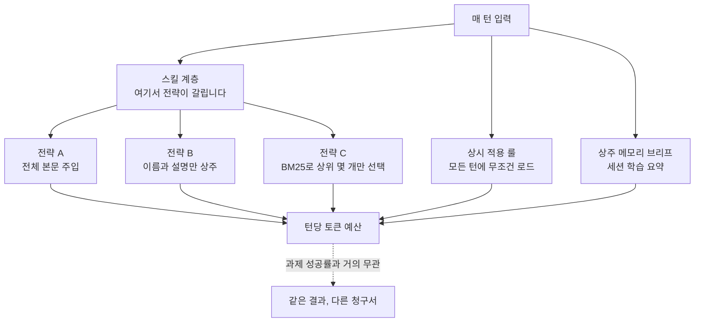

에이전트 비용이 예상을 넘으면 가장 먼저 검토하는 것은 보통 모델입니다. 더 싼 모델로 갈아타거나, 더 작은 모델로 내려가는 선택을 먼저 떠올립니다. 그런데 2026년 7월 29일에 Composio가 공개한 측정은 그 순서가 뒤바뀌어 있을 수 있다고 말합니다. 모델을 고정하고 하네스만 바꿨는데 같은 과제의 토큰 청구서가 몇 배로 벌어졌습니다.

## 왜 읽어야 하나

이 글은 코딩 에이전트나 사내 에이전트 플랫폼의 토큰 비용을 실제로 책임지는 플랫폼 엔지니어와, 모델 교체 여부를 결정해야 하는 분을 위해 썼습니다. 결론부터 말씀드리면, 모델을 바꾸기 전에 하네스의 상주 비용을 재 보셔야 합니다. Composio의 측정에서 성공률은 세 하네스가 거의 붙었는데 중위 토큰 소비는 61k와 340k로 갈렸고, 저희가 같은 질문을 자체 하네스에 던져 직접 셌을 때는 선택 계층을 켜고 끄는 것만으로 턴당 예산이 45배에서 66배까지 움직였습니다. 더 중요한 것은 그다음입니다. 라우팅을 켠 뒤 남는 예산의 96.7퍼센트는 스킬이 아니라 상시 적용 룰이었습니다. 비용을 깎을 지점은 대부분의 사람이 쳐다보는 곳에 없었습니다.


## 개요

Composio는 Kimi K3 하나를 세 개의 에이전트 하네스에 태웠습니다. Claude Code, Hermes, Kimi Code입니다. 과제는 28개이고 세 하네스에 동일하게 주어졌습니다. 모델이 고정되어 있으므로 결과의 차이는 모델 능력이 아니라 하네스가 만드는 차이입니다.

성공률은 서로 붙었습니다. Kimi Code가 28건 중 22건, Hermes가 21건, Claude Code가 20건에서 21건입니다. Claude Code 수치는 인용하는 곳에 따라 20과 21로 갈리므로 범위로 적었습니다. 어느 쪽이든 결론은 같습니다. 세 하네스는 같은 모델로 비슷한 비율의 과제를 끝냈습니다.

갈린 것은 비용입니다. 중위 과제 하나가 Kimi Code에서 61k 토큰, Hermes에서 67k 토큰, Claude Code에서 340k 토큰을 썼습니다. 중위값 기준으로 5.6배 차이이고, Composio는 개별 과제에서 최대 30배까지 벌어졌다고 밝혔습니다. 시간은 또 다른 순서로 배열됩니다. 중위 소요 시간은 Hermes가 179초, Kimi Code가 297초, Claude Code가 348초입니다. 토큰이 가장 적은 하네스가 가장 빠른 하네스는 아니었습니다.

같은 팀이 며칠 앞서 공개한 측정을 겹쳐 보면 이 결과의 의미가 조금 더 선명해집니다. 14개 과제로 구성한 에이전틱 벤치마크에서 K3는 Claude Fable 5와 통과 9건, 실패 5건까지 같았습니다. 가격은 Fable 5가 입력 100만 토큰당 10달러이고, K3는 API 접근이 100만 토큰당 3달러이며 가중치를 내려받아 자체 호스팅할 수 있습니다. 즉 오픈웨이트 모델이 능력 면에서 따라붙은 상황에서, 남은 비용 변수의 상당 부분이 모델 밖에 있다는 이야기가 됩니다.

## 하네스는 무엇을 하는가

하네스는 모델을 감싸는 계약의 총합입니다. 시스템 프롬프트, 도구 정의, 라우팅 규칙, 컨텍스트 관리 정책, 출력 검증 게이트가 여기에 들어갑니다. 모델은 매 턴 이 계약 전체를 입력으로 다시 받습니다. 그래서 하네스가 두꺼우면 과제가 쉬워도 청구서가 두꺼워집니다.

토큰이 어디서 발생하는지를 계층으로 갈라 보면 이렇습니다.



스킬 계층에서 전략이 갈리는 부분이 핵심입니다. 스킬을 수천 개 갖춘 하네스가 그 본문을 전부 컨텍스트에 넣으면 모델은 매 턴 도서관 전체를 읽습니다. 이름과 설명만 상주시키면 목록만 읽습니다. 검색기로 상위 몇 개만 고르면 필요한 몇 권만 읽습니다. 세 전략은 같은 과제를 같은 확률로 끝내면서 전혀 다른 비용을 청구합니다.


## 저희 하네스를 직접 재 봤습니다

Composio의 측정은 하네스를 바꿨습니다. 저희는 반대로 하네스를 하나로 고정하고, 그 하네스의 상주 비용이 어느 계층에서 나오는지를 셌습니다. 남의 벤치마크 숫자를 옮겨 적는 것보다 자기 시스템을 재는 편이 실무에 쓸모가 있기 때문입니다.

측정은 읽기 전용이고 네트워크를 쓰지 않습니다. 토크나이저는 추정치가 아니라 실제 BPE인 tiktoken의 `cl100k_base`를 썼습니다. 재현 가능성을 위해 격리된 git worktree에 HEAD를 체크아웃해 그 사본을 셌고, 같은 스크립트를 라이브 작업 트리에도 한 번 더 돌렸습니다.

```bash
# 격리된 worktree에 HEAD 체크아웃
bash scripts/blog/impl_sandbox.sh setup agent-harness-token-economics

# 계층별 토큰 계수 (읽기 전용, tiktoken cl100k_base)
.venv/bin/python scripts/blog/_harness_token_tax_20260730.py \
  --root /tmp/thaki-blog-sandboxes/blog-agent-harness-token-economics --k 6

# 라이브 트리와 대조
.venv/bin/python scripts/blog/_harness_token_tax_20260730.py \
  --root /Users/hanhyojung/thaki/ai-platform-strategy --k 6

bash scripts/blog/impl_sandbox.sh teardown agent-harness-token-economics
```

스크립트가 세는 계층은 네 개입니다. 매 턴 무조건 로드되는 상시 룰, 스킬의 이름과 설명으로 이루어진 인덱스, 스킬 본문 전체, 그리고 상주 메모리 브리프입니다. 여기에 검색기가 상위 여섯 개를 골랐을 때의 최악 비용을 더했습니다. 최악을 잡은 이유는 낙관적으로 세지 않기 위해서입니다. 가장 설명이 긴 카드 여섯 개가 선택됐다고 가정했습니다.

## 실제 실험 결과

캡처한 수치입니다. 왼쪽이 격리 체크아웃, 오른쪽이 라이브 작업 트리입니다. 라이브 트리에는 플러그인으로 설치된 스킬이 더 들어 있어 규모가 큽니다.

| 계층 | 격리 체크아웃 | 라이브 트리 |
|---|---|---|
| 상시 적용 룰 | 59개 파일, 93,570 토큰 | 동일 |
| 스킬 개수 | 1,970개 | 2,931개 |
| 스킬 인덱스, 이름과 설명만 | 300,526 토큰 | 436,516 토큰 |
| 스킬 본문 전체 | 4,332,223 토큰 | 6,389,650 토큰 |
| 상주 메모리 브리프 | 0 토큰 | 1,541 토큰 |
| 검색기 상위 6개, 최악 | 3,188 토큰 | 3,276 토큰 |

격리 체크아웃에서 상주 메모리가 0으로 나온 것은 그 파일이 생성물이라 커밋되지 않기 때문입니다. 실제 세션에서의 값은 라이브 트리 쪽 1,541 토큰이고 원문은 3,254자입니다.

세 전략의 턴당 예산으로 정리하면 이렇게 됩니다. 전략 A는 스킬 본문을 전부 주입하는 경우, B는 인덱스만 상주시키는 경우, C는 검색기로 상위 여섯 개만 고르는 경우입니다.


격리 체크아웃에서 A는 4,425,793 토큰, B는 394,096 토큰, C는 96,758 토큰입니다. A와 B의 비는 11.2배이고, A와 C의 비는 45.7배입니다. 라이브 트리에서는 규모가 커지면서 격차가 더 벌어집니다. A가 6,484,761 토큰, B가 531,627 토큰, C가 98,387 토큰이고, A와 C의 비는 65.9배입니다.

여기서 눈에 띄는 것은 C의 절대값이 두 트리에서 거의 움직이지 않는다는 사실입니다. 스킬을 1,970개에서 2,931개로 절반 가까이 늘렸는데 라우팅 후 예산은 96,758에서 98,387로 1.7퍼센트만 올랐습니다. 선택 계층이 붙어 있으면 스킬 자산을 늘리는 비용이 상수에 가깝게 유지됩니다. 반대로 선택 없이 본문을 주입하는 전략에서는 스킬을 늘린 만큼 매 턴 비용이 그대로 따라 올라갑니다.

그리고 예상하지 못한 결과가 하나 나왔습니다. C 예산의 내부 구성을 보면 상시 적용 룰이 격리 체크아웃에서 96.7퍼센트, 라이브 트리에서 95.1퍼센트를 차지합니다. 라우팅으로 고른 스킬 카드는 3천 토큰대이고, 룰은 9만 3천 토큰대입니다. 즉 선택 계층을 제대로 붙여 놓은 하네스에서 남은 비용의 정체는 스킬이 아니라 룰입니다. 스킬 개수를 줄이는 최적화는 이미 라우팅이 해결한 문제를 다시 만지는 일이고, 실제로 깎을 수 있는 살은 상시 룰 쪽에 있었습니다.

무게가 큰 룰 파일도 같이 확인했습니다. 가장 무거운 다섯 개가 5,331 토큰, 3,631 토큰, 3,497 토큰, 3,398 토큰, 3,395 토큰입니다. 상위 다섯 개만 합쳐도 1만 9천 토큰이 넘고, 이는 라우팅된 스킬 카드 전체의 여섯 배에 가깝습니다. 스킬 설명 쪽에서 가장 긴 카드는 603 토큰이었습니다. 한 계층에서 아끼려고 애쓰는 몇백 토큰과 다른 계층에서 새는 몇천 토큰이 같은 예산 안에 섞여 있었습니다.


## ThakiCloud 제품 적용 시사점

이 주제는 에이전트와 스킬 오케스트레이션에 걸려 있으므로 Paxis 렌즈로 보는 것이 맞습니다. Paxis는 ThakiCloud의 Agent-Native Cloud 제어 평면이고, Skills와 Tools, Policies, Audit Logs를 일급 리소스로 다룹니다. 이번 측정은 그 설계 결정 하나의 값을 숫자로 만들어 줬습니다.

Paxis의 Skill Harness는 스킬을 전부 컨텍스트에 밀어 넣지 않고 BM25로 후보를 골라 넣습니다. 이 선택 계층이 없다면 위 표의 A 열이 매 턴 청구되고, 스킬 자산을 늘릴수록 운영비가 선형으로 따라 오릅니다. 선택 계층이 있으면 C 열이 청구되고, 스킬을 절반 가까이 늘렸을 때 예산 증가가 1.7퍼센트에 머물렀습니다. 스킬 카탈로그를 제품 자산으로 계속 키우겠다는 결정과 턴당 비용을 억제하겠다는 결정이 충돌하지 않게 만드는 부분이 정확히 여기입니다.

동시에 이번 결과는 저희 자신에게 숙제를 하나 남겼습니다. 라우팅 이후 남은 비용의 95퍼센트가 상시 룰이라면, 토큰 다이어트의 대상은 스킬 목록이 아니라 룰 계층입니다. 매 턴 로드되는 규칙에는 매 턴 값을 지불할 만한 문장만 남아야 하고, 특정 작업에서만 필요한 지식은 온디맨드로 내려가야 합니다. 이 판단 기준 자체는 저희가 이미 룰로 명문화해 두었지만, 이번처럼 실제 BPE로 계층을 세어 보기 전까지는 어느 계층이 실제 병목인지 근거 없이 짐작하고 있었습니다.

인프라 쪽 렌즈도 한 줄 겹칩니다. Composio의 측정에서 K3가 오픈웨이트로 상용 모델과 통과 실패 패턴까지 같았고 자체 호스팅이 가능하다는 점은, ai-platform이 K8s와 Kueue GPU 위에서 vLLM으로 모델을 직접 서빙해 온 방향과 맞물립니다. 모델 능력이 평준화되는 구간에서 남는 경쟁 변수는 서빙 비용과 하네스 효율입니다. 앞쪽은 ai-platform이, 뒤쪽은 Paxis가 담당하는 문제입니다.

## 한계 및 반론

먼저 Composio의 측정은 과제 28개 규모입니다. 성공률 22, 21, 20에서 21의 차이는 이 표본에서 통계적으로 의미 있다고 말하기 어렵고, Composio도 성공률이 비슷했다는 쪽으로 결론을 냈습니다. 토큰 격차는 규모가 커서 표본 문제에 덜 민감하지만, 과제 구성이 달라지면 순서가 바뀔 수 있습니다.

토큰이 많다는 사실 자체가 하네스의 결함이라고 단정할 수도 없습니다. 컨텍스트를 넉넉히 채우는 하네스는 더 어려운 과제나 더 긴 세션에서 유리할 수 있고, 이번 28개 과제가 그 이점이 드러나는 난이도가 아닐 가능성이 있습니다. 시간 지표가 토큰 순서와 어긋난 것도 이 방향의 힌트로 읽을 수 있습니다. 캐시 적중률이 붙으면 청구액 기준 격차는 토큰 격차보다 작아지기도 합니다.

저희 측정에도 경계가 있습니다. 이것은 상주 입력 계층의 정적 계수이고, 실제 세션에서 발생하는 도구 출력과 대화 누적, 캐시 적중률은 포함하지 않았습니다. 따라서 A, B, C의 비는 하네스 설계가 만드는 상주 비용의 비이지 실제 청구서의 비가 아닙니다. 검색기 상위 여섯 개는 최악 가정으로 계산했으므로 실제 평균은 이보다 낮습니다. 스킬 개수를 셀 때 라이브 트리에는 같은 스킬이 여러 경로에 설치된 중복이 섞여 있어, 2,931이라는 숫자는 고유 스킬 수가 아니라 발견된 정의 파일 수로 읽으셔야 합니다.

마지막으로 이 측정은 한 저장소의 한 하네스입니다. 96.7퍼센트라는 비율은 저희 룰 계층이 두껍고 라우팅이 잘 붙어 있는 구성에서 나온 값이며, 룰이 얇고 스킬을 전부 주입하는 하네스에서는 정반대의 그림이 나옵니다. 옮겨 가야 하는 것은 숫자가 아니라 절차입니다.


## 정리

모델을 바꾸기 전에 하네스를 재 보셔야 한다는 것이 이 글의 결론입니다. Composio는 모델을 고정하고 하네스만 바꿔 같은 과제의 중위 토큰이 61k와 340k로 갈리는 것을 보였고, 성공률은 그 격차를 정당화해 주지 않았습니다. 저희는 하네스를 고정하고 계층을 갈라 세어, 선택 계층의 값이 45배에서 66배에 해당하고 그 계층을 켠 뒤에는 상시 룰이 남은 예산의 95퍼센트를 먹는다는 것을 확인했습니다.

실무로 옮기면 순서가 셋입니다. 먼저 자기 하네스의 상주 입력을 계층별로 실제 토크나이저로 세십니다. 추정하지 마시고 세십니다. 다음으로 가장 큰 계층부터 손대십니다. 대부분의 팀이 스킬이나 도구 개수를 먼저 줄이려 하지만, 선택 계층이 붙어 있다면 그쪽은 이미 상수에 가깝고 진짜 비용은 매 턴 무조건 로드되는 문서 쪽에 있습니다. 마지막으로 모델 교체는 이 두 단계를 끝낸 다음에 검토하십니다. 하네스에서 40배가 움직이는 동안 모델 단가에서 3배를 아끼려고 애쓰는 것은 순서가 뒤바뀐 일입니다.

저희가 쓴 계수 스크립트는 저장소에 남겨 두었습니다. 룰 디렉터리와 스킬 정의를 훑어 계층별 토큰을 세고 세 전략의 예산을 비교해 주므로, 구조가 비슷한 하네스라면 경로만 바꿔 그대로 돌려 보실 수 있습니다.


## 출처

- [Composio, Kimi K3를 세 하네스에 태운 28개 과제 측정](https://x.com/composio/status/2082452269522378858)
- [Composio, K3와 Claude Fable 5의 14개 과제 대조](https://x.com/composio/status/2082091871493574936)
- [GLM 5.2 vs Kimi K3, Composio](https://composio.dev/content/glm-vs-kimi)
- [moonshotai/Kimi-K3, Hugging Face](https://huggingface.co/moonshotai/Kimi-K3)
- 저희 계수 결과 원본: `outputs/blog-impl/agent-harness-token-economics/run-1.log`, `run-2.log`
