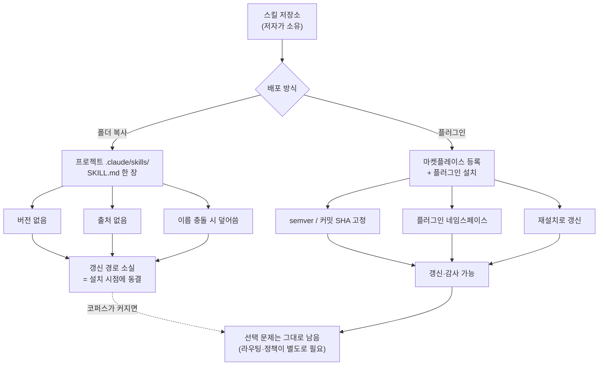

에이전트 스킬을 늘리는 가장 쉬운 방법은 남의 저장소에서 폴더를 복사해 오는 것입니다. 저희도 그렇게 했고, 그 결과 `.claude/skills` 아래에 1,909개의 디렉터리가 쌓였습니다. 이번에 그 트리를 처음으로 제대로 감사해 봤는데, 스킬의 82.7%가 SKILL.md 한 장짜리 복사본이었고 버전을 선언한 스킬은 88개, 출처를 선언한 스킬은 33개뿐이었습니다.


## 왜 읽어야 하나

이 글은 팀 단위로 Claude Code 스킬을 도입하고 관리하시는 플랫폼 엔지니어와, 자기 스킬을 남에게 배포하려는 도구 제작자를 위한 글입니다. 스킬을 하나 더 잘 쓰는 방법이 아니라, 스킬이 수백 수천 개로 늘어난 다음에 그 더미를 어떻게 소유할 것인가를 다룹니다. 핵심 결론을 먼저 말씀드리면 이렇습니다. 스킬의 병목은 품질이 아니라 배포입니다. 폴더 복사는 설치 시점의 스냅샷만 남기고 갱신 경로와 출처를 모두 버리기 때문에, 코퍼스가 커질수록 감사와 갱신이 동시에 불가능해집니다. 플러그인 배포는 그중 갱신 경로와 이름 충돌 두 가지를 실제로 되돌려 주고, 나머지 문제인 선택과 통제는 여전히 각자의 하네스가 풀어야 합니다.

## 개요

Matt Pocock이 자신의 엔지니어링 스킬 모음을 Claude Code 플러그인으로 배포하기 시작했습니다. 이전에는 저장소를 클론해서 필요한 폴더를 각자 프로젝트로 복사하는 방식이었는데, 이제는 마켓플레이스를 등록하고 플러그인을 설치하는 방식으로 바뀌었습니다. 저장소의 이슈 트래커에는 스킬을 개별적으로 설치 가능한 플러그인으로 노출해 달라는 요청이 `tdd`를 시작점으로 올라와 있었고, 이번 배포가 그 방향의 답입니다.

이 소식 자체는 작습니다. 스킬 여덟 개짜리 저장소 하나의 배포 방식이 바뀐 것뿐입니다. 다만 저희에게는 이 변화가 미뤄 둔 질문을 다시 꺼내게 했습니다. 저희는 지난 몇 달 동안 좋아 보이는 스킬을 발견할 때마다 폴더째 복사해 왔습니다. 그렇게 모은 코퍼스가 지금 어떤 상태인지, 그중 몇 개를 원본과 대조하거나 갱신할 수 있는지 한 번도 세어 본 적이 없었습니다.


그래서 감상 대신 감사를 돌렸습니다. 격리된 git worktree에서 읽기 전용 스크립트로 스킬 트리 전체를 훑어, 각 스킬이 버전을 선언하는지, 출처를 선언하는지, 마지막으로 손댄 지 얼마나 됐는지를 집계했습니다. 결과는 예상보다 나빴습니다.

## 이 도구는 무엇인가

Claude Code의 플러그인은 스킬과 서브에이전트, 훅, MCP 서버를 하나의 패키지로 묶은 배포 단위입니다. 마켓플레이스를 추가한 다음 플러그인을 설치하면 그 안에 들어 있는 것들이 한 번에 활성화됩니다. 폴더 복사와 비교했을 때 실질적인 차이는 세 가지입니다.

첫째는 네임스페이스입니다. 플러그인으로 들어온 스킬은 플러그인 이름을 붙여서 호출합니다. `my-tools` 플러그인의 리뷰 스킬은 `/my-tools:review`가 되고, 다른 저자가 만든 `review` 스킬과 절대 충돌하지 않습니다. 폴더 복사에서는 같은 이름을 가진 스킬이 서로를 덮어씁니다.

둘째는 버전 고정입니다. `.claude/settings.json`에서 플러그인 버전을 고정할 수 있고, 카탈로그 쪽에서는 특정 커밋 SHA로, 매니페스트 쪽에서는 semver 문자열로 각각 핀을 박을 수 있습니다. 두 층 모두에서 고정이 가능하다는 점이 중요합니다. 저자가 스킬을 바꿔도 우리 쪽 동작이 조용히 달라지지 않습니다.

셋째는 갱신입니다. 현재 플러그인 시스템은 기본적으로 자동 갱신을 하지 않고 재설치로 최신 버전을 받아 오는 구조입니다. 마켓플레이스별로 자동 갱신을 켜면 시작 후 백그라운드에서 갱신이 이뤄집니다. 어느 쪽이든 폴더 복사에는 아예 존재하지 않던 경로입니다.


Matt Pocock의 플러그인에 들어 있는 스킬은 실무 워크플로에 붙는 것들입니다. 계획이나 설계를 물고 늘어지며 캐묻는 `grill-me`, 같은 일을 하면서 ADR과 용어집까지 만들어 주는 `grill-with-docs`, 코드베이스를 훑어 개선 기회를 HTML 리포트로 뽑는 `improve-codebase-architecture`, 그리고 `tdd`와 도메인 모델링 계열이 함께 들어 있습니다. 설치 후에는 `/setup-matt-pocock-skills`를 한 번 돌려서 이슈가 어디에 있는지, 트리아지 라벨은 무엇을 쓰는지, CONTEXT.md가 하나인지 모노레포 구조인지를 알려 줘야 합니다.



## 설치 및 통합

실제 설치 명령은 두 줄입니다. 마켓플레이스를 추가하고 플러그인을 설치합니다.

```bash
claude plugin marketplace add mattpocock/skills
claude plugin install mattpocock-skills@mattpocock --scope project
```

`--scope project`는 이 설치를 현재 프로젝트에 묶습니다. 팀이 같은 저장소를 쓴다면 설정 파일이 함께 커밋되므로 모두가 같은 버전을 받습니다. 설치 후 부트스트랩은 에이전트 안에서 실행합니다.

```
/setup-matt-pocock-skills
```

저희 환경에서는 이 설치를 실제로 실행하지 않았습니다. 이미 같은 스킬들이 몇 달 전에 복사본 형태로 들어와 있어서, 지금 플러그인을 겹쳐 설치하면 어느 쪽이 호출되는지 확인하기 어려워지기 때문입니다. 대신 그 복사본들이 지금 어떤 상태인지를 측정했습니다. 아래 감사 스크립트는 읽기 전용이며 격리된 worktree에서 돌렸습니다.

```bash
bash scripts/blog/impl_sandbox.sh setup claude-code-skill-plugin-distribution
bash scripts/blog/impl_sandbox.sh run claude-code-skill-plugin-distribution -- \
  python3 scripts/experiments/claude-code-skill-plugin-distribution/skill_supply_chain_audit.py \
  .claude/skills audit-detail.json
bash scripts/blog/impl_sandbox.sh teardown claude-code-skill-plugin-distribution
```

스크립트가 보는 것은 단순합니다. 스킬 디렉터리마다 SKILL.md가 있는지, 프런트매터에 `version` 계열 키가 있는지, `source`나 `repository`나 `license` 같은 출처 키가 있는지, 설명이 몇 글자인지, SKILL.md를 마지막으로 쓴 지 며칠이 지났는지를 셉니다.

## 실제 실험 결과

감사 대상은 저희 저장소의 `.claude/skills` 트리입니다. 디렉터리 1,909개 중 1,897개에 SKILL.md가 있었고, 12개는 SKILL.md 없이 껍데기만 남아 있었습니다. 아래 수치는 SKILL.md가 있는 1,897개를 모수로 합니다.


| 항목 | 개수 | 비율 |
|---|---:|---:|
| SKILL.md 한 장짜리 단일 파일 스킬 | 1,569 | 82.7% |
| 설명이 512자 가이드를 넘김 | 1,004 | 52.9% |
| 60일 넘게 손대지 않음 | 750 | 39.5% |
| 버전 선언 | 88 | 4.6% |
| 출처 선언 (source/repo/license 등) | 33 | 1.7% |
| 프런트매터 `name` 중복 | 3 | 0.2% |

가장 눈에 띄는 숫자는 1.7%입니다. 1,897개 스킬 중 33개만이 자기가 어디서 왔는지를 파일 안에 남기고 있습니다. 나머지 1,864개는 원본 저장소가 어디인지, 라이선스가 무엇인지, 그 뒤로 저자가 무엇을 고쳤는지를 파일만 봐서는 알 수 없습니다. 버전 선언 4.6%도 같은 이야기의 다른 면입니다. 갱신하려면 먼저 지금 무엇을 갖고 있는지 알아야 하는데, 그 정보가 없습니다.

마지막 수정 시각의 중앙값은 60.0일, 90분위는 75.6일이었습니다. 60일 넘게 아무도 손대지 않은 스킬이 750개입니다. 이 수치는 드리프트의 대리 지표일 뿐이며, 손대지 않았다는 것이 곧 낡았다는 뜻은 아닙니다. 다만 원본이 그동안 얼마나 바뀌었는지 확인할 방법 자체가 없다는 점이 문제입니다.

이번 소식의 당사자인 스킬들을 따로 뽑아 보면 상황이 더 분명해집니다.

| 스킬 | 파일 수 | 버전 | 출처 | 마지막 수정 |
|---|---:|---|---|---:|
| grill-me | 1 | 없음 | 없음 | 75.6일 |
| improve-codebase-architecture | 1 | 없음 | 없음 | 75.6일 |
| domain-model | 1 | 없음 | 없음 | 75.6일 |
| dev-story | 1 | 없음 | 없음 | 75.6일 |
| ubiquitous-language | 1 | 없음 | 없음 | 75.6일 |
| tdd | 1 | 없음 | 없음 | 39.0일 |
| grill-with-docs | 1 | 없음 | 없음 | 17.2일 |
| code-review | 1 | 없음 | 없음 | 17.2일 |


여덟 개 모두 SKILL.md 한 장이고, 버전도 출처도 없습니다. 다섯 개는 같은 날 복사된 뒤 75.6일 동안 그대로였습니다. 저자가 그 사이에 스킬을 고쳤는지 저희는 모릅니다. 지금 플러그인으로 설치하면 이 여덟 개는 네임스페이스가 붙은 별개의 스킬로 들어오고, 기존 복사본은 옆에 그대로 남아 같은 일을 하는 두 벌이 됩니다. 정리 없이 설치만 하면 코퍼스는 오히려 더 나빠집니다.

한 가지 더 계산해 봤습니다. 스킬 이름과 설명을 모두 합치면 1,091,058자이고, 대략 311,000 토큰 규모입니다. 실제로 매 세션에 이 전체가 들어가지는 않습니다. 저희는 BM25 기반 라우터로 상위 후보만 뽑아 쓰고 있고, 그렇기 때문에 이 규모가 유지됩니다. 다만 설명 절반 이상이 권장 512자를 넘긴다는 사실은 인덱스 쪽에 여유가 없다는 신호입니다. 라우터 벤치에서 BM25 단독은 Recall@5 84.4%에 Top-1 33.3%였고, 임베딩을 섞은 하이브리드에서 각각 91.1%와 53.3%로 올라갔습니다. 설명이 길고 서로 겹칠수록 이 숫자를 끌어올리기가 어려워집니다.


## ThakiCloud 제품 적용 시사점

이 문제는 저희가 Paxis를 만들면서 계속 부딪히는 지점과 정확히 같습니다. Paxis는 ai-platform 위에서 도는 Agent-Native Cloud 제어 평면이고, 스킬과 도구, 정책, 감사 로그를 일급 리소스로 다룹니다. 스킬을 일급 리소스로 취급한다는 말의 실제 의미가 이번 감사에서 드러났습니다. 스킬은 코드가 아니라 의존성입니다. 의존성이라면 어디서 왔고 어떤 버전이며 언제 갱신됐는지를 알 수 있어야 합니다.


플러그인 배포는 이 중 배포와 이름 충돌을 표준화된 방식으로 해결합니다. 저희 쪽에서 남는 몫은 그 위의 두 층입니다. 하나는 선택입니다. 스킬이 1,897개면 사람이 고를 수 없고, Skill Harness가 BM25로 후보를 좁힌 뒤 필요한 것만 컨텍스트에 올립니다. 다른 하나는 통제입니다. 외부에서 들어온 스킬이 무엇을 실행할 수 있는지는 정책 게이트가 정하고, 실제로 무엇을 했는지는 감사 로그가 남깁니다. 격리 샌드박스에서 실행하는 구조도 같은 이유에서 나왔습니다. 이번 글의 실험 자체가 격리된 worktree에서 돌아간 것이 그 축소판입니다.

인프라 쪽 시사점도 있습니다. 스킬 코퍼스가 커질수록 라우팅 품질이 곧 토큰 비용이 됩니다. 잘못 고른 스킬 하나는 컨텍스트를 늘리고 재시도를 부릅니다. ai-platform에서 멀티테넌트로 에이전트를 돌릴 때 이 비용은 테넌트 수만큼 곱해집니다. 그래서 저희는 라우터 개선을 모델 등급을 올리는 일보다 먼저 놓습니다. 하이브리드 리랭크로 Top-1을 33.3%에서 53.3%로 올린 작업이 그 결정의 결과였습니다.

## 한계 및 반론

이 감사에는 분명한 한계가 있습니다. 마지막 수정 시각은 드리프트의 대리 지표이지 드리프트 자체가 아닙니다. git 체크아웃은 파일 mtime을 갱신하므로 worktree 안에서 잰 값은 전부 0으로 나옵니다. 위 표의 나이 수치는 그래서 worktree가 아니라 라이브 트리 기준입니다. 같은 이유로 다른 환경에서 이 스크립트를 돌리면 나이 관련 수치는 재현되지 않을 수 있습니다.

버전과 출처 키의 부재를 결함으로 보는 것도 하나의 관점입니다. SKILL.md 스펙이 이 키들을 요구하지 않으므로, 없다고 해서 규격 위반은 아닙니다. 다만 규격이 요구하지 않기 때문에 아무도 넣지 않았고, 그 결과 코퍼스 전체가 감사 불가능해졌다는 점이 이 글의 주장입니다.

플러그인 배포가 만능도 아닙니다. 네임스페이스는 이름 충돌을 막아 주지만 의미 중복은 막지 못합니다. 서로 다른 저자의 `tdd` 두 개가 나란히 설치되면 라우터는 여전히 둘 중 하나를 골라야 합니다. 자동 갱신은 기본이 아니고, 켜 두면 이번에는 통제되지 않은 변경이 배포 경로로 들어옵니다. 커밋 SHA 고정이 있는 이유가 그것입니다. 그리고 플러그인으로 옮긴다고 해서 기존 복사본이 사라지지는 않습니다. 저희처럼 이미 1,569개의 단일 파일 복사본을 쌓아 둔 쪽에서는 마이그레이션이 곧 삭제 작업입니다.

## 정리

폴더를 복사해서 스킬을 늘리는 방식은 스무 개까지는 잘 동작합니다. 1,897개가 되면 무엇을 가져왔는지도, 언제 가져왔는지도, 원본이 그 뒤로 어떻게 바뀌었는지도 알 수 없게 됩니다. 저희 감사에서 그 상태를 숫자로 확인했습니다. 82.7%가 한 장짜리 복사본이고, 갱신의 전제 조건인 버전은 4.6%, 출처는 1.7%뿐이었습니다.

서두에 말씀드린 결론은 그대로입니다. 스킬의 병목은 품질이 아니라 배포입니다. 플러그인 배포는 갱신 경로와 이름 충돌을 표준으로 되돌려 주고, 남는 선택과 통제 문제는 라우터와 정책 게이트가 맡습니다. Matt Pocock의 배포가 의미 있는 이유도 스킬이 더 좋아져서가 아니라, 같은 스킬을 이제 소유할 수 있는 형태로 받을 수 있게 됐기 때문입니다.

다음에 스킬을 하나 들여오실 때 한 가지만 확인해 보시기를 권합니다. 여섯 달 뒤에 이 스킬을 갱신하려면 무엇을 봐야 하는지 지금 답할 수 있는지입니다. 답이 나오지 않으면 그 스킬은 도입한 것이 아니라 붙여 넣은 것입니다. 저희의 다음 작업은 단일 파일 복사본 중 원본을 특정할 수 있는 것부터 플러그인 설치로 바꾸고, 대체된 복사본을 지우는 일입니다.

## 출처

- [mattpocock/skills: README](https://github.com/mattpocock/skills/blob/main/README.md)
- [mattpocock/skills: 개별 스킬을 플러그인으로 노출해 달라는 이슈 #138](https://github.com/mattpocock/skills/issues/138)
- [mattpocock-skills 플러그인 페이지](https://claudeskills.info/plugins/mattpocock/skills/mattpocock-skills/)
- [Setup Matt Pocock Skills 커맨드 설명](https://claudemarketplaces.com/skills/mattpocock/skills/setup-matt-pocock-skills)
- [Claude Code 공식 문서: 마켓플레이스에서 플러그인 찾고 설치하기](https://code.claude.com/docs/en/discover-plugins)
- [Claude Code Plugins: From Personal Setup to Org Standard](https://claudefa.st/blog/tools/mcp-extensions/plugins-distribution)
- 감사 스크립트와 원시 로그: `scripts/experiments/claude-code-skill-plugin-distribution/skill_supply_chain_audit.py`, `outputs/blog-impl/claude-code-skill-plugin-distribution/run-1.log` ~ `run-3.log`
