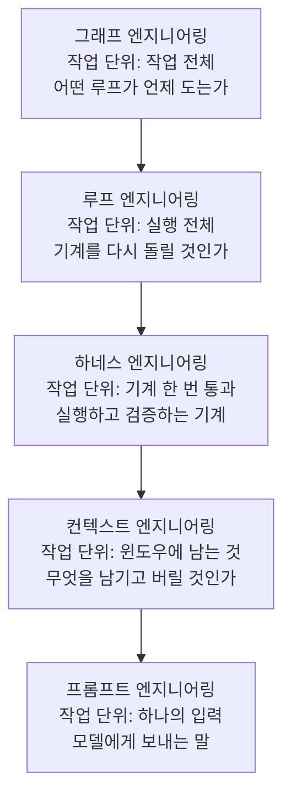

프롬프트 엔지니어링으로 시작된 명명 시리즈가 또 하나 늘었습니다. 컨텍스트, 하네스, 루프를 지나 이제 그래프 엔지니어링입니다. DailyDoseOfDS의 Akshay Pachaar가 2026년 7월 26일에 올린 스레드와 아티클은 이 유행어가 밈인지 실체인지를 가르는 정리로 읽힙니다. 원문에 따르자면 7월 18일에 Peter Steinberger가 "아직 루프 이야기를 하는가, 아니면 이미 그래프로 넘어갔는가"라고 물었고, 몇 시간 뒤 Hamel Husain이 "루프 엔지니어링은 죽었다, 그래프 엔지니어링의 등장"이라는 글을 낸 것이 발단입니다. 둘 다 절반은 농담이었지만, 농담이 앉은 자리는 실제입니다. 루프가 여러 개가 되어 함께 일해야 하는 순간 조정 문제가 생기고, 공학자들이 조정을 기술해 온 도구가 그래프이기 때문입니다.


*계층이 겹쳐질수록 작업 단위가 커집니다. 하나의 입력에서 출발해 작업 전체까지.*

## 왜 읽어야 하나

이 글은 하나의 에이전트 루프를 넘어 여러 에이전트를 함께 돌리는 시스템을 설계해야 하는 플랫폼 엔지니어와, LangGraph 같은 그래프 프레임워크의 도입 여부를 판단해야 하는 분을 위해 썼습니다. 결론부터 말씀드리면, 그래프 엔지니어링은 새로운 기술이 아니라 하나의 루프로 충분하지 않아졌을 때 조정 자체가 엔지니어링 문제가 된다는 사실에 붙은 이름이고, 그래서 대부분의 경우에는 그래프 없이 루프에 머무는 것이 정답이라는 것입니다.

## 개요

원문 아티클이 주장하는 뼈대는 세 개입니다. 첫째, 그래프는 루프를 대체하는 것이 아니라 루프를 연결하고 통제합니다. 둘째, 프롬프트에서 그래프까지의 다섯 계층은 각각 앞 계층을 감싸며, 계층을 구분하는 가장 깨끗한 방법은 그 계층의 작업 단위가 무엇인지 묻는 것입니다. 셋째, 이 실천은 새 것이 아닙니다. LangGraph가 노드와 엣지, 공유 상태라는 정확히 이 모델을 2024년 1월에 출시했고, Microsoft의 AutoGen에는 GraphFlow가 있으며, Google은 ADK 2.0의 워크플로 런타임을 같은 아이디어 위에 세웠습니다. 이름이 새로울 뿐이라는 점을 인정하고 나면 남는 질문은 하나입니다. 원문이 전하는 반응이 이 분위기를 잘 보여 줍니다. Hamel Husain의 글에 달린 최고 인기 답글이 "다시 오신 것을 환영합니다, LangChain"이었다는 것입니다. 언제 그래프를 쓰고, 어떻게 썩지 않게 유지하는가. 원문은 그 답을 네 가지 어려운 문제로 정리했고, 이 글은 그 구조를 따라가면서 Anthropic과 Cognition이 공개한 수치와 사례로 보강합니다.

## 이 기술은 무엇인가

그래프는 세 가지로 이루어집니다. 노드는 일의 단위입니다. 에이전트일 수도 있고, 단순한 모델 호출, 결정적 함수, 도구, 승인하는 사람일 수도 있습니다. 엣지는 다음에 무엇이 실행될지를 결정합니다. 순차로, 병렬로, 혹은 직전 노드가 생산한 것을 조건으로 갈라집니다. 상태는 엣지를 따라 흐르는 공유 객체이고, 모든 노드가 이 객체를 읽고 씁니다.

원문이 예로 든 스타터 그래프는 거의 모든 튜토리얼이 쓰는 형태입니다.

```python
graph.add_node("research", research_agent)
graph.add_node("write", writer_agent)
graph.add_node("review", reviewer_agent)
graph.add_edge("research", "write")
graph.add_edge("write", "review")
graph.add_conditional_edge("review", lambda state: "done" if state.approved else "write")
```

리서처가 자료를 모으고, 라이터가 초안을 쓰고, 리뷰어가 판정합니다. 리뷰가 통과하면 실행이 끝나고, 실패하면 엣지가 초안을 라이터에게 되돌립니다. 노드 셋, 엣지 넷, 그리고 그중 하나가 루프입니다.

여기서 시야가 바뀌는 지점이 나옵니다. 단일 에이전트 루프는 자기 자신을 가리키는 엣지 하나를 가진 단일 노드 그래프입니다. 그래프는 루프를 밀어내지 않고 루프 위에 올라섭니다. 그래서 아래 계층이 무너지면 그래프는 더 정교한 방식으로 실패할 뿐입니다.

## 다섯 계층의 스택과 작업 단위

원문 스레드가 제시하는 구분법은 계층마다 작업 단위를 묻는 것입니다.

프롬프트 엔지니어링의 작업 단위는 하나의 입력입니다. 모델은 이 호출 이전을 기억하지 못하므로 역할, 배경, 지시, 예시, 형식을 프롬프트 하나가 전부 실어 나릅니다. 컨텍스트 엔지니어링의 작업 단위는 윈도우에 남는 것입니다. 윈도우는 유한하고 정보는 무한하므로, 남길 것과 압축할 것과 버릴 것을 고르는 큐레이션이 일이 됩니다. 하네스 엔지니어링의 작업 단위는 기계 한 번 통과입니다. 모델을 감싸 필요한 것을 모으고, 실행하고, 도구를 부르고, 테스트나 심판으로 검증하는 한 사이클입니다. 루프 엔지니어링의 작업 단위는 실행 전체입니다. 목표와 최대 반복과 예산 상한 같은 브레이크, 그리고 감이 아니라 자동화된 완료 검사가 여기에 속합니다. 그래프 엔지니어링의 작업 단위는 작업 전체입니다. 무엇이 언제 실행되는지, 무엇이 병렬로 도는지, 누가 누구를 검사하는지를 결정합니다.




*같은 그림을 손그림 boil 애니메이션으로 다시 그렸습니다. 레이아웃은 고정하고 선만 프레임마다 새로 그려 움직임을 만듭니다.*

각 계층은 앞 계층을 감쌉니다. 그래프는 루프로 만들어지고, 루프는 좋은 하네스를 필요로 하고, 하네스 호출은 컨텍스트 문제이고, 모든 컨텍스트는 프롬프트를 담고 있습니다. 이 구조는 디버깅 좌표이기도 합니다. 어느 계층의 작업 단위가 깨졌는지 찾아 그 계층을 고치면 됩니다. 원문의 지적대로 프롬프트는 편집이 가장 쉬운 계층이라, 실제로는 세 계층 위에 있는 실패의 책임을 자꾸 뒤집어씁니다.


*안쪽 원에서 바깥 원으로 갈수록 작업 단위가 커집니다. 입력 하나에서 작업 전체까지.*

## 네 가지 어려운 문제


*노드의 존재 자격, 공유 상태 위생, 라우팅 신뢰성, 에이전트 합의. 네 문제는 각각 다른 계층의 대응을 요구합니다.*

첫 번째는 노드가 존재할 자격을 아는 것입니다. 가장 흔한 실패는 "이 PDF를 요약해 줘"를 페처, 청커, 요약기, 리뷰어, 포매터의 다섯 노드 그래프로 바꾸는 일입니다. 노드는 다른 모델, 다른 도구 세트, 읽기 전용 리뷰어 같은 진짜 전문성을 대표할 때만 자리를 얻습니다. 기존 루프에 인라인할 수 있는 단계는 노드가 아닙니다. 원문의 필터는 두 개입니다. 냅킨에 그릴 수 없는 그래프는 너무 복잡하고, 두 노드를 하나로 접었을 때 잃는 것이 없다면 애초에 두 노드가 아니었습니다.

두 번째는 공유 상태를 깨끗하게 유지하는 것입니다. 루프에서의 병이 컨텍스트 부패였다면, 그래프에서는 같은 병이 공유 상태로 옮겨갑니다. 두 번째 노드의 성긴 쓰기가 다섯 번째 노드의 자신감 있는 입력이 되고, 출력이 틀리고 나서야 알게 되면 이미 잘못된 데이터가 시스템 절반을 지나간 뒤입니다. 핵심은 단순합니다. 상태에 타입이 있는 스키마를 주고, 어느 노드가 어느 필드에 쓸 수 있는지 명시하고, 노드 사이에 체크포인트를 둬서 실행을 리플레이할 수 있게 하는 것입니다. 주의할 점은 체크포인트 이후의 노드가 다시 실행되므로, 이메일 발송이나 레코드 생성처럼 외부 부수 효과가 있는 노드는 두 번 실행해도 안전해야 합니다.

세 번째는 신뢰할 수 있는 라우팅입니다. 엣지는 결정이고, 문제는 누가 그 결정을 내리느냐입니다. 모델이 경로를 정하면 유연성과 불안정성이 한 패키지로 옵니다. 같은 상태가 실행마다 다른 길을 가면 디버깅이 무너집니다. 원문이 인용하는 Google ADK 2.0의 설계 규칙이 가장 깨끗한 입장입니다. 예측 가능한 라우팅은 결정적 코드가 담당하고, 모델은 실제 판단이 필요한 단계만 처리해야 합니다. 조건을 검사할 수 있는 곳은 코드로 라우팅하고, 해석이 정말 필요한 곳에만 모델 호출을 쓰는 것입니다.

네 번째는 에이전트들이 서로 동의하게 되는 문제입니다. 루프 엔지니어링의 날카로운 규칙은 에이전트가 자기 숙제를 스스로 채점하게 하지 말라는 것이었습니다. 그래프는 판을 키웁니다. 같은 베이스 모델로 만든 에이전트 스무 개가 같은 결함 있는 컨텍스트를 읽으면 기꺼이 서로 동의하고, 모델은 자기 출력을 선호하는 경향이 측정됩니다. 결과는 산업 규모의 조직화된 헛소리, 완벽한 구조로 포장된 틀린 답입니다. 핵심은 이빨이 있는 리뷰어 노드입니다. 다른 모델로 돌리고, 전체 대화 대신 신선한 컨텍스트를 주고, 그래프가 날조할 수 없는 외부 증거에 판정을 고정합니다. 실제로 돌아간 테스트나 실제로 컴파일된 코드 같은 것입니다. Cognition도 코딩 에이전트 Devin을 1년 운영한 끝에 같은 자리에 도착했다고 원문은 전합니다. 여러 에이전트가 작업을 읽고 의견을 내지만, 변경은 오직 하나의 에이전트만 할 수 있게 하는 읽기 다수, 쓰기 하나 구조입니다. 읽기는 잘못된 의견의 비용이 행동으로 이어지기 전까지 0이라 병렬로 해도 안전하고, 쓰기는 피해가 발생하는 지점이라 한곳에 모아 보이게 유지하는 것입니다.

## 언제 그래프가 과도한가

정직한 답은 대부분의 경우라는 것입니다. Anthropic이 공개한 수치가 비용을 구체화합니다. 단일 에이전트는 채팅 상호작용의 대략 4배 토큰을 쓰고, 멀티에이전트 시스템은 대략 15배를 씁니다. 노드를 추가할 때마다 그 배수가 곱해집니다.


*Anthropic의 공개 수치 기준입니다. 노드가 늘 때마다 배수가 곱해지므로, 그래프 도입은 비용 결정이기도 합니다.*

천장도 실재합니다. 과제가 진짜로 병렬화될 때입니다. Anthropic의 멀티에이전트 리서치 시스템은 Claude Opus 4가 리드, Sonnet 4가 서브에이전트인 구성으로 단일 Opus 4 에이전트를 내부 리서치 평가에서 90.2퍼센트 앞섰습니다. 리서치는 자연스럽게 독립적인 검색으로 갈라지는 과제이기 때문입니다. 같은 글에서 Anthropic은 토큰 사용량만으로 BrowseComp 평가 성능 분산의 약 80퍼센트가 설명됐다고 밝힙니다. 멀티에이전트가 이기는 이유의 상당 부분은 영리한 분업이 아니라 문제에 더 많은 토큰을 쓰는 데 있다는 고백입니다. 그리고 Anthropic의 "Building effective agents"에서 변하지 않은 조언은 가장 단순한 해를 찾고 과제가 요구할 때만 복잡성을 더하라는 것입니다. LangGraph 자신의 안내조차 단순한 도구 장착 루프라면 LangGraph가 과잉이라고 말합니다.

원문의 결정 규칙은 이렇습니다. 일이 진짜 전문성으로 갈라지거나, 병렬 팬아웃과 조인이 필요하거나, 단계마다 다른 모델이 필요하거나, 실패 격리와 감사 가능한 라우팅이 필요할 때 그래프를 꺼내십니다. 그렇지 않으면 루프에 머무르십니다.

Anthropic이 멀티에이전트가 맞는 과제로 꼽은 조건은 이 규칙과 겹칩니다. 과제의 가치가 토큰 비용을 감당할 만큼 높고, 병렬화가 무겁고, 정보가 단일 컨텍스트 윈도우를 넘고, 다수의 복잡한 도구와 연결돼야 하는 경우입니다. 반대로 에이전트 전원이 같은 컨텍스트를 공유해야 하거나 서로 의존이 많은 영역은 아직 맞지 않는다고 못 박았고, 대부분의 코딩 작업이 여기에 가깝다고 덧붙였습니다. 운영상의 경고도 있습니다. Anthropic의 리서치 시스템은 리드 에이전트가 서브에이전트를 동기적으로 기다리는 구조라 한 서브에이전트가 끝날 때까지 전체가 멈추고, 이 병목을 풀 비동기 실행은 결과 조정과 상태 일관성, 오류 전파라는 새 문제를 데려옵니다. 그래프를 도입한다는 것은 이 클래스의 문제를 통째로 인수한다는 뜻입니다.

## 시작 가이드

첫날부터 에이전트 조직도가 필요하지 않습니다. 쌓아 올리면 됩니다. 먼저 단일 루프를 마스터합니다. 브레이크와 진짜 완료 검사와 비평가를 갖춘 루프입니다. 약한 루프로 만든 그래프는 분산된 실패일 뿐입니다. 코드를 쓰기 전에 그래프를 종이에 그리고, 모든 노드에게 존재 이유를 증명하라고 요구합니다. 상태 스키마와 쓰기 권한을 미리 정의합니다. 상태 드리프트가 그래프가 썩는 주된 경로입니다. 리뷰어 노드는 다른 모델과 신선한 컨텍스트로 만들고 외부 증거에 고정합니다. 마지막으로 모든 노드에 예산 상한을 둡니다. 그래프는 토큰을 병렬로 쓰는 여러 개의 루프이고, 약한 검증기는 이제 동시에 돈을 태웁니다.

## ThakiCloud 제품 적용 시사점

이 주제는 에이전트 오케스트레이션이므로 Paxis 렌즈로 보는 것이 맞습니다. Paxis는 ThakiCloud의 Agent-Native Cloud 제어 평면으로, Skills와 Tools, Policies, Audit Logs를 일급 리소스로 다룹니다. 위의 네 가지 문제가 Paxis의 설계 결정과 일대일로 맞물립니다.


*노드 팽창에는 Skill Harness, 라우팅 혼란에는 정책 게이트, 상태 드리프트에는 감사 로그, 맹목적 합의에는 샌드박스가 대응합니다.*

노드 세분성 문제는 Paxis의 Skill Harness와 닮아 있습니다. Skill Harness는 960개 이상의 스킬을 전부 컨텍스트에 넣지 않고 BM25로 후보를 골라 넣습니다. 원문의 필터인 "접었을 때 잃는 것이 없으면 하나다"와 같은 생각으로, 존재 이유가 없는 실행 단위를 미리 걸러냅니다. 라우팅 신뢰성 문제는 Paxis의 정책 게이트에 해당합니다. 예측 가능한 라우팅을 결정적 코드가 담당하라는 ADK의 규칙은, Paxis에서 에이전트의 행동이 정책 게이트를 결정론적으로 통과하는 구조와 같은 방향입니다. 모델 호출은 판단이 필요한 곳에 남기고, 검사 가능한 조건은 코드로 검사합니다.

공유 상태 위생과 합의 문제는 감사 로그와 샌드박스에 걸립니다. Paxis는 에이전트의 모든 행동을 감사 로그로 통과시키므로, 두 번째 노드의 성긴 쓰기가 다섯 번째 노드의 입력이 되는 사고를 사후에 추적할 수 있습니다. 샌드박스 격리 실행은 외부 부수 효과가 있는 노드의 반경을 제한하는 장치이고, DAG 멀티에이전트 실행에서 리뷰어 단계를 별도 모델과 별도 컨텍스트로 분리하는 것은 원문이 말한 이빨 있는 리뷰어 노드를 플랫폼 수준에서 구조화하는 일입니다. 원문이 나열한 도입 기준, 즉 진짜 전문성의 분할, 병렬 팬아웃, 실패 격리, 감사 가능한 라우팅은 Paxis가 제어 평면에서 이미 다루는 항목과 겹칩니다. 반대로 그 기준에 해당하지 않는 작업을 그래프로 올리지 않는 절제도 플랫폼이 도와야 하는 부분이고, 비용 관점에서는 노드마다 걸리는 예산 상한이 그 장치입니다.

## 한계 및 반론

먼저 이름 자체의 수명에 대한 의심이 있습니다. 원문도 인정하듯 이 분야는 스스로 이름을 바꾸는 속도가 빨라서, 그 이름 바꾸기를 조롱하는 것 자체가 하나의 장르가 됐습니다. 그래프 엔지니어링이라는 단어는 올해를 넘기지 못할 수 있습니다. 다만 하나의 루프로 충분하지 않을 때 조정이 엔지니어링이 된다는 설계 질문은 남습니다. 단어에 투자할 것이 아니라 질문에 투자해야 합니다.

수치의 일반화에도 경계가 있습니다. 90.2퍼센트는 Anthropic의 내부 리서치 평가 수치이고, 리서치처럼 너비 우선으로 갈라지는 과제에서 나온 값입니다. 코딩처럼 병렬화 가능한 조각이 적고 에이전트 간 의존이 많은 과제에서는 같은 배수가 성립하지 않는다고 Anthropic 스스로 밝혔습니다. 4배와 15배의 비용 배수도 과제 형태에 따라 달라지는 경험치입니다. 그리고 Cognition의 사례는 원문 아티클이 전한 요약이며, Cognition의 원래 글인 "Don't Build Multi-Agents"는 멀티에이전트의 취약성에 더 무게를 둔 글이라는 점을 같이 읽어야 균형이 맞습니다.

마지막으로 이 글은 원문 아티클의 분석을 옮기고 검증된 출처로 보강한 글이지, 저희가 그래프 프레임워크를 직접 돌려 측정한 글이 아닙니다. 네 가지 문제와 도입 기준은 저희 운영 경험과도 방향이 맞지만, 독자의 워크로드에 적용할 때는 그래프 도입 전후의 토큰 비용과 성공률을 직접 재 보시는 것이 맞습니다.

## 정리

그래프 엔지니어링은 루프 엔지니어링을 대체하는 새 학문이 아니라, 하나의 루프로 충분하지 않아지는 순간 모든 에이전트 제작자가 마주하는 결정에 붙은 이름입니다. 그래프는 노드와 엣지와 공유 상태로 이루어지고, 단일 루프는 자기 자신을 가리키는 엣지를 가진 단일 노드 그래프이므로, 그래프는 루프를 지배할 뿐 대체하지 않습니다. 다섯 계층은 작업 단위로 구분됩니다. 입력 하나, 윈도우에 남는 것, 기계 한 번 통과, 실행 전체, 그리고 작업 전체입니다. 어느 계층이 깨졌는지 이 좌표로 찾으면 됩니다. 실전의 어려움은 네 곳에 있습니다. 노드의 존재 자격, 공유 상태 위생, 코드와 모델 사이의 라우팅 분담, 그리고 다른 모델과 신선한 컨텍스트와 외부 증거로 무장한 리뷰어입니다.

독자가 가져갈 행동은 셋입니다. 먼저 지금 운영하는 에이전트가 원문의 도입 기준 네 가지, 진짜 전문성 분할, 병렬 팬아웃, 단계별 다른 모델, 실패 격리와 감사 가능한 라우팅 중 어느 것에 해당하는지 점검해 보십시오. 하나도 해당하지 않으면 루프에 머무르는 것이 정답이고, 그 결정이 15배의 토큰을 아낍니다. 해당한다면 코드 전에 종이에 그래프를 그리고, 노드 하나하나에 존재 이유를 물으십시오. 마지막으로 리뷰어 노드를 다른 모델과 신선한 컨텍스트, 외부 증거로 만드는 것을 첫날의 기본값으로 삼으십시오. 조정이 엔지니어링이 되는 지점은 그래프 프레임워크를 설치하는 곳이 아니라, 누가 누구를 검사하는지를 설계하는 곳에 있습니다.


*단어에 투자하지 말고 구조적 질문에 투자하십시오. 누가 누구를 검사하는지를 설계하는 곳이 출발점입니다.*

## 출처

- [Akshay Pachaar, Graph Engineering 스레드](https://x.com/akshay_pachaar/status/2081356379026280677)
- [Anthropic, How we built our multi-agent research system](https://www.anthropic.com/engineering/multi-agent-research-system)
- [Anthropic, Building effective agents](https://www.anthropic.com/research/building-effective-agents)
- [Cognition, Don't Build Multi-Agents](https://cognition.com/blog/dont-build-multi-agents)
