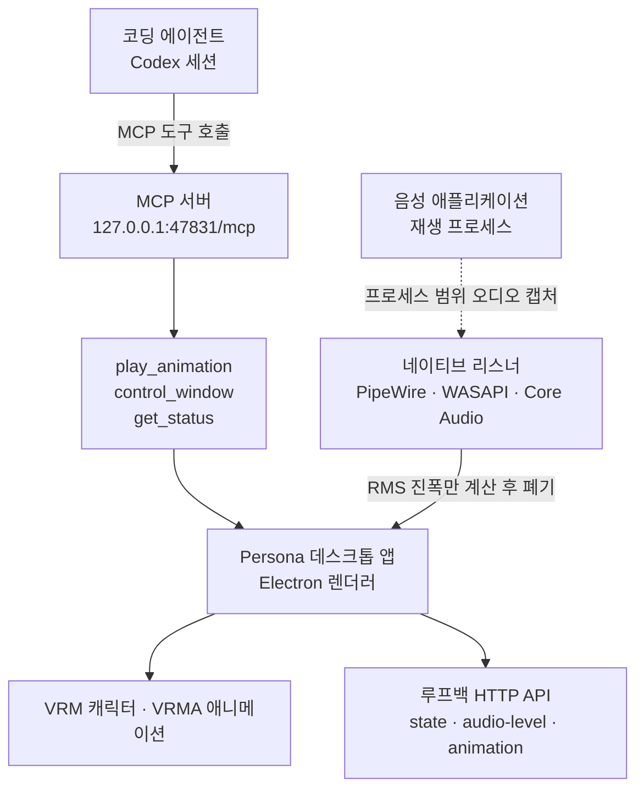

에이전트에게 새로운 능력을 열어 줄 때 가장 흔한 실수는 도구를 너무 많이 노출하는 것입니다. 파일을 읽고 쓰고 프로세스를 띄우는 범용 도구를 하나 던져 주면 당장은 편하지만, 그 순간부터 무엇이 가능한지 아무도 설명할 수 없게 됩니다. 2026년 7월 28일에 공개된 오픈소스 프로젝트 Persona는 정확히 반대 방향을 골랐습니다. 데스크톱 위에서 도는 3D 캐릭터에 에이전트를 연결하면서, 노출한 MCP 도구는 세 개뿐입니다.


## 왜 읽어야 하나

이 글은 사내 도구를 MCP 서버로 감싸 에이전트에 붙이려는 플랫폼 엔지니어와, 에이전트에게 어디까지 권한을 줄지 결정해야 하는 분을 위해 썼습니다. 결론부터 말씀드리면, Persona가 흥미로운 이유는 3D 캐릭터라서가 아니라 능력 표면을 좁히는 방식이 그대로 베낄 만한 설계이기 때문입니다. 도구 세 개, enum으로 닫아 둔 인자, 파일 경로 대신 이름을 계약으로 둔 구조, 루프백 밖은 아예 거부하는 바인딩까지가 하나의 일관된 패턴을 이룹니다. 캐릭터에 관심이 없더라도 도구 설계 참고 자료로서 값이 있습니다.

## 개요

Persona는 데스크톱 음성 경험에 시각적 정체성을 붙이는 크로스 플랫폼 애플리케이션입니다. Electron 위에서 VRM 형식의 캐릭터 모델을 띄우고, VRMA 형식의 애니메이션을 재생합니다. 저장소는 2026년 7월 28일에 만들어졌고, 이 글을 쓰는 시점에 별 410개와 포크 36개가 달려 있습니다. 애플리케이션 소스는 MIT 라이선스이며, 번들된 캐릭터 미디어는 그 라이선스에서 제외되어 있습니다.

트위터에서 이 프로젝트가 퍼진 문구는 ChatGPT가 자기 3D 페르소나를 제어하게 되었다는 것이었는데, 저장소 문서를 읽어 보면 조금 더 정확한 그림이 나옵니다. MCP 서버를 등록하는 대상으로 문서가 명시하는 클라이언트는 Codex입니다. 그리고 Codex와 ChatGPT의 음성 출력을 감지하는 부분은 MCP가 아니라 운영체제 수준의 오디오 캡처입니다. 문서는 그 이유를 직접 밝힙니다. 두 애플리케이션이 프로세스 간 실시간 음성 이벤트 스트림을 지원되는 형태로 노출하지 않기 때문이며, 공식 이벤트 스트림이 생기면 창이나 애니메이션 시스템을 바꾸지 않고 같은 계약에 연결할 수 있다고 적혀 있습니다.

즉 이 프로젝트에는 두 개의 서로 다른 연결이 있습니다. 하나는 에이전트가 캐릭터에게 명령을 내리는 MCP 경로이고, 다른 하나는 캐릭터가 음성 출력을 눈치채는 오디오 관측 경로입니다. 두 경로의 설계 원칙이 다르므로 나눠 봐야 합니다.



## 이 도구는 무엇인가

MCP 쪽부터 보겠습니다. 앱이 떠 있는 동안 Persona는 Streamable HTTP 방식의 MCP 엔드포인트를 제공합니다. 노출하는 도구는 정확히 세 개입니다.

| 도구 | 입력 | 효과 |
|---|---|---|
| `play_animation` | `animation`: `idle`, `greeting`, `talk`, `happy`, `finger-gun`, `dance` 중 하나 | Persona를 표시하고 설치된 애니메이션 한 개를 한 번 재생 |
| `control_window` | `action`: `show`, `hide`, `toggle` 중 하나 | 앱을 종료하지 않고 창만 제어 |
| `get_status` | 없음 | 창 표시 여부, 음성 상태, 리스너 상태를 읽기 |

`electron/mcp-server.cjs`를 직접 열어 보면 이 표가 코드와 어떻게 맞물리는지 보입니다. 서버는 공식 `@modelcontextprotocol/sdk`의 `McpServer`와 `StreamableHTTPServerTransport`를 그대로 쓰고, 서버 이름은 `Persona`, 버전은 `package.json`에서 가져옵니다. 두 도구의 인자는 모두 `z.enum`으로 선언되어 있어서 허용 값 밖의 문자열은 스키마 단계에서 걸립니다. 애니메이션 이름 목록도 코드 안의 매핑 객체에서 파생되므로, 문서의 표와 실제 허용 값이 갈라질 여지가 구조적으로 줄어듭니다.

서버 설명 문자열도 눈여겨볼 만합니다. 사용자가 시각적 반응을 요청하거나 그 요청을 명백히 뒷받침할 때 `play_animation`을 쓰라고 안내하고, Persona는 절대 말하거나 오디오를 재생하지 않으며 `get_status`는 읽기 전용이라고 못 박습니다. 도구 스키마만으로는 전달되지 않는 사용 조건과 부작용 없음을 자연어 계약으로 함께 실어 보내는 방식입니다.

설계에서 가장 베낄 만한 대목은 애니메이션 이름이 파일 경로가 아니라 제품 계약이라는 점입니다. 문서는 이 결정의 효과를 명시합니다. 나중에 캐릭터 팩을 통째로 교체하더라도 MCP 설정을 바꾸거나 파일시스템 접근 권한을 새로 내줄 필요가 없습니다. 에이전트는 `dance`라는 이름만 알면 되고, 그 이름 뒤에 어떤 파일이 있는지는 알 필요도 알 방법도 없습니다.

## 설치 및 통합

문서에 적힌 절차는 짧습니다. 요구 사항은 Node.js 24 이상, npm, 그리고 하드웨어 가속이 가능한 데스크톱 세션입니다.

```bash
npm install
npm run demo
```

`npm run demo`는 현재 렌더러를 빌드하고 자동 음성 출력 감지를 켠 상태로 Persona를 띄웁니다. 배경에서 띄우려면 다음을 씁니다.

```bash
npm start -- --background
```

앱이 떠 있는 상태에서 MCP 서버를 클라이언트에 등록합니다.

```bash
codex mcp add persona --url http://127.0.0.1:47831/mcp
codex mcp get persona
```

등록한 뒤에는 새 세션을 시작해야 도구가 잡힙니다. 포트를 `PERSONA_BRIDGE_PORT`로 바꿨다면 등록한 URL도 함께 바꿔야 합니다. MCP 엔드포인트가 루프백 HTTP API와 같은 포트를 쓰기 때문입니다.

MCP 말고 다른 진입점도 두 개 더 있습니다. 하나는 설치 패키지가 등록하는 `persona://` URL 스킴으로, `persona://show`나 `persona://speaking?level=0.3` 같은 주소를 Linux에서는 `xdg-open`, macOS에서는 `open`, Windows에서는 `start`로 열면 됩니다. 다른 하나는 기본값으로 `127.0.0.1:47831`에 뜨는 루프백 HTTP API입니다. 여기에는 음성 상태, 정규화된 레벨, 애니메이션 미리보기 세 종류의 이벤트를 보낼 수 있고, `GET /health`는 실행 여부와 마지막 상태를 돌려줍니다. 상태 이벤트의 phase는 `inactive`, `starting`, `active`, `stopping` 네 가지, activity는 `idle`, `listening`, `speaking` 세 가지로 닫혀 있습니다.

플랫폼별 음성 감지 방식은 다음과 같습니다. Linux는 PipeWire 그래프를 폴링해 대상 재생 노드를 찾아 `pw-record`를 붙이고, Windows는 WASAPI 애플리케이션 루프백을 대상 프로세스 트리로 한정해 사용하며, macOS는 선택한 음성 프로세스에 대해 비공개 Core Audio 프로세스 탭과 집계 장치를 만듭니다. Linux는 `pw-dump`와 `pw-record`가 PATH에 있어야 하고, Windows는 빌드 20348 이상, macOS는 14.2 이상이 필요합니다.

## 실제 확인 결과

정직하게 적겠습니다. 이 글은 앱을 실제로 띄워 본 기록이 아닙니다. Persona는 하드웨어 가속 데스크톱 세션을 요구하고, 캐릭터 미디어가 저장소에서 의도적으로 제외되어 있어 `assets/model.vrm`과 여덟 개의 VRMA 파일을 직접 채워 넣어야 실행됩니다. 대신 저장소 문서와 소스를 직접 열어 확인 가능한 사실만 옮겼습니다. 벤치마크 수치나 지연 시간 같은 측정값은 이 글에 없습니다.

소스와 저장소 메타데이터에서 확인한 사실은 이렇습니다. 저장소는 2026년 7월 28일에 생성되었고 같은 날 마지막 푸시가 있었으며, 언어는 JavaScript, 별은 410개, 포크는 36개, 열린 이슈는 0개입니다. `electron/mcp-server.cjs`는 공식 MCP SDK를 사용하고 도구 세 개를 zod 스키마로 선언합니다. 같은 디렉터리에 `mcp-server.test.cjs`와 `bridge-server.test.cjs`가 함께 있어 두 서버 모두 테스트가 붙어 있습니다.

프라이버시 관련 서술도 문서에 명시적으로 적혀 있습니다. 각 리스너는 지원 애플리케이션의 재생 프로세스로 범위가 한정되며, Persona는 마이크를 캡처하지 않고, 오디오를 저장하지 않으며, 음성을 만들어 내지 않고, 내용을 전사하지 않으며, 오디오를 네트워크로 보내지 않는다고 되어 있습니다. Linux 경로에서는 샘플에서 RMS 진폭을 계산한 뒤 모든 샘플을 즉시 버린다고 구체적으로 기술합니다. 루프백 API는 비루프백 Host 헤더를 가진 요청을 거부하고, 브라우저 클라이언트는 신뢰된 로컬 출처와 지원 앱 출처로 제한합니다.

배포 쪽에는 재미있는 게이트가 하나 걸려 있습니다. 캐릭터 미디어를 교체한 뒤 `manifest.json`의 모든 라이선스와 출처 필드를 채우고 `distributionAllowed`를 참으로 설정하기 전까지, 릴리스 워크플로가 실패하도록 되어 있습니다. 테스트용 파일을 그대로 배포하는 사고를 코드가 막는 구조입니다.

## ThakiCloud 제품 적용 시사점

Paxis는 ThakiCloud의 에이전트 네이티브 클라우드로, 스킬과 도구, 정책, 감사 로그를 일급 리소스로 다룹니다. 에이전트가 쓸 도구를 어떻게 노출할지가 이 제품의 핵심 설계 문제이므로, Persona의 선택은 참고 사례로 바로 쓸 수 있습니다.

첫째, 능력 표면을 이름으로 닫는 방식입니다. Persona는 애니메이션 파일 경로 대신 여섯 개의 이름을 계약으로 두고, 그 뒤의 파일은 감췄습니다. 같은 원리를 사내 도구에 적용하면, 에이전트에게 셸 접근이나 경로 인자를 주는 대신 미리 정의한 동작 이름만 열어 줄 수 있습니다. 이름 집합이 닫혀 있으면 정책 게이트가 검사할 대상도 유한해지고, 감사 로그에 남는 값도 자유 문자열이 아니라 열거형이 됩니다. 로그를 나중에 집계할 때 이 차이가 크게 작용합니다.

둘째, 도구 개수를 늘리지 않고 자연어 지시를 함께 보내는 방식입니다. Persona의 서버 설명 문자열은 언제 어떤 도구를 쓰라는 지침과 함께, 이 서버는 소리를 내지 않으며 상태 조회는 읽기 전용이라는 부작용 정보를 담고 있습니다. 스킬 하네스가 도구를 고를 때 필요한 정보는 스키마만으로는 부족하다는 것을 인정한 설계이며, Paxis의 스킬 설명 품질 규칙이 요구하는 바와 정확히 같은 방향입니다.

셋째, 네트워크 경계를 좁게 잡는 방식입니다. 루프백에만 바인딩하고 비루프백 Host를 거부하며 브라우저 출처를 제한하는 조합은, 로컬 에이전트 도구를 만들 때의 기본값으로 삼을 만합니다. 샌드박스 격리 실행을 전제로 하는 Paxis 환경에서도 같은 원칙이 적용됩니다. 도구가 열어 주는 표면이 좁을수록 격리 경계를 지키기 쉬워집니다.

한편 이 프로젝트가 드러낸 공백도 기록해 둘 만합니다. 음성 상태를 알기 위해 운영체제 오디오 탭을 붙여야 했다는 사실은, 지금의 에이전트 애플리케이션들이 실시간 상태를 외부에 알리는 표준 이벤트 채널을 갖고 있지 않다는 뜻입니다. 에이전트 위에 무언가를 얹으려는 모든 도구가 같은 우회를 반복하게 됩니다. 상태를 표준 채널로 흘려보내는 설계는 저희가 에이전트 플랫폼을 만들 때 초기에 잡아 둘 값어치가 있습니다.

## 한계 및 반론

먼저 성숙도입니다. 저장소는 만들어진 지 며칠 되지 않았고, 문서에 언급된 릴리스 태그 예시도 베타 형태입니다. 프로덕션 도입을 논할 단계가 아니라 설계를 읽을 단계입니다.

다음은 실행 장벽입니다. 캐릭터 미디어가 저장소에 없으므로 받아서 바로 돌려 볼 수 없고, VRM과 VRMA 파일을 직접 구해 라이선스 필드까지 채워야 합니다. 배포까지 가려면 그 파일들의 재배포 권한도 확인해야 합니다. 안전한 기본값이지만 진입 비용이기도 합니다.

기능 범위도 좁습니다. MCP로 열린 것은 애니메이션 재생과 창 제어, 상태 조회뿐이며, 문서 스스로 Persona가 별도의 데스크톱 애플리케이션이고 MCP 연결은 자기 시각 제어만 노출한다고 선을 긋습니다. 에이전트에게 표현력 있는 아바타를 붙인다는 기대를 갖고 접근하면 실망할 수 있습니다.

마지막으로 오디오 캡처 방식에는 운영상 마찰이 따릅니다. macOS는 시스템 오디오 녹음 권한을 한 번 요청하고, Windows는 특정 빌드 이상을 요구하며, Linux는 PipeWire 도구가 PATH에 있어야 합니다. 문서가 캡처 범위를 좁게 한정했다고 설명하더라도, 보안 정책이 엄격한 조직에서는 오디오 접근 권한 자체가 검토 대상이 됩니다. 그리고 이 방식은 대상 애플리케이션이 프로세스 구조를 바꾸면 깨질 수 있는, 본질적으로 임시 우회라는 점을 잊지 않는 편이 좋습니다.

## 정리

Persona에서 가져갈 것은 캐릭터가 아니라 좁힘의 방법입니다. 도구는 세 개, 인자는 enum, 이름은 계약, 바인딩은 루프백, 배포는 라이선스 게이트가 막습니다. 다섯 가지 결정이 모두 같은 방향을 가리키며, 그 결과 에이전트가 무엇을 할 수 있는지 한 문단으로 설명할 수 있는 서버가 되었습니다.

사내 도구를 MCP로 감싸려는 분에게 남기는 다음 행동은 하나입니다. 도구 목록을 적기 전에, 에이전트가 수행할 동작의 이름을 먼저 유한한 목록으로 적어 보십시오. 그 목록이 길어진다면 도구를 나누기 전에 동작 자체를 다시 묶어야 한다는 신호입니다. 경로와 자유 문자열을 인자로 받는 순간 정책 게이트도 감사 로그도 함께 흐려집니다.


## 관련 슬라이드

본문 내용을 NotebookLM(`architectural_mono` 스타일)으로 요약한 슬라이드입니다.


## 출처

- [xikhar/persona 저장소](https://github.com/xikhar/persona), MIT 라이선스, 2026년 7월 28일 생성
- [Persona 통합 문서 (docs/INTEGRATIONS.md)](https://github.com/xikhar/persona/blob/main/docs/INTEGRATIONS.md)
- [MCP 서버 소스 (electron/mcp-server.cjs)](https://github.com/xikhar/persona/blob/main/electron/mcp-server.cjs)
