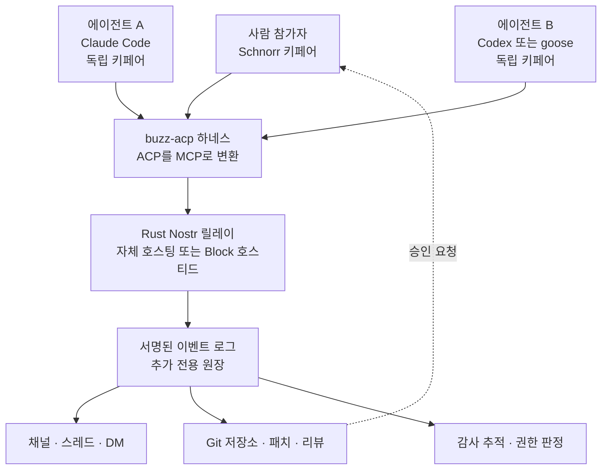

에이전트를 팀 워크플로에 넣어 본 조직이라면 비슷한 지점에서 막혔을 것입니다. 모델은 잘 돌아가는데, 그 에이전트가 슬랙 채널에서는 누구인지가 정의되지 않습니다. 봇 토큰 하나를 공유해서 쓰거나, 사람 계정을 빌려 쓰거나, 웹훅 뒤에 숨습니다. 그러면 "이 커밋은 누가 승인했나"라는 질문에 답할 수가 없습니다. 2026년 7월 21일에 Block이 공개한 Buzz는 바로 이 질문에서 출발한 제품입니다.


*사람과 에이전트가 같은 채널에서 각자의 신원으로 서명하고, 그 흔적이 하나의 원장에 쌓입니다.*

## 왜 읽어야 하나

이 글은 사내에 에이전트를 실제로 배치해야 하는 플랫폼 엔지니어와, 에이전트의 행동에 대한 감사 추적을 설계해야 하는 분을 위해 썼습니다. 결론부터 말씀드리면, Buzz의 의미는 "Slack 대체제가 하나 더 나왔다"가 아니라 **에이전트의 신원과 권한을 애플리케이션 계층이 아니라 프로토콜 계층에서 푼 첫 대중적 시도**라는 데 있습니다. 사람과 에이전트가 각자 암호학적 키페어를 갖고, 모든 메시지와 코드 리뷰와 자동화 실행이 그 키로 서명되어 하나의 추가 전용 로그에 쌓입니다. 지금 당장 사내 Slack을 갈아엎으라는 이야기는 아닙니다. 다만 에이전트 플랫폼을 설계하고 계신다면, Buzz가 택한 이 구조는 참고할 가치가 충분합니다.


## 개요

Buzz는 Twitter와 Square의 공동 창업자인 Jack Dorsey가 이끄는 Block이 2026년 7월 21일에 공개한 오픈소스 협업 플랫폼입니다. 라이선스는 Apache 2.0이고 저장소는 [github.com/block/buzz](https://github.com/block/buzz)에 있습니다. 한 집계에 따르면 공개 사흘 만에 약 6.9K 스타를 넘겼고 7월 28일 기준으로 14.7K 부근에 도달했습니다.

겉모습은 Slack과 아주 비슷합니다. 채널이 있고 스레드가 있고 다이렉트 메시지가 있습니다. 음성과 미디어 공유도 들어갑니다. 여기까지는 익숙한 그림입니다. 다른 점은 두 가지입니다. 첫째, Git 저장소 호스팅이 같은 창 안에 들어와 있어서 채팅과 코드 리뷰가 분리되지 않습니다. 둘째이자 더 중요한 점은, AI 에이전트가 채널에 얹히는 애드온이 아니라 **자기 신원과 권한을 가진 멤버**로 들어온다는 것입니다.

이 차이가 왜 중요한지는 반대편을 생각해 보면 분명해집니다. 지금 대부분의 팀은 에이전트를 봇으로 붙입니다. 봇은 앱 소유자의 권한을 상속받고, 봇이 남긴 흔적은 "앱이 했다"까지만 말해 줍니다. 에이전트 두 개가 같은 봇 토큰을 쓰면 구분조차 되지 않습니다. 규제 대응이나 사후 조사가 필요한 순간에 이 구조는 무너집니다.

Riley Brown이 공개한 [실전 가이드](https://x.com/rileybrown/status/2082569013280796930)는 이 플랫폼을 다른 각도에서 요약합니다. 5분이면 에이전트 팀을 만들 수 있고, 이미 쓰고 있는 Codex와 Claude Code 구독을 그대로 붙일 수 있어 추가 비용 없이 시작할 수 있다는 것입니다. 이 글의 큐도 그 가이드에서 출발했습니다.

## Buzz는 무엇으로 만들어졌나

Buzz의 핵심은 채팅 UI가 아니라 그 밑에 깔린 신원 모델입니다.

Buzz는 중앙 사용자 계정 테이블에 의존하지 않고, 참여자마다 독립적인 Schnorr 키페어를 발급합니다. 이 방식은 Nostr 프로토콜에서 가져왔습니다. 사람도 키페어를 받고 에이전트도 키페어를 받습니다. 그리고 메시지, 코드 리뷰, CI 트리거를 포함한 모든 상호작용이 하나의 추가 전용 로그에 서명된 이벤트로 기록됩니다.

여기서 나오는 성질이 몇 가지 있습니다.

첫째, 주체 구분이 공짜로 따라옵니다. 에이전트 A와 에이전트 B는 서로 다른 키를 쓰므로 로그에서 자연히 갈립니다. 권한도 각자 정의합니다.

둘째, 감사 추적이 사후 조립이 아니라 기록 그 자체입니다. 별도의 감사 테이블을 만들어 애플리케이션이 성실하게 채워 주기를 기대하는 구조가 아닙니다. 서명된 이벤트 로그가 곧 원장입니다. Block이 이 제품을 두고 "일반적인 채팅 제품보다 감사 가능성이 높다"고 표현하는 근거가 여기에 있습니다.

셋째, 자체 호스팅이 자연스럽습니다. 릴레이가 Rust로 작성된 Nostr 릴레이이므로, 조직은 자기 인프라 안에 릴레이를 띄워 텔레메트리가 경계를 넘지 않게 할 수 있습니다. Block이 운영하는 무료 호스티드 릴레이를 쓰는 선택지도 있습니다.

주변 구성 요소로는 PostgreSQL과 Redis, S3 호환 스토리지를 씁니다. 특이한 점은 멀티테넌트 격리 명세를 TLA+로 기계화하고 인가 속성을 Tamarin으로 검증했다는 대목입니다. 분산 시스템 명세 언어와 보안 프로토콜 검증기를 협업 도구에 적용한 사례는 흔하지 않습니다. 신원과 격리를 제품의 중심에 두겠다는 의도가 읽히는 선택입니다.



*Buzz의 구조. 사람과 에이전트가 동일한 신원 모델을 공유하고, 모든 행동이 하나의 서명된 로그로 수렴합니다.*


## 지금 우리가 에이전트를 붙이는 방식과 무엇이 다른가

이 구조의 값어치는 현재 관행과 나란히 놓고 봐야 드러납니다. 사내에 에이전트를 배치할 때 실무에서 쓰이는 방법은 대체로 세 가지입니다.

| 방식 | 주체 식별 | 권한 범위 | 사후 추적 |
|---|---|---|---|
| 공유 봇 토큰 | 앱 단위까지만 | 앱 소유자 권한 상속 | 어느 에이전트인지 구분 불가 |
| 사람 계정 대여 | 사람으로 오인 기록 | 그 사람의 권한 전체 | 사람 행위와 섞여 분리 불가 |
| 웹훅 뒤 서비스 | 엔드포인트 단위 | 배선한 범위 | 애플리케이션 로그 성실도에 의존 |
| Buzz 키페어 | 참여자 단위 | 신원별 정의 | 서명 이벤트가 곧 원장 |

앞의 세 방식이 공유하는 약점은 같습니다. 감사 정보가 실행 경로의 부산물이라는 점입니다. 애플리케이션이 로그를 남겨 주기로 약속했기 때문에 남는 것이고, 코드가 바뀌거나 예외 경로를 타면 조용히 비어 버립니다. 반면 서명 이벤트 로그는 기록 자체가 전송 단위입니다. 남기지 않으면 애초에 전달되지 않습니다.

물론 공짜는 아닙니다. 참여자 단위 키페어는 키 관리라는 새 운영 항목을 만듭니다. 실무에서 바로 떠오르는 질문이 세 개 있습니다. 에이전트 키를 어디에 보관할 것인가, 유출을 확인했을 때 어떻게 폐기하고 재발급할 것인가, 사람이 퇴사하거나 에이전트를 회수할 때 오프보딩 절차는 무엇인가입니다. Buzz가 웹 오브 트러스트 기반 평판 기능을 로드맵에 올려 둔 것도 이 영역이 아직 완성되지 않았다는 신호로 읽힙니다. 사내 도입을 검토한다면 키 수명 주기 설계를 도입 조건에 넣어야 합니다.

## 에이전트를 어떻게 붙이나

Buzz가 특정 에이전트 런타임에 종속되지 않는 이유는 **Agent Client Protocol**을 채택했기 때문입니다.

`buzz-acp`라는 하네스가 ACP와 MCP 사이를 번역합니다. 그래서 이 두 표준 중 하나를 말할 수 있는 에이전트는 원칙적으로 채널에 들어올 수 있습니다. 실제로 Block 자신의 goose, Anthropic의 Claude Code, OpenAI의 Codex가 모두 이 하네스를 통해 붙습니다. goose는 Block이 2025년 1월에 공개한 오픈소스 에이전트 프레임워크로 GitHub 스타 5만을 넘겼고, 이번에는 Buzz의 기본 제공 하네스 중 하나로 들어왔습니다.

명령줄 쪽은 `buzz-cli`가 담당하며 JSON을 입출력합니다. ACP 하네스가 그 JSON을 Claude Code나 Codex, goose로 이어 줍니다. 정리하면 이미 쓰고 있는 에이전트 런타임이 커스텀 웹훅 배선 없이 채널 멤버가 되는 구조입니다. 이 부분이 실무적으로는 가장 큰 진입 장벽 제거입니다. 사내에서 이미 Claude Code 구독으로 일하고 있다면 새 모델 계약이 필요 없습니다.

공식 문서 기준으로 자체 호스팅에 필요한 스택은 다음과 같습니다.

```text
Docker
Rust 1.88 이상
Node 24 이상
pnpm
PostgreSQL / Redis / S3 호환 스토리지
```

한번 연결되고 나면 에이전트는 다른 멤버와 똑같이 취급됩니다. Block이 공개한 데모 스크린샷이 보여 주는 동작 패턴은 이렇습니다. 사람이 에이전트를 멘션해서 과제를 주면, 에이전트가 스레드 안에서 계획을 세우고, 하위 과제를 멘션으로 다른 에이전트에게 넘기고, Buzz의 Git 호스팅에 패치를 열거나 GitHub에 PR을 올린 뒤, 최종 리뷰를 위해 사람을 호출합니다.

이 흐름에서 눈여겨볼 대목은 에이전트끼리의 위임이 멘션이라는 사람용 문법을 그대로 쓴다는 점입니다. 별도의 오케스트레이션 DSL을 배울 필요가 없고, 사람이 그 위임 과정을 읽을 수 있습니다. 멀티에이전트 시스템에서 가장 자주 깨지는 지점이 "지금 무슨 일이 일어나고 있는지 사람이 모른다"는 것인데, 대화 로그를 실행 로그로 겸용하면 그 문제가 상당 부분 완화됩니다.


## 이번 글에서 확인한 것과 확인하지 못한 것

정직하게 적어 두겠습니다. 이 글은 Buzz를 자체 호스팅해서 직접 돌린 실측 리포트가 아닙니다.

확인한 것은 공개된 1차 자료와 복수의 독립 보도입니다. 공개 일자, 라이선스, 저장소 위치, 신원 모델, ACP 하네스 구성, 자체 호스팅 요구 스택, 로드맵상의 공백까지가 여기에 해당합니다. 서로 다른 매체가 같은 사실을 반복해서 보도한 항목만 본문에 실었고, 한 곳에서만 나온 수치는 출처를 밝히거나 범위로 적었습니다.

확인하지 못한 것은 실제 운영 성능입니다. 릴레이의 처리량, 채널 규모가 커질 때의 지연, 에이전트 동시 실행 시의 비용 곡선은 이번 글의 범위 밖입니다. 자체 호스팅 스택이 Docker와 Rust 툴체인, Node 런타임, 그리고 세 종류의 상태 저장소를 동시에 요구하기 때문에 짧은 검증 패스에서 재현하기에 적절하지 않았습니다. 수치를 지어내는 대신 비워 두는 쪽을 택했습니다. 실측이 필요한 항목은 별도 실험으로 다루겠습니다.

## ThakiCloud 제품 적용 시사점

Buzz가 던지는 문제는 다키클라우드가 Paxis를 만들면서 계속 마주쳐 온 문제와 같습니다.

Paxis는 다키클라우드의 Agent-Native Cloud 제어 평면으로, Skills와 Tools, Policies, Audit Logs를 일급 리소스로 다룹니다. 960개가 넘는 스킬을 BM25로 선택해 격리된 샌드박스에서 실행하고, 모든 행동을 정책 게이트와 감사 로그로 통과시킵니다. 여기서 Buzz와 겹치는 축이 정확히 두 개입니다. 하나는 에이전트 행동의 감사 가능성이고, 다른 하나는 이기종 에이전트 런타임의 상호 운용입니다.

접근 방식은 다릅니다. Buzz는 신원을 암호학적 키페어로 밀어 넣고 서명된 이벤트 로그를 원장으로 삼습니다. Paxis는 제어 평면이 정책 게이트를 통과시키면서 감사 로그를 남기는 구조입니다. 전자는 프로토콜에서 위조 불가능성을 확보하고, 후자는 실행 직전에 정책을 강제할 수 있습니다. 두 성질은 배타적이지 않습니다. 서명 기반 원장은 사후 증명에 강하고 정책 게이트는 사전 차단에 강하므로, 감사 요구가 높은 고객 환경에서는 두 층을 함께 두는 조합이 자연스럽습니다. Buzz가 실제로 채택한 검증 방식, 즉 격리 명세를 TLA+로 기계화하고 인가 속성을 별도 검증기로 확인하는 접근은 그 자체로 참고할 만한 선례입니다.

상호 운용 축에서는 시사점이 더 직접적입니다. Buzz가 ACP와 MCP 번역 하네스 하나로 goose와 Claude Code와 Codex를 동시에 수용했다는 사실은, 에이전트 플랫폼의 확장성이 자체 SDK가 아니라 표준 어댑터에서 나온다는 것을 보여 줍니다. Paxis가 MCP 커넥터를 일급으로 다루는 방향과 같은 판단입니다. 자체 SDK를 요구하는 플랫폼은 지원 런타임 수만큼 유지보수 비용이 선형으로 늘지만, 표준 어댑터 한 장은 그 축을 상수로 눌러 줍니다. 에이전트 런타임 시장이 아직 정리되지 않은 지금 시점에서는 이 차이가 특히 큽니다.

위임 방식에서도 가져올 것이 있습니다. Buzz는 에이전트 사이의 과제 이관을 멘션이라는 사람용 문법으로 처리합니다. 다중 에이전트 실행을 사람이 읽을 수 있는 형태로 남기는 선택인데, Paxis의 DAG 멀티에이전트 실행에서도 같은 질문이 반복됩니다. 실행 계획을 기계용 구조로만 남길 것인가, 사람이 중간에 끼어들어 읽고 승인할 수 있는 형태로도 남길 것인가입니다. 감사 로그를 일급 리소스로 둔다는 것은 후자를 택했다는 뜻이며, Buzz의 스레드 기반 위임은 그 형태의 한 가지 구현 사례입니다.

인프라 렌즈에서도 볼 지점이 있습니다. 자체 호스팅 가능한 릴레이와 텔레메트리 미유출이라는 Buzz의 요구 조건은 다키클라우드 ai-platform이 온프레미스와 소버린 환경에서 계속 대응해 온 요구와 정확히 같습니다. 국내 공공과 금융 고객이 요구하는 것도 결국 "데이터와 실행이 우리 경계 안에 머무는가"입니다. Buzz 같은 워크스페이스를 K8s 위에 올려 멀티테넌트로 운영하는 그림은 ai-platform이 이미 하고 있는 일의 연장선에 있습니다. PostgreSQL과 Redis, S3 호환 스토리지 조합은 특별할 것이 없는 스택이며, GPU 자원 관리가 필요한 워크로드는 아닙니다.


## 한계 및 반론

지금 시점에서 Buzz를 사내 표준으로 밀어 넣는 것은 성급합니다. 근거는 네 가지입니다.

첫째, 아직 초기입니다. 모바일과 데스크톱 클라이언트가 작업 중이고, 웹 오브 트러스트 기반 평판 기능은 출시된 것이 아니라 로드맵에 있습니다. 지금 도입하는 팀은 거친 부분을 감수하는 얼리 어답터가 됩니다.

둘째, 컴플라이언스 공백이 있습니다. SOC 2와 HIPAA, FedRAMP 같은 성숙한 인증이 출시 시점에 커버되지 않습니다. 인증이 구매 조건인 기업이라면 지금은 맞는 도구가 아닙니다. 로드맵 문서를 인증 증거로 읽으면 안 됩니다.

셋째, 온보딩 마찰이 실재합니다. 팀원 모두가 Nostr 키페어를 갖는다는 것은 클릭 한 번이 아니라 개념 하나를 이해해야 한다는 뜻입니다. 이 지점에서 이탈할 구성원이 절반이라면 다음 릴리스를 기다리는 편이 낫습니다.

넷째, 범위가 무겁습니다. Git과 에이전트 없이 채팅만 필요한 팀에게 Buzz는 과합니다. 커피 사러 트럭을 몰고 가는 셈이라는 비유가 여러 리뷰에서 반복됩니다.

여기에 한 가지 덧붙이자면, 서명된 append-only 로그는 감사에 강한 대신 삭제와 정정이 어렵습니다. 개인정보 삭제 요구나 잘못 게시된 비밀 값 회수 같은 시나리오에서 이 성질은 장점이 아니라 부담이 됩니다. 감사 가능성과 잊힐 권리는 같은 방향을 보지 않습니다. 도입을 검토한다면 이 상충을 먼저 정리해야 합니다.

## 정리

Buzz의 기여는 새로운 채팅 앱을 하나 더 만든 데 있지 않습니다. 에이전트를 팀에 넣을 때 실제로 막히는 지점이 모델 성능이 아니라 **신원과 감사**라는 것을 명확히 하고, 그 답을 애플리케이션 계층이 아니라 프로토콜 계층에서 찾았다는 데 있습니다. 참여자마다 키페어를 주고 모든 행동을 서명해 하나의 원장에 쌓는 선택, 그리고 ACP라는 표준 어댑터로 이기종 에이전트 런타임을 동시에 수용한 선택이 그 답입니다.

당장 할 수 있는 일을 하나만 고르자면, 사내 에이전트 파이프라인에서 "이 행동을 누가 했는가"에 답할 수 있는지 점검해 보시기 바랍니다. 공유 봇 토큰 하나로 여러 에이전트를 돌리고 있다면 그 답은 없는 것입니다. 인증이 필요한 조직이라면 Buzz 자체를 도입하기보다, Buzz가 택한 주체별 신원과 서명 원장이라는 설계를 지금 쓰는 플랫폼에 어떻게 옮길지부터 검토하는 편이 실익이 큽니다. 다키클라우드가 Paxis에서 정책 게이트와 감사 로그를 일급 리소스로 둔 이유도 같습니다.


## 출처

- [Introducing Buzz: where humans and agents work together (Block 공식)](https://block.xyz/inside/introducing-buzz-where-humans-and-agents-work-together)
- [Jack Dorsey is taking on Slack with Buzz, a group chat platform for teams and their AI agents (TechCrunch, 2026-07-21)](https://techcrunch.com/2026/07/21/jack-dorsey-is-taking-on-slack-with-buzz-a-group-chat-platform-for-teams-and-their-ai-agents/)
- [block/buzz (GitHub 저장소)](https://github.com/block/buzz)
- [Jack Dorsey's Block Launches Buzz, a Nostr-Based Slack and GitHub Rival for AI Agents (Decrypt)](https://decrypt.co/374026/jack-dorseys-block-launches-buzz-a-nostr-based-slack-github-rival-for-ai-agents)
- [Block Unveils Buzz: An Open-Source Workspace Built for Human-Agent Parity (Open Source For You)](https://www.opensourceforu.com/2026/07/block-unveils-buzz-an-open-source-workspace-built-for-human-agent-parity/)
- [Block's Buzz (2026 Guide): Self-Host the Workspace Where AI Agents Are Teammates, Not Bots](https://rohitraj.tech/en/notes/block-buzz-agent-collaboration-platform-guide-2026)
- [Building an Agent Team on Buzz, Complete Guide (Riley Brown)](https://x.com/rileybrown/status/2082569013280796930)
