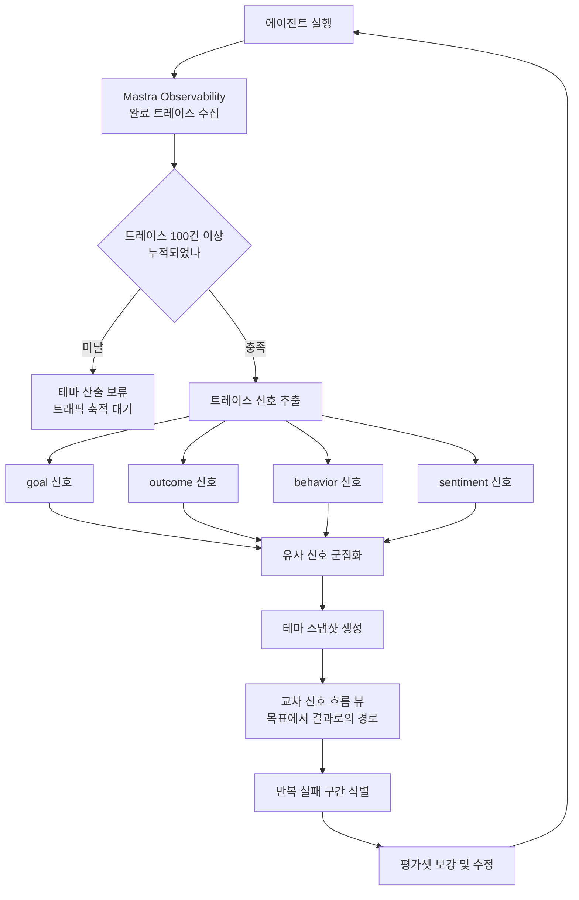

에이전트를 프로덕션에 올린 팀이 공통으로 마주치는 벽이 있습니다. 트레이스는 잘 쌓이는데 그걸 읽을 사람이 없다는 것입니다. 하루에 수천 건이 들어오고, 사람이 열어 볼 수 있는 것은 실패 알림이 뜬 몇 건뿐입니다. 나머지는 저장 비용만 내면서 조용히 쌓입니다. Mastra가 2026년 7월에 프라이빗 베타로 공개한 Trace Intelligence는 정확히 이 지점을 겨냥한 기능입니다.

## 왜 읽어야 하나

이 글은 에이전트를 실제 사용자 트래픽에 올려 두고 그 품질을 책임져야 하는 플랫폼 엔지니어와, 에이전트 평가 체계를 설계하고 계신 분을 위해 썼습니다. 결론부터 말씀드리면, **Trace Intelligence의 핵심은 트레이스 뷰어를 더 예쁘게 만든 것이 아니라 관측의 단위를 개별 트레이스에서 테마로 옮긴 것입니다.** 트레이스 하나는 "이 세션에서 무슨 일이 있었나"만 알려 주지만, 수백 건을 군집화하면 "사용자들이 반복해서 요구하는 것이 무엇이고 우리 에이전트가 반복해서 실패하는 지점이 어디인가"가 나옵니다. 뒤쪽 질문이 제품 결정으로 이어지는 질문입니다. 다만 프라이빗 베타이고 최소 트레이스 요구량이 있어서, 도입 판단은 이 글의 한계 절까지 읽고 하시는 편이 좋습니다.


*개별 트레이스는 흩어진 선이고, 군집화된 테마는 그 선들이 합류한 굵은 흐름입니다.*

## 개요

Mastra는 TypeScript 기반 에이전트 프레임워크입니다. 워크플로와 도구 호출, 메모리, 평가를 하나의 코드베이스에서 다루고, 관측성은 OpenTelemetry 계열 트레이싱으로 처리합니다. 이번에 공개된 Trace Intelligence는 그 위에 얹히는 분석 계층으로, Mastra 플랫폼 프로젝트를 대상으로 초대 기반 프라이빗 베타로 제공됩니다. 공동 창업자인 Sam Bhagwat이 [X에 올린 소개](https://x.com/calcsam/status/2082160518115254519)에서 밝힌 문제 인식은 간결합니다. 에이전트를 출시한 팀이 트레이스를 리뷰하는 데 몇 달을 쓴다는 것입니다.

문서에 따르면 Trace Intelligence는 Mastra Observability가 수집한 완료 트레이스를 분석해 **트레이스 신호**를 뽑고, 유사한 신호를 **테마**로 군집화합니다. 신호의 차원은 네 가지입니다.

| 신호 차원 | 포착하는 것 | 실무에서 답하는 질문 |
|---|---|---|
| goal | 사용자가 이 세션에서 달성하려던 것 | 우리 에이전트가 실제로 어떤 용도로 쓰이나 |
| outcome | 그 시도가 어떻게 끝났나 | 어떤 종류의 요청에서 반복 실패하나 |
| behavior | 에이전트가 취한 행동 패턴 | 어떤 도구 호출 경로가 반복되나 |
| sentiment | 상호작용에 드러난 사용자 정서 | 기술적으로 성공했지만 불만족한 구간은 어디인가 |

이 네 축이 함께 있다는 점이 설계상 의미가 있습니다. outcome만 보면 성공과 실패의 비율은 알 수 있지만, goal이 붙어야 "어떤 목적의 요청이 실패하는가"가 나옵니다. sentiment는 특히 흥미로운 축인데, 도구 호출이 전부 성공하고 응답도 반환됐는데 사용자는 만족하지 않은 세션이 실제로는 흔하기 때문입니다. 로그 레벨의 성공 여부만 보는 관측 체계는 이 구간을 통째로 놓칩니다.

## 신호에서 테마로, 테마에서 흐름으로



*트레이스가 신호로 분해되고, 신호가 테마로 묶이고, 테마 사이의 이동이 흐름으로 보이는 구조입니다.*

문서에서 눈에 띄는 대목은 테마들 사이의 **교차 신호 흐름**입니다. 스냅샷 안에서 goal 테마가 어떤 outcome 테마로 흘러가는지를 단계와 연결로 표현하고, Sankey 형태의 뷰로 보여 줍니다. 여기서 각 연결의 수치는 중복을 제거한 트레이스 개수입니다. 실무적으로는 "가격 문의라는 목표를 가진 세션 중 몇 퍼센트가 미해결로 끝났는가"를 한 화면에서 읽을 수 있다는 뜻입니다. 개별 트레이스를 열어서는 절대 나오지 않는 정보입니다.

각 트레이스에는 스냅샷 안에서 순서가 있는 신호별 테마 배정이 붙습니다. 그래서 흐름 뷰에서 특정 구간을 짚으면 그 구간을 구성하는 실제 트레이스로 내려갈 수 있습니다. 집계에서 원본으로 내려가는 이 경로가 있어야 관측 도구가 실제 디버깅에 쓰입니다.

## 도입 요건

문서에 명시된 조건은 다음과 같습니다.

- Mastra 플랫폼의 Observability가 활성화되어 있고 완료된 트레이스가 쌓이고 있어야 합니다.
- 최소 버전은 `@mastra/core@1.53.0`, `mastra@1.20.2` 이상입니다.
- 해당 프로젝트의 Studio를 배포하거나 재배포한 뒤 사이드바에서 Intelligence를 선택합니다.
- 초기 테마는 보통 **단일 에이전트에서 완료 트레이스 100건 이상**이 처리된 뒤에 나옵니다.
- 초대 기반이며, 프라이빗 베타 신청 폼을 통해 접근을 요청합니다.

```bash
# 최소 버전 요구사항 확인
npm ls @mastra/core mastra

# 미달이면 업그레이드
npm i @mastra/core@^1.53.0 mastra@^1.20.2
```

100건이라는 문턱은 그냥 넘어갈 수치가 아닙니다. 군집화 기반 분석의 특성상 표본이 적으면 테마가 통계적으로 의미를 갖지 못합니다. 반대로 말하면 이 기능은 이미 실사용 트래픽이 도는 에이전트를 위한 것이지, 개발 중인 프로토타입을 위한 것이 아닙니다. 내부 테스트 트래픽 100건으로 만든 테마는 개발자 자신의 사용 습관을 반영할 뿐입니다.

## 기존 관측 도구와 무엇이 다른가

에이전트 트레이싱 자체는 새롭지 않습니다. Mastra도 이미 [AI Tracing](https://mastra.ai/blog/aitracing)을 지원해 왔고, OpenTelemetry 익스포터로 외부 백엔드에 내보내는 경로도 있습니다. LangSmith 같은 도구로 Mastra 애플리케이션을 추적하는 문서도 별도로 존재합니다. 그러니까 "트레이스를 본다"는 이미 해결된 문제입니다.

차이는 분석의 단위에 있습니다. 기존 도구의 기본 단위는 트레이스 한 건이고, 그 위에 필터와 검색과 대시보드가 얹힙니다. 실패율이나 지연 분포 같은 집계는 제공되지만, 그 집계의 축은 대개 사전에 정의된 메타데이터입니다. 엔드포인트별, 모델별, 상태 코드별로는 묶을 수 있지만 "사용자가 무엇을 하려 했는가"로는 묶을 수 없습니다. 그 축은 데이터에 없기 때문입니다.

Trace Intelligence가 하는 일은 그 축을 사후에 만들어 내는 것입니다. 트레이스 본문을 읽어서 목표를 추론하고, 비슷한 목표끼리 묶어서 없던 차원을 생성합니다. 사전에 태깅하지 않아도 되는 대신 추론이 개입하므로 정확도가 완벽하지는 않습니다. 이 교환이 유리한 조건은 명확합니다. 사용자 요청의 유형을 미리 열거할 수 없는 개방형 에이전트일수록 유리하고, 요청 유형이 몇 개로 고정된 좁은 에이전트라면 그냥 태깅하는 편이 정확하고 저렴합니다.

## ThakiCloud 제품 적용 시사점

**Paxis 관점.** Paxis는 ThakiCloud의 Agent-Native Cloud 제어 평면으로, 스킬과 도구와 정책과 감사 로그를 일급 리소스로 다룹니다. 여기서 감사 로그는 이미 모든 에이전트 행동을 기록하고 있습니다. Trace Intelligence가 제기하는 질문은 그 로그를 개별 조회용으로만 쓸 것인가입니다. 960개가 넘는 스킬을 BM25로 선택해 격리 샌드박스에서 실행하는 구조에서는, "어떤 요청 유형에서 스킬 선택이 반복적으로 빗나가는가"가 핵심 운영 질문입니다. 이 질문은 감사 로그 한 건을 보는 것으로는 답이 나오지 않고, 요청 목표별로 군집을 만들어야 나옵니다. goal과 outcome을 교차한 흐름 뷰는 스킬 라우팅 품질을 측정하는 형태로 그대로 옮겨 올 수 있는 아이디어입니다. 자가진화 스킬 루프에도 직접 연결됩니다. 어떤 스킬을 개선할지 고르는 신호가 지금은 실패 알림 중심인데, 반복 실패 테마의 크기 순으로 우선순위를 매기면 개선의 투자 대비 효과가 달라집니다.

**ai-platform 관점.** ThakiCloud의 ai-platform은 Kubernetes와 Kueue 위에서 멀티테넌트로 AI/ML 워크로드를 서빙합니다. 트레이스 군집화는 인프라 계층에도 함의가 있습니다. behavior 테마별로 토큰 소비와 지연을 집계하면 비용이 어느 행동 패턴에 몰려 있는지가 보입니다. 특정 도구 호출 경로가 전체 GPU 시간의 상당 부분을 먹고 있는데 성공률은 낮다면, 그 경로가 최적화 대상입니다. 온프레미스와 소버린 환경 고객에게는 이 분석이 자체 클러스터 안에서 끝나야 한다는 요구도 있습니다. 외부 SaaS에 트레이스를 보내지 않고 같은 분석을 할 수 있느냐가 실제 도입 조건이 됩니다.

## 초대를 기다리는 동안 할 수 있는 것

이 기능이 프라이빗 베타라는 사실이 오히려 유용한 준비 시간을 줍니다. 군집화 도구가 붙기 전에 트레이스 자체가 준비되어 있어야 하기 때문입니다.

**세션 경계를 명시하십시오.** 트레이스가 단일 요청 단위로만 끊겨 있으면 목표를 추론할 수 없습니다. 사용자가 하나의 의도를 갖고 진행한 여러 턴이 하나의 트레이스로 묶여야 goal 신호가 성립합니다. 실무에서 가장 흔한 결손이 여기입니다.

**결과를 이진값으로 남기지 마십시오.** 성공과 실패만 기록하면 outcome 축의 해상도가 두 단계로 고정됩니다. 중간에 포기했는지, 사용자가 같은 요청을 다시 했는지, 사람에게 넘어갔는지를 구분해 남기면 나중에 훨씬 유용한 군집이 나옵니다.

**정서 신호의 대리 지표를 확보하십시오.** 사용자에게 만족도를 직접 묻기 어렵다면, 재시도 횟수와 대화 중단 지점과 표현 재작성 여부가 대리 지표가 됩니다. 이 정보들은 대개 이미 발생하고 있지만 기록되지 않습니다.

**도구 호출 경로를 순서 그대로 보존하십시오.** behavior 군집은 호출의 집합이 아니라 순서에서 나옵니다. 같은 도구 세 개를 쓰더라도 순서가 다르면 다른 전략이고, 그중 하나만 성공률이 낮을 수 있습니다. 집합으로 뭉개서 저장하면 이 구분이 사라집니다.

이 네 가지는 특정 벤더에 종속되지 않는 스키마 결정입니다. Trace Intelligence를 쓰든, 자체 분석을 붙이든, 다른 도구로 가든 그대로 쓰입니다.

## 한계 및 반론

**프라이빗 베타이고 재현이 불가합니다.** 이 글은 공개 문서와 창업자의 소개를 근거로 썼습니다. 초대를 받지 못한 상태라 실제로 돌려 보고 테마 품질을 확인하지는 못했습니다. 군집화 기반 분석에서 진짜 승부는 "테마가 사람이 보기에 말이 되는가"에서 갈리는데, 그 부분은 검증하지 못했습니다. 이 글에 성능 수치가 없는 이유입니다.

**군집화는 이미 아는 것을 확인해 줄 뿐일 수 있습니다.** 트래픽이 도는 에이전트를 운영하는 팀은 대체로 주요 실패 유형을 이미 감으로 알고 있습니다. 자동 군집화가 그 감을 수치로 확인해 주는 것 자체는 가치가 있지만, 그 이상의 발견이 나오는지는 별개 문제입니다. 발견의 가치는 롱테일에 있는데, 롱테일 테마는 정의상 표본이 적어서 군집화가 가장 약한 구간이기도 합니다.

**신호 추출 자체가 LLM 호출입니다.** 트레이스에서 goal과 sentiment를 뽑으려면 모델이 트레이스를 읽어야 합니다. 트래픽이 늘수록 분석 비용도 함께 늡니다. 전량 분석이 아니라 표본 추출로 가야 할 가능성이 크고, 그러면 표본 설계가 또 하나의 정확도 변수가 됩니다. 관측 계층의 비용 구조를 미리 확인하지 않으면 도입 후에 놀랄 수 있습니다.

**데이터 거버넌스가 걸립니다.** 트레이스에는 사용자 입력이 그대로 들어 있습니다. 그것을 외부 플랫폼이 분석한다는 것은 프롬프트 내용이 밖으로 나간다는 뜻입니다. 금융이나 공공 고객처럼 데이터 반출이 제한된 환경에서는 이 방식 자체가 선택지에서 빠집니다. 자체 호스팅 경로가 있는지가 도입 여부를 가르는 지점입니다.

**벤더 결합도.** 이 기능은 Mastra 플랫폼 프로젝트에 묶여 있고 특정 버전 이상을 요구합니다. 관측 데이터가 OpenTelemetry 표준으로 나가더라도 분석 계층이 플랫폼에 있으면 이전 비용이 생깁니다. 트레이스는 표준 포맷으로 자체 보관하면서 분석만 얹는 구조가 장기적으로 안전합니다.

## 정리

에이전트 관측성의 다음 단계는 트레이스를 더 잘 보여 주는 것이 아니라 **트레이스를 덜 보게 만드는 것**입니다. Trace Intelligence가 택한 방향이 그렇습니다. 사람이 개별 세션을 읽는 대신 목표와 결과와 행동과 감정이라는 네 축으로 분해된 테마를 읽고, 그중 큰 덩어리부터 손보는 구조입니다.

에이전트를 운영하고 계신다면, 초대를 기다리기 전에 지금 쌓이는 트레이스에 이 네 축을 붙일 수 있는지부터 확인해 보시길 권합니다. 목표와 감정은 보통 기록되지 않는 축입니다. 그 두 개가 없으면 어떤 분석 도구를 붙여도 "기술적으로는 성공했는데 사용자는 떠난" 구간을 찾아낼 수 없습니다. 도구 도입보다 스키마 설계가 먼저입니다. 그리고 트레이스를 어디서 분석할 것인가는 기능 비교가 아니라 데이터 주권의 문제로 다뤄야 합니다.


## 관련 슬라이드

본문 내용을 NotebookLM(`neon_venture` 스타일)으로 요약한 슬라이드입니다.


## 출처

- [Trace Intelligence, Mastra Docs](https://mastra.ai/docs/mastra-platform/trace-intelligence)
- [Sam Bhagwat on X](https://x.com/calcsam/status/2082160518115254519)
- [Mastra now supports AI Tracing, Mastra Blog](https://mastra.ai/blog/aitracing)
