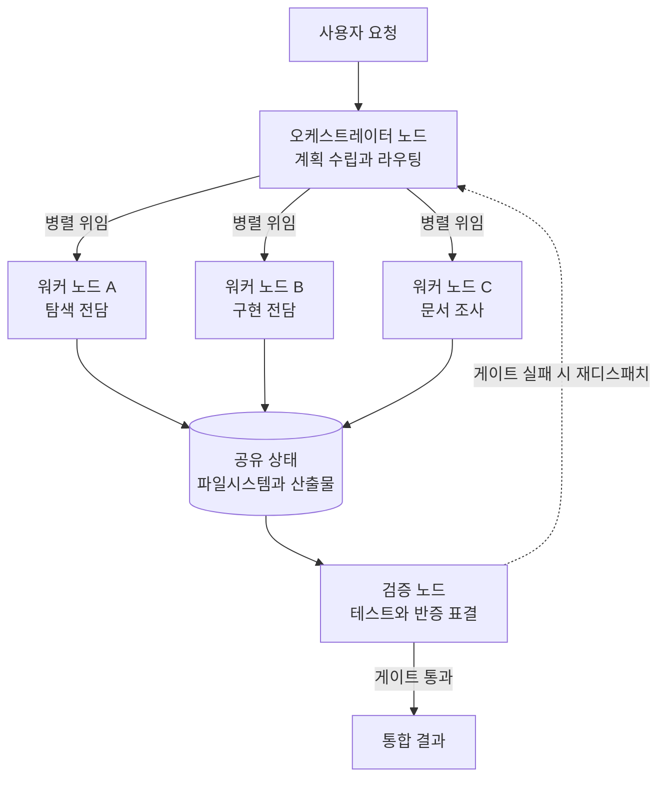

*갈라지는 일보다 다시 하나로 모으는 일이 어렵습니다. 그래프의 값어치는 아래쪽 게이트에서 나옵니다.*

## 왜 읽어야 하나

코딩 에이전트를 한두 개 넘게 굴리기 시작했고 "이제 에이전트를 수십 개씩 돌린다"는 말이 실무인지 마케팅인지 판단해야 하는 플랫폼 엔지니어를 위한 글입니다. 결론부터 말씀드리면, 에이전트를 수십에서 수백 개 돌리는 조직이 실제로 관리하는 대상은 에이전트 개수가 아니라 그래프의 모양이고, 병목은 모델 성능이 아니라 노드 경계와 공유 상태와 종료 조건입니다. 그리고 그 그래프를 만드는 데 별도의 오케스트레이션 프레임워크가 반드시 필요하지는 않습니다. 이미 손에 쥔 도구가 노드와 엣지를 제공합니다.

## 개요

발단은 짧은 인용 하나였습니다. 2026년 7월 말 X에서 Anatoli Kopadze가 Claude Code 책임자의 40분짜리 발표를 인용하며 이렇게 적었습니다. "엔지니어의 85퍼센트가 수십에서 수백 개의 에이전트를 돌리고 있다. 그 방법이 그래프 엔지니어링이다." 한 문장이 두 가지를 동시에 주장합니다. 하나는 규모에 관한 사실 주장이고, 다른 하나는 방법에 관한 규범 주장입니다.

먼저 정직하게 구분하겠습니다. 85퍼센트라는 숫자는 발표 영상을 직접 확인하지 못한 2차 인용입니다. 저희는 이 수치를 검증된 벤치마크가 아니라 인용된 발언으로만 다룹니다. 반대로 검증 가능한 숫자도 있습니다. Anthropic은 자사 리서치 기능의 멀티에이전트 구조를 공개하면서, 병렬 서브에이전트 구조가 내부 평가에서 단일 에이전트 Claude Opus 4 대비 90.2퍼센트 높은 성능을 냈고 일반 대화 대비 약 15배의 토큰을 썼으며 토큰 사용량이 성능 분산의 약 80퍼센트를 설명했다고 밝혔습니다. 규모를 주장하는 발언보다 이쪽이 설계에 훨씬 쓸모 있습니다. 성능이 아니라 비용 구조를 알려 주기 때문입니다.

그래프 엔지니어링이라는 용어 자체의 계보와 계층 구분은 저희가 [그래프 엔지니어링, 루프 여러 개를 하나의 작업으로 묶는 조정 계층](/tech-blog/ko/agentops/graph-engineering-coordination-layer/)에서 이미 정리했습니다. 이 글은 그 위에 얹는 실무 편으로, 용어가 아니라 프리미티브를 다룹니다. 무엇이 노드가 되고 무엇이 엣지가 되며 그 선택이 청구서를 어떻게 바꾸는지가 주제입니다.

## 규모 주장에서 실제로 읽어야 할 것

"수십에서 수백 개"라는 표현을 동시 실행 대수로 읽으면 오해하기 쉽습니다. 사람이 에이전트 백 개를 동시에 지켜볼 방법은 없습니다. 지켜보지 않아도 되게 만드는 구조가 있을 뿐입니다. 그 구조의 이름이 그래프입니다.

에이전트를 하나 더 늘릴 때 실제로 늘어나는 것은 판단 주체이고, 판단 주체가 늘면 조정 비용이 함께 늘어납니다. 두 에이전트가 같은 파일을 고치면 뒤에 끝난 쪽이 앞의 작업을 덮습니다. 세 에이전트가 같은 결론을 각자 내면 어느 것을 채택할지 정할 주체가 필요합니다. 열 에이전트가 각자 "완료했습니다"라고 보고하면 그 보고를 검증할 방법이 없는 한 신뢰할 수 없습니다. 대수를 늘리는 일이 곧 성과가 되지 않는 이유입니다.

그래서 실무에서 먼저 결정해야 하는 것은 에이전트 개수가 아니라 세 가지입니다. 작업을 어디서 자를 것인가, 잘린 조각들이 무엇을 공유할 것인가, 각 조각이 끝났다는 사실을 누가 판정할 것인가입니다. 이 세 질문에 답하고 나면 노드와 엣지와 종료 조건이 정해지고, 그때부터 대수는 그저 처리량 파라미터가 됩니다.


*이 세 질문이 노드와 엣지와 종료 조건을 결정합니다.*

## 서브에이전트가 곧 노드입니다

Anthropic이 2024년에 공개한 에이전트 구축 가이드는 다섯 가지 조합 가능한 패턴을 제시했습니다. 프롬프트 체이닝, 라우팅, 병렬화, 오케스트레이터와 워커, 평가자와 최적화자입니다. 그래프라는 단어가 유행하기 훨씬 전이지만 구조는 이미 그래프였습니다. 서브에이전트가 노드이고, 위임하는 메인 에이전트가 오케스트레이터 노드이며, 그 사이의 라우팅 결정이 엣지입니다.



이 그림에서 중요한 부분은 노드가 아니라 아래쪽 두 개입니다. 공유 상태를 파일시스템으로 두면 워커끼리 서로의 중간 산출물을 볼 수 있지만 동시에 덮어쓰기 위험이 생깁니다. 검증 노드가 없으면 워커의 자기 보고가 곧 결과가 되어 환각이 누적됩니다. 저희 내부 규칙이 팬아웃을 반드시 검증 단계로 닫도록 강제하는 이유가 여기 있습니다. 품질이 안 나올 때 가장 흔한 원인은 모델 등급이 아니라 검증 단계의 부재입니다.

## 프리미티브는 이미 손에 있습니다

Claude Code에서 서브에이전트는 마크다운 파일 하나로 정의됩니다. 저희 저장소에 있는 에이전트 정의도 같은 모양입니다.

```markdown
---
name: codebase-researcher
description: 코드를 쓰기 전에 코드베이스를 먼저 매핑합니다. 읽기 전용.
tools: Read, Grep, Glob
model: haiku
---

관련 파일, 기존 패턴, 유사 선행 기능, 위험 신호를 문서화합니다.
결과는 요약과 파일 경로만 반환합니다.
```

여기서 `tools`가 노드의 권한 경계이고 `model`이 노드의 단가입니다. 두 필드가 그래프의 비용 곡선을 사실상 결정합니다. 탐색과 파일 읽기를 담당하는 노드에 최상위 모델을 붙이면 그래프 전체가 비싸지고, 판단을 내리는 검증 노드에 저가 모델을 붙이면 게이트가 무력해집니다. 저희가 워커는 싸게, 게이트만 비싸게라는 원칙을 규칙으로 박아 둔 배경입니다.

엣지는 별도 문법이 아니라 디스패치 방식으로 표현됩니다. 한 메시지에서 여러 서브에이전트를 동시에 호출하면 병렬 엣지가 되고, 앞선 결과를 다음 호출의 입력으로 넘기면 순차 엣지가 됩니다. 파일을 동시에 고치는 노드가 여럿이면 각 노드를 별도 git worktree에 격리해 충돌 자체를 없앨 수 있습니다. 프레임워크를 도입하기 전에 확인할 것은 이 프리미티브들로 원하는 그래프가 이미 그려지는지 여부입니다. 대개는 그려집니다.

2026년 5월 샌프란시스코에서 열린 Code with Claude 행사에서 Anthropic은 멀티에이전트 오케스트레이션과 성공 기준을 정의하는 아웃컴, 이전 세션을 회상하는 드리밍을 함께 발표했습니다. 발표 구성이 시사하는 바가 분명합니다. 팬아웃만으로는 부족하고 종료 조건과 기억이 함께 있어야 그래프가 자율적으로 돌아간다는 뜻입니다.

## 우리 하네스에서 실제로 세어 본 것

주장을 검증할 수 없을 때는 우리 쪽에서 셀 수 있는 것을 세는 편이 낫습니다. 이 글을 쓰는 시점에 저희 워크스페이스를 그대로 집계한 숫자입니다.

| 항목 | 수 | 역할 |
|---|---|---|
| 스킬 | 1,914개 | 노드가 실행할 절차 지식 |
| 서브에이전트 정의 | 80개 | 그래프의 노드 후보 |
| 상시 규칙 | 60개 | 모든 노드에 적용되는 제약 |
| 등록된 무인 루프 | 49개 | 시간축 위의 그래프 |


*검증할 수 없는 남의 숫자 대신 우리 워크스페이스에서 직접 센 숫자입니다.*

무인 루프 49개는 각각 무엇을 만들고 어떤 신호를 주고받는지 계약 파일에 선언되어 있고, 레지스트리는 스크립트가 생성합니다. 루프끼리 결합할 때 공유 파일을 새로 만들지 않고 신호 버스를 쓰도록 강제한 이유는 단순합니다. 임의의 공유 파일로 연결된 그래프는 시간이 지나면 아무도 전체 모양을 볼 수 없게 됩니다.

노드 선택 자체도 코드가 합니다. 스킬 1,914개 중에서 사람이 매번 고를 수는 없으므로 BM25 검색기가 후보를 좁힙니다. 이 글을 쓰면서 실제로 돌린 결과가 아래와 같았습니다.

```text
$ python3 .claude/skills/jarvis/scripts/sra/retrieve.py \
    "Claude Code subagents agent graph orchestration multi-agent fleet parallel" --top-k 6

 #  score  kind    name                          desc
 1   10.4  skill   claude-code-ccr-cost-routing  Route Claude Code subagent traffic to a cheaper...
 2    7.9  skill   fleet-bootstrap               Make this machine's full Claude Code setup por...
 3    9.9  skill   ce-multi-agent-patterns       Design patterns for multi-agent architectures
 4    6.8  skill   agent-workflow-system         Orchestrate multi-agent workflows by composing
 5    6.5  skill   workflow-parallel             Fan out independent tasks to parallel subagent
```

검색 결과 1위가 비용 라우팅 스킬이라는 점이 이 글의 논지와 정확히 겹칩니다. 규모를 다루는 하네스에서 가장 먼저 필요한 것은 더 똑똑한 모델이 아니라 트래픽을 싼 티어로 흘려보내는 라우팅입니다.

한 가지는 정직하게 남깁니다. 이번 작업 환경에서는 외부 네트워크 호출이 차단되어 있어 에이전트 대수를 늘려 가며 지연과 토큰을 측정하는 재현 실험은 수행하지 못했습니다. 위 표와 검색 결과는 로컬에서 실제로 집계하고 실행한 값이고, 90.2퍼센트와 15배는 Anthropic이 공개한 값이며, 85퍼센트는 2차 인용입니다. 세 종류의 숫자를 섞지 않는 편이 독자에게 더 유용하다고 판단했습니다.

## 비용이 그래프의 모양을 정합니다


*성능은 오른쪽 크기만큼의 비용을 지불하고 사 오는 것입니다.*

15배라는 숫자를 다시 봅니다. 멀티에이전트가 단일 에이전트보다 15배 비싸다면, 그래프는 작업 가치가 토큰 비용을 넘을 때만 정당화됩니다. 이 부등식이 설계 규칙 세 개를 곧바로 만들어 냅니다.

첫째, 폭이 넓고 서로 독립적인 작업에만 팬아웃합니다. Anthropic 자신도 코딩처럼 단계가 촘촘히 얽힌 작업에서는 멀티에이전트 이점이 줄어든다고 밝혔습니다. 리서치처럼 탐색 경로가 여러 갈래로 갈라지고 총 정보량이 한 컨텍스트를 넘는 작업이 팬아웃에 맞습니다.

둘째, 노드 단가를 작업 성격에 맞춥니다. 탐색과 조회는 가장 싼 티어로, 구현과 리뷰는 중간 티어로, 합성과 최종 판정만 최상위 티어로 보냅니다. 그래프가 커질수록 이 배치의 차이가 청구서에서 선형이 아니라 승수로 드러납니다.

셋째, 종료 조건을 코드가 소유합니다. 테스트 종료 코드나 정규식 카운트처럼 결정론적으로 판정되는 게이트가 있어야 루프가 멈춥니다. 모델이 스스로 완료를 선언하게 두면 그래프는 수렴하지 않고 예산만 소진합니다. 판정이 애매한 콘텐츠 작업이라면 반증을 지시받은 검증자를 홀수로 띄워 표결로 닫는 방법이 있습니다. 표 계산은 사람이나 모델이 아니라 스크립트가 합니다.


*세 원칙 모두 모델을 바꾸는 대신 그래프의 배치를 바꾸는 쪽에 있습니다.*

## ThakiCloud 제품 적용 시사점

Paxis는 ThakiCloud의 Agent Native Cloud 제어 평면으로, 스킬과 도구와 정책과 감사 로그를 일급 리소스로 다룹니다. 이 글의 논지가 그대로 Paxis의 설계 근거이기도 합니다. 스킬 하네스는 대규모 스킬 집합에서 BM25로 후보를 선택해 노드가 무엇을 실행할지 정하고, 샌드박스 격리 실행은 병렬 노드가 서로의 작업 공간을 침범하지 않게 만들며, DAG 멀티에이전트는 방금 그린 오케스트레이터와 워커 구조를 그대로 리소스로 표현합니다. 정책 게이트와 감사 로그는 앞에서 말한 세 번째 규칙, 즉 종료 조건과 판정 주체를 코드 쪽에 두는 원칙의 제품화된 형태입니다. 에이전트를 수십 개 돌리는 조직이 결국 필요로 하는 것은 더 많은 에이전트가 아니라 그 에이전트들이 무엇을 했는지 되짚을 수 있는 기록이기 때문입니다.

인프라 쪽에서는 ai-platform이 같은 문제를 다른 층위에서 받습니다. 그래프가 커진다는 말은 동시에 도는 추론 요청이 늘어난다는 뜻이고, 15배 토큰은 서빙 비용으로 환산됩니다. Kubernetes와 Kueue 기반 GPU 스케줄링, vLLM 서빙, 멀티테넌트 격리 위에서 워커 트래픽을 사내 모델로 흘려보낼 수 있으면 팬아웃의 경제성이 달라집니다. 온프레미스와 소버린 요구가 있는 고객에게는 이 조합이 특히 중요합니다. 외부 API 단가에 그래프 설계가 종속되지 않기 때문입니다. 낮은 서빙 비용이 곧 더 넓은 팬아웃을 허용하고, 넓은 팬아웃이 에이전트 제품의 품질을 올립니다.

## 한계 및 반론

가장 큰 한계는 출발점이 된 인용의 지위입니다. 85퍼센트는 발표를 직접 확인하지 못한 2차 인용이고, 사내 채택률은 도구를 만든 회사에서 가장 높게 나오기 마련입니다. Claude Code를 만드는 팀의 채택률을 일반 엔지니어링 조직의 목표치로 삼는 것은 표본을 잘못 읽는 일입니다.

방법 주장에도 반론이 있습니다. 그래프가 필요한 순간은 루프가 여러 개가 되어 조정이 문제가 될 때이지, 처음부터는 아닙니다. 단일 루프로 풀리는 작업에 그래프를 씌우면 디버깅 표면만 넓어집니다. 노드가 늘수록 실패 지점도 늘고, 관측성 없이 늘어난 노드는 원인 규명이 불가능한 실패를 만듭니다. 팬아웃을 늘리기 전에 스팬 단위 추적부터 붙이는 편이 순서상 맞습니다.

마지막으로 코딩 작업에서의 이점은 여전히 논쟁적입니다. 상호 의존이 강한 변경은 한 에이전트가 전체 맥락을 쥐고 순차로 처리하는 편이 나은 경우가 많습니다. 병렬화는 독립성이 확보된 뒤에 오는 선택지이고, 독립성을 확보하는 작업 자체는 여전히 사람의 설계 판단입니다.

## 정리

에이전트를 수십에서 수백 개 돌린다는 말은 대수 자랑이 아니라 구조 진술로 읽어야 합니다. 실제로 관리되는 대상은 노드 경계와 공유 상태와 종료 조건이고, 그 셋이 정해지면 대수는 처리량 파라미터로 내려갑니다. 검증 가능한 숫자가 알려 주는 바도 같은 방향입니다. 팬아웃은 성능을 크게 올리지만 토큰을 15배 쓰므로, 작업 가치가 그 비용을 넘는 곳에만 써야 합니다.

당장 할 일을 하나만 고르라면 이것입니다. 다음에 서브에이전트를 병렬로 띄우기 전에, 그 결과를 합치기 직전에 놓일 검증 노드가 무엇인지 한 문장으로 적어 보시기 바랍니다. 그 문장이 안 써지면 아직 그래프가 아니라 팬아웃일 뿐이고, 그 상태에서 대수를 늘리면 늘어나는 것은 성능이 아니라 청구서입니다. 프레임워크는 그다음에 검토해도 늦지 않습니다.

## 출처

- [Anatoli Kopadze의 원 게시물 (Claude Code 책임자 발언 인용)](https://x.com/AnatoliKopadze/status/2082887253735665905)
- [Graph Engineering with Claude Code: Subagents as an Agent Graph](https://www.aibuilderclub.com/blog/graph-engineering-with-claude-code)
- [How Anthropic Built a Multi-Agent Research System (요약)](https://blog.bytebytego.com/p/how-anthropic-built-a-multi-agent)
- [Code w/ Claude SF 2026: Building on the AI exponential](https://claude.com/blog/code-w-claude-sf-2026-sf)
- [Live blog: Code w/ Claude 2026 (Simon Willison)](https://simonwillison.net/2026/May/6/code-w-claude-2026/)
- [그래프 엔지니어링: 루프 여러 개를 하나의 작업으로 묶는 조정 계층 (ThakiCloud)](/tech-blog/ko/agentops/graph-engineering-coordination-layer/)
