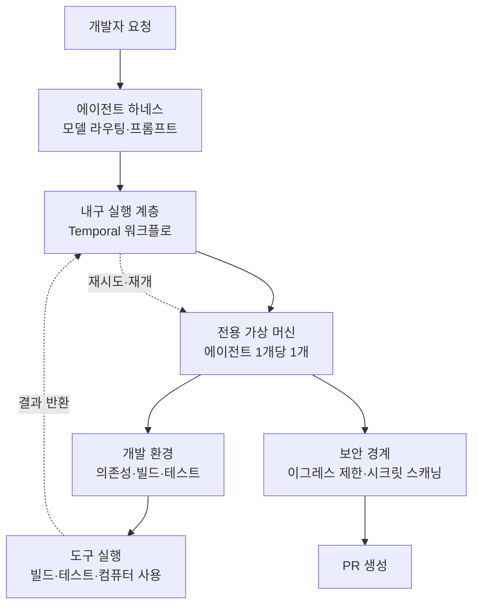

코딩 에이전트를 사내에 붙여 본 팀이라면 대체로 같은 벽을 만납니다. 데모에서는 잘 돌던 에이전트가 실제 저장소에 들어오는 순간 절반쯤에서 멈춥니다. 테스트를 못 돌리고, 의존성이 없고, 로컬에서만 통하던 환경 변수를 모릅니다. 그래서 사람들은 모델을 바꿔 봅니다. 2026년 7월 30일에 Cursor가 공개한 사내 구축기는 그 반사 반응이 대체로 틀렸다고 말합니다.

*각 에이전트가 자기 환경을 갖고 병렬로 일한 결과가 하나의 저장소로 모입니다.*

## 왜 읽어야 하나

이 글은 사내에 코딩 에이전트나 자율 실행 에이전트를 실제로 배치해야 하는 플랫폼 엔지니어, 그리고 그 실행 기반을 어디에 어떻게 놓을지 결정해야 하는 분을 위해 썼습니다. 결론을 먼저 말씀드리면, **에이전트 출력 품질을 가르는 최대 변수는 모델 등급이 아니라 에이전트가 코드를 실행하고 검증할 수 있는 개발 환경이며, 그 환경은 부수 작업이 아니라 사용자가 에이전트인 별도의 제품으로 취급해야 합니다.** Cursor는 이 판단 위에서 사내 머지 PR 중 에이전트 기여 비율을 작년 12월 10분의 1 수준에서 56%까지 끌어올렸습니다. 이 글에서는 그 구축기를 뜯어보고, 같은 문제를 푸는 우리 제품 관점에서 무엇을 가져갈 수 있는지 정리합니다.

<!-- nlm-visual -->

*NotebookLM이 소스를 종합해 생성한 인포그래픽입니다.*

## 개요

Cursor는 2026년 7월 30일 Mathew Hogan과 Arvind Saripalli 명의로 [How we set up our cloud agent environment](https://cursor.com/blog/cloud-agent-environment)를 공개했습니다. 같은 날 공식 계정이 X에 올린 한 문장이 이 글의 큐가 되었습니다. 작년 12월에는 Cursor 모노레포에 머지된 PR 열 건 중 한 건이 클라우드 에이전트에서 나왔는데, 지금은 그 비율이 56%라는 내용입니다. 회사 블로그의 표현으로는 "지금은 절반 이상을 에이전트가 쓴다"입니다.

*작년 12월 10분의 1에서 56%로. 회사가 지목한 원인은 모델 교체가 아니었습니다.*

여기서 눈여겨볼 지점은 증가폭 자체가 아니라 회사가 그 증가의 원인으로 지목한 대상입니다. 더 좋은 모델을 붙였다는 이야기가 아닙니다. 에이전트에게 개발자와 같은 수준의 개발 환경을 준 것, 그리고 에이전트가 그 환경을 스스로 고쳐 나가게 둔 것을 원인으로 꼽습니다.

이 관점은 앞서 나온 자매 글 [What we've learned building cloud agents](https://cursor.com/blog/cloud-agent-lessons)에서 더 분명하게 나옵니다. 클라우드 에이전트 출력 품질을 가르는 단일 최대 요인은 에이전트가 자기 작업을 실행하고 검증할 완전한 개발 환경을 갖췄는지 여부라는 것입니다. 로컬 에이전트에서는 이 문제가 잘 드러나지 않습니다. 개발자 노트북의 환경을 공짜로 물려받기 때문입니다. 서버로 옮기는 순간 그 공짜가 사라집니다.

## 클라우드 에이전트 환경은 무엇으로 구성되나

Cursor가 말하는 클라우드 에이전트는 서버에 올린 로컬 에이전트가 아닙니다. 각 에이전트는 자기 전용 가상 머신 위에서 돌고, 자기 환경과 의존성과 네트워크 접근 권한을 갖습니다. 병렬로 실행되고, 사람이 지켜보지 않아도 돌고, 로컬 에이전트보다 긴 작업을 맡습니다.

이 그림이 성립하려면 최소 세 가지가 필요하다는 것이 회사의 정리입니다. 내구성 있는 실행 플랫폼, 강력한 하네스, 그리고 에이전트에게 현실적인 개발 환경을 제공하는 도구와 인프라입니다.

*세 축 중 하나만 빠져도 나머지가 제 역할을 못 합니다.*

### 내구 실행: 직접 만들지 않고 Temporal로 갔다

가장 실무적인 대목은 실행 계층 선택입니다. Cursor는 클라우드 에이전트가 성숙해질수록 재시도, 여러 머신에 걸친 작업 스케줄링, 노드 장애를 넘는 내구성 같은 것을 직접 만들고 있다는 사실을 발견했습니다. 이미 Temporal이 푼 문제들이었습니다. 그래서 새로 만드는 대신 그쪽으로 옮겼습니다.

옮긴 뒤의 에이전트 루프는 추론 안정성이 잠깐 흔들려도, 파드가 동면했다가 깨어나도, 실행이 며칠이나 몇 주에 걸쳐도 살아남습니다. 회사는 이 마이그레이션만으로 신뢰도가 두 자리 나인을 넘었다고 밝혔습니다. 현재 Temporal은 700만 개가 넘는 고유 워크플로에 대해 하루 5천만 건 이상의 액션을 처리합니다.

*장시간 실행 에이전트는 결국 워크플로 엔진 문제로 수렴합니다.*

에이전트 인프라를 짜는 팀이 이 대목에서 가져갈 교훈은 단순합니다. 장시간 실행 에이전트는 결국 워크플로 엔진 문제로 수렴하며, 그 바퀴를 다시 만드는 것은 대체로 손해입니다.

### 하네스: 컴퓨터 사용을 별도 서브에이전트로 분리

하네스 쪽에서는 컴퓨터 사용 전용 서브에이전트 타입을 따로 둡니다. 자체 모델 라우팅과 자체 프롬프트, 그리고 화면 녹화를 갖습니다. 하나의 거대한 프롬프트에 모든 능력을 밀어 넣지 않고, 성격이 다른 작업을 별도 서브에이전트로 갈라 각자에게 맞는 모델과 계약을 주는 구조입니다.

### 워크플로 수명: 영원한 에이전트에서 짧은 에이전트로

또 하나 눈에 띄는 변화는 워크플로 수명 설계입니다. 초기에는 계속 살아 있는 에이전트 워크플로를 두었는데, 작업 하나를 끝내면 종료하는 짧은 워크플로 여러 개로 바꿨습니다. 이유는 운영입니다. 영원히 사는 워크플로는 버전 업그레이드를 어렵게 만듭니다. 짧게 끊으면 새 버전이 자연스럽게 흘러들어 갑니다.

## 환경을 제품으로 다룬다는 것

이 구축기에서 가장 옮겨 적을 만한 문장은 개발 환경을 그 자체로 하나의 제품으로 본다는 선언입니다. 다만 그 제품의 사용자가 사람이 아니라 에이전트입니다.

*환경의 사용자가 사람이 아니라 에이전트라면 요구 조건도 달라집니다.*

여기서 따라 나오는 실무 과제가 세 가지입니다.

첫째, 클라우드 환경을 로컬 환경과 일치시켜야 합니다. 로컬에서 되는 것이 클라우드에서 안 되면 에이전트는 그 차이를 디버깅하는 데 시간을 씁니다.

둘째, 저장소를 에이전트가 읽을 수 있을 만큼 명시적으로 만들어야 합니다. Cursor의 표현으로는 부족(部族) 지식 없이도 에이전트가 코드를 실행하고 테스트할 수 있어야 합니다. 사람 신입에게는 옆자리에서 알려 주면 되지만 에이전트에게는 저장소 안에 적혀 있어야 합니다. 실행 방법, 테스트 방법, 필요한 서비스, 시드 데이터가 문서가 아니라 재현 가능한 스크립트로 있어야 한다는 뜻입니다.

셋째, 코드베이스가 변해도 환경을 계속 건강하게 유지해야 합니다. 환경 설정은 한 번 세팅하고 끝나는 항목이 아니라 지속 관리 대상입니다.

모델이 좋아질수록 이 축의 중요도가 오히려 커진다는 관찰도 함께 나옵니다. 실행하고 검증할 환경이 없다는 이유로 막히는 사례가 반복해서 잡혔고, 모델이 똑똑해질수록 환경 설정이 그 잠재력을 다 쓸 수 있는지를 결정하는 요인이 되었다는 것입니다.

### 보안은 나중에 붙이지 않았다

에이전트에게 실행 권한을 주는 순간 보안 표면이 넓어집니다. Cursor는 보안팀과 함께 네 가지를 제품에 넣었습니다. 네트워크 이그레스 제한, 범위가 제한되고 프록시를 거치는 git 원격 접근, 커밋과 커밋 메시지에 대한 시크릿 스캐닝, 그리고 도구 실행 결과에서의 시크릿 마스킹입니다.

*실행 격리만으로는 부족하고 나가는 트래픽과 자격 증명 경로를 함께 막아야 합니다.*

이 네 가지는 그 자체로 에이전트 플랫폼의 최소 보안 체크리스트로 읽을 만합니다. 실행 격리만으로는 부족하고, 나가는 트래픽과 자격 증명이 흐르는 경로를 함께 막아야 합니다.

## 숫자가 말하는 것과 말하지 않는 것

공개된 수치를 정리하면 이렇습니다.

| 항목 | 값 | 출처 |
|---|---|---|
| 2025년 12월 머지 PR 중 클라우드 에이전트 기여 | 약 10분의 1 | Cursor 블로그 |
| 2026년 7월 기준 동일 지표 | 56% (블로그 표현으로는 절반 이상) | Cursor 공식 계정, 블로그 |
| Temporal 이관 후 신뢰도 | 두 자리 나인 초과 | Cursor 블로그 |
| Temporal 처리량 | 하루 5천만 건 이상 액션, 고유 워크플로 700만 개 이상 | Cursor 블로그 |

이 수치는 Cursor 모노레포라는 단일 환경에서 나온 값이며, 자사 제품을 자사에 적용한 결과입니다. PR 건수는 작업 난이도를 구분하지 않으므로, 56%가 곧 개발 업무의 56%를 뜻한다고 읽으면 과대 해석입니다. 다만 방향성과 그 방향을 만든 원인 지목은 충분히 참고할 가치가 있습니다.

## ThakiCloud 제품 적용 시사점

이 주제는 에이전트 실행 기반에 관한 것이므로 Paxis 렌즈가 우선이고, 그 밑을 받치는 인프라 관점에서 ai-platform 렌즈가 함께 붙습니다.

**Paxis 관점.** Paxis는 ThakiCloud의 Agent-Native Cloud로, Skills와 Tools, Policies, Audit Logs를 일급 리소스로 다룹니다. Cursor의 구축기는 이 설계가 향하는 방향과 상당 부분 겹칩니다. 960개가 넘는 스킬을 BM25로 선택해 격리 샌드박스에서 실행하는 Skill Harness는 Cursor가 말하는 하네스와 실행 환경의 조합에 해당합니다. 모든 행동을 정책 게이트와 감사 로그로 통과시키는 구조는 이그레스 제한과 시크릿 스캐닝이 풀려던 문제와 같은 자리에 있습니다.

*Cursor가 자체 인프라로 푼 문제를 Paxis는 일급 리소스로 다룹니다.*

한편 이 글에서 가져올 개선점도 분명합니다. 하나는 워크플로 수명 설계입니다. 오래 사는 루프보다 작업 단위로 끊어 종료하는 짧은 워크플로가 버전 업그레이드와 장애 복구 모두에서 유리하다는 관찰은, 에이전트 DAG를 운용하는 쪽에서 바로 적용해 볼 만합니다. 다른 하나는 환경 자체를 관리 대상으로 승격하는 것입니다. 스킬이 실행될 샌드박스의 의존성과 시드 상태를 스킬 정의와 같은 급으로 버전 관리하면, 스킬은 맞는데 환경이 어긋나서 실패하는 사례를 줄일 수 있습니다.

**ai-platform 관점.** Cursor가 별도로 공개한 [자체 인프라 실행 옵션](https://cursor.com/blog/self-hosted-cloud-agents)은 우리 고객군과 직결됩니다. 워커 프로세스가 아웃바운드 HTTPS로만 연결되고 인바운드 포트나 방화벽 변경, VPN 터널을 요구하지 않는 구조여서, 코드와 도구 실행과 빌드 아티팩트가 고객 네트워크를 벗어나지 않습니다. 국내 공공과 금융, 제조 고객이 반복해서 요구하는 조건이 정확히 이것입니다.

*인바운드 포트 없이 아웃바운드 HTTPS만으로 경계를 유지하는 구성입니다.*

ai-platform은 K8s와 Kueue 기반 GPU 스케줄링, vLLM 서빙, 멀티테넌트 격리를 온프레미스에 올리는 것을 전제로 설계되어 있습니다. 에이전트 실행 환경을 이 위에 얹으면, 추론과 도구 실행과 빌드가 모두 고객 경계 안에서 끝나는 구성이 됩니다. 여기에 에이전트 한 개당 전용 실행 단위를 주는 Cursor식 모델을 겹치면, 파드 단위 격리와 이그레스 정책, 시크릿 마스킹을 K8s 네이티브 수단으로 구현할 수 있습니다. 낮은 서빙 비용에서 나오는 경쟁력이 에이전트 경제성으로 이어지는 지점이기도 합니다. 에이전트를 여러 개 병렬로 오래 돌리는 방식은 토큰 소비가 큰데, 자체 서빙 단가가 낮으면 그 방식 자체가 성립합니다.

## 한계 및 반론

첫째, 자사 사례라는 점을 감안해야 합니다. Cursor 모노레포는 자사 엔지니어가 자사 에이전트를 위해 계속 다듬은 저장소입니다. 저장소를 에이전트가 읽을 수 있게 만드는 일에 그만큼의 투자를 하지 못하는 조직에서는 같은 비율이 나오지 않을 가능성이 높습니다.

둘째, 환경이 최대 변수라는 주장은 모델 품질이 이미 일정 수준을 넘었다는 전제 위에 있습니다. 모델이 약한 구간에서는 환경을 아무리 잘 갖춰도 결과가 따라오지 않습니다. 이 글의 교훈은 "모델을 신경 쓰지 말라"가 아니라 "모델만 바꾸며 시간을 쓰지 말라"에 가깝습니다.

셋째, 비용 이야기가 빠져 있습니다. 에이전트마다 전용 가상 머신을 주고 장시간 병렬로 돌리는 방식은 컴퓨트와 토큰을 모두 많이 씁니다. 공개된 글에는 그 비용 구조나 PR 한 건당 단가가 나오지 않습니다. 자체 도입을 검토한다면 이 축을 따로 계산해야 합니다.

넷째, PR 비율은 대리 지표입니다. 리뷰 부담이 어디로 갔는지, 결함률이 어떻게 변했는지, 롤백이 늘었는지는 이 숫자만으로 알 수 없습니다.

## 정리

Cursor의 구축기가 남기는 한 줄은 이것입니다. 클라우드 에이전트를 도입하는 일은 모델을 고르는 일이 아니라 에이전트가 살 환경을 만드는 일입니다. 머지 PR의 10분의 1에서 56%로 가는 구간에서 회사가 실제로 투자한 대상은 내구 실행 계층과 전용 실행 환경, 그리고 저장소의 명시성이었습니다.

*모델을 한 단계 올리기 전에 점검할 세 가지입니다.*

에이전트 플랫폼을 설계하고 계시다면 다음 세 가지를 이번 주 안에 점검해 볼 만합니다. 우리 저장소는 부족 지식 없이 에이전트가 빌드와 테스트를 돌릴 수 있는 상태인가, 장시간 실행을 우리가 직접 만들고 있지는 않은가, 그리고 에이전트가 나가는 트래픽과 자격 증명 경로에 정책 게이트가 걸려 있는가입니다. 이 세 항목에서 막힌다면 모델을 한 단계 올리는 것보다 그쪽을 먼저 손보는 편이 효과가 큽니다.

<!-- nlm-visual -->

*NotebookLM이 소스를 종합해 생성한 인포그래픽입니다.*

## 출처

- [How we set up our cloud agent environment · Cursor](https://cursor.com/blog/cloud-agent-environment)
- [What we've learned building cloud agents · Cursor](https://cursor.com/blog/cloud-agent-lessons)
- [Run cloud agents in your own infrastructure · Cursor](https://cursor.com/blog/self-hosted-cloud-agents)
- [Cursor 공식 계정 게시물](https://x.com/cursor_ai)
