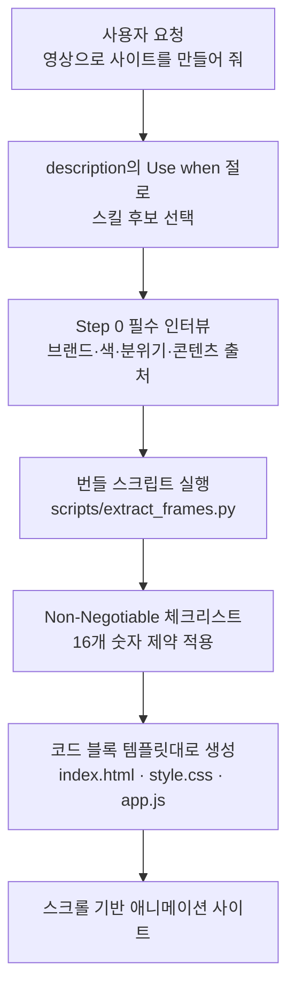

*같은 규격의 스킬 모듈이 서로 다른 에이전트 하네스에 그대로 꽂히는 상황을 표현했습니다.*

## 왜 읽어야 하나

코딩 에이전트에 스킬이나 플러그인을 붙여 운영하는 플랫폼 엔지니어, 그리고 사내 에이전트에 어떤 스킬 규격을 채택할지 정해야 하는 분들을 위한 글입니다. 결론을 먼저 말씀드리면 두 가지입니다. 첫째, 스킬 파일 포맷은 이미 벤더 경계를 넘어 사실상 하나로 수렴했습니다. 둘째, 실제로 작동하는 스킬 파일은 프롬프트가 아니라 코드와 숫자 제약 덩어리입니다. 저희가 측정한 구글 Antigravity용 스킬은 314줄 중 절반 이상이 코드 블록이었습니다.

계기는 단순합니다. 한 콘텐츠 제작자가 Gemini 3.6 Flash와 Antigravity로 애니메이션 웹사이트를 만드는 튜토리얼을 공개했고, 그 워크플로를 캡슐화한 스킬 저장소가 GitHub에 올라왔습니다. 튜토리얼 자체보다 그 저장소의 파일 구조가 훨씬 흥미로웠습니다. 저희가 매일 쓰는 스킬 규격과 사실상 같았기 때문입니다.

## 개요

다룰 대상은 [WilkoMarketing/antigravity-video-websites-skill](https://github.com/WilkoMarketing/antigravity-video-websites-skill)입니다. 영상 파일을 스크롤 기반 애니메이션 웹사이트로 바꾸는 Antigravity용 스킬이고, 저장소 설명대로 "Google Antigravity skill to turn videos into premium animated scroll-driven websites"입니다.

여기서는 세 가지를 합니다. 먼저 이 스킬 파일을 실제로 내려받아 해부하고, 다음으로 저희가 운영 중인 스킬 1911개를 완전히 같은 잣대로 재서 비교합니다. 마지막으로 이 워크플로의 기반이 된 Gemini 3.6 Flash의 토큰 경제성이 에이전트 단가에 무엇을 의미하는지 계산합니다. Antigravity IDE 자체를 설치해 실행하지는 못했습니다. 그래서 이 글은 실행 벤치마크가 아니라 공개된 산출물에 대한 구조 분석입니다.

## Antigravity 스킬은 무엇으로 이루어져 있나

저장소의 설치 안내가 구조를 그대로 알려줍니다. 전역 스킬 디렉터리는 macOS와 리눅스에서 `~/.gemini/antigravity/skills/`이고, 그 아래에 스킬 이름으로 폴더를 만들어 넣습니다.

```text
.gemini/antigravity/skills/creating-video-websites/
├── SKILL.md
└── scripts/
    └── extract_frames.py
```

`SKILL.md`의 첫머리는 이렇습니다.

```yaml
---
name: creating-video-websites
description: Turn a video into a premium scroll-driven animated website with GSAP, canvas frame rendering, and layered animation choreography. Use when the user wants to convert a video into an animated web experience.
---
```

키가 `name`과 `description` 둘뿐이고, description은 능력을 한 문장으로 서술한 뒤 "Use when"으로 발동 조건을 붙입니다. 이 구조는 저희가 사내 규칙으로 못박아 둔 스킬 description 계약과 문장 단위로 일치합니다. 벤더가 다르고 IDE가 다른데 규격이 같습니다.

본문은 네 개의 최상위 절로 구성됩니다. `When to use this skill`, `Input`, `Premium Checklist (Non-Negotiable)`, `Workflow`입니다. 이 가운데 가장 눈여겨볼 부분은 체크리스트입니다. 취향의 영역처럼 보이는 디자인 품질을 열여섯 개의 숫자 제약으로 바꿔 놓았습니다. 히어로 타이포는 12rem 이상, 마퀴 텍스트는 10vw 이상, 여섯 개 섹션이면 전체 스크롤 높이 800vh 이상, 통계 구간 오버레이 불투명도는 0.88에서 0.92 사이, 프레임 진행 속도는 1.8에서 2.2 사이, 캔버스 이미지 스케일은 0.82에서 0.90이 최적 구간이라는 식입니다. 애니메이션 종류는 네 가지 이상을 쓰되 같은 등장 효과를 연속으로 반복하지 말라는 조항도 있습니다.

워크플로는 일곱 단계인데 0단계가 인상적입니다. `Step 0: The Interview (MANDATORY)`로, 프레임을 추출하거나 코드를 쓰기 전에 브랜드명, 로고, 강조색, 배경색, 전체 분위기, 콘텐츠 출처 여섯 가지를 사용자에게 반드시 물으라고 강제합니다. 에이전트가 요구사항을 지어내고 시작하는 실패를 구조적으로 막는 장치입니다.

나머지 단계는 산출물의 뼈대를 통째로 규정합니다. 1단계에서 번들 스크립트로 영상을 WebP 프레임 150~300장으로 자르고(배경 제거가 필요하면 `--remove-bg` 플래그로 `rembg`를 태웁니다), 2단계에서 `index.html`과 `css/style.css`, `js/app.js`, `frames/` 네 갈래로 스캐폴딩합니다. 번들러는 쓰지 않고 바닐라 HTML·CSS·JS에 CDN 라이브러리만 얹는 구성입니다. 3단계부터는 로더와 내비게이션, 고정 캔버스, 마퀴 텍스트를 어떤 순서로 배치할지, 스크롤은 Lenis로 어떻게 부드럽게 만들고 GSAP 티커와 어떻게 연결할지, 캔버스 렌더러의 배경색은 프레임 모서리 픽셀에서 20프레임마다 어떻게 표본화할지까지 코드로 못박습니다. 의존성도 명시적입니다. `opencv-python`과 `numpy`, 배경 제거를 쓸 경우 `rembg[cpu]`가 사용자 환경에 있어야 합니다.



*스킬이 실행되는 경로입니다. 모델의 자유도는 체크리스트와 코드 템플릿 사이로 좁혀집니다.*

## 스킬 파일을 어떻게 재었나

인상 비평 대신 세어 보기로 했습니다. 파일을 내려받아 줄 수, 코드 펜스 줄 수, frontmatter 키, 체크리스트 항목 수를 세는 스크립트를 썼습니다.

```python
for l in lines:
    if l.strip().startswith("```"):
        in_fence = not in_fence
        code += 1
        continue
    if in_fence:
        code += 1
```

같은 함수를 저장소의 `.claude/skills/*/SKILL.md` 전체에 그대로 돌려 비교군을 만들었습니다. 한 가지 함정이 있었습니다. description을 `^description:\s*(.*)$` 정규식으로 뽑으면, 저희 스킬 다수가 쓰는 YAML 접힘 표기(`description: >-`)에서는 `>-`만 잡히고 본문은 통째로 누락됩니다. 처음 측정에서 "Use when" 보유 스킬이 1911개 중 71개로 나온 것은 코퍼스의 문제가 아니라 파서의 버그였습니다. 접힘 블록의 들여쓴 후속 줄까지 이어 붙이도록 고친 뒤 숫자가 제자리를 찾았습니다.

```python
inline = line.partition(":")[2].strip()
if inline and inline not in (">", ">-", "|", "|-", ">+", "|+"):
    return inline
# 접힘 블록이면 들여쓴 후속 줄을 이어 붙인다
```

스크립트는 `scripts/blog/_skillmd_anatomy_20260803.py`와 `_skillmd_corpus_20260803.py`에, 원본 출력은 `outputs/blog-impl/antigravity-skill-format-gemini-flash/`에 남겼습니다.

## 실제 측정 결과

Antigravity 스킬의 수치입니다. `SKILL.md`는 13,735바이트에 314줄이고, 그중 171줄이 코드 펜스 안에 있습니다. 비율로는 54.5퍼센트입니다. frontmatter 키는 정확히 `name`과 `description` 두 개, description은 205자이며 "Use when"을 포함합니다. 최상위 절 네 개, 워크플로 단계 일곱 개, 체크리스트 항목 열여섯 개, 번들 스크립트 `scripts/extract_frames.py`는 84줄입니다.

자체 코퍼스는 스킬 1911개 기준으로 중앙값 154줄, 평균 189.3줄, 최대 2063줄입니다. 코드 비율은 중앙값 18.5퍼센트, 평균 19.5퍼센트입니다. 1379개(72.2퍼센트)가 description에 "Use when" 트리거를 갖고 있고, 1396개(73.1퍼센트)가 frontmatter를 `name`과 `description` 두 키로만 유지합니다. 번들 `scripts/` 디렉터리를 가진 스킬은 154개(8.1퍼센트)입니다.


*동일한 계수 규칙으로 잰 SKILL.md의 코드 펜스 줄 비율입니다. Antigravity 스킬 54.5퍼센트는 자체 코퍼스 중앙값 18.5퍼센트보다 훨씬 높지만, 실행 절차를 강하게 규정하는 저희 툴킷 계열보다는 낮습니다.*

비교하면 그림이 분명해집니다. Antigravity 스킬은 저희 중앙값보다 두 배 길고 코드 밀도는 세 배 가까이 높습니다. 다만 저희 코퍼스에서도 실행 절차를 강하게 규정하는 계열은 훨씬 더 코드에 가깝습니다. pillow-toolkit이 679줄에 87.3퍼센트, exiftool-toolkit이 519줄에 85.9퍼센트, vips-toolkit이 483줄에 77.0퍼센트입니다. 중앙값이 18.5퍼센트로 낮은 이유는 코퍼스에 라우팅이나 판단 기준을 서술하는 산문형 스킬이 많이 섞여 있기 때문입니다.

여기서 얻는 교훈은 벤더 차이가 아닙니다. 결과물의 품질이 걸린 스킬일수록 자유 서술이 줄고 코드와 숫자 제약이 늘어난다는 것입니다. Antigravity 스킬이 디자인 취향을 열여섯 개 숫자로 바꾼 것과, 저희 툴킷이 명령을 통째로 박아 둔 것은 같은 처방입니다.

한편 이 워크플로의 기반 모델인 Gemini 3.6 Flash는 2026년 7월 21일 공개됐고 Antigravity에서 첫날부터 쓸 수 있습니다. 구글 발표 기준으로 3.5 Flash 대비 출력 토큰을 17퍼센트 적게 쓰고, 출력 단가는 100만 토큰당 9.00달러에서 7.50달러로 내렸습니다. 두 효과를 곱하면 같은 작업의 출력 비용은 0.83 곱하기 7.50 나누기 9.00, 즉 약 69퍼센트 수준이 되어 31퍼센트가량 절감됩니다. 코딩 지표도 DeepSWE 37퍼센트에서 49퍼센트, MLE Bench 49.7퍼센트에서 63.9퍼센트, OSWorld-Verified 78.4퍼센트에서 83.0퍼센트로 올랐습니다.

## ThakiCloud 제품 적용 시사점

**Paxis** 관점에서 이 관찰은 곧바로 쓸모가 있습니다. Paxis는 다키클라우드의 Agent-Native Cloud 제어 평면으로 스킬과 도구, 정책, 감사 로그를 일급 리소스로 다룹니다. 스킬 하네스는 요청이 들어오면 대규모 스킬 코퍼스에서 BM25로 후보를 고르고 격리 샌드박스에서 실행합니다. 이번 측정이 확인해 준 것은 그 선택 신호가 벤더를 가리지 않는다는 사실입니다. Antigravity 스킬도 `name`과 `description`, 그리고 "Use when" 절로 발동 조건을 노출하므로, 라우터 입장에서는 형태가 같은 입력입니다. 외부 생태계에서 만들어진 스킬을 그대로 인덱싱해 후보군에 넣을 수 있다는 뜻입니다.

동시에 경계도 분명해집니다. 포맷이 같다고 실행까지 호환되지는 않습니다. 이 스킬은 `pip install opencv-python`과 `rembg[cpu]`를 사용자 환경에 요구하고 로컬 파일 경로를 직접 다룹니다. 임의의 외부 스킬을 무비판적으로 끌어오면 의존성 설치와 파일 접근이 그대로 따라옵니다. Paxis가 스킬을 샌드박스에서 돌리고 모든 행동을 정책 게이트와 감사 로그로 통과시키는 설계를 택한 이유가 정확히 이 지점입니다. 포맷 호환은 도입 비용을 낮추지만 실행 격리는 여전히 플랫폼의 몫입니다.

측정 과정에서 자체 코퍼스에 대해서도 실무 과제가 하나 드러났습니다. 번들 `scripts/` 디렉터리를 가진 스킬이 1911개 중 154개, 8.1퍼센트에 그칩니다. 결정론적 코드로 내릴 수 있는 절차를 아직 산문으로 두고 있는 스킬이 많다는 신호이고, 포맷을 코드가 소유하게 만드는 저희 내부 원칙에 비추면 개선 여지가 그만큼 남아 있습니다.

**ai-platform** 관점에서는 단가 이야기가 따라붙습니다. 에이전트 워크로드의 비용은 결국 출력 토큰에 비례하고, 위에서 계산한 31퍼센트 절감은 상용 API를 쓸 때의 이야기입니다. 코드나 자산을 외부로 내보낼 수 없는 조직이라면 같은 절감을 온프레미스에서 만들어야 하고, 그 수단은 쿠버네티스와 Kueue 기반 GPU 스케줄링, vLLM 서빙 최적화입니다. 다키클라우드 ai-platform이 겨냥하는 지점이 여기입니다.

## 한계 및 반론

이 글의 가장 큰 한계는 실행하지 않았다는 점입니다. Antigravity IDE를 설치해 스킬을 돌려보지 않았으므로, 저 열여섯 개 제약이 실제로 좋은 결과물을 만드는지는 검증하지 못했습니다. 확인한 것은 파일이 무엇을 요구하는지이지 결과물의 품질이 아닙니다.

측정 지표 자체도 거칠습니다. 코드 펜스 줄 비율은 스킬의 성격을 가늠하는 대리 지표일 뿐 품질 점수가 아닙니다. 판단 기준이나 라우팅 규칙을 서술하는 스킬은 코드 비율이 낮은 것이 정상이며, 그런 스킬에 억지로 코드를 채우면 오히려 나빠집니다. 저희 중앙값 18.5퍼센트를 개선 대상으로 읽으면 곤란한 이유입니다.

표본도 하나입니다. 개인 개발자가 올린 스킬 저장소 한 개를 근거로 "Antigravity 스킬 생태계가 이렇다"고 일반화할 수는 없습니다. 구글이 공식 스킬 규격을 어떻게 문서화했는지는 별도로 확인해야 하고, 이 저장소가 그 규격을 정확히 따르는지도 확인하지 않았습니다.

Gemini 3.6 Flash 수치는 구글 발표를 보도한 기사에 근거합니다. 17퍼센트 토큰 절감은 Artificial Analysis Index 기준이고 워크로드에 따라 달라지므로, 31퍼센트 절감이라는 계산도 그 전제 위에서만 성립합니다. 실제 애플리케이션에서 재보지 않은 값입니다.

마지막으로 "포맷이 수렴했다"는 관찰이 곧 표준화를 뜻하지는 않습니다. `name`과 `description`이 겹친다는 것과 도구 권한 모델, 샌드박스 정책, 번들 자산 규약까지 호환된다는 것은 전혀 다른 이야기입니다.

## 정리

Antigravity용으로 공개된 스킬 하나를 뜯어보니 `SKILL.md`에 `name`과 `description`을 두고 "Use when"으로 발동 조건을 적는 규격이 저희 것과 같았고, 314줄 중 54.5퍼센트가 코드였으며, 디자인 취향은 열여섯 개의 숫자 제약으로 환원돼 있었습니다. 서두에서 말씀드린 두 결론이 그대로 확인된 셈입니다. 포맷은 벤더를 넘어 수렴했고, 작동하는 스킬은 프롬프트가 아니라 코드와 제약입니다.

실무적으로 가져갈 것은 하나입니다. 스킬을 새로 쓸 때 "무엇을 잘해 줘"라고 서술하고 싶어지는 대목마다, 그것을 숫자나 코드로 바꿀 수 있는지 먼저 물어보시기 바랍니다. 12rem 이상, 0.88에서 0.92 사이처럼 검증 가능한 형태로 내려올 수 있다면 그렇게 쓰는 편이 낫습니다. 모델의 자유도를 줄이는 만큼 결과물의 평균 품질이 올라갑니다.

## 출처

- 스킬 저장소: [WilkoMarketing/antigravity-video-websites-skill](https://github.com/WilkoMarketing/antigravity-video-websites-skill) (`SKILL.md`, `scripts/extract_frames.py`)
- Gemini 3.6 Flash 발표 보도: [Google launches Gemini 3.6 Flash and 3.5 Flash-Lite, teases Gemini 4](https://9to5google.com/2026/07/21/gemini-3-6-flash-launch/) (9to5Google, 2026년 7월 21일)
- 측정 스크립트와 원본 로그: `scripts/blog/_skillmd_anatomy_20260803.py`, `scripts/blog/_skillmd_corpus_20260803.py`, `outputs/blog-impl/antigravity-skill-format-gemini-flash/run-1.log`, `run-2.log`
