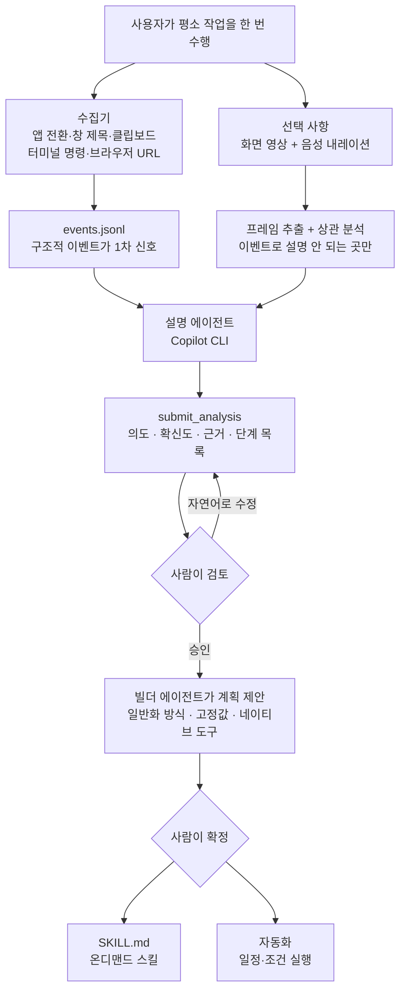

*한 번의 시연이 재사용 가능한 절차로 굳는 과정입니다. 이 도구가 하려는 일이 정확히 이것입니다.*

## 왜 읽어야 하나

이 글은 사내에 에이전트를 도입하면서 "스킬을 누가 어떻게 쓸 것인가"라는 벽에 부딪힌 플랫폼 담당자와, 스킬 저작 파이프라인을 설계 중인 에이전트 엔지니어를 위해 썼습니다. 결론을 먼저 말씀드리면, **Skill Recorder의 핵심 기여는 화면 녹화가 아니라 녹화를 클릭 재생으로 되돌리지 않고 에이전트의 네이티브 도구 호출로 일반화한다는 설계 결정입니다. 그리고 그 일반화를 사람이 자연어로 검토하고 고칠 수 있게 중간 단계를 열어 둔 것이 실제로 쓸 만한 물건과 데모를 가르는 지점입니다.** 저장소를 직접 받아 코드를 읽고 테스트를 돌려 확인한 내용을 아래에 정리했습니다.

## 개요

스킬이라는 형식은 지난 한 해 동안 빠르게 표준에 가까워졌습니다. 마크다운 한 장에 절차를 적고 프론트매터로 언제 쓰는지 설명하면, 에이전트가 요청을 보고 알아서 골라 씁니다. 문제는 그 마크다운을 누가 쓰느냐입니다. 실무 절차를 가장 잘 아는 사람은 대개 그 절차를 문서로 옮길 시간이 없는 사람이고, 시간이 있는 사람은 절차를 모릅니다. 스킬 생태계의 병목은 소비가 아니라 생산 쪽에 있었습니다.

[microsoft/skill-recorder](https://github.com/microsoft/skill-recorder)는 그 병목을 겨냥합니다. 사용자가 평소 하던 작업을 한 번 하는 동안 화면 세션을 녹화하고, GitHub Copilot CLI를 통해 그 세션을 의도 하나와 순서가 있는 단계 목록으로 복원한 뒤, 재사용 가능한 스킬이나 자동화로 만들어 냅니다. 라이선스는 MIT이고 저작권 표기는 Microsoft Corporation입니다. 제가 확인한 시점의 최신 커밋은 2026년 7월 30일자 `32fd0b5`이며 릴리스 0.3.1을 병합한 것입니다.

받아 보면 규모가 짐작보다 큽니다. 테스트와 문서를 포함한 TypeScript 계열 소스가 2만 줄을 조금 넘습니다. 데모용 프로토타입이 아니라 배포를 전제로 만든 물건입니다.

## 이 기술은 무엇인가

동작을 단계로 나누면 네 덩어리입니다.

첫째, **수집**입니다. `common/events.ts`가 정의한 이벤트 타입을 보면 무엇을 잡는지 바로 드러납니다. 세션 시작과 종료, 활성 애플리케이션 전환, 창 제목 변경, 클립보드 변경, 터미널 명령, 브라우저 URL, 그리고 영상 시작과 종료 및 프레임 캡처입니다. 픽셀을 통째로 이해하려 들지 않고 **의미가 있는 구조적 신호를 먼저 잡는다**는 태도가 여기서부터 보입니다.

둘째, **복원**입니다. `electron/describer/`가 Copilot CLI 에이전트를 띄우고 세션을 해석하게 합니다. 에이전트에게 주는 도구는 세 갈래입니다. 정리된 타임라인을 읽는 `get_timeline`, 사용자가 말로 남긴 설명을 읽는 `get_narration`, 그리고 특정 시점의 화면 프레임을 꺼내 보는 도구들입니다. 결과는 `submit_analysis`로 제출하는데 인자가 의미심장합니다. 제목, 의도, **의도에 대한 확신도**, 그 확신의 근거, 그리고 단계 목록입니다.

셋째, **계획과 승인**입니다. `common/skill.ts`의 주석이 이 단계를 정확히 설명합니다. 승인된 분석에서 출발해 멀티턴 Copilot 에이전트가 먼저 계획을 제안합니다. 녹화된 작업을 어떻게 일반화할지, 고정값으로 무엇이 필요한지, 대상 아키텍처의 어떤 네이티브 도구를 쓸지를 담은 계획입니다. 사용자는 이것을 자연어로 다듬고, 확정하면 최종 산출물이 만들어집니다.

넷째, **산출**입니다. 결과물은 두 종류입니다. 설명이 요청과 맞을 때 에이전트가 불러 쓰는 온디맨드 `SKILL.md`, 그리고 일정이나 조건으로 실행되는 다단계 자동화입니다. 대상 아키텍처는 Microsoft Scout와 Microsoft 365 Copilot(Cowork)이 현재 활성화되어 있고 Copilot Studio는 코드에 "coming soon"으로 비활성 처리되어 있습니다.




*네 덩어리 중 세 번째에 사람이 들어갑니다. 그 자리가 이 도구의 설계 핵심입니다.*

가장 인상적인 설계 판단은 영상을 다루는 방식입니다. `electron/pipeline.ts`의 주석은 의도적으로 영상 전체를 훑지 않는다고 못 박습니다. 이벤트가 1차 신호이고, 이벤트로 설명되지 않는 구간만 프레임 조사 후보로 올린 뒤 확신이 낮은 곳에서만 실제로 프레임을 꺼내 봅니다. 설명 에이전트에게 주는 지침에도 같은 원칙이 반복됩니다. 대부분의 단계는 이벤트만으로 완전히 설명되니 프레임 예산은 다섯 장 남짓으로 잡으라는 것입니다. 멀티모달 모델에 영상을 통째로 밀어 넣는 접근과 비교하면 비용과 정확도 양쪽에서 훨씬 현실적입니다.

두 번째로 눈에 띈 것은 **의도를 필터로 쓴다**는 규칙입니다. 지침은 화면에 나타난 모든 것을 전사하지 말라고 명시합니다. 의도가 분명해지면 그 의도에 기여하지 않는 활동은 단계에서 빼라는 것입니다. 심지어 녹화 시작 버튼을 누르려고 Skill Recorder 창을 띄운 첫 단계와 정지를 누른 마지막 단계는 사용자의 작업이 아니라 녹화 장치의 흔적이므로 단계로 내보내지 말라고 따로 지시합니다. 사람이 시연하다가 잠깐 딴 사이트에 들렀다면 그것도 빠집니다.


*영상보다 이벤트를 먼저 믿고, 의도로 걸러 내고, 전사는 기기 안에서 끝냅니다.*

## 설치 및 통합

저장소를 격리된 작업 트리에 받아 직접 돌려 봤습니다.

```bash
git clone --depth 1 https://github.com/microsoft/skill-recorder.git
cd skill-recorder
node --version   # v24.1.0
npm --version    # 11.3.0
npm install --no-audit --no-fund
```

의존성 설치는 609개 패키지에 25초가 걸렸습니다. Electron 43과 Vite 8이 들어오는 것치고는 가벼운 편입니다. 런타임 의존성 목록이 이 도구의 성격을 잘 보여 줍니다.

```json
"dependencies": {
  "@github/copilot-sdk": "^1.0.6",
  "@huggingface/transformers": "^4.2.0",
  "koffi": "^3.1.1",
  "sharp": "^0.34.5",
  "zod": "^4.3.6"
}
```

`@github/copilot-sdk`가 분석과 빌드를 담당하는 에이전트이고, `koffi`는 네이티브 창 정보를 읽기 위한 FFI, `sharp`는 프레임 이미지 처리입니다. 여기서 `@huggingface/transformers`의 존재가 중요합니다. 음성 내레이션 전사가 이 라이브러리와 ONNX 런타임을 통해 **로컬에서** 처리된다는 뜻이기 때문입니다. macOS 빌드 설정의 마이크 권한 문구도 같은 이야기를 합니다. 내레이션을 켠 동안에만 마이크를 쓰고 전사는 이 컴퓨터에서 한다고 명시되어 있습니다.

테스트를 돌려 봤습니다.

```bash
npm test
# ℹ tests 58
# ℹ pass 58
# ℹ fail 0
# ℹ duration_ms 686.846708
```

58개 테스트가 0.69초 만에 전부 통과했습니다. 통과 자체보다 **무엇을 테스트하는지**가 흥미롭습니다. 목록에 이런 항목들이 있습니다. 상세 고지를 검토하기 전까지는 매번 녹화 시작 전에 경고한다, 고지 확인 상태는 앱을 새로 띄우면 유지되지 않는다, 세션 용량 계산에 모든 산출물이 포함되고 삭제하면 디렉터리 전체가 사라진다. 화면과 클립보드와 터미널을 녹화하는 도구가 가져야 할 최소한의 예의를 테스트로 못 박아 둔 것입니다.

컴파일 준수 관련 테스트도 인상적입니다. 검토되지 않은 ONNX 버전은 실패로 닫히고, 검토되지 않은 GitHub Copilot CLI 버전도 실패로 닫히며, 라이선스 파일만 담긴 번들은 릴리스 검증을 통과할 수 없습니다. 사내 배포를 염두에 둔 조직이 실사할 때 확인하고 싶어 할 항목들이 이미 자동화되어 있습니다.

한 가지 정직하게 남겨 둡니다. **실제 녹화 세션은 돌리지 못했습니다.** 화면 캡처 권한이 필요한 데스크톱 GUI 앱이고 Copilot CLI 로그인이 전제되기 때문에, 자동화된 환경에서 끝까지 재현할 수 없었습니다. 위에 적은 파이프라인 동작은 코드와 지침 파일을 읽어 확인한 것이고, 숫자는 실제로 실행한 설치와 테스트에서 나온 값입니다.

## ThakiCloud 제품 적용 시사점

다키클라우드의 Agent-Native Cloud인 Paxis는 스킬과 도구, 정책, 감사 로그를 일급 리소스로 다루는 제어 평면입니다. 960개가 넘는 스킬 중에서 요청에 맞는 후보를 골라 격리된 샌드박스에서 실행하고, 모든 행동을 정책 게이트와 감사 로그로 통과시킵니다. 그래서 이 도구를 볼 때 저희 관심은 "스킬을 어떻게 고르는가"가 아니라 "스킬이 어디서 오는가"에 있습니다.

첫째, **입력단의 공백을 정확히 짚었습니다.** 저희 하네스에서 스킬은 사람이 작성하거나 야간 자가진화 루프가 기존 스킬을 다듬어 만들어집니다. 둘 다 이미 문서화된 절차에서 출발합니다. 반면 현업의 손끝에만 남아 있는 절차, 이를테면 특정 대시보드에서 값을 확인해 티켓 양식에 옮겨 적는 일 같은 것은 어느 쪽 경로로도 들어오지 않습니다. 시연 한 번을 초안으로 바꾸는 경로는 그 공백을 메웁니다.

둘째, **UI 재생이 아니라 네이티브 도구로 일반화한다는 원칙은 그대로 가져올 만합니다.** 클릭 좌표를 다시 밟는 자동화는 화면이 바뀌는 순간 깨집니다. 관찰된 클릭을 같은 결과를 내는 API 호출이나 CLI 명령으로 번역해 두면 훨씬 오래 삽니다. 저희 룰에도 포맷과 판정은 결정론적 코드가 소유하고 모델은 내용만 만든다는 원칙이 있는데, 결이 같은 이야기입니다.

셋째, **확신도를 산출물에 포함시킨 점을 참고하고 있습니다.** 분석 결과에 의도 확신도와 그 근거가 함께 실린다는 것은, 사람이 어디를 먼저 봐야 하는지 알려 준다는 뜻입니다. 자동 생성 스킬을 사람이 검토하는 단계에서 이 신호가 있으면 검토 비용이 크게 줄어듭니다. 저희 스킬 인테이크 게이트에 붙이기 좋은 필드입니다.

넷째, **경계도 분명합니다.** 산출물이 Microsoft Scout와 Cowork를 대상으로 하기 때문에 그대로 저희 하네스에 꽂히지는 않습니다. 다만 중간 산출물인 의도와 단계 목록은 대상 중립적입니다. 그 지점에서 갈라 저희 형식으로 렌더링하는 어댑터를 두는 것이 현실적인 통합 방향입니다. 마침 저장소에도 빌더와 스킬 빌더를 각각 평가하는 하네스가 `evals/`에 따로 마련되어 있어, 어떤 부분이 교체 가능한 경계인지 코드가 스스로 알려 줍니다.


*네 갈래 모두 스킬을 고르는 쪽이 아니라 스킬이 들어오는 쪽에 관한 이야기입니다.*

## 한계 및 반론

가장 큰 제약은 도구가 데스크톱 애플리케이션이라는 점입니다. 사람이 앉아서 시연해야 하고, 화면과 클립보드와 터미널에 대한 접근 권한을 줘야 합니다. 서버에서 배치로 돌릴 수 있는 물건이 아닙니다. 조직에 도입하려면 어떤 화면을 녹화해도 되는지에 대한 사내 규정이 먼저 필요합니다. 개발팀이 이 부분을 테스트로 방어해 둔 것은 좋지만, 규정 자체를 대신해 주지는 않습니다.

일반화의 품질도 검증이 필요한 영역입니다. 한 번의 시연에서 무엇이 고정값이고 무엇이 매번 달라지는 변수인지 판단하는 일은 본질적으로 추론입니다. 양식을 한 번 제출한 기록에서 "모든 양식을 제출하는 절차"를 뽑아내려면, 이번에 입력한 특정 값이 예시인지 상수인지 알아야 합니다. 이 판단이 틀리면 스킬이 조용히 잘못 동작합니다. 도구가 계획 단계를 사람에게 열어 두고 자연어 수정을 받는 이유가 여기 있는데, 뒤집어 말하면 **사람의 검토를 생략할 수 없는 구조**라는 뜻이기도 합니다.


*세 한계 모두 도구가 아니라 도입하는 조직이 답을 정해야 하는 항목입니다.*

마지막으로, 시연 한 번이 좋은 스킬을 보장하지는 않습니다. 사람이 평소 하던 방식이 최적이 아닐 수 있고, 그 비효율까지 함께 굳어 버릴 수 있습니다. 절차를 그대로 옮기는 것과 절차를 다시 설계하는 것은 다른 일입니다. 이 도구가 잘하는 것은 앞쪽이고, 뒤쪽은 여전히 사람의 몫으로 남습니다.

## 정리

Skill Recorder에서 가져갈 것은 화면 녹화 기능이 아니라 세 가지 설계 판단입니다. 구조적 이벤트를 1차 신호로 삼고 영상은 확신이 낮은 곳에만 쓴다는 것, 관찰된 클릭을 재생하지 않고 네이티브 도구 호출로 번역한다는 것, 그리고 의도와 계획을 사람이 자연어로 고칠 수 있게 파이프라인 한가운데를 열어 둔다는 것입니다. 셋 다 저희가 스킬 저작 경로를 설계할 때 그대로 참고할 만합니다.

에이전트를 도입 중이신 팀이라면 질문 하나를 던져 보시길 권합니다. 우리 조직에서 가장 자주 반복되지만 아무도 문서로 적지 않은 절차가 무엇인가. 그 답이 곧 첫 녹화 대상이고, 스킬 라이브러리에서 지금 비어 있는 자리입니다.

## 출처

- [microsoft/skill-recorder 저장소 (MIT)](https://github.com/microsoft/skill-recorder): 확인 시점 커밋 `32fd0b5`, 릴리스 0.3.1 (2026-07-30)
- [Visual Studio Blog: Agent Skills in Visual Studio](https://devblogs.microsoft.com/visualstudio/agent-skills-in-visual-studio/)
- [Microsoft Learn: Use Agent Skills with GitHub Copilot](https://learn.microsoft.com/en-us/visualstudio/ide/copilot-agent-skills?view=visualstudio)
- 원 논의: [타임라인 소개 글](https://x.com/hjguyhan/status/2084036443769643295)
- 실행 로그: 설치와 테스트 수치는 `outputs/blog-impl/ms-skill-recorder/run-5.log`, `run-6.log`에서 가져왔습니다.
