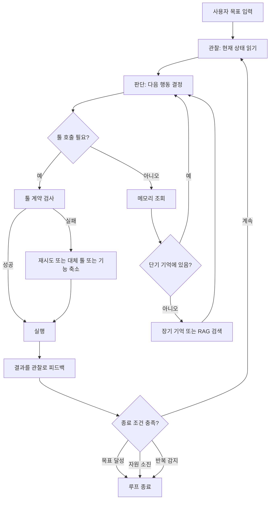

에이전트를 처음 붙이는 팀은 대개 툴 몇 개를 스키마로 감싸고 프롬프트를 다듬는 데서 시작합니다. 그런데 몇 주 지나면 같은 질문을 반복해서 다시 만납니다. 이 루프는 언제 멈춰야 하는가, 실패한 툴은 누가 대신하는가, 어제 나눈 대화를 오늘도 기억해야 하는가. 이 글은 그 질문들을 처음부터 구조로 잡아두면 나중에 되돌아가 고치는 비용을 줄일 수 있다는 전제에서 출발합니다.

핵심은 네 가지입니다. 에이전트가 진짜 에이전트인지 판별하는 기준, 에이전트가 세상과 접촉하는 창구인 툴의 계약, 컨텍스트 윈도우 안에서 무엇을 남기고 무엇을 버릴지 정하는 메모리 계층, 그리고 이 모든 것을 감싸는 루프의 종료 조건입니다. 넷 중 하나라도 즉흥적으로 정하면 나머지 셋도 흔들립니다.

## 행위자성은 복구 능력으로 구별합니다

에이전틱 시스템과 자동화를 가르는 기준은 겉모습이 아니라 실패했을 때의 행동입니다. 신호등이 빨간불이면 멈추는 자율주행차는 자율적이지만 행위자적이지는 않습니다. 입력이 출력을 결정할 뿐, 신호등이 고장 났을 때 우회로를 판단하는 능력은 없기 때문입니다. 반면 예상하지 못한 상황에서 스스로 새 전략을 구성하는 시스템만이 행위자성을 갖습니다.

이 구분이 실무에서 중요한 이유는 설계 초반의 판단을 완전히 바꿔놓기 때문입니다. 자동화 파이프라인을 만들 때는 예외 케이스를 미리 열거하고 각각에 분기를 짜는 방식이 정답입니다. 하지만 그 방식을 에이전트에 그대로 옮기면, 정의해 둔 분기 밖의 상황에서 시스템이 아무것도 하지 못하고 멈춥니다. 에이전트라면 관찰한 상태를 스스로 해석해서 새로운 행동을 골라야 하는데, 분기표 안에서만 사는 시스템은 그 일을 못 합니다.

에이전틱 시스템은 관찰, 판단, 실행이라는 세 단계가 순환하는 구조 위에서 동작합니다. 관찰에서 지금 상태를 읽고, 판단에서 다음 행동을 고르고, 실행에서 그 행동을 옮긴 뒤 결과가 다시 관찰로 돌아옵니다. 이 순환 자체는 단순하지만, 순환이 언제 멈추는지를 정하지 않으면 시스템은 영원히 돕니다. 그래서 설계자가 가장 먼저 답해야 할 질문은 "이 에이전트가 진짜 판단을 새로 내리는가"이고, 그다음이 "그 판단의 반복을 언제 끊는가"입니다.

이 구분을 코드 리뷰 봇에 적용해 보면 차이가 뚜렷해집니다. 정해진 린트 규칙에 걸린 줄에 항상 같은 코멘트를 다는 봇은 자율적이지만 행위자적이지는 않습니다. 반면 코멘트를 단 뒤 개발자의 반응(수용, 무시, 반박)을 관찰하고, 같은 유형의 지적이 반복해서 무시되면 그 규칙의 우선순위를 스스로 낮추는 봇은 행위자성을 갖습니다. 두 봇의 코드는 겉보기에 비슷해도 아키텍처는 완전히 다릅니다. 후자에는 관찰 결과를 다음 판단에 반영하는 상태 저장 경로가 반드시 있어야 하기 때문입니다.

## 툴은 API가 아니라 협업 계약입니다

에이전트가 세상에 개입하는 유일한 통로가 툴입니다. 그런데 툴을 일반적인 함수나 API처럼 설계하면 문제가 생깁니다. 사람이 문서를 읽고 호출하는 API와 달리, 툴은 이름과 설명과 스키마만으로 에이전트에게 스스로를 설명해야 합니다. 사람이 옆에서 보충 설명을 해주지 않습니다.

여기서 자주 나오는 실수가 추상화 수준을 잘못 잡는 것입니다. "일정 생성"이라는 툴 하나만 두면 에이전트가 시간, 장소, 참석자, 충돌 여부를 전부 스스로 판단해야 합니다. 반대로 "시간 확인", "장소 확인", "참석자 확인", "충돌 감지", "일정 등록"으로 다섯 개를 쪼개면 각 판단이 분리된 단위로 제공되어 에이전트가 필요한 만큼만 조합해서 씁니다. 어느 쪽이 맞는지는 정답이 없고, 에이전트의 추론 능력 수준에 맞춰야 합니다.

계약 설계에서 지켜야 할 원칙 중 실무에 가장 자주 걸리는 것이 에러 표현입니다. 툴이 실패했을 때 "실패했다"는 사실만 돌려주면 에이전트는 다음 행동을 고를 근거가 없습니다. "권한 부족"이라는 에러는 에이전트에게 권한을 확보하라는 신호가 되어야 하고, "대상이 존재하지 않는다"는 대상을 먼저 만들라는 신호가 되어야 합니다. 에러 메시지는 로그가 아니라 다음 판단을 위한 입력값입니다.

멱등성도 마찬가지로 설계 단계에서 정해야 하는 성질입니다. 동일한 입력에 동일한 결과가 나온다는 보장이 있어야 에이전트가 계획을 세우고 실패 시 복구 전략을 짤 수 있습니다. 다만 상태를 바꾸는 툴은 근본적으로 멱등하지 않습니다. 이런 툴은 결과를 예측 가능한 상태 변화로 설계하거나, 애초에 에이전트가 그 결과를 해석해서 다음 단계를 판단하도록 계약을 짜야 합니다.

실패 처리는 재시도, 대체 툴, 기능 축소라는 세 층위로 나눠 미리 계획해두는 편이 낫습니다. 재시도는 일시적 문제에만 유효하고 상한이 필요합니다. 대체 툴은 같은 목적을 다른 경로로 달성하는 예비 수단입니다. 기능 축소는 전체 기능을 잠시 내리는 대신 좁힌 기능으로라도 계속 동작시키는 전략입니다. 이 세 가지를 런타임에 즉석으로 판단하게 두면 실패마다 결과가 달라지지만, 미리 계획해두면 실패가 나도 시스템의 행동이 일관됩니다.

## 메모리는 단기와 장기를 나눠야 밀도가 유지됩니다

컨텍스트 윈도우는 유한합니다. 모든 대화를 그대로 다 담아두는 방식은 구현은 쉽지만 금방 포화합니다. 그렇다고 중요도 점수로 무작정 걸러내면, 그 점수 기준이 불명확할 때 에이전트가 엉뚱한 정보를 근거로 판단하게 됩니다.

실무에서 통하는 구조는 단기 기억과 장기 기억을 물리적으로 분리하는 것입니다. 단기 기억에는 지금 진행 중인 작업에 바로 필요한 것만 남깁니다. 현재 대화의 맥락, 작업 상태, 당장의 목표입니다. 장기 기억에는 지금 당장은 필요 없지만 나중에 쓸모 있는 것을 보관합니다. 사용자 취향, 반복되는 절차, 쌓인 경험입니다. 둘을 같은 수준으로 섞어두면 항상 필요한 정보가 가끔 필요한 정보에 섞여 밀도가 낮아집니다.

이 구분에서 실제로 어려운 부분은 언제 단기에서 장기로 승격시키는가입니다. 빈도, 중요도, 시간이라는 세 축을 함께 씁니다. 자주 언급되는 개념은 승격하고 한 번만 나온 세부는 버립니다. 중요도는 사용자의 명시적 피드백이나 작업 성공 여부로 판단하고, 시간은 오래될수록 가중치를 낮춥니다. 세 축을 모두 코드로 명시해야 승격 기준이 재현 가능해집니다.

검색 증강 생성, 즉 RAG는 에이전트 메모리와 겹쳐 보이지만 실제로는 다른 문제를 풉니다. RAG는 질문이 들어오면 그에 맞는 지식을 찾아오는 pull 방식이고, 에이전트 메모리는 대화가 진행되는 동안 시스템이 알아서 중요한 것을 골라 저장하는 push 방식입니다. 실무에서는 이 둘에 실시간 툴 호출을 더해 세 갈래로 역할을 나누는 편이 깔끔합니다. 에이전트 자신의 동작 범위 안 정보(대화 맥락, 작업 진행)는 에이전트 메모리가, 동작 범위 밖이지만 검색으로 닿는 정보(사내 문서, 카탈로그)는 RAG가, 실시간으로만 얻을 수 있는 정보(현재 시각, 외부 API 상태)는 툴 호출이 담당합니다. RAG가 에이전트 메모리를 대체한다고 생각하면 설계가 꼬입니다. 둘은 서로 보완하는 별개의 층입니다.

메모리 구조화 수준도 초반에 정해야 하는 선택입니다. 대화를 전문 그대로 저장하면 정보 손실은 없지만 검색 효율이 낮습니다. 스키마로 미리 정의해서 구조화하면 검색은 빨라지지만 그 구조에 안 맞는 정보는 버려집니다. 대부분의 프로덕션 시스템은 그 중간을 택합니다. 핵심 메타데이터(작업 종류, 관련 파일, 사용자 의도)는 구조화된 필드로 저장하고, 세부 이력은 전문으로 남기되 인덱싱만 걸어둡니다.

## 루프 종료 조건은 코드가 판정해야 합니다

에이전틱 시스템의 반복 구조는 강력한 만큼 위험합니다. 종료 조건을 제대로 설계하지 않으면 두 방향으로 실패합니다. 목표를 다 이루기 전에 멈추거나, 목표를 이미 이뤘는데도 계속 도는 것입니다.

조기 종료는 대개 "충분히 좋다"는 기준이 불명확할 때 생깁니다. "100건의 데이터를 처리하라"는 목표는 카운터가 100에 닿으면 끝이라는 것이 명확하지만, "가장 좋은 방법을 찾아라"는 목표는 "가장 좋은"을 정의하지 않으면 언제 멈춰야 하는지 시스템도 알 수 없습니다. 그래서 정성적 목표를 에이전트에 줄 때는 그 목표를 판정 가능한 조건으로 먼저 번역해야 합니다.

무한 루프는 판단 품질이 충분하지 않을 때 생깁니다. 같은 관찰에 같은 판단을 반복하면서 진전이 없는 상태입니다. 이걸 막는 안전장치는 두 가지입니다. 하나는 반복 횟수 상한으로, 같은 패턴이 일정 횟수를 넘으면 무조건 끊습니다. 다른 하나는 진전 척도로, 매 반복마다 목표 방향으로 실제 진전이 있었는지를 측정해서 진전이 없으면 멈춥니다. 실무에서는 목표 달성, 자원 소진, 반복 감지, 인간 개입이라는 네 가지 종료 조건 중 최소 두 개 이상을 함께 씁니다. 목표 달성 하나만 믿으면 에이전트가 목표를 잘못 이해했을 때 대책이 없기 때문입니다.

여기서 놓치기 쉬운 지점은 종료 조건의 판정 주체입니다. "충분히 됐다"는 판단을 에이전트 자신에게 맡기면, 에이전트는 스스로의 출력을 스스로 검증하는 셈이 되어 오류를 잡아내지 못합니다. 종료 조건은 에이전트 바깥의 결정론적 코드가 판정해야 합니다. 테스트 통과, 카운터 값, 명시적 규칙처럼 실행하면 참/거짓이 딱 떨어지는 방식이어야 하고, 모델의 자연어 자기보고("완료된 것 같습니다")를 종료 신호로 쓰면 안 됩니다.

멀티 에이전트로 확장할 때는 여기에 통신과 충돌 해결이 얹힙니다. 통신은 동기와 비동기 중 상황에 맞게 고릅니다. 긴급한 조치가 필요하면 동기로 응답을 기다리고, 독립적으로 진행 가능한 작업이면 비동기로 흘려보냅니다. 충돌은 우선순위 기반, 협상 기반, 중앙 조정자 방식 중 하나로 해결하는데, 프로덕션에서는 우선순위 기반이 가장 예측 가능하고 디버깅이 쉽습니다. 협상 기반은 유연하지만 결과가 매번 달라질 수 있어 재현성이 떨어집니다.

책임 분배 방식도 미리 정해야 합니다. 분석, 계획, 실행처럼 기능별로 에이전트를 나누면 각 에이전트의 프롬프트와 툴 집합이 좁고 명확해져서 관리가 쉽습니다. 반면 문제 파악, 해결책 제안, 실행처럼 단계별로 나누면 작업의 흐름을 그대로 따라갈 수 있어 디버깅할 때 어느 단계에서 막혔는지 파악하기 쉽습니다. 실무에서는 대체로 두 방식을 섞어서 씁니다. 큰 틀은 단계별로 나누고, 각 단계 안에서 필요하면 기능별 에이전트를 다시 배치하는 식입니다. 이 구조를 처음부터 정해두지 않으면 에이전트 수가 늘어날 때마다 누가 무엇을 책임지는지가 코드 리뷰로만 확인 가능한 암묵적 지식이 되어버립니다.

프로덕션에 올리기 전에는 설계 검증과 운영 모니터링을 나눠서 준비해야 합니다. 설계 검증은 동작(입력에 맞는 출력이 나오는가), 성능(정해진 자원 안에서 끝나는가), 안전성(위험한 행동을 하지 않는가) 세 가지를 테스트로 확인하는 단계입니다. 운영 모니터링은 루프 빈도, 결정 품질, 자원 사용률, 에러 비율이라는 네 지표를 지속적으로 추적하는 단계입니다. 루프 빈도가 너무 높으면 불필요한 반복을, 너무 낮으면 막힘을 의심해야 합니다. 이 지표들이 쌓이면서 메모리 구조를 다시 조정하고 루프 파라미터를 손보는 것이 프로덕션 에이전트가 실제로 개선되는 경로입니다.

아래는 지금까지 다룬 네 결정이 하나의 시스템 안에서 어떻게 맞물리는지를 정리한 흐름입니다.



관찰-판단-실행 루프와 종료 조건을 실제 코드로 옮기면 다음과 같은 뼈대가 됩니다. 종료 판정은 모델이 아니라 코드가 소유한다는 점이 핵심입니다.

```python
def run_agent_loop(goal, max_iterations=20, stall_threshold=3):
    state = observe_initial_state(goal)
    last_states = []

    for i in range(max_iterations):
        action = decide_next_action(state, goal)   # 판단은 로컬, 과거와 명시적 연결 없음
        result = execute(action)                    # 실행: 툴 호출 또는 메시지 발신
        state = merge_observation(state, result)     # 결과가 다음 관찰로 피드백

        if is_goal_satisfied(state, goal):           # 결정론적 판정 함수 (코드 소유)
            return {"status": "done", "iterations": i + 1}

        last_states.append(state.fingerprint())
        if last_states.count(state.fingerprint()) >= stall_threshold:
            return {"status": "stalled", "iterations": i + 1}  # 무한 루프 방지

    return {"status": "budget_exceeded", "iterations": max_iterations}
```

툴 쪽에서는 에러가 다음 판단의 입력이 되도록 설계합니다. 문자열 메시지 하나만 던지는 대신, 원인과 에이전트가 취할 수 있는 대안을 함께 반환합니다.

```python
class ToolError(Exception):
    def __init__(self, reason: str, suggested_action: str):
        self.reason = reason                 # "권한 부족", "대상 없음" 등
        self.suggested_action = suggested_action  # 에이전트가 다음에 취할 행동 힌트
        super().__init__(f"{reason}: {suggested_action}")
```

## ThakiCloud 관점에서

저희는 고객사 온프렘 환경에 K8s 기반 AI 플랫폼을 직접 서빙합니다. 그 위치에서 보면 이 글에서 다룬 네 가지 결정 중 특히 루프 종료 조건과 메모리 계층이 플랫폼 레이어의 문제로 넘어옵니다. 애플리케이션 개발자가 짠 종료 판정 로직이 각기 다르면, 어떤 에이전트는 자원을 다 쓸 때까지 돌고 어떤 에이전트는 한 번의 실패로 멈춥니다. 클러스터 운영자 입장에서는 그 편차가 곧 예측 불가능한 GPU 점유로 나타납니다. 그래서 반복 횟수 상한과 자원 소진 조건은 애플리케이션 코드가 아니라 플랫폼이 강제하는 기본값으로 두는 편이 안전하다는 결론에 자주 도달합니다.

메모리 계층도 비슷합니다. 온프렘 환경은 외부 매니지드 벡터DB나 메모리 서비스로 데이터를 내보내는 선택지가 아예 없는 경우가 많습니다. 단기 기억과 장기 기억을 분리하고 장기 기억을 사내에서 운영 가능한 저장소에 두는 구조를 처음부터 잡아두지 않으면, 나중에 데이터 반출 문제 때문에 아키텍처를 통째로 다시 짜야 하는 상황을 만나게 됩니다.

## 정리

에이전틱 시스템을 세우는 일은 프롬프트를 잘 쓰는 문제가 아니라 **행위자성을 어디까지 허용하고 그 반복을 어떻게 끊을지 미리 정하는 문제**입니다. 자율과 행위자성을 구분해 시스템의 성격을 정하고, 툴은 API가 아니라 협업 계약으로 설계하고, 메모리는 단기와 장기를 물리적으로 나누고, 루프 종료는 결정론적 코드가 판정하게 만드는 것. 이 네 가지가 자리 잡으면 에이전트가 예상 밖의 상황을 만나도 시스템 전체가 흔들리지 않습니다.

이 글의 내용은 저희가 정리한 전자책 『에이전틱 소프트웨어 설계』의 일부를 블로그용으로 다시 쓴 것입니다.

## 챕터 삽화


