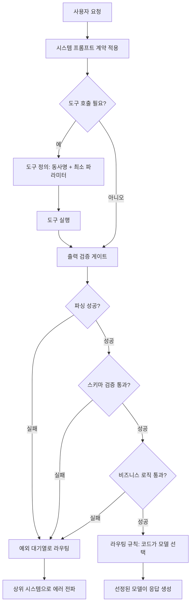

Sonnet에서 Opus로 모델을 올렸는데 처음 며칠만 안정적이고 다시 같은 입력에 다른 출력이 나오는 걸 겪어본 엔지니어를 위한 글입니다. 이 글을 읽고 나면 시스템 프롬프트, 도구 정의, 출력 검증, 라우팅이라는 네 층을 코드로 얼마나 확실하게 고정해야 모델 등급과 무관하게 에이전트가 안정적으로 도는지 감을 잡을 수 있습니다.

모델 등급과 에이전트 신뢰성의 관계는 흔히 기대하는 것처럼 선형이 아닙니다. 더 강한 모델은 더 나은 추론을 내놓지만, 그 추론이 매번 같은 방향으로 향한다는 보장은 주지 않습니다. 방향을 잡아주는 건 모델이 아니라 그 모델을 감싸는 구조, 즉 하네스입니다. 하네스는 에이전트가 어떻게 사고하고 어떤 도구를 쓰며 출력을 어떤 기준으로 검증하는지를 정의하는 층입니다. 같은 모델, 같은 프롬프트를 두고도 팀마다 결과가 다른 이유는 대개 이 층의 유무에서 갈립니다.

하네스가 비어 있을 때 나타나는 증상은 꽤 일관됩니다. 출력 형식이 흔들립니다. 한 번은 JSON으로, 다음번은 자연어로 돌아옵니다. 도구 선택도 매번 달라집니다. 같은 요청인데 어떤 호출에서는 데이터베이스를 쿼리하고 다른 호출에서는 웹검색으로 갑니다. 실패했을 때 회복도 안 됩니다. 모델은 오류가 났다는 사실은 인식해도 그다음에 뭘 해야 하는지는 스스로 정하지 못합니다. 세 증상 모두 모델이 매 순간 처음부터 판단해야 하는 상황에서 나옵니다. 판단은 문맥에 민감하고, 입력의 미세한 차이가 결과를 흔듭니다. 파일 다섯 개를 요약할 때는 멀쩡하던 에이전트가 서른 개를 던지면 일부를 건너뛰거나 요약 깊이를 제멋대로 조절하는 것도 같은 뿌리에서 나옵니다.

모델을 올렸을 때 좋아지는 것처럼 보이는 경우는 대개 두 가지입니다. 하나는 기존 하네스의 빈틈을 강한 모델의 추론력이 잠시 메워준 경우입니다. 이때는 구조 자체가 고쳐진 게 아니라서 시간이 지나면 빈틈이 다시 드러납니다. 다른 하나는 모델 등급과 함께 하네스도 실제로 개선된 경우인데, 이때만 효과가 지속됩니다. 대부분의 팀이 모델만 바꾸고 하네스는 그대로 두는 바람에, 처음 두 주는 잘 되다가 다시 무너지는 패턴을 반복해서 겪습니다. 모델은 엔진이고 방향을 트는 건 하네스입니다. 엔진만 바꾸고 조향 장치를 그대로 두면 속도는 빨라져도 같은 곳에서 같은 방식으로 벗어납니다. 아래 네 절은 그 조향 장치를 이루는 네 층, 시스템 프롬프트, 도구 정의, 출력 검증, 라우팅을 차례로 뜯어봅니다.


*글의 핵심 개념을 형상화했습니다.*

## 시스템 프롬프트는 지시문이 아니라 계약입니다

시스템 프롬프트를 강하게, 자세하게 쓸수록 모델이 더 잘 따를 거라고 기대하는 팀이 많습니다. 그런데 실제로는 프롬프트가 길어질수록 모델이 지시사항 전체를 고르게 반영하지 못하는 역효과가 생깁니다. 일부는 무시하고 다른 일부에는 과잉 반응합니다. 더 나은 접근은 프롬프트를 지시문이 아니라 계약으로 다루는 것입니다. 계약에서는 무엇을 입력받고 무엇을 출력하며 어떤 상황에서 어떻게 대응하는지를 명확히 규정합니다.

계약을 설계할 때 가장 먼저 지켜야 할 원칙은 단일 초점입니다. 프롬프트 하나에는 역할 하나만 부여합니다. "데이터를 분석하고 보고서를 쓰고 필요하면 검색도 하고 결과 검증까지 하는" 식으로 여러 역할을 한 문장에 욱여넣으면 각 역할에 배분되는 모델의 주의력이 그만큼 흩어집니다. 여러 단계가 필요하면 단계마다 별도의 계약으로 쪼개고, 그 계약들을 연결하는 일은 에이전트 구조가 맡습니다. 역할이 하나면 모델은 그 역할에 온전히 집중합니다.

제약 조건을 표현하는 방식도 결과에 영향을 줍니다. 허용할 행동을 나열하는 방식은 예측하지 못한 상황에 취약합니다. 모델이 목록에 없는 방식으로 응답할 때마다 목록을 늘려야 하니 프롬프트는 끝없이 길어집니다. 반대로 금지할 행동을 나열하면 목록은 대개 더 짧고, 모델은 짧은 금지 목록을 더 정확히 지킵니다. 검색 결과를 그대로 옮겨 답하는 에이전트를 막을 때 "분석을 제공하라"는 허용 지시보다 "검색 결과 문장을 그대로 복사해 넣지 마라"는 금지 지시가 더 잘 통하는 이유가 여기 있습니다. 전자는 "분석"의 수준을 모델이 매번 다시 판단해야 하지만, 후자는 경계를 한 번에 그어줍니다.

출력 형식을 전달할 때도 예시 하나에 기대는 대신 규칙을 명시하는 편이 안정적입니다. 예시는 입력과 출력의 쌍 하나만 보여주는데, 새로운 입력이 그 쌍과 조금만 달라져도 모델은 형식을 추측하기 시작하고 그 추측은 자주 틀립니다. "무엇이 있어야 하는가"를 규칙으로 열거하고 "어떻게 보이는가"는 모델에게 맡기지 않는 쪽이 문맥과 무관하게 형식을 지키게 만듭니다. 입력이 복잡해질수록 예시의 효용은 줄고 규칙의 효용은 늘어납니다.

## 도구 이름과 파라미터가 판단을 대신합니다

도구 정의는 모델이 언제 어떤 행동을 취할지 결정하는 토대입니다. 도구 이름을 "reportGenerator"처럼 명사 중심으로 지으면 모델은 리포트를 생성해야 한다는 것만 알 뿐 어떤 입력이 필요한지는 스스로 예측해야 합니다. 이름을 "generate_report"처럼 동사 원형으로 지으면 모델은 도구 설명에서 필요한 입력을 곧바로 찾아봅니다. "user_data_analyzer"와 "process_user_data"처럼 이름이 비슷한 두 도구가 있으면 모델은 그 미묘한 차이를 매 호출마다 다시 해석해야 하고, 그 해석은 호출할 때마다 흔들릴 수 있습니다.

파라미터는 최소한으로 줄이는 게 도구 설계의 또 다른 핵심입니다. 파라미터가 늘어날수록 모델이 정확한 값을 채울 확률은 떨어지고, 값이 불확실할수록 호출 자체를 회피하거나 엉뚱한 기본값을 씁니다.

```
# 나쁜 설계: 모델이 다섯 값을 한꺼번에 정확히 채워야 합니다
search_users(table: string, columns: list[string], filters: dict,
             sort_by: string, limit: int, offset: int)

# 좋은 설계: 필수는 하나, 나머지는 기본값이 처리합니다
search_users(query: string, max_results: int = 10)
```

query 하나만 필수로 두면 모델은 사용자 질문에서 쿼리를 뽑아내는 일에만 집중합니다. 복잡한 필터링이 필요할 때는 고급 쿼리를 query 자체에 담아 전달하면 되므로, 도구 호출의 입도가 자연스럽게 정해집니다.

도구 수를 늘리는 것도 신중해야 합니다. 도구가 많아질수록 모델은 "이 상황에 어떤 도구가 맞는가"를 판단하는 부담을 떠안고, 그만큼 오판 확률도 올라갑니다. 코드 리뷰 에이전트에 웹검색 도구를 노출하지 않는 것도 같은 이유입니다. 코드 자체로 충분히 풀리는 작업인데 검색 도구가 보이면 모델은 불확실할 때마다 검색으로 새고, 그 결과가 리뷰 품질을 흔듭니다. 특정 역할에는 그 역할과 직접 관련된 도구만 노출하는 편이 판단 오류를 줄입니다. 거친 입도의 소수 도구가 정교한 입도의 다수 도구보다 나은 경우가 많습니다.

## 출력 검증 게이트는 코드가 소유합니다

LLM의 환각은 에이전트에서 가장 다루기 까다로운 문제입니다. "검증해봐라"를 시스템 프롬프트에 넣는 방식은 논리적으로 모순됩니다. 모델이 스스로 환각을 감지할 수 있다면 애초에 그 환각을 만들지 않았을 것입니다. 검증은 반드시 모델 밖의 코드가 맡아야 하는 별도의 층입니다.

검증 게이트는 세 단계로 나눠 설계하면 각 단계의 책임이 분명해집니다. 첫 단계는 파싱입니다. 모델의 출력을 구조화된 형태로 바꾸는 과정이고, 형식이 무너지면 그 자리에서 거부합니다. 두 번째 단계는 스키마 검증입니다. 필수 필드가 있는지, 타입이 맞는지, 값의 범위가 유효한지 확인합니다. 세 번째 단계는 비즈니스 로직 검증입니다. 스키마는 통과했어도 도메인 규칙에 어긋나면 거부합니다.

```python
def verify_output(raw_output: str, schema: dict, business_rule):
    try:
        parsed = json.loads(raw_output)          # 1단계: 파싱
    except json.JSONDecodeError as e:
        return reject(reason="PARSE_FAILED", detail=str(e))

    schema_errors = validate_schema(parsed, schema)  # 2단계: 스키마 검증
    if schema_errors:
        return reject(reason="SCHEMA_INVALID", detail=schema_errors)

    if not business_rule(parsed):                # 3단계: 비즈니스 로직 검증
        return reject(reason="BUSINESS_RULE_VIOLATED")

    return accept(parsed)
```

검증에 실패한 출력을 어떻게 처리할지도 설계가 필요합니다. 같은 입력으로 모델을 재시도하는 방식은 같은 판단을 다른 시도로 반복하는 것에 지나지 않아 같은 이유로 다시 실패할 가능성이 높습니다. 더 효과적인 방법은 재시도 대신 라우팅입니다. 실패한 출력을 예외 대기열로 보내고, 그 대기열에서는 모델이 아니라 다른 에이전트나 사람이 원인을 확인합니다. 네트워크 타임아웃처럼 일시적인 원인이면 재시도가 맞지만, 스키마 검증 실패처럼 판단 자체가 잘못된 경우라면 같은 판단을 반복해도 같은 결과만 나오므로 재시도가 아니라 라우팅이 맞습니다.

가장 나쁜 실패 처리는 실패를 숨기고 정상 출력을 흉내 내는 것입니다. 검증 게이트에서 걸린 오류는 상위 시스템으로 그대로 전파해야 합니다. 에이전트는 실패를 은폐하거나 완화하려 들지 않고 감지 즉시 위로 넘깁니다. 이 원칙이 지켜질 때 시스템의 신뢰는 모델의 자기평가가 아니라 검증을 통과한 출력 자체에 근거하게 됩니다.

## 라우팅과 모델 조합은 코드가 결정합니다

"결제 관련 질문이면 결제 에이전트로, 아니면 일반 대화로"처럼 분기 판단을 시스템 프롬프트에 넣어두는 팀이 있습니다. 그런데 모델의 판단은 확률적이라서 같은 입력이라도 호출마다 다르게 갈릴 수 있습니다. 기준이 아무리 명확해도 모델이 그 기준을 매번 따른다는 보장은 없습니다. 라우팅 판단은 프롬프트가 아니라 코드가 맡아야 정확도가 흔들리지 않습니다.

```python
def route_request(user_input: str) -> str:
    if is_payment_related(user_input):
        return "payment_agent"
    if is_technical_support(user_input):
        return "support_agent"
    return "general_agent"
```

코드가 라우팅을 맡으면 세 가지가 달라집니다. 분기 결과는 항상 정확하게 재현됩니다. 단위 테스트로 모든 경로를 검증할 수 있습니다. 기준이 바뀌어도 모델을 다시 학습시킬 필요 없이 코드만 고치면 바로 반영됩니다.

복수 모델을 조합하는 프로덕션 패턴도 같은 원리를 따릅니다. 단순 검색은 가벼운 모델로, 복잡한 분석은 더 강한 모델로 넘기는 게 효율적인데, 이 선택을 모델 자신에게 맡기면 결과를 예측할 수 없습니다. 하네스가 입력의 복잡도와 위험도를 보고 어떤 모델로 보낼지 정하는 게 정확한 방향입니다. 고객 지원 에이전트에서 첫 응답은 가벼운 모델로 생성하고, 사용자가 추가 질문을 하면 그 복잡도에 따라 더 강한 모델로 에스컬레이션하는 구조가 대표적입니다. 여기서 "에스컬레이션이 필요한가"라는 판단은 항상 코드가 내리고, 모델은 응답을 생성하는 일에만 집중합니다.

에이전트 품질은 한 번 설계하고 끝낼 수 있는 문제가 아니라 정확성, 일관성, 적시성, 적절성, 복구력이라는 다섯 축으로 계속 측정해야 하는 대상입니다. 정확성은 검증 게이트가, 일관성은 시스템 프롬프트의 안정성이, 적시성은 실행 전략이, 적절성은 라우팅 규칙이, 복구력은 에러 처리 구조가 각각 담당합니다. 프로덕션에서 실패 케이스를 모으고 그 케이스가 어느 축의 어느 구성 요소와 연결되는지 추적해서 고치는 사이클을 반복하는 것이 하네스를 실제로 개선하는 유일한 경로입니다.

아래는 지금까지 다룬 네 층이 하나의 요청을 처리할 때 어떤 순서로 맞물리는지를 정리한 흐름입니다.



## ThakiCloud 관점에서

저희는 고객사 온프렘 환경에 K8s 기반 AI 플랫폼을 직접 서빙합니다. 그 자리에서 보면 하네스 설계는 애플리케이션 팀만의 문제로 남지 않습니다. 팀마다 도구 이름을 짓는 방식과 검증 게이트의 엄격도가 제각각이면, 같은 클러스터 위에서도 어떤 에이전트는 잘못된 출력을 그대로 흘려보내고 어떤 에이전트는 사소한 검증 실패에도 멈춰 섭니다. 그래서 저희는 출력 검증 게이트의 3단계 구조와 실패를 상위로 전파하는 원칙만큼은 플랫폼 차원의 공통 계약으로 강제하는 편이 안전하다고 봅니다. 애플리케이션마다 검증 로직을 새로 짜게 두면 어느 팀은 파싱만 하고 넘어가고 어느 팀은 비즈니스 로직까지 다 확인하는 편차가 생기고, 그 편차는 결국 플랫폼을 운영하는 저희 쪽으로 장애 문의로 돌아옵니다.

복수 모델을 조합하는 라우팅 패턴도 온프렘에서는 자원 배치 문제와 바로 맞닿습니다. 어떤 요청을 가벼운 모델로 처리하고 어떤 요청을 무거운 모델로 넘길지를 코드가 결정하게 만들어두면, 그 결정 로직이 곧 GPU 자원을 어떻게 나눠 쓸지에 대한 신호가 됩니다. 반대로 이 판단을 모델 자신에게 맡긴 시스템은 부하 예측이 불가능해서 클러스터 운영자 입장에서 가장 다루기 까다로운 형태로 남습니다.

## 정리

에이전트가 모델을 올려도 흔들리는 이유는 대부분 하네스가 그 자리에 없기 때문입니다. 시스템 프롬프트를 지시문이 아니라 단일 초점의 계약으로 설계하고, 도구 이름과 파라미터로 모델의 판단 범위를 좁히고, 출력 검증을 모델 밖의 코드가 3단계로 소유하고, 라우팅과 모델 선택을 프롬프트가 아니라 코드에 두는 것. 이 네 층이 자리 잡으면 모델을 바꿔도 에이전트의 행동은 예측 가능한 범위 안에 남습니다.

이 글의 내용은 저희가 정리한 전자책 『AI 에이전트 핸스 설계』의 일부를 블로그용으로 다시 쓴 것입니다.

## 관련 슬라이드

본문 내용을 NotebookLM(`doodle_collage` 스타일)으로 요약한 슬라이드입니다.


