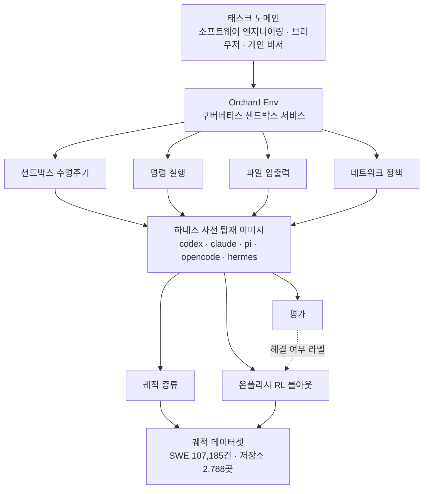

에이전트를 학습시키겠다고 마음먹은 팀이 가장 먼저 부딪히는 벽은 모델이 아닙니다. 에이전트가 실제로 명령을 실행하고 파일을 고치고 실패할 수 있는 격리된 환경을 몇 백 개씩 동시에 띄우는 일입니다. 마이크로소프트가 2026년 8월 3일에 공개한 [Orchard](https://github.com/microsoft/Orchard)는 바로 그 환경 계층만 떼어내 MIT 라이선스로 내놓은 프레임워크입니다.

## 왜 읽어야 하나

이 글은 사내에서 에이전트를 직접 학습시키거나 평가 파이프라인을 세우려는 플랫폼 엔지니어와 ML 엔지니어를 위해 썼습니다. 핵심 결론을 먼저 말씀드리겠습니다. 에이전트 학습의 병목은 이제 알고리즘이 아니라 환경 인프라이며, Orchard는 그 인프라를 쿠버네티스 위의 범용 샌드박스 서비스 하나로 정규화해서 증류와 강화학습과 평가가 같은 실행 기반을 공유하게 만들었습니다. 쿠버네티스 클러스터를 이미 운영하고 있다면 이 설계는 새로 배울 개념이 아니라 이미 가진 자산을 재사용하는 방법에 가깝습니다.

한 가지 미리 밝혀 두겠습니다. 이 글에 나오는 성능 수치는 전부 마이크로소프트가 논문과 공개 블로그에서 보고한 값이며, 저희가 사내에서 재현한 값이 아닙니다. 재현에는 GPU가 붙은 쿠버네티스 클러스터와 수천 개 저장소를 도는 롤아웃 예산이 필요해서 이번 글의 범위를 넘어갑니다. 어느 수치가 누구의 것인지는 본문에서 매번 구분해 적었습니다.

## 개요

지난 2년 동안 에이전트 연구에서 공개된 것은 대부분 모델과 벤치마크 점수였습니다. 정작 그 점수를 만들어 낸 인프라는 공개되지 않았습니다. 각 팀이 자체 샌드박스를 만들고, 학습 파이프라인을 사내에 가두고, 궤적 데이터셋을 비공개로 쌓았습니다. 그래서 논문의 숫자를 다른 팀이 확인하려면 인프라부터 처음부터 다시 만들어야 했습니다. 마이크로소프트 리서치가 Orchard를 내놓으면서 문제로 지목한 지점이 정확히 이것입니다.


Orchard의 접근은 조금 특이합니다. 더 좋은 학습 알고리즘을 제안하는 대신, 학습과 평가가 공통으로 필요로 하는 것이 무엇인지 되물었습니다. 답은 격리된 실행 환경이었습니다. 궤적을 모으는 단계에서도, 강화학습 롤아웃을 도는 단계에서도, 최종 평가에서도 필요한 것은 결국 명령을 안전하게 실행하고 그 결과를 관찰할 수 있는 일회용 상자입니다. 이 공통분모를 서비스로 만들어 세 단계가 나눠 쓰게 한 것이 Orchard Env입니다.

관련 산출물은 세 갈래로 나왔습니다. 코드는 [microsoft/Orchard](https://github.com/microsoft/Orchard) 저장소에, 논문은 [arXiv 2605.15040](https://arxiv.org/abs/2605.15040)에, 학습 궤적 데이터셋은 [허깅페이스 microsoft/Orchard](https://huggingface.co/datasets/microsoft/Orchard)에 올라와 있습니다. 마이크로소프트 리서치의 [공식 소개 글](https://www.microsoft.com/en-us/research/blog/orchard-an-open-framework-for-scalable-agentic-ai/)이 전체 그림을 요약합니다.

## 이 기술은 무엇인가

Orchard의 중심에는 Orchard Env가 있습니다. 쿠버네티스 네이티브 샌드박스 서비스이고, 노출하는 기능은 의도적으로 얇습니다. 샌드박스 수명주기 관리, 명령 실행, 파일 입출력, 네트워크 정책 네 가지입니다. 여기서 중요한 것은 없는 기능 쪽입니다. 특정 에이전트 하네스에 묶이지 않고, 특정 추론 백엔드에 묶이지 않고, 특정 태스크 도메인에도 묶이지 않습니다.


이 결합 분리가 만드는 효과가 실무적으로 큽니다. 샌드박스 이미지에는 codex와 claude, pi, opencode, hermes 같은 주요 에이전트 하네스가 이미 PATH에 올라간 상태로 들어 있습니다. 그래서 어떤 하네스를 대상으로 학습하거나 평가할지 바꾸는 일이 이미지를 다시 굽는 작업이 아니라 실행할 명령을 바꾸는 작업이 됩니다. 하네스를 갈아 끼우는 비용이 낮아지면 비교 실험이 쉬워지고, 비교가 쉬워지면 어떤 하네스가 어떤 과제에 강한지 데이터로 말할 수 있게 됩니다.



그 위에 도메인별 학습 레시피 세 가지가 함께 공개됐습니다. 소프트웨어 엔지니어링을 다루는 Orchard-SWE, 브라우저 내비게이션을 다루는 Orchard-GUI, 개인 비서 과제를 다루는 Orchard-Claw입니다. 브라우저 쪽 레시피는 실제 라이브 브라우저를 띄우는 환경을 내결함성 있게 감쌌습니다. 내비게이션 재시도, 타임아웃 처리, 그리고 실패를 원인별로 구조화해 기록하는 장치가 들어 있습니다. 라이브 브라우저로 롤아웃을 돌려 본 분이라면 이 세 가지가 왜 필요한지 바로 아실 겁니다. 브라우저 환경에서는 에이전트가 틀려서 실패한 것과 페이지가 안 떠서 실패한 것을 구분하지 못하면 학습 신호 자체가 오염됩니다.

데이터셋도 같이 나왔습니다. SWE 계열 궤적이 107,185건이고, GitHub 저장소 2,788곳에서 수집했습니다. 각 궤적에는 에이전트가 최종적으로 만든 패치가 해당 이슈의 숨겨진 테스트 스위트를 통과했는지가 라벨로 붙어 있습니다. 이 라벨 방식이 핵심입니다. 사람이 매긴 선호도 점수가 아니라 테스트 실행 결과라서, 보상 신호가 결정론적이고 재현 가능합니다.


## 설치 및 통합

저장소는 MIT 라이선스이므로 사내 도입에 라이선스 걸림돌은 없습니다. 시작 지점은 코드를 받아 Orchard Env를 클러스터에 올리는 것입니다.

```bash
git clone https://github.com/microsoft/Orchard.git
cd Orchard
```

전제 조건은 두 가지로 정리됩니다. 하나는 쓸 수 있는 쿠버네티스 클러스터이고, 다른 하나는 롤아웃 대상 모델을 서빙할 추론 엔드포인트입니다. Orchard Env가 추론 백엔드에 묶이지 않는다는 설계 덕분에 두 번째 항목은 팀이 이미 쓰는 서빙 스택을 그대로 붙이면 됩니다. 저희 기준으로는 vLLM 엔드포인트가 여기에 해당합니다.

여기서 정직하게 적어 두겠습니다. 이번 글에서는 실제 학습 잡을 제출해 수치를 재현하지 못했습니다. 재현 시도를 접은 이유는 명확합니다. 의미 있는 롤아웃을 돌리려면 GPU가 붙은 클러스터에서 수천 개 저장소를 도는 실행 예산이 필요한데, 이는 릴리스 하루 만에 쓰는 소개 글의 범위를 넘어섭니다. 따라서 아래 수치는 전부 마이크로소프트가 보고한 값이고, 사내 재현은 별도 실험으로 분리해 다루겠습니다.

## 실제 실험 결과

다시 강조하면 아래 표의 수치는 마이크로소프트 논문이 보고한 값입니다. 저희가 측정한 값이 아닙니다.

| 학습 단계 | 과제 해결률 |
|---|---|
| 기본 모델 | 22.0% |
| 지도 미세조정만 적용 | 64.3% |
| 지도 미세조정 후 강화학습 추가 | 67.5% |

기본 모델 대비 총 45.5퍼센트포인트 상승이고, 논문은 이 결과가 비슷한 규모의 오픈소스 모델 가운데 최고 수준이라고 주장합니다.


숫자를 읽는 방식이 중요합니다. 눈에 띄는 것은 67.5라는 최종 값이 아니라 상승분의 배분입니다. 22.0에서 64.3으로 가는 구간, 즉 지도 미세조정만으로 얻은 상승이 42.3퍼센트포인트입니다. 그 위에 강화학습을 얹어 얻은 추가 상승은 3.2퍼센트포인트입니다. 전체 개선의 대부분이 좋은 궤적 데이터로 흉내 내는 단계에서 나왔다는 뜻입니다.

이 배분은 투자 우선순위를 바꿉니다. 강화학습 파이프라인은 구축과 운영이 모두 비쌉니다. 반면 궤적 수집은 상대적으로 단순하고, 그 단계에서 이미 개선의 열 중 아홉을 가져갑니다. 에이전트 학습을 처음 시작하는 팀이라면 강화학습부터 손대는 대신 검증 가능한 라벨이 붙은 궤적을 모으는 일에 먼저 집중하는 편이 합리적입니다. 강화학습은 그다음에 얹어도 늦지 않습니다. 물론 3.2퍼센트포인트가 작다는 뜻은 아닙니다. 경쟁이 소수점에서 갈리는 구간에서는 그 차이가 순위를 바꿉니다.

## ThakiCloud 제품 적용 시사점

Orchard가 던지는 설계 메시지는 저희가 운영하는 두 제품 모두에 걸칩니다.


ai-platform 쪽부터 보겠습니다. ThakiCloud의 ai-platform은 쿠버네티스 위에서 Kueue로 GPU 워크로드를 스케줄링하고 vLLM으로 모델을 서빙하는 멀티테넌트 AI 인프라입니다. Orchard Env가 요구하는 것은 정확히 이 조합입니다. 즉 별도의 특수 인프라를 새로 도입하는 것이 아니라, 이미 운영 중인 클러스터에 샌드박스 서비스 계층을 하나 더 올리는 문제로 환원됩니다. 에이전트 롤아웃은 짧게 뜨고 사라지는 잡이 대량으로 발생하는 워크로드라서 큐 기반 스케줄링과 궁합이 좋습니다. 온프레미스와 소버린 환경을 요구하는 고객에게는 더 직접적인 의미가 있습니다. 학습 궤적에는 코드와 내부 문서가 그대로 남기 때문에, 에이전트 학습이야말로 외부 클라우드로 내보내기 가장 곤란한 워크로드입니다. 자체 클러스터에서 도는 오픈소스 학습 인프라는 그래서 선택지가 아니라 요건에 가깝습니다.

Paxis 쪽은 결이 조금 다릅니다. Paxis는 ai-platform 위에서 도는 Agent-Native Cloud 제어 평면으로, 스킬과 도구와 정책과 감사 로그를 일급 리소스로 다룹니다. Orchard와 겹치는 지점은 샌드박스 격리 실행입니다. Paxis는 이미 스킬을 격리된 샌드박스에서 실행하고 모든 행동을 정책 게이트와 감사 로그로 통과시키는데, Orchard Env가 정의한 네 가지 원시 기능은 이 실행 계층이 갖춰야 할 최소 집합과 사실상 같습니다. 특히 네트워크 정책을 샌드박스 원시 기능으로 격상시킨 선택이 눈에 띕니다. 에이전트가 밖으로 무엇을 호출할 수 있는지를 환경 수준에서 통제하는 방식은 정책 게이트를 붙이기에 좋은 자리입니다.

한 걸음 더 나가면 두 제품이 이어집니다. Paxis가 스킬을 실행하면서 남기는 감사 로그는 그 자체로 에이전트 궤적입니다. 여기에 성공과 실패를 판정하는 결정론적 게이트가 붙으면 Orchard가 요구하는 라벨된 궤적의 형태를 갖추게 됩니다. 운영에서 나온 로그가 학습 데이터로 순환하는 구조이고, 그 순환이 도는 곳이 ai-platform 클러스터라는 그림입니다.


 마이크로소프트가 하네스를 이미지에 미리 넣어 교체 비용을 낮춘 것처럼, 스킬 하네스를 표준화해 두면 같은 종류의 이득이 생깁니다.

## 한계 및 반론

기대를 정확히 조정할 필요가 있습니다.


먼저 진입 비용입니다. Orchard는 쿠버네티스를 전제합니다. 클러스터를 운영하지 않는 팀에게는 프레임워크 학습 비용보다 클러스터 도입 비용이 훨씬 큽니다. 노트북 한 대로 시작할 수 있는 도구가 아닙니다.

다음은 데이터셋의 편향입니다. 궤적 107,185건은 많아 보이지만 전부 공개 GitHub 저장소에서 나왔습니다. 사내 코드베이스는 공개 저장소와 관행이 다릅니다. 빌드 체계도 다르고 의존성 구조도 다르며 이슈를 적는 방식도 다릅니다. 공개 저장소 궤적으로 학습한 모델이 사내 저장소에서 같은 해결률을 낸다는 보장은 없습니다.

라벨 방식에도 한계가 있습니다. 숨겨진 테스트 통과 여부는 결정론적이라는 강점이 있는 반면, 테스트가 잡아내는 범위 안에서만 정답을 정의합니다. 테스트를 통과하지만 설계가 나쁜 패치와 테스트를 통과하면서 설계도 좋은 패치를 이 라벨은 구분하지 못합니다. 테스트 커버리지가 낮은 저장소에서는 이 문제가 더 커집니다.

마지막으로 공개 시점입니다. 이 글을 쓰는 시점 기준으로 공개된 지 하루 지났습니다. 커뮤니티 검증과 독립적인 재현 보고가 아직 쌓이지 않았습니다. 저희가 사내 수치를 싣지 못한 것과 같은 이유로, 지금 나와 있는 숫자는 전부 발표 주체가 보고한 값이라는 점을 감안해서 읽으셔야 합니다.

## 정리

Orchard가 실제로 공개한 것은 더 똑똑한 에이전트가 아니라 에이전트를 만드는 공장의 설계도입니다. 증류와 강화학습과 평가가 각자 환경을 만들던 관행을 하나의 쿠버네티스 샌드박스 서비스로 합쳤고, 하네스를 이미지에 미리 넣어 비교 실험 비용을 낮췄으며, 테스트 통과 여부로 라벨링한 궤적 10만 건을 함께 열었습니다. 서두에 말씀드린 결론이 여기서 회수됩니다. 에이전트 학습의 병목은 알고리즘이 아니라 환경이었고, 그 환경이 이제 표준화된 오픈소스 형태로 존재합니다.

읽고 나서 하실 일을 한 가지만 고르라면, 강화학습 파이프라인 설계가 아니라 궤적 수집 설계입니다. 개선의 대부분이 거기서 나왔다는 것이 이번 공개가 보여 준 가장 실용적인 숫자입니다. 이미 쿠버네티스 클러스터를 운영하고 있다면 진입 비용은 생각보다 낮고, 사내 워크플로에서 성공과 실패가 자동으로 판정되는 지점을 찾는 일이 사실상 첫 번째 작업이 됩니다.

## 출처

- [microsoft/Orchard GitHub 저장소](https://github.com/microsoft/Orchard)
- [Orchard: An open framework for scalable agentic AI, Microsoft Research](https://www.microsoft.com/en-us/research/blog/orchard-an-open-framework-for-scalable-agentic-ai/)
- [Orchard: An Open-Source Agentic Modeling Framework, arXiv 2605.15040](https://arxiv.org/abs/2605.15040)
- [microsoft/Orchard 궤적 데이터셋, 허깅페이스](https://huggingface.co/datasets/microsoft/Orchard)
