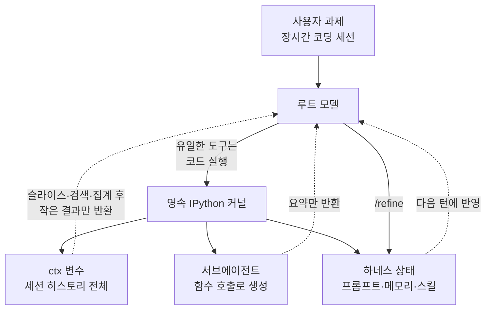

## 왜 읽어야 하나

장시간 도는 코딩 에이전트를 직접 만들거나 운영하면서 컨텍스트 압축과 토큰 비용에 계속 부딪히는 엔지니어를 위한 글입니다. 결론부터 말씀드리면, Prime Agent가 제안한 "컨텍스트를 프롬프트가 아니라 영속 커널의 변수로 두기"는 실제로 작동하고 직접 재현했을 때 같은 세션 히스토리에서 모델이 실제로 소비하는 토큰이 321,458개에서 149개까지 내려갔습니다. 다만 이 절감폭은 질문의 성격에 전적으로 종속되며, 모델이 원문을 눈으로 읽어야 하는 순간 이득은 20분의 1로 줄어듭니다. 이 두 문장 사이의 간격이 이 글의 내용 전부입니다.


*하나의 영속 커널이 세션 전체를 품고, 모델은 가느다란 질의로 필요한 조각만 꺼냅니다.*

## 개요

Prime Intellect가 2026년 8월 초 [Prime Agent](https://www.primeintellect.ai/blog/prime-agent)를 공개했습니다. 자기개선형 RLM 에이전트라는 설명이 붙어 있고, 코딩 워크플로뿐 아니라 장시간 도는 자율 과제를 겨냥합니다. 라이선스는 MIT이고 코드는 [GitHub](https://github.com/PrimeIntellect-ai/prime-agent)에 있습니다.

발표에서 가장 눈에 띄는 숫자는 ARC-AGI-3입니다. Opus 5와 조합했을 때 95.5%를 기록했고, 함께 제시된 인간 전문가 기준선은 95.4%였습니다. EmulatorBench에서는 명세만 주고 Rust로 에뮬레이터를 작성하게 해서 세가 제네시스와 게임보이 컬러를 재현했다고 밝혔습니다.

다만 벤치마크 숫자는 이 글의 관심사가 아닙니다. 단일 벤치마크의 0.1%p 차이는 독립 재현 없이는 해석하기 어렵고, 저희가 직접 확인할 수도 없는 값입니다. 흥미로운 쪽은 그 숫자를 만든 구조입니다. Prime Agent는 도구 목록을 늘리는 대신 도구를 하나로 줄였습니다. 모델이 쓸 수 있는 유일한 도구가 영속 IPython 커널입니다. 나머지는 전부 그 커널 안에서 코드로 표현됩니다.

## 이 기술은 무엇인가

Prime Agent는 두 개의 추상 위에 서 있습니다. 하나는 RLM이라 부르는 재귀 언어 모델 런타임이고, 다른 하나는 Continual Harness입니다.

RLM 쪽의 발상은 단순합니다. 기존 에이전트는 파일 내용이든 테스트 출력이든 툴 결과를 전부 모델의 컨텍스트 창에 밀어 넣습니다. 창이 차면 요약해서 압축하고, 압축하면서 정보를 잃습니다. RLM은 이 순서를 뒤집습니다. 전체 입력을 파이썬 REPL 안에 하나의 문자열 변수로 적재하고, 루트 모델은 그 문자열을 직접 보지 않습니다. 대신 변수를 어떻게 슬라이스하고, 헬퍼 함수를 어떻게 쓰고, 하위 LLM 호출을 어떻게 띄우고, 결과를 어떻게 합칠지 설명하는 시스템 프롬프트를 받습니다. 프롬프트가 데이터가 아니라 변수 이름이 되는 셈입니다.

서브에이전트도 같은 논리로 접힙니다. 별도의 오케스트레이션 계층이나 전용 툴 스키마가 아니라, 커널 안에서 호출되는 함수입니다. 결과 역시 변수로 남기 때문에 하위 에이전트가 만들어낸 방대한 중간 산출물이 상위 모델의 창을 잠식하지 않습니다.

Continual Harness는 두 번째 축입니다. 보조 프롬프트, 메모리, 스킬 설명, 재사용 가능한 서브에이전트 명세를 지속되는 상태로 저장하고, 에이전트가 근거를 동반한 작은 업데이트로 이 상태를 다듬습니다. `/refine` 명령이 그 입구입니다. 무엇이 잘 되고 무엇이 안 되는지를 과제 도중에 판단해서 자기 프롬프트와 스킬을 고칩니다. 기본값은 세션 로컬입니다. 이 기본값은 뒤에서 다시 이야기하겠습니다.

기존 방식과의 차이를 한 장으로 정리하면 이렇습니다.



고정된 툴 콜 스키마와 컨텍스트 압축을 쓰는 구조에서는 모델이 자기 발판을 우회하는 데 힘을 씁니다. 설계 시점에 손으로 짜 넣은 서브에이전트와 스킬은 실행 중에 배운 것을 반영하지 못합니다. Prime Agent는 두 지점을 같은 방법으로 건드립니다. 발판을 코드로 만들고, 코드니까 실행 중에 고칠 수 있게 합니다.

## 설치 및 통합

솔직하게 적겠습니다. 이번 작업 환경에서는 패키지 설치가 정책상 차단되어 `prime-agent` 자체를 설치해 돌리지 못했습니다. 재현 시도 중 실패한 지점이 여기입니다. 따라서 이 글에는 Prime Agent를 실제로 구동해서 얻은 수치가 없습니다. 저장소의 문서가 설치와 인증, 첫 세션 실행, 세션과 자율 실행 한도, 출력 모드를 다루고 있으니 구동 자체는 [저장소 문서](https://github.com/PrimeIntellect-ai/prime-agent)를 따르시면 됩니다. RLM 프로그래밍 모델 자체에 대한 설명은 [별도 문서](https://github.com/PrimeIntellect-ai/prime-agent/blob/main/packages/coding-agent/docs/rlm.md)에 정리되어 있습니다.

대신 검증 가능한 쪽으로 방향을 틀었습니다. Prime Agent의 성능이 아니라 그 성능의 근거로 제시된 메커니즘, 즉 "컨텍스트를 영속 커널의 변수로 두면 모델이 소비하는 토큰이 줄어든다"는 주장만 떼어내 로컬에서 재현했습니다. 여기에는 API 키도 네트워크도 필요하지 않습니다. 필요한 것은 진짜 IPython 커널과 토크나이저뿐입니다.

```python
import tiktoken
from jupyter_client.manager import start_new_kernel

ENC = tiktoken.get_encoding("o200k_base")
km, kc = start_new_kernel(kernel_name="python3")

# 세션 히스토리는 커널 안에서 만들어져 ctx 변수로 남습니다.
# 이 문자열은 모델 컨텍스트를 한 번도 통과하지 않습니다.
run(BUILDER_SRC)

# 모델이 실제로 발화하는 것은 아래 코드뿐입니다.
run("errs = [l for l in ctx.split('\\n') if l.startswith('ERROR:')]\nprint(len(errs))")
```

측정 방식은 이렇습니다. 400턴짜리 합성 에이전트 세션 로그를 만듭니다. `go test` 출력, 파일 앞부분 40줄 덤프, 간헐적인 스택 트레이스와 테스트 실패처럼 실제 롱세션에 쌓이는 종류의 툴 출력입니다. 그다음 두 값을 비교합니다. 컨텍스트 스터핑 방식에서는 이 히스토리 전체를 프롬프트에 넣었을 때의 토큰 수를 세고, RLM 방식에서는 시스템 프롬프트와 모델이 작성한 코드 셀, 그리고 커널이 돌려준 결과만의 토큰 수를 셉니다. 토크나이저는 양쪽 모두 `o200k_base`입니다.

전체 스크립트와 실행 로그는 `outputs/blog-impl/prime-agent-rlm-harness/`에 그대로 남겨두었습니다.

## 실제 실험 결과

히스토리는 1,115,465자, 17,284줄이었습니다. 이것을 통째로 프롬프트에 넣으면 321,458 토큰입니다.

첫 실행에서는 집계형 질문 세 개를 던졌습니다. 에러가 몇 건인지, 실패한 테스트 이름의 고유 접두사가 무엇인지, 파일별 에러 분포가 어떻게 되는지입니다. 커널은 42건의 에러, `TestRouterTimeout`과 `TestTenantIsolation` 두 접두사, 그리고 파일별로 11, 11, 10, 10건이라는 분포를 정확히 돌려줬습니다. 이때 모델 컨텍스트에 들어간 토큰은 264개였습니다. 321,458 대비 1,217배 절감이고 감소율로는 99.92%입니다. 커널 벽시계 시간은 0.07초였고, 첫 셀에서 만든 `errs` 변수가 세 번째 셀에서도 살아 있는 것을 확인해 상태 지속도 검증했습니다.

여기까지만 보면 지나치게 좋은 숫자입니다. 그래서 두 번째 실행에서는 이득이 사라지는 지점을 찾아봤습니다. 같은 커널과 같은 토크나이저로 질문의 성격만 바꿨습니다.


*같은 히스토리라도 모델이 원문을 읽어야 할수록 절감폭이 급격히 줄어듭니다.*

집계만 필요한 S1은 149 토큰으로 2,157배 절감이었습니다. 집계에 더해 에러 주변 원문을 열두 줄씩 세 군데 읽어온 S2는 717 토큰으로 448배가 됐습니다. 파일 네 개의 원문 40줄 블록을 통째로 읽어야 하는 S3에서는 3,234 토큰까지 올라가 99배로 내려앉았습니다.

이 기울기가 실험의 진짜 결과입니다. S1에서 S3로 가면서 이득이 스무 배 넘게 깎였습니다. 컨텍스트를 변수로 두는 설계가 마법처럼 토큰을 없애는 것이 아니라, 모델이 원문을 직접 볼 필요가 없는 만큼만 절약해 준다는 뜻입니다. 다만 가장 불리한 조건에서도 여전히 99배였다는 점은 짚어둘 만합니다. 백만 자짜리 히스토리를 다루는 상황에서 두 자릿수 배율의 차이는 세션을 이어갈 수 있느냐 없느냐를 가릅니다.

## ThakiCloud 제품 적용 시사점

이 구조는 저희가 Paxis에서 이미 다루고 있는 문제와 정확히 겹칩니다.

Paxis는 ThakiCloud의 Enterprise Agent Platform으로, 스킬을 검색해 격리된 샌드박스에서 실행하고 모든 행동을 정책 게이트와 감사 로그로 통과시킵니다. 여기서 실무적으로 가장 아픈 지점이 스킬 실행 결과의 부피입니다. 스킬 하나가 수만 줄짜리 로그나 대용량 조회 결과를 돌려주는 일이 드물지 않은데, 그걸 그대로 오케스트레이터 컨텍스트에 실으면 몇 스텝 못 가서 창이 찹니다. RLM의 처방은 그 결과를 컨텍스트가 아니라 샌드박스 안의 변수로 남기고, 오케스트레이터에게는 질의할 권한만 주라는 것입니다. 저희 실측 기준으로 집계형 질의라면 세 자릿수 배율, 원문 정독이 필요해도 두 자릿수 배율의 차이가 납니다. 워크플로 한 건이 몇 스텝까지 갈 수 있는지를 좌우하는 크기입니다.

Continual Harness는 Paxis의 자가진화 스킬과 같은 문제의식에 서 있습니다. 설계 시점에 고정된 스킬 설명과 프롬프트는 현장에서 배운 것을 흡수하지 못합니다. 다만 Prime Agent가 이 상태를 기본적으로 세션 로컬에 두고 근거를 동반한 작은 업데이트만 허용한다는 점은 그대로 배울 부분입니다. 자기수정 범위를 좁게 잡는 것이 안전장치입니다.

Metis 관점에서는 단가 이야기가 됩니다. Metis는 추론 서빙과 토큰 팩토리 계층이고, Dedicated Endpoint와 Serverless로 워크로드를 받습니다. 에이전트 업무 한 건의 비용은 결국 그 업무가 태운 토큰의 합인데, 컨텍스트 설계가 그 합의 대부분을 결정합니다. 321,458 토큰과 264 토큰의 차이는 모델을 바꿔서 얻는 절감폭보다 훨씬 큽니다. 모델 라우팅으로 단가를 깎기 전에 컨텍스트 구조부터 보는 편이 순서상 맞습니다.

Signum은 경고 쪽입니다. 유일한 도구가 임의 코드 실행이라는 설계는 표현력을 얻는 대신 실행 표면 전체를 감사 대상으로 만듭니다. 자기 프롬프트와 스킬을 고치는 하네스라면 더욱 그렇습니다. 무엇이 언제 어떤 근거로 바뀌었는지가 감사 이벤트로 남지 않으면, 며칠 뒤 에이전트의 행동 변화를 설명할 방법이 없습니다. 실행 격리와 감사 로그는 이 구조에서 선택 사항이 아니라 전제 조건입니다.

## 한계 및 반론

먼저 저희 실험의 한계입니다. 히스토리가 합성 로그라 반복이 많고 압축이 잘 되는 데이터입니다. 실제 코드베이스와 실제 스택 트레이스는 이보다 다양하므로 절대 배율을 그대로 옮기시면 안 됩니다. 자릿수만 보시는 것이 맞습니다. 또한 저희는 성공한 셀만 셌습니다. 실제 세션에서는 모델이 잘못된 슬라이스 코드를 써서 실패하고, 그 트레이스백이 다시 컨텍스트에 쌓입니다. 셀 수도 세 개가 아니라 수십 개입니다. 두 요인 모두 실측 배율을 끌어내립니다.

구조 자체의 반론도 있습니다. 이 설계는 모델의 성능을 코드 생성 능력에 묶어버립니다. 모델이 정규식을 잘못 쓰거나 슬라이스 범위를 잘못 잡으면 조용히 틀린 답이 나옵니다. 컨텍스트에 원문이 있었다면 사람이 검토할 수 있었을 오류가, 변수 뒤로 숨으면 드러나지 않습니다. 관측성을 별도로 설계하지 않으면 디버깅이 어려워집니다.

벤치마크 해석도 조심스럽습니다. ARC-AGI-3의 95.5%와 인간 전문가 기준선 95.4%는 0.1%p 차이이고, 단일 벤치마크의 단일 보고입니다. 독립 재현이 나오기 전까지 "인간 전문가를 넘어섰다"는 문장은 유보하는 편이 안전합니다. EmulatorBench 결과 역시 인상적이지만 과제 특성이 특수합니다.

마지막으로 운영상의 문제가 남습니다. 구독 로그인으로 돌릴 수 있다는 점은 편리하지만, 자율 에이전트가 구독 계정으로 장시간 도는 것이 각 제공자의 이용약관에 부합하는지는 별도로 확인하셔야 합니다. 그리고 상태를 가진 커널이 임의 코드를 실행한다는 것은, 그 커널이 반드시 격리된 샌드박스 안에 있어야 한다는 뜻입니다. 로컬 개발 머신에서 자율 모드로 돌리는 것과 프로덕션 워크로드로 돌리는 것은 완전히 다른 위험 등급입니다.

## 정리

Prime Agent에서 가져갈 것은 벤치마크 숫자가 아니라 문제를 옮겨 놓는 방식입니다. 컨텍스트 관리가 압축과 요약의 문제일 때는 정보를 잃는 것 말고 선택지가 없었습니다. 컨텍스트를 영속 커널의 변수로 옮기면 같은 문제가 조회의 문제로 바뀌고, 조회는 잃지 않습니다.

직접 재현해 본 결론은 이렇습니다. 이 패턴은 실제로 작동하며, 이득의 크기는 도구가 아니라 질문이 결정합니다. 집계와 검색이 많은 워크로드일수록 세 자릿수 배율까지 벌고, 모델이 원문을 정독해야 하는 워크로드에서는 두 자릿수로 내려앉습니다. 그래서 도입을 검토하신다면 먼저 하실 일은 프레임워크를 고르는 게 아니라, 여러분의 에이전트가 컨텍스트에 대해 실제로 어떤 질문을 하는지 세어보는 것입니다. 집계형 질의가 대부분이라면 이 구조는 지금 당장 큰 값을 돌려줍니다. 정독이 대부분이라면 기대치를 두 자릿수로 낮추고 시작하시는 편이 맞습니다.


## 관련 슬라이드

본문 내용을 NotebookLM(`cinematic_infographic` 스타일)으로 요약한 슬라이드입니다.


## 출처

- [Prime Agent: A self-improving RLM agent, Prime Intellect](https://www.primeintellect.ai/blog/prime-agent)
- [PrimeIntellect-ai/prime-agent, GitHub](https://github.com/PrimeIntellect-ai/prime-agent)
- [RLM programming model, prime-agent docs](https://github.com/PrimeIntellect-ai/prime-agent/blob/main/packages/coding-agent/docs/rlm.md)
- [Prime Intellect Releases Prime Agent, MarkTechPost](https://www.marktechpost.com/2026/08/06/prime-intellect-releases-prime-agent/)
