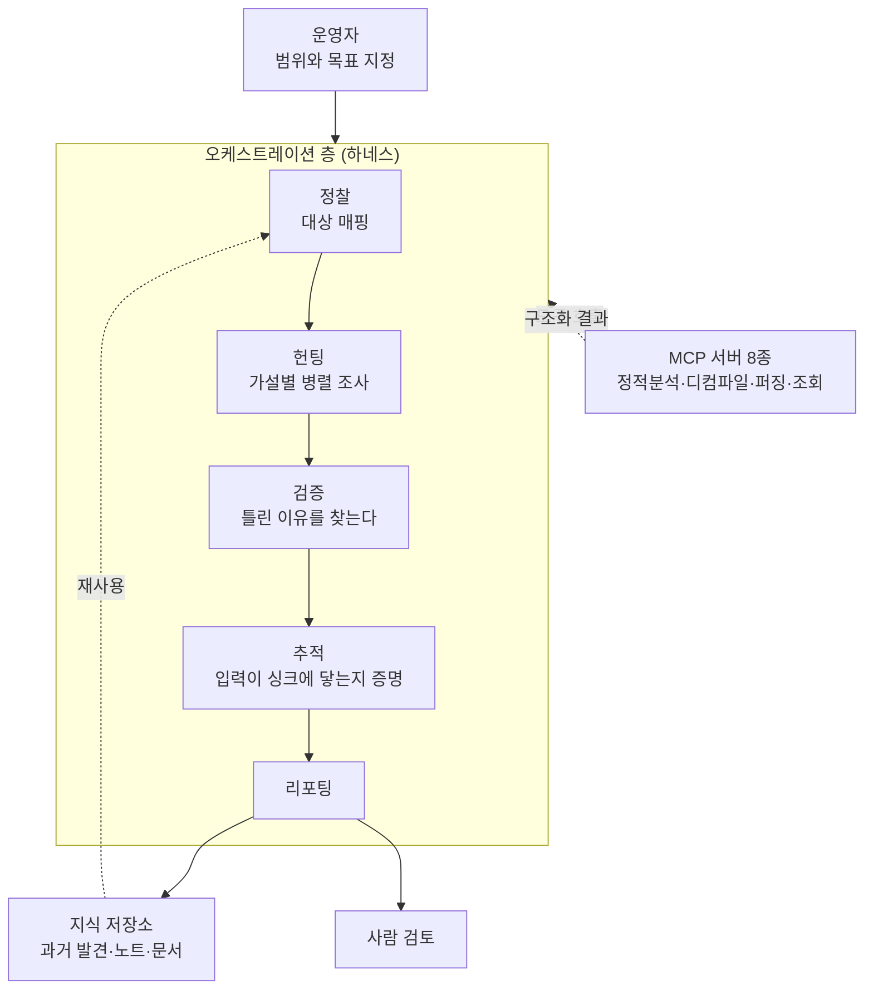

## 왜 읽어야 하나

사내에서 코드 감사나 취약점 헌팅에 LLM을 붙여보려는 보안 엔지니어, 그리고 에이전트가 내놓은 결과를 사람이 믿어도 되는지 판단해야 하는 플랫폼 담당자를 위한 글입니다. 결론을 먼저 말씀드리면, 이 분야에서 출력 품질을 가르는 것은 어떤 모델을 쓰느냐가 아니라 **발견을 반증하도록 설계된 별도 단계가 파이프라인에 있느냐**입니다. 공개된 하네스 여섯 개를 나란히 놓고 보면 서로 다른 팀이 독립적으로 같은 결론에 도착해 있습니다. 찾는 단계와 믿는 단계를 분리하고, 믿는 단계에는 반대 심문을 시킨다는 것입니다.

*넓게 들어온 후보가 게이트를 하나씩 지나면서 신뢰할 수 있는 소수로 좁혀지는 구조를 형상화했습니다.*

## 개요

LLM으로 보안 버그를 찾는 시도는 이제 신기한 실험이 아닙니다. 문제는 재현성입니다. 같은 저장소에 같은 프롬프트를 던져도 어제와 오늘의 결과가 다르고, 모델이 자신 있게 써낸 취약점 설명이 실제 코드 경로와 맞지 않는 경우가 흔합니다. 이 상황에서 흔한 반응은 더 좋은 모델로 갈아타는 것입니다.

영국의 공격 보안 연구자 Andy Gill이 6월 27일 공개한 [Harnessing Harnesses - Climbing the LLM Hills](https://blog.zsec.uk/harnessing-harnesses/)는 그 반응이 번지수를 잘못 짚었다고 말합니다. 그는 자기 헌팅 파이프라인에서 실제로 능력과 비용과 신뢰성을 끌어올린 것은 모델 선택이 아니라 모델을 감싼 오케스트레이션 층이었다고 적었습니다. 그리고 이렇게 덧붙입니다. 하네스 없이 LLM에게 쓸모 있는 일을 시키려는 것은 술 취한 유아들이 가득한 방을 감독하는 것과 비슷하다고요. 각자 자기가 돕고 있다고 확신하지만 아무도 서로 확인하지 않습니다.

이 글이 다루는 것은 그 오케스트레이션 층입니다. Gill이 정리한 공개 하네스 다섯 개와 그가 직접 공개한 템플릿 하나, 모두 여섯 개를 원 저장소와 함께 확인하고 설계 결정을 비교했습니다. 저희가 이 주제를 고른 이유는 보안 도구가 궁금해서가 아닙니다. 취약점 헌팅은 오탐 비용이 유난히 비싼 작업이라 검증 설계가 먼저 성숙합니다. 그 성숙한 패턴은 사내 업무 자동화 에이전트에도 그대로 옮겨집니다.

## 하네스는 무엇을 소유하는가

먼저 용어를 정리해야 합니다. 하네스는 LLM을 둘러싼 오케스트레이션 층입니다. 각 작업 단계의 입력, 도구, 프롬프트, 모델, 상태, 검증 게이트, 출력을 통제합니다.

여기서 MCP와의 관계가 자주 헷갈립니다. MCP 서버는 하네스 **안에** 있는 도구의 한 종류입니다. 명령을 실행하고 바이너리를 디컴파일하고 데이터베이스를 조회하는 호출 가능한 함수를 모델에게 줍니다. 그러나 그 함수를 언제, 어떤 순서로, 어떤 컨텍스트와 함께 부를지, 그리고 결과를 어떻게 처리할지는 결정하지 않습니다. 그게 하네스의 일입니다. Gill의 표현을 빌리면 MCP 서버를 아무리 갖춰놔도 사용 방식을 조율하는 무언가가 없으면 일관성 없고 검증 불가능한 출력이 나옵니다. 그의 세팅에는 MCP 서버가 여덟 개 돌고 있고, 이것들을 파이프라인으로 묶어주는 것이 하네스입니다.

*단계마다 프롬프트와 입출력이 따로 있고, 단계 사이는 대화가 아니라 구조화된 산출물로 이어집니다.*

Gill이 공개한 템플릿 [harness-kit](https://github.com/ZephrFish/harness-kit)의 워크플로가 정확히 이 모양입니다. 정찰이 대상을 매핑하고, 헌팅이 좁은 가설을 조사하고, 검증이 그 발견이 틀렸을 이유를 찾고, 추적이 공격자가 통제하는 입력이 취약한 싱크까지 실제로 도달하는지 증명합니다. 이 게이트를 통과한 발견만 리포팅에 올라갑니다.

한 가지 설계 결정이 특히 중요합니다. 단계들은 하나의 거대한 대화를 공유하지 않고 **구조화된 산출물을 주고받습니다**. 매핑 단계가 파일 경로와 진입점과 의존성을 담은 JSON을 반환하면 이후 단계가 그걸 입력으로 씁니다. 이렇게 두면 파이프라인을 부분적으로 재실행하거나 한 단계만 교체하기가 쉽고, 헌팅 워커들을 정해진 컨텍스트 예산 안에서 병렬로 돌릴 수 있습니다.

## 공개 하네스 여섯 개 비교

같은 문제를 푸는 서로 다른 답들을 나란히 놓으면 무엇이 본질인지 드러납니다.

| 하네스 | 대상 범위 | 검증 방식 | 출력 신뢰 수준 |
|---|---|---|---|
| [RAPTOR](https://github.com/gadievron/raptor) | 정적 분석 + 동적 탐색, 범용 | 6단계 A~F 파이프라인, CVSS 채점, Z3 제약 해결 | 도구와 솔버로 뒷받침된 판정 |
| [Anthropic 참조 하네스](https://github.com/anthropics/defending-code-reference-harness) | C/C++ (Dockerfile + ASAN 빌드 필수) | 계측 빌드에서 크래시를 재현하는 바이너리 PoC | 실행으로 증명된 발견 |
| [baby-naptime](https://github.com/faizann24/baby-naptime) | C/C++ 바이너리 | 살아 있는 바이너리 대상 단일 에이전트 반복 루프 | 런타임 신호 기반 |
| [audit](https://github.com/evilsocket/audit) | 언어·저장소 무관, 빌드 불필요 | 8단계, 병렬 에이전트, 추적 단계 통과 필수 | 규율 있는 코드 리뷰 |
| [VVAH](https://github.com/visa/visa-vulnerability-agentic-harness) | 언어·저장소 무관 | 위협 모델링과 테인트 흐름 선행, 적대적 2차 패스 | 명시적으로 트리아지 후보 |
| [harness-kit](https://github.com/ZephrFish/harness-kit) | 템플릿 | 정찰·헌팅·검증·추적 게이트 | 구조를 보여주는 참조 구현 |

가장 엄격한 쪽은 Anthropic의 참조 하네스입니다. ASAN으로 계측한 도커 컨테이너 안에서 자율적으로 찾고 채점하고 패치하는 파이프라인을 돌리는데, 모든 발견에 계측 빌드에서 크래시를 재현하는 바이너리 PoC가 붙습니다. 도달 가능한지를 두고 논쟁할 여지가 없습니다. `vulnpipeline_recon`이 공격 표면을 매핑하고 `vulnpipeline_run`이 독립 퍼징 에이전트를 띄우며 `vulnpipeline_report`가 각 크래시를 통과, 경계선, 서비스 거부 전용, 낮은 영향으로 채점합니다. `vulnpipeline_patch`는 수정을 만들고 다시 빌드해 PoC를 재실행해 해결을 확인합니다. 대신 Dockerfile과 빌드 스크립트와 계측 가능한 ASAN 빌드가 있는 C/C++ 프로젝트로 범위가 좁습니다. Gill은 이 하네스도 가끔 쓸모없는 결과를 뱉었다고 솔직하게 적어놨습니다.

RAPTOR는 다른 방향으로 엄격합니다. 도구를 실행하는 파이썬 실행 층과 무엇을 돌릴지 결정하는 Claude Code 결정 층이 분리돼 있어서, 오케스트레이션 로직을 AI 추론과 독립적으로 테스트할 수 있습니다. 검증 파이프라인은 여섯 단계입니다. A부터 D까지가 패턴이 진짜인지, 공격자가 거기 닿으려면 무엇이 필요한지, 코드가 줄 단위로 그 발견을 뒷받침하는지, 그리고 CVSS 점수를 포함한 최종 판정을 다룹니다. E는 ASLR과 RELRO 확인, 가젯 가용성, 원 가젯 적용 가능성에 대한 Z3 SMT 제약 해결을 포함한 바이너리 실현 가능성을 봅니다. F는 승격 직전에 모순 검사를 한 번 더 합니다.

반대편 끝에 VVAH가 있습니다. Visa가 공개한 이 하네스는 저장소를 인벤토리하고 신뢰 경계를 매핑하고 전문 리뷰 렌즈를 배정한 뒤 적대적 2차 패스로 발견을 검증하고 SARIF와 마크다운 리포트를 냅니다. 여기서 눈여겨볼 것은 자기 출력을 **확인된 취약점이 아니라 트리아지 후보로 취급한다**고 명시했다는 점입니다. 저는 이게 겸손이 아니라 정확한 자기 규정이라고 봅니다. VVAH의 호출 그래프는 완전한 AST에서 만들어지는 게 아니라 LLM이 씨를 뿌리고 정규식으로 보강하는 방식이라, 동적 디스패치와 리플렉션과 프레임워크 라우팅을 놓칠 수 있습니다. 어디까지 믿을 수 있는지를 도구가 직접 말해주면 사람이 그만큼 덜 속습니다.

## 검증 단계는 반대 심문이어야 합니다

여섯 개를 관통하는 공통점은 검증 단계의 프롬프트가 찾는 단계와 방향이 반대라는 것입니다. 헌팅 단계는 가설을 만들고, 검증 단계는 그 가설이 **틀렸을 이유**를 찾습니다. 같은 모델에게 같은 방향으로 한 번 더 물어보는 것은 검증이 아닙니다.

Gill이 좋은 사례로 든 Scrutineer의 재검증 스킬이 이 원리를 깔끔하게 보여줍니다. 심층 보안 점검이 High나 Critical 발견을 내면, 재검증 단계가 그것을 git 히스토리와 대조해 `true_positive`, `false_positive`, `already_fixed`, `uncertain` 중 하나를 반환합니다. `true_positive`로 표시된 것만 실제 코드를 현재 HEAD에서 테스트하는 검증 단계로 넘어갑니다. 이미 고쳐진 버그를 다시 보고하는 낭비가 여기서 걸러지고, 비싼 검증 작업이 진짜일 가능성이 높은 발견에만 집중됩니다.

판정을 자유 서술이 아니라 **고정된 네 개의 값**으로 받는 설계도 중요합니다. 모델이 "아마도 유효해 보입니다" 같은 문장을 쓰면 다음 단계가 그걸 다시 해석해야 하고, 그 해석이 매번 달라집니다. 열거형으로 받으면 뒤에 오는 라우팅을 코드가 결정론적으로 처리할 수 있습니다.

또 하나 반복해서 나오는 실수가 있습니다. 파이프라인 전체에 시스템 프롬프트 하나를 쓰는 것입니다. 코드베이스를 매핑하는 에이전트와 익스플로잇 가설을 세우는 에이전트와 제안된 PoC를 검토하는 에이전트는 각각 다른 지시를 받아야 합니다. 하네스는 그 출력들을 연결하고 각 모델이 필요한 컨텍스트만 받도록 보장하는 역할을 합니다.

## 컨텍스트 예산과 모델 라우팅

Gill은 컨텍스트 윈도우를 예산으로 취급하라고 말하면서 구체적인 숫자를 제시합니다. 단일 함수 분석은 대체로 8K 토큰 안에서 처리되고, 여러 발견을 가로지르는 종합은 32K에 가까워집니다. 퍼저 출력과 스캐너 로그는 프롬프트에 들어가기 전에 보통 수백 토큰 수준으로 줄여야 합니다.

초기 하네스에서 흔한 실패 모드는 매 단계마다 원본 파일과 스캐너 출력과 전체 대화 기록을 통째로 밀어넣는 것입니다. 대부분이 무관할 때 컨텍스트가 많다고 자동으로 좋아지지 않습니다. 하네스는 현재 가설에 관련된 코드 경로만 가져오고, 시끄러운 도구 출력은 요약하고, 완료된 작업은 짧은 롤링 요약으로만 남기고, 결과가 다른 곳에 저장된 작업은 컨텍스트에서 제거해야 합니다. Gill은 이 전략을 초기에 정하라고 강조합니다. 나중에 컨텍스트 관리를 덧붙이는 일은 고통스럽습니다.

모델 라우팅도 같은 설계에서 따라 나옵니다. 분류하고 정리하고 요약하는 일은 저렴한 모델이 맡고, 검증과 추적과 종합에는 강한 모델을 씁니다. 오케스트레이션 층이 상태와 게이트와 예산과 인계를 소유하고, 모델은 한 번에 하나의 좁은 추론만 수행합니다.

마지막 조각은 기억입니다. 컨텍스트 관리가 한 번의 실행 안에서 각 단계가 무엇을 보는지 결정한다면, 검색 증강은 이전 실행에서 무엇을 재사용할 수 있는지 결정합니다. Gill은 과거 노트와 블로그 글과 언어별 정보와 도구 문서를 모은 중앙 저장소를 구축했고, 성공한 실행마다 360도 피드백 루프를 돌려 다음 발견이 그 기준선 위에서 시작하도록 만들었다고 밝혔습니다.

## ThakiCloud 제품 적용 시사점

저희가 이 구조를 남의 동네 이야기로 읽지 않는 이유는 [Paxis](https://thakicloud.com/tech-blog/ko/agentops/)가 정확히 이 층을 제품으로 만든 물건이기 때문입니다. Paxis는 ThakiCloud의 Enterprise Agent Platform으로, 요청에 맞는 스킬을 검색해 격리된 샌드박스에서 실행하고 모든 행동을 정책 게이트와 감사 로그로 통과시킵니다. 보안 하네스들이 각자 손으로 만든 것을 하나씩 대응시켜보면 겹치는 자리가 분명합니다.

단계 분리와 구조화된 산출물 교환은 Paxis의 DAG 멀티에이전트 실행에 해당합니다. 헌팅 워커를 정해진 컨텍스트 예산 안에서 병렬로 돌리는 패턴이 그대로 들어갑니다. 반증 게이트는 스킬 하네스 위에 검증 스킬을 별도 노드로 두는 방식으로 표현됩니다. 여기서 중요한 것은 판정을 산문이 아니라 열거형으로 받고, 그 열거형에 따른 라우팅은 모델이 아니라 코드가 소유하게 하는 것입니다. 도구 실행이 샌드박스 안에서만 일어나고 각 호출이 감사 로그에 남는다는 점은 Signum이 담당하는 신원과 감사 기반이 받쳐줍니다. 공격 보안 도구를 다루는 파이프라인이라면 이 경계가 선택 사항이 아닙니다.

비용 축에서는 Metis가 붙습니다. 분류와 요약은 값싼 모델로, 검증과 종합은 강한 모델로 나누는 라우팅은 전용 엔드포인트와 서버리스를 섞어 쓰는 서빙 계층이 있어야 실제 절감으로 이어집니다. 토큰 단가가 같은 상태에서 단계만 나누면 호출 수만 늘어납니다. 그리고 실행이 쌓이면 Maxis 축이 열립니다. 어떤 발견이 사람 검토에서 진짜로 판정됐고 어떤 것이 기각됐는지가 곧 라벨이므로, 검증 단계를 작은 특화 모델로 옮기는 경로가 생깁니다. 검증은 좁고 반복적인 판단이라 이 전환에 특히 잘 맞습니다.

배치 위치도 짚어둘 만합니다. 코드 감사 파이프라인은 소스와 사고 이력을 다루기 때문에 외부로 나가면 안 되는 경우가 많습니다. 금융이나 공공처럼 폐쇄망이 전제인 곳에서는 같은 파이프라인을 Aegis 위에서 돌리고, 대량 스캔이 필요한 시점에만 Telox GPU 자원으로 확장하는 구성이 현실적입니다. One Paxis. Many Workflows. Any Cloud.

## 한계 및 반론

이 글이 다룬 여섯 개 중 어느 것도 사람 검토를 없애지 못합니다. Gill 본인이 좋은 하네스는 판단과 검증의 필요를 제거하지 않고 둘을 반복 가능하게 적용할 방법을 줄 뿐이라고 못박았습니다.

기술적 한계도 분명합니다. 실행으로 증명하는 방식은 가장 확실하지만 계측 가능한 빌드가 있는 C/C++로 범위가 좁습니다. 언어를 가리지 않는 소스 기반 파이프라인은 범위가 넓은 대신 런타임 확실성이 없고, 호출 그래프가 완전한 AST에서 나오지 않으면 동적 디스패치와 리플렉션을 놓칩니다. `audit`처럼 유연한 도구도 Gill이 여러 부분을 손봐야 흐름이 맞았다고 적었습니다. 출력 품질이 정찰 작업과 프롬프트와 모델 선택과 저장소를 어떻게 나눴는지에 달려 있어서, 조정 없이 그대로 돌리면 중복 작업과 얕은 리뷰가 나옵니다.

그리고 이 글의 근거 자체에 한계가 있습니다. 저희는 여기 언급된 하네스들을 직접 돌려 수치를 측정하지 않았습니다. 공격 보안 도구를 실제 대상에 돌리는 일은 승인된 범위 안에서만 해야 하는 작업이라 블로그 실험으로 다룰 성격이 아닙니다. 이 글은 공개된 저장소와 저자의 기록을 교차 확인해 설계 결정을 비교한 분석이며, 여기 적힌 토큰 예산과 단계 구성은 저자가 자기 파이프라인 기준으로 제시한 값입니다. 다른 코드베이스에서 같은 숫자가 나온다는 보장은 없습니다.

마지막으로 반대 논거를 하나 세워두겠습니다. 게이트를 늘리면 오탐이 줄지만 정탐도 함께 줄어듭니다. 모든 게이트는 재현율을 대가로 정밀도를 삽니다. 사람 검토 인력이 충분하고 놓치는 비용이 오탐 비용보다 훨씬 큰 조직이라면, 게이트를 느슨하게 두고 더 많은 후보를 사람에게 올리는 편이 합리적일 수 있습니다. 어느 쪽이 맞는지는 하네스 설계가 아니라 그 조직의 검토 처리량이 결정합니다.

## 정리

취약점 헌팅에 LLM을 붙였는데 결과를 믿기 어렵다면, 먼저 확인할 것은 모델 등급이 아니라 파이프라인에 반증 단계가 있는지입니다. 공개된 여섯 개의 하네스가 서로 다른 언어와 범위와 검증 강도를 가지고도 같은 골격에 도착했습니다. 찾는 단계와 믿는 단계를 분리하고, 믿는 단계에는 틀렸을 이유를 찾게 하고, 단계 사이는 대화가 아니라 구조화된 산출물로 잇고, 판정은 고정된 값으로 받는 것입니다.

당장 적용할 수 있는 순서를 제안하면 이렇습니다. 지금 쓰는 파이프라인에서 검증에 해당하는 단계를 하나 떼어내 프롬프트를 반대 방향으로 다시 쓰십시오. 그 단계의 출력을 자유 문장이 아니라 네다섯 개의 고정 값으로 바꾸고, 그 값에 따른 다음 행동은 코드가 결정하게 두십시오. 여기까지만 해도 재현성이 눈에 띄게 올라갑니다. 컨텍스트 예산과 모델 라우팅은 그다음에 붙여도 늦지 않습니다.

## 출처

- Andy Gill, [Harnessing Harnesses - Climbing the LLM Hills](https://blog.zsec.uk/harnessing-harnesses/), ZephrSec, 2026-06-27
- Andy Gill, [Jenny was a Friend of Mine - MCPs and Friends](https://blog.zsec.uk/bullyingllms/), ZephrSec, 2026-04-04
- [ZephrFish/harness-kit](https://github.com/ZephrFish/harness-kit)
- [gadievron/raptor](https://github.com/gadievron/raptor)
- [anthropics/defending-code-reference-harness](https://github.com/anthropics/defending-code-reference-harness)
- [faizann24/baby-naptime](https://github.com/faizann24/baby-naptime)
- [evilsocket/audit](https://github.com/evilsocket/audit)
- [visa/visa-vulnerability-agentic-harness](https://github.com/visa/visa-vulnerability-agentic-harness)
