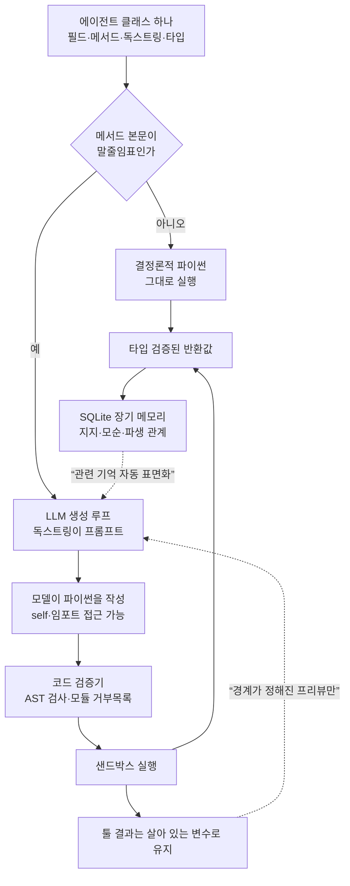

## 왜 읽어야 하나

에이전트 하네스를 직접 만들거나 운영하면서 툴 스키마와 콜백과 워크플로 그래프가 각각 다른 파일에 흩어져 있는 상황이 계속 부담스러운 엔지니어를 위한 글입니다. 결론부터 말씀드리면, NVIDIA의 NOOA가 제안한 "에이전트는 파이썬 클래스 하나"라는 접기는 실제로 성립하고, 그 안에서 비용을 결정적으로 바꾸는 것은 여섯 능력 중 참조 전달 하나입니다. 직접 재현했을 때 파드 3,200건짜리 툴 결과가 컨텍스트에 들어가는 비용이 216,806 토큰에서 700 토큰으로 내려갔습니다. 다만 이 프레임워크는 생성된 코드를 실행하는 물건이고, 자기 검증기가 컨테인먼트 경계가 아니라는 사실을 문서에 직접 적어두었습니다. 저희가 확인해보니 그 경고는 정확했습니다.


*객체는 실행 환경에 그대로 남고 모델에게는 가느다란 참조만 건네지는 구조를 형상화했습니다.*

## 개요

에이전트 성능 이야기는 오랫동안 모델 이야기였습니다. 어느 모델이 더 똑똑한가, 어느 모델이 도구를 더 잘 부르는가 하는 질문이 대부분이었습니다. NVIDIA가 7월 27일 기술 블로그에 올린 [Six Agent Harness Capabilities for Higher Model Performance](https://developer.nvidia.com/blog/six-agent-harness-capabilities-for-higher-model-performance/)는 그 프레임을 뒤집습니다. 하네스는 모델을 둘러싼 아키텍처이고, 컨텍스트를 어떻게 렌더링하는지, 행동을 어떻게 실행하는지, 상태를 어떻게 관리하는지, 작업이 끝났다고 언제 판단하는지가 결과를 모델만큼이나 좌우한다는 주장입니다. 글은 같은 모델을 쓰고도 하네스 설계만으로 벤치마크가 두 자릿수로 흔들리고 토큰 비용이 크게 갈린다고 못박습니다.

이 주장을 뒷받침하려고 공개한 것이 NVIDIA Labs Object-Oriented Agents, 줄여서 NOOA입니다. 파이썬 프레임워크와 메모리 시스템, 능력 테스트, 벤치마크 에이전트를 코드와 데이터와 평가까지 함께 Apache 2.0으로 열었습니다. 저장소는 [NVIDIA-NeMo/labs-OO-Agents](https://github.com/NVIDIA-NeMo/labs-OO-Agents)이고 7월 20일에 만들어져 8월 7일까지 계속 푸시되고 있으며 별은 1,130개입니다. 설계 원리와 평가 결과를 담은 논문도 [arXiv 2607.20709](https://arxiv.org/abs/2607.20709)로 함께 나왔습니다.

저희가 이 글을 쓰는 이유는 NOOA가 새 프레임워크여서가 아닙니다. 컨텍스트를 프롬프트가 아니라 실행 환경의 변수로 두자는 발상은 이미 저희가 [Prime Agent의 RLM 하네스를 재현하면서](/tech-blog/ko/agentops/prime-agent-rlm-harness/) 한 번 다뤘습니다. NOOA가 다른 지점은 그 발상을 하나의 아이디어가 아니라 여섯 개의 인터페이스 능력으로 분해하고, 각각이 무엇을 사는지를 벤치마크로 갈라놓았다는 데 있습니다. 하네스를 직접 만드는 입장에서는 이 분해가 프레임워크 자체보다 값집니다.

## 이 도구는 무엇인가

NOOA의 출발점은 한 문장입니다. 에이전트는 파이썬 클래스 하나입니다. 메서드가 능력이고, 필드가 상태이며, 독스트링이 프롬프트이고, 타입 어노테이션이 강제되는 계약입니다. 여기에 규칙이 하나 더 붙습니다. 본문이 말줄임표인 메서드는 런타임에 LLM 루프가 채우고, 본문이 실제로 있는 메서드는 그냥 결정론적인 파이썬으로 돕니다.

```python
from nooa import Agent

class SupportAgent(Agent):
    """당신은 고객 지원 에이전트입니다."""

    order_db: OrderDB          # 객체 상태. 모델에게 보이고 참조로 전달됩니다

    def is_refund_eligible(self, order: Order) -> bool:
        """환불 가능 여부를 반환합니다."""
        return order.delivered and order.days_since_delivery <= 30

    async def triage(self, message: str, order: Order | None) -> Ticket:
        """고객 메시지를 분류해 지원 티켓을 만듭니다."""
        ...
```

같은 클래스 안에서 결정론적 규칙과 모델 판단이 나란히 놓입니다. 환불 자격 판정처럼 틀리면 안 되는 규칙은 코드로 남고, 자유 텍스트를 분류하는 일은 모델에게 넘어갑니다. 둘 사이를 프롬프트 지시로 조율할 필요가 없다는 점이 핵심입니다. 규칙은 코드가 말하는 대로 실행되지, 모델이 따를 수도 있고 안 따를 수도 있는 문장으로 남지 않습니다.

NVIDIA가 정리한 여섯 가지 모델 대면 인터페이스 능력은 다음과 같습니다. 타입이 지정된 입출력은 에이전트 호출이 자유 텍스트가 아니라 검증되는 인자와 반환값을 갖게 합니다. 참조 전달은 모델이 직렬화된 덤프 대신 살아 있는 파이썬 객체를 다루면서 경계가 정해진 프리뷰만 보게 합니다. 행동으로서의 코드는 모델이 제어 흐름과 인라인 메서드 호출을 포함한 파이썬을 써서 행동하게 합니다. 프로그래밍 가능한 루프 엔지니어링은 오케스트레이션 루프를 평범한 파이썬으로 두어 개발자도 모델도 고쳐 쓸 수 있게 합니다. 명시적 객체 상태는 지속되는 타입 상태를 대화 히스토리가 아니라 에이전트 객체 위에 둡니다. 마지막으로 모델이 호출 가능한 하네스 API는 컨텍스트 블록과 이벤트 히스토리를 모델이 직접 들여다보고 관리할 수 있는 API로 노출합니다.


*여섯 능력 중 저희 워크로드에 영향이 큰 네 가지를 추려 정리했습니다.*



메모리 서브시스템은 별도로 볼 만합니다. 배경에서 자동으로 돌아가는 요약 파이프라인이 아니라, 에이전트가 모델 호출 가능한 도구로 직접 쓰고 조회하고 고치는 저장소입니다. 레코드는 타입과 중요도와 태그를 갖고, 지지한다거나 모순된다거나 파생됐다는 식의 타입 관계로 서로 연결되어 평평한 로그가 아니라 지식 그래프를 이룹니다. 배경 반영 패스가 중복을 병합하고 관련 레코드를 잇고 에피소드를 통찰로 증류하며 더 이상 쓸모없는 정보를 쳐냅니다. 전체는 사람이 읽을 수 있는 SQLite 파일 하나에 남기 때문에 팀이 평소 쓰던 방식으로 들여다보고 백업하고 리뷰할 수 있습니다.

## 설치 및 통합

설치는 짧습니다. 저희는 저장소의 공용 가상환경에 그대로 얹었습니다.

```bash
# 새 프로젝트라면
uv init my-agent-project && cd my-agent-project
uv add nooa

# 기존 환경에 얹는 경우
VIRTUAL_ENV="$PWD/.venv" uv pip install nooa nooa-memory
```

의존성 충돌은 없었습니다. 67개 패키지가 해석됐고 그중 실제로 새로 받은 것은 다섯 개뿐이었습니다.

```
Resolved 67 packages in 1.18s
 + nooa==0.0.8
 + nooa-memory==0.0.8
 + openinference-instrumentation==0.1.57
 + openinference-instrumentation-litellm==0.1.36
 + openinference-semantic-conventions==0.1.32
```

핵심 프레임워크 외에 CLI와 메모리와 벤치마크는 별도 배포판입니다. `nooa-cli`가 `nooa` 명령과 트레이스 뷰어와 평가 러너를 붙이고, `nooa-memory`가 장기 메모리를, `nooa-bench`가 Harbor 벤치마크 러너를 붙입니다. `nooa[cli,memory]`처럼 엑스트라로 한 번에 당겨올 수도 있습니다.

모델은 LiteLLM 레지스트리를 통해 붙습니다. 호스티드 모델뿐 아니라 Ollama와 vLLM 엔드포인트를 그대로 지정할 수 있다는 점이 자체 인프라를 굴리는 입장에서는 중요합니다.

```python
from nooa.unifiedllm.registry import get_llm_client

llm = get_llm_client("hosted_vllm/Qwen/Qwen3-1.7B",
                     api_base="http://localhost:8000/v1")
```

모든 LLM 호출과 코드 실행과 메서드 호출은 기본으로 트레이싱되며 부모 자식 스팬이 보존됩니다. `uv run nooa start-dev`로 트레이스 뷰어를 띄우면 5001 포트에서 실행을 들여다볼 수 있고, 뷰어가 떠 있지 않으면 트레이싱은 조용히 꺼집니다. 설정이 필요 없다는 뜻이라 부담이 적습니다.

## 실제 실험 결과

저희가 확인하고 싶었던 것은 하나였습니다. 여섯 능력 중 참조 전달이 실제로 무엇을 아끼는가입니다. 이 능력이 NVIDIA가 말한 절반의 토큰과 컨텍스트 압축 불필요를 동시에 만드는 기전이라고 지목됐기 때문입니다.

측정 대상은 저희에게 익숙한 객체로 잡았습니다. GPU 파드 인벤토리입니다. 클러스터 조회 툴이 파드 목록을 돌려주는 상황을 만들고, 그 결과를 컨텍스트에 넣는 두 가지 방법을 비교했습니다. 하나는 고전적인 하네스처럼 전체를 JSON으로 직렬화해 트랜스크립트에 붙이는 방식이고, 다른 하나는 NOOA의 `pformat`으로 경계가 정해진 프리뷰만 렌더링하는 방식입니다. 토큰은 프레임워크가 함께 노출하는 `char_approximate_token_counter`로 셌습니다. 모델 호출은 한 번도 없었고 시드를 고정했기 때문에 재실행하면 같은 숫자가 나옵니다.

| 파드 수 | 전체 JSON 문자 | 토큰 | 프리뷰 문자 | 토큰 | 절감 |
|---|---|---|---|---|---|
| 50 | 13,584 | 3,396 | 2,788 | 697 | 79.48% |
| 200 | 54,233 | 13,558 | 2,785 | 696 | 94.87% |
| 800 | 216,856 | 54,214 | 2,799 | 699 | 98.71% |
| 3,200 | 867,225 | 216,806 | 2,800 | 700 | 99.68% |


*같은 툴 결과를 컨텍스트에 넣는 두 방법의 비용 곡선입니다. 로그 축입니다.*

숫자가 말하는 것은 절감률이 아니라 기울기입니다. 전체 직렬화는 데이터 크기에 그대로 비례해서 자라 3,200건에서 216,806 토큰이 되고, 이는 흔한 200k 컨텍스트 창을 혼자서 넘깁니다. 반면 프리뷰는 50건에서 697 토큰, 3,200건에서 700 토큰으로 사실상 평평합니다. 툴이 얼마나 큰 결과를 돌려주든 컨텍스트 예산이 흔들리지 않는다는 뜻입니다. NVIDIA가 SWE-bench에서 중앙값 세션 프롬프트 정점이 200k에서 400k짜리 창을 두고도 22k에서 72k에 머물렀다고 보고한 것, 그래서 요약 패스가 필요 없었다고 한 것이 이 성질에서 나옵니다.

모델이 실제로 보는 프리뷰는 이런 모양입니다. 리스트 길이는 명시되고 앞쪽 몇 건만 펼쳐지며 긴 문자열은 앞뒤를 잘라 길이와 함께 보여줍니다.

```
ClusterInventory(cluster='tkai-prod-compute-h200', pods=list(len=3200,
    [:5]=[
        Pod(name='train-job-00000-worker-0', namespace='tkai-metis',
            phase='Failed', gpu_type='B200', gpu_count=1, ...
            image=str(len=66, [:25]='cr2.thakicloud.net/ai-pla',
                      [-25:]='9.0-cuda13.0-cudnn9-devel')),
```

여기에 더해 `doc()`이 타입의 API 계약을 프롬프트용 문자열로 렌더링하는데, 저희 인벤토리 클래스 기준으로 256자, 64 토큰이었습니다. 별도의 툴 스키마를 손으로 쓰지 않고도 모델이 무엇을 호출할 수 있는지 알게 되는 비용이 그 정도라는 뜻입니다. 그동안에도 결정론적 메서드는 그냥 파이썬으로 돌아서, 3,200건에 대한 사용 중 GPU 합계 4,987을 모델을 거치지 않고 계산했습니다.

두 번째로 확인한 것은 "에이전트 개발이 평범한 소프트웨어 개발이 된다"는 주장입니다. 저희는 GPU 잡을 분류하는 작은 에이전트를 만들고 평범한 pytest로 테스트를 다섯 개 썼습니다. 결정론적 메서드가 모델 없이 도는지, 객체 상태가 진짜 파이썬 상태인지, 두 인스턴스가 상태를 공유하지 않는지, 말줄임표 본문이 생성 메서드로 인식되는지를 각각 확인했습니다. 결과는 1.11초에 다섯 개 모두 통과였고, 네트워크도 실제 모델도 필요하지 않았습니다.

다만 여기서 예상하지 못한 마찰을 하나 만났습니다. 처음 작성한 테스트는 전부 실패했는데, 원인이 테스트가 아니라 생성자였습니다. NOOA는 `__init__`에서 모델을 즉시 해석하기 때문에, 모델을 전혀 건드리지 않는 순수 파이썬 메서드만 가진 에이전트조차 모델 없이는 인스턴스를 만들 수 없습니다.

```
ValueError: No LLM available for OrphanAgent. Resolution attempted:
  1. Instance-level: Not provided
  2. Class hierarchy: Not set (checked full MRO)
  3. Runtime parent: No parent agent in context
```

해법은 프레임워크가 이미 제공합니다. `nooa.unifiedllm.fake.FakeLLMClient`를 클래스에 묶으면 밀폐된 테스트가 됩니다. 다만 "나머지 소프트웨어와 똑같이 테스트한다"는 문장을 그대로 믿고 들어가면 첫 30분은 여기서 씁니다. 모델 해석이 호출 시점이 아니라 생성 시점에 일어난다는 사실을 미리 알고 시작하시는 편이 낫습니다.

세 번째로 코드 검증기가 실제로 무엇을 막는지 재봤습니다. README가 AST 검사와 모듈 거부목록을 두고 "심층 방어 가드레일이지 컨테인먼트 경계가 아니다"라고 스스로 적어두었기 때문에, 그 문장이 어느 정도로 정확한지 확인할 가치가 있었습니다.

| 코드 조각 | 판정 |
|---|---|
| 단순 산술 | 허용 |
| `import os` | 허용 |
| `import subprocess` | 차단 |
| `open()` 파일 쓰기 | 허용 |
| `importlib` 동적 로드 | 허용 |
| `while True` 무한 루프 | 허용 |


*인프로세스 검증기가 실제로 걸러내는 범위와 그 한계입니다.*

경고는 정확했습니다. `subprocess`는 막히지만 `os`와 `open()`과 `importlib`는 모두 통과합니다. 파이썬 위의 정적 검사기가 제공할 수 있는 보장의 한계가 그대로 드러나는 결과이고, 문서가 말한 대로 컨테인먼트 경계는 OS 수준 격리여야 합니다. 이 항목에서 NVIDIA가 자기 프레임워크를 과장하지 않았다는 점은 신뢰할 만한 신호라고 봅니다.

공개된 벤치마크 쪽 숫자는 저희가 재현하지 않았으므로 인용으로만 남깁니다. SWE-bench Verified에서 GPT-5.5로 82.2%를 기록했고 이는 제출 시점 공개 리더보드 최고치인 79.2%를 넘는 값이며, 벤치마크 전용 프롬프트 없이 253줄짜리 범용 에이전트로 얻었다고 밝혔습니다. 같은 과제에서 29회 LLM 호출과 약 110만 토큰을 썼는데, 비교 하네스는 66회 호출과 220만 토큰으로 78.2%, 29회 호출과 130만 토큰으로 78.6%였습니다. CyberGym L1에서는 네트워크를 차단하고 규칙 기반 부정 검사를 건 채 86.8%를 풀었고, ARC-AGI-3에서는 GPT-5.6-sol 편성이 게임당 약 13.3달러로 평균 RHAE 85.1%에 도달했습니다.

## ThakiCloud 제품 적용 시사점


*이번 측정에서 나온 결론을 제품 계층별로 정리했습니다.*

저희가 Paxis를 만들면서 반복해서 부딪히는 문제가 정확히 NOOA가 겨눈 지점입니다. Paxis는 스킬을 검색해 격리된 샌드박스에서 실행하고 모든 행동을 정책 게이트와 감사 로그로 통과시키는 엔터프라이즈 에이전트 플랫폼입니다. 여기서 업무 한 건의 비용을 실제로 좌우하는 것은 모델 등급이 아니라 툴이 돌려준 결과가 컨텍스트를 얼마나 잡아먹는지입니다. 클러스터 조회 한 번이 20만 토큰이면 그 업무는 모델을 바꿔도 싸지지 않습니다. 위에서 잰 700 토큰과 216,806 토큰의 간격이 곧 업무 한 건의 단가 차이이고, 이 간격은 하네스 계층에서만 닫힙니다.

참조 전달이 저희에게 특히 맞는 이유는 Paxis가 다루는 객체가 대체로 크고 구조적이기 때문입니다. 파드 인벤토리, 감사 로그, 스킬 실행 트레이스, 문서 묶음은 모두 모델이 전문을 눈으로 읽어야 하는 대상이 아니라 골라서 접근해야 하는 대상입니다. 전문을 트랜스크립트에 부어 넣는 대신 살아 있는 객체로 두고 경계가 정해진 프리뷰만 건네면, 트랜스크립트가 추가 전용으로 남아 프리필 캐시가 세션 내내 유효하게 유지됩니다. 요약 패스를 돌리지 않아도 되는 것은 부수 효과가 아니라 이 성질의 직접적인 결과입니다.

타입이 계약이 된다는 점은 Signum 쪽에 걸립니다. NOOA가 취약점 검증 파이프라인을 설명하면서 든 예가 이 구조를 잘 보여줍니다. 결정론적 게이트 세 개를 프롬프트 지시가 아니라 타입이 붙은 평범한 메서드로 두었기 때문에, 코드가 그렇다고 말할 때만 발견이 채택되고 전체 실행이 검사 가능한 단일 트레이스로 남습니다. 정책 게이트와 감사 로그를 다루는 입장에서 이것은 익숙한 원칙의 재확인입니다. 판정은 모델의 자기 보고가 아니라 코드가 소유해야 하고, 그래야 감사가 성립합니다.

동시에 이 프레임워크는 저희가 왜 샌드박스를 프로세스 밖에 두는지도 확인해줍니다. 위 표에서 `open()`과 `importlib`가 통과하는 것을 보셨습니다. 생성된 코드를 실행하는 에이전트를 운영한다면 인프로세스 검증기는 실수를 일찍 잡는 장치이지 격리가 아니고, 실제 경계는 컨테이너나 VM이나 커널 수준에 있어야 합니다. 이 요구는 데이터 주권이 걸린 고객일수록 강해지는데, 폐쇄망에서 도는 Aegis 배포에서는 에이전트가 생성한 코드가 나갈 수 있는 경로 자체를 없애는 편이 검증보다 확실합니다.

모델 계층에서는 NOOA가 LiteLLM 레지스트리로 vLLM 엔드포인트를 그대로 받는다는 점이 Metis와 바로 맞물립니다. 하네스가 모델에 중립적이면 같은 에이전트 코드를 호스티드 모델로 시작해 자체 서빙 엔드포인트로 옮길 수 있고, 컨텍스트를 절반으로 줄인 상태에서 옮기면 전용 엔드포인트의 처리량 이득이 그만큼 더 크게 남습니다. 업무는 Paxis에서 정의하고, 토큰은 Metis에서 만들고, 그 실행은 Telox GPU 클러스터든 고객 폐쇄망의 Aegis든 같은 코드로 돈다는 그림이 여기서 구체화됩니다.

## 한계 및 반론

가장 먼저 짚어야 할 것은 성숙도입니다. NOOA는 스스로 리서치 프리뷰라고 밝히고 있고 버전은 0.0.8입니다. README는 거친 부분을 예상하라고 적어두었으며, 실제로 저희가 만난 생성자 마찰도 그 범주입니다. 프로덕션 에이전트를 지금 여기로 옮기는 결정은 이르다고 봅니다.

두 번째는 참조 전달의 적용 범위입니다. 저희가 잰 99.68%는 모델이 객체 전문을 읽을 필요가 없는 질문에서 나온 숫자입니다. 집계하거나 필터링하거나 특정 필드만 보는 작업이라면 프리뷰로 충분하지만, 모델이 3,200건을 하나씩 읽고 판단해야 하는 과제라면 데이터는 어떤 형태로든 컨텍스트에 들어와야 합니다. 이 조건부는 저희가 Prime Agent를 재현했을 때 만난 것과 같은 성질이고, 하네스 설계로 없앨 수 있는 종류가 아닙니다. 절감폭을 자기 워크로드에 옮겨 적기 전에 질문의 성격부터 확인하셔야 합니다.

세 번째는 벤치마크 해석입니다. SWE-bench Verified 82.2%는 인상적이지만 GPT-5.5와 짝지어 얻은 값이고, 하네스 기여분과 모델 기여분을 분리해서 읽으려면 같은 하네스를 여러 모델에 물린 결과가 필요합니다. 블로그가 Opus 4.6에서 79.8%를 함께 제시한 것은 그 방향의 정보이지만 두 점만으로는 부족합니다. 하네스 설계가 두 자릿수를 만든다는 주장 자체는 저희 경험과도 맞지만, 특정 숫자를 그대로 자기 스택의 기대값으로 옮기는 것은 다른 문제입니다.

마지막으로 객체 지향이라는 접기 자체가 모든 워크플로에 맞지는 않습니다. 에이전트를 클래스 하나로 모으는 설계는 상태와 능력이 한 덩어리로 묶일 때 강하지만, 여러 팀이 서로 다른 툴을 각자 배포하는 구조에서는 그래프 기반 오케스트레이션이 여전히 자연스럽습니다. NOOA가 기존 프레임워크를 대체한다기보다 대안적 인터페이스를 제시한다고 읽는 편이 정확합니다.

## 정리

NOOA에서 가져갈 것은 프레임워크가 아니라 분해입니다. 하네스가 성능을 만든다는 말은 오래됐지만 그 말이 실제로 무엇을 가리키는지는 늘 흐릿했는데, 여섯 개의 인터페이스 능력으로 나눠 놓으니 어디를 손대야 무엇이 좋아지는지가 보입니다. 그중 비용을 결정적으로 바꾸는 것은 참조 전달이었고, 저희 워크로드에서 그 값은 툴 결과 3,200건 기준 216,806 토큰과 700 토큰의 차이였습니다.


*프레임워크를 통째로 바꾸는 대신 밟을 수 있는 순서입니다.*

그래서 지금 하실 일은 프레임워크를 갈아엎는 것이 아닙니다. 지금 운영 중인 에이전트가 툴 결과를 트랜스크립트에 직렬화해 붓고 있는지부터 확인하시고, 그렇다면 가장 큰 툴 하나만 골라 경계가 정해진 프리뷰로 바꿔보시길 권합니다. 위 실험 코드는 `outputs/blog-impl/nvidia-nooa-agent-harness/`에 그대로 남겨두었고 시드가 고정되어 있어 자기 객체로 바꿔 끼우면 바로 자기 숫자가 나옵니다. 그리고 생성된 코드를 실행하고 계시다면, NVIDIA가 자기 검증기에 대해 적어둔 문장을 그대로 받아들이시는 편이 좋습니다. 경계는 검증기가 아니라 OS에 있습니다.

## 출처

- [Six Agent Harness Capabilities for Higher Model Performance](https://developer.nvidia.com/blog/six-agent-harness-capabilities-for-higher-model-performance/) (NVIDIA Technical Blog, 2026년 7월 27일, Ricardo Silveira Cabral·Paul Furgale)
- [NVIDIA-NeMo/labs-OO-Agents](https://github.com/NVIDIA-NeMo/labs-OO-Agents) (NOOA 저장소, Apache 2.0)
- [NVIDIA OO Agents: Native Python Object-Oriented Agents](https://arxiv.org/abs/2607.20709) (arXiv 2607.20709)
- 로컬 실측: nooa 0.0.8, Python 3.12.8, 시드 20260809. 모델 호출 없음. 원본 로그는 `outputs/blog-impl/nvidia-nooa-agent-harness/run-6.log`, `run-11.log`, `run-12.log`
