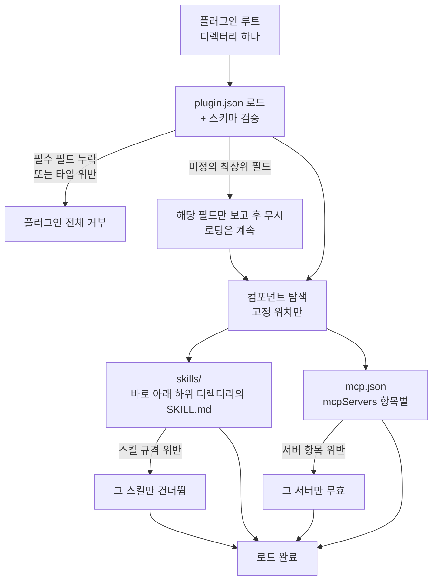

## 왜 읽어야 하나

에이전트 스킬과 MCP 서버를 사내에 여러 개 굴리면서 클라이언트마다 설치 경로와 설정 파일이 달라 같은 자산을 두세 번 포장하고 계신 플랫폼 엔지니어를 위한 글입니다. 결론부터 말씀드리면, Agent Plugins 1.0.0은 그 중복을 없애줄 만큼 충분히 작고 실제로 오늘 적용할 수 있는 규격입니다. 다만 공식 JSON 스키마를 통과했다고 해서 규격을 지킨 플러그인이 되지는 않습니다. 저희가 규격 본문이 명시적으로 금지한 위반 8개를 공식 스키마에 그대로 먹여봤더니 그중 2개가 아무 오류 없이 통과했습니다. 둘 다 플러그인 경계를 넘어가는 종류였습니다. 그래서 이 표준을 도입하는 쪽이 진짜로 해야 할 일은 매니페스트를 쓰는 것이 아니라, 스키마가 봐주지 않는 컨테인먼트 규칙을 클라이언트 코드에 직접 넣는 일입니다.


*한 번 포장하면 여러 클라이언트가 같은 형태로 읽어 간다는 것이 이 규격의 전부입니다.*

## 개요

에이전트에 능력을 붙이는 방법은 지난 1년 사이에 두 갈래로 굳었습니다. 하나는 모델에게 절차를 가르치는 에이전트 스킬이고, 다른 하나는 모델이 부를 실제 도구를 물려주는 MCP 서버입니다. 둘은 역할이 깔끔하게 나뉘어서, 실무에서는 거의 항상 같이 씁니다. 배포 절차를 설명하는 `SKILL.md` 하나와 그 배포를 실행할 MCP 서버 하나가 한 세트로 움직이는 식입니다.

문제는 그 한 세트를 담을 봉투가 없었다는 점입니다. 스킬은 클라이언트마다 다른 디렉터리에 놓였고, MCP 서버 설정은 클라이언트마다 다른 JSON 파일에 다른 필드 이름으로 들어갔습니다. 같은 자산을 배포처 수만큼 다시 포장해야 했고, 그 포장은 어느 것도 서로 호환되지 않았습니다.

[Agent Plugins 1.0.0](https://github.com/agentplugins/agent-plugins-spec)이 정확히 그 봉투를 정의합니다. 8월 6일 아마존과 커서, 마이크로소프트, OpenAI, 버셀이 공동으로 1.0.0을 공개했고, 규격 문서는 이 다섯 곳의 Core Maintainer로 구성된 기술운영위원회 이름으로 발행됐습니다. 이어서 구글이 [Core Maintainer로 합류한다고 밝혔습니다](https://developers.googleblog.com/agent-plugins-package-your-skills-tools-and-more/). 버셀은 [별도 소개 글](https://vercel.com/blog/introducing-agent-plugins)을 냈고, VS Code는 이미 [에이전트 플러그인 문서](https://code.visualstudio.com/docs/agent-customization/agent-plugins)를 올려두었습니다.

이 글을 쓰는 이유는 발표 자체보다 규격의 크기 때문입니다. 규격 전문이 42KB 남짓이고 매니페스트 필드는 열 개뿐입니다. 이 정도로 작으면 도입 비용을 따질 필요가 거의 없어집니다. 그래서 저희는 읽는 대신 그냥 만들어봤습니다. 실제 사내 스킬 하나를 플러그인으로 포장하고, 공식 스키마로 검증하고, 규격이 금지한다고 적어둔 위반들을 일부러 먹여봤습니다.

## 이 규격은 무엇인가

플러그인은 디렉터리 하나입니다. 루트에 `plugin.json` 매니페스트가 있고, 그 옆에 정해진 자리가 두 곳 있습니다. 스킬은 `skills/` 아래 각 하위 디렉터리에, MCP 서버 설정은 루트의 `mcp.json`에 놓입니다. 이 위치는 고정이며 매니페스트가 덮어쓸 수 없습니다. 컴포넌트 설정을 `plugin.json` 안에 인라인으로 적는 것도 금지됩니다.

```text
thaki-blog-ops/
├── plugin.json                       # 매니페스트 (필수)
├── mcp.json                          # MCP 서버 설정 (선택)
├── skills/
│   └── tech-blog-deploy/
│       └── SKILL.md                  # 스킬 하나 = 디렉터리 하나
└── com.example.client/               # 클라이언트 전용 확장 디렉터리 (선택)
```


*매니페스트와 MCP 설정은 루트에, 스킬은 `skills/` 하위 디렉터리에 놓입니다. 클라이언트 전용 데이터만 역도메인 네임스페이스로 빠집니다.*

규격이 정의하는 컴포넌트 타입은 스킬과 MCP 서버 딱 둘입니다. 훅이나 슬래시 커맨드처럼 특정 클라이언트가 지원하는 다른 요소들은 v1 포맷 바깥이며 적합성 판정에 영향을 주지 않습니다. 클라이언트별 데이터가 필요하면 역도메인 네임스페이스를 씁니다. 매니페스트 안에서는 `extensions` 필드 아래에, 파일이 필요하면 `com.example.client/` 같은 최상위 디렉터리에 담습니다. 자기가 모르는 네임스페이스는 검증하지 말고 무시하는 것이 클라이언트의 의무입니다.



이 그림에서 눈여겨볼 것은 실패가 번지지 않는다는 점입니다. 규격은 실패 경계를 다섯 단계로 잘라놓았습니다. 매니페스트가 깨지면 플러그인 전체를 거부하지만, 스킬 하나가 규격을 어기면 그 스킬만 건너뛰고 나머지는 계속 로드합니다. MCP 서버 하나의 설정이 잘못돼도 무효가 되는 것은 그 서버 항목뿐입니다. 미정의 최상위 필드는 아예 치명적이지 않아서, 클라이언트는 그 필드를 보고만 하고 무시한 채 로딩을 이어갑니다. 플러그인 하나에 스킬 스무 개를 담는 상황을 생각하면 이 설계가 왜 필요한지 분명해집니다.

매니페스트 자체는 놀랄 만큼 작습니다. 허용된 최상위 필드는 `$schema`, `name`, `version`, `description`, `author`, `homepage`, `repository`, `license`, `keywords`, `extensions` 열 개가 전부이고, 이 목록은 닫혀 있습니다. 필수는 `$schema`와 `name` 둘뿐입니다.

```json
{
  "$schema": "https://agent-plugins.org/schemas/1.0.0/plugin.schema.json",
  "name": "thaki-blog-ops",
  "version": "1.0.0",
  "description": "ThakiCloud tech-blog build, validate and deploy tooling.",
  "author": { "name": "ThakiCloud", "url": "https://thakicloud.com" },
  "repository": "https://github.com/ThakiCloud/ai-platform-strategy",
  "license": "Apache-2.0",
  "keywords": ["blog", "jekyll", "deploy"]
}
```

`name`에는 제약이 붙습니다. 1자에서 64자 사이여야 하고, 소문자와 숫자와 하이픈과 마침표만 쓸 수 있으며, 첫 글자와 끝 글자는 영숫자여야 하고, 하이픈이나 마침표가 연달아 나오면 안 됩니다. 패키지 이름을 그대로 디렉터리와 URL에 쓸 수 있게 하려는 제약입니다.

MCP 쪽은 `mcp.json`이 `$schema`와 `mcpServers` 두 필드만 갖습니다. 서버마다 `type`으로 전송 방식을 고르는데 `stdio`와 `streamable-http`와 구식 `sse` 세 가지이고, 클라이언트는 앞의 둘 중 최소 하나를 지원해야 합니다. 여기서 중요한 것이 경로와 환경변수 규칙입니다.

```json
{
  "$schema": "https://agent-plugins.org/schemas/1.0.0/mcp.schema.json",
  "mcpServers": {
    "blog-index": {
      "type": "stdio",
      "command": "./bin/blog-index",
      "args": ["--root", "${PLUGIN_ROOT}"],
      "cwd": "${PLUGIN_DATA}"
    }
  }
}
```

`command`는 셸 명령 문자열이 아니라 실행 파일 토큰 하나여야 합니다. 맨 이름이거나 `./`로 시작하는 플러그인 상대 경로여야 하고, 상대 경로는 반드시 플러그인 루트 안에 머물러야 합니다. `${PLUGIN_ROOT}`와 `${PLUGIN_DATA}`는 클라이언트가 반드시 넣어주는 예약 변수입니다. 앞의 것은 플러그인이 설치된 자리이고, 뒤의 것은 클라이언트가 관리하며 업데이트를 넘어 보존되는 데이터 디렉터리입니다. 가상환경이나 캐시처럼 업데이트 후에도 살아 있어야 하는 것들이 뒤쪽으로 갑니다. 플러그인이 `env`에 이 두 이름을 직접 넣으면 그 서버 설정은 무효가 됩니다.

## 설치 및 통합

포장 자체는 파일 세 개를 만드는 일입니다. 저희는 기존 스킬 디렉터리를 그대로 `skills/` 아래로 옮기고 매니페스트와 MCP 설정을 붙였습니다.

```bash
mkdir -p thaki-blog-ops/skills
cp -R .claude/skills/tech-blog-deploy thaki-blog-ops/skills/tech-blog-deploy
# plugin.json 과 mcp.json 을 루트에 작성
```

검증은 공식 스키마를 받아 그대로 돌리면 됩니다. 규격이 기계 판독용 스키마를 `agent-plugins.org`에 게시해두었기 때문에 별도 도구가 필요 없습니다.

```python
import json, urllib.request, jsonschema

BASE = "https://agent-plugins.org/schemas/1.0.0"
schema = json.load(urllib.request.urlopen(f"{BASE}/plugin.schema.json"))
manifest = json.load(open("thaki-blog-ops/plugin.json"))
jsonschema.validate(manifest, schema)   # 위반 시 ValidationError
```

한 가지 규칙이 있습니다. 클라이언트는 플러그인을 로드하는 도중에 스키마를 네트워크로 가져오면 안 됩니다. `$schema` 값은 어느 규격 버전을 따르는지 알려주는 식별자일 뿐이고, 검증 규칙은 클라이언트 안에 미리 들어 있어야 합니다. 저희 실험 스크립트처럼 오프라인 검증 도구를 만들 때만 받아오는 것이 맞습니다.

## 실제 실험 결과

전체 실행은 0.45초에 끝났고 공식 스키마 두 개를 받는 데 0.20초가 걸렸습니다. 포장된 플러그인은 파일 7개에 14.3KB였습니다. 매니페스트와 MCP 설정 모두 공식 스키마 검증을 통과했습니다.


*기존 스킬 디렉터리를 옮기고 파일 두 개를 붙이는 것이 포장의 전부였습니다.*

스키마를 실제로 열어보니 규격 본문과 정확히 맞아떨어졌습니다. `plugin.schema.json`의 최상위 프로퍼티는 정확히 10개였고 `required`는 `$schema`와 `name` 둘, `additionalProperties`는 `false`였습니다. `mcp.schema.json`은 프로퍼티가 `$schema`와 `mcpServers` 둘뿐이면서 `$defs`로 `server`, `stdioServer`, `streamableHttpServer`, `sseServer`, `headers`를 노출합니다. 서버를 하나씩 따로 검증할 수 있게 열어둔 구조인데, 앞서 본 항목별 실패 경계를 클라이언트가 지킬 수 있도록 배려한 설계입니다.

그다음이 이 실험의 본론입니다. 규격 본문이 무효라고 못박은 케이스 8개를 공식 스키마에 먹였습니다.


*매니페스트 위반은 전부 걸렸지만, 플러그인 경계를 넘는 두 케이스는 스키마를 그대로 통과했습니다.*

매니페스트 쪽 다섯 개는 전부 거부됐습니다. 미정의 최상위 필드 `entrypoint`는 `Additional properties are not allowed`로, 대문자가 섞인 `Thaki-Blog-Ops`와 하이픈이 연달아 붙은 `thaki--blog`는 이름 정규식으로, `$schema` 누락은 필수 필드로, `author`에 넣은 `role` 필드는 author 객체의 닫힌 스키마로 각각 걸렸습니다. 이름 규칙까지 정규식으로 스키마에 박아둔 점은 인상적이었습니다.

MCP 쪽 세 개에서 갈렸습니다. 알 수 없는 전송 방식 `grpc`는 거부됐지만, 나머지 둘은 통과했습니다.

- `"command": "../bin/x"`: 플러그인 루트를 벗어나는 경로인데 스키마는 문자열로만 보고 넘겼습니다.
- `"url": "http://deploy.example.com/mcp"`: loopback이 아닌 호스트에 평문 HTTP인데 통과했습니다.


*두 위반 모두 문법이 아니라 해석의 문제라서 JSON Schema의 격자망을 그대로 빠져나갑니다.*

둘 다 규격 본문은 명확히 금지합니다. 4.1절은 플러그인이 공급한 경로가 플러그인 루트 밖으로 해석되면 클라이언트가 거부해야 한다고 적었고, 7.2.1절은 비-loopback 엔드포인트가 HTTPS를 써야 한다고 적었습니다. 그런데 이 둘은 JSON Schema로 표현할 수 있는 종류의 제약이 아닙니다. 경로 컨테인먼트는 심볼릭 링크까지 따라간 뒤의 파일시스템 해석 결과에 달려 있고, loopback 판정은 호스트가 `localhost`이거나 루프백 대역 IP 리터럴인지를 봐야 합니다. 둘 다 문법이 아니라 해석의 문제입니다.

규격도 이 점을 알고 있습니다. 본문에 스키마와 충돌하면 규격 텍스트가 우선한다고 명시해두었습니다. 실무적으로 이 문장의 뜻은 하나입니다. 스키마 검증은 필요조건이지 충분조건이 아니며, 플러그인을 받아 실행하는 쪽은 컨테인먼트와 URL 규칙을 자기 코드로 구현해야 합니다. 이걸 빼먹으면 플러그인 패키지가 임의 경로의 실행 파일을 지목하거나 평문으로 토큰을 흘려보낼 수 있습니다.

마지막으로 저희 스킬 코퍼스를 훑었습니다. `SKILL.md` 1,935개 중 1,924개가 frontmatter에 `name`을 갖고 있었고(99.4%), 그중 1,923개가 플러그인 이름 규칙까지 그대로 만족했습니다. `description`도 1,924개에 있었고 길이는 중앙값 542자, 95백분위 1,025자, 최대 1,915자였습니다. 사내 규칙으로 두고 있는 1,024자 상한을 넘는 스킬이 97개였습니다. 이름 쪽은 사실상 손댈 것이 없고, 실제 정리 대상은 설명문 97개라는 뜻입니다. 1,935개짜리 코퍼스를 옮기는 데 걸리는 실질 작업량이 이 정도라면 표준을 미룰 이유가 없습니다.

## ThakiCloud 제품 적용 시사점

이 규격이 저희에게 곧바로 닿는 지점은 **Paxis**입니다. Paxis는 스킬을 검색해 격리 샌드박스에서 실행하는 Enterprise Agent Platform이고, Skill Harness가 고르는 대상이 바로 이 글이 말하는 스킬 자산입니다. 지금까지 그 자산은 저희 형식이었습니다. Agent Plugins는 같은 자산을 ChatGPT나 VS Code, 커서 같은 외부 클라이언트가 그대로 읽는 형태로 내보낼 수 있게 해줍니다. 고객사가 자기 개발자 도구에서 쓰던 플러그인을 Paxis 워크플로에 그대로 얹거나, 반대로 저희가 만든 도메인 스킬을 고객 IDE에 그대로 배포하는 경로가 열립니다. 스킬을 두 번 포장하지 않아도 된다는 것은 결국 워크플로 하나를 붙이는 비용이 내려간다는 뜻입니다.

동시에 이 표준은 저희가 계속 이야기해온 지점을 정확히 다시 증명합니다. 포맷은 이동성을 사줄 뿐 신뢰를 사주지 않습니다. 플러그인은 실행 가능한 서브프로세스를 지목하는 패키지이고, 규격 스스로도 컨테인먼트 규칙이 플러그인 서브프로세스를 샌드박싱하지 않는다고 적어두었습니다. 저희 실험이 보여준 두 개의 스키마 통과 케이스가 그 경고의 구체적인 모습입니다. 여기가 **Signum**의 자리입니다. 어떤 플러그인이 어느 테넌트에 설치됐고, 그 안의 MCP 서버가 어느 오리진에 붙었으며, 누가 그 설치를 승인했는지를 감사 이벤트로 남기는 일은 규격이 클라이언트에게 넘긴 영역입니다. Agent Plugins가 설치와 배포와 정책을 의도적으로 정의하지 않았기 때문에, 엔터프라이즈에서 이 표준을 쓴다는 것은 그 빈칸을 자기 정책 게이트로 채운다는 뜻입니다.

실행 경제성 쪽은 **Metis**로 이어집니다. 플러그인 하나가 늘어난다는 것은 컨텍스트에 스킬 설명문이 하나 더 상주한다는 뜻이기도 합니다. 저희 코퍼스의 설명문 중앙값이 542자였다는 측정이 여기서 다시 의미를 갖습니다. 스킬이 늘수록 선택 비용은 선형으로 늘고, 그 비용은 Paxis 업무 한 건당 토큰으로 환산됩니다. 표준화가 자산을 늘리기 쉽게 만들수록 무엇을 언제 올릴지 고르는 라우팅이 더 중요해집니다.

## 한계 및 반론

규격이 작다는 것은 장점인 동시에 이 표준이 해결하지 않는 것이 많다는 뜻입니다. v1에는 설치도, 배포도, 레지스트리도, 버전 해석도, 의존성도 없습니다. 플러그인을 어디서 받아 어떻게 갱신할지는 전부 클라이언트 몫입니다. 표준 하나로 생태계가 정리됐다고 읽으면 과대평가입니다. 정리된 것은 디렉터리 배치와 매니페스트 필드 목록까지입니다.

인증도 빠졌습니다. 규격은 v1에 OAuth 설정이나 이식 가능한 자격증명 참조 필드가 없다고 못박고, 헤더는 눈에 보이는 패키지 데이터이지 비밀 전달 수단이 아니라고 경고합니다. 원격 MCP 서버를 붙이는 실제 상황에서 인증은 거의 항상 필요하므로, 그 부분은 여전히 클라이언트별로 갈립니다. 이식성이 완전하지 않다는 뜻입니다.

가장 조심할 대목은 앞서 측정한 그 지점입니다. 공식 스키마를 통과했다는 사실이 안전이나 적합성을 보증하지 않습니다. CI에 `jsonschema.validate` 한 줄만 걸어두고 통과했으니 됐다고 판단하면, 저희가 실험에서 통과시킨 두 케이스가 그대로 파이프라인을 지나갑니다. 검증 도구를 만든다면 스키마 위에 경로 해석과 URL 스킴 검사를 반드시 얹으셔야 합니다.

마지막으로 채택은 아직 선언 단계에 가깝습니다. 규격 발행과 클라이언트 구현은 다른 일이고, 각 클라이언트가 실제로 어디까지 지원하는지는 개별 문서로 확인해야 합니다. 지금 플러그인을 만든다면 대상 클라이언트를 하나 정해 그쪽 문서를 기준으로 검증하는 편이 안전합니다.

## 정리

Agent Plugins 1.0.0은 스킬과 MCP 서버를 폴더 하나로 접는 규격이고, 필수 필드가 둘뿐일 만큼 작습니다. 저희가 사내 스킬을 실제로 포장해보니 파일 7개에 14.3KB였고 공식 스키마를 그대로 통과했으며, 스킬 1,935개 코퍼스에서 이름 규칙을 어기는 것은 사실상 없고 손볼 것은 설명문 97개뿐이었습니다. 도입 비용 측면에서 이 표준은 이미 저렴합니다.

대신 검증에 대한 기대치를 바로 잡으셔야 합니다. 규격 본문이 금지한 위반 8개 중 2개가 공식 스키마를 그냥 통과했고, 둘 다 플러그인 경계를 넘어가는 종류였습니다. 규격이 스키마보다 본문이 우선한다고 적어둔 이유가 여기 있습니다.

오늘 하실 일을 한 줄로 줄이면 이렇습니다. 스킬 하나를 골라 `plugin.json`과 `skills/`만 갖춘 최소 플러그인으로 포장해보시고, 검증 스크립트를 만들 때는 스키마 검증 다음 줄에 경로 컨테인먼트와 URL 스킴 검사를 직접 넣으십시오. 포장은 30분이면 끝나고, 그 두 줄이 나중에 표준을 신뢰할 수 있게 만드는 부분입니다.

## 출처

- [Agent Plugins Specification v1.0.0](https://github.com/agentplugins/agent-plugins-spec) (규격 원문)
- [Agent Plugins package your skills, tools, and more](https://developers.googleblog.com/agent-plugins-package-your-skills-tools-and-more/) (Google Developers Blog)
- [Introducing Agent Plugins](https://vercel.com/blog/introducing-agent-plugins) (Vercel)
- [Agent plugins in VS Code](https://code.visualstudio.com/docs/agent-customization/agent-plugins) (Visual Studio Code Docs)
- [Agent Plugins 예제와 마이그레이션 가이드](https://github.com/agentplugins/agent-plugins-example)
