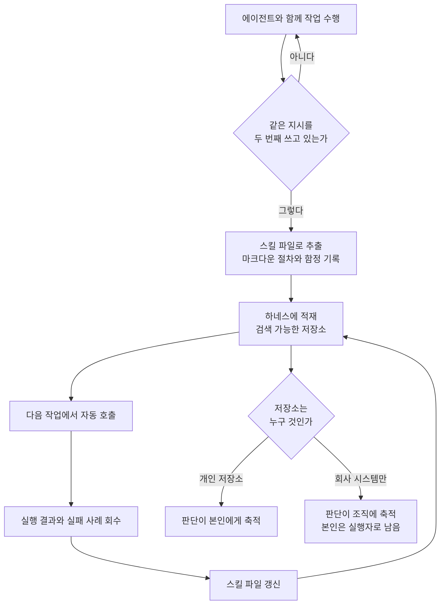

## 왜 읽어야 하나

에이전트를 실무에 붙였는데 매번 비슷한 지시를 다시 써넣고 있는 개발자, 그리고 팀의 에이전트 사용을 개인 요령이 아니라 조직 자산으로 만들 방법을 찾는 엔지니어링 리더를 위한 글입니다. 결론을 먼저 말씀드리면, 개리 탄이 Startup School 2026에서 던진 핵심은 모델 선택이 아니라 **모델 바깥의 구조**입니다. 같은 지시를 두 번 하고 있다면 그건 프롬프트를 다듬을 문제가 아니라 그 작업이 아직 파일로 저장되지 않았다는 신호이고, 그 파일들이 어디에 쌓이느냐가 몇 년 뒤 누가 그 판단을 소유하는지를 결정합니다.

*같은 작업을 반복할 때마다 파일로 내려앉아 축적되는 구조를 형상화했습니다. 감기지 못한 가닥은 가장자리에서 그대로 흩어집니다.*



*Startup School 2026 강연 전체 영상입니다. 러닝타임은 약 42분입니다.*

## 개요

Y Combinator 대표인 개리 탄은 2026년 8월 초 Startup School 2026 무대에서 42분 동안 퍼스널 AGI라는 표현을 꺼냈습니다. 그가 말하는 퍼스널 AGI는 새로운 모델 등급이 아닙니다. 자기 인프라 위에서 돌고, 시간이 지나면서 사용자에 대한 지식을 축적하며, 그 결과로 만들 수 있는 것의 범위를 넓혀주는 에이전트를 가리킵니다. 강연은 그가 매일 쓰는 도구와 워크플로를 공개하면서, 창업자라면 지능을 빌리지 말고 소유해야 한다는 주장으로 이어집니다.

이 이야기가 국내 개발자에게 특히 읽을 값이 있는 이유는, 우리 대부분이 이미 절반쯤 이 상태에 와 있는데 나머지 절반을 안 하고 있기 때문입니다. 코딩 에이전트를 쓰고 있고, 반복 작업의 지시문을 어딘가에 메모해두고 있으며, 잘 되는 프롬프트를 재사용합니다. 그런데 그것이 검색 가능한 저장소에 구조화되어 쌓이고 있는지, 그리고 그 저장소가 누구 것인지는 대체로 답이 없습니다. 강연은 정확히 그 빈칸을 겨냥합니다.

기사와 요약본에서 반복 인용되는 문장이 몇 개 있습니다. 모델은 엔진일 뿐이고 나머지 전부가 자동차라는 비유, 그리고 자신에게 어떻게 프롬프트를 쓰냐고 물으면 답은 안 쓴다는 것이고 스킬이 곧 프롬프트라는 말입니다. 저희 관점에서 가장 실무적인 문장은 따로 있습니다. 같은 것을 두 번 요청해야 했다면 그건 실패라는 문장입니다.

## 스킬이 곧 프롬프트라는 주장

이 주장을 문자 그대로 읽으면 오해하기 쉽습니다. 프롬프트 엔지니어링이 필요 없어졌다는 말로 들리는데, 실제 구조는 반대에 가깝습니다. 프롬프트가 사라진 것이 아니라 **위치가 옮겨간 것**입니다. 대화창에서 한 번 쓰고 버려지던 지시가 파일로 내려앉아 재사용되는 형태로 바뀌었을 뿐입니다.

작업 흐름은 이렇게 돌아갑니다. 어떤 일을 에이전트와 함께 해냅니다. 그 과정에서 무엇이 통했고 무엇이 함정이었는지가 드러납니다. 그러면 그 결과를 그대로 두지 않고 스킬 파일로 바꿔 하네스에 다시 적재합니다. 다음에 같은 종류의 일이 오면 대화를 처음부터 다시 시작하는 것이 아니라 그 파일이 불려옵니다. 강연에서 스킬화한다는 표현으로 부르는 것이 이 단계입니다.

여기서 중요한 것은 루프가 닫혀 있다는 점입니다. 스킬 파일은 한 번 쓰고 끝나는 문서가 아니라 실행 결과를 다시 받아 갱신되는 자산입니다. 그래서 시간이 갈수록 좋아지고, 이 축적이 강연에서 말하는 복리의 실체입니다. 모델을 더 좋은 것으로 갈아끼우는 것은 일회성 개선이지만 이 루프는 매주 조금씩 쌓입니다.

개리 탄 본인의 구성으로는 22만 페이지 규모의 지식 위키, 에이전트에게 절차를 지시하는 마크다운 스킬 파일들, 그리고 모델과 결정론적 코드를 잇는 하네스가 언급됩니다. 그가 오픈소스로 공개한 GStack은 Claude Code를 오피스아워, 디자인, 코드 리뷰, QA, 브라우저 테스트 같은 역할을 나눠 맡는 엔지니어링 팀처럼 굴리는 도구 모음으로 소개됩니다.

## 하네스라는 단어를 눈여겨볼 필요가 있습니다

세 요소 중 실무자가 가장 과소평가하는 것이 하네스입니다. 모델과 **결정론적 코드**를 잇는다는 표현이 여기서 핵심입니다.

에이전트를 오래 굴려본 팀이라면 익숙한 실패 패턴이 있습니다. 모델에게 형식과 판정까지 맡기면 매번 조금씩 다르게 나옵니다. 같은 지시에 어떤 날은 상태를 완료라고 쓰고 어떤 날은 처리됨이라고 씁니다. 품질 검사를 시키면 통과했다고 스스로 보고합니다. 이 흔들림은 모델이 약해서가 아니라 흔들릴 자유를 남겨뒀기 때문에 생깁니다. 하네스가 하는 일은 그 자유를 회수하는 것입니다. 숫자를 세는 것, 열거값을 정규화하는 것, 통과 여부를 판정하는 것, 최종 형식을 렌더링하는 것은 코드가 가져갑니다. 모델에게는 내용만 맡깁니다.

그래서 스킬 파일과 하네스는 짝입니다. 스킬 파일이 판단과 절차를 담고, 하네스가 그 절차의 경계와 검증을 담당합니다. 둘 중 하나만 있으면 무너집니다. 하네스 없이 스킬 파일만 쌓으면 좋은 지시문 모음일 뿐이고, 스킬 파일 없이 하네스만 있으면 아무것도 축적되지 않는 실행기가 됩니다.

## 스킬 파일이 실제로 굴러가려면

강연은 스킬화하라는 원칙까지 말하고 멈춥니다. 그런데 그 원칙을 따라 파일을 만들어보면 대부분은 몇 주 안에 아무도 안 여는 메모가 됩니다. 저희가 스킬을 운영하면서 살아남은 파일과 썩은 파일을 갈랐던 기준은 네 가지였습니다.

첫째, **끝났다는 판정이 파일 안에 있어야 합니다**. 절차만 적힌 파일은 에이전트가 어디까지 했는지를 스스로 선언하게 만들고, 그러면 대체로 다 했다고 보고합니다. 그 판정은 문장이 아니라 실행 가능한 검사여야 합니다. 어떤 명령이 0으로 끝나야 하는지, 어떤 파일이 생겨야 하는지, 어떤 값이 몇 이상이어야 하는지를 적어두면 그 순간 파일이 하네스와 맞물립니다.

둘째, **실패 사례가 절차보다 밀도가 높습니다**. 잘 되는 순서는 모델이 어느 정도 추론해냅니다. 반대로 그 도메인에서만 통하는 함정은 추론이 안 됩니다. 어떤 인자를 빼먹으면 조용히 잘못된 결과가 나오는지, 어떤 버전에서만 되는지, 겉보기에 성공인데 실은 실패인 상태가 무엇인지를 적은 줄이 파일의 값어치를 결정합니다. 저희 스킬 문서에 사고 날짜와 증상을 그대로 박아두는 이유가 이것입니다.

셋째, **언제 쓰지 말아야 하는지를 함께 적어야 합니다**. 저장소가 커지면 문제는 스킬이 없어서가 아니라 비슷한 것이 여러 개라서 생깁니다. 이 파일이 다루지 않는 경우와 그때 대신 볼 파일을 명시하지 않으면, 이름이 얼추 맞는다는 이유로 엉뚱한 절차가 불려옵니다. 경계를 적는 한 줄이 검색 품질을 올립니다.

넷째, **모든 줄이 비용을 냅니다**. 스킬은 인덱스에 올라간 순간부터 매 호출마다 후보로 등장합니다. 그래서 각 문장에 이 문장이 없으면 에이전트가 틀리는가를 물어보고, 아니면 지웁니다. 두 번 반복했다고 전부 파일로 만들면 저장소가 소음으로 차고, 그 소음은 정확히 이 방식이 주려던 이득을 갉아먹습니다.

정리하면 스킬 파일은 잘 쓴 지시문이 아니라 **검증 조건과 실패 지식이 붙은 절차**입니다. 그 형태가 되어야 하네스가 그것을 실행하고 결과를 되먹일 수 있습니다.

## 스피노자를 꺼낸 이유

강연의 뼈대는 기술이 아니라 17세기 철학자 바뤼흐 스피노자입니다. 이단으로 파문당하고, 침묵을 조건으로 급여를 제안받았으며, 낮에는 렌즈를 갈고 밤에는 위험한 책을 썼던 사람입니다. 강연은 그가 자기 도구를 소유했기 때문에 그 위치를 버틸 수 있었다고 읽고, 그것이 2026년 지식 노동자가 놓인 구조와 정확히 같다고 주장합니다.

이 비유에 이어지는 역사적 대비가 더 직설적입니다. 장인은 자기 도구를 소유했고 그것이 자유의 근거였습니다. 공장이 그 관계를 끊었습니다. 직조기는 공장 소유였습니다. 지식 노동자는 자기 도구가 머릿속에 있으니 누구도 압수할 수 없다고 믿어왔는데, 인지가 스킬 파일로 외부화되는 순간 그 전제가 사라집니다. 강연이 남긴 경고 문장은 이것입니다. 스킬을 소유하지 않으면 당신의 직무 자체가 스킬 파일이 됩니다.

실무적으로 번역하면 이렇습니다. 모델 품질은 빌리는 것이고 그것으로 차별화되지 않습니다. 어차피 모두가 비슷한 모델을 씁니다. 반면 자신의 판단을 담은 저장소는 소유할 수 있고, 그것을 쌓아둔 쪽과 안 쌓아둔 쪽의 격차는 계속 벌어집니다. 강연이 다음 세대 스타트업의 팀 규모가 더 작아질 것이라고 본 근거도 여기에 있습니다.

다만 이 주장에는 조직 입장에서 껄끄러운 면이 있습니다. 아래에서 다시 다루겠습니다.

## 다키클라우드 제품 적용 시사점

저희에게 이 강연은 남의 이야기가 아닙니다. **Paxis**는 정확히 이 구조를 엔터프라이즈 제품으로 세운 것이기 때문입니다.

Paxis의 Skill Harness는 요청이 들어오면 스킬 저장소를 검색해 맞는 스킬을 고르고, 격리된 샌드박스에서 실행합니다. 강연이 말한 개인용 하네스를 조직 단위로 옮기면 반드시 따라붙는 요건들이 있습니다. 누가 어떤 스킬을 실행할 수 있는지, 그 실행이 무엇을 건드렸는지, 위험한 단계에서 사람 승인을 어디에 걸지가 그것입니다. Paxis는 이 층을 정책 게이트와 감사 로그로 처리하고, 신원과 권한은 **Signum**이 받칩니다. 개인 저장소에서는 생략해도 되는 부분이 조직에서는 도입의 전제 조건이 됩니다.

지식 축적 쪽도 대응됩니다. 22만 페이지 위키라는 규모는 검색 없이는 다룰 수 없습니다. Paxis의 지식 엔진이 맡는 역할이 그것이고, 스킬이 늘어날수록 진짜 병목이 스킬 작성이 아니라 **스킬 선택**으로 옮겨간다는 점은 저희도 같은 결론에 도달한 부분입니다. 스킬이 수백 개를 넘어가면 이름이 비슷한 것들 사이에서 엉뚱한 것이 불려옵니다. 그래서 검색과 라우팅이 하네스의 일급 구성요소가 됩니다.

그다음 층은 **Maxis**입니다. 스킬 실행 기록은 그 자체로 학습 데이터입니다. 어떤 절차가 어떤 입력에서 통과했고 어디서 실패했는지가 쌓이면, 그 궤적으로 더 작은 모델을 특화시켜 같은 업무를 더 싸게 처리하는 경로가 열립니다. 강연이 말한 복리를 조직 규모에서 실현하는 지점이 여기입니다. 실행이 학습을 만들고 학습이 실행 단가를 낮춥니다. 그 단가는 다시 **Metis**의 서빙 계층에서 회수됩니다.

그리고 소유권 문제는 인프라 선택으로도 이어집니다. 강연의 논지가 자기 인프라 위에서 돌리라는 것이라면, 기업 단위에서 그 요구에 대응하는 것이 **Aegis**의 온프레미스 배포입니다. 스킬 저장소와 실행 기록은 그 조직의 판단이 가장 농축된 형태로 쌓인 자산이므로, 그것을 어디에 둘지는 편의 문제가 아니라 주권 문제입니다.

한 줄로 줄이면 이렇습니다. 강연이 개인에게 권한 것을 조직 단위로 옮기면 승인과 감사와 격리가 따라붙고, 그 전체를 한 벌로 세운 것이 Paxis입니다.

## 한계 및 반론

이 주장을 그대로 받아들이기 전에 몇 가지는 눌러볼 필요가 있습니다.

먼저 이해관계입니다. YC 대표가 소수 인원으로 큰 것을 만들 수 있다고 말하는 것은 그가 투자하는 회사의 형태와 정확히 일치합니다. 작은 팀이 더 나아졌다는 주장은 관찰일 수도 있지만 포지션이기도 합니다. 강연에서 제시되는 근거는 대체로 본인의 워크플로 시연이며, 통제된 비교나 팀 단위 생산성 측정은 아닙니다.

둘째로 스킬 파일이 만능이라는 인상을 경계해야 합니다. 스킬이 늘어나면 각각이 상시 비용을 만듭니다. 이름과 설명이 인덱스에 올라가는 순간 매 호출마다 선택 후보로 등장하고, 애매하게 관련된 스킬이 잘못 불려오면 안 쓰느니만 못한 결과가 나옵니다. 저희 경험으로도 스킬을 더 만드는 것보다 **안 쓰는 스킬을 지우는 것**이 품질에 더 크게 기여한 적이 여러 번 있었습니다. 두 번 반복하면 무조건 스킬화하라는 규칙은 그래서 조건부로 읽는 편이 맞습니다. 반복되면서 동시에 판단이 들어가는 작업이 후보이고, 단순 명령 한 줄은 그냥 두는 편이 낫습니다.

셋째로 개인 소유와 조직 자산 사이의 긴장이 남습니다. 강연은 스킬을 개인 저장소에 두라고 권하는데, 회사 입장에서는 업무 중 만들어진 절차 지식이 개인 계정으로 빠져나가는 상황이 됩니다. 저작권과 영업비밀 관점에서 정리되지 않은 영역이고, 강연은 이 부분을 개인 편에서만 다룹니다. 실무에서는 회사 저장소와 개인 저장소의 경계, 그리고 퇴사 시 처리를 미리 합의해두는 편이 양쪽 모두에게 안전합니다.

마지막으로 저희는 이 강연 영상과 공개된 요약, 보도를 확인해 정리했으며 별도의 재현 실험은 하지 않았습니다. 인용한 문장들은 여러 매체에 공통으로 등장하는 것을 골랐지만, 정확한 표현은 원본 영상에서 확인하시기 바랍니다.

## 정리

개리 탄의 강연은 새로운 모델이나 도구 발표가 아니라 작업 방식에 대한 제안입니다. 대화창에 지시를 쓰는 대신 절차를 파일로 내려두고, 그 파일을 결정론적 코드가 지키는 하네스에 얹어 실행하고, 실행 결과를 다시 파일에 되먹이라는 것입니다. 모델은 빌리는 것이고 이 저장소는 소유하는 것이라는 구분이 이 제안의 중심입니다.

그래서 오늘 하실 일은 새 도구를 설치하는 것이 아닙니다. 지난 2주 동안 에이전트에게 **두 번 이상 같은 취지로 시킨 일**을 하나만 떠올려서 그 절차를 마크다운 한 장으로 옮겨보시기 바랍니다. 무엇을 확인해야 하는지, 어디서 틀리기 쉬운지, 끝났다는 판정을 무엇으로 하는지까지 적으면 그게 첫 번째 스킬 파일입니다. 그 파일이 한 장에서 열 장이 되는 동안 축적되는 것은 프롬프트가 아니라 판단입니다.

## 관련 슬라이드

본문 내용을 NotebookLM(`architectural_portfolio` 스타일)으로 요약한 슬라이드입니다.

## 출처

- [Garry Tan: Own Your Intelligence (YC Startup Library)](https://www.ycombinator.com/library/WX-garry-tan-own-your-intelligence)
- [Garry Tan: Personal AGI Is How You Stay Under Your Own Power (강연 영상)](https://www.youtube.com/watch?v=eRrc1pUY5oU)
- [Garry Tan: Personal AGI Is How You Stay Under Your Own Power (YC Root Access, 전문)](https://www.ycrootaccess.com/p/garry-tan-own-your-intelligence)
- [Garry Tan on Personal AGI and Spinoza (StartupHub.ai)](https://www.startuphub.ai/ai-news/artificial-intelligence/2026/garry-tan-on-personal-agi-and-spinoza)
- [Start A Business? There's An AI Agent For That! Y Combinator Head Explains How (Forbes)](https://www.forbes.com/sites/joemckendrick/2026/08/09/go-all-ai-y-combinator-head-urges/)
- [Inside Garry Tan's AI Coding Setup (YC Startup Library)](https://www.ycombinator.com/library/OW-inside-garry-tan-s-ai-coding-setup)
- 원 게시물: [@alex_prompter via @hjguyhan](https://x.com/hjguyhan/status/2086419638821495238)
