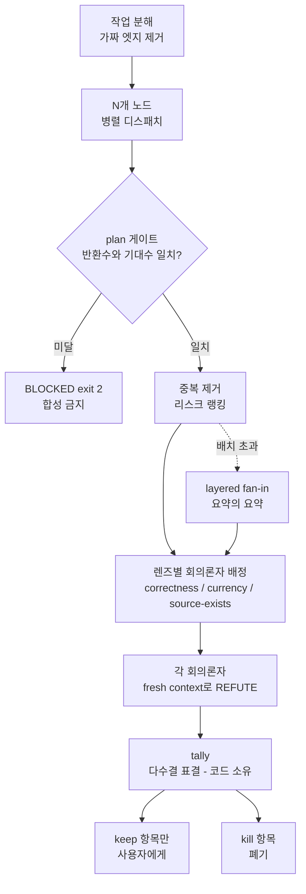

*팬아웃은 쉽고, 다시 하나로 모으는 관문이 어렵습니다.*

## 왜 읽어야 하나

여러 서브에이전트를 동시에 띄워 리뷰나 리서치를 돌리는 엔지니어, 그리고 그 결과를 믿고 다음 결정을 내려야 하는 팀 리드를 위한 글입니다. 결론부터 말씀드리면, 멀티에이전트 그래프에서 품질을 결정하는 것은 노드를 몇 개 띄웠는지가 아니라 그 결과를 합치기 전에 검증 관문을 통과시켰는지입니다. 저희 세션 로그를 실제로 계측해보니 팬아웃 180건 중 검증으로 닫힌 것은 9건, 폐쇄율 5%였습니다. 나머지 95%는 검증 없이 합쳐져 사람 앞에 놓였습니다.

그리고 하나 더 있습니다. 팬아웃이 비싸다는 통념은 저희 데이터에서 성립하지 않았습니다. 비용은 오히려 위임하지 않고 메인 스레드에서 오래 끄는 쪽에 붙습니다.


## 개요

2026년 7월, X 타임라인에 Graph Engineering이라는 말이 돌기 시작했습니다. 프롬프트 엔지니어링, 컨텍스트 엔지니어링, 하네스 엔지니어링, 루프 엔지니어링에 이어 나온 다섯 번째 이름입니다. 일본어권에서는 마사히로 차엔이 이를 두고 Claude Code나 UltraCode에서 하는 Dynamic Workflow와 같은 발상이라고 설명했고, 그 트윗이 저희 큐에 들어오면서 이 글이 시작됐습니다.

용어에 대한 반응은 갈렸습니다. LangChain을 만든 해리슨 체이스는 X에서 이렇게 답했습니다. "그래프 엔지니어링이 뭔지 사실 몰랐고, 지금도 잘 모르겠는데, 그냥 LangGraph 아닌가요?" 몇 년째 그래프 오케스트레이션을 팔아온 회사 창업자로서는 나올 만한 반응입니다. 실제로 LangGraph는 2026년에 이미 3년차 제품이고, Send 프리미티브로 런타임에 노드가 하위 노드로 작업을 동적으로 라우팅하는 기능도 오래전부터 있었습니다.

그래서 이 글의 관심사는 용어의 새로움 여부가 아닙니다. 저희는 이미 이 패턴을 프로덕션에서 쓰고 있고, 그 실행 기록이 남아 있습니다. 그 기록을 열어서 그래프가 실제로 무엇을 사줬고 무엇을 사주지 못했는지를 보려고 합니다. 유행어에 대한 논평보다는 계측값이 쓸모 있다고 봅니다.

## 이 기술은 무엇인가

Graph Engineering은 AI 애플리케이션을 하나의 자율 에이전트가 아니라 명시적으로 설계된 워크플로로 다루자는 접근입니다. 에이전트와 도구, 결정론적 함수, 검증기, 데이터 소스, 사람이 어떻게 협력해 작업을 끝내는지를 노드와 엣지로 정의합니다. 노드는 각자의 일을 맡고, 엣지는 의존 관계를 관리합니다. 이렇게 하면 병렬 실행과 검증, 세션 간 연속성이 구조적으로 표현됩니다.

여기서 자주 놓치는 부분이 엣지입니다. 팬아웃을 설계할 때 각 단계마다 이 작업이 정말 앞 작업의 결과를 쓰는지 물어봐야 합니다. 쓰지 않는다면 그건 의존이 아니라 그냥 제가 코드를 쓴 순서일 뿐입니다. 저희는 이걸 가짜 엣지 테스트라고 부릅니다. 가짜 엣지를 지우면 같은 일이 병렬로 끝납니다.

반대로 프롬프트가 서로를 전혀 언급하지 않아도 같은 파일이나 같은 레이트 리밋 API를 건드린다면 그건 숨은 엣지입니다. 이 경우는 순서를 지키거나 워크트리로 격리해야 합니다. 독립처럼 보이는 노드가 실제로는 독립이 아닐 때 그래프는 조용히 깨집니다.

그리고 팬아웃에는 세 가지 고질적인 실패 방식이 있습니다. 첫째는 컨텍스트 붕괴입니다. N개 노드의 원출력을 합성 한 스텝에 몰아넣으면 윈도우를 넘깁니다. 둘째는 거짓 독립입니다. 위에서 말한 숨은 엣지 문제입니다. 셋째가 가장 고약한데, 조용한 노드 사망입니다. 200개 중 하나가 죽었는데 보고서는 완전해 보입니다. 죽은 노드는 빈칸을 남기지 않고 그냥 없던 일이 되기 때문입니다.



핵심은 마지막 두 단계입니다. 판정을 모델 산문에 맡기지 않고 결정론적 코드가 표를 세는 구조입니다. 모델이 "검증해봤는데 괜찮아 보입니다"라고 말하는 것은 검증이 아닙니다. 그건 자기 보고입니다.


## 설치 및 통합

저희 폐쇄 드라이버는 외부 패키지가 아니라 저장소 안의 스크립트입니다. 별도 설치가 필요 없고, 공유 인터프리터로 바로 돕니다.

```bash
.venv/bin/python .claude/skills/jarvis/runtime/graph_close.py --help
# usage: graph_close.py [-h] {plan,tally,stats} ...
#   plan   dead-node guard + dedupe + layered fan-in + skeptic plan
#   tally  vote on skeptic verdicts (delegates to verify_fanout)
#   stats  closure rate across recorded sessions
```

사용법은 두 명령입니다. 먼저 노드 결과를 모아 `plan`에 넘겨 검증 계획을 받고, 그 계획대로 회의론자를 띄운 다음 판정을 `tally`에 넘깁니다.

```bash
# 1) 디스패치한 노드 수를 --expected로 알려줍니다
.venv/bin/python .claude/skills/jarvis/runtime/graph_close.py plan \
  --results nodes.json --expected 4 --max-skeptics 3

# 2) 회수한 판정을 표결에 넘깁니다
.venv/bin/python .claude/skills/jarvis/runtime/graph_close.py tally \
  --verdicts verdicts.json
```

노드 결과 JSON의 계약은 이렇습니다. 각 항목에 `claim` 또는 `text`가 있어야 하고, `source`와 `risk`, `node`는 선택입니다.

```json
[
  {"node": "correctness", "claim": "...", "risk": "high", "source": "https://..."},
  {"node": "security",    "claim": "...", "risk": "high", "source": "internal://..."}
]
```

여기서 처음 걸린 함정을 그대로 적어둡니다. 저희는 처음에 키 이름을 `finding`으로 썼습니다. 스크립트는 오류를 내지 않았습니다. 대신 항목 4개를 전부 빈 노드로 읽고 `"returned": 0, "lost_nodes": 4`를 반환했습니다. 스키마가 안 맞으면 파싱 에러가 아니라 노드 사망으로 보인다는 뜻입니다. 게이트가 제 역할을 한 셈이지만, 원인을 오해하기 딱 좋은 형태였습니다.

## 실제 실험 결과

이 저장소의 실제 세션 로그와 실행 결과입니다. 모든 수치는 아래 명령의 출력에서 그대로 가져왔고, 원본 로그는 `outputs/blog-impl/graph-engineering-closing-fanout/run-1.log`에 남겼습니다.

### 폐쇄율은 5%였습니다

```bash
$ .venv/bin/python .claude/skills/jarvis/runtime/graph_close.py stats
{"status": "ok", "stage": "stats", "sessions_with_agents": 2,
 "agent_dispatches": 80, "fanout_events": 9, "closed": 0, "closure_rate_pct": 0.0,
 "baseline_2026_08_09": {"fanout_events": 180, "closed": 9, "closure_rate_pct": 5.0}}
```

2026년 8월 9일 기준 누적 베이스라인이 팬아웃 180건, 검증 폐쇄 9건입니다. 5%입니다. 규칙 문서에는 검증 스테이지가 처음부터 있었습니다. 그런데 실행되지 않았습니다. 원인은 능력이 아니라 마찰이었습니다. 손으로 JSON을 만들어 다섯 단계를 거쳐야 했고, 훅이 서브에이전트 호출 자체를 관측하지 못하고 있었습니다. 지금은 팬아웃이 원장에 기록되고 그 자리에서 폐쇄 명령이 제안됩니다.

### 죽은 노드는 합성을 막아야 합니다

4개를 띄우고 3개만 돌아온 상황을 만들어 게이트를 태웠습니다.

```json
{"status": "blocked", "expected_nodes": 4, "returned": 3, "lost_nodes": 1,
 "findings": 3, "skeptics_to_dispatch": 9,
 "note": "BLOCKED: 1 node(s) returned nothing. Re-run them or pass --allow-partial;
          never synthesize on a partial set and call the report complete."}
```

종료 코드는 2입니다. 부분 집합 위에서 보고서를 쓰고 완전하다고 부르지 말라는 뜻이고, 진행하려면 `--allow-partial`을 명시해야 합니다. 이 게이트가 없으면 200개 중 하나가 죽어도 보고서는 매끈하게 나옵니다. 그게 가장 위험한 출력입니다.

### 비용 모델이 통념과 반대였습니다

같은 출력의 비용 블록이 흥미롭습니다.

```json
"cost": {"skeptic_turns": 9,
         "est_usd_if_delegated": 0.18,
         "est_usd_if_done_inline": 1.41,
         "main_thread_turns_collapsed_to": 2,
         "basis": "measured 2026-08-09: $/main-turn 0.157 @220k ctx, corr(cost,turns)=0.991"}
```

회의론자 9턴을 위임하면 0.18달러, 같은 일을 메인 스레드에서 하면 1.41달러입니다. 약 7.8배 차이입니다. 근거가 되는 계측값은 비용과 메인스레드 턴수의 상관계수가 0.991, 비용과 팬아웃 폭의 상관계수가 0.412라는 것입니다. 턴당 비용은 팬아웃 유무와 무관하게 0.14에서 0.18달러 사이로 평평했습니다.

지출 구성을 보면 이유가 분명합니다. 캐시 읽기가 57%, 출력이 9%입니다. 비싼 이유는 많이 생성해서가 아니라 뚱뚱한 컨텍스트를 매 턴 다시 보내기 때문입니다. 그래서 위임은 비용 유발자가 아니라 비용 절감 수단입니다. 워커가 자기 컨텍스트에서 40턴을 돌고 요약 하나를 반환하면 메인스레드의 40턴이 1턴이 됩니다.

다만 조건이 붙습니다. 워커 산출물은 반드시 크기가 제한된 JSON으로 회수해야 합니다. 한 번 메인 컨텍스트에 들어온 텍스트는 이후 모든 턴에 다시 과금됩니다. 그래서 디스패치 프롬프트에도 이 문장이 들어가 있습니다. "리서치 노트나 인용, 추론 흔적을 반환하지 마십시오. 그것들은 메인 스레드에 남아 이후 모든 턴에 과금됩니다."

### 중복 제거와 예산 캡

4개 노드 중 두 개가 같은 주장을 반환하도록 만들고 회의론자 예산을 3으로 잡았습니다.

```json
{"status": "ok", "expected_nodes": 4, "returned": 4, "lost_nodes": 0,
 "deduped_away": 1, "findings": 3, "skeptics_to_dispatch": 3,
 "cost": {"est_usd_if_delegated": 0.06, "est_usd_if_done_inline": 0.47},
 "skipped_by_budget": [{"id": "f0", "claim": "vLLM 배치 스케줄러가 ..."},
                       {"id": "f1", "claim": "테넌트 토큰이 ..."}]}
```

중복 1건이 자동으로 병합됐고, 예산에 걸려 떨어진 항목은 `skipped_by_budget`에 이름이 남았습니다. 이 부분이 중요합니다. 캡을 조용히 거는 것은 커버리지를 줄여놓고 전부 봤다고 보고하는 것과 같습니다. 떨어뜨렸으면 떨어뜨렸다고 출력에 남겨야 합니다.

렌즈별 모델 배정도 코드가 소유합니다. `correctness`는 sonnet, `currency`와 `source-exists`는 haiku로 자동 배정됩니다. 지루한 확인 작업에 비싼 모델을 쓸 이유가 없습니다.

### 표결은 코드가 셉니다

각 발견에 3표씩 넣고 표결을 돌렸습니다.

```json
{"mode": "majority", "total": 3, "kept": 2, "killed": 1, "unverified": 0,
 "findings": [
   {"id": "f1", "refuted": 0, "cast": 3, "decision": "keep"},
   {"id": "f2", "refuted": 1, "cast": 3, "decision": "keep"},
   {"id": "f0", "refuted": 2, "cast": 3, "decision": "kill"}],
 "closure_receipt": "outputs/state/graph-fanout/closures.jsonl"}
```

3표 중 2표가 반박한 f0은 kill로 떨어졌습니다. 여기서 설계상 눈여겨볼 지점은 `unverified` 항목입니다. 회의론자가 크래시나 타임아웃으로 한 표도 못 던진 경우인데, 이건 안전한 통과가 아니라 미검증으로 분류되고 종료 코드 2를 냅니다. 표가 안 걸린 것을 통과로 읽으면 검증기가 죽은 채로 파이프라인이 계속 돕니다.

폐쇄 영수증이 파일로 남는 것도 의도된 설계입니다. 무엇을 언제 검증했고 무엇을 버렸는지가 감사 가능한 흔적으로 남습니다.


## ThakiCloud 제품 적용 시사점

이 실험은 저희 Paxis 팀이 매일 쓰는 코드로 돌렸습니다. 그래서 시사점도 가설이 아니라 운영 경험입니다.

**Paxis** 관점에서 보면, Enterprise Agent Platform의 DAG 멀티에이전트 실행은 팬아웃 자체가 아니라 팬아웃을 닫는 계약으로 신뢰를 만듭니다. 스킬을 검색해 격리 샌드박스에서 실행하는 것까지는 폭의 문제이고, 그 결과를 사람이나 다음 워크플로에 넘기기 전에 검증 관문을 통과시키는 것이 신뢰의 문제입니다. 기업 업무 자동화에서 후자가 빠지면 자동화는 오답을 빠르게 생산하는 장치가 됩니다. 저희가 폐쇄율 5%라는 부끄러운 숫자를 계측해 공개하는 이유도 여기 있습니다. 관측되지 않는 규칙은 지켜지지 않습니다.

**Signum** 관점에서는 `closures.jsonl` 같은 폐쇄 영수증이 감사 로그의 원형입니다. 에이전트가 무엇을 주장했고 어떤 검증을 거쳐 무엇이 채택됐는지가 남아야 규제 산업에서 에이전트 자동화를 승인받을 수 있습니다. 정책 게이트와 감사 로그는 사후 보고서가 아니라 실행 경로 안에 있어야 합니다.

**Metis** 관점에서는 렌즈별 모델 라우팅이 바로 토큰 경제성입니다. 검증 노드 대부분은 사실 확인과 링크 확인이라 작은 모델로 충분하고, 판단이 필요한 노드만 상위 티어로 올리면 됩니다. Dedicated Endpoint와 Serverless를 섞어 쓰면 이 라우팅이 인프라 층에서 자동으로 흡수됩니다. 위 실험에서 3턴 위임이 0.06달러였던 것과 인라인 처리가 0.47달러였던 차이가 그대로 업무 한 건당 비용으로 내려옵니다.

세 층은 따로 놀지 않습니다. Paxis가 업무를 실행하고, Metis가 그 실행의 토큰 경제성을 정하고, Signum이 남은 흔적을 감사 가능하게 만듭니다. One Paxis. Many Workflows. Any Cloud.

## 한계 및 반론

가장 강한 반론은 해리슨 체이스의 것입니다. 이건 새로운 게 아니라 LangGraph입니다. 저희도 대체로 동의합니다. 그래프 오케스트레이션은 몇 년 된 개념이고, 이름을 새로 붙였다고 능력이 생기지 않습니다. 이 글의 주장은 그래프가 새롭다는 게 아니라, 그래프를 쓰면서 검증을 안 닫는 관행이 널리 퍼져 있고 그 격차가 실제로 계측된다는 것입니다.

두 번째 한계는 저희 데이터의 범위입니다. 폐쇄율 5%는 저희 저장소의 세션 로그이고, 한 사람이 운영하는 환경입니다. 팀 규모나 워크로드가 다르면 숫자도 다를 것입니다. 비용 상관계수도 마찬가지로 저희 컨텍스트 크기와 모델 조합에 묶여 있습니다. 상주 컨텍스트가 220k 근처인 세션 기준이라 훨씬 가벼운 세션에서는 위임의 이득이 줄어듭니다.

세 번째가 가장 근본적입니다. 그래프는 폭을 사지 판단력을 사지 않습니다. 검증자가 또 다른 보고서를 읽는 그래프는 내부적으로 일관되지만 아무것도 검증하지 않습니다. 반박 불가능한 앵커에 묶여야 합니다. 실제로 통과한 테스트, 실제로 열리는 URL, 실제로 재현된 수치 같은 것들입니다. 앵커가 없으면 다수결은 자신 있게 틀립니다.

마지막으로, 작업이 넓지 않으면 그래프는 과잉입니다. 단발 수정이나 단일 버그, 무엇을 찾는지 아직 모르는 탐색적 작업, 진짜로 순차 의존인 작업은 단일 에이전트나 루프가 더 싸고 빠릅니다. 가짜 엣지 테스트에서 병렬 가능한 쌍을 못 찾으면 그건 애초에 그래프 문제가 아니었던 겁니다.


## 정리

Graph Engineering이라는 이름이 새로운지는 중요하지 않습니다. 저희가 계측해서 확인한 것은 세 가지입니다.

첫째, 팬아웃은 쉽고 폐쇄는 어렵습니다. 180건 중 9건만 닫혔습니다. 규칙이 있어도 마찰이 크고 관측되지 않으면 지켜지지 않습니다.

둘째, 비용은 팬아웃 폭이 아니라 메인스레드 턴수에 붙습니다. 상관계수 0.991 대 0.412입니다. 위임을 아끼는 것은 절약이 아니라 낭비입니다. 단, 워커 산출물을 크기 제한된 JSON으로 받을 때만 그렇습니다.

셋째, 판정은 코드가 소유해야 합니다. 죽은 노드 가드, 중복 제거, 예산 캡 노출, 다수결 표결은 전부 토큰을 쓰지 않는 결정론적 작업입니다. 모델에게 "검증했습니다"를 물어보는 순간 그건 검증이 아니라 자기 보고가 됩니다.

오늘 팬아웃을 쓰고 계시다면 한 가지만 먼저 해보시길 권합니다. 다음 병렬 디스패치에서 `--expected N`을 넘겨보는 것입니다. 조용히 죽은 노드가 있었는지 그 한 줄이 알려줍니다. 저희는 그 한 줄에서 시작했습니다.


## 출처

- [Graph Engineering Explained: What Actually Changed](https://www.louisbouchard.ai/graph-engineering-explained/) (Louis Bouchard)
- [Is Graph Engineering Here? LangChain Says It's Nothing New](https://ai-engineering-trend.medium.com/is-graph-engineering-here-langchain-says-its-nothing-new-17a35a2bad37)
- [3 Years of Graph Engineering with LangGraph](https://www.langchain.com/blog/3-years-of-graph-engineering-with-langgraph) (LangChain)
- [Graph Engineering for AI Agents: A Complete Guide in LangGraph](https://www.analyticsvidhya.com/blog/2026/07/graph-engineering/) (Analytics Vidhya)
- 원 트윗: [@masahirochaen](https://x.com/hjguyhan/status/2086426503936700493) (2026-08-09)
- 실행 로그: `outputs/blog-impl/graph-engineering-closing-fanout/run-1.log`
