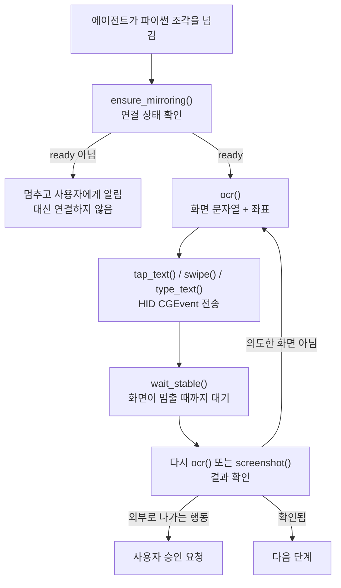

## 왜 읽어야 하나

에이전트에게 실제 기기나 사내 시스템처럼 되돌리기 어려운 대상을 맡길지 고민 중인 플랫폼 엔지니어와 보안 담당자를 위한 글입니다. 결론부터 말씀드리면, 기술 장벽은 이미 낮아졌고 남은 것은 전부 승인 설계입니다. 8월 7일에 공개돼 사흘 만에 별 850개를 받은 phone-harness는 아이폰 제어에 필요한 코드가 792줄뿐이었고, 저희가 클론해서 설치하고 점검을 돌리기까지 걸린 시간은 몇 분이었습니다. 그런데 이 도구가 문서와 스킬 정의에서 가장 많은 분량을 쓰는 대목은 조작 방법이 아니라 무엇을 하지 말고 언제 멈춰서 사람에게 물으라는 규칙이었습니다. 저희가 `--doctor`를 돌렸을 때 실패한 4개 항목도 전부 사람만 풀 수 있는 것들이었습니다. 이 도구는 그 사실을 우회하지 않고 설계로 받아들였다는 점에서 볼 만합니다.


*에이전트와 기기 사이에 무엇이 서 있어야 하는지가 이 도구의 실제 주제입니다.*

## 개요

에이전트에게 브라우저를 쥐여주는 일은 이제 흔합니다. DOM이 있으니 요소를 찾고 클릭하는 것이 어렵지 않고, 실패하면 셀렉터를 고치면 됩니다. 반면 물리적인 휴대폰은 오랫동안 다른 문제였습니다. iOS 자동화는 보통 Xcode와 WebDriverAgent, 개발자 프로비저닝, 때로는 탈옥까지 요구했습니다. 접근 자체가 프로젝트였습니다.

[phone-harness](https://github.com/ShawnPana/phone-harness)는 그 스택을 통째로 건너뜁니다. macOS의 아이폰 미러링 창 하나를 전송 계층으로 쓰기 때문입니다. 미러링 창은 휴대폰 화면을 맥 창으로 그려주고 마우스와 키보드 입력을 터치로 전달합니다. 그러면 화면을 캡처해 애플 Vision 프레임워크로 OCR하는 것이 눈이 되고, HID 수준에서 CGEvent를 쏘는 것이 손이 됩니다. 저장소 설명은 이것을 "가난한 자의 DOM"이라고 부릅니다.

저장소는 8월 7일에 만들어졌고 사흘 만에 별 850개와 포크 65개를 모았습니다. MIT 라이선스이고 언어는 파이썬 하나입니다. 저희가 이 글을 쓰는 이유는 아이폰 자동화 자체가 아닙니다. 에이전트가 되돌리기 어려운 실제 대상을 만질 때 하네스가 무엇을 책임져야 하는지를, 이 프로젝트가 유난히 솔직하게 코드와 문서에 적어두었기 때문입니다.

## 이 도구는 무엇인가

구조는 단순합니다. 저장소 전체 파이썬 코드가 792줄이고, 그중 절반 가까운 346줄이 에이전트가 실제로 부르는 헬퍼 모듈입니다.

```text
src/phone_harness/helpers.py   346줄   에이전트가 부르는 함수 22개
src/phone_harness/mirror.py    259줄   미러링 창 제어와 CGEvent 전송
src/phone_harness/admin.py      70줄   설치 점검(doctor)과 스킬 출력
src/phone_harness/ocr.py        56줄   Vision 프레임워크 OCR
src/phone_harness/run.py        40줄   CLI 진입점
```

에이전트는 이 함수들을 heredoc으로 넘긴 파이썬 조각 안에서 씁니다. 프레임워크가 아니라 그냥 스크립트 실행기입니다.

```bash
phone-harness <<'PY'
print(screen_info())
PY
```

헬퍼 22개의 구성을 보면 이 도구가 무엇을 중요하게 여기는지가 그대로 드러납니다. 화면을 읽는 쪽에 `screenshot`, `ocr`, `find_text`, `screen_info`가 있고, 조작하는 쪽에 `tap_text`, `swipe`, `scroll`, `type_text`, `home`, `app_switcher`, `open_app`, `long_press`가 있습니다. 그런데 나머지 상당수가 읽기도 조작도 아닌 함수입니다. `connection_state`와 `ensure_mirroring`은 시작하기 전에 멈출지를 정하고, `wait`와 `wait_stable`은 화면이 안정될 때까지 기다리며, `scroll_until`과 `scroll_collect`는 언제 그만둘지를 판단합니다. 조작 함수보다 상태를 확인하고 종료 조건을 정하는 함수에 더 많은 설계가 들어가 있습니다.


*346줄짜리 헬퍼 모듈의 상당 부분이 행동이 아니라 언제 멈출 것인가를 묻습니다.*

`ocr()`의 반환 형태도 이 방향을 따릅니다. 화면에 보이는 문자열마다 신뢰도와 중심 좌표, 바운딩 박스가 함께 나옵니다. 에이전트가 스크린샷 이미지를 눈으로 훑어 좌표를 짐작하는 대신, 파이썬에서 걸러 정확한 지점을 고르라는 뜻입니다. 스킬 문서도 스크린샷을 보는 것보다 `ocr()`을 먼저 쓰라고 명시합니다. 이미지 판독을 모델에게 맡기는 순간 재현성이 떨어지기 때문입니다. `tap_text()`는 실패할 때 지금 화면에 무엇이 보이는지를 예외 메시지에 담아 던지므로, 재시도 전에 상태를 다시 확인할 근거가 생깁니다.



이 루프에서 중요한 것은 마지막의 확인 단계입니다. DOM이 없으므로 검증할 대상이 없고, 그래서 캡처 자체가 유일한 진실입니다. 스킬 문서는 모든 행동 뒤에 `wait_stable()`을 부르고 다시 OCR하라고 못박습니다. 행동했으니 됐다고 가정하지 말고 눈으로 확인하라는 규칙인데, 저희가 에이전트 루프를 설계할 때 늘 강조하는 원칙과 정확히 같습니다. 실행기가 성공을 자기 보고하게 두면 안 되고, 관측된 결과가 종료 조건이어야 합니다.

목록을 훑는 처리도 같은 철학으로 짜여 있습니다. `scroll_collect()`는 스크롤을 멈출지 말지를 파서가 새 항목을 찾았는지가 아니라 **화면이 실제로 움직였는지**로 판단합니다. 파서가 한 줄을 놓치거나 화면이 빽빽해서 새 항목이 안 잡혀도 스크롤이 조기에 끝나지 않게 하려는 설계입니다. 반환값에 `stop`이 `reached-end`인지 `max-scrolls`인지가 명시돼 있어서, 끝까지 간 것인지 한도에 걸린 것인지를 호출한 쪽이 구분할 수 있습니다. 조용한 절단을 만들지 않겠다는 뜻입니다.

문서에서 가장 눈에 띄는 부분은 기능이 아니라 금지입니다. 스킬 정의는 "쓰지 말아야 할 때"를 별도 절로 먼저 배치합니다. 웹이나 맥에서 되는 일이면 거기서 하고 휴대폰은 건드리지 말라는 규칙입니다. 그다음 "동의" 절에서 메시지 전송, 게시, 구매, 삭제, 설정 변경처럼 외부로 나가거나 되돌리기 어려운 행동 앞에서는 멈추고 물으라고 적습니다. 사용자의 개인 영역인 메시지와 사진과 메일에는 작업에 필요한 만큼만 머무르라는 문장까지 들어 있습니다.

그리고 연결 자체를 에이전트의 일이 아니라고 선을 긋습니다. 휴대폰이 연결돼 있지 않으면 `ensure_mirroring()`이 명확한 오류를 내고 멈춥니다. 문서는 여기서 에이전트가 절대 하지 말아야 할 두 가지를 지정합니다. 연결 버튼을 대신 누르지 말 것, 그리고 연결될 때까지 폴링하지 말 것입니다. 사용자가 직접 연결했다고 확인해준 뒤에 한 번만 재시도하라고 되어 있습니다.

## 설치 및 통합

설치는 클론하고 의존성을 넣고 편집 가능 모드로 설치하는 세 단계입니다.

```bash
git clone --depth 1 https://github.com/ShawnPana/phone-harness ph
cd ph
VIRTUAL_ENV="$PWD/../.venv" uv pip install \
  pyobjc-framework-Quartz pyobjc-framework-Vision \
  pyobjc-framework-Cocoa pyobjc-framework-ApplicationServices
VIRTUAL_ENV="$PWD/../.venv" uv pip install -e . --no-deps
phone-harness --doctor
```

여기서 문서를 그대로 따르면 걸립니다. README와 `install.md`, 그리고 `pyproject.toml`의 의존성 목록이 모두 `pyobjc-framework-AppKit`을 지목하는데, 이 이름의 패키지는 PyPI에 존재하지 않습니다. 저희가 확인해보니 해당 URL은 404를 반환합니다. AppKit 래퍼는 `pyobjc-framework-Cocoa`가 제공합니다. 그래서 문서 그대로 실행하면 다음 오류로 막힙니다.

```text
× No solution found when resolving dependencies:
╰─▶ Because pyobjc-framework-appkit was not found in the package registry
    and you require pyobjc-framework-appkit, we can conclude that your
    requirements are unsatisfiable.
```


*선언된 의존성과 실제로 필요한 패키지가 어긋나 있고, 점검기는 임포트만 보기 때문에 이 어긋남을 통과시킵니다.*

패키지 이름을 `pyobjc-framework-Cocoa`로 바꾸면 그대로 풀립니다. 저희 환경에서는 5개 패키지가 설치됐고 `pyobjc-framework-quartz`와 `pyobjc-framework-vision`이 12.2.1 버전으로 들어왔습니다. 재미있는 것은 `--doctor`가 이 문제를 잡아주지 못한다는 점입니다. doctor는 패키지 이름이 아니라 `AppKit` 임포트가 되는지를 보기 때문에, Cocoa로 설치한 뒤에는 그냥 통과합니다. 선언된 의존성과 실제로 필요한 것 사이의 어긋남은 점검기가 볼 수 없는 종류였습니다.

에이전트가 이 도구를 스스로 집어 들게 하려면 스킬로 등록합니다. 저장소가 자기 스킬 정의를 표준 출력으로 뱉는 서브커맨드를 갖고 있습니다.

```bash
mkdir -p ~/.claude/skills/phone-harness
phone-harness skill > ~/.claude/skills/phone-harness/SKILL.md
```

## 실제 실험 결과

설치 후 `--doctor`는 종료 코드 1로 끝났습니다. 점검 6개 중 2개가 통과하고 4개가 실패했습니다.


*설치 직후 남는 실패는 전부 사람의 물리적 행동을 기다리는 항목이었습니다.*

통과한 둘은 pyobjc 프레임워크 임포트와 아이폰 미러링 앱 설치 확인이었습니다. 실패한 넷은 손쉬운 사용 권한, 화면 기록 권한, 미러링 앱 실행, 페어링된 미러링 창 확인이었습니다. 저희 실행 환경에는 페어링된 아이폰이 없고 헤드리스 세션이라 시스템 설정에서 권한 토글을 켤 수도 없습니다. 따라서 실제 화면을 잡고 탭을 보내는 단계까지는 재현하지 못했습니다. 이 글의 조작 관련 서술은 저장소 문서와 코드를 읽은 결과이고, 저희가 직접 측정한 것은 설치와 점검 단계까지입니다.

다만 이 실패가 이 글의 결론을 약화시키지 않습니다. 오히려 정확히 그 지점이 결론입니다. 실패한 4개는 전부 **사람만 풀 수 있는 항목**이고, 도구는 그것을 버그가 아니라 전제로 다룹니다. doctor 출력은 각 항목마다 사용자가 어디를 눌러야 하는지를 알려주고 끝납니다. 자동으로 우회하려 들지 않습니다.


*도구는 이 네 개를 우회하지 않고 물리적 세계의 통제권을 사용자에게 남겨둡니다.*

정직함이 하나 더 있습니다. doctor 출력 마지막에 이런 문단이 붙습니다.

```text
note: these are the permissions currently known to be required. A fresh
machine may still prompt for more the first time an action runs — approve
them in System Settings if a step silently does nothing despite this passing.
```

점검을 통과해도 처음 실제 동작을 시킬 때 macOS가 추가 권한을 물을 수 있고, 그러면 탭이 조용히 아무 일도 안 할 수 있다는 경고입니다. 자기 점검기가 완전하지 않다고 점검기 안에 적어둔 셈입니다. 에이전트 도구에서 이런 문장을 보는 일은 드뭅니다.

## ThakiCloud 제품 적용 시사점

이 도구가 저희에게 흥미로운 이유는 아이폰이 아니라 **경계 설계** 때문입니다. **Paxis**는 스킬을 검색해 격리된 샌드박스에서 실행하고 모든 행동을 정책 게이트와 감사 로그에 통과시키는 Enterprise Agent Platform입니다. 그 구조에서 가장 어려운 부분은 도구를 붙이는 일이 아니라, 어떤 행동이 사람의 승인을 받아야 하는지를 도구마다 다시 정의하는 일입니다. phone-harness는 그 정의를 스킬 문서 안에 직접 담았습니다. 외부로 나가는 행동과 되돌리기 어려운 행동을 승인 대상으로 열거하고, 연결처럼 물리적 행동은 아예 에이전트 권한 밖으로 밀어냈습니다. 저희 Skill Harness가 새 스킬을 받아들일 때 요구해야 할 계약이 정확히 이 모양입니다. 능력 설명만 있고 금지 목록이 없는 스킬은 정책 게이트가 붙일 곳이 없습니다.

**Signum** 쪽에서는 감사 대상이 달라집니다. 브라우저 자동화라면 요청 로그가 남지만, HID 수준에서 좌표에 탭을 쏘는 방식은 대상 앱이 아무 흔적도 남기지 않습니다. 무엇을 눌렀는지는 하네스만 알고 있습니다. 이런 계열의 도구를 엔터프라이즈에서 쓴다면 행동 로그를 하네스 쪽에서 강제로 남기고 그것을 감사 이벤트로 올리는 배선이 필수입니다. 기기 제어는 감사 공백이 생기기 가장 쉬운 종류의 자동화입니다.

한 가지 더, 이 도구는 승인 지점을 프롬프트가 아니라 **코드 경로**에 심었습니다. 연결되지 않은 상태에서 무언가를 하려 하면 `ensure_mirroring()`이 예외를 던지고, 그 예외에 사용자가 무엇을 해야 하는지가 담깁니다. 에이전트가 규칙을 기억하는지에 기대지 않고 함수가 물리적으로 막는 구조입니다. 저희가 스킬 계약을 설계할 때 반복해서 확인하는 원칙과 같습니다. 지켜야 할 것을 산문으로 부탁하면 흔들리고, 코드가 소유하면 흔들리지 않습니다. 정책 게이트를 붙일 자리를 고를 때도 모델이 통과 여부를 판단하는 지점이 아니라 함수가 거부할 수 있는 지점을 찾아야 합니다.

검증 루프 이야기는 **Maxis**로 이어집니다. 이 하네스는 모든 행동 뒤에 화면을 다시 읽고 결과를 확인하는데, 그 확인 기록은 그대로 궤적 데이터가 됩니다. 어떤 화면에서 어떤 행동이 의도한 결과를 냈고 어디서 실패해 되돌아갔는지가 남기 때문입니다. 실행 결과를 학습 데이터로 되먹여 고객 특화 모델을 만드는 경로에서 이런 검증 붙은 궤적은 성공 여부가 라벨링돼 있다는 점에서 값이 큽니다.

## 한계 및 반론

가장 큰 제약은 플랫폼입니다. 아이폰 미러링이 전제이므로 맥이 필요하고, 애플이 그 앱의 동작을 바꾸면 하네스가 통째로 흔들립니다. 공식 자동화 인터페이스가 아니라 사람용 창을 프로그램으로 조작하는 방식이기 때문에, 이 의존은 계약이 아니라 관찰된 동작에 기대고 있습니다. 프로덕션 워크플로의 필수 경로에 두기에는 위태롭습니다.

권한 모델도 무거운 쪽입니다. 터미널에 손쉬운 사용과 화면 기록 권한을 주는 것은 그 터미널에서 도는 모든 것에 키 입력과 화면 캡처 능력을 주는 일입니다. phone-harness에만 주는 권한이 아닙니다. 공용 개발 머신이라면 이 결정을 가볍게 내리면 안 됩니다.

신뢰성도 냉정하게 볼 필요가 있습니다. OCR로 좌표를 잡는 방식은 셀렉터보다 근본적으로 약합니다. 문서 자체가 홈 화면 아이콘 라벨은 탭 대상이 아니라거나, 창이 움직이므로 좌표를 캐시하지 말라거나, 텍스트 필드를 먼저 눌러 키보드를 띄우지 않으면 입력이 삼켜진다는 함정들을 나열합니다. 이런 목록이 길다는 것은 실전에서 그만큼 자주 어긋난다는 뜻이기도 합니다.

DOM이 없다는 점은 이 방식의 성격을 결정합니다. 브라우저 자동화라면 요소가 존재하는지, 값이 무엇인지를 구조적으로 단언할 수 있고 그 단언이 틀리면 즉시 실패합니다. 화면 캡처만 있는 환경에서는 그런 단언이 불가능하고, 대신 "화면이 이렇게 보인다"는 관찰만 남습니다. 관찰은 조명이나 애니메이션, 폰트 렌더링, 로딩 지연에 흔들립니다. 스킬 문서가 매 행동 뒤에 `wait_stable()`을 요구하는 이유가 여기 있는데, 이것은 문제를 없앤 것이 아니라 완화한 것입니다. 결정론적 검증이 필요한 워크플로라면 이 계열의 도구를 최종 게이트로 삼으면 안 됩니다. 사람이 확인하거나 별도 API로 결과를 대조하는 단계가 뒤에 붙어야 합니다.

저장소가 아주 젊다는 점도 감안해야 합니다. 만들어진 지 사흘이고 열린 이슈가 9개입니다. 별이 850개 붙은 것은 관심의 신호이지 안정성의 신호가 아닙니다. 저희가 확인한 의존성 이름 오류처럼, 아직 다듬어지지 않은 부분이 남아 있다고 보는 편이 맞습니다.

그리고 저희가 직접 확인하지 못한 영역이 남아 있습니다. 앞서 적었듯 페어링된 기기와 권한이 없어 실제 조작은 재현하지 못했습니다. OCR 정확도나 탭 성공률처럼 실사용에서 가장 궁금할 수치는 이 글에 없습니다. 그 부분이 필요하시면 직접 환경을 갖추고 재보셔야 합니다.

## 정리

phone-harness는 아이폰 자동화의 진입 장벽이 792줄까지 내려왔다는 것을 보여줍니다. 저희가 클론해서 설치하는 데 걸린 일은 문서의 패키지 이름 하나를 고치는 것뿐이었고, 그 뒤에 남은 것은 사람이 켜야 하는 권한 토글 네 개였습니다.

그래서 이 도구에서 가져갈 것은 조작 기법이 아닙니다. 능력이 싸질수록 값이 올라가는 것은 경계라는 사실입니다. 이 프로젝트는 무엇을 할 수 있는지보다 무엇을 하지 않을지, 어디서 멈춰 사람에게 물을지, 자기 점검기가 어디까지만 보증하는지를 더 길게 적었습니다. 에이전트에게 되돌리기 어려운 대상을 맡기는 모든 설계가 결국 그 문서를 쓰는 일로 수렴합니다.

새 도구를 에이전트 플랫폼에 붙이실 계획이라면 오늘 하나만 해보시길 권합니다. 그 도구의 스킬 정의에서 금지 목록과 승인 지점을 찾아보십시오. 없다면 붙이기 전에 여러분이 써야 할 문서가 그것입니다.

## 출처

- [ShawnPana/phone-harness](https://github.com/ShawnPana/phone-harness) (저장소, MIT)
- [phone-harness SKILL.md](https://github.com/ShawnPana/phone-harness/blob/main/SKILL.md) (스킬 정의와 동의 규칙)
- [phone-harness install.md](https://github.com/ShawnPana/phone-harness/blob/main/install.md) (설치 요구사항과 권한)
- [pyobjc-framework-Cocoa](https://pypi.org/project/pyobjc-framework-Cocoa/) (AppKit 래퍼의 실제 배포처)
