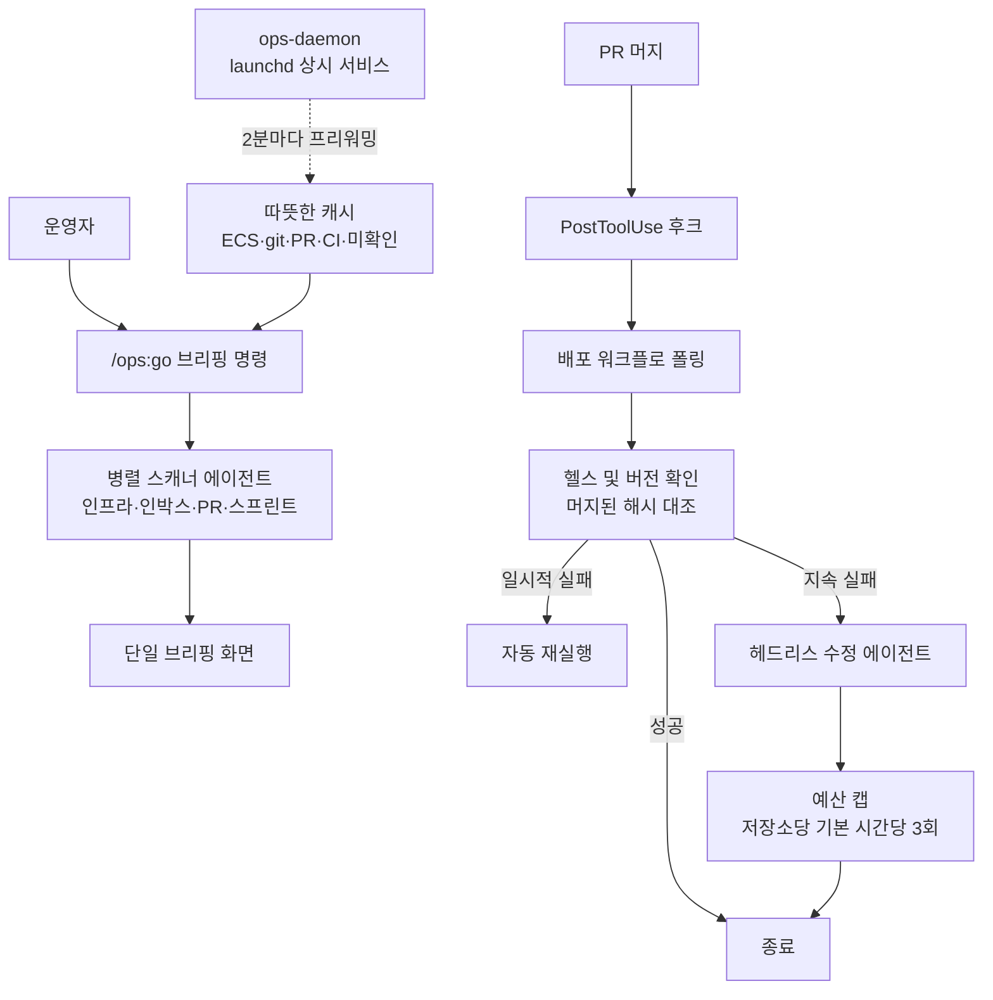

*같은 능력을 담는 방식이 두 갈래로 갈립니다.*

## 왜 읽어야 하나

사내 운영 업무를 에이전트에 넘길지 검토하면서 스킬을 몇 개까지 늘려야 하는지, 그 스킬을 얼마나 두껍게 써야 하는지 고민하는 플랫폼 엔지니어와 기술 리드를 위한 글입니다. 결론부터 말씀드리면, 이런 도구를 평가할 때 봐야 할 지표는 스킬 개수가 아니라 스킬 하나의 평균 두께와 그 스킬을 고르는 라우팅 방식입니다. 개수는 마케팅 숫자이고, 두께와 라우팅이 실제 토큰 비용과 정확도를 결정합니다.

이 글은 claude-ops라는 오픈소스 플러그인을 소재로 씁니다. 다만 소개가 목적은 아닙니다. README에 적힌 숫자를 그대로 옮기는 대신 저장소 트리를 직접 세어봤고, 그 과정에서 같은 저장소 안에서만 세 가지 다른 숫자가 나왔습니다. 그 불일치를 따라가면 에이전트 하네스를 실제로 운영할 때 무엇이 병목인지가 꽤 선명하게 드러납니다.

## 개요

claude-ops는 Claude Code를 회사 운영 체계로 바꾸는 것을 목표로 하는 플러그인입니다. Lifecycle Innovations Limited가 MIT 라이선스로 공개했고, 확인한 시점 기준 저장소는 별 99개, 마지막 푸시는 2026년 8월 11일 08시 04분 UTC입니다. 어제 타임라인에 올라온 소개 글에서는 스킬 57개와 에이전트 21개라고 소개됐습니다.

핵심 사용 경험은 `/ops:go` 명령 하나입니다. 이 명령을 치면 인프라 상태, CI/CD 통과 여부, 슬랙과 텔레그램과 왓츠앱과 지메일을 합친 미확인 메시지 수, 열려 있는 PR, 스프린트 진척률, 스트라이프와 RevenueCat과 AWS를 합친 매출 및 비용 스냅샷이 한 화면에 뜹니다. 아침마다 탭 여섯 개를 여는 대신 명령 하나를 친다는 것이 이 도구가 내세우는 가치 제안입니다.

여기까지는 잘 만든 대시보드 이야기입니다. 이 도구가 흥미로워지는 지점은 2.0에서 방향을 튼 부분입니다. 브리핑과 커뮤니케이션 표면에 머물던 것이 Claude Code 자체의 자율성 계층으로 넘어갔습니다. PR을 머지하면 후크가 배포 워크플로를 폴링하고, 성공하면 헬스 엔드포인트를 호출하고, 버전 엔드포인트가 머지된 커밋 해시를 돌려주는지까지 확인합니다. 실패하면 일시적 오류는 자동으로 재실행하고, 그래도 실패하면 헤드리스 수정 에이전트를 띄웁니다. 사람이 관여하지 않는 배포 후 복구 루프가 붙은 것입니다.

## 이 도구는 무엇인가

구조를 먼저 그려보면 이해가 빠릅니다.



눈여겨볼 설계가 몇 가지 있습니다.

첫째, 데이터 수집이 모델 컨텍스트 로딩보다 먼저 일어납니다. 모든 스킬이 사전 실행 셸 블록을 써서 모델이 깨어나기 전에 데이터를 모읍니다. 게다가 백그라운드 데몬이 2분마다 미리 데이터를 당겨놓기 때문에 `/ops:go`는 따뜻한 캐시를 때립니다. 에이전트 응답이 느린 이유의 상당 부분이 도구 호출 왕복이라는 점을 감안하면 합리적인 선택입니다.

둘째, 자동 수정 루프에 브레이크가 달려 있습니다. 저장소당 기본 시간당 3회라는 예산 캡, 동시 실행을 막는 단일 비행 잠금, 같은 내용의 중복 실행을 걸러내는 콘텐츠 해시 중복 제거가 함께 들어갑니다. 자율 루프를 붙일 때 가장 먼저 터지는 실패가 무한 재시도라는 것을 만든 쪽도 알고 있었던 셈입니다.

셋째, 안전 후크가 항상 켜져 있습니다. 시크릿 스캔, `rm -rf` 앵커 차단, 메인 브랜치 푸시 경고가 기본값입니다. 외부로 나가는 1대1 채널은 별도의 승인 게이트를 통과해야 합니다.

넷째, 자격 증명 해석 체인이 명시돼 있습니다. Doppler MCP를 먼저 보고, 없으면 Doppler CLI, 그다음 1Password와 Dashlane과 Bitwarden, 그다음 macOS 키체인, 그다음 환경 변수, 마지막으로 Claude Code의 암호화된 사용자 설정 순서입니다. 22개 서비스의 자격 증명을 다루는 도구가 이 순서를 문서화해 뒀다는 점은 평가할 만합니다.

### 에이전트 팀과 CI가 강제하는 계약

가장 참고할 만한 부분은 따로 있었습니다. 에이전트를 띄우는 모든 스킬이 Claude Code의 에이전트 팀 기능을 지원하도록 설계돼 있고, 그 지원 여부를 CI가 검사합니다.

에이전트 팀은 여러 에이전트가 맥락을 공유하고 진행 상황을 보고하며 실행 도중 방향 수정을 받을 수 있게 하는 조정 계층입니다. `CLAUDE_CODE_EXPERIMENTAL_AGENT_TEAMS=1` 환경 변수로 켜집니다. 켜져 있으면 `/ops:go`는 인프라 스캐너, 인박스 스캐너, PR 스캐너, 스프린트 스캐너를 하나의 팀으로 묶어 띄웁니다. 인박스 에이전트가 어떤 슬랙 메시지가 이메일 스레드를 참조한다는 것을 발견하면 이메일 에이전트가 그 스레드의 우선순위를 올리는 식입니다. 플래그가 꺼져 있으면 조정 없는 병렬 서브에이전트로 조용히 되돌아갑니다.

여기까지는 기능 설명이고, 진짜 배울 점은 그다음입니다. `tests/test-agent-teams.sh`가 모든 스킬을 감사합니다. 허용 도구 목록에 `Agent`가 들어 있는 스킬이라면 팀 생성과 메시지 전달 호출, 문서화 섹션, 기능 플래그 확인, 폴백 경로를 전부 갖추고 있어야 하고, 하나라도 빠지면 CI가 떨어집니다. 스킬 작성자에게 규약을 지켜달라고 산문으로 부탁하는 대신 검사하는 코드를 붙인 것입니다.

스킬이 63개일 때도 이런 검사가 필요했다면, 수백 개 규모에서는 선택지가 아닙니다. 저희가 산출물의 형식과 통과 여부를 모델 자기 보고가 아니라 코드가 판정하도록 규칙으로 못 박아 둔 것과 같은 판단입니다. 사람이 지키기로 한 규약은 시간이 지나면 반드시 깨지고, 깨진 것을 알아차리는 시점은 대개 사고가 난 뒤입니다.

## 설치 및 통합

설치 경로는 플러그인 마켓플레이스를 거칩니다.

```bash
# 1. 마켓플레이스 등록
/plugin marketplace add Lifecycle-Innovations-Limited/claude-ops

# 2. 플러그인 설치
/plugin install ops@ops-marketplace

# 3. 설정 마법사 실행
/ops:setup
```

Claude Code 1.0 이상만 있으면 되고 나머지 의존성은 마법사가 Homebrew나 apt나 winget으로 깔아준다고 안내합니다. 마법사는 2단계에서 백그라운드 데몬을 먼저 설치합니다. 사용자가 아직 슬랙을 연결할지 답하고 있는 동안 프리워밍이 이미 돌기 시작하므로 설정이 끝났을 때는 첫 브리핑이 캐시에서 나옵니다.

여러 CLI를 함께 쓰는 환경이라면 별도 설치 경로가 있습니다.

```bash
npx claude-ops-installer install
```

이 명령은 중앙 설정 파일 하나를 읽어 Claude Code, Codex, Gemini, OpenClaw, Hermes, OpenCode 중 감지된 CLI 각각의 레이아웃에 스킬과 실행 스텁을 복제합니다. 하네스마다 같은 능력을 따로 기술하지 않겠다는 발상이고, 스킬을 하네스 바깥에 두는 설계와 방향이 같습니다.

통합은 22개 서비스입니다. 대부분 MCP와 CLI 두 경로를 제공하고 설정 마법사에서 통합별로 고를 수 있게 해뒀습니다. 깃허브와 AWS는 CLI가 사실상 필수이고, 리니어와 버셀은 MCP만으로 충분하며, 왓츠앱은 MCP가 존재하지 않아 전용 CLI를 씁니다. 지메일은 MCP가 읽기 전용이라 발송과 아카이브를 쓰려면 CLI가 필요합니다. 통합 하나마다 무엇을 잃는지 표로 정리해 둔 점은 이 문서에서 가장 실용적인 부분입니다.

## 실제 실험 결과

스킬 개수를 세어봤습니다. 소개 글은 57개라 했고, README 배지는 62개라 했으며, 같은 README의 아키텍처 다이어그램과 디렉터리 설명은 22개라고 적고 있었습니다. 세 값이 전부 달랐으므로 깃허브 트리 API로 실제 파일을 셌습니다.

```bash
python3 scripts/blog/_exp_claude_ops_20260811.py
```

측정 결과는 다음과 같습니다.

| 출처 | 스킬 | 에이전트 |
| --- | --- | --- |
| 타임라인 소개 글 | 57 | 21 |
| README 배지 | 62 | 21 |
| README 아키텍처 다이어그램 및 디렉터리 설명 | 22 | 12 |
| 깃 트리 실측 | **63** | **21** |

트리에서 `skills/<이름>/SKILL.md` 패턴에 맞는 디렉터리는 63개, `agents/` 아래 마크다운 파일은 21개였습니다. 저장소 전체는 933개 파일이고 후크 파일 7개, 문서 마크다운 26개가 함께 들어 있습니다.

배지는 실측과 하나 차이니 사실상 최신입니다. 문제는 아키텍처 다이어그램 쪽입니다. 22개와 12개라는 값은 실제의 3분의 1 수준이고, 하필 독자가 구조를 이해하려고 가장 먼저 보는 자리에 박혀 있습니다. 저장소가 이 글을 쓰는 날 아침에도 푸시됐다는 점을 감안하면 활발히 개발 중인 프로젝트에서 산문이 트리를 따라가지 못한 전형적인 사례입니다.


*개수와 두께를 함께 보면 두 하네스가 정반대 방향으로 서 있습니다.*

더 흥미로운 값은 개수가 아니라 두께였습니다. claude-ops의 `SKILL.md` 평균 크기는 16,360바이트입니다. 에이전트 정의는 평균 6,669바이트입니다. 비교를 위해 같은 방식으로 저희 저장소를 셌더니 스킬 문서 1,946개에 평균 8,786바이트, 상시 적용 규칙 67개에 평균 3,487바이트가 나왔습니다.

숫자를 나란히 놓으면 그림이 분명해집니다. claude-ops는 스킬 하나에 저희의 두 배 가까운 분량을 담고 그 스킬을 63개만 둡니다. 저희는 스킬 하나를 얇게 쓰고 개수를 30배로 늘렸습니다. 같은 목표를 정반대 방향에서 푼 것입니다.

## 두꺼운 스킬 소수와 얇은 스킬 다수

이 차이는 취향이 아니라 라우팅 문제입니다.

스킬이 63개라면 모델이 전부 훑어보고 고를 수 있습니다. 이름과 설명만 컨텍스트에 올려도 감당할 만한 분량이고, 고른 다음에는 16KB짜리 문서가 필요한 맥락을 한 번에 다 줍니다. 스킬 하나가 두꺼워도 되는 이유는 그 스킬이 선택될 확률이 충분히 높기 때문입니다.

스킬이 1,900개를 넘어가면 이 방식이 무너집니다. 이름과 설명을 전부 올리는 것만으로 매 세션 상당한 토큰을 지불하게 되고, 모델은 노이즈 속에서 고르게 됩니다. 그래서 저희는 검색 계층을 앞에 세웠습니다. 요청이 들어오면 BM25와 임베딩을 섞은 검색기가 후보를 3개 이내로 좁히고, 그 후보만 실제로 로드합니다. 스킬 문서를 얇게 유지하는 이유도 여기 있습니다. 후보로 올라오는 문서가 두꺼우면 잘못 고른 비용이 커집니다.

정리하면 이렇습니다. 스킬을 두껍게 쓰는 설계는 개수를 세 자릿수 아래로 묶는 대가를 치릅니다. 개수를 늘리는 설계는 라우터를 하나 더 운영하는 대가를 치릅니다. 어느 쪽도 공짜가 아니고, 어느 쪽을 택했는지가 그 하네스가 앞으로 감당할 수 있는 도메인 폭을 결정합니다. claude-ops처럼 회사 운영이라는 비교적 뚜렷한 범위를 다룬다면 두꺼운 쪽이 유리합니다. 범위가 계속 열려 있다면 라우터를 먼저 만드는 편이 낫습니다.

이 관점에서 보면 아까의 숫자 불일치도 다시 읽힙니다. 배지든 다이어그램이든 사람이 손으로 유지하는 문자열입니다. 하네스가 커질수록 손으로 유지되는 숫자는 반드시 트리와 어긋나고, 그 어긋남은 조용히 진행됩니다. 저희가 산출물의 개수와 길이와 통과 여부를 모델 자기 보고가 아니라 코드가 세도록 규칙으로 못 박아 둔 것도 같은 이유에서입니다. 세어야 할 것은 세는 코드가 있어야 합니다.

## ThakiCloud 제품 적용 시사점

claude-ops가 다루는 문제는 Paxis가 다루는 문제와 정확히 겹칩니다. Paxis는 ThakiCloud의 Enterprise Agent Platform으로, 스킬을 검색해 격리된 샌드박스에서 실행하고 모든 행동을 정책 게이트와 감사 로그로 통과시킵니다. claude-ops를 읽으면서 확인한 세 가지가 Paxis 설계에 그대로 걸립니다.

첫째, 스킬 라우팅은 규모가 커지는 순간 별도 컴포넌트가 됩니다. claude-ops는 63개라 라우터 없이 버티지만, 기업 업무 자동화는 부서마다 워크플로가 붙으면서 금방 수백 개를 넘어갑니다. Paxis가 Skill Harness에 검색 계층을 처음부터 넣어둔 이유가 여기 있습니다. 스킬을 늘릴 수 있는 상한이 곧 자동화할 수 있는 업무의 상한입니다.

둘째, 자율 루프에는 반드시 코드가 소유하는 브레이크가 필요합니다. claude-ops의 시간당 3회 예산 캡과 단일 비행 잠금은 선택 사항이 아니라 자율성을 켜기 위한 전제 조건입니다. Paxis도 같은 층에서 휴먼 승인과 정책 게이트를 두고, 실행 추적과 비용 측정을 함께 남깁니다. 승인 게이트가 없는 자율성은 기능이 아니라 사고 대기 상태입니다.

셋째, 자격 증명과 감사는 별도 계층으로 분리돼야 합니다. claude-ops는 22개 서비스의 키를 다루면서 해석 순서를 문서화하고 텔레메트리를 보내지 않는다고 명시합니다. 성실한 태도지만 개인 도구의 방식입니다. 조직 단위에서는 누가 어떤 권한으로 무엇을 실행했는지가 사후에 재구성돼야 하고, 그것이 Signum이 IAM과 멀티테넌시와 감사 이벤트를 공통 기반으로 들고 있는 이유입니다.

여기에 하나 더 붙습니다. claude-ops의 자동 수정 에이전트는 값싼 모델을 헤드리스로 띄웁니다. 경쟁사 정보 수집 파이프라인도 같은 구조여서, 브랜드 10개 규모에서 주당 검색 호출 열댓 번과 월 32만 토큰 정도로 돌아간다고 밝히고 있습니다. 반복 실행되는 워커에 어떤 모델을 붙이느냐가 그 자동화의 손익분기를 정한다는 뜻입니다.

Metis는 이 지점을 Dedicated Endpoint와 Serverless로 흡수해 워커 한 번 실행의 토큰 단가를 낮추고, 같은 워크로드를 Telox GPU 클러스터에서도 고객 폐쇄망의 Aegis 위에서도 동일하게 돌립니다. 업무 자동화의 경제성은 결국 모델 호출 단가와 호출 횟수의 곱이고, 두 항 모두 인프라 쪽에서 손댈 수 있습니다. 개인 도구는 구독 한도 안에서 이 계산을 넘길 수 있지만, 조직 단위에서 워커를 상시로 돌리기 시작하면 단가가 곧 도입 가능 범위가 됩니다.

## 한계 및 반론

이 도구를 그대로 도입하기 전에 짚어야 할 점이 몇 가지 있습니다.

먼저 개인과 소규모 팀을 전제로 설계돼 있습니다. macOS 키체인, Continuity 기반 전화 연동, Elgato 카메라 자동 실행 같은 기능은 한 사람의 작업 환경을 깊게 파고듭니다. 여러 명이 같은 자동화를 공유하는 구조가 아니고, 자격 증명도 개인 저장소에 흩어져 있습니다.

다음으로 자격 증명 집중 리스크가 큽니다. 22개 서비스의 키를 한 도구가 해석하고 상시 데몬이 백그라운드에서 돌아갑니다. 문서가 성실하게 범위를 밝히고 있고 소스가 공개돼 있어 감사가 가능하다는 점은 완화 요인이지만, 이 정도 권한을 한 프로세스에 모으는 결정 자체는 조직에서 별도 검토를 받아야 합니다.

문서 드리프트도 실제 비용입니다. 이 글에서 확인했듯 같은 README 안에서 스킬 수가 세 배 차이 났습니다. 활발히 개발되는 프로젝트에서 흔한 일이지만, 도입 검토 단계에서 문서를 근거로 판단하면 틀린 그림을 갖게 됩니다. 평가할 때는 트리를 직접 세는 편이 안전합니다.

마지막으로 상시 데몬의 비용입니다. 2분 간격 프리워밍, 30분 간격 메모리 추출, 10분 간격 경쟁사 이벤트 배출이 동시에 돕니다. 응답 지연을 줄이는 대가로 유휴 상태에서도 계속 자원을 씁니다. 브리핑을 하루 한두 번 보는 사용 패턴이라면 이 교환이 유리한지 다시 계산해 볼 만합니다.

## 정리

claude-ops에서 가져갈 것은 기능 목록이 아니라 설계 선택입니다. 스킬을 두껍게 쓰고 개수를 63개로 묶은 것, 자율 루프에 예산 캡과 단일 비행 잠금을 먼저 단 것, 자격 증명 해석 순서를 문서화한 것이 그것입니다. 이 세 가지는 에이전트 하네스를 실제로 굴려본 팀만 내리는 결정입니다.

그래서 오늘 다음 단계로 권하고 싶은 것은 도입 검토가 아니라 측정입니다. 지금 운영 중인 에이전트 하네스에서 스킬 개수와 스킬 문서의 평균 크기를 세어보시기 바랍니다. 개수가 세 자릿수를 넘겼는데 라우터가 없다면 병목은 이미 모델이 아니라 선택 단계에 있습니다. 반대로 개수가 적은데 스킬 문서가 얇다면 모델이 매번 맥락을 스스로 복원하고 있을 가능성이 큽니다. 어느 쪽이든 세어보기 전에는 알 수 없고, 문서에 적힌 숫자는 답이 되지 못합니다.


## 관련 슬라이드

본문 내용을 NotebookLM(`architectural_mono` 스타일)으로 요약한 슬라이드입니다.


## 출처

- [claude-ops 저장소 (Lifecycle Innovations Limited, MIT)](https://github.com/Lifecycle-Innovations-Limited/claude-ops)
- [원본 타임라인 소개 글](https://x.com/hjguyhan/status/2086832106148425975)
- 스킬 및 에이전트 실측: `scripts/blog/_exp_claude_ops_20260811.py`, 결과 로그 `outputs/blog-impl/claude-ops-business-os/run-1.log`
