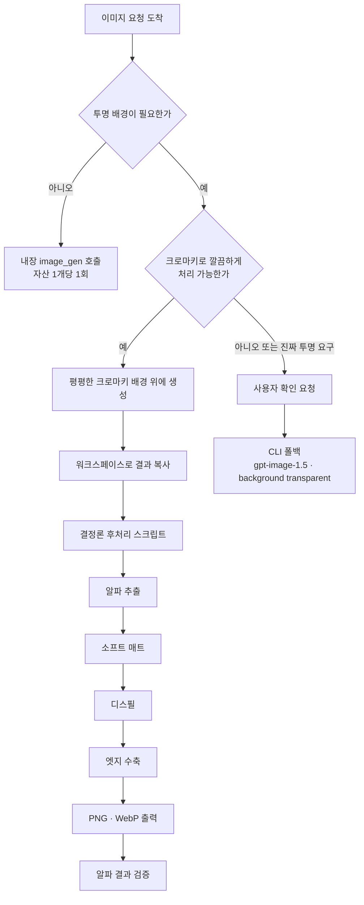

*능력을 붙이는 것과 절차를 정의하는 것은 다른 일입니다.*

## 왜 읽어야 하나

사내 에이전트에 스킬을 붙이고 있는데 결과물 품질이 호출마다 달라져 고민 중인 플랫폼 엔지니어와 에이전트 개발자를 위한 글입니다. 결론부터 말씀드리면, 잘 만든 스킬의 본체는 모델을 부르는 문장이 아니라 모델이 손대면 안 되는 부분을 코드로 떼어 낸 절차이고, 그 절차는 생각보다 훨씬 쌉니다.

Codex의 `imagegen` 스킬이 좋은 표본입니다. 이 스킬이 하는 일을 한 줄로 줄이면 이미지 생성인데, 정작 스킬 문서의 대부분은 이미지를 만드는 방법이 아니라 언제 어느 경로로 갈지, 결과를 어디에 저장할지, 그리고 모델이 못 하는 일을 어떤 스크립트에 넘길지를 규정합니다. 아래에서는 그 규정을 항목별로 읽은 뒤, 스킬이 외부 스크립트에 넘기는 후처리 단계를 직접 구현해서 비용과 효과를 재 보겠습니다.


*이 글이 따라가는 구분입니다.*

## 개요

Codex CLI는 2026년 4월 21일부터 gpt-image-2를 기본 이미지 모델로 씁니다. 그 전까지 쓰이던 gpt-image-1.5를 대체한 것인데, 이 교체가 스킬 설계에 재미있는 흔적을 남겼습니다. 뒤에서 보겠지만 신형 모델이 구형 모델의 기능 하나를 지원하지 않아서, 스킬이 그 구멍을 절차로 메우고 있습니다.

`imagegen`은 사용자가 만드는 스킬이 아니라 시스템 스킬입니다. 저장소 `openai/skills`의 `skills/.system/imagegen/SKILL.md`에 정본이 있고, Codex 본체 저장소에도 샘플 사본이 함께 들어 있습니다. 최근에도 `[codex] Update imagegen system skill` 풀 리퀘스트로 내용이 갱신됐습니다. 즉 이 파일은 문서가 아니라 제품의 일부이며, 버전 관리되는 코드와 같은 취급을 받습니다.

호출은 두 가지입니다. `codex "Create a dark-mode dashboard header banner $imagegen"`처럼 `$imagegen`을 명시해서 부를 수도 있고, 자연어만으로도 라우팅됩니다. 대상은 웹사이트 자산, 게임 자산, UI 목업, 제품 목업, 와이어프레임, 로고, 인포그래픽처럼 프로젝트 안에서 실제로 쓰이는 이미지입니다.

## 이 스킬은 무엇을 규정하는가

스킬 문서를 읽으면 규정이 세 층으로 나뉩니다.


*세 층 모두 이미지를 어떻게 만드는지가 아니라 무엇을 언제 하는지를 정합니다.*

첫째는 경로 라우팅입니다. 내장 `image_gen` 경로로 갈지 CLI 폴백으로 갈지를 가르는데, 판단 기준이 꽤 구체적입니다. 사용자가 "배치"라는 단어를 썼다는 사실만으로는 CLI 폴백 사유가 되지 않는다고 못 박습니다. 자산을 여러 개 요청했더라도 CLI나 API, 모델 제어를 명시적으로 요구한 것이 아니라면 내장 경로를 쓰고, 요청한 자산 하나당 내장 호출을 한 번씩 돌리라고 지시합니다. 이런 문장이 왜 필요한지는 겪어 보면 압니다. 모델은 "여러 장"이라는 표현을 보면 더 강력해 보이는 경로로 도망가려는 경향이 있고, 그 경로는 대개 더 느리고 더 비쌉니다.

둘째는 결과물의 처리입니다. 출력 경로를 어떻게 잡을지, 결과를 현재 프로젝트에 저장해야 하는 상황인지 아니면 미리보기로만 끝낼 상황인지를 스킬이 구분합니다. 이미지를 만들 수 있다는 것과 만든 이미지를 프로젝트에 올바르게 앉힌다는 것은 다른 문제인데, 후자를 모델의 눈치에 맡기지 않겠다는 뜻입니다.

셋째가 이 글의 관심사인 투명 배경 처리입니다. 여기서 앞서 말한 구멍이 드러납니다. gpt-image-2는 `background=transparent`를 지원하지 않습니다. 진짜 투명이 필요하면 CLI로 gpt-image-1.5를 불러 `--background transparent --output-format png`를 줘야 하는데, 스킬은 이 경로를 기본으로 삼지 않습니다. 대신 평평한 크로마키 배경 위에 이미지를 생성한 다음, 그 결과를 워크스페이스로 복사해서 `scripts/remove_chroma_key.py` 헬퍼를 돌리고, 알파 결과를 검증하라고 지시합니다. 그 헬퍼가 담당하는 일이 크로마키 알파 추출과 소프트 매트, 디스필, 엣지 수축, 그리고 PNG와 WebP 출력입니다.

CLI 폴백은 요청이 크로마키로 깔끔하게 처리하기에 너무 복잡해 보이거나 사용자가 진짜 투명을 명시적으로 요구했을 때만 열리며, 그때도 사용자 확인을 받은 뒤에야 실행됩니다.



여기서 눈여겨볼 것은 무게중심입니다. 모델이 하는 일은 왼쪽 위 한 칸이고, 아래로 길게 이어지는 나머지는 전부 확정된 절차입니다.

## 설치 및 통합

Codex CLI 없이도 이 설계의 핵심은 검증할 수 있습니다. 스킬이 외부로 뺀 후처리 네 단계를 직접 구현해서 재 보면 됩니다. 저희는 격리된 작업 트리에서 실험했습니다.

```bash
bash scripts/blog/impl_sandbox.sh setup codex-imagegen-skill-procedure
```

먼저 테스트 자산을 스킬이 지시하는 방식대로, 즉 평평한 크로마키 배경 위에 생성했습니다.

```bash
.venv/bin/python scripts/blog/gen_image.py \
  --prompt "A single glossy ceramic coffee mug, deep navy blue glaze, centered, \
studio product photography, isolated on a perfectly flat uniform chroma key green \
background, no shadows on the background, no text, no labels" \
  --output outputs/blog-impl/codex-imagegen-skill-procedure/asset-chroma.png
```

손잡이가 있는 머그를 고른 데는 이유가 있습니다. 손잡이 안쪽 구멍은 이미지 테두리와 이어져 있지 않은 닫힌 영역이라, 배경을 테두리에서부터 채워 나가는 방식으로 처리하면 그 구멍이 통째로 남습니다. 구현이 제대로 됐는지 가르는 지점입니다.

후처리는 넘파이와 Pillow만으로 구현했습니다. 알파 추출은 초록 우세도, 그러니까 G 채널에서 R과 B 중 큰 값을 뺀 값을 기준으로 삼았습니다. 소프트 매트는 그 우세도를 두 임계값 사이에서 선형으로 낮춰 경계에 부분 알파를 남깁니다. 디스필은 초록이 다른 두 채널의 평균을 넘는 픽셀에서 그 평균으로 눌러 주고, 엣지 수축은 최소값 필터로 매트를 1픽셀 안쪽으로 당깁니다.


*임계값 20에서 70, 1픽셀 수축은 저희가 정한 값이며 원본이 쓰는 값은 아닙니다.*

```bash
bash scripts/blog/impl_sandbox.sh run codex-imagegen-skill-procedure -- \
  .venv/bin/python chroma_experiment.py asset-chroma.png <결과 디렉터리>
```

비교 대상으로 임계값 하나만 쓰는 이진 매트도 함께 계산해서, 각 단계가 실제로 무엇을 없애는지 픽셀 단위로 셌습니다.

## 실제 실험 결과

1536x1024, 약 157만 픽셀 이미지 한 장에 대한 실측입니다.


*프린지 제거 효과, 단계별 소요 시간, 출력 포맷별 크기를 나란히 놓았습니다.*

가장 먼저 확인한 것은 경계 품질입니다. 임계값 하나로 자른 이진 매트는 화면에 보이는 영역 안에 초록이 남은 픽셀을 2,376개 남겼습니다. 소프트 매트와 디스필을 적용하자 이 값이 0이 됐고, 엣지 수축까지 적용해도 0을 유지했습니다. 이진 매트의 부분 알파 픽셀 수는 정의상 0인 반면 소프트 매트는 1,929개의 부분 알파 픽셀을 만들었는데, 이 1,929픽셀이 경계를 계단이 아니라 선으로 보이게 하는 실체입니다.

닫힌 영역 검사에서는 75,791픽셀이 나왔습니다. 이미지 테두리와 이어지지 않은 투명 영역, 즉 손잡이 안쪽 구멍입니다. 배경을 테두리에서 확장하는 방식으로 처리했다면 이만큼이 불투명하게 남았을 것입니다. 색상 기준으로 판정하는 방식이 이 문제를 애초에 만들지 않는다는 점이 확인됐습니다.


*두 픽셀 수치가 각각 경계 품질과 구멍 처리를 말해 줍니다.*

비용은 예상보다 훨씬 낮았습니다. 알파 추출과 소프트 매트가 1.14밀리초, 디스필이 6.36밀리초, 엣지 수축이 4.67밀리초로 전체 12.17밀리초입니다. 같은 이미지를 만드는 모델 호출이 수 초 단위인 것을 감안하면 후처리 전체가 생성 시간의 1퍼센트에도 미치지 않습니다.

출력 포맷 쪽도 재 봤습니다. 무손실 WebP가 457.2KB로 PNG의 1,321.8KB보다 65.4퍼센트 작았습니다. 스킬이 두 포맷을 모두 뱉도록 규정한 이유가 여기서 설명됩니다. 웹 자산으로 나갈 때와 편집 소스로 남길 때의 요구가 다릅니다.

한 가지 솔직하게 덧붙일 숫자가 있습니다. 디스필이 손댄 픽셀은 1,033,335개, 전체의 65.7퍼센트이고 평균 감소폭은 167.23이었습니다. 큰 값처럼 보이지만 이 대부분은 배경 자체입니다. 배경은 어차피 알파가 0이 되어 사라지므로, 눈에 보이는 개선을 만든 것은 이 가운데 경계에 걸친 소수의 픽셀입니다. 이 수치를 디스필의 효과 크기로 읽으시면 안 됩니다.


*손잡이 안쪽까지 투명하게 처리된 최종 결과물입니다.*

## ThakiCloud 제품 적용 시사점

이 사례가 Paxis 설계와 정확히 같은 자리를 짚습니다. Paxis는 스킬을 검색해 격리된 샌드박스에서 실행하고 모든 행동을 정책 게이트와 감사 로그에 통과시키는 엔터프라이즈 에이전트 플랫폼인데, 여기서 스킬을 어떻게 쓰느냐가 결과 품질을 좌우합니다. `imagegen`이 보여 준 방식은 스킬에 능력을 담지 않고 절차를 담는 것입니다. 모델은 내용만 만들고, 무엇을 어떤 순서로 어디에 저장하며 실패를 어떻게 판정하는지는 코드가 소유합니다. 저희가 사내 스킬을 쓰면서 반복해서 확인한 것도 같은 결론입니다. 출력이 호출마다 흔들릴 때 원인은 대개 모델 등급이 아니라 자유도가 남아 있는 구간이었습니다.

CLI 폴백을 사용자 확인 뒤에만 실행한다는 규정도 그냥 지나칠 대목이 아닙니다. 더 비싸거나 더 위험한 경로로 넘어가기 전에 사람의 승인을 받는 구조인데, Paxis의 휴먼 승인 게이트가 정확히 이 역할을 합니다. 그리고 그 승인과 경로 선택이 감사 로그에 남아야 나중에 왜 그 경로로 갔는지 설명할 수 있습니다. 신원과 권한, 감사 이벤트를 담당하는 Signum이 이 층을 받습니다. 자동화가 깊어질수록 무엇을 했는지보다 왜 그 경로를 골랐는지가 감사에서 더 많이 질문됩니다.

실행 경제성 관점에서는 Metis가 이 그림의 왼쪽 위 한 칸을 담당합니다. 12.17밀리초짜리 후처리와 수 초짜리 모델 호출 사이의 비율이 말해 주는 것은, 이런 워크로드의 원가가 사실상 전부 모델 호출에 몰려 있다는 사실입니다. 그래서 자산 하나당 호출을 몇 번 하느냐가 그대로 비용이 되고, `imagegen`이 "배치라는 단어만으로 다른 경로로 가지 말라"고 규정한 것도 결국 같은 이야기입니다. Metis는 이 호출을 Dedicated Endpoint로 붙잡을지 Serverless로 흘릴지를 고르는 층이며, 그 선택이 Paxis 업무 한 건당 토큰 비용으로 환산됩니다.


*샌드박스 실행과 승인·감사, 호출 라우팅이 서로 다른 층에서 맞물립니다.*

## 한계 및 반론

먼저 이 글의 실험 범위를 분명히 하겠습니다. 저희는 Codex CLI를 설치해서 `imagegen` 스킬을 직접 실행하지 않았습니다. 이 환경에 Codex가 없었고, 그래서 스킬의 라우팅이 실제로 문서대로 동작하는지는 확인하지 못했습니다. 확인한 것은 스킬이 외부 스크립트로 넘긴 후처리 단계를 같은 명세로 구현했을 때 그 비용과 효과가 어떠한가입니다. 스킬 자체의 동작에 대한 검증이 아닙니다.

구현도 저희 것이지 OpenAI의 것이 아닙니다. `remove_chroma_key.py` 원본을 읽고 옮긴 것이 아니라 문서에 적힌 네 단계 이름을 보고 각각을 표준적인 방식으로 구현했습니다. 임계값 20과 70, 1픽셀 수축 같은 값은 저희가 정한 것이며, 원본이 어떤 값을 쓰는지는 모릅니다. 따라서 이 글의 수치는 "이 네 단계를 이렇게 구현하면 이 정도"라는 뜻이지 원본의 성능이 아닙니다.

측정 조건도 좁습니다. 이미지 한 장, 그것도 배경이 완벽하게 평평하고 피사체 경계가 선명한 스튜디오 제품 사진입니다. 머리카락이나 반투명한 유리, 모션 블러가 걸린 경계처럼 실제로 크로마키가 어려워지는 조건은 전혀 시험하지 않았습니다. 프린지가 0이 됐다는 결과는 이 조건에서만 유효하며, 스킬 문서가 "크로마키로 깔끔하게 처리하기에 너무 복잡한 경우"라는 예외를 둔 것도 그런 조건이 존재하기 때문일 것입니다.

마지막으로 반대 방향의 주장을 적어 두겠습니다. 절차를 코드로 고정하면 안정성은 오르지만 유연성은 내려갑니다. gpt-image-2가 다음 버전에서 투명 배경을 지원하기 시작하면 위 흐름도의 아래 절반은 통째로 불필요해집니다. 절차를 스킬에 박아 두는 설계는 모델의 진화를 스킬 개정으로 따라가야 한다는 부채를 함께 집니다. `imagegen`이 시스템 스킬로 버전 관리되고 풀 리퀘스트로 갱신되는 이유가 이 부채를 감당하기 위해서라고 보는 편이 정확합니다.

## 정리

`imagegen` 스킬을 읽고 그 후처리를 직접 구현해 본 결과, 이 스킬의 값어치는 이미지를 만들 수 있다는 데 있지 않았습니다. 모델이 못 하는 일을 식별해서 결정론 코드로 떼어 내고, 어느 경로로 갈지와 언제 사람에게 물을지를 문장으로 확정한 부분에 있었습니다.


*왼쪽은 비싸고 흔들리며, 오른쪽은 싸고 반복됩니다.*

그 절차의 비용은 157만 픽셀 이미지 한 장에 12.17밀리초였습니다. 같은 이미지를 만드는 모델 호출의 1퍼센트에도 미치지 않는 비용으로 그린 프린지 2,376픽셀이 사라졌고, 테두리 기반 방식이었다면 놓쳤을 75,791픽셀의 닫힌 영역이 제대로 처리됐습니다. 품질과 비용의 교환비가 이 정도로 유리한 구간은 흔치 않습니다.

지금 하실 일은 사내 스킬 하나를 골라 문서를 다시 읽어 보시는 것입니다. 모델에게 맡긴 것과 코드가 소유한 것의 비율을 세어 보시고, 호출마다 흔들리는 항목이 어느 쪽에 있는지 확인해 보시기 바랍니다. 대개는 모델 쪽에 남아 있으며, 그것을 옮기는 비용은 위에서 잰 것처럼 생각보다 훨씬 쌉니다.

## 출처

- [openai/skills 저장소의 imagegen 시스템 스킬](https://github.com/openai/skills/blob/main/skills/.system/imagegen/SKILL.md)
- [Codex 본체에 포함된 imagegen 샘플 스킬](https://github.com/openai/codex/blob/main/codex-rs/skills/src/assets/samples/imagegen/SKILL.md)
- [imagegen 시스템 스킬 갱신 풀 리퀘스트 #18852](https://github.com/openai/codex/pull/18852)
- [Codex CLI의 이미지 생성과 gpt-image-2 도입 정리](https://codex.danielvaughan.com/2026/04/27/codex-cli-image-generation-gpt-image-2-visual-development-workflows/)
- [Codex 사용 사례: 아이디어에서 개념 증명까지](https://developers.openai.com/codex/use-cases/idea-to-proof-of-concept)
