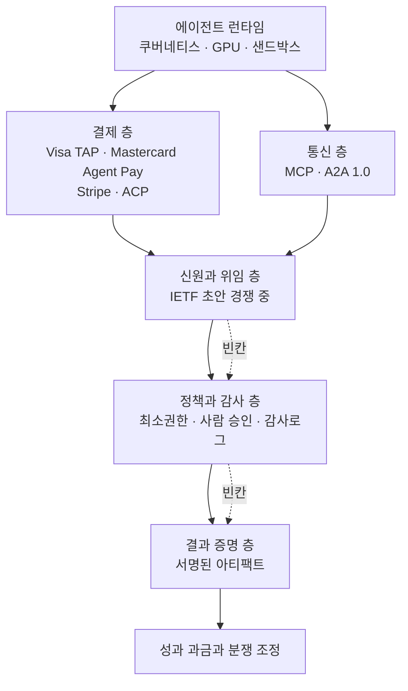

## 왜 읽어야 하나

이 글은 에이전트를 사내 업무에 실제로 붙이려는 플랫폼 엔지니어와, 그 도입을 승인해야 하는 결정권자를 위해 썼습니다. 결론부터 말씀드리면 에이전트에게 돈을 쥐여주는 문제는 이미 풀렸고, 남은 병목은 그 에이전트가 누구를 대신해 어디까지 행동해도 되는지를 증명하는 층입니다.

2025년만 해도 이건 상상 속 이야기였습니다. 지금은 아닙니다. Visa와 Mastercard와 Stripe가 각자 에이전트 결제 인프라를 상용화했고, 에이전트끼리 대화하는 프로토콜은 리눅스 재단 산하로 넘어가 1.0을 찍었습니다. 반면 "이 에이전트가 누구의 위임을 받았고 언제 그 권한이 만료되는가"를 정의하는 표준은 여전히 개인 자격으로 제출된 IETF 초안 몇 개가 서로 경쟁하는 상태입니다. 도입을 막는 건 모델 성능이 아니라 이 비대칭입니다.

## 1년 사이 결판난 것: 결제와 통신

먼저 이미 끝난 이야기부터 정리하겠습니다.

결제 쪽은 카드 네트워크가 직접 들어왔습니다. Visa는 [Intelligent Commerce](https://www.visa.com/en-us/solutions/intelligent-commerce)에서 AI가 거래를 개시할 때의 인증과 리스크와 신뢰를 새로운 문제로 명시하고, 가맹점이 에이전트를 식별하고 검증하도록 Trusted Agent Protocol을 붙였습니다. Mastercard는 2025년 4월 [Agent Pay](https://www.mastercard.com/global/en/news-and-trends/press/2025/april/mastercard-unveils-agent-pay-pioneering-agentic-payments-technology-to-power-commerce-in-the-age-of-ai.html)를 발표하면서 기존 토큰화 체계를 확장한 Agentic Token을 내놓았습니다. 카드 자격증명을 에이전트와 가맹점 범위와 동의 정책에 묶어두는 방식입니다. Stripe는 [Agentic Commerce](https://stripe.com/use-cases/agentic-commerce)에서 에이전트가 지출 가드레일 안에서 결제하고 모든 거래가 실시간으로 보이며 구매 이력을 추적할 수 있다고 설명합니다. OpenAI는 Stripe와 함께 만든 Agentic Commerce Protocol로 [ChatGPT 안에서 바로 결제](https://openai.com/index/buy-it-in-chatgpt/)하는 경험까지 붙였습니다.

통신 쪽도 마찬가지입니다. Google이 2025년 4월 공개한 [Agent2Agent](https://developers.googleblog.com/en/a2a-a-new-era-of-agent-interoperability/)는 50개가 넘는 파트너로 출발했는데, 그해 6월 [리눅스 재단에 기증](https://developers.googleblog.com/en/google-cloud-donates-a2a-to-linux-foundation/)됐고 2026년 4월 재단 거버넌스 아래 1.0 사양을 냈습니다. Anthropic의 [MCP](https://www.anthropic.com/news/model-context-protocol) 역시 도구 연결의 사실상 표준이 된 뒤 2025년 12월 Agentic AI Foundation으로 넘어갔습니다.

여기서 읽어야 할 신호는 개별 제품이 아닙니다. **한 회사가 밀던 스펙이 중립 재단으로 넘어간다는 건 그 층의 경쟁이 끝났다는 뜻입니다.** 지금 에이전트용 결제 수단이나 에이전트 간 메시지 포맷을 새로 만드는 건 늦었습니다. 그 자리는 이미 주인이 정해졌습니다.

## 아직 주인이 없는 층 하나: 신원과 위임

문제는 그다음입니다. 결제망은 "이 자격증명으로 결제해도 되는가"를 판정하지만, "이 에이전트가 정말 홍길동을 대신하는가, 그 위임을 누가 언제 줬고 언제 회수되는가"는 판정하지 않습니다. 이건 결제 문제가 아니라 신원 문제입니다.

이 자리를 노리는 시도는 있습니다. IETF에는 [Agent Identity Protocol 초안](https://datatracker.ietf.org/doc/draft-singla-agent-identity-protocol/)이 올라와 있고 2026년 6월 03 버전까지 갱신됐습니다. 분산 식별자와 암호학적 위임 체인, 능력 기반 권한, 결정론적 회수를 다룹니다. 그런데 이건 **개인 자격 제출 초안이지 IETF 표준이 아닙니다.** 워킹그룹도 없습니다. 게다가 경쟁 초안이 여럿입니다. AWS와 Okta와 OpenAI 등이 이름을 올린 `draft-klrc-aiagent-auth`가 2026년 7월에 나왔고, WIMSE 계열에도 별도 초안이 있습니다. 벤더 쪽에서는 Microsoft가 Entra Agent ID로 에이전트 전용 신원 제어 평면을 밀고 있습니다.

초안이 세 개 넘게 경쟁한다는 건 두 가지를 동시에 말합니다. 문제가 진짜라는 것, 그리고 아직 아무도 이기지 않았다는 것입니다. 결제망이 1년 만에 재단으로 수렴한 것과 대비하면 이 층이 얼마나 비어 있는지 드러납니다.

실무에서 답해야 하는 질문은 사실 "너 사람이니"가 아닙니다. 사람 증명은 이미 World ID나 C2PA 같은 접근이 경쟁하는 붐빈 시장입니다. 남은 빈칸은 그 옆입니다. 너는 누구인가, 누구의 위임을 받았는가, 무엇까지 해도 되는가, 언제까지인가, 그 권한을 어떻게 즉시 회수하는가. 사람 증명보다 권한 증명이 먼저 필요합니다.

표준이 정해지길 기다리는 동안에도 이 정보를 어딘가에는 적어둬야 합니다. 최소한 아래 다섯 칸은 지금 당장 사내 에이전트마다 채울 수 있습니다.

```yaml
agent:
  id: agent://thaki/contract-review-42   # 이 에이전트를 유일하게 가리키는 식별자
  owner: legal-team                       # 사고가 나면 책임지는 조직
  delegated_by: hong                      # 누구를 대신하는가
  expires_at: 2026-08-16T12:00:00+09:00   # 위임 만료 시각. 무기한 위임은 위임이 아닙니다
  scope:
    read: [contracts/*]
    write: [review/*]
    payment: { daily_limit_krw: 500000 }
  revocation: https://iam.internal/agents/contract-review-42/revoke
```

핵심은 스키마가 아니라 만료와 회수 경로가 비어 있지 않게 만드는 일입니다. 나중에 표준이 정해지면 이 다섯 칸은 그쪽 형식으로 옮기면 그만이고, 지금 이 칸을 안 채워두면 옮길 것도 없습니다.

여기에 한 겹이 더 붙습니다. 에이전트가 다른 에이전트를 부르기 시작하면 위임이 체인이 됩니다. A가 B에게 일을 맡기고 B가 다시 외부 서비스를 호출하면, 마지막 호출이 원래 사람의 권한 범위 안에 있었는지를 누군가 계산해야 합니다. 에스크로만으로는 부족한 이유가 여기 있습니다. 돈을 묶어두는 건 분쟁이 생긴 뒤의 장치고, 애초에 권한 범위를 벗어난 호출을 막으려면 체인 전체를 따라가며 범위를 좁혀가는 계산이 필요합니다. 경쟁 중인 IETF 초안들이 하나같이 위임 체인과 회수를 다루는 것도 그래서입니다.

## 아직 주인이 없는 층 둘: 권한과 보안

에이전트가 실제 시스템을 만지기 시작하면 환각보다 심각한 문제가 생깁니다. 외부 문서를 읽다가 그 안에 심긴 지시에 행동이 바뀌는 간접 프롬프트 인젝션입니다.

NIST는 이걸 에이전트 하이재킹으로 정의하고 평가를 강화했는데, 자체 레드팀이 새로운 공격 기법으로 [성공률을 11퍼센트에서 81퍼센트까지 끌어올렸다](https://www.nist.gov/news-events/news/2025/01/technical-blog-strengthening-ai-agent-hijacking-evaluations)고 보고했습니다. Anthropic도 브라우저 사용 에이전트의 [프롬프트 인젝션 방어](https://www.anthropic.com/research/prompt-injection-defenses)를 공개하면서 진전을 보여주려는 것이지 문제가 풀렸다고 주장하는 게 아니라고 못 박았습니다. 공격 성공률을 1퍼센트대로 낮춘 모델조차 의미 있는 위험이 남아 있다고 표현합니다.

이 영역이 얼마나 급했는지는 OWASP의 움직임이 보여줍니다. [LLM Top 10 2025](https://genai.owasp.org/resource/owasp-top-10-for-llm-applications-2025/)의 과도한 권한 항목이 이미 최소 권한과 고위험 행동에 대한 사람 승인을 권고했는데, 2025년 12월에는 아예 [에이전트 전용 Top 10](https://genai.owasp.org/resource/owasp-top-10-for-agentic-applications-for-2026/)이 따로 나왔습니다. 목표 하이재킹부터 통제를 벗어난 에이전트까지 열 가지 위협을 별도 문서로 세운 겁니다. 기존 문서에 항목 하나를 더하는 걸로 감당이 안 됐다는 뜻입니다.

그래서 앞으로 에이전트 플랫폼의 승부처는 얼마나 똑똑한 에이전트냐가 아니라 **얼마나 좁게 권한을 주고 얼마나 빨리 회수할 수 있느냐**로 옮겨갑니다.

## 아직 주인이 없는 층 셋: 결과 증명

과금 모델은 이미 좌석 기반에서 성과 기반으로 넘어갔습니다. Intercom의 Fin은 [해결 건당 0.99달러](https://www.intercom.com/pricing)를 받고, Salesforce Agentforce는 [행동 하나당 0.10달러](https://help.salesforce.com/s/articleView?id=004811240&language=en_US&type=1)에 해당하는 Flex Credit 모델을 운영합니다. 두 수치 모두 2026년 8월 시점의 공개 정가이고, 벤더가 언제든 바꿀 수 있는 값입니다.

여기서 아무도 소유하지 않은 질문이 생깁니다. 고객이 이렇게 묻습니다. "에이전트가 이 티켓을 해결했다는데 진짜 해결된 게 맞습니까?"

이걸 답하려면 결과가 실제로 발생했는지, 그게 에이전트 때문인지, 약정 시간 안이었는지, 사람이 중간에 개입했는지, 롤백이 있었는지를 누군가 증명해야 합니다. 지금은 이 증명을 파는 회사가 각자 자기 대시보드로 합니다. 트레이스 분석과 실패 모드 탐지를 하는 Judgment Labs가 2026년 5월 [시드와 시리즈 A 합쳐 3200만 달러](https://www.businesswire.com/news/home/20260512621556/en/)를 공개한 것도 이 수요를 보여줍니다.

평가 자체도 출력 채점을 넘어섰습니다. Anthropic은 [에이전트 평가](https://www.anthropic.com/engineering/demystifying-evals-for-ai-agents)에서 자동 평가만으로는 부족하고 프로덕션 모니터링과 사람 검토를 함께 써야 한다고 설명합니다. OpenAI의 [에이전트 평가 가이드](https://developers.openai.com/api/docs/guides/agent-evals)는 도구 선택이 옳았는지, 넘겨야 할 때 넘겼는지, 정책 위반이 있었는지를 실행 흐름 전체로 채점합니다.

평가가 이 방향으로 가면 성격이 바뀝니다. 배포 후에 품질을 재는 QA 도구가 아니라, **실행 전에 통과 여부를 판정하는 관문**이 됩니다. 쿠버네티스에 비유하면 어드미션 컨트롤러에 가깝습니다. 작업 성공률과 정책 준수 여부와 재무 리스크와 비용과 실제 창출 가치를 함께 찍어서 통과와 검토와 차단을 나누는 것이죠.

그 판정이 서명된 아티팩트로 남으면 뒷단이 한꺼번에 열립니다. 어떤 작업 하나에 대해 무슨 에이전트가 무엇을 했고 고객이 확인했는지, 정책 위반이 있었는지, 원가가 얼마고 창출 가치가 얼마인지가 한 레코드에 붙어 있으면 그 레코드가 곧 청구 근거이자 서비스 수준 약정의 증거이자 평판 점수의 입력값이 됩니다. 분쟁이 생겼을 때 양쪽이 같은 레코드를 보고 이야기할 수 있다는 점이 더 큽니다. 지금은 이게 없어서 "우리 대시보드에는 해결로 찍혀 있습니다"와 "우리는 해결됐다고 못 느꼈습니다"가 평행선을 그립니다.

평판도 같은 재료에서 나옵니다. 별점 다섯 개가 아니라 작업 성공률과 정책 위반율과 롤백률과 사람 개입률과 평균 원가와 지연 시간을 작업 종류별로 따로 쌓는 쪽이 실제 운영에 쓰입니다. 같은 에이전트라도 계약 검토는 잘하고 웹 리서치는 못할 수 있는데, 이걸 하나의 점수로 뭉개면 아무 판단에도 못 씁니다.

## 스택으로 다시 그리면

지금까지 이야기를 층으로 세우면 어디가 비었는지 한눈에 보입니다.



아래 두 층은 재단이 가져갔고, 위의 성과 과금은 벤더가 각자 하고 있습니다. 가운데 세 층이 비어 있습니다. 그리고 가운데가 비면 위아래가 이어지지 않습니다. 결제망은 돈을 옮겨주지만 그 지출이 정당한 위임이었는지 모르고, 과금 시스템은 청구서를 보내지만 그 결과가 진짜였는지 증명하지 못합니다.

## 빈칸이 보인다고 다 만들면 안 됩니다

지도를 그리고 나면 반대쪽 판단도 같이 서야 합니다. 지금 새로 만들면 늦거나 이길 수 없는 자리가 꽤 명확하기 때문입니다.

에이전트 전용 카드나 지갑은 늦었습니다. Visa와 Mastercard와 Stripe가 이미 상용화한 자리에 정면으로 들어가는 일이고, 카드 네트워크와 경쟁해서 이길 이유가 우리에게는 없습니다. 파운데이션 모델도 마찬가지입니다. 범용 에이전트 프레임워크는 재단으로 넘어간 프로토콜 위에 얹히는 층이라 차별화가 빠르게 사라집니다. 사람 신원 시스템도 이미 붐빕니다. 음성 에이전트는 기술적으로는 성숙했지만 전화를 받아주는 기능 자체는 빠르게 흔한 상품이 되고 있어서, 그 위에 업무 흐름과 매출이 붙지 않으면 차별점이 남지 않습니다.

반대로 아직 자리가 비어 있는 쪽은 앞에서 본 가운데 세 층입니다. 권한 위임과 정책 게이트, 행동 감사, 결과 검증, 그리고 이 셋을 엮어 여러 에이전트가 안전하게 거래하게 만드는 기반입니다. 결제망과 모델 제공자와 신원 공급자를 상대로 싸우는 것보다, 그들을 연결하고 통제하는 층에 서는 편이 승산이 큽니다.

## ThakiCloud 제품 적용 시사점


*Thaki Agent Control Plane. 아래 두 층은 우리 인프라가, 위의 여섯 층은 통제 평면이 담당합니다.*

ThakiCloud가 이 지도를 보는 방식은 단순합니다. 우리는 결제망이나 파운데이션 모델을 만들지 않습니다. 그 대신 기업이 에이전트에게 권한과 예산과 업무를 안전하게 맡길 수 있는 통제 평면을 만듭니다.

**Paxis**는 이 층을 정면으로 겨냥한 Agent-Native Cloud입니다. Paxis는 스킬과 도구와 정책과 감사 로그를 일급 리소스로 다룹니다. 수백 개 스킬 중에서 작업에 맞는 것을 검색으로 골라 격리 샌드박스에서 실행하고, 모든 행동이 정책 게이트와 감사 로그를 통과하게 합니다. 위에서 정리한 빈칸 중 정책과 감사 층이 정확히 이 제품의 자리입니다. OWASP가 별도 문서까지 만들어 요구하는 최소 권한과 사람 승인 관문은 프롬프트에 적어 넣는 규칙이 아니라 런타임이 강제해야 하는 계약인데, 우리는 그걸 코드가 소유하도록 설계했습니다.

**Signum**은 그 아래 신원 층을 받칩니다. 여기서 우리 판단은 또 하나의 신원 시스템을 새로 만들지 않는다는 것입니다. IETF 초안이 세 개 경쟁하고 Microsoft가 자체 제어 평면을 미는 상황에서, 승자를 예측해 한쪽에 올인하는 건 리스크입니다. 현실적인 자리는 Keycloak과 클라우드 IAM과 기업 디렉터리를 이어주는 중립 위임 평면입니다. 에이전트마다 소유자와 위임자와 허용 범위와 만료 시각과 회수 경로를 붙이고, 그 아래 어떤 신원 공급자가 오든 갈아 끼울 수 있게 두는 편이 낫습니다.

**Metis**는 이 구조의 경제성을 만듭니다. 성과 기반 과금이 성립하려면 한 건의 작업 원가가 창출 가치보다 확실히 낮아야 하는데, 그 원가의 대부분은 추론 비용입니다. 서빙 원가를 낮추는 일이 곧 에이전트 사업 모델의 마진을 만든다는 점에서, 추론 계층과 에이전트 계층은 따로 노는 두 제품이 아니라 하나의 손익 구조입니다. 온프레미스와 폐쇄망 요구가 강한 국내 공공과 금융 고객에게는 이 조합이 특히 맞습니다. 감사 로그와 위임 기록이 회사 밖으로 나가지 않아야 하는 곳일수록 통제 평면을 자체 인프라 위에 올릴 수 있다는 점이 실제 구매 조건이 됩니다.

## 한계 및 반론

이 정리에 반론을 걸자면 세 가지가 있습니다.

첫째, 빈칸이 오래 비어 있지 않을 수 있습니다. 결제망이 1년 만에 정리된 속도를 보면 신원 층도 2027년 안에 재단이나 대형 벤더가 가져갈 가능성이 큽니다. 그렇다면 중립 위임 평면이라는 자리는 통합 계층으로 축소될 수 있습니다. 다만 그 경우에도 여러 신원 공급자를 이어 붙이는 일은 남습니다.

둘째, 결과 증명은 기술 문제가 아니라 합의 문제일 수 있습니다. "해결됐다"의 정의는 도메인마다 다르고, 그걸 판정하는 주체가 서비스 제공자라면 공정성 시비가 붙습니다. 서명된 아티팩트를 만드는 건 쉬워도 그 아티팩트를 양쪽이 인정하게 만드는 건 다른 문제입니다.

셋째, 마케팅 언어와 실제 도입 사이 간극이 큽니다. GEO를 예로 들면 2024년 KDD 논문이 실험 조건에서 노출을 최대 40퍼센트가량 개선했다고 보고했지만, 2026년에 나온 [비판적 서베이](https://arxiv.org/abs/2607.14035)는 여러 플랫폼에서 장기간 안정적으로 유기적 발견 가능성이나 비즈니스 성과를 높인다고 입증된 기법은 아직 없다고 지적합니다. 에이전트 인프라 담론도 같은 함정을 피하기 어렵습니다. 지금 필요한 건 큰 그림보다 한 도메인에서 실제로 통과율과 비용과 분쟁 건수를 재는 일입니다.

## 정리

에이전트에게 돈을 쥐여주는 문제는 카드 네트워크가 풀었고, 에이전트끼리 말을 걸게 하는 문제는 재단이 풀었습니다. 남은 건 그 사이입니다. 이 에이전트가 누구를 대신하는지, 어디까지 해도 되는지, 방금 한 일이 진짜 결과인지를 판정하는 층에는 아직 표준도 승자도 없습니다.

그래서 지금 만들 가치가 있는 건 또 하나의 음성 에이전트나 또 하나의 평가 대시보드가 아닙니다. 위임과 정책과 결과 증명을 하나의 통제 평면으로 묶는 일입니다. 당장 할 수 있는 첫걸음도 분명합니다. 사내에서 돌리는 에이전트 하나를 골라 그 에이전트가 지금 무슨 권한을 갖고 있고 누가 그걸 줬으며 어떻게 회수하는지 적어보십시오. 대부분의 조직에서 이 세 칸이 비어 있고, 그 공백이 곧 이 글이 말한 빈칸의 사내 버전입니다.

## 출처

- [Visa Intelligent Commerce](https://www.visa.com/en-us/solutions/intelligent-commerce)
- [Mastercard Agent Pay 발표](https://www.mastercard.com/global/en/news-and-trends/press/2025/april/mastercard-unveils-agent-pay-pioneering-agentic-payments-technology-to-power-commerce-in-the-age-of-ai.html)
- [Stripe Agentic Commerce](https://stripe.com/use-cases/agentic-commerce)
- [OpenAI Buy it in ChatGPT](https://openai.com/index/buy-it-in-chatgpt/)
- [Google A2A 공개](https://developers.googleblog.com/en/a2a-a-new-era-of-agent-interoperability/) · [리눅스 재단 기증](https://developers.googleblog.com/en/google-cloud-donates-a2a-to-linux-foundation/)
- [Anthropic Model Context Protocol](https://www.anthropic.com/news/model-context-protocol)
- [IETF draft-singla-agent-identity-protocol](https://datatracker.ietf.org/doc/draft-singla-agent-identity-protocol/)
- [NIST 에이전트 하이재킹 평가](https://www.nist.gov/news-events/news/2025/01/technical-blog-strengthening-ai-agent-hijacking-evaluations)
- [Anthropic 프롬프트 인젝션 방어](https://www.anthropic.com/research/prompt-injection-defenses)
- [OWASP Top 10 for LLM Applications 2025](https://genai.owasp.org/resource/owasp-top-10-for-llm-applications-2025/) · [OWASP Top 10 for Agentic Applications 2026](https://genai.owasp.org/resource/owasp-top-10-for-agentic-applications-for-2026/)
- [Intercom 요금](https://www.intercom.com/pricing) · [Salesforce Agentforce 요금](https://help.salesforce.com/s/articleView?id=004811240&language=en_US&type=1)
- [Anthropic 에이전트 평가](https://www.anthropic.com/engineering/demystifying-evals-for-ai-agents) · [OpenAI 에이전트 평가 가이드](https://developers.openai.com/api/docs/guides/agent-evals)
- [GEO 비판적 서베이 2026](https://arxiv.org/abs/2607.14035)
