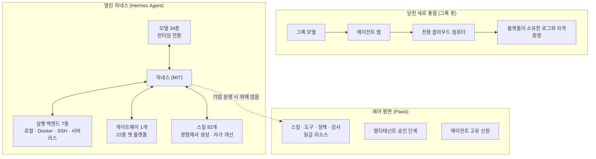

사내에 에이전트를 도입할지, 도입한다면 어떤 층을 우리 회사가 갖고 어떤 층을 사는지를 결정해야 하는 플랫폼 엔지니어나 기술 리더라면, 이번 주 에이전트 플랫폼 구도에 관한 이 논쟁을 읽어야 합니다. 결론부터 말하면, "그록 봇의 100% 오픈소스 버전"이라는 주장은 하네스(harness) 축에서는 사실에 가깝고, 클라우드 컴퓨터 축에서는 사실이 아닙니다.


*교체 가능한 큐브 위에 얹힌 투명한 모듈 하네스와, 배경의 고체 모노리스. 하네스 분리와 세로 통합의 대비를 형상화했습니다.*

## 왜 읽어야 하나

이 글은 에이전트를 도입할 때 "어느 회사의 에이전트 앱을 쓸 것인가"에서 "어느 층을 우리 회사 것으로 가져갈 것인가"로 질문을 옮기는 분을 위해 씁니다. 8월 초 그록 봇 출시, 그 한 주 뒤 터진 "100% 오픈소스 버전" 주장, 이 두 신호가 가리키는 방향을 코드 기준으로 검증해 드리면, 도입 결정에서 모델·하네스·실행 환경 3층 중 통제할 층을 고르는 기준이 세워집니다.

## 개요

지난 8월 11일, SpaceXAI는 그록 봇 베타를 내놓았습니다. 맥과 iOS, 윈도우, 리눅스용 에이전트 앱으로, 사용자가 자율적인 디지털 팀원을 만들고 봇이 직접 로그인해서 작업을 수행합니다. 에이전트에게 전용 클라우드 컴퓨터를 준다는 콘셉트입니다. 저희도 8월 12일 글에서 이 출시를 신원과 감사 로그라는 축으로 읽었습니다.

이 출시가 나온 시점은 시장 전체가 같은 층으로 밀려들고 있던 바로 그 주였습니다. 같은 8월에 그록 4.6이 출시되면서 이용 한도 리셋 소식이 나왔고, 엔비디아는 에이전트 작업용 경량 모델을 내면서 반복 실행 레이어의 단가를 낮추기 시작했습니다. 모델 순위가 분기마다 흔들리는 상황에서, 모델 자체보다 "모델이 일하는 환경"을 누가 갖느냐가 경쟁의 다음 축으로 올라오는 중이었습니다. 그록 봇의 전용 클라우드 컴퓨터가 정확히 그 축을 겨냥한 제품이라는 점에서, 일주일 뒤 터진 오픈소스 반응은 우연이 아닙니다.

그로부터 일주일 뒤, 구글 시니어 AI PM이자 오픈소스 프로젝트 awesome-llm-apps를 운영하는 Shubham Saboo가 트윗을 올렸습니다. "INSANE. This is 100% Open Source version of Grok Bot. Works with any Agent harness. Let that sink in." 12만 뷰를 넘긴 이 트윗이 가리키는 대상을, 저희 파이프라인의 8월 20일 부연은 오픈소스 진영의 Hermes Agent로 식별했습니다. 이 글은 그 식별을 전제로 삼되, 주장 자체를 사실로 전담하지 않습니다. 어디가 맞고 어디가 다른지를, 검증 가능한 코드로 나눠 봅니다.

## 그록 봇과 Hermes Agent: 두 개의 세로축

그록 봇의 구조는 세로 통합입니다. 모델(그록), 앱(에이전트 클라이언트), 실행 환경(전용 클라우드 컴퓨터)이 한 패키지로 묶입니다. 사용자가 사는 것은 에이전트가 아니라, 에이전트가 일할 수 있게 다 준비된 방입니다. 편의성은 최대이지만, 방의 문은 열리지 않습니다. 로그인 자격증명, 실행 권한, 감사 로그 전부 플랫폼이 갖고, 사용자는 렌탈 계약자로 남습니다.

Hermes Agent는 반대 방향의 구조입니다. Nous Research가 MIT 라이선스로 공개한 "자기 개선형 에이전트"로, 공식 README의 자기 기술은 이렇습니다. "어떤 모델이든 쓰라(Nous Portal, OpenRouter, OpenAI, 자체 엔드포인트 등). hermes model 하나로 전환, 코드 변경 없음, 잠금 없음." 그리고 "여기서만 산다"는 표현이 아닙니다. 텔레그램, 디스코드, 슬랙, 왓츠앱, 시그널, CLI를 하나의 게이트웨이 프로세스에서 다루고, 실행 환경은 로컬부터 Docker, SSH, 싱귤래리티, 모달, 데이토나, 버첼 샌드박스까지 7종의 터미널 백엔드를 지원합니다.

| 축 | 그록 봇 (세로 통합) | Hermes Agent (하네스 분리) |
|---|---|---|
| 모델 | 그록 계열 단일 | 34종 프로바이더, 런타임 전환 |
| 실행 환경 | 전용 클라우드 컴퓨터 (관리형) | 7종 백엔드, 셀프호스팅 |
| 접점 | 네이티브 앱 | 게이트웨이 1개로 22종 챗 플랫폼 |
| 신성 | 코드 미공개 | MIT, 전체 코드 공개 |

## 코드를 뜯어서 본 검증

"100% 오픈소스"와 "어떤 하네스와도 동작한다"는 주장은 코드를 보면 검증할 수 있습니다. 저희는 Hermes Agent 레포지토리를 서브모듈로 받아, 위 표의 수치를 직접 세었습니다.

`plugins/model-providers/` 디렉터리에는 34개의 프로바이더가 들어 있습니다. 안스로픽, 오픈AI 코덱스, 제미나이, xAI, 딥시크, 베드록, 버텍스, 올리마 클라우드, 그리고 custom(자체 엔드포인트)까지. 모델 전환이 "프로바이더 플러그인을 갈아끼운다"는 물리적 동작으로 구현되어 있다는 뜻입니다. "어떤 하네스와도"라는 표현의 정직한 번역은 "어떤 모델과도"입니다.

`plugins/platforms/`에는 22개의 접점 플랫폼이 있습니다. 텔레그램, 슬랙, 왓츠앱, 라인, 위챗, 디스코드, IRC, SMS까지. 단일 게이트웨이 프로세스가 이 모든 채널에서 하나의 에이전트를 대리한다는 구조는, 그록 봇의 네이티브 앱 4종과 같은 문제(한 개의 에이전트를 여러 접점에서 쓰는 일)를 다른 해법(전 채널을 하나의 게이트웨이에 붙임)으로 풀고 있습니다.

`tools/terminal_tool.py` 하나에서 7종 백엔드를 확인했습니다. local, docker, ssh, singularity, modal, daytona, sandbox. 이 목록이 "클라우드 컴퓨터" 축의 실체입니다. 데이토나와 모달이 서버리스 지속성을 제공한다는 README 서술대로, 유휴 시 환경이 동면하고 호출에 깨어나는 구조입니다. 다만 이 서버리스는 플랫폼이 빌어 주는 것이 아니라, 운영자가 자신의 모달·데이토나 계정으로 붙이는 것입니다.

`skills/`에는 82개의 SKILL.md가 번들되어 있고, `plugins/`에는 memory, cron_providers, browser, observability 같은 18개 플러그인 디렉터리가 있습니다. 에이전트가 경험에서 스킬을 만들고 쓰면서 개선하는 "닫힌 학습 루프"가 README의 핵심 주장인데, 그 루프가 도는 자리가 전부 이 공개 코드 안에 있습니다. memory 플러그인이 에이전트가 큐레이션하는 장기 기억을, cron_providers가 자연어 스케줄 자동화를, agentskills.io 공개 표준 호환이 스킬의 포터블성을 담당합니다. 학습 루프의 각 단계를 개별 코드로 열어서 읽을 수 있다는 것은, "자기 개선"이라는 표현이 마케팅 문구가 아니라 코드 내 객체임을 뜻합니다.

설치 경로도 검증해 두겠습니다. 공식 README의 설치 명령은 Linux, macOS, WSL2, Termux에서 한 줄입니다.

```bash
curl -fsSL https://hermes-agent.nousresearch.com/install.sh | bash
```

윈도우 네이티브는 PowerShell 원라인 설치, 안드로이드는 Termux 매뉴얼 경로를 제공합니다. 설치자가 uv와 Python 3.11, ripgrep, ffmpeg를 함께 잡는다는 서술도 README에 그대로 있고, 실제 레포의 `setup-hermes.sh`와 `pyproject.toml`에서 확인됩니다. "여기서만 산다"가 아니라 "자신의 머신에 통째로 깔 수 있다"는 점이 그록 봇과의 구조적 차이를 가장 짧게 압축합니다.



다시 말해, "100% 오픈소스 버전"이라는 주장의 해부도는 이렇습니다. 코드 공개 축에서는 성립합니다. 모델 교체 축에서는 성립합니다. 실행 환경 축에서는 "구성이 공개되어 있다"까지가 맞고, "컴퓨터가 주어진다"는 부분까지 성립하지는 않습니다. 그록 봇의 클라우드 컴퓨터가 관리형 서비스라면, 오픈소스 쪽은 서버리스를 포함한 셀프호스팅 레시피입니다. 같은 문제를 한쪽은 패키지로, 다른 쪽은 부품 목록으로 풀고 있는 것입니다.

## ThakiCloud 제품 적용 시사점

이 구도는 저희가 Paxis를 설계하는 자리에서 매일 부딪히는 질문입니다.

**Paxis 렌즈.** Paxis는 ThakiCloud의 Agent-Native Cloud로, 스킬·도구·정책·감사 로그를 일급 리소스로 다룹니다. Hermes Agent가 보여주는 82개 번들 스킬과 플러그인 구조와 같은 방향의 문제 의식인데, 시점이 다릅니다. 오픈소스 하네스는 단일 사용자 또는 단일 팀 관점에서 "에이전트가 자기를 어떻게 개선할 것인가"를 먼저 풀었고, Paxis는 그 위에 "여러 팀의 에이전트가, 어떤 권한으로, 어떤 승인을 거쳐, 그 행위가 누구의 이름으로 기록되는가"를 풀어야 합니다. 8월 12일 글에서 다뤘던 감사 로그의 "누가" 칸 질문이 바로 이 지점입니다. 그록 봇이 사람 계정으로 로그인하는 구조라면, Paxis는 에이전트 고유 주체 식별자와 도구 권한 집합, 세션 단위 감사를 분리하는 구조입니다. 오픈소스 하네스가 증명해 준 것은 이 분리 설계가 기술적으로 성립한다는 것이고, 남은 과제는 기업의 멀티테넌스 요구를 얼마나 견디느냐입니다.

구체적으로 그 갭은 세 곳에서 생깁니다. 하나는 승인 단계입니다. 82개 스킬과 18개 플러그인은 한 사람의 판단 하나로 전부 열립니다. 조직에서 에이전트가 사내 데이터를 조회하거나 외부에 파일을 올리는 동작은 등급별 승인이 필요하고, 그 승인은 에이전트 실행 루프가 아니라 플랫폼의 정책 게이트에서 내려야 로그로 남습니다. 두 번째는 신원입니다. 게이트웨이 1개가 22개 플랫폼을 대하면, 어느 채널에서 온 요청이 어떤 에이전트 세션에 귀속되는지 매핑하는 일도 플랫폼 몫입니다. 세 번째는 감사입니다. 에이전트가 자기가 만든 스킬로 다시 자기 행동을 바꾸는 학습 루프는 강력하지만, 그 루프 자체를 감사 대상에서 빼면 "에이전트가 스스로 권한을 넓혔나"라는 질문에 답할 길이 사라집니다. 이 세 가지를 일급 리소스로 두는 것이 Paxis가 하네스 위에 쌓는 층입니다.

**ai-platform 렌즈.** 실행 환경 축의 함의는 infra 쪽으로 떨어집니다. 7종 백엔드 목록을 읽으면, 에이전트 실행 환경의 수요가 "내 노트북"에서 "임의의 격리 환경"으로 이동하는 과정임을 알 수 있습니다. 이 수요가 커지면, 에이전트 전용 실행 환경을 제공하는 일은 모델 서빙을 제공하는 일과 같은 층의 인프라가 됩니다. 저희가 Telox와 Velox로 겨냥하는 GPUaaS와 베어메탈 공급, Metis의 서빙 레이어와 같은 좌표에 "에이전트 실행 레이어"가 추가되는 것입니다. 오픈소스 하네스가 자체 엔드포인트(custom 프로바이더)를 1급 시민으로 대하는 구조는, 이 레이어가 사내에 들어오길 원한다는 신호이기도 합니다.

## 한계 및 반론

이 글의 근거 범위를 정직하게 밝힙니다.

첫째, "100% 오픈소스 버전"이라는 원문은 한 개발자의 트윗입니다. 이 트윗의 링크가 가리키는 정확한 대상은 이번 검증에서 직접 열지 못했습니다. Hermes Agent로 식별한 것은 저희 내부 부연(두 편의 비교 기사를 인용)에 기반한 추론이며, 이 글의 검증 대상도 그 식별을 전제로 합니다. 전제가 다른 곳으로 가면, "하네스 분리의 실체"라는 본문 논증은 그대로 유효하지만 "그록 봇 대항마"라는 프레임은 조정되어야 합니다.

둘째, "100% 오픈소스"의 뉘앙스에 주의가 필요합니다. 코드가 공개된 것은 맞지만, 기본 경험은 여전히 회사 자체의 포털(Nous Portal)을 가리킵니다. 코드 개방과 기본값 개방은 별개의 문제이며, 기업 도입의 관점에서는 후자가 더 자주 통제를 요구합니다.

셋째, 그록 봇 쪽의 장점이 과소평가되어서는 안 됩니다. 관리형 클라우드 컴퓨터는 신원·사용량·과금이 묶인 서비스이지, 운영 부담이 없는 것은 아닙니다만, 운영 부담의 존재 자체가 장점이 됩니다. 오픈소스 하네스가 운영자에게 넘기는 일은 그 관리형 서비스가 숨겨 주는 일의 총합입니다.

넷째, Hermes Agent는 단일 조직 프로젝트입니다. 거버넌스, 보안 대응, 장기 지원의 규모가 기업 플랫폼과는 다릅니다. "100% 오픈소스"는 코드의 상태를 기술하는 말이었고, 운영 성숙도를 약속하는 말이 아니었습니다.

## 정리

에이전트 플랫폼의 구도가 움직이는 방향은 이렇습니다. 모델 벤더는 에이전트와 실행 환경을 한 패키지로 묶어 편의를 팔고 있고, 오픈소스 진영은 하네스를 모델과 환경에서 분리해 통제를 팔고 있습니다. "100% 오픈소스 그록 봇"이라는 주장은 이 두 축의 대비를 한 문장으로 압축한 것으로, 코드 검증 결과 하네스 분리 축에서는 정확하고, 클라우드 컴퓨터 축에서는 "부품 목록이 공개되어 있다"로 고치면 성립합니다.

도입을 결정하는 팀에게 남기는 기준은 이것입니다. 모델, 하네스, 실행 환경 3층을 따로 보고, 각 층에서 바꾸기 쉬운 것과 바꾸기 어려운 것을 구분하십시오. 모델은 어느 쪽이든 이제 교체 가능한 부품입니다. 진정으로 소유해야 할 층은 이 3층 위에 쌓이는 제어 평면, 곧 스킬과 정책과 감사 로그입니다. 그 층에서 결정이 갈라질 때, 지금 선택한 하네스가 공개 코드인지 관리형 패키지인지는 다음 단계의 협상력이 됩니다.

---

*출처: Shubham Saboo의 원트윗(x.com), HuggingNews의 Grok Bot 베타 출시 보도, Nous Research Hermes Agent 공식 README와 레포지토리(2026-08-21 시점 코드로 검증), 그리고 2026-08-12 자 ThakiCloud 기술 블로그의 Grok Bot 분석. 트윗의 원문 링크 대상이 Hermes Agent라는 식별은 내부 부연의 추론임을 명시합니다.*

## 관련 슬라이드

본문 내용을 NotebookLM(`neo_constructivist` 스타일)으로 요약한 슬라이드입니다.


