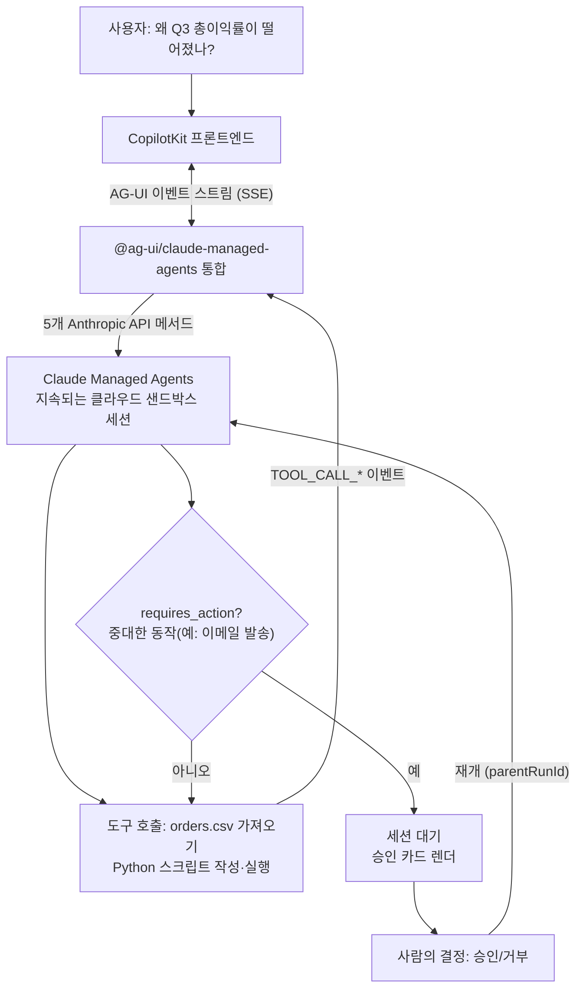

## 왜 읽어야 하나

클라우드 샌드박스에서 실제 데이터 분석을 하는 AI 에이전트를, 사용자가 화면 위에서 보고 '중요한 동작'에 승인 권한을 쥐는 제품을 만들려는 개발자라면 이 글을 읽어야 합니다. 결론부터 말합니다. Anthropic의 Claude Managed Agents와 AG-UI 프로토콜, CopilotKit을 잇는 새 쿡북을 설치하고 프로토콜 레벨에서 직접 실험한 결과, **에이전트의 일은 '응답 텍스트'가 아니라 '이벤트 스트림'이며, 사람의 승인(중단과 재개)은 그 스트림의 일급 시민으로 설계되어 있습니다.** 결국 프로토콜을 소비하는 문제이고, 그것이 이 글의 핵심입니다.

## 개요

8월 21일 Anthropic의 개발 계정(@ClaudeDevs)이 "Claude Managed Agents는 여러 다른 UI를 움직일 수 있다"며 새 쿡북을 알렸습니다. 이 쿡북은 AG-UI 프로토콜과 CopilotKit을 결합한 데모, margin-analyst-demo입니다. 사용자는 "왜 Q3 총이익률이 떨어졌지?"라는 질문 하나를 던지고 에이전트가 클라우드 샌드박스에 주문 장부를 가져와 Python 스크립트를 쓰고, 실제 지저분한 데이터에서 traceback을 맞고 에러를 읽고, 스크립트 자체를 고쳐 다시 돌리는 과정을 화면에서 지켜봅니다.

세 가지가 겹쳐 있습니다. AG-UI는 에이전트와 사용자 애플리케이션 사이의 공개 이벤트 기반 프로토콜이고 Claude Managed Agents는 Anthropic이 호스팅하는 상태 유지(stateful) 도구 사용 에이전트 런타임이며, CopilotKit은 그 스트림을 실제 UI(채팅, 파일 패널, 터미널 패널)로 그리는 프레임워크입니다. 각각의 위치를 먼저 정리하겠습니다.


## 이 기술은 무엇인가

### AG-UI: 에이전트와 UI 사이의 표준 배선

AG-UI(Agent-User Interaction Protocol)는 에이전트 백엔드와 사용자 프론트엔드 사이의 연결을 표준화하는 공개·가볍고·이벤트 기반 프로토콜입니다. 공식 문서의 표현을 빌리면, "모델/에이전트 런타임과 사용자 프론트엔드 사이를 흐르는 에이전트 상태, UI 의도, 사용자 상호작용"을 표준화하는 것입니다.

에이전트 프로토콜을 처음 다루는 사람이 헷갈리는 지점이 있습니다. MCP, A2A, AG-UI, 그리고 A2UI까지 네 개의 이름이 비슷하게 붙어 있기 때문입니다. AG-UI 공식 문서와 CopilotKit 문서 둘 다 이 혼선을 정면으로 다룹니다. 정리하면 이렇습니다.

| 프로토콜 | 연결하는 쪽 | 역할 |
|---|---|---|
| MCP | 에이전트 ↔ 도구 | 도구 호출 표준 |
| A2A | 에이전트 ↔ 에이전트 | 에이전트 간 통신 |
| AG-UI | 에이전트 ↔ 사용자 UI | 이벤트 스트림 기반 UI 배선 |
| A2UI | (생성형 UI 스펙) | 에이전트가 UI 위젯을 '만드는' 스펙 |

A2UI와 AG-UI는 이름이 비슷하지만 다른 층입니다. A2UI는 에이전트가 전달할 UI 위젯을 정의하는 생성형 UI 스펙이고 AG-UI는 그런 UI를 포함해 에이전트와 프론트엔드 전체를 이은 상호작용 프로토콜입니다. 둘은 함께 쓰입니다.

### Claude Managed Agents: 호스팅된 샌드박스 세션

Claude Managed Agents는 Anthropic의 호스팅 런타임입니다. 에이전트와 샌드박스 환경을 한 번 정의하면, 그 위에 세션을 돌려 파일과 도구 상태, 대화가 턴 사이에 유지되는 식으로 동작합니다. 공식 쿡북 컬렉션인 claude-cookbooks의 managed_agents 디렉터리에는 이 API 표면을 가르치는 노트북들이 쌓여 있습니다. 데이터 분석 에이전트, Slack 봇, SRE 온콜 리스폰더(합병 전 사람 승인 대기), MongoDB 연동, 프롬프트 버전 고정·롤백, 세션 예산 상한, 멀티 에이전트 팀, 메모리 스토어, 인퍼런스 지역 pinning까지.

margin-analyst-demo는 이 쿡북 계열에서 "UI를 어떻게 붙이는가"를 보여주는 편입니다. 데모는 공식 npm 통합 패키지 @ag-ui/claude-managed-agents 위에 지어졌고 CopilotKit이 프론트엔드입니다.

### 두 가지 실행 모드: replay와 live

데모의 가장 잘 설계된 부분은 실행 모드 분리입니다.

- **replay(기본)**: API 키가 전혀 필요 없습니다. 녹화한 세션 트랜스크립트로 실제 공개 통합을 돌려주는 ReplayClient가 5개 Anthropic 메서드(beta.agents.retrieve, beta.sessions.create/.update, beta.sessions.events.send/.stream)를 구현합니다. 클라이언트 seam 위의 모든 것, 즉 공개된 ManagedAgentsAgent의 턴 루프, 이벤트 변환, park/resume은 전부 실제입니다. 상태바에는 항상 REPLAY 표시가 붙습니다. 데모 저자의 말대로 "조용히 API 호출을 가짜로 하는 데모는 데모가 아니기" 때문입니다.
- **live**: 실제 Anthropic 계정으로 검증된 모드입니다. setup:live 한 명령이 환경과 에이전트를 프로비저닝하고 에이전트는 실제 클라우드 샌드박스에 데이터셋을 curl로 가져와서 분석합니다. ANTHROPIC_API_KEY나 MA_AGENT_ID, MA_ENV_ID가 없으면 replay로 조용히 강등하지 않고 시작 자체를 거부합니다.





## 설치 및 통합

데모를 돌려보는 것은 30초입니다.

```bash
git clone https://github.com/jerelvelarde/margin-analyst-demo
cd margin-analyst-demo
npm install
npm run dev          # http://localhost:3000, replay 모드(키 불필요)
```

live 모드로 가려면 `.env.local`에 ANTHROPIC_API_KEY를 넣고 beta 접근 확인(200이면 가능, 403/404이면 계정 미활성) 후 `npm run setup:live`로 에이전트와 환경을 프로비저닝합니다. 주의할 점이 하나 있습니다. 데이터셋이 샌드박스에서 도달 가능해야 한다는 것입니다. 에이전트가 데이터를 가져오는 curl은 저자의 머신과 무관하게 Anthropic 클라우드 환경에서 실행됩니다. 그래서 localhost URL은 해석되지 않습니다. 데이터셋을 raw 파일 URL로 올리고 환경 변수 ORDERS_CSV_URL에 등록합니다.

저희는 프로토콜 자체를 Python에서 만져보기 위해 공식 Python SDK를 설치했습니다.

```bash
VIRTUAL_ENV="$PWD/.venv" uv pip install ag-ui-protocol
```

설치된 버전은 ag-ui-protocol 0.1.20이었습니다. ag_ui.core 모듈에는 93개의 심볼이 있고 EventType 열거형은 실험 시점 33개입니다. TEXT_MESSAGE_* 계열, TOOL_CALL_* 계열, STATE_SNAPSHOT/STATE_DELTA, MESSAGES_SNAPSHOT, ACTIVITY_*, THINKING_*, REASONING_* 계열, RAW, CUSTOM, 그리고 RUN_STARTED/RUN_FINISHED/RUN_ERROR, STEP_STARTED/STEP_FINISHED입니다. SSE 와이어 포맷으로 인코딩하는 EventEncoder(accept="text/event-stream")도 함께 옵니다.


## 실제 실험 결과

쿡북의 시나리오를 프로토콜 레벨에서 로컬 재현했습니다. LLM도 API 키도 쓰지 않는 결정론적 실험: 미니 데이터 분석 에이전트가 전체 AG-UI 이벤트 어보쥬러리를 EventEncoder로 스트리밍하고 HITL 인터럽트에서 멈추고, 클라이언트가 SSE를 디코딩해 상태를 재구성한 뒤 승인으로 재개하고 run 2가 보고서를 내보내는 흐름입니다. 실험 스크립트는 scripts/blog/_agui_experiment.py이고, 실제 출력은 run-1.log~run-9.log에 남아 있습니다.

### 실험 1: 지저분한 데이터 위 분석

실험 데이터는 40행 주문 CSV입니다. Q3/EAST 세그먼트에 운송비 급증을 심어 두었습니다. 에이전트가 두 도구(read_orders, margin_by_region)를 호출하고 STATE_SNAPSHOT에 {loaded_rows: 40}을, STATE_DELTA에 분석 결과를 얹습니다. 결과: Q3/EAST는 7건, 매출 8,164.29달러, 총이익률 6.08%로 최악이었고, Q2/WEST는 8건에 41.0%였습니다. run 1은 21개 이벤트로 끝났고 마지막은 RUN_FINISHED였지만 outcome이 성공이 아니라 인터럽트였습니다.

```
Interrupt(id="int-approve", reason="human_approval",
          message="Q3/EAST margin 6.08% — approve report?")
```

### 실험 2: 클라이언트는 스트림에서 상태를 재구성한다

클라이언트 쪽은 SSE 라인에서 data: JSON을 뽑아 STATE_SNAPSHOT로 초기 상태를, STATE_DELTA의 add op로 분석 결과를 합칩니다. 그리고 재개 요청을 만들었습니다.

```
resume: [{"interrupt_id": "int-approve", "status": "resolved", "payload": {"approved": true}}]
```

run 2는 19개 이벤트를 내보냈고 RUN_STARTED에 parentRunId="run-1"이 실립니다. 같은 thread에서 전 실행을 이어받는다는 뜻입니다. 보고서는 render_report 도구 호출 후 텍스트 메시지 9개 청크로 스트림되었고 run 2 전체 SSE 바이트 수는 1,928이었습니다.

### 실험 3: 스키마는 엄격하다 (7회 반복의 교훈)

흥미로운 실패 기록입니다. 실험 스크립트는 첫 성공까지 7번 버그를 쳤는데, 그중 대부분이 AG-UI SDK의 pydantic 엄격성이었습니다.

- ReasoningStartEvent()에 messageId를 빼면 field required로 거부
- ReasoningMessageStartEvent의 role은 'assistant'가 아니라 리터럴 'reasoning'이어야 함
- ReasoningEndEvent도 messageId 요구
- ResumeEntry는 pydantic 모델이라 json.dumps가 TypeError를 냄 (model_dump() 필요)

"추론 메시지에도 id가 있어야 하고, role은 assistant가 아니다"라는 세부 규율이 실제 SDK에서 강제된다는 것은 에이전트 UI 개발자가 서버를 붙이기 전에 알아둘 만한 사실입니다. 이벤트 스트림을 소비하는 쪽과 생산하는 쪽이 같은 스키마로 묶여 있으므로, 버그가 늦게 터지는 대신 바로 터집니다.

### 데모의 live 모드에서 실제로 일어난 일

저희 실험은 프로토콜 재현이고 모델이 실제 동작하는 live 모드의 증언은 데모 README가 남깁니다. 두 가지를 뽑겠습니다.

첫째, live 실행 사이에는 숫자가 흔들립니다. 데모 저자의 검증 런에서 Q3 '운송비 급증이 없었을 때' 시뮬레이션(counterfactual) 총이익률은 38.63%를 찍었다가 다음 런에선 38.57%, 초과 운송비는 107,526달러였다가 105,901달러였습니다. 둘 다 방어 가능한 읽기이고 둘 다 서로 다릅니다. 하지만 헤드라인(34.6%, Q2 대비 -4.07pp, 같은 3개 SKU)은 매번 같은 자리에 착지했습니다. 데이터에 진짜로 있는 신호는, 모델이 방법을 고르더라도 같은 결론으로 수렴한다는 뜻입니다.

둘째, live 모드에서만 발견된 버그가 두 개 있습니다. 하나는 모델이 "% / $"라는 복합 단위의 차트를 보내서 Y축 라벨이 전부 "0% / $"로 잘려 6개 라벨이 모두 동일하고 모두 틀렸던 일입니다. 다른 하나는 cd /mnt/session && python3 analyze.py 경로 때문에 파일 트리상 모든 파일이 상대·절대 경로로 두 번씩 열거된 일입니다. 녹화 트랜스크립트는 손으로 다듬은 페이로드를 보내므로 이 둘은 replay에서 도달 불가능했습니다. "테스트가 증명하지 못한 것은 영상에도 나오지 않는다"는 데모의 원칙이, 정반대로 live 검증이 테스트를 대체하지 못한다는 사실도 함께 보여줍니다.


## ThakiCloud 제품 적용 시사점

이 조합은 Paxis의 설계 언어와 정확히 겹칩니다. Paxis는 ThakiCloud의 Agent-Native Cloud로, 에이전트 플랫폼 위에서 Skills·Tools·Policies·Audit Logs를 일급 리소스로 다루는 제어 평면입니다.

**승인 게이트가 프로토콜인 이유.** margin-analyst-demo의 send_email은 프론트엔드 도구입니다. 에이전트가 호출하면 Managed Agents 세션은 requires_action 상태로 park되고 승인 카드가 실제로 작성된 이메일을 렌더하고, 사람이 클릭할 때까지 아무것도 재개되지 않습니다. 거부를 하면 에이전트는 재시도가 아니라 결정을 인지합니다. Paxis에서 사람이 위험 동작을 막는 방식도 같은 형입니다. 에이전트의 행동을 정책 게이트와 감사 로그를 통과시키고, 승인 대기-재개까지 프로토콜이 정의하는 부분입니다. AG-UI의 Interrupt/ResumeEntry가 그 형식을 표준화했다는 점이 Paxis에 주는 교훈은 명확합니다. 승인 UI를 각 앱마다 손으로 쓰지 말고, 중단-재개를 이벤트 스트림의 일급 이벤트로 계약해야 한다는 것입니다.

**상태가 스트림에서 재구성된다는 점.** 데모의 파일·터미널 패널은 AG-UI 이벤트 스트림에서 파생됩니다. 모든 줄과 모든 파일이 관찰된 도구 호출에서 오고 스테이징된 것이 없습니다. Paxis의 샌드박스 격리 실행에서도 같은 원칙이 성립합니다. UI가 보여주는 것은 에이전트가 실제로 한 일의 함수여야 하고, 세션 상태는 스트림으로 재구성되어야 합니다. 서버 재시작을 살아나는 thread와 session의 매핑(.managed-agents.json)도 결국 그 스트림을 이어서 소비하기 위한 장치입니다.

**경제성 축은 ai-platform으로 내려갑니다.** live 세션은 과금되고 프로세스보다 오래 삽니다. 데모가 teardown 명령까지 npm 스크립트로 박아 둔 이유가 그것입니다. 에이전트 UX의 실행 경제성은 결국 서빙 비용으로 수렴합니다. ThakiCloud의 ai-platform(Metis)이 K8s·Kueue 위에서 멀티테넌트 모델 서빙을 최적화하는 이유가, 에이전트가 쓸 수 있는 토큰 예산을 정하는 것이기 때문입니다.

## 한계 및 반론

첫째, 저희 실험은 프로토콜 레벨 재현입니다. 모델이 실제 데이터에서 판단을 내리는 live 모드의 숫자(38.63% vs 38.57% 등)는 데모 README의 증언이고 저희가 직접 재현한 값이 아닙니다.

둘째, Python의 ag-ui-protocol은 코어만입니다. 타입과 인코더는 제공하지만 에이전트/서버 구현은 없고 공식 통합은 npm의 @ag-ui/claude-managed-agents입니다. Python 런타임에 붙이려면 자체 어댑터를 써야 한다는 뜻이고 0.1.x 버전이라 이벤트 어보쥬러리가 앞으로 늘어날 수 있습니다. 오늘 33개라는 수치는 이번 실험 시점의 값입니다.

셋째, live 모드는 beta 접근이 필요하고 세션은 과금되며 프로세스보다 오래 삽니다. 데모 저자도 "Ctrl-C로 재시작하는 데모는 하지 마라"고 쓸 정도로, 상태와 비용의 라이프사이클은 replay와 live가 다릅니다.

넷째, AG-UI가 MCP·A2A·A2UI 사이에서 자리를 완전히 잡았다고 보기는 아직 이릅니다. 프로토콜 층이 겹치면서 표준이 재편되는 과도기이고, 이 글의 표는 오늘 시점의 읽기입니다.

## 정리

에이전트 UI를 만들면, 화면에 뭘 보여줄지에 앞서 내보내는 이벤트 스트림에 무엇이 있는지부터 보십시오. AG-UI + Claude Managed Agents + CopilotKit 조합이 보여준 핵심은 셋입니다.

- 에이전트의 일은 이벤트 스트림입니다. 텍스트 응답이 아니라 TOOL_CALL, STATE_DELTA, REASONING, RUN_FINISHED의 흐름이고 UI는 그 흐름의 파생입니다.
- 사람의 승인도 이벤트입니다. Interrupt로 park하고, ResumeEntry로 재개하고, parentRunId로 실행을 잇습니다. 승인 UI가 아니라 승인 프로토콜입니다.
- 재현은 모드로 가릅니다. replay는 키 없이 전체를 돌려보기에 최적이고, live는 "테스트가 증명하지 못한 버그"를 잡아내는 데 최적입니다. 둘 다 필요하고, 둘 다 정직하게 라벨링되어야 합니다.

다음 단계로 데모를 fork해서 send_email을 자신의 도메인 도구나 워크플로로 교체하고 requires_action park에 감사 로그를 붙이는 것부터 시작하는 것을 권합니다.


## 출처

- margin-analyst-demo (AG-UI x Claude Managed Agents x CopilotKit 데모, README): https://github.com/jerelvelarde/margin-analyst-demo
- Claude Managed Agents 쿡북 (anthropics/claude-cookbooks, managed_agents): https://github.com/anthropics/claude-cookbooks/tree/main/managed_agents
- AG-UI 공식 문서 (Overview): https://docs.ag-ui.com/introduction
- AG-UI Python SDK (ag-ui-protocol): https://docs.ag-ui.com/sdk/python/core/overview
- CopilotKit 문서 (AG-UI and A2UI: Understanding the Differences): https://docs.copilotkit.ai/
- @ClaudeDevs 트윗 (2026-08-21): https://x.com/hjguyhan/status/2090772123866599723
- 이번 글의 실험: scripts/blog/_agui_experiment.py, outputs/blog-impl/agui-claude-managed-agents/run-1.log~run-9.log (ag-ui-protocol 0.1.20, Python 3.12.8)
