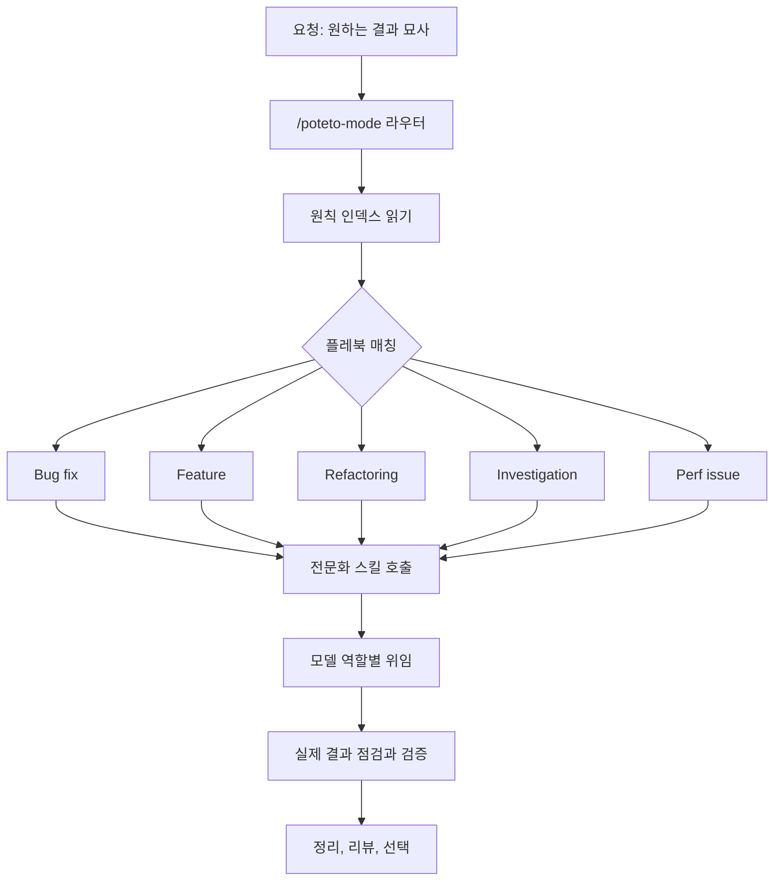

*병렬 에이전트와 메인라인 사이의 게이트로서 검증이라는 개념을 형상화했습니다.*

## 왜 읽어야 하나

코딩 에이전트를 매일 돌리는 개발자라면 이 글로 한 가지를 결정할 수 있습니다. 에이전트 산출물의 검증을 어디에 둘 것인가. 핵심 결론은 하나입니다. 에이전트를 병렬로 막는 병목은 코드 검증이고, 답은 '에이전트를 더 많이'가 아니라 '검증을 레포지토리의 일급 능력으로' 만드는 것입니다. 이 글은 Cursor 엔지니어 Lauren Tan(@poteto)이 공개한 pstack 플러그인과, 그 안에 담긴 공학 원칙을 따라 갑니다.

## 개요

이번 주 회자된 보고서에 따르면, Lauren Tan은 지난달에만 1000개 이상의 PR을 main에 머지했고 이달에도 12일 만에 800개에 육박하는 PR을 머지했다고 합니다. 대상은 수백만 개발자가 매일 쓰는 Cursor 본체 코드라, 일회성 실험이 아니라 제품 코드라는 점이 중요합니다. 배경도 이례적입니다. Meta에서 React Compiler, Netflix에서 테크 리드와 엔지니어링 매니저를 거쳐 Cursor에 온 지 5개월째이며, 첫 달은 코드베이스 숙지에 쓰였다는 설명입니다.

1시간 분량 팟캐스트에서 그녀가 반복한 진단은 하나였습니다. AI 코딩의 가장 큰 문제는 코드 생성이 아니라 코드 검증이라고 합니다. 에이전트가 제품 스스로를 실행하고, UI를 조작하고, CPU trace와 heap snapshot을 읽고, 에뮬레이터를 열어 문제를 재현하지 못하면, 결국 사람이 결과를 확인합니다. 그때 사람은 검증자(verification)가 되고, 검증자는 병렬로 늘릴 수 없는 자원이 됩니다.

월 1000개 PR은 프롬프트 트릭에서 나온 숫자가 아닙니다. 먼저 검증 능력을 설계하고, 그 뒤에 에이전트를 복제한 것에서 나온 숫자입니다. 방법론은 pstack이라는 플러그인으로 공개되었고, Flávio Copes의 심층 분석 "A deep dive into pstack"이 이 글의 1차 자료입니다.


*팟캐스트 'Are Agents About to Replace Software Engineering?'에서 Lauren Tan이 자신의 에이전트 워크플로를 설명합니다.*

## pstack은 무엇인가

pstack은 "AI 코딩 에이전트는 코드를 많이 쓸 수 있다. 그것은 유용하지만, 공학(Engineering)과는 다른 문제"를 전제로 한 Cursor 플러그인입니다. 선언된 목표는 코드 양을 줄이고, 품질을 올리며, 여러 에이전트가 병렬로 움직여도 레포지토리 전체를 어지럽히지 않을 만큼의 검증을 확보하는 것입니다.

플러그인 자체는 '프롬프트 모음'을 넘어선 규모입니다. 23개 워크플로 스킬, 21개 엔지니어링 원칙, 22개 태스크 플레북, 2개 전문 서브에이전트, 헬퍼 프로그램, 그리고 선택적 자동화 팩까지입니다. 하지만 전부 외울 필요는 없습니다. 대부분의 경우 단 한 명령, /poteto-mode만 쓰면 됩니다.

원하는 결과를 한 문장으로 설명하면 됩니다. poteto-mode는 플레북을 고르고, 태스크 리스트를 만들고, 필요한 스킬을 호출하고, 역할에 맞는 모델로 작업을 위임한 뒤, 성공을 보고하기 전에 증거를 요구합니다. 짧은 요청이 하나의 완전한 엔지니어링 워크플로로 변합니다. 버그는 Bug fix 플레북으로, 새 행동은 Feature로, 구조 변경은 Refactoring으로, 질문은 Investigation으로, 측정된 성능 저하는 Perf issue로 라우팅됩니다.

여기서 중요한 디테일이 하나 있습니다. 고른 플레북은 모델이 읽고 더 짧은 계획으로 즉흥적으로 재작성하는 게 아닙니다. 태스크 리스트에 그대로(verbatim) 복사됩니다. 모든 named 스텝이 가시적인 채로 유지되고, pstack이 무엇かを 건너뛴다면 태스크 리스트에 그 스텝을 남긴 채 이유를 기록합니다. 체크의 절반을 조용히 빠뜨리는 일이 구조적으로 일어나지 않는 것입니다.

## 아키텍처: 라우터, 플레북, 모델 역할

poteto-mode는 라우터입니다. 모든 태스크에 필요한 모든 지시를 담고 있지 않고, 작은 조각을 고른 뒤 올바른 순서로 실행합니다. 태스크 리스트의 첫 항목은 항상 원칙 인덱스(Principle Index) 읽기입니다. 그다음 요청을 플레북과 매칭하고, 전문 스킬을 호출해 모델 역할별로 위임하고, 결과를 점검·검증한 뒤 정리·리뷰·선택(Shipping)을 진행합니다.



22개 플레북은 역할로 묶어 이해하면 됩니다.

**변경 전에 이해한다.** Investigation 플레북은 읽기 전용 질문을 다룹니다. /how가 현재 시스템을 추적하고, 질문이 역사나 의도를 포함하면 /why가 추가됩니다. 출력은 아키텍처 설명입니다. 첫 번째 그럴듯한 함수를 수정하는 에이전트는 대개 증상을 고치는데, 런타임 경로를 추적하는 에이전트만이 진짜 경계를 찾을 기회를 가집니다. /why는 Git 히스토리와 PR에서 시작해 7개 증거 카테고리(소스 컨트롤, 이슈, 롱폼 문서, 팀 챗, 인프라 모니터링, 에러 트래킹, 프로덕트 분석)를 찾습니다. 각 카테고리를 한 명 조사자가 소유하고, 최종 모델이 사실을 추론과 분리해 종합합니다. 검색이 빈 경우에도 보고합니다. 설계 문서가 없다는 사실 자체가 증거이며, 그럴듯한 이유를 그 자리에서 발명하는 것보다 정직합니다.

**코드 작성과 변경.** 버그는 먼저 재현한 뒤 고칩니다. 경쟁하는 원인 가설을 세운 뒤 런타임 증거로 하나씩 없애고, 고쳤다면 원래 재현 경로에서 다시 확인합니다. 리팩터링은 기존 행동을 먼저 기록합니다. characterization 테스트, 스냅샷, 등가 스크립트 중 하나로 현재 동작을 고정하고, 그 체크가 초록인 채로 작은 단계로 구조를 바꿉니다. 성능 이슈는 trace에서 시작합니다. 베이스라인과 변경 후 결과를 비교해야 하고, '빠르게 느껴진다'는 증거가 되지 못합니다. Hillclimb는 하나의 지표를 여러 라운드에 걸쳐 올리는 플레북입니다. 각 라운드는 가설을 선언하고, 측정하고, 이긴 것은 유지하고, 잃은 것은 버립니다. Visual parity는 스크린샷에서 시작해, 0이 아닌 픽셀 차이를 실패로 봅니다.

**고치진 않고 진단한다.** Runtime forensics는 라이브 신호(CPU 프로파일, heap 스냅샷, 브라우저 trace)를 잡고, Trace forensics는 이미 누군가 잡은 산출물에서 시작해 거대한 trace를 조회 가능한 형태로 만들어 비싼 프레임이나 retention 경로로 좁힌 뒤 소스 코드로 다시 매핑합니다. 이 플레북들은 진단 요청을 조용히 수정 태스크로 바꾸지 않습니다. 원인이 알려지면 그때 새 Bug fix 또는 Perf issue 태스크를 시작합니다.

**긴 작업을 유지하고, 안전하게 다시 집는다.** Autonomous run은 하나의 태스크를 확인 가능한 조건이 만족될 때까지 굴립니다. Autopilot-full은 독립 PR의 큐를 검증과 머지를 통과시키고, Autopilot-stack은 하나의 리뷰된 스택을 만들고 최종 랜딩은 사람에게 남깁니다. Orchestrate는 며칠에 걸친 프로젝트, 여러 stacked PR, 상주 코디네이터와 에이전트 함대가 필요한 규모를 위한 선택지입니다. pstack은 이 구분을 엄격하게 봅니다. 한 세션에 에이전트 하나로 끝나는 작업에는 Orchestrate가 과합니다. Session pickup은 이전 에이전트의 상태를 트랜스크립트, 브랜치, 결정 로그에서 재구성하고, Pause safely는 원자적 경계에서 멈춰 현재 작업을 영속화하고 재개 노트를 남깁니다. 새로운 에이전트가 이전 에이전트가 어디까지 왔는지 모른다는 이유로 이미 끝난 3시간의 작업을 다시 해서는 안 됩니다.

**배달 파이프라인을 유지한다.** Babysit은 PR이나 스택을 merge-ready 상태로 몰고 갑니다. 먼저 충돌을 확인하고, 필요한 rebase를 보고한 뒤 리뷰 스레드와 CI를 처리합니다. Shipping은 별개의 태스크입니다. 새 에이전트로 각 PR을 검증하고, 과거의 판정이 현재 커밋을 여전히 설명하는지 확인하고, 검증된 연속된 부분만 랜딩합니다. 이 분리는 의도된 것입니다. 초록인 PR은 머지 결정을 받을 준비가 된 상태이지, 머지 허가(Permission)가 아닙니다.

디자인 스킬은 /architect와 /arena입니다. /architect는 구현 파일이 아니라 호출자(caller) 사용에서 시작합니다. 다섯 단계로 운영됩니다. 문제를 고정하고, 여러 형태를 스케치하고, 체크포인트를 원하면 승인받은 뒤 구현을 시작하며, 반복되는 마찰이 스케치가 틀렸다고 증명하면 버리고 다시 설계합니다. /arena는 같은 태스크를 여러 모델에 줍니다. 각 후보는 자기 worktree에 쓰고, 고려한 대안과 거절한 이유를 설명합니다. 코디네이터가 비공개 rubric을 만들고, 별개 모델이 모든 후보를 채점하고, 코디네이터는 모든 결과를 처음부터 끝까지 읽습니다. 그다음 한 후보를 기준으로 고르고, 나머지 후보의 가장 강한 아이디어를 끌어옵니다. 이것은 투표가 아닙니다. 한 후보가 이기면서 다른 후보가 더 나은 에러 모델이나 더 작은 인터페이스를 기여할 수 있습니다. 모든 후보가 같은 형태로 수렴한다면 그 합의 자체가 유용한 증거이고, 완전히 갈린다면 프롬프트가 under-specified였다고 보고 더 명확한 brief로 재실행합니다. /interrogate는 멀티모델 리뷰입니다. 같은 diff를 여러 모델에 보내고, 리드 리뷰어가 발견 사항을 act on, consider, noted, dismissed 네 그룹으로 정리합니다. dismissed 섹션도 결과의 일부입니다. 리뷰 에이전트의 노이즈가 보이려면 거절한 것과 그 이유가 함께 보여야 하며, 그러면 '이상한 필터 리스트'를 받아들이는 대신 판단을 뒤집을 수 있습니다. 이 스킬은 변경을 자동으로 적용하지 않습니다.

## 21개 원칙

pstack에는 21개의 작은 원칙 스킬이 들어 있습니다. poteto-mode는 그 중 짧은 인덱스를 자기 파일 안에 갖고, 여러 단계 작업을 시작할 때 그 인덱스를 읽습니다. 태스크가 원칙을 트리거하면 전체 스킬을 열어 적용합니다. 어떤 원칙은 코드를 줄입니다. Laziness Protocol은 삭제를 선호하고 가장 작은 완전한 변경을 고르며, Subtract Before You Add는 새 디자인을 도입하기 전에 죽은 경로를 제거하고, Minimize Reader Load는 레이어와 숨겨진 상태를 줄입니다. 어떤 원칙은 아키텍처를 모양냅니다. Model the Domain은 흩어진 조건들을 하나의 명시적 구조로 바꿨으며, Boundary Discipline는 외부 데이터를 경계에서 검증하고 내부 로직을 깨끗이 유지하며, Make Operations Idempotent는 재시도가 같은 결과로 수렴하게 만듭니다. 그리고 어떤 원칙은 증명을 정의합니다. Prove It Works는 실제 산출물을 확인하고, Fix Root Causes는 증상을 그 메커니즘까지 추적하며, Sequence Work into Verifiable Units는 작은 스텝을 체크로 끝냅니다.

원칙은 명령으로 호출되지 않습니다. 현재 실행을 조타할 때 그 이름을 씁니다. "apply prove it works. 실제 import 플로우를 실행하고, 쓰인 레코드를 점검하라." 그러면 응답은 그 원칙이 어떤 결정을 바꿨는지 이름을 올려야 합니다. 원칙 이름만 반복하는 것은 증거가 되지 못합니다.

## 검증은 일급 시민

pstack의 핵심은 여기 있습니다. '빌드가 통했으니까'를 완전한 증거로 거릅니다. 검증은 변경된 대상과 일치해야 합니다. 커맨드라인 변경은 실제 커맨드를 실행하고, UI 변경은 바뀐 플로우를 실제 경로로 걷고, 마이그레이션은 실제 입력을 재실행하고, 성능 변경은 trace를 비교하고, 스토리지 변경은 값을 다시 읽어 올 수 있어야 합니다.

레포지토리에 그런 검증의 확실한 방법이 없다면, pstack은 하나를 만듭니다. /create-verification-skill이 레포지토리를 조사해 프로젝트 로컬의 verify-<app> 스킬을 씁니다. 생성된 스킬에는 다섯 가지 일의 정확한 지시가 들어 있습니다. 앱을 기동하고, 인스턴스가 건강한지 확인하고, 사용자 행동(behavior)을 굴리고, 증거를 잡고, 검증이 시작한 것만 정리합니다. 이 스킬과 함께 feature map을 만듭니다. 각 기능은 사용자가 어떻게 도달하는지, 에이전트가 어떻게 조작하는지, 어떤 관찰 가능한 상태가 그것이 잘 작동하는지 증명하는지를 기록합니다. 스킬을 넘기기 전에, pstack은 그 스킬을 처음부터 끝까지 한 번 실행해 봅니다. /maintain-verification-skill은 매핑된 각 기능을 현재 소스와 비교하고 라이브 패스(Execution)를 한 번 돌립니다. 검증 스킬을 업데이트할 수는 있지만, 제품 버그를 문서 편집으로 숨기지는 못합니다.

Flávio Copes도 자기 글에서 이 부분을 특히 좋아했습니다. "verify it"이 레포지토리의 능력이 되기 때문입니다. 앞서 짚은 검증자 병목에 대한 답이 정확히 여기 있습니다. 에이전트가 Chrome DevTools나 에뮬레이터로 제품을 실제로 굴리고, feature map이 각 기능이 어디에 있고 어떻게 도달하는지를 알려준다면, 동료가 스크린샷 한 장이든, 모호한 버그 설명 한 마디이든 던져주면, 에이전트가 해당 기능을 찾아 재현하고 수정을 검증할 수 있습니다.

에이전트의 실패 모드는 스킬로 전환됩니다. 그녀가 팟캐스트에서 설명한 방식입니다. 에이전트가 추측하거나, 코드를 놓치거나, 잘못된 방향으로 갈 때마다 그 실패를 하나의 스킬로 씁니다. 그리고 그 스킬을 코드처럼 테스트합니다. 여러 서브에이전트가 같은 태스크를 각각 수행하고, 코디네이터가 rubric을 만들고, 다른 모델이 채점을 크로스체크하며, 결과가 충분히 안정할 때까지 반복합니다. pstack 안의 23개 스킬과 21개 원칙은 그 반복이 축적된 결과물입니다.

## 모델 역할과 병렬 실행

pstack은 모델 강도(Strength)로 일을 나눕니다. /setup-pstack은 계정에서 쓸 수 있는 모델을 탐지하고, 역할(implementation, investigation, judgment, review)에 배정합니다. 번들 기본값은 정밀하게 지정된 코드를 Sol로 보내고, 빠른 기계적 작업을 Grok으로, 판단과 산문(Prose)을 Fable로 보냅니다. 리뷰 패널은 그 모델들과 Opus를 섞습니다. 패널 역할에 등록된 모델 개수가 pstack이 띄우는 리뷰어 또는 후보의 수가 됩니다. 역할에 auto 또는 inherit-parent를 두면 부모 채팅의 모델을 물려받습니다.

pstack이 Cursor와 가장 잘 맞는 이유가 바로 이것입니다. pstack은 다른 작업에 다른 모델을 원하고, Cursor는 하나의 태스크 안에서 서브에이전트마다 다른 모델을 배정할 수 있습니다. 스킬 자체는 SKILL.md 파일이라, Claude Code나 Codex 같은 다른 코딩 에이전트에서도 그대로 로드됩니다. Claude Code 포트가 원한다면 pstack-claude가 있습니다. 공식 패키지는 아니라서 Cursor 전용 부분, 즉 서브에이전트별 모델 배정과 /loop, 플러그인 셋업은 잃습니다. 플레북과 원칙, /how, /why, /interrogate는 지시(Instruction)이지 Cursor API가 아니므로 여전히 의미 있습니다.

## 자는 동안 굴리기

긴 자율 작업은 종료 조건(Finish Condition)이 필요합니다. "4시간 이걸로 일해"는 움직임(Motion)을 측정합니다. "오래된 호출자가 0개가 되고 모든 파서 픽스처가 통과할 때까지 멈춰라"는 결과(Outcome)를 측정합니다. 완전한 overnight 요청은 이렇게 생겼습니다.

```
/poteto-mode 자러 간다. 새 worktree에서 모든 호출자를 새 파서로 마이그레이션해.
완료란 오래된 호출자가 0개이고, 모든 파서 픽스처가 통과하고, 옛 API가 삭제된 상태다.
결정 로그를 남겨라. 커밋 전에 물어보지 마라.
/loop until done. 진짜 막힌 곳이면 멈추고 설명하라.
```

각 반복은 같은 패턴을 따릅니다. 종료 조건을 확인하고, 근거 있는 변경 하나를 만들고, 실제 결과를 검증하고, 좋아지면 유지하고 커밋하고, 아니면 버리고, 결정 로그에 한 줄을 씁니다. 결정 로그는 TSV 파일이며, 각 줄은 시각, 단계, 결정, 이유, 증거, 결과를 기록합니다.

그녀는 이제 에이전트의 자동 머지(Auto Merge)까지 허용한다고 합니다. 어떤 아침에는 일어나자마자 20개 PR이 이미 main에 자동 들어와 있었고, main에서 직접 점검한 결과 문제 없었습니다. 그 아침을 가능하게 한 전제는, 20개 PR 앞에 실행된 검증 루프와 Shipping 플레북의 '새 에이전트가 검증한 연속 부분만 랜딩' 규칙이었습니다.

## ThakiCloud 제품 적용 시사점

Paxis는 ThakiCloud의 Agent-Native Cloud로, 스킬·도구·정책·감사 로그를 일급 리소스로 다룹니다. pstack은 한 엔지니어가 Cursor 안에 손수 만든 동일한 사상의 버전이라고 읽을 수 있습니다.

첫째, 검증이 게이트(Verification Gate)인 구조입니다. Paxis의 에이전트 행동은 정책 게이트와 감사 로그를 통과하며, pstack의 /interrogate와 Shipping 플레북은 '새 에이전트가 검증한 뒤에야 랜딩'이라는 동일한 모양을 프로젝트 로컬에서 구현합니다. pstack의 feature map은 각 기능이 어떻게 도달되는지, 어떻게 조작되는지, 어떤 관찰 가능한 상태가 작동 증명이 되는지를 기록하는 계약입니다. Paxis의 스킬이 실행 가능하게 될 때 가져야 할 형태와 같은 구조입니다.

둘째, 실패 모드를 스킬로 축적하는 방식입니다. Paxis의 skill harness가 BM25로 요청을 적절한 스킬에 라우팅할 때, 스킬의 원천은 누적된 실패 모드와 검증된 워크플로입니다. pstack의 23개 스킬과 21개 원칙은 한 사람의 판단이 외부화된 결과이고, 플랫폼의 가치는 그 외부화를 팀 전체에서 공유하고 버전 관리와 감사할 수 있다는 점입니다.

셋째, 모델 역할 분담입니다. /setup-pstack이 implementation, investigation, judgment, review 역할에 각기 모델을 배정하는 것은, Paxis의 워크로드 라우팅이나 Metis의 모델 라우팅이 플랫폼 규모로 하는 것과 같은 논리입니다. 다른 작업에 다른 모델을 쓰는 방식은 사용량에서 증명된 방향입니다.

## 한계 및 반론

먼저, 숫자는 보고(Report) 기준입니다. "월 1000개 PR"이라는 수치는 팟캐스트에 대한 2차 요약에 근거합니다. PR의 크기 분포, 즉 작은 변경인지 큰 기능인지,는 공개되어 있지 않습니다. 머지 개수보다 그 분포를 알아야 공학적 가치를 판단할 수 있습니다.

둘째, pstack은 Cursor 중심입니다. 서브에이전트별 모델 배정과 /loop는 Cursor 전용이고, Claude Code 포트에서는 그 형태를 잃습니다. 플레북과 원칙은 건너가지만, 멀티모델 실행의 "그릇"은 바뀝니다.

셋째, 이 메커니즘에는 비용이 있습니다. pstack은 하나의 태스크에 여러 에이전트를 시작할 수 있고, 전부 frontier 모델을 쓰면 토큰 비용이 빠르게 쌓입니다. Flávio Copes조차 모든 변경에 전체 워크플로를 쓰지는 않는다고 합니다. 날짜 하나를 옮기거나, 문장 하나를 고치거나, 설정값 하나를 바꾸는 작업에는 여러 모델과 아키텍처 arena와 결정 로그와 검증 스킬이 필요 없습니다. 월 1000개 PR은 매일 대형 제품 코드베이스에서 일하는 엔지니어의 숫자이며, 그 워크플로의 경제학은 다른 레포지토리에서는 성립하지 않을 수 있습니다.

넷째, 이것은 한 사람의 스타일입니다. pstack은 Lauren Tan의 엔지니어링 스타일을 인코딩했고, 플러그인 스스로도 그 스타일이 보편이라고 주장하지 않습니다. 최근 트랜스크립트에서 자기만의 개인 모드(personal mode)를 생성해 주는 /automate-me이 존재하는 것 자체가 그 인정입니다.

## 정리

AI 코딩의 병목은 생성이 아니라 검증입니다. 에이전트가 결과를 스스로 검증하지 못하면 사람이 직렬 검증자가 되고, 에이전트를 아무리 늘려도 처리량(Throughput)은 오르지 않습니다. pstack의 답은 검증을 레포지토리의 능력으로 만드는 것, 즉 변경된 대상과 일치하는 검증 스킬과 feature map을 먼저 세우고, 실패 모드를 테스트 가능한 스킬로 축적하고, 그 뒤에야 에이전트를 복제하는 것입니다.

이 글에서 하나만 가져가시라고 한다면, 이것입니다. 에이전트를 병렬로 늘리기 전에, "이 변경을 어떻게 검증하나"를 자기 레포지토리가 답할 수 있는지 확인하세요. 답할 수 없다면 첫 번째 태스크는 에이전트를 더 쓰는 것이 아니라, 검증 루프를 짓는 것입니다.

## 출처

- Flávio Copes, "A deep dive into pstack" (2026-08-21): https://flaviocopes.com/pstack/
- YouTube, "Are Agents About to Replace Software Engineering? | Lauren Tan and Roshan Sadanani": https://www.youtube.com/watch?v=A63sedG-p5Q
- Michael Guo(@Michaelzsguo) 게시글 (2026-08-26, 팟캐스트 2차 요약): https://x.com/Michaelzsguo/status/2092578668316864525
