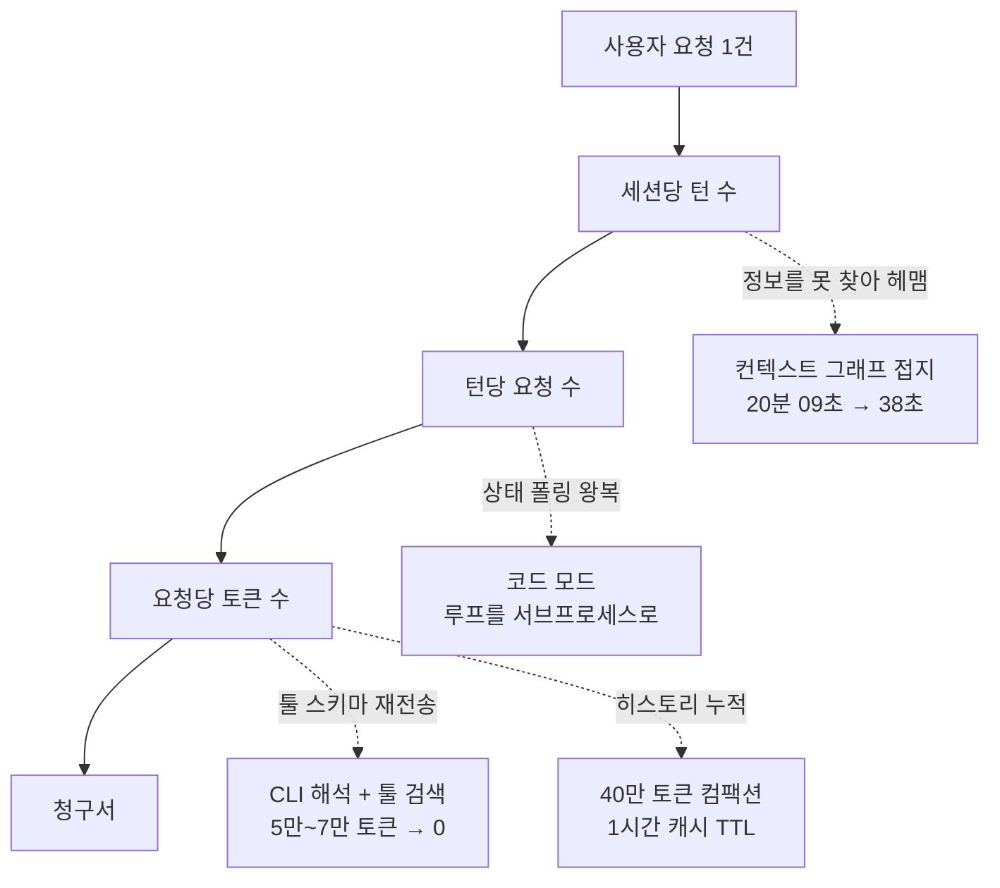

## 왜 읽어야 하나

사내에 코딩 에이전트를 깔아 놓고 다음 달 청구서를 보면서 이걸 계속 쓸 수 있을지 고민하는 플랫폼 엔지니어와 엔지니어링 리더를 위한 글입니다. 결론을 먼저 말씀드리면, 에이전트 비용은 모델 단가를 깎아서 줄어들지 않습니다. 에이전트가 사용자의 요청과 무관하게 스스로 만들어내는 토큰을 걷어낼 때 줄어듭니다.

Uber가 2026년 8월 27일에 공개한 숫자가 그 명제를 뒷받침합니다. 2월부터 8월까지 주간 활성 사용자는 7배, 주간 에이전트 요청은 9.4배 늘었는데 AI 총지출은 4월 이후로 거의 평평합니다. 모델 업그레이드 효과를 제거하려고 같은 모델을 고정해서 다시 재보니, 요청 1,000건당 비용이 정점 대비 34% 낮아졌고 세션당 비용은 6월 고점 대비 52% 낮아졌습니다. 쓰는 양이 9배가 되는 동안 단위 비용이 절반이 된 것입니다.

에이전트가 쓰는 것의 대부분은 사용자의 요청에 닿지 않습니다.

## 비용은 여섯 개 항의 곱이고, 그중 셋만 내 것입니다

Uber는 에이전트 세션 하나의 비용을 여섯 개 항의 곱으로 분해합니다. 사용자 수, 사용자당 세션 수, 세션당 턴 수, 턴당 요청 수, 요청당 토큰 수, 토큰당 가격입니다. 이 분해가 유용한 이유는 각 항의 성격이 전부 다르기 때문입니다.

앞의 두 항인 사용자 수와 세션 수는 줄이면 안 되는 항입니다. 그건 도입이 실패했다는 뜻이니까요. 마지막 항인 토큰당 가격은 벤더가 정하므로 내가 만질 수 없습니다. 고를 수 있는 것은 어느 작업에 어느 모델을 붙이느냐뿐입니다.

그래서 실제로 최적화할 수 있는 지점은 가운데 세 항, 즉 턴 수와 요청 수와 토큰 수입니다. 이 셋의 공통점은 **사용자가 시킨 일이 아니라 에이전트가 자기 사정으로 하는 일**이라는 점입니다. 툴 목록을 매번 다시 읽는 것, 결과를 기다리며 상태를 다섯 번 물어보는 것, 파일이 어디 있는지 몰라서 스무 번 뒤지는 것은 전부 사용자가 요청한 적 없는 작업입니다. Uber의 최적화 노력이 거의 전부 이 세 항에 몰려 있는 것도 그래서입니다.

에이전트 비용이 새는 지점과 각각의 처방입니다. 줄일 수 있는 항은 전부 사용자가 시키지 않은 일에서 나옵니다.

## 툴 스키마가 매 턴 청구되는 문제

가장 크고 가장 안 보이는 누수는 MCP 툴 스키마입니다.

MCP는 연결된 모든 서버의 툴 정의를 세션 시작 시점에 컨텍스트로 밀어 넣습니다. 이번 세션에서 그 툴을 한 번이라도 쓸지 여부와 무관하게 전부 들어갑니다. Uber 기준으로 툴이 100개쯤 되면 초기 프롬프트에 5만에서 7만 토큰이 스키마로만 얹힙니다. 그리고 대화가 이어지는 내내 매 턴 다시 전송됩니다. 사용자가 첫 글자를 입력하기도 전에 지불이 시작되는 셈입니다.

써드파티 SaaS는 더 심합니다. 벤더는 어느 고객이 어떤 기능을 쓸지 예측할 수 없으니 제품의 전체 표면을 노출하도록 서버를 설계합니다. Uber가 든 예를 보면 워크스페이스 제품군 하나가 툴 49개에 스키마 2만 2천 토큰입니다. 메시징과 프로젝트 추적 벤더는 각각 34개와 46개를 싣고 옵니다. 이런 서버를 두세 개만 붙이면 에이전트는 지금 편집하고 있는 파일보다 툴 설명서를 더 많이 들고 다니게 됩니다.

Uber의 처방은 MCP를 없애는 것이 아니라 **모델 앞에서 치우는 것**입니다. 사내외 1,000개가 넘는 MCP 서버를 게이트웨이 하나 뒤로 모아 인증과 정책을 중앙화한 뒤, 그 게이트웨이를 두 가지 방식으로 모델에 노출합니다. 하나는 CLI 해석입니다. 모델은 셸 명령 하나를 실행하고 CLI가 호출 시점에 게이트웨이에서 툴을 찾아 붙입니다. 세션 컨텍스트에서 MCP 스키마가 통째로 사라집니다. 다른 하나는 툴 검색입니다. 모델이 카탈로그를 검색해 필요한 툴만 그때 로드합니다. 카탈로그가 수천 개로 커져도 선택 정확도가 유지됩니다. 큰 툴 집합에서 흔히 나타나는 선택 품질 저하도 함께 완화됩니다.

여기서 중요한 것은 MCP의 위치가 바뀌었다는 점입니다. MCP는 백엔드를 붙이는 통합 계층으로 남습니다. 에이전트 앞에 서는 것은 CLI와 툴 검색과 코드 모드 스킬입니다. MCP가 느리다거나 에이전트답지 않다는 오래된 불만에 대한 답이 사실상 이 재배치입니다.

## 코드 모드는 폴링 루프를 모델 밖으로 밀어냅니다

툴이 셸 명령으로 노출되면 그다음 문이 열립니다. 모델이 여러 동작을 스크립트 하나에 묶을 수 있게 되는 것입니다.

표준 MCP 흐름에서는 동작 하나가 모델 턴 하나입니다. SQL 쿼리 한 번을 실행하려면 요청을 보낸 뒤 상태를 두 번에서 다섯 번 물어보고 마지막에 결과를 받아옵니다. 중간 응답은 전부 컨텍스트에 쌓입니다. 그리고 쌓인 컨텍스트는 이후 모든 턴에서 다시 청구됩니다. 코드 모드는 그 루프를 파이썬 스크립트 안으로 넣어 서브프로세스에서 돌립니다. 모델에게 돌아오는 것은 최종 요약뿐입니다.

Uber가 같은 세션에서 동일한 SQL 다섯 개를 양쪽 경로로 돌려 잰 결과입니다.

| 쿼리 | MCP 툴 사용 | 코드 모드 | 절감 |
|---|---|---|---|
| SELECT 1 (1행) | 903 | 402 | 55% |
| COUNT(*) (1행) | 954 | 403 | 58% |
| GROUP BY LIMIT 20 | 1,600 | 457 | 71% |
| SHOW COLUMNS (175행) | 2,200 | 900 | 59% |
| 넓은 테이블 SELECT * | 1,431,594 | 900 | 약 100% |

앞의 세 줄이 핵심입니다. 결과가 한 행뿐이라 응답 크기 제한에 걸릴 일이 전혀 없는 쿼리에서도 절반 이상이 줄었습니다. 큰 데이터 페이로드를 우회해서 나온 절감이 아니라는 뜻입니다. 스키마 초기화, 여러 턴에 걸친 폴링, 단계마다 반복되는 추론처럼 **작업 자체와 무관한 오버헤드**가 사라진 결과입니다. 마지막 줄은 다른 이야기입니다. 143만 토큰이 900 토큰이 된 것은 애초에 모델 컨텍스트에 들어가면 안 되는 데이터가 들어가고 있었다는 신호입니다.

여러 건을 처리하는 워크플로에서는 효과가 곱해집니다. N번의 모델 턴이 될 일이 스크립트 하나가 되면서 90%가 넘게 줄어듭니다. Uber는 자주 쓰는 MCP 서버에 대해 코드 모드 스킬을 25개 넘게 미리 만들어 두고 표준 워크플로가 기본적으로 가장 싼 경로를 타도록 했습니다.

## 헤매는 에이전트가 가장 비쌉니다

접지되지 않은 에이전트는 싸게 실패하지 않고 느리게 실패합니다. 한 군데만 더 찾아보자면서 점점 커진 컨텍스트를 계속 다시 보냅니다.

Uber는 코드가 수억 줄이고 테이블이 수천 개인 환경에서 에이전트가 코드를 생성하는 시간보다 정보를 찾는 데 훨씬 많은 턴을 쓴다고 판단했습니다. 그래서 서비스, 팀, 인시던트 로그, 풀 리퀘스트, 설계 문서, 배포, 데이터셋, 과거 테이블 사용 쿼리를 잇는 AI 컨텍스트 그래프를 만들었습니다. 30개가 넘는 내부 시스템을 통합해 노드 2,400만 개와 엣지 8,000만 개, 노드 타입 86종과 엣지 타입 117종으로 구성했습니다. 어떤 에이전트든 자연어로 질의할 수 있습니다.

같은 프롬프트를 같은 모델에 던진 비교가 인상적입니다. 그래프에 접지된 에이전트는 과거 사용 이력을 조회해 분석가 50명 이상이 실제로 쓰는 테이블을 짚어 38초 만에 답했습니다. 접지되지 않은 에이전트는 그 테이블의 존재를 몰라서 20분 9초 동안 서비스 코드를 뒤지고 서브에이전트 두 개를 띄우고 오류를 세 번 낸 끝에, 그 데이터셋은 조회할 수 없다는 틀린 결론을 냈습니다.

이 사례가 말하는 것은 두 가지입니다. 첫째, 접지는 품질 개선이면서 동시에 비용 절감입니다. 32배 빠른 답이 32배 싼 답이기도 합니다. 둘째, 접지 없는 에이전트는 비싸게 틀립니다. 20분을 쓰고도 답이 틀렸다는 점이 이 비교에서 가장 무서운 부분입니다.

## 기본값 두 개가 생각보다 크게 움직입니다

나머지 레버는 설정 기본값입니다. 화려하지 않은 대신 전 조직에 한 번에 적용됩니다.

컴팩션 임계값이 첫 번째입니다. Uber는 컨텍스트 창이 100만 토큰인 모델에도 40만 토큰에서 자동 컴팩션을 겁니다. 창이 크다고 끝까지 채우는 것이 아니라, 매 턴 재전송되는 비용과 캐시 버스트를 기준으로 임계를 잡았습니다. 추론 강도도 기본을 중간으로 낮췄습니다. 내부 추론 토큰을 포함한 출력 토큰은 주요 모델에서 입력 토큰의 몇 배로 과금되므로, 이 조정은 가장 비싼 토큰 항목을 직접 건드립니다.

캐시 TTL이 두 번째입니다. 매 턴 전체 히스토리를 다시 보내므로 앞선 컨텍스트를 캐시해 두면 이후 읽기가 표준 입력 단가의 0.1배로 떨어집니다. 다만 쓰기 프리미엄이 다릅니다. 5분 캐시는 1.25배, 1시간 캐시는 2배입니다. 그래서 최적 TTL은 턴 사이의 간격이 결정합니다. 엔지니어는 대화형 세션을 5분 넘게 방치하는 일이 잦아 접두 캐시가 계속 무효화되고 있었기 때문에, Uber는 대화형 세션을 1시간 TTL로 옮기고 짧게 끝나는 서브에이전트만 5분에 남겨 두었습니다.

서브에이전트 기본 모델도 여기 속합니다. 메인 모델이 작업을 분해하고 평가하는 동안 서브에이전트는 입력이 명확한 정의된 작업을 수행하므로 프런티어급 추론이 대부분 필요 없습니다. Uber는 서브에이전트 기본값을 더 저렴한 모델로 두고 수동 오버라이드만 열어 두었는데, 대화형 환경에서 가장 효과가 큰 레버였다고 말합니다.

## 우리 저장소에서도 같은 숫자가 나왔습니다

이 글의 결론이 남의 회사 이야기로만 읽히지 않는 이유는, 저희가 사내 에이전트 하네스를 두고 독립적으로 잰 값이 같은 방향을 가리키기 때문입니다.

2026년 8월 9일 저희 세션 원장을 분석했을 때 비용과 메인 스레드 턴 수의 상관계수는 0.99였습니다. 반면 비용과 팬아웃 폭의 상관계수는 0.41에 그쳤습니다. 팬아웃 유무와 무관하게 턴당 비용은 평평했습니다. 지출 구성을 보면 캐시 읽기가 57%, 출력이 9%였습니다. 많이 생성해서 비싼 것이 아니라 뚱뚱한 컨텍스트를 매 턴 다시 보내서 비쌌다는 뜻입니다. 상주 컨텍스트는 오케스트레이터 세션이 32만 2천 토큰, 일반 세션이 21만 5천 토큰이었습니다.

Uber가 안티패턴 대시보드에서 잡아내는 항목 중에 사용자 입력 전에 시스템 지시와 툴 정의로 10만 토큰을 미리 채우는 패턴이 있는데, 저희는 같은 함정을 더 심한 형태로 밟고 있었습니다. 2026년 8월 16일에 잰 서브에이전트 기준선이 18만 6,357 토큰이었습니다. 저렴한 모델의 20만 토큰 창을 기준으로 하면 한 글자도 보내기 전에 93%가 이미 차 있었습니다. 남은 여유는 1만 4천 토큰이었습니다. 헤드리스 경로는 21만 7천 토큰이라 아예 시작조차 되지 않았습니다. 원인은 노출된 스킬 목록이 자체적으로 거대해진 것이었습니다.

같은 병입니다. 저희는 근무 시간과 머신에 따라 스킬 노출을 게이팅하는 방식으로, Uber는 MCP 스키마를 CLI 뒤로 치우는 방식으로 대응했습니다. 접근은 달라도 진단은 하나입니다. 컨텍스트에 상주하는 것은 전부 매 턴 임대료를 냅니다.

## ThakiCloud 제품 적용 시사점

이 글의 비용 등식은 다키클라우드가 제품을 배치한 방식과 정확히 겹칩니다.

가운데 세 항, 즉 턴과 요청과 토큰은 **Paxis**가 소유합니다. Paxis는 기업의 디지털 업무를 에이전트로 자동화하는 제어 평면입니다. Skills와 Tools와 Policies와 Audit Logs를 일급 리소스로 다룹니다. Uber가 CLI 해석과 툴 검색으로 푼 문제를 Paxis는 스킬 하네스로 풉니다. 수백 개 스킬을 전부 컨텍스트에 얹는 대신 검색으로 필요한 것만 올립니다. MCP 커넥터는 정책 게이트와 감사 로그 뒤에 둡니다. 코드 모드가 폴링 루프를 서브프로세스로 밀어내는 것과 같은 이유로 Paxis는 결정론적으로 처리할 수 있는 절차를 모델에게 시키지 않고 스킬 코드가 소유하게 합니다. 판단은 모델이 하고 반복은 코드가 합니다.

마지막 항인 토큰당 가격은 **Metis**가 소유합니다. Uber가 벤더 단가를 못 바꾸고 모델 선택만 할 수 있다고 말한 것은 외부 API를 쓰기 때문입니다. 추론을 직접 서빙하면 그 항이 다시 협상 가능해집니다. Metis는 vLLM 기반 서빙과 양자화, 서버리스 스케일 투 제로로 워크로드마다 비용과 품질의 파레토 지점을 고르게 합니다. 저희 실측에서 서빙 설정 두 개를 바꾸는 것만으로 단일 스트림 처리량이 18.8배, 포화 처리량이 17.9배 차이가 났습니다. 같은 체크포인트와 같은 GPU에서 서빙 설정만 달랐을 때의 값입니다. 벤더 API 뒤에 있으면 볼 수 없는 종류의 여유입니다.

둘을 겹치면 그림이 완성됩니다. Metis는 토큰을 싸게 만듭니다. Paxis는 그 토큰을 덜 쓰게 만듭니다. 온프렘과 폐쇄망 요구가 있는 고객이라면 **Aegis** 위에 같은 구조를 그대로 얹을 수 있습니다. 데이터가 외부로 나가지 않으면서도 위 최적화는 전부 유효합니다.

## 한계 및 반론

Uber의 숫자를 그대로 우리 조직에 대입할 수는 없습니다. Uber 스스로 명시하듯 절감폭은 코드베이스 규모와 팀 크기와 워크플로에 따라 달라집니다. 재사용할 수 있는 것은 34%나 52%라는 값이 아니라 실제 업무로 벤치마크를 만들고 정확도와 비용을 함께 최적화하는 방법론 쪽입니다.

컨텍스트 그래프는 특히 조심해서 읽어야 합니다. 노드 2,400만 개짜리 그래프는 30개 넘는 내부 시스템이 이미 잘 정리돼 있고 그것을 이을 팀이 있을 때 나오는 산출물입니다. 시스템이 열 개도 안 되는 조직이 같은 것을 만들려 하면 그래프 구축 비용이 절감액을 넘습니다. 접지의 원리는 보편적이지만 구현 규모는 아닙니다.

관리형 에이전트로의 전환에도 대가가 있습니다. 플랫폼이 모델 라우팅과 실행 하네스를 통제하면 비용은 예측 가능해지지만 개별 엔지니어의 자유도는 줄어듭니다. Uber가 상한 대신 실시간 지출 가시성과 슬랙 알림과 승인 흐름을 택한 것도 이 긴장 때문으로 보입니다. 강제 상한은 관리하기 쉽지만 급한 사람을 막습니다.

마지막으로 이 글의 숫자는 전부 Uber의 자체 보고입니다. 벤더 비교 부분은 공개 정보 기준이라고 명시돼 있지만, 절감폭 자체는 외부 검증을 거친 값이 아닙니다. 방향은 우리 자체 측정과 일치하지만 크기까지 그대로 믿을 근거는 없습니다.

## 정리

에이전트 비용을 낮추는 일은 결국 엔지니어링 문제입니다. 더 싼 모델로 내려가거나 도구를 덜 쓰게 만드는 대신, 가치를 만들지 않는 토큰을 찾아내 제거하는 쪽이 이깁니다. Uber는 그렇게 해서 사용량을 7배로 키우면서 단위 비용을 전 지표에서 낮췄고 품질은 유지하거나 개선했습니다.

당장 해볼 것을 하나만 고른다면 지금 쓰는 에이전트의 세션 시작 컨텍스트를 재보시길 권합니다. 사용자가 첫 프롬프트를 입력하기 전에 툴 정의와 시스템 지시로 몇 토큰이 이미 차 있는지 세어 보면, 그 숫자가 매 턴 반복해서 청구되고 있다는 사실이 바로 보입니다. 저희는 그 값이 18만 6천이었습니다. 재고 나서야 이 글의 나머지가 남의 회사 이야기로 읽히지 않았습니다.

<!-- nlm-visual -->

*NotebookLM이 소스를 종합해 생성한 인포그래픽입니다.*

## 출처

- [Running a Software Factory Efficiently at Uber Scale](https://www.uber.com/us/en/blog/efficient-software-factory/), Uday Kiran Medisetty, Uber Engineering, 2026년 8월 27일
- 사내 세션 원장 분석(2026-08-09) 및 헤드리스 컨텍스트 프로브 실측(2026-08-16), 다키클라우드 내부 자료
