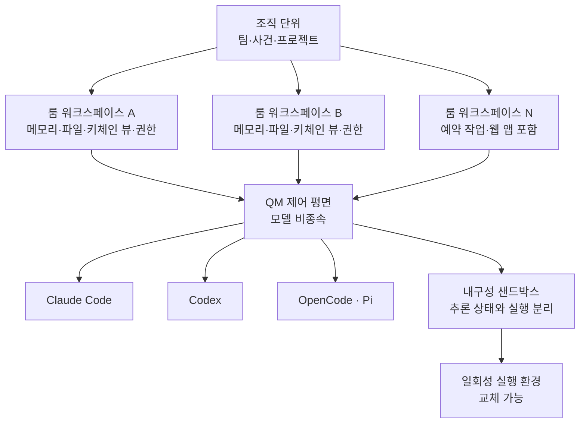

*글의 핵심 개념을 형상화했습니다. 제어 평면 위에 격리된 워크스페이스 층이 쌓이고, 그 아래 모델 레이어는 교체 가능하다는 구조.*

## 왜 읽어야 하나

에이전트 플랫폼을 구축하거나 기업 내 에이전트를 운영해야 하는 엔지니어와 의사결정자를 위한 글입니다. Y Combinator가 2026년 9월 7일 공개한 패널에서, 같은 모델 가중치를 약한 하네스와 강한 하네스로 각각 실행했을 때 ARC-AGI 점수가 약 30퍼센트와 약 95퍼센트(95.5)로 갈린 사례가 중심에 있었습니다. 결론부터 말하면, 에이전트 성능의 차이가 모델이 아니라 하네스 구현의 품질에서 나온다는 것이 창업 액셀러레이터의 생산 환경에서 검증된 명제가 되었고 YC는 그 주장의 증거로 자사 하네스 QM을 MIT 라이선스로 공개했습니다.

## 무슨 일이 있었나

YC의 공식 계정은 "하네스는 스캐폴딩으로, 프롬프트 엔지니어링으로 치부되며 진짜 연구가 아니다라는 취급을 자주 받는다. 그러나 그것은 사실이 아닐 수 없다"는 긴 트윗을 올렸고 하루 만에 28만 조회를 기록했습니다. 같은 날 열린 하네스 패널에서는 ARC-AGI, 로컬 개인 AI를 다루는 OpenJarvis, 강화학습 기반의 Prime Agent가 소개됐습니다.

패널의 핵심 실험은 통제변수가 하나뿐인 비교입니다. 모델 가중치는 동일하고(예로 Claude Opus가 거론됨), 바뀌는 것은 하네스 구성뿐입니다. 컨텍스트 캐싱의 수준, 에이전트 간 메시지 전달, 샌드박스 선택, 예시 설계. 이 변수들이 바뀌자 ARC-AGI 점수가 30퍼센트 부근에서 95퍼센트 부근으로 이동했습니다. 같은 모델이 다른 점수를 받는 것은, 점수 중 상당 부분이 모델과 세계를 잇는 층에서 결정된다는 뜻입니다.

그런데 YC가 들고 나온 증거가 실험실에서 끝나지 않는 이유가 있습니다. QM은 이미 2026년 7월 31일에 MIT 라이선스로 공개된, YC가 자기 회사를 돌리는 데 쓰고 있는 하네스입니다. 회계와 법률, 이벤트, 엔지니어링 팀에 걸쳐, 2차 보도가 전한 대로 약 50개의 내부 에이전트가 QM 위에서 동작하고 QM 자체도 에이전트의 도움을 받아 구축됐다고 합니다. 주장을 하는 조직이 동시에 그 주장을 운영 중인 조직인 셈입니다.

## QM이 무엇인가

QM(Quartermaster)은 멀티플레이어 에이전트 하네스입니다. 한 회사가 여러 사람, 여러 채널, 여러 에이전트를 동시에 돌리는 구조를 전제로 설계되었습니다.

격리의 단위부터가 다릅니다. QM은 직원별로, 그리고 Slack 룸(채널)별로 격리되고 스코프가 정해진 워크스페이스를 만듭니다. 각 워크스페이스는 자기만의 메모리와 파일, 키체인 뷰, 권한, 예약 작업(cron), 웹 앱, 그리고 내구성(durable) 샌드박스를 갖습니다. "룸"이라는 개념이 중요한 이유는, 에이전트의 기억과 권한이 개인 단위가 아닌 협업의 단위(프로젝트, 팀, 사안)로 쪼개진다는 점입니다. 회계 에이전트가 법률 에이전트의 메모리에 닿지 않고 법률 에이전트가 엔지니어링의 파일에 쓰기 권한을 얻지 못하는 구조가 격리 수준에서 보장됩니다.

두 번째는 모델 비종속성입니다. QM은 Claude Code, Codex, OpenCode, Pi를 모두 꽂아 쓸 수 있는 제어 평면(control plane)입니다. YC가 이를 고의로 설계한 이유는 벤더 락인을 피하기 위해서입니다. 모델 시장이 지금처럼 빠르게 바뀔 때, 하네스에 한 벤더의 모델을 박아두는 것은 조직 전체를 그 벤더의 가격표와 기능 로드맵에 묶어두는 것과 같습니다.

세 번째는 추론 상태와 실행의 분리입니다. QM 아키텍처는 영구적인 추론·상태 레이어와 일회성으로 교체 가능한 실행 샌드박스를 분리합니다. 샌드박스가 죽거나 오염돼도 에이전트의 기억과 작업 맥락은 남아 있고 새 샌드박스를 붙여 실행을 이을 수 있습니다. 무인 장시간 실행의 견고성이 이 분리에서 나옵니다.

배포는 Fly.io와 AWS 옵션으로 제공되며, 전제 조건은 조직에 플랫폼 엔지니어가 있다는 것입니다. QM은 설치형 도구의 범주를 벗어나 에이전트 인프라로 분류되는 시스템입니다.

## 왜 하네스가 연구 전면에 올랐는가

30 대 95의 실험이 중요한 이유는, 하네스가 그동안 연구의 객체 밖이었기 때문입니다. 모델 벤치마크의 세계에서는 하네스가 실험의 잡음으로 취급됐습니다. 같은 모델이면 같은 점수를 낸다고 전제되고 실험 환경은 표준화되는 대신 무시되었습니다. 그런데 통제 실험에서 잡음이 65퍼센트포인트를 낼 만큼 커지면, 잡음은 더 이상 잡음이 아닙니다. 변수입니다.

실무적으로 보면 하네스가 소유하는 레버는 네 갈래로 정리됩니다. 컨텍스트 캐싱으로 반복 비용을 줄이고 에이전트 간 메시지로 분업 구조를 만들고 샌드박스 선택으로 실패의 격리를 설계하며 예시 설계로 행동을 유도합니다. 이 네 가지는 전부 모델 외부에서, 모델의 가중치를 건드리지 않고 성능을 바꿉니다. 그래서 "하네스 엔지니어링"이 독립된 기술 분야로 불리기 시작했습니다.

## ThakiCloud 제품 적용 시사점

이 사건의 중심 명제는 ThakiCloud가 이미 서 있는 자리와 정면으로 겹습니다. Paxis는 에이전트 실행 환경을 제품으로 다루는 플랫폼이고 그 구조는 QM과 같은 아키텍처 가족입니다.

QM의 룸 단위 격리가 Paxis에 대응하는 자리는 워크스페이스 단위의 자원 분리입니다. Paxis는 Skills와 Tools, Policies와 Audit Logs를 일급 리소스로 다루는데, QM의 워크스페이스가 갖는 자기만의 메모리와 권한, 키체인 뷰는 정확히 그 "일급 리소스"가 협업의 단위(룸)로 쪼개진 모습입니다. 에이전트가 무엇을 했는지 감사 로그로 보여줄 수 있어야 한다는 요구는, 권한 격리가 메모리 격리와 키체인 격리까지 내려가야 성립한다는 것을 QM이 구조로 증명한 것입니다.

모델 비종속 제어 평면은 서빙 라우팅의 문제와도 이어집니다. Paxis가 스킬을 BM25로 골라 격리 샌드박스에서 실행하듯, 하네스가 모델 어댑터를 교체하는 능력은 모델 시장의 변동성을 조직의 위험에서 제외하는 장치입니다. QM이 네 가지 모델을 꽂아 쓰는 것처럼, 실행 환경이 모델을 리소스처럼 다룰 때 "다음 분기에 모델이 바뀌면"이라는 질문의 답이 코드 수정을 넘어 설정 수준으로 내려옵니다.

Metis 관점에서는 컨텍스트 레버가 추가 증거를 받습니다. 패널 실험에서 컨텍스트 캐싱과 압축이 하네스 구성의 한 축으로 거론된 것은, 서빙 엔드포인트의 컨텍스트 관리가 모델 선택과 같은 수준에서 성능을 결정한다는 외부 신호입니다. 우리는 이미 서빙 설정의 기본값과 튜닝 사이에서 단일 스트림 18.8배, 포화 17.9배의 차이를 실측했고 컨텍스트 캐싱은 그 같은 규모의 차이를 에이전트 워크로드에서 만드는 다음 축입니다.

## 한계 및 반론

가장 큰 반론은 ARC-AGI의 성질입니다. ARC-AGI는 추론 일반성을 재는 벤치마크지만, 생산 워크로드 전체를 대변하지는 않습니다. 30 대 95의 격차가 코딩과 문서 처리, 데이터 파이프라인 같은 실무 영역에서도 동일하게 재현된다는 보고는 이번 패널에 없습니다. 하네스가 ARC-AGI에서 65퍼센트포인트를 만든 것은 사실이고 그것이 모든 과업에서 같은 크기의 레버인지 아직 알 수 없는 것도 사실입니다.

두 번째는 YC라는 컨텍스트 자체입니다. 스타트업 액셀러레이터의 내부 운영은 허용 오차가 넓고 도메인이 제한된 환경입니다. 회계와 법률, 이벤트 에이전트가 돌고 있다고 해서, 규제 산업의 생산 시스템에 같은 구조가 그대로 이식된다는 의미는 아닙니다. QM 배포가 플랫폼 엔지니어를 전제로 한다는 점은 이 경계를 YC 스스로 인정하는 표현이기도 합니다.

세 번째는 방향성의 문제입니다. "하네스가 중요하다"는 명제의 반대쪽에는 "모델이 하네스를 결정한다"는 명제가 늘 붙습니다. ARC-AGI 95퍼센트의 절반은 여전히 95퍼센트를 가능하게 하는 모델의 능력에서 옵니다. 하네스 연구의 전면 등장은, 두 연구가 이제 분리해서 이야기할 수 없게 됐다는 선언에 가깝습니다.

## 정리

이번 사건의 영수증은 둘입니다. 하나는 같은 모델이 30퍼센트와 95퍼센트로 나뉜 통제 실험이고 다른 하나는 그 실험을 운영하는 조직이 자기 하네스를 MIT로 공개한 사실입니다. 주장과 운영이 같은 조직에 있을 때, "하네스가 진짜 연구"라는 문장은 주장에서 관찰로 바뀝니다.

에이전트 플랫폼을 고르는 회의에는 한 질문이 더 필요한 때입니다. "이 플랫폼의 하네스가 무엇을 격리하고 무엇을 기억하며 어떤 모델을 꽂아 쓸 수 있는가." 모델의 점수를 먼저 묻던 질문의 순서가, 이제 그 뒤로 내려와야 합니다.

## 출처

- [Y Combinator 공식 트윗 (2026-09-07)](https://x.com/hjguyhan/status/2097075016735261177)
- [GitHub: yc-software/qm](https://github.com/yc-software/qm)
- [StartupFortune: Y Combinator open-sources QM](https://startupfortune.com/y-combinator-open-sources-qm-the-ai-agent-harness-it-uses-to-run-itself/)
- [explainx.ai: YC self-improving harnesses panel (2026-09)](https://www.explainx.ai/blog/yc-self-improving-harnesses-openjarvis-qm-panel-september-2026)
- [MarkTechPost: YC open-sources QM multiplayer AI agent harness (2026-08-03)](https://www.marktechpost.com/2026-08-03/y-combinator-open-sources-qm-multiplayer-ai-agent-harness/)
