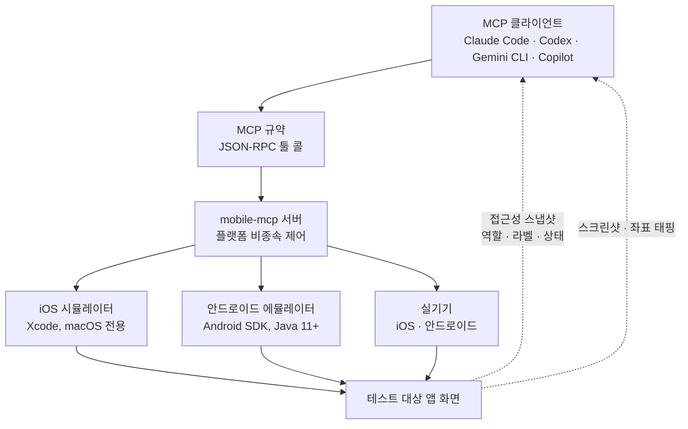

*에이전트(유리 큐브)가 기기 제어라는 한 가교를 건너 앱 화면의 블록들을 직접 만지고 있다는 개념을 형상화했습니다.*

## 왜 읽어야 하나

모바일 앱을 개발하거나 QA를 맡은 엔지니어, 그리고 사내 AI 에이전트를 운영하고 있는 팀을 위한 글입니다. 결론부터 말하면 스마트폰 화면이 이제 AI 에이전트의 툴 콜 하나로 닿는 자리가 됐다는 것입니다. iOS 시뮬레이터와 안드로이드 에뮬레이터, 실기기까지. 그 사이를 채우는 것은 platform 특화 프레임워크가 아닙니다. MCP 서버 하나, mobile-mcp입니다. 설치 명령이 `npx` 한 줄인 도구로 에이전트가 앱 화면을 읽고 버튼을 누르고 스크린샷으로 결과를 확인하는 루프가 완성됩니다.

## Mobile MCP가 무엇인가

mobile-mcp는 mobile-next 조직이 만든 MCP(Model Context Protocol) 서버입니다. GitHub 스타는 6천400개 안팎이고 포크는 500개를 넘었습니다. 라이선스는 Apache 2.0입니다. 역할을 한 문장으로 줄이면, "AI 에이전트와 iOS·안드로이드 기기 사이의 통역사"입니다.

그동안 모바일 자동화에서 에이전트는 벽에 막혀 있었습니다. iOS는 Xcode와 WebDriverAgent 생태계, 안드로이드는 ADB와 Appium 생태계였고, 둘을 동시에 다루려면 두 플랫폼의 전문 지식을 모두 갖추는 수밖에 없었습니다. 모바일 E2E 테스트 프레임워크들이 이 벽을 부분적으로 넘긴 적은 있지만, 그 방식은 코드로 작성된 시나리오를 실행하는 데 최적화되어 있었습니다. "이 버튼이 어디 있는지 스스로 보고, 다음에 무엇을 누를지 스스로 결정하라"는 지시를 에이전트가 수행하도록 설계된 층은 부족했습니다.

mobile-mcp가 채우는 것이 바로 그 층입니다. MCP 클라이언트인 Claude Code, Codex, Gemini CLI, GitHub Copilot, Cursor, Windsurf, VS Code, Amp, Kiro, opencode 등이 공통으로 쓰는 JSON-RPC 툴 호출 규약을 모바일 기기 제어에 그대로 적용합니다. 클라이언트는 iOS인지 안드로이드인지 알 필요도, 플랫폼 API를 알 필요도 없습니다. `screenshot`, `tap`, `scroll` 같은 도구 이름을 호출하면 됩니다.

## 화면을 두 가지 방식으로 만진다

에이전트가 기기를 다루는 방식은 두 갈래입니다.

첫째는 구조화된 접근성 스냅샷입니다. 앱 화면의 요소들이 역할(role), 라벨(label), 상태(state)를 가진 구조 데이터로 돌아옵니다. "로그인 버튼이 왼쪽 상단에 있고 현재 활성화되어 있다" 같은 정보가 화면 이미지 처리 없이 텍스트로 소비 가능한 형태입니다. LLM이 이 구조를 읽는 데 드는 비용은 스크린샷을 비전 모델로 푸는 것보다 낮고 버튼 좌표를 추정하는 과정 자체가 사라집니다.

둘째는 스크린샷 기반 좌표 태핑입니다. 접근성 트리를 노출하지 않는 화면, 커스텀 드로잉 UI나 게임, 캔버스 기반 앱은 접근성 스냅샷이 빈 손입니다. 그 자리에 스크린샷이 들어오고, 에이전트가 이미지에서 대상의 좌표를 정해 `tap`을 날립니다. 두 방식은 상호 보완 관계입니다. 구조로 읽히는 요소는 구조로, 구조로 읽히지 않는 요소는 픽셀로 다룹니다.



이 구조에서 핵심은 중간 층, mobile-mcp 서버가 플랫폼 차이를 흡수한다는 점입니다. 클라이언트 프롬프트는 "앱을 열고 프로필 페이지에서 닉네임을 확인해라"처럼 자연어로 남고 어느 플랫폼에서 그 지시가 실행되는지는 서버와 기기 선택이 결정합니다.

## 설치 및 통합

전제 조건은 Node.js 18 이상, npm 9 이상입니다. iOS를 다룰 macOS에는 Xcode가, 안드로이드를 다룰 머신에는 Android SDK와 Java 11 이상이 필요합니다. 시뮬레이터와 에뮬레이터 모두 이 SDK 위에서 돌기 때문에 모바일 개발 환경을 이미 갖추고 있는 팀이라면 추가 설치물은 MCP 서버뿐입니다.

Claude Code에서 등록하는 명령은 한 줄입니다.

```bash
claude mcp add mobile -- npx -y @mobilenext/mobile-mcp@latest
```

다른 클라이언트는 `mcpServers` 블록에 같은 런처를 JSON으로 씁니다.

```json
{
  "mcpServers": {
    "mobile-mcp": {
      "command": "npx",
      "args": ["-y", "@mobilenext/mobile-mcp@latest"]
    }
  }
}
```

`npx -y`가 매 실행 때 최신 버전 패키지를 끌어오므로 별도 설치 상태를 관리할 필요가 없습니다. 등록이 끝난 뒤에는 클라이언트 안에서 기기 관련 지시를 하면 되는데, 보통 흐름은 "시뮬레이터를 띄워라", "앱을 설치해라", "로그인 화면으로 가라", "이 버튼 상태를 확인해라"를 에이전트가 스스로 순서대로 툴 콜로 풀어내는 것입니다. mobile-next의 위키에는 Claude Code 기준의 Getting Started 문서가 따로 올라 있습니다.

## mobile-next 생태계

mobile-mcp는 단독 도구가 아니라 mobile-next 생태계의 에이전트 층입니다. 같은 조직이 내놓은 이웃 프로젝트가 두 개 있습니다.

mobilecli는 iOS와 안드로이드를 공통으로 다루는 범용 CLI 도구입니다. 기기 목록 조회, 앱 설치, 로그 수집 같은 작업이 플랫폼 구분 없이 한 인터페이스에서 나옵니다. mobilewright는 TypeScript/JavaScript 기반의 모바일 자동화 프레임워크로, 코드 시나리오 방식으로 기기 제어합니다.

세 층을 나란히 놓으면 역할 분담이 보입니다. mobilecli가 "사람이 터미널에서 기기를 다룬다"의 층이고, mobilewright가 "코드가 시나리오를 실행한다"의 층이며, mobile-mcp가 "에이전트가 지시를 받아 실시간으로 기기를 다룬다"의 층입니다. 하위 제어 코어는 공유되고 그 위에서 세 가지 인터페이스를 갈아끼우는 구조입니다. 조직의 공식 문서 사이트는 mobilenext.ai에 있습니다.

## ThakiCloud 제품 적용 시사점

이 사건의 축은 Paxis 관점에서 읽을 가치가 있습니다. Paxis는 에이전트 실행 환경을 제품으로 다루는 Agent-Native Cloud이고 그 구조에서 MCP 커넥터는 일급 리소스입니다. 외부 도구를 에이전트의 손에 붙이는 것이 설정 몇 줄의 일이 아니라 인증(OAuth 자동 재연결), 권한, 감사 로그, 정책 게이트를 갖춘 플랫폼 작업이 되는 것이 Paxis의 지점입니다.

mobile-mcp가 보여주는 것은 그 "손"이 이제 모바일 기기까지 뻗쳤다는 사실입니다. 에이전트가 앱 화면을 읽고 행동을 결정하는 루프가 성립하면 모바일 QA의 일부가 "사람이 시나리오를 돌린다"에서 "에이전트가 의도를 실행한다"로 이동합니다. 회귀 테스트의 시나리오 코드를 매 화면 변경마다 다시 쓰는 것 대신 "결제 화면에서 할인율 표기가 올바르게 나오는지 확인해라"라는 지시를 던지고 결과를 감사 로그로 받는 구조입니다.

여기서 Paxis가 짚어야 할 경계는 두 개입니다. 첫째는 권한입니다. 기기를 제어하는 에이전트는 결제 버튼, 인증 코드 입력, 연락처 접근 같은 행동을 실제로 수행할 수 있습니다. "어떤 툴 콜이 허용되는가"를 정책으로 제한하고 실행 전후를 감사하는 구조가 없으면 모바일 자동화는 곧 모바일 사고입니다. 둘째는 격리입니다. 에이전트 실행을 샌드박스로 돌리듯 기기 제어 세션도 독립된 워크스페이스에 묶어야 한 에이전트의 실패가 다른 기기 세션으로 번지지 않습니다.

## 한계 및 반론

가장 큰 한계는 에뮬레이터와 실기기의 차이를 에이전트가 모른다는 점입니다. 시뮬레이터에서 그린 경로가 실기기에서 프레임 드랍, 지연, OS 버전 차이로 다르게 행동할 수 있습니다. "시뮬레이터에서 통과"는 "실기에서도 통과"의 증거가 아니라는 사실은 기존 E2E 테스트와 동일합니다. mobile-mcp는 그 격차를 줄이지 못합니다.

두 번째는 iOS 쪽의 전제 조건입니다. Xcode와 macOS가 필요합니다. 윈도우 머신에서 iOS 시뮬레이터 경로는 열리지 않고 그러면 자동화 범위가 안드로이드로만 좁아집니다. 팀의 머신 구성이 이미 이렇게 섞여 있다면 "모든 기기를 하나의 에이전트로"라는 전제는 부분적으로만 성립합니다.

세 번째는 접근성 트리의 품질입니다. 개발사가 접근성 라벨을 제대로 걸지 않은 앱은 구조화 스냅샷이 빈 화면을 반환합니다. 그때 에이전트는 좌표 태핑으로 넘어가지만 픽셀로만 읽는 UI 조작의 신뢰성은 본질적으로 떨어집니다. 화면을 기계적으로 읽히도록 설계된 앱과 그렇지 않은 앱 사이에서 같은 모바일 자동화의 성공률이 갈리는 것입니다.

마지막으로 mobile-mcp가 E2E 테스트 프레임워크를 대체한다는 주장은 아닙니다. 시나리오 기반 테스트의 결정성, 리포트, 매트릭스 실행 같은 기능이 mobile-mcp의 현재 관심사가 아니라는 뜻입니다. 둘은 층이 다릅니다. 에이전트가 "의도"를 실행하는 층과, 코드가 "시나리오"를 실행하는 층. QA 전략에서 이 둘을 어느 비율로 섞을지는 팀마다 다른 질문입니다.

## 정리

에이전트가 기기를 다룬다는 것은, 모바일 플랫폼 전문 지식이 에이전트 구성의 필수 항목에서 빠진다는 뜻입니다. Xcode를 아는 사람, ADB를 아는 사람이 아니라 MCP를 아는 사람이 모바일 자동화를 설계할 수 있는 자리가 열렸습니다. 설치 한 줄, Apache 2.0, 6천400스타. 이 수치가 말하는 것은 도구의 성숙도이고 그 성숙도가 여는 문은 모바일 QA와 모바일 운영에서 "사람이 돌린다"의 비중을 줄이는 실험입니다.

Paxis 관점에서는 한 걸음 더 나아갈 수 있습니다. 기기를 제어하는 에이전트에게 권한, 격리, 감사 로그를 플랫폼이 대신 지킬 때 모바일 자동화는 파일럿 수준에서 운영 수준으로 이동합니다. 다음 질문은 "에이전트가 앱을 테스트하게 하는가"가 아니라 "어떤 정책 아래에서, 어떤 감사 기록과 함께 테스트하게 하는가"입니다.

## 출처

- [Ryrenz 트윗 (Mobile MCP 소개, 2026-09-09)](https://x.com/hjguyhan/status/2097478579961700366)
- [GitHub: mobile-next/mobile-mcp](https://github.com/mobile-next/mobile-mcp)
- [mobile-next 공식 문서](https://mobilenext.ai/docs/)
- [Getting Started with Claude Code (Wiki)](https://github.com/mobile-next/mobile-mcp/wiki/Getting-Started-with-Claude-Code)
- [mcp.so: mobile-mcp 서버 목록](https://mcp.so/servers/mobile-mcp)

*이 글의 설치 명령과 도구 목록, 라이선스는 공개 문서(README, 위키, 디렉터리) 기준으로 확인했으며 이번 세션에서 로컬 실행 재현은 하지 않았습니다.*
