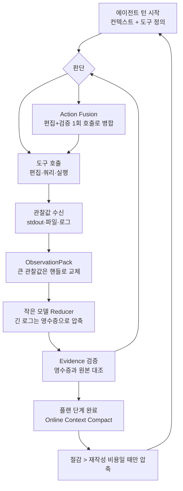

## 왜 읽어야 하나

코딩 에이전트나 자동화 에이전트를 운영하면서, 월 사용료를 좌우하는 것은 모델 능력보다 주변 하네스가 토큰을 얼마나 낭비하는가라는 감각을 가져본 분이라면 이 글을 읽으면 됩니다. 한 문장으로 결론을 먼저 드립니다. NVIDIA가 에이전트 하네스 Pi의 효율 확장인 SoL-Pi를 오픈소스화했고, 여기서 제공되는 4개 메커니즘은 에이전트 토큰을 점검하는 보편적인 체크리스트입니다.

## 개요

SoL-Pi(Scaling Auto-Research Loops for Efficient Agent Harnesses)는 NVIDIA의 에이전트 하네스 Pi 위에 얹는 효율화 확장입니다. NVlabs가 2026년 9월 초에 [GitHub에 공개](https://github.com/NVlabs/SoL-Pi)했고, [프로젝트 페이지](https://nvlabs.github.io/SoL-Pi/)에서 설계 의도를 설명합니다.

에이전트 비용의 구조를 먼저 짚으면 SoL-Pi가 왜 하네스에서 시작했는지 이해됩니다. 에이전트는 매 턴마다 시스템 프롬프트, 도구 정의, 대화 히스토리, 그리고 도구 호출 결과를 함께 전송합니다. 한 번 컨텍스트에 들어온 큰 관찰값은 이후 모든 턴에 다시 보내지고, 다시 과금됩니다. 즉, 에이전트의 토큰 비용은 "몇 번 판단했는가"보다 "어떤 데이터를 몇 번 재전송했는가"에 더 크게 좌우됩니다. 모델로 교체하면 판단의 질은 바뀌지만, 전송 구조의 낭비는 그대로 남습니다.

이 프로젝트의 주목할 만한 지점은 4개 메커니즘 자체보다, 그것을 어떻게 찾아냈는가에 있습니다. SoL-Pi는 AI가 연구원이 되어 에이전트의 동작을 관찰하고 토큰 낭비 지점을 식별하고 해결책을 제안하고 버그를 고치고 개선안을 테스트하는 자동 연구 루프(auto-research loop)로 발견된 결과물입니다. 에이전트가 자기 하네스의 비용을 줄이는 방법을 스스로 연구한 것입니다.

NVlabs가 프로젝트 페이지에서 밝힌 절감 폭은 다음과 같습니다.

- 원본 Codex·Claude Code 하네스 대비 토큰 소비 최대 64% 절감
- 기본 Pi 대비 45%~49% 토큰 절감
- API 호출 비용 50%~54% 절감(전문 연구자 기준 시간당 8.75~13.50달러)

베이스라인이 서로 다르다는 점을 기억해 두세요. "최대 64%"는 Codex와 Claude Code의 기본 하네스와 비교한 값이고, "45%~49%"는 이미 Pi가 적용된 상태와 비교한 값입니다. 같은 프로젝트의 숫자 묶음이지만 기준선이 다릅니다.

## 이 기술은 무엇인가

SoL-Pi가 다루는 문제는 에이전트 루프의 구조적 낭비입니다. 에이전트가 도구를 호출하면 그 결과가 컨텍스트에 들어가고, 그 컨텍스트는 다음 턴부터 매 회전에 다시 보내집니다. 한 번 들어온 큰 관찰값은 이후 모든 턴에 반복 과금됩니다. SoL-Pi는 이 구조를 네 가지 지점에서 개입합니다.



### 1. Action Fusion

예측 가능한 순서를 한 동작으로 합칩니다. 대표 사례가 "편집(또는 쓰기)을 한 뒤 바로 검증 명령을 실행하는" 패턴입니다. 기존에는 편집 도구 호출 결과, 모델 판단, 검증 도구 호출, 결과 판단으로 네 단계가 돌아가는데, SoL-Pi는 편집과 후속 검증 명령을 하나의 도구 호출로 묶어 중간 모델 판단 단계를 제거합니다. 지연도 토큰도 줄어듭니다. 코드 에이전트의 가장 흔한 루프인 "파일 수정 후 빌드 실행"은 이 병합의 대표 대상입니다.

### 2. ObservationPack

긴 도구 출력을 컨텍스트에 그대로 두지 않고 로컬에 저장한 뒤, 안정 핸들(stable handle)과 짧은 발췌로 교체합니다. 전체 내용은 필요할 때 페이지 단위로 호출해 다시 가져옵니다. "같은 큰 관찰값을 매 턴 다시 보내는 것"을 막는 장치입니다. 구체적으로, 40KB짜리 빌드 로그가 들어왔다 가정하면 ObservationPack은 그 로그를 로컬에 두고 컨텍스트에 "핸들 H-12, 첫 10줄 발췌"만 남깁니다. 다음 턴에서 원본의 특정 부분을 다시 보려면 핸들로 페이지를 호출합니다. 에이전트 운영자라면 이미 직감하고 있는 문제입니다. 같은 빌드 로그를 세 번 읽는 순간, 세 번 비용을 냅니다.

### 3. Evidence-Preserving Reducer

긴 진단 로그의 초벌 처리를 더 싼 소형 모델에게 위임합니다. 여기서 핵심은 "증거 보존"입니다. 소형 모델이 요약한 영수증(receipt)에 인용된 정보가 아카이브된 원본 로그와 정확히 일치하는지 검증 단계가 있으며, 일치하지 않으면 그 인용은 통과하지 못합니다. 2,000줄짜리 진단 로그를 소형 모델이 30줄 영수증으로 압축하고, 그 30줄의 각 인용이 원본 로그의 실제 줄과 일치하는지 코드가 대조합니다. 요약이 사실을 변질시키는 경로(에이전트 루프의 전형적 오류 전파)를 코드가 막는 구조입니다.

### 4. Online Context Compact

완료된 플랜 단계를 컴팩션 지점으로 잡아 Pi 네이티브 컨텍스트 컴팩션을 트리거합니다. 다만 무조건 압축하지는 않고, 기대되는 향후 토큰 절감이 컨텍스트 재작성 비용보다 클 때만 압축하는 동적 비용 할당을 씁니다. subtask 단위로 "지금 압축하면 이득인가"를 계산해서 결정한다는 점이 기존 고정 구간 컴팩션과 다릅니다.

네 메커니즘을 기존 컨텍스트 엔지니어링 관행과 나란히 놓으면 이렇게 됩니다.

| SoL-Pi 메커니즘 | 겨냥하는 낭비 | 기존 관행과의 관계 |
|---|---|---|
| Action Fusion | 중간 판단 단계의 토큰 | 워크플로 스펙의 "2단계 병합"을 도구 레벨에서 자동화 |
| ObservationPack | 큰 관찰값의 반복 전송 | 샌드박싱·요약 위임의 자동화 |
| Evidence-Preserving Reducer | 요약의 사실 변질 | 작은 모델 위임 + 원본 대조 검증 |
| Online Context Compact | 무분별한 압축의 재작성 비용 | 단계 경계 컴팩션에 "절감 > 비용" 판단 추가 |

설계 원칙도 짚어두겠습니다. SoL-Pi는 수정되지 않은 Pi 릴리스 위에 확장(extension)으로 설치되고, 4개 메커니즘은 전부 opt-in이며 기본값은 꺼져 있습니다. 기존 하네스 동작을 바꾸지 않는 선에서 하나씩 켜면서 효과를 재도록 만들었습니다.

## 설치 및 통합

저장소 README 기준 설치 명령은 한 줄입니다.

```bash
pip install git+https://github.com/NVlabs/SoL-Pi
```

Pi 워크스페이스에서 확장을 활성화한 뒤, 메커니즘별로 opt-in을 켜는 방식입니다. Pi 외 하네스(Claude Code, Codex 등)에 이 패턴을 이식하는 것은 SoL-Pi가 함께 제공하지 않으며, 각 운영자가 하네스 확장 메커니즘 위에서 구현해야 하는 작업입니다. 이 글의 "적용 시사점" 섹션에서 그 이식 목록을 정리해 두었습니다.

## 실제 실험 결과

재현 시도 중 실패: 이번 발행 창에서는 네트워크 접근이 가능한 샌드박스가 준비되지 않아 pip 설치와 실측 벤치마크까지 도달하지 못했습니다. 그래서 이 섹션에 실리는 모든 수치는 NVlabs가 [프로젝트 페이지](https://nvlabs.github.io/SoL-Pi/)와 [저장소](https://github.com/NVlabs/SoL-Pi)에서 공개한 값입니다. 독립 재현이 없는 수치가므로, 절감 폭은 그대로 인용하지 말고 "어디서 새는지"를 점검하는 기준으로 쓰는 것이 적절합니다.

공개 수치에서 다시 짚어야 할 구조는 세 가지입니다.

첫째, 절감의 대부분은 컨텍스트 전송에서 옵니다. ObservationPack과 Reducer가 겨냥하는 것은 "한 번 들어온 관찰값의 반복 과금"이며, 이는 어떤 모델로 교체해도 사라지지 않는 비용입니다. 모델 업그레이드가 판단의 질을 높이는 것처럼, 전송 구조 개선은 토큰 단가를 낮춥니다.

둘째, 소형 모델 위임은 비용이 이동하는 것일 수 있습니다. Evidence-Preserving Reducer는 긴 로그를 싼 모델에게 보내지만, 검증 단계가 추가 호출입니다. 전체 API 비용 50%~54% 절감이라는 숫자는 비용이 사라지는 경우뿐 아니라 비용이 더 싼 곳으로 이동하는 경우에도 성립한다는 뜻입니다. 총액이 줄면 구조는 성공입니다.

셋째, opt-in 설계가 의미하는 바입니다. 기본값이 꺼져 있다는 것은 64% 절감이 자동으로 주어지지 않는다는 뜻이고, 메커니즘별로 켜고 재는 운영 행위가 절감의 전제입니다.

## ThakiCloud 제품 적용 시사점

SoL-Pi의 4개 메커니즘은 "새 기술"이라기보다, 성숙한 에이전트 운영 조직이 이미 실무로 쌓아 온 것들의 형식화입니다. ThakiCloud의 두 제품 관점에서 봅니다.

**Paxis(에이전트 운영) 관점.** Paxis는 에이전트 워크플로를 실행하는 Agent-Native Cloud 제어 평면입니다. SoL-Pi의 4개 메커니즘을 Paxis 운영 관행으로 번역하면 다음과 같습니다.

| SoL-Pi 메커니즘 | Paxis 운영 관행에 해당되는 것 |
|---|---|
| Action Fusion | 편집 후 검증이 붙는 도구 체인을 단일 호출로 통합하는 워크플로 스펙 |
| ObservationPack | 큰 툴 출력을 샌드박스에 두고 요약만 컨텍스트에 올리는 위임 계약(bounded output) |
| Evidence-Preserving Reducer | 서브에이전트 결과의 원본 근거(앵커) 검증, 요약만 신뢰하지 않는 폐쇄 |
| Online Context Compact | 작업 단계 완료 지점의 컨텍스트 정리, "절감 > 비용" 판단 기준 |

더 중요한 신호는 자동 연구 루프입니다. SoL-Pi가 메커니즘을 "발견"한 방식은, 에이전트가 자기 하네스의 비용을 측정하고 개선안을 내는 루프를 돌린 것입니다. Paxis의 자가진화 스킬과 동일 방향이며, "하네스가 모델보다 에이전트 품질을 결정한다"는 전제가 비용 축에서도 성립한다는 방증입니다.

**ai-platform(인프라) 관점.** 토큰 비용 50% 절감은 서빙 인프라에도 그대로 전이됩니다. 같은 GPU에서 같은 모델이라면, 하네스가 보내는 컨텍스트 길이가 곧 처리량과 전력 소비를 결정합니다. ObservationPack 식 "핸들 교체"가 서빙 쪽으로 가면 KV 캐시 재사용율 문제가 되고, 컨텍스트 컴팩션이 곧 포화 전까지의 요청 수로 연결됩니다. SoL-Pi는 이 문제의 핵심이 "전송량 설계"에 있음을 보여주는 사례이고, 이는 GPUaaS에서 토큰 단가를 낮추는 가장 싼 레버입니다.

## 한계 및 반론

첫째, 수치는 NVlabs 자체 측정입니다. 독립 재현이 없으며, "최대 64%"라는 표현은 유리한 비교를 전제합니다. 비교의 기준선이 "기본값 vs 기본값"인지, "기본값 vs 튜닝"인지 확인해야 합니다.

둘째, Pi 의존성입니다. SoL-Pi는 Pi 위에 얹는 확장입니다. Claude Code나 Codex에 쓰는 경우 4개 패턴을 각 하네스의 확장 메커니즘으로 재구현해야 하며, 이 이식 비용이 절감 효과를 깎을 수 있습니다. 특히 Evidence-Preserving Reducer의 "원본 대조" 검증은 하네스가 관찰값 아카이브를 제공해야 성립합니다.

셋째, 소형 모델 위임의 품질 리스크입니다. Reducer가 요약에서 놓치는 정보가 바로 다음 판단의 근거가 되는 경우가 있습니다. "영수증과 원본 일치" 검증은 텍스트 일치이지 의미 일치가 아닙니다. 로그에서 한 줄이 빠지면 영수증은 원본과 일치하는데 판단은 틀어집니다.

넷째, 이 패턴의 상당 부분은 이미 공개된 컨텍스트 엔지니어링 실무입니다. SoL-Pi의 독창성은 메커니즘보다 "자동 연구 루프가 이것을 발견하고 측정했다"는 사실에 있고, 새로운 물리 법칙은 아닙니다.

## 정리

에이전트 운영자가 SoL-Pi에서 가져갈 것은 네 가지입니다.

1. **비용의 원인은 전송량이다.** 한 번 컨텍스트에 들어온 큰 관찰값은 이후 모든 턴에 다시 과금됩니다. 핸들 교체(ObservationPack)는 가장 단순하고 확실한 절약입니다.
2. **편집과 검증을 한 호출로 묶어라.** 예측 가능한 2단계 체인은 중간 판단 없이 실행할 수 있습니다(Action Fusion).
3. **요약은 증거를 보존해야 한다.** 싼 모델로 압축하되, 원본과 대조하는 검증 없이는 요약이 오류 전파 경로가 됩니다(Evidence-Preserving Reducer).
4. **발견의 방식이 본질이다.** 4개 메커니즘은 자동 연구 루프가 에이전트 동작을 관찰해 찾아낸 것입니다. 자기 하네스의 토큰 소비를 측정하고 개선안을 내는 루프를 돌리는 조직이, 모델 변경 없이도 비용을 내립니다.

하네스로 줄이는 시대가, 모델로 교체하는 시대보다 먼저 옵니다. SoL-Pi는 그 순서를 코드와 수치로 보여 준 사례입니다.

## 출처

- [NVlabs SoL-Pi GitHub](https://github.com/NVlabs/SoL-Pi)
- [NVlabs SoL-Pi 프로젝트 페이지](https://nvlabs.github.io/SoL-Pi/)
- [36kr SoL-Pi coverage](https://eu.36kr.com/en/p/3978268468525825)
- [KuCoin News SoL-Pi flash](https://www.kucoin.com/news/flash/nvidia-open-sources-sol-pi-harness-to-cut-ai-token-costs-by-64)
