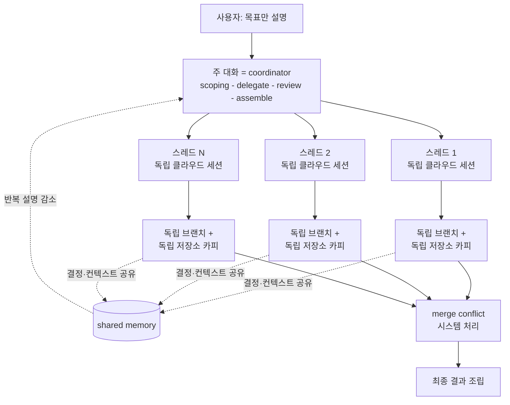

코딩 에이전트를 병렬로 굴릴 때 나가는 비용과 혼란은, 대부분 모델의 능력차가 아니라 조율 구조에서 생깁니다. Anthropic이 2026년 9월 17일 베타로 내놓은 재설계된 Claude Code Projects는 이 조율을 한 명의 coordinator에게 넘깁니다. 사용자가 전체 목표만 설명하면 Claude가 범위를 세우고, 작업을 병렬 스레드로 나누고, 각 스레드가 독립 클라우드 세션 위에서 서로 다른 브랜치와 저장소 카피를 만지는 동안 결과를 검토한 뒤 하나로 조립합니다. ThakiCloud 같은 플랫폼에서 병렬 에이전트를 운영하거나 그 청구서를 책임지는 엔지니어라면, 이 조율 구조가 ThakiCloud의 Paxis 제어 평면과 거의 1:1로 겹친다는 점이 오늘 읽어야 할 이유입니다.

기존 Claude Code 프로젝트는 폴더를 단위로, 사용자가 직접 일을 쪼개고 스레드 간 핸드오프를 손으로 넘기며, 끝에서 산출물을 스스로 합쳤습니다. 조율의 노동이 사용자한테 있었습니다. 재설계는 이 노동의 주체를 바꿉니다. 조율은 이제 사용자가 아니라 Claude가 맡고, 사용자는 목표와 진행 steer만 합니다.

*글의 핵심 개념을 형상화했습니다.*

## 쉽게 말하면

중견 건설 현장에 비유해 보겠습니다. 한 번에 여러 층을 동시에 올려야 하고, 전기·배관·철근 작업이 겹칩니다. 오래전 방식은 현장 소장(사용자)이 매일 아침 누구한테 뭘 넘길지 손으로 배정하고, 층마다 작업자(에이전트)가 서로 같은 벽을 만지면 충돌이 났을 때 소장이 직접 중재하고, 밤에 각 층 진행을 붙여 전체 완공도를 그리는 것이었습니다. 조율의 거의 모든 노력이 소장의 하루를 삼켰습니다.

재설계된 Claude Code Projects는 소장의 역할을 바꾸지 않고, 그 역할에 AI를 앉힙니다. 소장이 하는 것은 전체 공기를 선언하는 것뿐입니다. AI가 각 층을 어떤 순서로, 누구와 겹치게 할지 정하고, 겹치는 층 사이에서 벽을 놓고 자르는 충돌(merge conflict)을 시스템이 자동으로 해소하며, 각 층이 내린 결정(이 층은 이 재료를 쓰기로 했다)을 공유 메모리로 올려 다른 층이 다시 물어보지 않게 합니다. 소장은 필요할 때 어느 한 층을 바로 steer하고, 어떤 층은 더 비싼 자재(고 effort 모델)로 돌리라고 지시할 수 있습니다.

핵심은 현장이 하나라는 점입니다. 각 층 작업은 독립 세션에서, 독립 브랜치에서, 독립 저장소 카피 위에서 돌아옵니다. 그래서 한 층이 벽을 잘못 쌓아도 다른 층은 그대로고, 충돌은 시스템이 붙이는 단계에서야 드러납니다. "현장 여러 개를 손으로 돌리는" 것과 "현장 한 개를 AI가 돌리는 것"의 차이가 전부입니다.

## 개요

Claude Code Projects의 재설계는 2026년 9월 17일 베타로 발표됐습니다. 구조를 한 줄로 압축하면, 하나(conversation)가 조율하고, 여러 개(cloud session)가 병렬로 실행하며, shared memory가 그 사이를 잇는 것입니다. 발표는 Claude Pro·Max 구독자 중 Claude Code 클라우드 세션을 쓰고 있고 기존 프로젝트가 없는 소수부터 시작해, 수 주 내 더 많은 Pro·Max 사용자로, 그다음 Team·Enterprise 플랜으로 확장된다고 명시합니다. 기존 Pro·Max 프로젝트는 현재 방식으로 계속 동작하다가 롤아웃 진행에 따라 업그레이드됩니다.

이 발표가 지금 중요한 이유는, 병렬 에이전트 조율이 "모델 벤치마크의 한 줄"이 아니라 "운영 구조의 한 줄"이 되었기 때문입니다. 각 병렬 스레드가 완전한 클라우드 세션으로 계산되어 plan limit을 빠르게 소모하고, 프로젝트당 하루 신규 스레드가 200개로 상한을 둡니다. 이 상한은 성능이 아니라 운영 비용의 상한입니다. 조율 구조를 고르는 것이 곧 청구서를 고르는 것,이라는 실증 사례가 이번 발표 안에 들어 있습니다.

## 구조: 조율자와 병렬 스레드

재설계의 골격은 세 층으로 나뉩니다.

첫째, 주 대화(main conversation)가 coordinator입니다. 사용자가 목표만 설명하면, Claude가 요청을 범위 설정(scoping)하고, 작업을 병렬 스레드로 분배(delegate)하며, 진행을 조율하고, 각 산출물을 검토한 뒤 최종 결과를 조립(assemble)합니다. 이 coordinator는 사용자가 기존에 직접 하던 "일 쪼개기·핸드오프·결합" 세 동작을 통째로 흡수합니다.

둘째, 각 병렬 스레드는 완전한 Claude Code 클라우드 세션입니다. 스레드는 스스로 코드 변경을 하고, 테스트를 실행하고, pull request를 만들 수 있습니다. 그리고 결정적으로 각 스레드는 개별 branch와 개별 저장소 카피를 가집니다. 같은 저장소를 여러 세션이 동시에 고치면 생기는 충돌은, 사용자가 중재하는 것이 아니라 시스템이 merge conflict를 처리합니다.

셋째, 스레드 간에는 shared memory가 있습니다. 한 세션에서 내린 결정과 컨텍스트가 다른 세션으로 전달됩니다. "이 모듈은 이미 A 방식으로 결정했다" 같은 문맥을 각 스레드가 다시 설명할 필요가 없어지고, 반복 설명이 줄어듭니다.

아래 도표가 이 조율 구조를 세로로 보여 줍니다. 주 대화에서 분배된 각 스레드가 독립 세션·독립 브랜치·독립 저장소 카피 위에서 일하고, 그 결정들이 shared memory로 모인다가 다시 coordinator로 흐르며, 최종 merge conflict 처리를 거쳐 결과가 조립됩니다.

이 구조에서 주목해야 할 설계 결정은 격리의 위치입니다. 격리가 세션 수준(각 스레드가 완전 세션)에서, 그리고 저장소 수준(각 스레드가 자기 브랜치와 카피)에서 동시에 일어난다는 점이 핵심입니다. 격리가 세션에서만 있고 저장소가 공유라면, 병렬은 속도일 뿐 충돌은 그대로 사용자가 줍습니다. 반대로 격리가 저장소에서만 있고 세션이 공유라면, shared memory와 컨텍스트가 엉켜 조율이 다시 사용자가 됩니다. Claude Code Projects는 둘 다 격리하고, 그 사이를 shared memory로만 잇습니다.

## shared memory와 merge conflict

shared memory가 줄이는 것은 반복 설명입니다. "어떤 제약이 이미 결정됐나"를 각 스레드가 coordinator에게 다시 묻지 않고, 결정이 스레드 사이로 흐릅니다. 다만 이 shared memory가 스레드 전체를 동기화하지는 않습니다. 스레드는 여전히 독립 세션이고 독립 저장소 카피 위에서 돌아, 각자의 작업이 물리적으로 겹치지 않습니다.

그리고 물리적으로 겹치지 않은 작업이 결국 같은 저장소에 합쳐질 때, 충돌은 merge conflict 단계에서 한 번에 드러납니다. 사용자가 층을 돌아다니며 벽을 재는 대신, 시스템이 붙이는 순간을 하나만 봅니다. 여기에는 전제가 있습니다. 스레드가 충분한 격리(브랜치·카피)를 가져야 충돌이 "한 번에" 붙습니다. 격리가 약하면 충돌이 중간에 여러 번 터져, 다시 사용자에게로 돌아가게 됩니다. 즉 shared memory와 merge conflict 처리의 품질은, 격리 설계의 품질을 전제로 합니다.

## 노트북을 닫아도 도는 클라우드 세션, 그리고 그 대가

클라우드 세션은 노트북을 닫은 뒤에도 계속 실행되며, 폰 등에서 접속할 수 있습니다. "야간에 돌리고 아침에 받는다"는 패턴을 coordinator가 자동으로 여러 스레드에 확장해 줍니다. 발표는 애플리케이션 지연 개선, 비활성화된 API 엔드포인트 마이그레이션, 엔드포인트 프로파일링, API·웹·모바일 저장소 간 변경 조율, 병렬 Claude로 C 컴파일러 만들기 등을 사용 사례로 듭니다.

대가는 비용 구조에 있습니다. 병렬로 돌리는 각 스레드가 하나의 완전 세션으로 계산되므로, 여러 스레드를 동시에 굴리면 plan limit이 더 빨리 소모됩니다. 그리고 프로젝트 전체 기준 하루 신규 스레드 상한이 200개로 설정돼 있습니다. 소비 현황은 Claude의 Usage 설정에서 봅니다.

이 두 숫자를 함께 읽으면, 이번 발표의 진짜 메시지가 "병렬이 빨라졌다"가 아니라 "병렬에 대한 상한과 회계를 시스템이 갖는다"임을 알 수 있습니다. 200개/일은 성능 상한이 아니라 운영 상한이고, 각 스레드의 complete session 계산은 병렬 에이전트의 단위 비용을 세는 첫 시도입니다. 조율 구조를 고르는 것이 곧 청구서를 고른다는 점이, 여기서 처음으로 숫자로 붙습니다.

## ThakiCloud 관점: Paxis의 조율 평면과 Metis의 서빙 경제

ThakiCloud는 두 제품의 교차점에서 이 구조를 이미 운영하고 있습니다.

Paxis 관점(주). Claude Code Projects의 "주 대화 = coordinator, 스레드 = 독립 세션, shared memory = 컨텍스트 전파, merge conflict = 시스템 조립"은 Paxis의 실행 모델과 겹칩니다. Paxis는 ThakiCloud의 Agent-Native Cloud 제어 평면으로, 사용자가 하나의 진입점에서 목표를 선언하면 Paxis가 스킬(960+ 스킬을 BM25로 선택)을 골라 격리 샌드박스에서 병렬로 실행하고, 모든 행동을 정책 게이트와 감사 로그로 통과시킨 뒤 결과를 조립합니다. 병렬 스레드의 "독립 세션 + 독립 저장소 카피" 격리는, Paxis의 샌드박스 격리 실행과 같은 설계 결정입니다. 한 에이전트가 실패해도 다른 에이전트의 작업 공간이 오염되지 않도록 격리를 세션과 리소스 양쪽에서 두는 것이요. 그리고 "결정·컨텍스트가 에이전트 사이로 흐르는" shared memory는, Paxis의 메모리·오케스트레이션 계층이 쓰는 다중 에이전트 DAG 컨텍스트 전달과 같은 문제의식입니다. Claude Code Projects가 2026년 9월에 제품으로 확인해 준 것은, Paxis가 베팅한 "조율을 사용자에서 제어 평면으로 옮긴다"는 방향이 맞았다는 외적 증거입니다.

Metis 관점(보완). 200개/일 상한과 "스레드 하나 = complete session" 회계는, 병렬 에이전트의 단위 비용 문제를 서빙 경제 문제로 번역합니다. Metis가 푸는 질문은 정확히 이것입니다. coordinator 한 개와 worker 스레드 N개를 함께 서빙할 때, 그 N을 어떻게 세우고 어떻게 청구할 것인가. 병렬 에이전트가 scale-up(스레드 증가)하면 서빙 처리량과 토큰 비용이 선형이 아니라 상한(plan limit, thread cap)에 걸려 끊깁니다. ThakiCloud가 온프레미스·소버린 환경에서 이 상한을 자기 GPU와 큐 위에서 직접 조정할 수 있다는 것은, 클라우드 서브스크립션의 200개/일 상한을 물리 리소스 cap으로 바꿀 수 있다는 뜻입니다. 조율 구조(Paxis)와 그 구조의 실행 경제(Metis)가 한 쌍으로 읽히는 지점이 바로 여기입니다.

## 한계 및 반론

첫째, 베타는 소수에게 열려 있고 확장 일정이 "수 주 내", "그다음 Team·Enterprise" 정도로만 제시됩니다. 확정 날짜가 없으므로, 이 구조가 Team·Enterprise에서 어떤 상한과 회계로 정착하는지는 아직 미지입니다.

둘째, 각 병렬 스레드가 complete session으로 plan limit을 소모한다는 점은, 병렬이 "값이 더 비싸다"는 것을 의미합니다. 조율이 편리해졌다는 것과 총비용이 줄었다는 것은 별개이고, 200개/일 상한이 있는 한 병렬의 총 비용은 상한으로 관리되지 상한으로 사라지지 않습니다.

셋째, shared memory와 merge conflict 처리의 품질은 격리 설계의 품질에 좌우됩니다. 격리가 약해지면 shared memory가 컨텍스트를 오염시키고, merge conflict가 "한 번에"가 아니라 "여러 번" 터져 다시 사용자에게 돌아갑니다. Claude Code가 이를 시스템으로 처리한다고 해서, 격리라는 전제가 없는 것은 아닙니다.

넷째, 이는 Anthropic의 한 제품 구조입니다. 다른 벤더의 병렬 에이전트 조율(각자의 격리 단위, shared memory 범위, 상한)과 어떻게 겹치고 갈리는지는 이 발표 자체로는 답이 없습니다. ThakiCloud가 Paxis에서 비교 대상으로 삼아야 할 것은 "Anthropic이 이렇게 했는가"가 아니라, "우리 격리·상한·회계가 이 구조와 같은 문제의식을 해결하는가"입니다.

## 그래서 무엇을 바꿀 수 있나

읽고 나면 바로 적용할 수 있는 것은 세 가지입니다.

하나, 병렬 에이전트 운영의 격리 단위를 세션과 리소스(브랜치·카피) 양쪽에서 다시 확인하십시오. 격리가 한쪽에서만 있으면 병렬은 속도일 뿐, 충돌과 컨텍스트 오염은 사용자에게 남습니다.

둘, 병렬에 상한과 회계를 먼저 붙이십시오. Claude Code Projects가 200개/일 상한과 "스레드 = complete session" 계산을 시스템으로 갖듯, ThakiCloud의 Paxis에서도 worker 스레드 수 상한과 단위 세션 비용 회계를 실행 구조의 1급 리소스로 두는 것이 좋습니다. 조율을 제어 평면으로 옮기는 것보다, 그 조율의 비용을 세는 것이 먼저입니다.

셋, shared memory의 범위를 "결정·컨텍스트 전달"로 한정하고, 컨텍스트 전체 동기화는 하지 마십시오. 전파가 넓으면 오염도 넓습니다. 스레드 사이에는 최소한의 결정만 흐르게 하고, 물리 격리는 저장소 카피로 유지하는 것이 이번 구조의 핵심 균형입니다.

병렬 코딩 에이전트의 전쟁터는 이제 모델의 토큰 단가가 아니라, 조율·격리·상한·회계입니다. Claude Code Projects는 그 전장을 제품으로 처음 확인해 준 발표이고, ThakiCloud의 Paxis는 같은 전장을 이미 자기 제어 평면 위에 놓고 있는 쪽입니다.

## 출처

- [Claude Code Projects, redesigned (Anthropic 공식 발표)](https://claude.com/blog/projects-redesigned)
- [Claude Code Projects 문서 (code.claude.com)](https://code.claude.com/docs/en/claude-projects)
- [devops.com - Anthropic adds a coordinator to Claude Projects](https://devops.com/anthropic-adds-a-coordinator-to-claude-projects-for-running-ai-work-in-parallel/)
- [marktechpost.com - Anthropic launches Claude Code Projects in beta](https://marktechpost.com/2026/09/17/anthropic-launches-claude-code-projects-in-beta-parallel-cloud-sessions-that-keep-running-after-you-close-your-laptop/)
- [X - @claudeai (hjguyhan RT)](https://x.com/hjguyhan/status/2101338989697585503)
