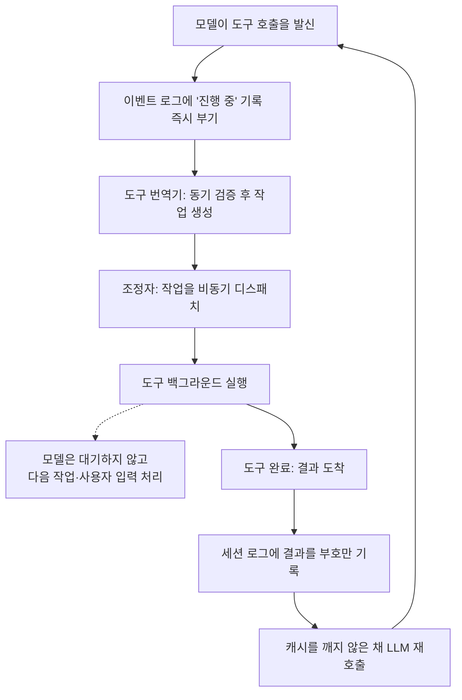
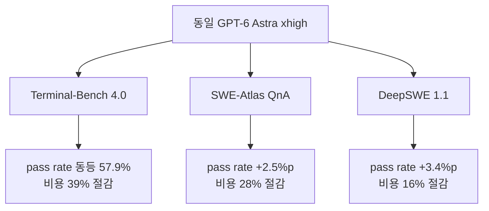

코딩 에이전트를 운영하며 토큰 비용이 모델 선택의 문제인지 고민해 본 엔지니어라면, 이 글을 읽어야 합니다. 결론부터 한 문장으로 잡으면, 에이전트가 도구의 결과를 기다리는 동안 태우는 토큰은 모델의 능력이 아니라 하니스의 설계가 정하는 비용이며 그 관리를 비동기로 넘기면 같은 pass rate에서 39%까지 줄일 수 있습니다.


*중심 조정자 주위로 여러 도구 스트림이 병렬로 흐르고, 일부는 진행 중 상태, 일부는 결과를 되돌리는 구조를 형상화했습니다.*

## 왜 읽어야 하나

에이전트를 프로덕션에 올리는 팀은 결국 두 변수로 비용을 산출합니다. 모델 단가와 호출 횟수. 그런데 이 둘 사이에는 세 번째 변수가 있었습니다. 모델이 도구를 부른 뒤 결과를 받을 때까지 스스로 wait하고, poll하고, heartbeat를 보내며 소비하는 토큰입니다. 이 오버헤드는 모델의 "지능" 문제가 아닙니다. 에이전트를 감싸는 하니스가 동기식으로 도구를 관리할 때 생기는 구조적 비용입니다.

이 글은 그 세 번째 변수를 독립적으로 분리한 오픈소스 하니스, Unreal Labs의 Unreal Agent를 다룹니다. 코딩 에이전트를 돌리는 플랫폼 팀이 "모델을 바꾸지 않고 비용을 줄일 수 있는지가 어디에 있는가"를 판단하는 데 바로 쓸 수 있는 자료입니다. 동시에 하니스를 직접 만들려는 팀에게는 동기 대 비동기 도구 호출 설계의 실제 코드 구조를 보여 주는 사례입니다.

## 개요

Unreal Labs가 2026년 9월 22일에 공개한 Unreal Agent는 "async-first agent harness"를 표방하는 오픈소스 프로젝트입니다. 라이선스는 MIT, 주요 언어는 Go(go 1.27.0)이며 저장소는 세 부분으로 나뉩니다. `harness/`가 라이브러리, `cmd/`가 그 라이브러리를 쓰는 실행파일, `benchmarks/`가 벤치마크 러너입니다.

공식 블로그의 한 줄 정의를 그대로 가져오면, "프로덕션 워크로드와 코딩/과학 벤치마크에서 Codex 대비 최대 40%, Pi 대비 최대 20%의 비용 절감을 성능 저하 없이 달성하는 에이전트 하니스"입니다. 여기에서 핵심은 "최대"라는 수식어입니다. 실제로 공개된 세 벤치마크의 절감 폭은 39%, 28%, 16%로 일정하지 않습니다. 왜 이런 차이가 나는지가 이 글의 본론입니다.

## 이 기술은 무엇인가

에이전트 하니스가 모델을 기다리게 만드는 구조를 먼저 짚어 봅니다. 통상적인 코딩 에이전트는 도구를 동기적으로 관리합니다. 모델이 Bash나 파일 읽기 같은 도구를 호출하면, 그 도구가 끝날 때까지 턴(turn)이 막힙니다. 느린 도구, 예를 들어 수 분이 걸리는 개발 환경 세팅이 그 예입니다. 그 동안 모델은 일할 수 없습니다. 그런데 모델이 "아직 안 끝났을까"를 확인하려면 poll을 보내고, 연결이 살아있음을 확인하려면 heartbeat를 보내야 합니다. 이 poll과 heartbeat 하나하나가 전부 토큰으로 과금됩니다.

Unreal Agent는 이 책임을 모델에서 떼어 하니스로 옮깁니다. 도구를 "완전히 비동기"로 관리합니다. 모델을 위해 wait, poll, heartbeat를 하지 않게 하는 것입니다. 그 결과 두 가지가 열립니다. 첫째, 사용자는 도구 호출이 끝날 때까지 기다리지 않고 언제든 에이전트를 steer할 수 있습니다. 둘째, 에이전트는 모델 호출 사이에 더 많은 유용한 도구 작업을 넣을 수 있습니다.

이 설계가 가능하게 하는 구체적인 장면이 있습니다. 수 분이 걸릴 개발 환경 세팅을 먼저 띄우고 그 사이 코드베이스를 탐색하며 웹 검색을 병렬로 진행하는 것. 도구를 부르고 결과를 기다리는 시간 동안 모델은 다른 일을 하는 셈입니다.

### 아키텍처: 하니스가 만드는 구성 요소

Unreal Agent의 `harness/`는 README에서 명시하는 구성 요소들로 이루어집니다. 각 요소의 책임을 정리하면 아래 표와 같습니다.

| 구성 요소 | 책임 |
|---|---|
| 인박스(Inbox) | 세션 스코프, 메모리 기반의 외부/제어/크래시 입력 멱등(dedup) |
| 조정자(Coordinator) | LLM 턴 실행, 승인된 입력 영속화, 도구 번역기 해석, 커밋된 작업 디스패치 |
| 도구 번역기(Tool Translator) | 도구 호출을 동기적으로 검증하고 작업(operation)으로 번역. I/O를 하지 않고 이벤트 루프를 suspend하지 않음 |
| 작업(Operation) | 도구 번역기가 생성하는 직렬화 가능한 비동기 실행 설명 |
| 세션 스토어(Session Store) | 부호만(append-only) 세션 히스토리와 작업 상태 영속화, 복구와 포크 지원 |
| 컨텍스트 빌더(Context Builder) | 메모리에서 상태적으로 모델 입력을 조립. I/O나 영속화 의존 없음 |
| LLM 어댑터(LLM Adapter) | 준비된 모델 입력을 프로바이더에 보내 정규화된 응답 반환, 인증/취소/에러 처리 |
| 도구 레지스트리(Tool Registry) | 도구 정의(Bash, ViewImage 등)와 그 번역기를 저장 |

이 구성에서 주목할 것은 "동기"와 "비동기"의 경계가 어디에 잡히느냐입니다. 도구 번역기는 조정자의 이벤트 루프 위에서 동기적으로 검증합니다. I/O를 하지 않고 루프를 막지 않습니다. 그리고 비동기로 실행될 "작업"을 만듭니다. 즉 검증은 빠르고 동기적으로, 실행은 느려도 비동기적으로. 이 분리가 전체 설계의 핵심입니다.

### 비동기 도구 호출 흐름

모델이 도구를 부르는 순간부터 결과가 다시 모델로 돌아오는 과정은 다음과 같습니다.



공식 블로그가 강조한 공학 과제가 바로 `H` 구간입니다. 도구가 완료될 때마다 결과를 세션 로그에 부기하고 LLM을 다시 부르며, 이때 프롬프트 캐시를 깨지 않는 것입니다. 캐시가 한 번 깨지면 다음 LLM 호출에 모든 입력 토큰을 다시 과금하게 되기 때문입니다. 비동기로 결과를 섞어 넣으면서 캐시 안정성을 유지하는 것은 "흥미로운 공학 과제"라는 원문의 표현이 정확합니다.

## 설치 및 통합

실제로 이 하니스를 받아와 빌드하고 러너를 확인했습니다. 실험은 격리된 git worktree에서 수행했으며 결과 로그는 `outputs/blog-impl/unreal-agent-harness/`에 보존했습니다.

먼저 저장소를 받아 전체를 빌드합니다. Go 모듈이라 의존성 다운로드 후 `go build`가 실행됩니다.

```bash
git clone https://github.com/unreallabsai/unreal-agent
cd unreal-agent
go build ./...
```

이번 실행에서 `go build ./...`는 rc=0으로 통과했습니다. 의존성으로 `github.com/oapi-codegen/runtime`, `golang.org/x/image`, `golang.org/x/sys`가 다운로드됐습니다. `go.mod`는 `go 1.27.0`을 선언합니다.

실행파일은 `cmd/unreal-agent-runner`입니다. `-p` 플래그를 주면 stdin JSON 없이 프롬프트 하나로 요청을 보냅니다.

```bash
unreal-agent-runner -p 'your prompt here'
```

`--help`로 확인한 실제 옵션과 요청 스키마는 아래와 같습니다.

```text
Usage:
  unreal-agent-runner [options] < request.json
  unreal-agent-runner [options] 'JSON request'
  unreal-agent-runner [options] -p 'prompt'

Options:
  -log-directory string        세션 JSONL 로그 디렉터리 (기본 <workspace>/logs)
  -p prompt                    stdin 없이 프롬프트로 요청
  -session-directory string    세션 파일 디렉터리 (기본 .harness/sessions)
  -tool-heartbeat-interval duration  도구 대기 heartbeat 간격 (기본 10m, 0으로 비활성)
  -workspace string            에이전트 워크스페이스·Bash 작업 디렉터리 (기본 .)

Request schema:
  messages: {role, content, message_id?} 배열
  prompt:   단일 사용자 메시지 약식
  model:    프로바이더 모델 ID (기본 UNREAL_HARNESS_LLM_MODEL)
  max_attempts: 재시도 (기본 5, 1로 비활성)
  system_prompt: 기본 시스템 프롬프트 교체
```

여기서 `-tool-heartbeat-interval` 플래그가 의미 있는 대조입니다. 동기 하니스라면 모델이 heartbeat를 직접 보내야 합니다. 여기서는 heartbeat가 하니스의 옵션으로 존재하고 기본 10분 간격으로 도구가 길게 막히는 경우에만 발동됩니다. 연결 유지의 책임을 모델에서 하니스로 옮긴 구조를 한 줄로 말한 셈입니다.

모델은 `UNREAL_HARNESS_LLM_MODEL` 환경변수로 지정합니다. 공식 벤치마크는 GPT-6 Astra(xhigh)로 돌렸으며 이 하니스는 고비용 frontier 모델의 토큰 단가를 비동기 절감으로 상쇄하는 방향성을 전제합니다.

## 실제 실험 결과

저자의 실험은 "소스를 받아 빌드하고 러너의 실제 계약(options, request schema)을 확인"하는 수준입니다. 전체 벤치마크 재수행은 아닙니다. 벤치마크 수치는 Unreal Labs가 공개한 공식 실행을 인용한 것으로 GPT-6 Astra xhigh 기준입니다.

공식 블로그의 세 벤치마크 표를 정리하면 다음과 같습니다.

| 벤치마크 | Unreal Agent | Codex | Pi |
|---|---|---|---|
| Terminal-Bench 4.0 | 57.9% / $1,428 | 57.9% / $2,350 | 55.0% / $1,827 |
| SWE-Atlas Codebase QnA | 65.8% / $936 | 63.3% / $1,303 | 64.0% / $1,033 |
| DeepSWE 1.1 | 72.4% / $1,367 | 69.0% / $1,633 | 69.6% / $1,584 |


*좌: 벤치마크별 총 비용(달러), 우: pass rate(%). unreal-agent(파랑)가 세 벤치 전부에서 Codex(회색)보다 비용이 낮고 pass rate는 동등하거나 높습니다. (공식 실행, GPT-6 Astra xhigh)*

이 표를 읽는 법이 중요합니다. Terminal-Bench 4.0은 pass rate가 정확히 같습니다. 57.9%입니다. 그런데 총 비용은 $1,428 대 $2,350로, Unreal Agent가 39% 저렴합니다. 같은 정답률에 비용만 줄었습니다. 여기서 "하니스가 비용을 독립 변수로 만든다"는 주장이 가장 순수하게 성립합니다.

나머지 두 벤치는 방향이 더 강합니다. SWE-Atlas QnA는 pass rate가 65.8% 대 63.3%로 Unreal Agent가 2.5%p 앞서고 비용은 $936 대 $1,303으로 28% 낮습니다. DeepSWE 1.1도 72.4% 대 69.0%로 3.4%p 앞섭니다. 비용은 $1,367 대 $1,633으로 16% 낮습니다. 즉 "정답률은 같거나 높고, 비용은 낮다"가 세 벤치 전부에서 성립합니다.

절감 폭이 39%에서 16%까지 달라지는 이유는 워크로드의 도구 호출 밀도와 병렬성입니다. 공식 블로그는 절감을 두 요인에서 찾습니다. 첫째, 최소한의 하니스 footprint와 토큰 최적화된 도구 출력(단순 프롬프트, 서브에이전트나 워크플로 없음). 둘째, 모델 턴당 더 많은 도구 작업. 도구를 부르고 기다리는 poll 토큰이 사라지니, 같은 턴에 더 무거운 도구 호출을 넣을 수 있다는 계산입니다. 도구 호출이 많고 병렬성이 큰 벤치일수록 Codex 대비 절감 폭이 큽니다.



## ThakiCloud 제품 적용 시사점

이 주제는 ThakiCloud의 두 제품 렌즈가 모두 닿습니다.

**Paxis 렌즈(에이전트 실행).** Paxis는 에이전트 네이티브 클라우드의 제어 평면으로, 코딩 에이전트를 포함한 에이전트 워크로드를 격리 샌드박스에서 실행합니다. 에이전트를 돌리는 플랫폼에게 "모델 단가 × 호출 횟수" 외의 세 번째 비용 변수, 도구 호출 오버헤드가 존재한다는 사실은 실행 경제성 설계에 직접 들어갑니다. 비동기 도구 호출은 사용자가 실시간으로 steer할 수 있게 하는 부수적 이점도 있습니다. Paxis의 휴먼 승인·감사 로그와 결합하면, "에이전트가 느린 도구를 돌리는 동안 사람이 방향을 꺾어 줄 수 있다"는 운영 시나리오가 생깁니다. 비용 절감에 그치지 않고 실행 환경의 반응성(steerability)까지 개선하는 효과입니다.

**ai-platform 렌즈(서빙 경제성).** Metis가 서빙 경제성을 토큰당 원가로 재는 것처럼, 에이전트 워크로드의 원가는 "토큰 × 턴" 말고 "도구 호출당 소비 토큰"이라는 축으로도 재야 합니다. 비동기 하니스가 poll·heartbeat 토큰을 제거한다는 것은, 같은 에이전트에게 더 많은 도구 작업을 넣되 입력 토큰은 줄이는 것입니다. 저비용 서빙이 에이전트 실행의 경제성을 만드는 구조와 같은 방향입니다.

두 렌즈를 한 줄로 묶자면, 에이전트를 실행 환경으로 산다고 보는 시각에서 하니스 설계는 실행 환경의 사양이 됩니다. 모델 스펙을 고르는 것처럼, 도구 호출을 동기식으로 관리할지 비동기식으로 관리할지도 이제 비용과 반응성에서 판단하는 설계 변수입니다.

## 한계 및 반론

이 수치를 읽을 때 붙이는 조건이 네 가지 있습니다.

첫째, 벤치마크는 벤더가 직접 돌린 것입니다. GPT-6 Astra xhigh 한 모델 기준으로, 독립 재현 수치는 아직 없습니다. "최대 40%"는 공식 정답률 차이가 벤치마크 변이 수준이라는 전제에 올라 있는 숫자입니다.

둘째, 절감 폭이 일정하지 않습니다. 39%, 28%, 16%는 워크로드의 도구 밀도·병렬성에 따라 변합니다. "에이전트 비용을 40% 줄인다"로 일반화하면 안 됩니다. 도구 호출이 희박한 워크로드라면 절감은 훨씬 작아질 수 있습니다.

셋째, 비동기 설계의 대가는 공학 복잡성입니다. 결과를 세션 로그에 섞어 넣으면서 프롬프트 캐시를 깨지 않는 것은 원문이 인정하는 "흥미로운 공학 과제"입니다. 이 하니스를 프로덕션에 올리는 팀은 completion, cancellation, background task의 생명주리를 이 하니스 위에 다시 세워야 합니다. CLI 기반 SDK의 전제(로컬 세션, 서브프로세스, 자원 한계)가 프로덕션에 그대로 통하지 않는다는 점도 원문이 명시합니다.

넷째, 저자의 실험은 빌드와 러너 계약 확인 수준입니다. 전체 벤치마크를 재수행한 것도 아닙니다. 표의 수치는 공식 실행을 인용한 값입니다. 하니스를 실제로 프로덕션 워크로드에 붙여본 운영 데이터는 아직 없습니다.

## 정리

이 글이 세운 결론을 회수하면, 에이전트 비용은 "모델 단가 × 호출 횟수" 두 변수로만 결정되지 않습니다. 도구 호출을 기다리며 모델이 태우는 poll·heartbeat 토큰이라는 세 번째 변수가 있고, 그 값은 하니스의 동기/비동기 설계가 정합니다.

Unreal Agent는 그 세 번째 변수를 하니스로 옮긴 실제 사례입니다. MIT 라이선스의 Go 하니스로, 소스에서 빌드되고 러너의 계약(options, request schema)이 투명합니다. GPT-6 Astra 기준 동일 pass rate에서 최대 39% 절감까지 공개했습니다.

에이전트를 돌리는 팀에게 다음 행동은 두 가지입니다. 첫째, 지금 쓰는 에이전트의 도구 호출이 동기식이면, "모델이 wait·poll·heartbeat로 쓰는 토큰"을 먼저 측정해 보세요. 그것이 비용의 세 번째 변수입니다. 둘째, frontier 모델을 쓰는 팀은, 비동기 하니스가 고단가 모델의 토큰 비용을 상쇄하는 레버인지 워크로드별 절감 폭(도구 밀도·병렬성)으로 판단해 보세요. 하니스 설계는 이제 모델 선택과 나란히, 에이전트 실행 경제성을 정하는 독립 변수입니다.

## 출처

- Unreal Agent 공식 저장소 (MIT, Go): <https://github.com/unreallabsai/unreal-agent>
- Unreal Labs 공식 블로그 (2026-09-22, 벤치마크 표 출처): <https://unreallabs.ai/blog/unreal-agent/>
- 기술 리포트 (arXiv): <https://arxiv.org/abs/2605.13360>
- 공개 실행 요약 (AI/TLDR): <https://ai-tldr.dev/releases/unreallabs-unreal-agent/>
