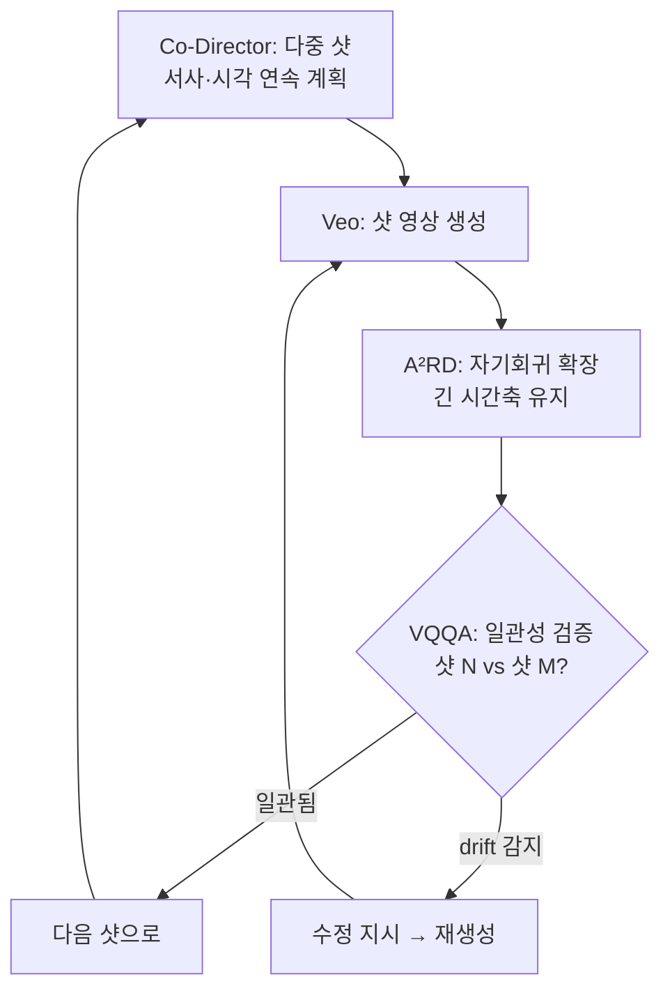

*한 코디네이터가 주위를 돌며 각 에이전트에 지시를 내리고 그 결과들을 다시 점검합니다.*

## 왜 읽어야 하나

멀티에이전트 시스템을 설계하는 AI 엔지니어, 특히 긴 시간축에서 일관성(agent drift, cascading failure)을 잡는 데 골머리를 앓는 분이라면 이 글이 필요합니다. 핵심 결론부터 말합니다. 장편 생성 영상에서 일관성을 유지하는 힘은 더 큰 단일 모델이 아니라, 계획을 세우고 그 계획을 검증하는 에이전트들의 오케스트레이션입니다. Google이 2026년 9월 24일 발표한 통합 멀티에이전트 프레임워크는 정확히 그 구조를 보여줍니다. 이 글은 네 개의 에이전트가 각각 무엇을 하는지, 그리고 그 구조가 에이전트 설계에 무엇을 주는지를 짚습니다.

## 개요

생성 영상 모델의 오래된 난제는 시간축입니다. 짧은 클립은 꽤 그럴듯하지만, 분을 넘기는 순간 문제가 쌓입니다. 인물 인물이 샷을 넘을 때마다 달라지고(정체성 drift), 장면의 공간 배치 일관되지 않으며 이야기 흐름은 장황해지기 전에 무너집니다. 각 프레임을 처음부터 다시 생성하는 선형 파이프라인에서는 이 작은 오류들이 누적되어 결국 **cascade failure**로 갑니다.

*샷을 넘길 때마다 작은 오류가 누적되어, 결국 통제 불능의 cascade failure로 이어집니다.*

Google Research는 이 문제를 "더 좋은 영상 모델"로 풀지 않았습니다. 대신 Gemini(계획·오케스트레이션)와 Veo(영상 생성) 위에 **에이전트 오케스트레이션 레이어**를 올렸습니다. 하나의 코디네이터가 전체 서사를 계획하고 여러 에이전트가 생성과 검증을 나눠 맡으며 그중 검증 에이전트가 일관성을 폐쇄합니다.

## 네 개의 에이전트가 각각 무엇을 하나

발표된 프레임워크는 네 가지로 구성됩니다.

1. **Co-Director(코디네이터).** 다중 샷의 서사와 시각적 연속성을 계획합니다. 어떤 샷에서 누가 어디에 있고 다음 샷으로 어떻게 이어질지를 미리 짭니다. 전체 오케스트레이션을 담당하는 에이전트입니다.
2. **CANVAS.** 공간·시각적 일관성을 유지합니다. 장면의 "세계 상태", 누가 어떤 자리에 있고 어떤 조명이 깔리는지를 추적하며 샷 사이에서 깨지지 않게 합니다.
3. **A²RD(Agentic Autoregressive Diffusion).** 긴 시간축을 자기회귀적으로 확장합니다. 단일 모델이 한 번에 모든 프레임을 내는 것이 아니라, 앞 샷의 결과를 조건으로 다음 샷을 잇는 방식입니다. 이 구성 요소는 자체 논문(arXiv: 2605.06924)으로 분리되어 있습니다.
4. **VQQA(Visual Question Answering).** 일관성을 **검증**하는 에이전트입니다. "샷 3의 인물이 샷 1의 인물이랑 같은가?", "이 샷의 배경이 앞 샷과 충돌하는가?" 같은 시각 질문을 던져서 drift를 감지합니다. 감지되면 재생성 지시를 냅니다.

*네 에이전트 중 전체 서사와 시각적 연속성을 계획하는 Co-Director. 누가 어디에 있고 다음 샷으로 어떻게 이어질지를 미리 짭니다.*

여기서 구조적으로 중요한 것은 4번입니다. VQQA는 생성이 아니라 **판단**을 하는 에이전트입니다. 코디네이터가 계획하고 생성기가 만든 것을 검증 에이전트가 폐쇄하는 구조. 이것이 "단일 모델로 전부"와 "에이전트 오케스트레이션"의 차이입니다.

구조를 다이어그램으로 보면 다음과 같습니다.

플로우를 읽으면, plan(코디네이터) → generate(Veo) → extend(A²RD) → verify(VQQA) → repair/continue의 루프입니다. 루프가 닫히는 지점은 VQQA인데, 이 지점이 없으면 생성만 쌓이고 아무도 "맞나?"를 묻지 않습니다.

## 왜 오케스트레이션인가, 단일 모델이 아닌가

한마디로, 일관성은 생성의 부차적 산물이 아니라 **검증으로 만들어지는 것**이기 때문입니다. 선형 파이프라인은 각 샷을 앞 샷의 출력만 보고 생성합니다. 그러면 오류는 되돌릴 수 없이 쌓입니다. 멀티에이전트 구조는 검증 에이전트를 루프에 넣어서, 오류가 다음 샷으로 넘어가기 전에 붙잡습니다.

*Plan(Co-Director) → Generate(Veo·A²RD) → Verify(VQQA)의 폐쇄 루프. drift가 감지되면 재생성을 지시합니다.*

이 설계는 영상 생성에 국한되지 않습니다. 긴 시간축에서 일관성을 유지해야 하는 모든 에이전트 시스템, 코드 생성 후 검증, 문서 편집 후 일관성 점검, 다단계 데이터 파이프라인, 같은 구조가 적용됩니다. "생성"과 "검증"을 다른 에이전트로 분리하고 검증의 결과로 생성을 다시 돌리는 루프가 핵심입니다.

## 한계 및 반론

이 프레임워크는 **오케스트레이션 레이어**이지, 새로운 기반 모델이 아닙니다. 품질의 천장은 여전히 Veo와 Gemini가 정합니다. 에이전트가 좋다고 해서 Veo가 못 그린 샷이 그려지는 것은 아닙니다.

"10분"이라는 수치는 연구 데모의 결과로, 제품 SLA가 아닙니다. 실제 배포에서 10분 전체의 일관성을 유지하는지, 그리고 검증 루프가 얼마나 많은 재생성을 요구하는지(즉, 총 생성 비용이 얼마나 오르는지)는 별도로 봐야 합니다. VQQA가 붙잡을 drift를 찾지 못하면 루프가 무한히 도는 위험도 있습니다.

마지막으로, 이 구조의 비용은 생성이 아니라 **검증에** 있습니다. 매 샷마다 VQQA를 돌리면 생성 호출보다 검증 호출이 더 비싸질 수 있고 그러면 "검증 에이전트가 비용을 먹는" 상황이 됩니다. 검증의 빈도와 샷 수를 어떻게 잡느냐가 이 구조의 경제성을 정합니다.

## ThakiCloud 제품 적용 시사점

이 구조는 Paxis가 쓰는 패턴과 겹칩니다.

**Paxis 렌즈.** Paxis는 DAG 멀티에이전트 오케스트레이션 위에서 도는 Agent-Native Cloud입니다. 코디네이터가 계획하고 워커가 실행하고 검증 에이전트가 그 결과를 폐쇄하는 구조가 Paxis의 기본 루프입니다. VQQA에 해당하는 것이 Paxis의 검증 스테이지, 정책 게이트 + 감사 로그입니다. "생성된 산출물을 또 다른 에이전트가 판단으로 폐쇄한다"는 원칙은 다키클라우드 에이전트 시스템의 핵심 설계입니다. 이 글의 plan-generate-verify-repair 루프는 Paxis 워크플로가 긴 시간축 작업을 다룰 때 그대로 쓰는 골격입니다.

*Google의 Co-Director·Veo/A²RD·VQQA가 Paxis의 DAG 오케스트레이터·워커 에이전트·검증 스테이지와 정확히 대응합니다.*

**Metis 렌즈.** Gemini·Veo급 모델을 서빙하는 것도 Metis의 역할입니다. 오케스트레이션이 여러 모델을 오가며 호출하면, 각 호출이 어느 모델로 갈지를 결정하는 것이 Metis의 모델 라우팅입니다. 계획·생성·검증은 복잡도가 다른 작업이라, 각각 다른 등급의 모델로 라우팅하면 비용을 줄 수 있습니다. 검증(VQQA)은 구조화 판단에 가깝고 계획(Co-Director)은 열린 생성에 가깝습니다. 두 가지가 다른 모델 등급에 배정되면, 오케스트레이션 전체의 추론 단가가 내려갑니다.

## 정리

Google이 보여준 것은 "더 좋은 영상 모델"이 아니라 "영상 모델 위에서 도는 에이전트 오케스트레이션"입니다. 코디네이터가 계획하고 생성기가 만들고 A²RD가 시간축을 잇고 VQQA가 검증해서 drift를 붙잡습니다. 이 구조의 일반 원리는 생성과 검증을 다른 에이전트로 분리하고 검증의 결과로 생성을 다시 돌리는 루프입니다.

다키클라우드 관점에서는 Paxis의 기본 루프와 정확히 겹칩니다. Paxis는 이미 워커 생성과 검증 스테이지를 분리하고 정책 게이트 + 감사 로그로 폐쇄합니다. 이 글의 인사이트는 그 설계가 왜 긴 시간축 작업에 필요한지를 외부 사례로 뒷받침하는 것입니다. 다음 실험으로 추천하는 것은, Paxis 워크플로에서 검증 에이전트의 호출 빈도를 샷 수(혹은 단계 수)에 대해 스캔해 보고 drift 감지율과 총 생성 비용의 균형을 재는 것입니다.

## 출처

- Google Research, "Automating coherent long-form video generation": https://research.google/blog/coherent-long-form-video-generation/
- A²RD: Agentic Autoregressive Diffusion for Long Video Consistency (arXiv): https://arxiv.org/abs/2605.06924
- Google Research 공식 발표 (LinkedIn): https://www.linkedin.com/posts/googleresearch_today-we-announce-our-new-unified-multi-agent-activity-7508974334711865344-eeOU
