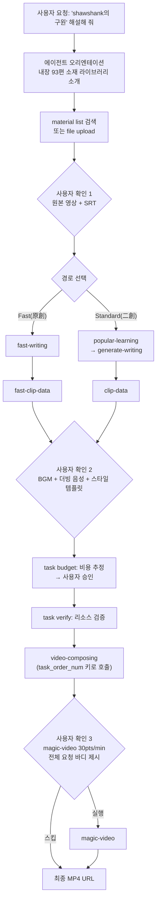

## 왜 읽어야 하나

"하나의 문장으로 자동화되는 콘텐츠 파이프라인"을 에이전트 스킬로 만들고 싶은 개발자라면, 이번 주에 하나를 결정해야 합니다. 파이프라인의 어떤 부분을 오픈소스로 갖고 올지, 어떤 부분을 벤더 API에 맡길지가 제품의 유지가능성을 좌우하기 때문입니다. 핵심 결론을 먼저 말합니다. narrator-ai-cli는 로컬 생성 도구가 아니라 유료 API 클라이언트이며, MIT 라이선스로 "오픈소스"인 것은 에이전트에게 명령 사용법을 가르쳐 주는 SKILL.md 파일뿐입니다. 이 글은 키 없이 실측한 사실과 마케팅 주장만인 사실을 구분해서 제시하고, 이 스킬을 외부 서비스 통합형 스킬 설계의 사례로 해부합니다.

## 개요

2026년 9월 29일(UTC) X에서 돌기 시작한 게시물입니다. "narrator-ai-cli-skill은 오픈소스라서 Claude Code 같은 에이전트에 넣기만 하면 사실상 신경 쓸 일이 없다. 'shawshank의 구원 해설해 줘'라고 한마디 하면 나머지는 전부 알아서 처리한다"는 내용으로, 여섯 가지 기능을 나열했습니다. 스크립트 자동 생성, 클립 카점(타이밍) 정확성, 63종 음색과 음성 클론, 90여 종 시각 템플릿, 146곡 BGM 자동 매칭, 완성 영상 직출.

프로젝트는 실제로 두 개의 저장소로 나뉩니다. 스킬 저장소(NarratorAI-Studio/narrator-ai-cli-skill)는 MIT 라이선스로, SKILL.md와 references/ 디렉터리(workflows.md, operations.md, magic-video.md, resources.md)로 구성됩니다. CLI 저장소(NarratorAI-Studio/narrator-ai-cli)는 Python 패키지로, Narrator AI API(openapi.jieshuo.cn)의 클라이언트 역할을 합니다. 공식 README의 비유가 정확한 표현입니다. "CLI는 손, 스킬은 뇌". 뇌는 무엇을 해야 하는지 결정하고, 손이 실제로 API를 호출합니다.


*원문 한마디에서 완성 영상까지, 에이전트가 리소스 확인과 비용 승인 단계를 거치며 조립하는 흐름을 형상화했습니다.*

## 이 기술/도구는 무엇인가

### 두 개의 경로: Fast Path와 Standard Path

SKILL.md의 파이프라인 다이어그램은 문장 생성을 두 경로로 나누고 있습니다.

| 경로 | 흐름 | 특징 |
|---|---|---|
| Fast Path(原創文案) | fast-writing → fast-clip-data → video-composing | "faster & cheaper" 공식 표기. 원문 스타일로 새로 쓰는 경우 |
| Standard Path(二創文案) | popular-learning → generate-writing → clip-data → video-composing | 인기 해설 영상에서 스타일을 학습(popular-learning)하고 그 스타일로 문장을 생성. 二創(이창) 콘텐츠 |

두 경로는 모두 video-composing으로 모입니다. 이때 video-composing은 이전 단계 결과의 task_order_num을 키로 호출합니다. magic-video(시각 템플릿)는 선택적 마지막 단계이고, 최종 산출물은 MP4 URL입니다. task types 명령으로 실제 확인 가능한 작업 유형은 9가지입니다. popular-learning, generate-writing, fast-writing, clip-data, fast-clip-data, video-composing, magic-video, voice-clone, tts.

### 내장 자산: 키 없이 실측한 세 숫자

API 키 없이 격리 환경(Python 3.12, v1.0.0 태그 설치)에서 자산 목록 명령을 재측정했습니다.

```bash
$ narrator-ai-cli material list --json | python3 -c "import json,sys; print(len(json.load(sys.stdin)))"
93
$ narrator-ai-cli bgm list --json | python3 -c "import json,sys; print(len(json.load(sys.stdin)))"
146
$ narrator-ai-cli dubbing list --json | python3 -c "import json,sys; print(len(json.load(sys.stdin)))"
63
```

영화 93편, BGM 146곡, 더빙 음성 63종. 게시물에 주장된 세 숫자와 정확히 일치합니다. 장르 분포는 劇情片(드라마) 17편, 動作片(액션) 15편, 愛情(로맨스) 12편, 喜劇片(코미디) 12편, 懸疑片(스릴러) 5편, 범죄 4편, 경찰·사법 4편, 애니메이션 3편, 판타지 3편, 판타지 코미디 3편 순입니다. 더빙 음성 ID는 MiniMaxVoiceId 형태로, TTS 기반이 MiniMax라는 것을 직접 보여 줍니다. 음성 이름도 "패왕별희-程蝶衣(Cheng Dieyi)"처럼 영화 캐릭터에 붙은 이름이 많아, "63종 음색"은 일반 보이스가 아니라 캐릭터 음성 중심 아카이브임을 알 수 있습니다.


*2026-09-30 키 없이 material list --json 재측정 결과. 총 93편.*

### SKILL.md의 본체: Agent Rules

이 스킬의 핵심은 명령어 매뉴얼이 아니라 SKILL.md에 쓰인 Agent Rules입니다. always 항목 다섯 개를 그대로 번역하면 이렇습니다.

1. **Confirm before acting.** 모든 리소스(원본 영상, BGM, 더빙, 템플릿)와 모든 magic-video 제출 전에 사용자의 명시적 승인을 받아야 합니다. 자동 선택·자동 제출은 금지입니다.
2. **Source data, never invent.** 영상 JSON은 material list 필드나 task search-movie 출력을 근거로 만들어야 합니다. 어느 쪽에서도 나오지 않으면 사용자에게 묻습니다.
3. **Honor the language chain.** 더빙 음성의 언어가 문장 작업의 language 파라미터와 magic-video 텍스트 파라미터를 동시에 결정합니다. 세 곳이 일치해야 합니다.
4. **Paginate to exhaustion.** material list는 total이 소진될 때까지 전부 페이지네이션해서 받아야 합니다. 잘린 터미널 출력을 신뢰하지 않습니다.
5. **Poll with the canonical while loop.** 작업 폴링은 5초 간격 while 루프를 사용해야 합니다. 고정 반복 for 루프는 금지입니다.

never 항목은 더 구체적으로 실패를 막는 규칙입니다. magic-video는 분당 30 포인트로 과금되고 되돌릴 수 없으므로, 제출 전에 전체 요청 바디(템플릿과 모든 template_params 값)를 보여 주고 사용자의 승인을 받아야 합니다. 내레이션 언어가 중국어가 아니면서 magic-video 텍스트 파라미터에 중국어 기본값을 넣으면, 영상 안에 중국어 텍스트가 그대로 뜨므로 제출 금지. task_id(32자 hex)를 order_num으로 넘기면 10001 "任务关联记录数据异常" 에러가 나오며, downstream 작업이 원하는 것은 task_order_num(generate_writing_xxxxx 형태의 접두어 문자열)입니다. 그리고 어느 단계든 실패가 나면 경로 자동 전환은 금지이며, 재시도·전환·중단 중 무엇을 할지 사용자에게 명시적으로 묻습니다.



*확인 게이트(1·2·3)가 파이프라인에 하드코딩된 구조. 실패 시에는 자동 경로 전환 대신 사용자에게 재시도·전환·중단을 물어야 합니다.*

### 첫 대화 규칙: 소재 라이브러리를 먼저 보여준다

SKILL.md에는 Conversation Initiation 절이 있습니다. 세션의 첫 메시지에서 사용자가 영상을 직접 업로드해야 한다고 가정하지 말고, 미리 준비된 소재 라이브러리(약 100편, 영상+SRT 완비)가 있다는 것을 먼저 알려야 한다는 지침입니다. 그리고 세 가지 진입점을 제시하게 돼 있습니다. "특정 영화가 있다"면 먼저 내장 소재를 검색하고 없으면 task search-movie로 폴백, "있을 것들을 보여줘"면 material list --json에서 다양한 장르를 포괄하는 5~8편을 제시, "직접 업로드하겠다"면 file upload를 안내. Fast와 Standard 경로 질문은 원본 소재가 확인된 뒤에야 허용됩니다. 사용자에게 맥락이 없는 선택을 강요하지 않기 위해서입니다.

## 설치 및 통합

실제 샌드박스에서 실행한 명령입니다.

```bash
# CLI 설치 (공식 README)
pip install "narrator-ai-cli @ git+github.com/NarratorAI-Studio/narrator-ai-cli.git"

# API 키 설정 (키 발급은 이메일 신청)
narrator-ai-cli config set app_key <your_app_key>

# 스킬 설치: 에이전트 스킬 폴더에 클론 (SKILL.md + references/ 둘 다 필요)
git clone https://github.com/NarratorAI-Studio/narrator-ai-cli-skill.git \
  /path/to/your/project/.skills/narrator-ai-cli
```

plugin.json의 메타데이터가 설치 스펙을 선언합니다. install 스펙은 pip + GitHub 아카이브 v1.0.0 zip, requires에는 narrator-ai-cli 바이너리와 NARRATOR_APP_KEY 환경 변수. 키는 셀프서비스로 얻는 것이 아니라 공식 메일로 신청하고, 포인트 잔액도 같은 회사가 운영합니다. 스킬 저장소에는 .gitleaks.toml과 .trufflehogignore까지 있고, CI 워크플로에서 시크릿 스캔을 돌리는 것으로 보입니다. 에이전트 스킬 저장소에서 시크릿 위생을 CI로 강제하는 모습은 흔치 않습니다.

## 실제 실험 결과

2026년 9월 30일, API 키 없이 재측정 가능한 전부를 실행했습니다.

| 항목 | 명령 | 결과 |
|---|---|---|
| 버전 | `--version` | narrator-ai-cli 0.1.0 (v1.0.0 태그 설치, 버전 필드 불일치) |
| 작업 유형 | `task types` | 9종 (위 표 참조) |
| 영화 소재 | `material list --json` | 93편, 장르 분포 캡처 |
| BGM | `bgm list --json` | 146곡 |
| 더빙 음성 | `dubbing list --json` | 63종, MiniMaxVoiceId* |
| 잔액 | `user balance` | "API key not configured. Run: narrator-ai-cli config init" |

키가 필요한 순간은 정확히 두 곳입니다. 잔액 확인(user balance)과 모든 생성 작업. 생성 전에 비용과 리소스를 점검하는 명령도 실제 존재합니다.

```bash
# 생성 전 포인트 비용 추정 (operations.md)
narrator-ai-cli task budget --json -d '{
  "learning_model_id": "<id>",
  "native_video": "<video_file_id>",
  "native_srt": "<srt_file_id>"
}'
# 반환: viral_learning_points, commentary_generation_points,
#       video_synthesis_points, visual_template_points, total_consume_points

# 생성 전 리소스 검증
narrator-ai-cli task verify --json -d '{"bgm":"<bgm_id>","dubbing_id":"<voice_id>",...}'
```

포인트 부족 시 에러 코드 10009(계좌 잔액 부족)와 10013(서브키 쿼타 부족)이 operations.md에 명시돼 있습니다. 실제 영상 생성은 실행하지 않았습니다. API 키를 갖추지 않은 상태이고, 이 글은 키 없이 검증 가능한 부분까지만 사실로 서술합니다. "클립 카점이 정확하고 BGM 매칭이 자연스럽다"는 문장은 벤더 주장으로, 이 글에서는 검증된 수치가 아닙니다.

## ThakiCloud 제품 적용 시사점

**Paxis 렌즈.** narrator-ai-cli-skill은 Paxis가 일급 리소스로 다루는 "외부 서비스 통합형 스킬"의 교과 사례입니다. 에이전트 오케스트레이션 관점에서 세 가지를 읽을 수 있습니다.

첫째, Agent Rules의 always/never 조항은 바로 정책 게이트의 텍스트형 구현입니다. 리소스 선택 전 인간 확인, 비용 추정(task budget) 후 승인, 되돌릴 수 없는 작업(magic-video)은 전체 요청 바디를 보여준 뒤 제출. Paxis가 Policy와 Audit Log를 일급 리소스로 만드는 이유와 같은 문법입니다. 차이는 실행 위치입니다. 이 스킬은 규칙을 텍스트로 써서 모델의 준수를 기대하고, Paxis는 같은 규칙을 정책 게이트와 감사 로그로 강제합니다. 2파일(SKILL.md + references/) 스킬로도 이 수준의 규율을 설계할 수 있다는 점은 스킬 작성자에게, 텍스트 규율이 강제 규율의 1차 단계라는 점은 플랫폼 설계자에게 시사합니다.

둘째, references/ 분리 구조는 토큰 관리 패턴입니다. SKILL.md에는 의사결정 흐름과 규칙만 두고, 주제별 상세(리소스 필드 매핑, 폴링 패턴, 에러 코드, magic-video 파라미터)를 references/ 네 파일로 지연 로드하도록 설계했습니다. Paxis의 스킬 설계가 SKILL.md는 얇고 references는 두꺼운 구조로 가는 방향과 정확히 같습니다.

셋째, 비용 가시성의 계약화. "분당 30포인트, 되돌릴 수 없다"는 문장이 스킬 본문의 never 항목에 있으면, 에이전트는 그 작업을 할 때마다 사용자에게 물어야 합니다. 사용자의 돈이 걸린 작업을 코드에 맡기지 않고 계약(프롬프트)에 쓰는 패턴입니다. ThakiCloud의 에이전트 워크플로에서 외부 과금 API를 호출하는 스킬을 만들 때, task budget와 같은 "조작 전 비용 추정" 명령을 게이트 단계로 두는 구조가 바로 이것입니다.

**ai-platform 렌즈(짧게).** 더빙 음성 63종의 ID가 MiniMaxVoiceId 형태라는 것은 TTS 레이어까지 벤더 API라는 뜻입니다. 동일한 "영화 해설 파이프라인"이 온프렘·소버린 환경에서 필요해지면, API 클라이언트 구간(문장 생성, TTS, 클립 합성)을 로컬 모델(예: VoxCPM2 계열 TTS)과 로컬 합성으로 교체해야 합니다. 스킬의 구조(확인 게이트, 비용 추정, references 분리)는 재사용 가능하지만, 실행 백엔드는 그대로 옮길 수 없습니다.

## 한계 및 반론

1. **"오픈소스"의 경계.** MIT는 스킬 파일에만 적용됩니다. 생성 파이프라인, 소재 라이브러리, TTS, 과금은 전부 폐쇄 서비스입니다. 게시물 원문의 "사실상 신경 쓸 일이 없다"는 문장은 에이전트의 행동에 대해서는 옳지만, 데이터 흐름(영상을 업로드하고 제3자 API를 통해 가공받는다)에는 적용되지 않습니다.
2. **벤더 의존.** 키 발급과 잔액 충전이 인력(이메일·WeChat)으로 운영되고, 서비스 변경 시 스킬은 죽은 문서가 됩니다. 에이전트가 볼 수 있는 서비스 장애 신호는 10009/10013 포인트 부족 에러뿐입니다.
3. **2차 창작(二創) 콘텐츠의 법적 회색지대.** 영화 화면을 활용한 해설 영상은 2차 저작물로, 저작권 상태는 관할법에 따라 다릅니다. 내장 93편은 서비스 제공자가 준비한 자산이지만, 배포 위험은 사용하는 측에 남습니다.
4. **성숙도.** v1.0.0 태그에 CLI --version은 0.1.0을 보고, 지원 채널이 개인 이메일입니다. 초기 프로젝트의 신호입니다.
5. **검증 한계.** 이 글은 영상 생성을 실행하지 않았습니다. 품질 관련 주장(카점 정확성, 매칭 자연스러움, "인력을 제로로")은 미검증입니다.

## 정리

narrator-ai-cli-skill은 "영화해설 영상을 자동으로 만들 수 있다"는 기능보다, 유료 외부 API를 감싸는 에이전트 스킬의 설계 사례로 읽을 가치가 있습니다. 키 없이도 검증되는 세 숫자(93편·146곡·63종)는 마케팅과 일치했고, 그 일치 자체가 "자산 목록은 공개하되 생성은 유료"라는 제품 구조를 보여 줍니다. 모든 확인 게이트, 비용 추정, 되돌릴 수 없는 작업의 전체 바디 공개라는 다섯 가지 Agent Rules는 ThakiCloud의 Paxis 스킬 거버넌스에 바로 이식할 수 있는 패턴입니다. 도입을 고려한다면, 먼저 자기 콘텐츠로 Fast Path의 task budget 추정값과 포인트 소모, 그리고 완성 영상 품질을 키 발급 후 측정하는 순서로 권합니다. 한 줄 takeaway. **스킬은 오픈소스이고, 파이프라인은 아닙니다.**

## 출처

- [narrator-ai-cli-skill (GitHub)](https://github.com/NarratorAI-Studio/narrator-ai-cli-skill)
- [narrator-ai-cli (GitHub)](https://github.com/NarratorAI-Studio/narrator-ai-cli)
- 원본 트윗: [candy @shenxiankk](https://x.com/shenxiankk/status/2104744469258195416)
- Aliyun 개발자 커뮤니티: [narrator-ai-cli 기반 해설 영상 워크플로](https://developer.aliyun.com/article/1727596)
- Tencent Cloud 개발자: [narrator-ai-cli 기술 구현 해설](https://cloud.tencent.com/developer/article/2654341)
