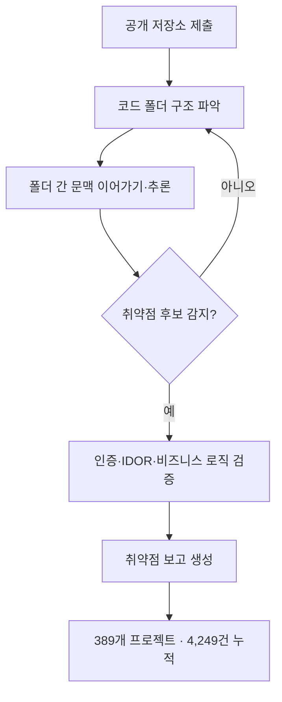

## 왜 읽어야 하나

에이전트를 프로덕션에 붙여 보안·인프라를 맡기는 엔지니어, 그리고 그 에이전트를 운영팀에 도입할지 말아야 하는 팀장을 위한 글입니다. 이번 주는 한 가지 문장을 확정했습니다. **보안 리뷰는 더 이상 사람이 코드를 눈으로 훑는 작업이 아니라, 오픈웨이트 모델이 스스로 코드를 뒤져 취약점을 찾는 에이전트 작업이 되었습니다.** 그리고 그 전환이 남긴 질문은 "쓸 것인가"가 아니라 "어떻게 돌리고, 어떻게 그 행동을 증명할 것인가"로 넘어갔습니다.

*에이전트가 코드 구조를 스캔하고 취약점을 탐지하는 흐름을 형상화했습니다.*

## 개요

Z.ai(지푸 AI)는 9월 30일, 자사 오픈웨이트 플래그십 GLM-5.3을 기반으론 취약점 감사 도구 OpenVuln이 지금까지 389개 오픈소스 프로젝트에서 4,249개의 잠재 취약점을 찾아냈다고 밝혔습니다. OpenVuln은 "여전히 실행 중"이라 이 숫자는 계속 늘어납니다. 공식 블로그의 초기 보고(약 2,400건)에서 4,249건으로 커진 것은 그 증거입니다.

이 마일스톤이 중요한 이유는 규모가 아니라 성격입니다. "모델이 코드를 봐서 버그를 찾는다"는 문장이 연구실 데모를 넘어, 실행 중인 도구의 운영 수치로 나온 순간입니다. 다키클라우드의 관점에서 보면, 에이전트가 실 업무를 처리하는 Agent-Native Cloud(피락시스)에서 보안 리뷰 같은 고위험 에이전트 작업은 격리·정책 게이트·감사 로그가 전제되지 않으면 도입 자체가 성립하지 않습니다. 이번 글은 그 전제를 OpenVuln이라는 구체 사례 위에 세웁니다.

## 이 기술은 무엇인가

OpenVuln은 Hugging Face Space(zai-org/OpenVuln)로 제공되는 도구입니다. 공개 저장소 주소를 제출하면, 에이전트가 저장소를 탐색하고 코드 전체를 훑어 취약점 후보를 보고합니다. 규칙 기반 정적분석(SAST)이 아니라, 폴더와 파일을 넘나들며 문맥을 이어가는 추론으로 동작한다는 점이 다릅니다.

그 추론을 떠받치는 모델이 GLM-5.3입니다. Z.ai의 743B 파라미터 오픈웨이트 플래그십으로, 2026년 8월 14일 출시됐습니다. GLM-5.2와 같은 기반 가중치 위에 확장된 포스트트레이닝을 얹은 변종입니다. 결과로 GLM-5.3은 Terminal-Bench 3.0에서 오픈소스 모델 가운데 가장 높은 점수를, Z.ai 내부 코딩 벤치에서는 전 세대 대비 약 50%의 향상을 기록했다고 보고됩니다. "오픈웨이트 가운데 코딩·에이전트 역량이 가장 강한 모델"이라는 포지션이 이 숫자들의 핵심입니다.

에이전트가 무엇을 보는지, 감사 흐름을 아래처럼 읽을 수 있습니다.

중요한 것은 E 단계입니다. 인증 우회, IDOR(부적절한 직접 객체 참조), 비즈니스 로직 오류는 인간 리뷰어가 실제로 보는 버그 클래스입니다. 정적분석 도구가 헷갈리는 영역이고, "코드를 한 번에 이해"하는 에이전트가 상대적으로 강합니다. OpenVuln가 389개 프로젝트에 걸쳐 이 클래스의 버그를 자동화했다는 의미는, 보안 리뷰의 한 축이 도구로 옮겨가고 있다는 것입니다.

## OpenVuln을 실행하면

가장 단순한 사용법은 Space에서 공개 저장소 주소를 넣고 실행하는 것입니다. 제출 즉시 에이전트가 저장소를 내려받아 폴더 구조를 파악하고, 파일을 넘나들며 취약점 후보를 탐색합니다. 결과로 보고가 생성되며, OpenVuln은 이 과정을 389개 프로젝트에 걸쳐 계속 실행해 4,249건을 누적했습니다.

같은 흐름을 로컬에서 돌리는 커뮤니티 구현도 있습니다. Swonkio/Vuln-GLM-5.3는 OpenVuln 시각 언어로 된, 로컬 소스 전용 에이전트 코드 감사 콘솔입니다. "공개 API로 보내지 않고, 내 머신에서 내 모델을 돌려 코드를 훑는다"는 구성이 핵심입니다.

여기서 오픈웨이트라는 성질이 실용 문제로 이어집니다. 코드를 서드파티 보안 API로 전송할 수 없는 조직(보안, 프라이버시, 규제 제약)은 자기 모델·자기 인프라에서 감사 에이전트를 돌릴 수 있습니다. 오픈웨이트는 그 선택지를 "불가능"에서 "설계 문제"로 바꿉니다.

## 검증된 성과

보고된 수치를 그대로 인용하되, 그 성격을 분명히 둡니다.

첫째, 4,249건과 389개 프로젝트는 Z.ai가 9월 30일 발표한 마일스톤입니다. "검출된 잠재 취약점"이지, "실제 패치 완료"나 "CVE 등록"이 아닙니다. OpenVuln이 "여전히 실행 중"이라 이 숫자는 시간이 지날수록 증가하며, 공식 블로그 초기 보고(약 2,400건)와 비교하면 그 성장이 보입니다.

둘째, GLM-5.3의 코딩·에이전트 역량 보고(Terminal-Bench 3.0 오픈소스 1위, 내부 벤치 전 세대 대비 약 50% 향상)는 Z.ai와 다수 매체의 보고를 토대로 합니다.

셋째, 이 역량의 이면이 함께 보도됩니다. 한 매체는 NIST가 해당 결과를 주목했다고 전했고, 다른 보도는 Anthropic이 GLM-3.3의 오프ensive(공격적) 역량을 둘러싼 경고를 냈다고 보도했습니다. 정확히는 GLM-5.3의 "등장한 사이버 역량(emergent cyber capabilities)"을 Z.ai가 공식 블로그의 주제로 삼고 있다는 점에 주목해야 합니다. 방어(취약점 발견)와 공격(익스플로잇 체인 구성)은 같은 역량에서 나옵니다. 이 이중성을 다음 절에서 Paxis 관점으로 다룹니다.

## ThakiCloud 제품 적용 시사점

**피락시스(Paxis) 렌즈.** 다키클라우드의 Paxis는 에이전트가 실 업무를 처리하는 Agent-Native Cloud입니다. 스킬 하네스, 샌드박스 격리 실행, 정책 게이트+감사 로그가 일급 리소스로 설계됩니다. OpenVuln는 이 설계가 왜 필요한지를 숫자로 보여주는 사례입니다. "코드를 혼자 뒤지며 취약점을 찾는 에이전트"는 그 자체로 고위험 에이전트 작업이고, 이를 프로덕션에 붙일 때 필요한 것은 (1) 격리된 실행 환경, (2) 접근을 통제하는 정책 게이트, (3) 모든 행동을 남기는 감사 로그입니다. 4,249건이라는 성과는 "에이전트가 일을 한다"의 증명이고, 그 일을 안전하게 하려면 Paxis의 세 가지 전제가 그대로 적용됩니다. 보안 감사 워크플로가 Paxis의 1급 도메인이 될 수 있는 근거가 여기에 있습니다.

**ai-platform 렌즈.** GLM-5.3가 오픈웨이트라는 점은 인프라 관점에서도 의미가 있습니다. 멀티테넌트 온프레미스 환경에서, 코드가 외부로 나가지 않는 조건에서 자기 모델을 서빙해 감사 에이전트를 돌릴 수 있습니다. self-hosting과 소버린리티를 요구하는 고객에게 "보안 리뷰를 외부 API에 의존하지 않고 내부에서 한다"는 구성은 직접적 가치입니다. 낮은 서빙 비용은 에이전트의 실행 빈도를 높이고, 실행 빈도는 감사의 커버리지로 이어집니다.

## 한계 및 반론

이 성과에는 명확한 경계가 있습니다.

첫째, 4,249건은 "검출"이지 "위협"이 아닙니다. 각 항목이 실제 취약점인지, 악용 가능한지, 이미 알려진 것인지에 대한 인력 검증이 뒤따라야 합니다. 자동화 검출은 리뷰 대상 목록을 만드는 데 강력하지만, 판정 자체를 대체하지 않습니다.

둘째, 에이전트 기반 감사는 false negative(놓치는 버그)의 문제가 더 큽니다. 4,249건을 찾았다는 것은 찾지 못한 부분이 있을 수 있다는 뜻이기도 합니다. SAST 도구가 규칙으로 커버하는 영역과 에이전트가 추론으로 커버하는 영역은 겹치지 않는 부분도 있습니다. 둘은 대체가 아니라 보완입니다.

셋째, 이중사용은 피할 수 없는 문제입니다. 같은 역량이 방어(취약점 발견)와 공격(익스플로잇 구성)을 모두 가능하게 합니다. 오픈웨이트는 이 역량을 누구나 실행 가능하게 만듭니다. 따라서 "모델을 어떻게 만들 것인가"의 논의와 별개로, "그 모델을 내 환경에서 어떻게 돌리고 어떻게 증명할 것인가"의 논의가 동시에 필요합니다.

넷째, "모델이 안전하다"는 문장은 성립하지 않습니다. 안전한 것은 모델이 아니라, 그 모델이 놓인 환경입니다. 격리, 정책, 감사, 그리고 최종 판정을 내리는 인간 리뷰어가 그 환경을 구성합니다.

## 정리

이번 주는 보안 리뷰라는 오래된 인력 집약 작업이 에이전트 작업으로 넘어가는 순간을 기록했습니다. OpenVuln과 GLM-5.3은 그 전환의 구체적 증거이고, 4,249건이라는 숫자는 "에이전트가 일을 한다"의 규모를 보여줍니다.

다음 행동은 명확합니다. 자기 코드베이스에 오픈웨이트 기반 감사 에이전트를 도입할지 검토하고, 도입한다면 격리된 실행 환경과 정책 게이트, 감사 로그를 전제로 설계하는 것입니다. "찾는 사람"이 사람이 아닌 시대, 담장은 모델 바깥이 아니라 모델과 환경 사이로 옮겨가야 합니다. 보안 리뷰를 에이전트가 끝내는 날, 그 에이전트를 어떻게 돌리고 어떻게 증명하는가가 팀의 경쟁력이 됩니다.

---

**출처**
- Z.ai 공식 블로그: [GLM-5.3: Frontier Coding with Emergent Cyber Capabilities](https://z.ai/blog/glm-5.3)
- OpenVuln (Hugging Face Space): [zai-org/OpenVuln](https://huggingface.co/spaces/zai-org/OpenVuln)
- 커뮤니티 구현: [Swonkio/Vuln-GLM-5.3](https://github.com/Swonkio/Vuln-GLM-5.3)
- Z.ai X 공지: [GLM-5.3 389개 오픈소스 프로젝트, 4,249개 취약점](https://x.com/Zai_org/status/2105132385700634721)
- The Agent Report: [Z.ai Tops the Open Coding Leaderboard on Post-Training Alone](https://the-agent-report.com/2026/08/glm-5-3-zai-post-training-coding-cyber/)
- Aitrove: [GLM-5.3 Z.ai Coding & Cybersecurity 2026](https://www.aitrove.ai/blog/glm-5-3-zai-coding-cybersecurity-2026)
