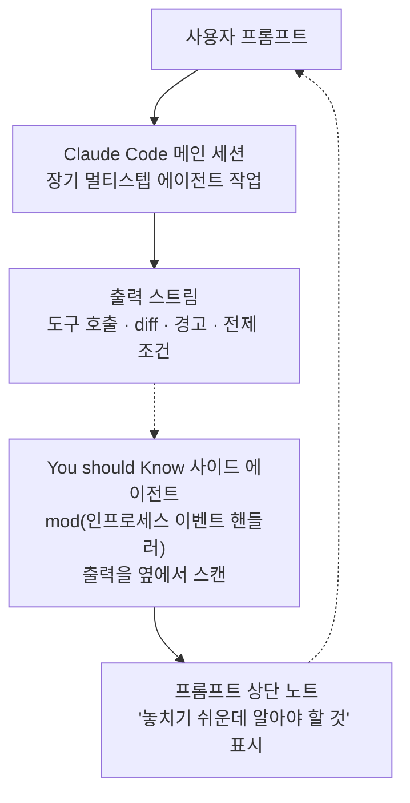

## 왜 읽어야 하나

수 시간짜리 에이전트 코딩 세션을 돌리는 개발자, 또는 팀의 에이전트 워크플로우를 운영하는 플랫폼 담당자라면 이 글을 읽어야 합니다. 결론은 한 줄입니다. **에이전트 세션이 길어질수록 병목은 '에이전트가 할 수 있느냐'에서 '사람이 결과를 따라잡을 수 있느냐'로 옮겨가고, Anthropic은 그 주의력을 대신 보는 사이드 에이전트를 Claude Code의 빌트인 기능(mod)으로 내놓았습니다.** You should Know는 Claude의 출력을 감시해 "놓치기 쉬운데 알아야 할 것"을 프롬프트 상단의 노트로 띄워 주는 기능입니다.

*수 시간의 출력을 사람이 실시간으로 따라잡을 수 없게 되면서, 병목은 'AI의 능력'에서 '인간의 주의력'으로 이동했다는 것이 이 글의 전제입니다.*

## 개요

2026년 10월 3일, Claude 개발 공식 계정은 새 플러그인 추가를 알렸습니다. "We're adding a new plugin to Claude Code: You should Know. It scans Claude's output for important information you might miss to help keep you in the loop." 공식 문서의 표현을 빌리면, 이 기능은 `cc-plugin-you-should-know`라는 이름의 빌트인 mod입니다. 활성화 명령은 `/plugin enable cc-plugin-you-should-know@builtin`이며, 기본적으로 꺼져 있습니다.

여기서 'mod'라는 단어부터 짚어야 합니다. 트윗은 "plugin"이라고 하지만, Claude Code 공식 문서는 이 기능을 mod로 분류합니다. mod는 플러그인 중에서도 Claude Code 내부에서 동작하는 종류라는 뜻입니다.

## mod란 무엇인가

문서의 정의를 그대로 옮기면, mod는 "Claude Code의 모양과 동작을 바꾸는 플러그인"입니다. JavaScript 또는 TypeScript로 된 이벤트 핸들러의 묶음으로, Claude Code가 이벤트가 발생할 때마다 하나를 호출합니다. 도구가 호출될 때, 프롬프트가 제출될 때, 인터페이스의 일부가 그려질 때입니다. 핸들러는 그 이벤트를 관찰하거나, 바꾸거나, 완전히 끌어올릴 수 있습니다.

문서는 mod가 할 수 있는 일을 다섯 가지로 나눕니다.

첫째, **사용자가 쓸 수 있는 인터페이스를 그립니다.** 전사(transcript) 옆의 패널, 또는 프롬프트 위를 가로지르는 밴드. 탭, 버튼, 텍스트 필드를 담을 수 있습니다. You should Know가 띄워 주는 '프롬프트 위의 노트'가 바로 이 능력의 산출물입니다.

둘째, **Claude Code가 스스로 그리는 인터페이스를 다시 그립니다.** 도구 호출의 행, 스피너, 질문을 받는 다이얼로그 같은 부분을 교체하거나 스타일을 바꿉니다.

셋째, **도구 호출이나 요청 안으로 들어갑니다.** 예를 들어 도구 호출을 잠시 붙잡아 두고 사용자에게 질문을 한 뒤, 도구를 실행하지 않은 채 답을 넘기거나, 요청 하나를 다른 모델로 보낼 수 있습니다.

넷째, **명령어에서 자기 코드를 돌립니다.** Claude의 턴을 거치지 않고, Claude가 작업 중이어도 `/command`로 즉시 함수를 실행합니다.

다섯째, **핸들러 사이에서 데이터를 공유합니다.** 같은 mod 파일 안의 핸들러들은 변수를 공유하므로, 한 핸들러가 도구 호출을 세면 다른 핸들러가 그 수를 스피너 옆에 표시할 수 있습니다.

*사용자 인터페이스 렌더링, 기존 UI 재구성, 도구 호출 개입, 백그라운드 명령어 실행, 데이터 공유 체계. 1번이 You should Know의 핵심 동작(프롬프트 위 노트)에 해당합니다.*

*메인 세션과 사이드 에이전트의 관계. 사이드 에이전트는 출력을 가로채지 않고 옆에서 스캔해, 필요할 때만 프롬프트 위에 노트를 올립니다.*

mod는 Claude Code CLI와 Claude Desktop의 Code 탭에서 동작합니다. 문서는 또 mod의 일부 소스가 Claude Code 저장소의 mods 디렉토리에 공개되어 있음을 밝힙니다. `/diff` 패널, AGENTS.md를 프로젝트 지시로 로드하는 `agents-md`, 정책 강제 모델 `sec-default`, 다른 mod가 호출할 메서드를 제공하는 `telemetry` 등이 그 예입니다. You should Know의 소스는 이 공개 목록에 없습니다.

## You should Know가 하는 일

문서가 이 기능에 대해 밝히는 동작은 다음 문장 하나입니다. "Runs a side agent that watches your back while Claude works on longer tasks. When it finds something worth knowing that you might miss, it shows you a note above the prompt."

해석하면 이렇습니다. Claude가 긴 작업을 하는 동안, 옆에서 사이드 에이전트가 일합니다. 그리고 "알아두면 좋지만 놓치기 쉬운 것"을 발견하면, 프롬프트 상단에 노트를 띄웁니다. 제3자 보도의 표현을 더 빌리면, 이 노트의 대상은 긴 세션의 출력이 쌓여 가독성을 잃는 지점에 묻히는 경고, 전제 조건, 깨지는 변경(breaking change)입니다.

세 가지 운영적 사실은 문서 기준입니다. 첫째, 기본값은 비활성입니다. `/plugin`의 Installed, Show disabled 항목에서 조직에 공개된 경우에 나옵니다. 둘째, 빌트인 mod는 Claude Code 자체의 애널리틱스 기록과 연결되어 있으며, `/plugin`에서 끄거나 `DISABLE_TELEMETRY` 같은 애널리틱스 계기로도 끌 수 있습니다. 셋째, 설치된 mod를 멈추는 설정과 플래그(`disableAllHooks`, `--bare`, `--safe-mode`)는 **빌트인 mod를 멈추지 않습니다.** 이 셋째가 보안 관점에서 눈에 띱니다. 제3자 플러그인을 중지하는 스위치가 1사(some-party) 관찰 기능에는 적용되지 않는다는 뜻이므로, 텔레메트리에 민감한 환경에서는 이 기능을 켤 때 그 전제까지 함께 확인해야 합니다.

롤아웃의 상태는 아직 진행형입니다. GitHub의 claude-code 저장소에는 "Built-in plugin startup tip references unavailable plugin"이라는 이슈가 올라 있어, 스타트업 팁은 모든 사용자에게 이 플러그인을 가리키지 않는다는 제보가 있습니다. 문서 자체가 "if available for your org"라는 조건을 붙이는 것도 같은 맥락입니다.

## ThakiCloud 제품 적용 시사점

**Paxis 관점**: 이 기능이 푸는 문제를 플랫폼 언어로 번역하면, "에이전트 세션의 인간 주의력 병목"입니다. Paxis는 에이전트의 모든 행동을 정책 게이트와 감사 로그로 통과시키는 Agent-Native Cloud 제어 평면인데, 감사 로그의 존재 이유는 본래 "사람이 에이전트를 따라잡지 못한다"는 전제 위에 서 있습니다. You should Know는 그 전제를 IDE 안에서, 세션이 진행되는 동안 실시간으로 풀어 봅니다. 감사 로그는 세션 후에 읽는 것이라면, 프롬프트 위의 노트는 세션 중에 읽는 것입니다. 같은 신호를 서로 다른 시간축에 배치한 두 설계라고 볼 수 있습니다.

*세션 종료 후 사후 감사(Paxis 감사 로그)와 세션 진행 중 실시간 개입(IDE 내부 프롬프트 상단)의 비교. 에이전트 맥락이 방대해질수록 사후 분석만으로는 예외 상태와 파국적 변경을 막을 수 없다는 지점입니다.*

Paxis에 이식할 질문은 명확합니다. 에이전트 워크플로우에서 "사람이 놓치면 안 되는 신호"는 무엇인가, 그리고 그 신호는 감사 로그에만 있어야 하는가, 아니면 실행 중인 세션의 특정 지점(장기 태스크 진입, 리스크 동작 직전, 예외 상태 전환)에 실시간 노트로 가야 하는가. You should Know는 후자의 정합성을 1사 도구가 먼저 확인해 준 사례입니다.

**ai-platform 관점**: 사이드 에이전트는 본질적으로 추가 추론입니다. 메인 세션의 출력을 옆에서 읽는 모델이 또 도는 구조이므로, 세션당 비용이 증가합니다. Metis 관점에서 보면 이는 "관찰 레이어의 추론 비용" 문제와 같고, 관찰의 가치를 비용보다 크게 만드는 신호 밀도 설계가 관건입니다.

*메인 추론 비용 위에 얹히는 관찰 추론 비용. 노이즈 없이 결정적 순간에만 경고가 뜨는 신호 밀도 설계가 '관찰의 가치 > 추론 비용'을 성립시킵니다.*

## 한계 및 반론

**동작의 단일 출처**: 이 글이 확인한 동작 설명의 1차 출처는 Claude Code 공식 문서의 한 문장입니다. 사이드 에이전트가 어떤 모델을 쓰는지, 스캔 주기가 무엇인지, 노트의 밀도를 어떤 기준으로 조절하는지는 공개 자료에서 확인되지 않습니다.

**신호 대 노이즈**: 제3자 보도도 같은 경고를 합니다. "시그널 대 노이즈 비율이 실제로 유지되는지 지켜봐야 한다"는 것입니다. 모든 세션에서 노트를 띄운다면, 노트는 곧 무시당하는 대상이 됩니다. 관찰 기능의 품질은 얼마나 침묵하는지로도 결정됩니다.

**텔레메트리 전제**: 문서상 이 기능은 Claude Code의 애널리틱스가 켜져 있는 환경과 연결되어 있고, 설치 mod를 끄는 플래그로 끌 수 없습니다. 프라이버시를 최우선으로 하는 워크플로우에서는 '켜는 행위 자체가 전제를 바꾼다'는 점을 감안해야 합니다.

**1사 편향**: Claude Code가 자기 제품의 출력을 1사가 관찰하는 구조를 내장했다는 점은, 중립적 관찰자(제3자 에이전트, 외부 감사)와의 대칭 문제입니다. 관찰자의 신원과 관찰 대상을 동시에 1사가 쥐는 구성의 한계는, 에이전트 거버넌스 논리에서 계속 따라붙을 것입니다.

*단일 출처 블랙박스, 신호 대 노이즈 비율, 텔레메트리 전제, 1사 편향 구조. 본문 한계 항목 4가지와 1:1로 대응합니다.*

## 정리

You should Know의 크기는 작습니다. 한 모드의 사이드 에이전트, 프롬프트 위의 한 줄 노트. 하지만 가리키는 방향은 세션이 길어질수록 반복해서 마주하게 되는 문제입니다. 에이전트가 일하는 동안 사람이 따라잡지 못하는 정보, 경고, 전제 조건. 이 기능은 그 간극을 '세션 후에 읽는 로그'가 아니라 '세션 중에 뜨는 노트'로 메우기 시작했다는 신호입니다.

에이전트 워크플로우를 돌린다면 다음 행동은 하나입니다. 자기 워크플로우에서 "사람이 놓치면 안 되는 신호" 목록을 만들어 보십시오. 그리고 그 신호를 지금 어디에 두고 있는지를 확인하십시오. 감사 로그에만 있다면, You should Know가 실험하고 있는 '실행 중 관찰' 지점을 검토할 때입니다.

*'여러분의 워크플로우에서 사람이 놓치면 안 되는 신호는 지금 어디에 있는가.' 세션 후 로그를 넘어 실행 중 실시간 노트로 거버넌스를 이동할 시점이라는 결론입니다.*

## 출처

- Claude 개발 공식 계정의 You should Know 발표 트윗 (RT): [x.com/hjguyhan/status/2106396751804633192](https://x.com/hjguyhan/status/2106396751804633192)
- [Claude Code 공식 문서: Mods overview (cc-plugin-you-should-know 항목 포함)](https://code.claude.com/docs/en/plugins/mods/overview)
- [tools4all.ai: Claude Code Adds 'You Should Know' Output Plugin](https://tools4all.ai/trends/claude-code-adds-you-should-know-output-plugin)
- GitHub anthropics/claude-code 이슈 #99071 (스타트업 팁이 미가용 플러그인을 가리키는 보고)
