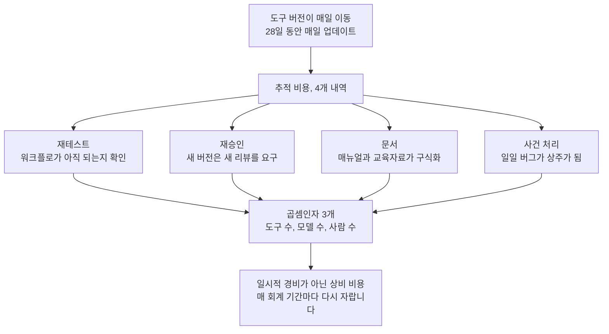

같은 회사가 하루 사이에 서로 모순된 두 메시지를 보냈습니다. CEO는 세상이 AI의 이익을 위해 나쁜 일까지 받아들여야 한다고 했고 제품 쪽은 28일 동안 매일 고치겠다고 약속했습니다. 이 모순을 붙여 읽으면 한 줄의 테이크아웃이 나옵니다. 산업의 업데이트 주기가 주 단위에서 일 단위로 넘어왔고, 그 비용을 내는 쪽은 매일 쫓아야 하는 기업이라는 것입니다. 오늘 이 글은 그 비용의 모양을, 오늘 아침 HuggingNews 다이제스트의 스토리들을 거두어 하나하나 그려 봅니다.

*글의 핵심 개념을 형상화했습니다.*

## 두 헤드라인을 나란히 놓으면

첫 번째 메시지부터 살펴봅니다. 오픈AI의 샘 올트먼 최고경영자는 AI의 잠재력을 온전히 실현하려면 부정적 결과를 감수할 의지가 필요하다고 말했습니다. 나쁜 일이 일어나게 두자, 정리는 나중에 하자, 그런 톤입니다. 익숙한 경영자 구호로 들릴 수도 있습니다. 하지만 같은 날, 같은 회사가 28일간 매일 업데이트를 내놓겠다고 발표하고 있는 상황에서 그 구호를 읽으면 무게가 달라집니다. 속도가 전략이 됐을 때, 속도에서 나온 부산물은 더 이상 제품 수준에서 통제할 수 없으므로 사회로 넘긴다는 것이 이 메시지 안에 이미 들어 있습니다.

두 번째 메시지는 제품 조직에서 나왔습니다. 오픈AI는 코딩 에이전트 Codex에 대해 28일 동안 매일 업데이트를 내놓겠다고 밝혔습니다. 코딩 어시스턴트와 생산성 도구가 한 달에 걸친 연속 개정에 들어가는 것입니다. 그리고 개정의 대상은 툴 복잡성에 대한 사용자 피드백입니다. 이 세세한 사실이 오늘 다이제스트에서 가장 중요한 단서입니다. 사용자가 더 똑똑해져 달라고 불평하는 것이 아니라, 도구가 너무 복잡하고 너무 자주 변한다고 불평하고 있다는 점을 보여주는 대목입니다. 복잡성은 사용자가 고른 단어입니다. 도구의 표면이, 그 도구를 쓰는 조직이 감당할 수 있는 크기보다 커졌다는 뜻이기도 합니다.

두 발표를 함께 읽으면 또 하나의 사실이 보입니다. 올트먼의 말은 앞으로의 방향을 서술한 것이고 Codex의 28일 약속은 그 방향의 대가를 지금 바로 치르는 것입니다. 한쪽은 서사이고 다른 쪽은 공정입니다. 서사는 헤드라인을 먹고 공장은 엔지니어의 주말을 먹습니다. 기업이 이 두 가지를 동시에 볼 필요가 있는 이유가 여기에 있습니다.

한쪽 메시지는 사회를 향한 것이었고 다른 쪽은 사용자를 향한 것이었습니다. 한쪽은 받아들이라고 했고 다른 쪽은 우리가 고치겠다고 했습니다. 두 문장을 나란히 놓으면 프론티어 랩의 속도와 기업의 속도 사이에 놓인 거리가 선명해집니다. 그리고 그 거리는 더 이상 능력이 아니라 운영 비용의 문제입니다.

## 추적 비용이라는 새 항목

이름부터 붙여봅니다. 도구의 버전이 매일 변해서 기업이 따라가느라 계속 들이는 부하를, 여기서는 추적 비용이라 부르겠습니다. 추정이 아니라 계산할 수 있는 항목입니다.

추적 비용에는 네 가지 내역이 들어 있습니다. 첫째는 재테스트입니다. 도구가 바뀔 때마다 기존 워크플로가 아직 되는지 확인해야 합니다. 둘째는 재승인입니다. 정책이 있는 조직에서는 새 버전이 새 리뷰를 요구합니다. 셋째는 문서입니다. 절차서와 매뉴얼과 교육 자료는 버전이 이동한 순간 구식이 됩니다. 넷째는 사건 처리입니다. 매일 도착하는 버그는 더 이상 이변이 아니라 상주가 되며, 상주에 대비하는 조직은 상주할 돈을 쓰게 됩니다.

이 네 항목에 공통점이 하나 있습니다. 대부분 AI 팀이 아니라 운영 조직의 몫이라는 것입니다. 모델 팀은 새 버전을 환영하지만 그 버전을 받아들이는 절차, 승인, 회귀 테스트, 사고 대응은 운영 쪽에 쌓입니다. 그래서 추적 비용은 예산표에서 잘 보이지 않습니다. 여러 팀의 여분 업무로 흩어져 있기 때문입니다.

이 네 항목은 도구 수, 모델 수, 사람 수와 곱해집니다. 이번 아침 HuggingNews 다이제스트는 그 세 곱셈인자가 동시에 커지고 있음을 보여줍니다.

먼저 모델 메뉴입니다. 독일 알레프알파는 자사 오픈웨이트 모델 Kolibri가 AIME에서 96.9% 점수를 기록했다고 발표했습니다. 개발사 자체 테스트 결과로, Qwen을 비롯한 여러 국제 라이벌을 앞섰고 유럽어 평가에서도 국제 라이벌을 웃돌았다는 내용입니다. 점수는 단일 출처이며 독립 재현은 확인되지 않은 상태입니다. 그러나 숫자의 진위를 떠나 중요한 것은, 메뉴가 넓어졌다는 사실입니다. 성능이 입증되는 수준의 오픈웨이트 모델이 하나 더 늘었으니, 기업이 고를 수 있는 집합이자 고르지 않으면 뒤처지는 집합이 함께 커진 것입니다.

다음은 기업용 모델 이야기입니다. Reflection은 70억 달러 규모의 지출을 거쳐 새로운 오픈웨이트 모델을 내놓습니다. 기업은 이달부터 이 모델을 내려받아 자사 비공개 데이터로 커스터마이징할 수 있으며 강조점은 기업 맞춤형 프라이버시에 있습니다. 이 스토리의 의미는 모델 자체보다 한 단계 뒤에 있습니다. 자사 데이터로 튜닝한 모델을 직접 돌린다는 옵션이 이제는 기업의 손이 닿는 곳에 놓였다는 것입니다. 옵션이 하나 늘면 선택이 하나 생기고, 선택이 생기면 비교와 검증과 책임이 생깁니다. 추적 비용은 여기서 한 칸 더 커집니다.

마지막으로 연산이 도는 환경입니다. 구글은 10월 1일 트릴륨 TPU 4기를 태양동기 궤도에 올렸습니다. 우주 데이터센터 환경에서 하드웨어가 AI 워크로드를 유지할 수 있는지 확인하기 위한 시험입니다. 지금은 4기이지만 이 움직임의 뜻은 연산의 위치가 더 이상 상수가 아니라는 것입니다. 같은 아침에 돈의 규모도 따로 움직였습니다. 한국 정부는 미국과 중국에 견줄 AI 경쟁력을 확보한다는 목표로 9000억 달러를 투자하기로 했고, 국가 교육 모델과 자금 구조를 재편하고 있습니다.

한 아침 사이에 모델 메뉴, 실행 환경, 자금 구조가 한꺼번에 움직였습니다. 프론티어 랩이 나쁜 일을 감수할 때, 비용은 사라지지 않고 따라가야 하는 기업 쪽으로 이동합니다. 조직이 클수록 추적이 느려지고 느려질수록 공백이 커집니다. 그 공백이 바로 지금 이 산업이 새로 쓰고 있는 송장의 모양입니다.

여기서 한 가지만 짚어 두겠습니다. 추적 비용은 일시적 경비가 아닙니다. 일일 변동이 산업의 기본 주파수가 되는 한, 이 비용은 매 회계 기간마다 다시 자라는 상비 비용입니다. 한 번에 드는 돈이 아니라, 계속 내야 하는 월세 같은 것입니다.

네 내역이 세 곱셈인자를 만나 상비 비용으로 끝나는 과정을 한 장으로 정리했습니다.

## 일일 변동이 에이전트 스택에 하는 일

한 가지를 짚고 넘어가야 합니다. 에이전트 스택은 모델 하나가 아닙니다. 도구, 커넥터, 정책까지가 모두 스택의 일부입니다. Codex 같은 도구가 매일 변하면, 그 위에 세운 에이전트 워크플로가 버전과 함께 깨집니다. 통점은 어떤 모델을 쓰느냐에서, 매일 변하는 도구를 어떻게 안정적으로 실행하느냐로 이동합니다.

전통적인 답은 단일 벤더로 고정하는 것이었습니다. 한 업체에 베팅하고 그 변동을 그대로 흡수하는 전략입니다. 위험은 분명합니다. 베팅이 틀리면 빠져나올 구멍이 없고 나쁜 일을 감수하라는 부담은 전적으로 기업 쪽에 떨어집니다. 일일 변동을 우연이 아니라 전략으로 삼는 환경에서, 고정되어 있는 비용은 더 이상 작은 금액이 아닙니다.

그렇다고 일일 변동을 막을 수도 없습니다. 변동을 만드는 쪽이 산업 전체이기 때문입니다. 한 랩이 매일 올리면 다른 랩도 주 단위로 올릴 것이고 그 사이 오픈웨이트 모델이 메뉴를 넓힐 것입니다. 막을 수 없는 변동 앞에서 기업에 남은 수단은 둘 중 하나뿐입니다. 변동을 쫓아갈 것인가, 아니면 변동을 감당하는 구조를 먼저 세울 것인가.

대안은 변동을 사건이 아니라 관리되는 이벤트로 바꾸는 것입니다. 네 가지가 필요합니다. 첫째, 모델과 도구가 하나의 고정 지점이 아니라 일급 리소스인 선택 가능한 집합이어야 합니다. 매일 변하는 도구를 하나 바꿀 때 전체를 다시 짓지 않아도 되는 이유가 여기에 있습니다. 둘째, 작업별로 모델을 골라 비용과 적합성을 비교하는 장치가 있어야 합니다. 메뉴가 커질수록 선택은 가끔 하는 결단이 아니라 계속되는 운영이 되므로, 그 운영을 기계화해야 합니다. 셋째, 실행은 격리된 환경에서 일어나야 합니다. 변동이 클수록 한 번의 실패가 터지는 범위도 커지고 격리는 그 범위를 줄이는 수단입니다. 넷째, 모든 판단과 실행은 기록으로 남아야 합니다. 누가, 어떤 모델로, 어떤 도구를 써서, 무엇을 실행했는지를 뒤늦게라도 답할 수 있게 하는 것은 기록뿐입니다.

이 네 가지가 갖춰지면, 매일의 버전 변화는 전체를 다시 짓는 일이 아니라 정책 범위 안에서 한 자원을 바꾸는 수준으로 줄어듭니다. 수비적인 태도가 아닙니다. 일일 속도로 움직이는 산업에서, 제한된 비용으로 그 속도를 유지하는 유일한 형태입니다.

## 결론: 나쁜 일을 감수할 필요는 없습니다

역설을 다시 기업 쪽으로 가져와 보겠습니다. 나쁜 일을 감수하라는 말은 프론티어 랩이 사회에 보낸 답입니다. 기업은 그 답을 그대로 받을 필요가 없습니다. 기업에게 아직 남아 있는 답이 하나 더 있습니다. 나쁜 일이 일어난 뒤에 감수하는 것이 아니라, 일어나기 전에 보일 수 있게 만드는 것입니다.

그 구조가 이미 제품으로 돌아다니고 있습니다. ThakiCloud의 Paxis가 그런 제품입니다. 정식 제품 v1.1 GA로 운영되는 Agent-Native Cloud이며 Skills, Tools, Policies, Audit Logs를 일급 리소스로 다룹니다. 에이전트의 자율도를 L0에서 L3까지 단계로 거버넌스하고 정책 게이트와 감사 로그가 에이전트가 무엇을 할 수 있는지를 제한하며, 실행은 격리 샌드박스 안에서 진행합니다. MCP 커넥터와 스킬 마켓이 도구의 변동을 흡수하고, 작업별 모델 선택을 맡은 CostRouter는 모델 메뉴가 넓어질수록 작업마다 가장 적합한 모델을 고릅니다. 비공개 데이터가 프론티어의 변동성 위에 올라가지 않길 원한다면, 소버린 온프레미스 K8s 배포인 ai-platform이 그 답을 제공합니다.

다음 28일이 이 글의 시험대가 됩니다. 매일의 업데이트가 약속처럼 지켜진다면, 일일 변동은 하나의 뉴스가 아니라 산업의 기본 주파수가 됩니다. 그때 기업에게 남아 있는 질문은 도입 여부를 묻는 것이 아니라, 도입한 것을 얼마나 안전한 주파수로 돌리느냐를 묻게 됩니다.

결국 오픈AI가 같은 날 보낸 두 메시지는 다시 한 번, 다른 뜻으로 읽을 수 있습니다. 이 산업은 이제 일일 변동으로 움직인다는 뜻입니다. 기업에 남은 질문은 쫓을 것인가가 아니라, 얼마나 제한된 비용으로 쫓을 것인가입니다. 나쁜 일이라서 감수해야 할 부분은, 이제 감사 로그와 정책 게이트가 대신 짊어집니다. 속도는 프론티어의 권리이고 제한된 비용으로 도는 것은 기업의 권리입니다. 오늘 아침의 다이제스트는 그 권리가 구체적인 형태로 갖춰지고 있다는 첫 장입니다.

## 참고 자료

이 글은 아래 뉴스를 종합해 작성했습니다.

- HuggingNews, [Reflection Launches Open AI Model to Rival China After $7B Spend](https://huggingnews.com/ai/reflection-launches-open-ai-model-to-rival-china-after-7b-spend-e25b7fad)
- HuggingNews, [Google Launches First AI Chips to Orbit for Space Data Centers](https://huggingnews.com/ai/google-launches-first-ai-chips-to-orbit-for-space-data-centers-e5322f15)
- HuggingNews, [Aleph Alpha Kolibri Beats Qwen With 96.9% AIME Score](https://huggingnews.com/ai/aleph-alpha-kolibri-beats-qwen-with-969percent-aime-score-50cae607)
- HuggingNews, [South Korea Invests $900B in AI to Rival US and China](https://huggingnews.com/ai/south-korea-invests-900b-in-ai-to-rival-us-and-china-90af984c)
- HuggingNews, [OpenAI CEO Sam Altman Says World Should Accept Bad Things for AI Benefits](https://huggingnews.com/ai/openai-ceo-sam-altman-says-world-should-accept-bad-things-for-ai-benefit-65a8d364)
- HuggingNews, [OpenAI Pledges 28 Days of Daily Codex Updates](https://huggingnews.com/ai/openai-pledges-28-days-of-daily-codex-updates-88a08fd8)
