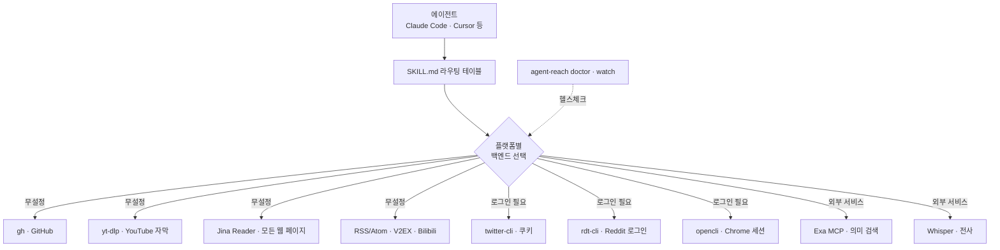

## 왜 읽어야 하나


*Agent-Reach의 위치를 한 장으로 보면 이렇습니다. 인터넷을 직접 긁는 크롤러가 아니라, 이미 무료인 접근 경로(Jina Reader, RSS, yt-dlp 등)를 에이전트의 표준 능력으로 전환하는 라우팅 레이어입니다.*

뉴스·문서·소셜 콘텐츠까지 읽어야 하는 AI 에이전트를 돌리는 개발자, 또는 그 에이전트의 외부 콘텐츠 비용(검색 API, 스크래핑 인프라, 구독료)을 책임지는 운영자라면 이 글을 읽어야 합니다. 결론은 한 줄입니다. **에이전트가 인터넷을 읽는 데 필요한 비용의 상당수는 애초에 0원이었는데, 우리는 매번 유료 API를 사는 데 쓰고 있었고, Agent-Reach는 그 무료 경로(Jina Reader, RSS, yt-dlp, gh)를 에이전트의 표준 능력으로 만들어주는 라우팅 레이어입니다.** 우리는 2026년 7월부터 ThakiCloud 스킬 시스템의 폴백 제공자로 이 도구를 쓰고 있는데, 이번에는 설치부터 실제 콘텐츠 읽기까지 다시 실측했습니다.

## 개요

2026년 10월 5일, "Your AI agent can now read the entire internet, with zero API fees"라는 트윗이 돌았습니다. Agent-Reach가 Claude Code, Cursor 등 에이전트에 꽂힌다는 내용입니다. 같은 날 우리는 이 도구의 저장소 태그라인을 확인했습니다. "Give your AI agent eyes to see the entire internet." 이어지는 설명은 Twitter, Reddit, YouTube, GitHub, Bilibili, XiaoHongShu의 읽기와 검색을 하나의 CLI로, API 비용 0원으로 한다는 것입니다.

"entire internet"은 당연히 마케팅 표현입니다. 그런데 핵심 주장, 즉 API 비용 0원이라는 부분은 실제 작동 방식에서 이해가 됩니다. Agent-Reach는 인터넷을 직접 파헤치는 크롤러가 아닙니다. 플랫폼별로 이미 무료인 접근 경로(공공 API, RSS, Jina Reader의 익명 엔드포인트, yt-dlp)를 골라내고, 필요한 CLI를 설치하고, 헬스체크를 해서 에이전트에게 "이 플랫폼은 이 명령으로 읽어"라고 라우팅하는 능력 레이어입니다.

우리가 이 글을 쓴 이유는 단순합니다. 에이전트를 돌리는 쪽에서 콘텐츠 접근은 반복 비용인데, "무료 경로가 있는지"를 매번 수작업으로 확인하는 것이 비효율적이기 때문입니다. Agent-Reach는 그 확인 과정을 `doctor` 한 줄로 압축합니다.

## Agent-Reach가 무엇인가

v1.5.0 기준 명령어 집합은 이렇습니다. `setup`(대화형 설정), `install`(원샷 설치), `configure`(설정 값 저장·브라우저 쿠키 추출), `doctor`(플랫폼 가용성 체크), `uninstall`, `skill`(에이전트 스킬 등록), `format`(플랫폼 출력 정제), `transcribe`(URL·오디오 전사, Whisper/Groq·OpenAI 경유), `check-update`, `watch`(정기 작업용 헬스 체크), `version`.

채널은 두 종류로 나뉩니다.

첫째, 무설정(로그인 불필요) 채널. 우리가 실측한 doctor 결과, 설치 직후 바로 쓸 수 있는 것은 15개 중 6개였습니다.

- GitHub: `gh` CLI로 저장소·코드를 읽고 검색
- YouTube: `yt-dlp`로 영상 정보와 자막 추출
- V2EX: 공개 API로 노드·토픽·댓글 읽기
- RSS/Atom: 피드 직접 읽기
- Bilibili: 검색 API(전체 기능은 별도 `bili-cli`)
- 모든 웹 페이지: Jina Reader(`curl https://r.jina.ai/<URL>`)로 마크다운 변환

둘째, 로그인·옵트인 채널. Twitter/X, Reddit, Facebook, Instagram, XiaoHongShu, Xueqiu, Xiaoyuzhou 팟캐스트, LinkedIn, Exa 의미 검색입니다. 이 쪽은 "API 비용 0원"이 적용되지 않습니다. watch 리포트의 Reddit 항목을 보면, Reddit에는 무설정 경로가 없고(익명 .json이 차단됐으며 공식 API는 인허가 과정이 필요하다), 데스크톱은 opencli가 Chrome 로그인 상태를 재사용하거나 서버는 rdt-cli를 설치해 rdt login을 해야 한다는 설명이 나옵니다. Twitter/X도 `twitter-cli` 설치에 쿠키가 필요하고, Facebook·Instagram은 `opencli`가 Chrome 로그인 상태를 재사용합니다.

구조를 다이어그램으로 보면 이렇습니다.




*채널 매트릭스입니다. 무설정 6개 채널은 API 비용이 0원이고, 로그인 및 옵트인 9개 채널은 비용이나 계정 리스크가 발생합니다.*

"zero API fees"의 정확한 의미도 여기서 정해집니다. Jina Reader의 익명 엔드포인트, RSS, GitHub/YouTube 공개 데이터 같은 무료 경로에서 발생하는 비용은 0원입니다. 반면 Exa 의미 검색, Whisper 전사, 각 플랫폼의 공식 API는 여전히 각각의 요금 체계를 따릅니다. Agent-Reach는 비용을 없애는 것이 아니라, 무료인 경로를 에이전트가 자동으로 선택하도록 만들어줍니다. 무료 경로에도 경계는 있습니다. Jina Reader의 익명 엔드포인트는 무제한이 아니라 자체 레이트 리밋이 있고, 연속 운영이면 Jina 문서가 API 키 사용을 권합니다. "무료"의 범위는 채널별로 다시 확인할 대상이라는 뜻입니다.

## 설치 및 통합

우리는 공유 venv에 git 소스로 설치했습니다.

```bash
VIRTUAL_ENV="$PWD/.venv" uv pip install "git+https://github.com/Panniantong/Agent-Reach.git"
.venv/bin/agent-reach doctor
.venv/bin/agent-reach version
```

`version`의 출력은 `Agent Reach v1.5.0`이었고, `check-update`는 "현재 버전: v1.5.0, 최신 버전임"을 확인시켜줬습니다. 10월 6일 기준 7월 15일 우리가 처음 설치한 버전과 같았습니다. 이번 트윗은 새 릴리스가 아니라 기존 도구의 재홍보였던 셈입니다.

`doctor`가 끝나면 스킬 파일도 자동 등록됩니다. 우리 머신에서의 출력을 그대로 옮기면 "Skill installed for Agent: ~/.agents/skills/agent-reach, Skill installed for Claude Code: ~/.claude/skills/agent-reach"입니다.

`watch`는 정기 작업용입니다. `cron`이나 스케줄러에서 돌리면 채널별 상태를 리포트하고, 죽은 채널에는 재설치 명령을 함께 제시합니다. "설치"와 "모니터링"이 같은 CLI 안에 있다는 점이 이 도구의 운영형 디자인입니다.

이 SKILL.md가 통합의 핵심입니다. 파일은 코드가 아니라 라우팅 테이블입니다. 플랫폼마다 "읽기 명령"과 "검색 명령"이 매핑되어 있고, 에이전트가 이 표를 보면 "웹 페이지는 Jina Reader로, 유튜브 자막은 yt-dlp로" 읽는 법을 알게 되어 각자의 shell로 명령을 실행합니다. Agent-Reach가 '읽기 API'를 직접 제공하는 것이 아니라 '무엇으로 읽을지'라는 지식을 에이전트의 스킬로 주입하는 구조이기 때문에, shell 명령을 실행하고 파일을 읽을 수 있는 에이전트(Claude Code, Cursor 등)에서는 추가 코드 없이 동작합니다.

주의할 점도 있습니다. `agent-reach install`은 node, mcporter 등 시스템 의존을 끌고 오기 때문에 전체 설치보다는 doctor로 현재 상태를 확인하고, 필요한 채널만 선택적으로 여는 쪽이 안전합니다. Reddit 같은 채널은 `rdt-cli`를 별도 설치하고 `rdt login`을 해야 하는 식입니다.

## 실제 실험 결과

설치 직후 doctor 실험으로 확인한 무설정 채널 6개를 실제로 사용해보았습니다.

첫 실험은 Agent-Reach 저장소 페이지 자체를 Jina Reader로 읽는 것이었습니다.

```bash
curl -s "https://r.jina.ai/https://github.com/Panniantong/Agent-Reach"
```

출력은 23,090바이트의 마크다운이었습니다. 제목, URL 출처, README 본문이 포함되어 있었고 API 키는 쓰지 않았습니다. 에이전트가 이 도구의 문서를 읽으려면 이 한 줄이면 됩니다.

두 번째 실험은 RSS 피드 읽기였습니다. Hacker News 피드를 받아 항목 수와 제목을 뽑았습니다.

```bash
curl -s "https://news.ycombinator.com/rss"
```

피드는 11,482바이트였고, 항목은 30개였습니다. 상위 5개 제목을 그대로 옮기면 "Beam: Reflection's 501B open-weight model", "Dust: Pretraining Transformers Without Backpropagation", "Opus 5.5 agents discover two room-temperature magnetic semiconductor candidates", "Find the flattest route between any two points in SF", "Web Search API"입니다. XML 파싱 한 줄이면 에이전트가 헤드라인 모니터링을 할 수 있는 구조입니다.

세 번째는 doctor와 watch 리포트입니다. doctor는 6/15 채널 가용을, watch는 나머지 9개 채널별로 "무엇이 설치되어야 하는지, 어떤 로그인 상태가 필요한지"를 명령어와 함께 제시했습니다. 이 두 출력은 에이전트가 스스로 "이 환경에서는 어떤 콘텐츠 접근이 가능한가"를 판단하는 근거가 됩니다.


*이번 글의 세 실험 결과를 한 장으로 모았습니다. Jina Reader로 GitHub 저장소 페이지를 읽은 23,090바이트, HN RSS 파싱의 30개 항목, 전체 실험 비용 0원입니다.*

비용 합계는 0원이었습니다. 세 실험 모두 무료 엔드포인트만 사용했기 때문입니다. 물론 이 숫자는 "우리 실험 구간"의 비용이고, Exa 검색이나 전사 같은 유료 채널을 쓰면 각자 요금이 붙습니다.

## ThakiCloud 제품 적용 시사점

ThakiCloud의 Paxis는 Agent-Native Cloud로, 에이전트가 도구를 쓰는 방식 자체를 일급 리소스로 다룹니다. Skills, Tools, Policies, Audit Logs가 그것입니다. Agent-Reach의 설계는 Paxis의 그 관점에서 꽤 정확히 들어맞습니다.

Paxis는 960개 이상의 스킬을 BM25로 골라 격리 샌드박스에서 실행합니다. Agent-Reach의 SKILL.md 라우팅 테이블은 그보다 작은 규모로 같은 패턴을 보여줍니다. "이 플랫폼은 이 도구로"라는 매핑을 스킬 파일에 쓰고, 에이전트가 매핑을 찾아 실행하는 구조입니다. 둘 다 도구의 목록을 코드가 아니라 데이터(스킬 파일)로 유지하는 방식이고, 그래서 새 플랫폼을 추가할 때 에이전트 코드를 안 고쳐도 됩니다.

우리는 이미 이 패턴을 쓰고 있습니다. ThakiCloud 스킬 시스템에서 주 방법(WebFetch, gh, 전용 스크래퍼)이 403이나 페이월, 레이트 리밋에 걸리면 Agent-Reach의 Jina Reader 경로로 폴백합니다. 2026년 7월 15일 검증부터 같은 조합입니다.


*Paxis의 폴백 아키텍처입니다. 주 방법(WebFetch/스크래퍼)이 403 Forbidden·Paywall·Rate Limit으로 실패하면 Agent-Reach의 Jina Reader 경로로 전환해 파이프라인이 생존합니다.*

콘텐츠 접근은 에이전트 파이프라인에서 실패율이 가장 높은 구간 중 하나인데, 무료 폴백 경로가 하나 생긴 것만으로도 파이프라인 생존율이 올라갑니다.

두 번째 시사점은 정책 게이트입니다. Twitter, XiaoHongShu, Instagram 같은 로그인 채널은 각 플랫폼의 ToS 회색 지대에 있습니다. Paxis에서 이런 도구를 쓰려면 "어떤 채널을 켜는지, 어떤 쿠키로 실행하는지"를 정책 게이트와 감사 로그에 남기는 구조가 필요합니다. Agent-Reach는 `configure`로 브라우저 쿠키를 추출하는데, 그 쿠키가 어떤 계정의 것인지, 어디까지 허용되는지를 에이전트 플랫폼 쪽에서 통제해야 합니다.

## 한계 및 반론

"entire internet"을 믿으면 안 됩니다. 15개 플랫폼이고, 그중 6개만이 무설정입니다. Reddit에는 아예 무료 경로가 없고, Twitter·Facebook·Instagram은 로그인 상태가 전제입니다. 나머지 인터넷(일반 웹사이트의 뒤쪽 페이지, 로그인 필수 서비스, PDF, 이미지)는 이 도구의 범위를 벗어납니다.

"전체 무료"로 읽으면 안 되는 부분도 있습니다. 15개 채널 중 "zero API cost"가 실제로 적용되는 것은 키가 필요 없는 무설정 6개뿐입니다. `transcribe` 명령은 반례입니다. URL이나 오디오를 전사할 때 Whisper를 경유하는데, 그 백엔드로 Groq 또는 OpenAI를 쓰며 둘 다 유료 API입니다. Exa 의미 검색도 마찬가지로 Exa 키가 필요합니다. 즉 Agent-Reach의 "API 비용 0원"은 읽기 채널의 성질이지, 도구 전체의 약속이 아닙니다. 채널별 비용 경계를 다시 확인하는 것은 도입자의 몫입니다.

쿠키 기반 채널의 계정 리스크도 실재합니다. Chrome 세션을 재사용하는 opencli 방식은 개인 계정으로 실행되는 것과 다름없고, 플랫폼이 비정상 접근으로 판단하면 계정 제재가 따라올 수 있습니다. 운영 환경에서는 전용 계정을 분리해 쓰는 것이 정석인데, Agent-Reach 문서가 이를 강제하지는 않습니다.

CLI 출력이 중국어라는 점도 v1.5.0에서는 사실입니다. doctor, watch, check-update의 상태 메시지가 모두 중국어로 나옵니다. 기능에는 지장이 없지만, 비중국권 팀에서 로그를 읽거나 에이전트에게 해석을 맡기면 소소한 비용이 생깁니다. 이 도구가 중국 커뮤니티를 주 대상으로 만든다는 뜻이기도 하고, 그것이 다시 ToS 회색 지대 채널(XiaoHongShu, Bilibili)의 비중으로 이어집니다.

`format` 서브명령이 현재 xhs(XiaoHongShu) 출력 정제만 지원한다는 점도 마찬가지입니다. "플랫폼 출력 정제"라는 이름에 비해 실제 범위가 좁습니다.


*시스템 경계와 운영 리스크의 요약입니다. '전체 인터넷'의 환상, 쿠키 채널의 계정 제재 회색 지대, 비중국권 환경의 오버헤드, 그리고 라우팅 레이어의 한계까지.*

마지막으로, Agent-Reach는 라우팅 레이어일 뿐 해석 레이어가 아닙니다. Jina Reader가 돌려준 마크다운이 광고와 본문을 구분해 주는 것은 아닙니다. RSS 항목이 실제로 에이전트의 작업과 관련 있는지를 판단하는 것은 여전히 에이전트의 몫입니다. "인터넷을 읽게 해준다"는 표현 뒤에 "읽은 것을 쓰는 판단은 별도"라는 전제가 항상 따라와야 합니다.

## 정리

에이전트가 인터넷을 읽어야 할 때, 유료 API를 사기 전에 먼저 무료 경로가 있는지 확인하는 습관을 들일 때입니다. Agent-Reach는 그 확인을 `doctor` 한 줄로 만들어줍니다. 설치 직후 무설정 6개 채널(Jina Reader, RSS, YouTube 자막, GitHub, V2EX, Bilibili)이 바로 열리고, 로그인 채널은 필요할 때만 여는 구조입니다.

우리에게 이 도구는 마케팅이 아니라 반복 비용을 줄이는 실용 경로였습니다. 에이전트 파이프라인에서 콘텐츠 접근 실패가 사라지면, 그 만큼 실험을 돌릴 여유가 생깁니다. 다음 단계로 추천하는 것은 이 두 가지입니다. 자신의 에이전트 환경에 `agent-reach doctor`를 돌려 현재 가용 채널을 확인하는 것, 그리고 로그인 채널을 켤 때 정책 게이트와 감사 로그를 함께 설계하는 것입니다.
