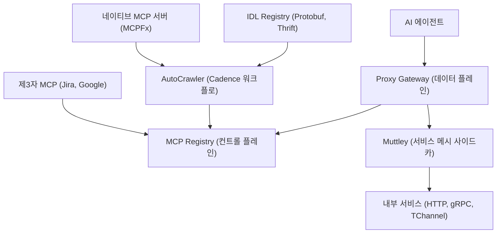
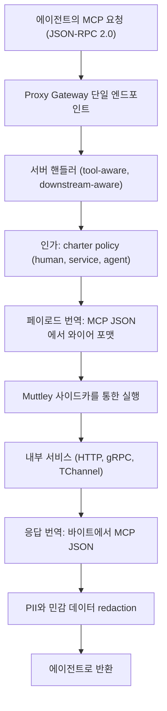

## 왜 읽어야 하나

회사 단위 에이전트 플랫폼을 짓거나, 내부 API 수천 개를 AI 에이전트에 어떻게 노출할지 결정해야 하는 개발자, 아키텍트라면 이 글을 읽어야 합니다. 결론부터 말하면, **Uber는 800개가 넘는 MCP 서버와 5000개가 넘는 툴을 단일 MCP Gateway로 통합했고 그 핵심은 세 가지 결정이었습니다. 기존 서비스를 재작성하지 않고 프로토콜 번역으로 MCP를 만든 것, 발견은 곧 노출이 아니라 disabled-by-default 거버넌스로 시작한 것, 그리고 컨텍스트를 희소 자원으로 다뤄 단계적 탐색과 응답 투영, 코드 모드로 context bloat를 푼 것.**

## 개요

Uber의 AI 에이전트 도입은 빨랐습니다. 초기에 각 팀이 즉흥적으로 MCP(Model Context Protocol) 연동을 만들었고 그 가치는 명확했습니다. 에이전트가 실시간 비즈니스 컨텍스트에 접근하고 내부 서비스를 조회하고 사용자 대신 실질적인 작업을 수행하면서 훨씬 역량이 강해졌습니다.

그런데 도입이 가속화되자 문제가 드러났습니다. 개별 팀이 독자적으로 연동을 만들면서 도구와 인프라가 파편화되었고 중복 구축이 일어났습니다. MCP 툴은 찾기 어려웠고 안정적으로 운영하기 어려웠으며 특정 서비스나 에이전트 구현에 강하게 결합되어 있었습니다. 소규모에서는 통하던 방식이, 수백 개 팀이 에이전트 워크플로를 탐색하기 시작하자 한계였습니다. 통합 아키텍처가 없으면 스케일할수록 운영 복잡도, 보안 리스크, 개발자 마찰이 커지고 에이전트의 영향력은 오히려 제한됩니다.

*초기 즉흥적 MCP 연동이 수백 개 팀 규모로 확장되면서 드러난 세 가지 문제. 중복 구축, 특정 서비스나 구현에 대한 강한 결합, 그리고 에이전트가 툴을 찾지 못하는 발견 불가 상태입니다.*

2026년 10월 초, Uber 엔지니어링 블로그에 이 문제를 해결한 "Designing MCP Gateway: Uber's MCP Management Platform"이라는 글이 올라왔습니다. Business Platform 조직의 Alok Srivastava(Principal Engineer)와 Uday Kiran Medisetty(Distinguished Engineer)를 포함해 8명의 엔지니어가 공동 저자입니다. 이 글이 설명하는 MCP Gateway는 현재 800개 이상의 MCP 서버와 5000개 이상의 툴을 호스팅하고 있는 Uber 내부의 MCP 상호작용 전체를 담당하는 기반 마이크로서비스입니다.

## 이 기술은 무엇인가

MCP Gateway는 AI 에이전트와 Uber의 백엔드 서비스, 그리고 네이티브 MCP 서버 사이의 오케스트레이션과 라우팅 레이어입니다. Uber는 마이크로서비스 아키텍처로 수천 개 내부 서비스를 운영하고 있고 이들은 HTTP, gRPC, TChannel로 API를 노출합니다. 이 API들은 에이전트에게 가치 있는 컨텍스트인데, 각 팀에 MCP 서버를 수작업으로 작성하게 만드는 것은 느리고 고통스러운 일입니다.

게이트웨이는 두 개의 주요 구성 요소로 나뉩니다.

- **MCP Registry(컨트롤 플레인)**: 수백 개 MCP 서버의 카탈로그를 유지하는 단일 진실 공급원입니다. 내부 서비스 기반 서버에서 완전 네이티브 구현까지, 툴은 기존 API를 MCP 툴로 노출하는 no-code 정의부터 MCP 스펙에 맞춰 직접 구현한 것까지 폭넓게 들어 있습니다. 레지스트리는 생태계 전체의 발견(discovery), 소유(ownership), 활성화(enablement)의 정본입니다.
- **Proxy Gateway(데이터 플레인)**: 런타임에 MCP 요청을 실행하는 핵심 서비스입니다. MCP 프로토콜 호출을 HTTP, gRPC, TChannel 요청으로 번역하고 적절한 백엔드 서비스로 전달하고 응답을 다시 MCP 호환 결과로 변환합니다. 에이전트는 기존 시스템과 일관된 MCP 인터페이스로 대화하는데 하위 서비스는 아무것도 바꿀 필요가 없습니다.

핵심 인사이트는 이겁니다. 기존 API가 에이전트에 툴을 제공하는 가장 빠른 길입니다. 서비스를 에이전트 시대에 맞게 재작성하라고 요구하는 대신, MCP Gateway는 팀이 있는 자리에서 맞습니다. 프로토콜 번역이 중간에서 투명하게 일어나기 때문에 다운스트림 서비스의 변경은 제로입니다.

*컨트롤 플레인과 데이터 플레인의 관계. AutoCrawler가 IDL과 네이티브 서버를 스캔해 레지스트리에 채우고 Proxy Gateway가 런타임에 요청을 번역해 서비스로 전달합니다.*

## 설계 1. 컨트롤 플레인: AutoCrawler의 발견

레지스트리에 툴이 들어오는 경로는 세 갈래입니다.

**IDL 기반 서비스.** Protobuf 또는 Thrift IDL로 정의된 전통적인 백엔드 서비스는 AutoCrawler가 IDL 레지스트리로부터 MCP 서버와 툴을 직접 파생합니다. AutoCrawler는 Cadence 기반 분산 워크플로 시스템으로, IDL 레지스트리와 내부 서비스 시그널에 구독됩니다. 고정 스케줄의 크론이 워크플로를 트리거해 새로 추가된 서비스, API, 스키마 변경을 스캔합니다. 서비스:API 그룹 하나마다의 절차는 다음과 같습니다.

1. 해당 서비스를 위한 가상 MCP 서버를 업서트합니다.
2. 연관된 Protobuf 또는 Thrift 파일을 파싱해 메서드 이름, 요청과 응답 스키마, 문서 주석을 추출합니다.
3. LLM을 사용해 추출된 스키마와 주석 기반으로 에이전트가 이해하기 쉬우도록 강화된 툴 설명을 생성합니다.
4. Protobuf/Thrift 스키마를 MCP 호환 JSON-RPC 2.0 스키마로 변환합니다.
5. 생성된 툴을 disabled-by-default 상태로 레지스트리에 등록합니다.

**네이티브 MCP 서버.** MCP 프로토콜을 직접 구현한 서버도 지원합니다. Uber가 네이티브 MCP 서버를 만들기 위한 프레임워크인 MCPFx로 작성한 서버마다 heartbeat 메트릭을 방출하고 AutoCrawler가 이 시그널을 계속 모니터하며 새로운 서버를 발견합니다. 발견되면 그 서버에 listTools를 호출해 명시적으로 노출하는 툴과 스키마를 가져오고 동일한 disabled-by-default 상태로 가상 프록시 서버를 만듭니다.

**제3자 MCP 서버.** Jira나 Google 같은 외부 서비스 연동도 게이트웨이가 중추입니다. 여기서는 두 구성 요소가 협력합니다. MCP Gateway는 호출자의 사용자 토큰을 다운스트림으로 릴레이하면서 인가, 레이트 리미팅, 민감 데이터 redaction 같은 게이트웨이 능력을 적용하고 제3자 MCP 서비스는 내부 사용자 토큰을 해당 외부 서비스의 인증 토큰으로 교환한 뒤 외부 MCP 서버로 요청을 전달합니다.

*IDL 기반(AutoCrawler), 네이티브(MCPFx), 제3자(Jira, Google) 세 갈래가 레지스트리로 수렴합니다. 세 경로 모두 다운스트림 서비스 코드 수정 없이 에이전트 생태계에 편입된다는 점이 공통점입니다.*

이 공통 기반 덕분에 수천 개 서비스 규모의 MCP 발견이 확장되면서도, 서비스 팀은 크리티컬 패스에서 벗어 있습니다.

## 설계 2. 데이터 플레인: 번역과 실행

Proxy Gateway는 런타임 서비스입니다. 컨트롤 플레인의 서버와 툴 설정을 계속 소비하고 고정 주기로 인메모리 상태를 갱신합니다. 툴 업데이트나 활성화 변경 같은 설정 변화가 재시작이나 재배포 없이 실시간으로 반영됩니다.

이 설정에 따라 데이터 플레인은 가상 MCP 서버를 동적으로 물질화(materialize)합니다. 각 가상 서버는 `/[서버이름]/mcp` 단일 엔드포인트를 노출하고 이것이 에이전트 실행의 진입점이 됩니다. 들어온 요청은 내장 프록시 서버를 통해 해당하는 서버 핸들러로 해결됩니다. 핸들러는 tool-aware이자 downstream-aware라서, MCP 요청을 런타임에 올바르게 라우팅하고 실행합니다.

IDL 기반 다운스트림의 경우, 핸들러는 HTTP 엔드포인트 설정이나 gRPC/TChannel 절차 같은 다운스트림 목적지를 설명하는 인메모리 매핑을 유지합니다. MCP 요청이 도착하면 들어온 JSON 페이로드를 적절한 와이어 포맷으로 번역하고 요청을 다운스트림으로 전달하고 Protobuf/Thrift 바이트 응답을 MCP 호환 JSON으로 다시 변환해 호출 에이전트에 돌려줍니다. 실제 다운스트림 요청 실행은 Muttley가 담당합니다. Uber의 모든 백엔드 서비스 곁에 도는 서비스 메시 사이드카인데, 실행을 Muttley에게 위임함으로써 MCP Gateway는 기존 서비스 간 라우팅 능력을 자동적으로 물려받습니다.

*요청 하나당 일어나는 일. 인가와 redaction은 툴 단위 Granularity로 게이트웨이 안에 내장되어 있습니다.*

## 설계 3. 거버넌스: 발견은 노출을 전제하지 않는다

레지스트리가 자동적으로 서버를 만들어도, 그 서버와 툴의 소유와 제어는 서비스 팀에 남습니다. 게이트웨이의 핵심 설계 원칙은 "발견은 노출을 전제하지 않는다(discovery doesn't imply exposure)"입니다. 모든 MCP 서버와 툴은 비활성 상태로 시작하며 소유 팀의 명시적 리뷰와 활성화가 필요합니다. 서비스 소유자는 활성화 전에 생성된 툴 정의를 검토하고 다듬을 수 있습니다.

툴 설명에 대한 모든 변경은 설정 변경 diff를 트리거하고 이는 서버 소유자의 승인을 받아야 합니다. 소유자는 승인과 배포를 하고 필요하면 이전의 알려진 버전으로 롤백합니다.

보안은 툴 단위 Granularity로 내장됩니다. 게이트웨이는 Uber 내부 Access Control System을 사용해, 감지된 호출자 액터(human, service, agent)에 대해 설정된 charter policy를 적용합니다. charter policy는 서버 레벨로 만들며 필요하면 툴 레벨 오버라이드가 가능합니다. 툴 응답의 PII와 민감 데이터 redaction은 기본값입니다.

*발견은 노출을 전제하지 않는다는 원칙의 구체적 구현. 자동 발견된 툴은 Disabled-by-Default 상태로 등록되고, 소유자의 Diff Review 승인을 거쳐야 Charter Policy 하의 활성 풀에 들어갑니다.*

## 설계 4. 컨텍스트 경제학: context bloat를 푸는 세 가지

게이트웨이가 수백 개 서버로 확장되면서 부딪힌 가장 큰 문제는 토큰 비용이었습니다.

**단계적 발견: Omni MCP.** MCP에는 서버 간 탐색이라는 네이티브 개념이 없습니다. 에이전트는 어떤 서버와 대화할지 알아야만 그 서버에 어떤 툴이 있는지 물을 수 있고 에이전트에 MCP 서버를 설정하려면 서버 URL, 자격 증명, 툴 목록을 명시적으로 와이어링해야 합니다. 수백 개 서버를 그렇게 하면 안 되고 그 모든 컨텍스트가 모델 컨텍스트 한도를 잠식합니다. Uber의 답은 Omni MCP, 하나의 프록시 서버입니다. 모든 게이트웨이 서버에 접근하게 하면서 단계적 발견 패턴을 제공하고 증분적 발견으로 컨텍스트와 토큰을 최적화합니다. 네 가지 툴을 노출합니다.

- `discover_server`: 쿼리의 의도에 기반해 MCP 서버를 발견
- `discover_tools`: 특정 서버의 툴을 조회
- `get_tool_schema`: 툴의 JSON 스키마를 가져옴
- `invoke_tool`: 툴을 실행

이 네 툴 하나로 증분적 발견과 전 서버 접근, 내장 access control과 나머지 게이트웨이 기능을 동시에 제공합니다.

**응답 투영: Response Projection.** GraphQL 같은 호출 패턴을 MCP 툴에 제공합니다. 툴 요청 스키마에 새로운 필드를 주입해, 모든 필드가 아니라 필요한 필드만 요청하도록 게이트웨이에게 지시합니다. 게이트웨이는 런타임에 응답을 자르면서 투영된 필드만 남깁니다. 이게 기업 레벨에서 MCP의 API 스키마 호환성을 확장시킨 요인입니다.

**코드 모드: aifx.** 코딩 에이전트는 대부분 셸 환경에서 움직이고 툴 출력을 모델 컨텍스트에 올리는 것보다 파일에 바로 쓰는 것이 효율적입니다. aifx는 Uber의 에이전틱 작업용 CLI로, MCP 서버를 설치할 필요 없이 게이트웨이를 통해 MCP 호출을 라우팅합니다. 컨텍스트에 MCP 정의가 없이도 에이전트가 올바른 툴을 발견하도록 돕습니다. 세 개의 명령을 제공합니다.

- `aifx mcp list`: 사용 가능한 MCP 서버 목록
- `aifx mcp search`: 모든 MCP 서버의 툴 탐색
- `aifx mcp call`: MCP Gateway를 통해 툴 실행

에이전트는 이 명령들을 한 줄로 체이닝해서 출력을 파일에 쓸 수 있고 파일시스템이 컨텍스트 대용량이 됩니다. 코드 모드는 이제 Uber에서 코딩 에이전트의 MCP 툴 사용 회사 기본값입니다.

*context bloat를 푸는 세 기술. Omni MCP의 단계적 발견, Response Projection의 필드 투영, aifx의 코드 모드가 각각 토큰 비용을 줄이는 방식이 다릅니다.*

## ThakiCloud 제품 적용 시사점

이 설계는 ThakiCloud의 두 제품 모두에서 직접적인 참고가 됩니다.

**ai-platform 렌즈.** ThakiCloud의 ai-platform은 K8s 기반 AI/ML SaaS 인프라로, Metis가 고객 환경을 위해 모델을 서빙합니다. Uber의 패턴을 그대로 읽어보면, "기존 서비스 재작성 금지 + 프로토콜 번역"은 서빙 엔드포인트를 에이전트 툴로 노출하는 문제와 동일합니다. 모델 서빙 API를 에이전트가 쓰는 툴로 바꾸는 과정에서 downstream 변경 제로를 지키는 것, Muttley처럼 서비스 메시 사이드카에 실행을 위임하는 것, charter policy처럼 멀티테넌트 인가를 액터 유형(사람/서비스/에이전트)별로 분리하는 것, 이 세 가지는 온프렘과 소버린 요구가 많은 환경에서 특히 유효합니다. 게이트웨이가 "팀이 있는 자리에서 팀을 맞는다"는 원칙은, 고객이 이미 운용 중인 API를 에이전트 세계로 끌어들이는 비용이 재작성이 아니라 번역으로 떨어든다는 의미입니다.

**Paxis 렌즈.** Paxis는 ThakiCloud의 Agent-Native Cloud로, Skills, Tools, Policies, Audit Logs를 일급 리소스로 다룹니다. Uber의 "발견은 노출을 전제하지 않는다"는 원칙은 Paxis의 정책 게이트와 감사 로그 모델과 같은 방향입니다. 에이전트가 툴을 발견하는 것(discovery)과 실제로 쓸 수 있게 하는 것(enablement)을 분리하고 그 사이에 소유자 승인(config change diff)과 롤백을 두는 구조는, 에이전트 행동을 정책 게이트+감사 로그로 통과시키는 Paxis의 실행 모델과 1:1로 대응합니다. Omni MCP의 단계적 발견과 aifx의 코드 모드는 Paxis의 Skill Harness가 960개 이상의 스킬을 BM25로 선택하는 방식의 산업적 정답과도 닮아 있습니다. 컨텍스트가 희소 자원이라는 전제 위에서, 에이전트에게 "모든 도구"가 아니라 "필요한 순간의 필요한 도구"만 보여주는 것입니다.

*ThakiCloud 적용 관점. ai-platform 렌즈는 zero-rewrite 번역 레이어와 메시 위임·멀티테넌트 인가를, Paxis 렌즈는 정책 게이트의 발견/노출 분리와 Skill Harness의 단계적 발견을 짚습니다.*

## 한계 및 반론

**단일 크리티컬 패스.** 모든 MCP 트래픽이 기반 마이크로서비스 하나로 수렴합니다. 가용성, 용량, 지연은 이제 Uber 전체 에이전트 경험의 단일 실패점이 됩니다. 공개된 글에는 SLO, 장애 격리, 캐파싱 설계가 없으므로, "800개 서버 5000개 툴"이라는 숫자 뒤에 어떤 운영 투자가 있었는지 알 수 없습니다.

**리뷰 부담의 전가.** disabled-by-default는 안전장치이면서 동시에 채택 장벽입니다. LLM이 생성한 툴 설명의 품질은 원 IDL의 문서 주석 품질에 달려 있고 5000개 툴 규모의 리뷰와 활성화는 결국 각 서비스 팀의 인력을 소모합니다. 자동화가 발견을 빠르게 만들수록, 거버넌스가 활성화 속도를 제한할 수 있습니다.

**IDL-first 전제.** no-code 변환은 Protobuf/Thrift IDL이 있는 서비스에 한합니다. IDL이 없는 REST 서비스나 문서가 빈약한 서비스는 MCPFx로 네이티브 MCP 서버를 직접 작성해야 하며 그때는 "팀이 있는 자리에서 맞는다"는 명제가 약해집니다. 제3자 연동도 파트너마다 제3자 MCP 서비스를 만들어야 하는 구조입니다.

**종적 정합성 윈도우.** 데이터 플레인이 고정 주기로 인메모리 상태를 갱신하므로, 활성화나 롤백이 반영되기까지 지연이 존재합니다. 실시간에 가까운 통제보다 주기적 동기화를 택한 설계의 대가입니다.

**반론: 중앙집중 vs 팀 자율.** 수백 개 팀 규모에서는 통합 제어 평면이 정답일 수 있지만 팀 수가 훨씬 적은 조직에서는 서비스별 자체 MCP 서버가 더 빠를 수 있습니다. Uber의 선택은 스케일에 대한 결정이지, 보편적인 정답이라기보다는 "우리 규모의 문제"에 대한 우리 답입니다.

## 정리

Uber MCP Gateway에서 가져갈 것은 세 가지입니다.

1. **발견은 노출을 전제하지 않는다.** 자동 발견으로 카탈로그를 채워도, 활성화는 소유 팀의 명시적 승인만으로 이루어집니다. 에이전트 인프라에서 거버넌스를 디폴트로 설계하는 모델입니다.
2. **번역이지 재작성이 아니다.** 기존 API를 프로토콜 번역으로 MCP로 만들면, 다운스트림 변경이 제로가 됩니다. 에이전트 도입의 실제 비용은 모델이 아니라 이 번역 레이어의 유무에서 결정됩니다.
3. **컨텍스트는 희소 자원이다.** 단계적 발견(Omni MCP), 응답 투영(Response Projection), 코드 모드(aifx)는 모두 "에이전트의 컨텍스트에 무엇을 올릴지"를 설계 문제로 다룹니다.

글이 결론으로 삼는 문장을 인용으로 끝내겠습니다. "에이전트 시스템을 대규모로 만드는 것에서 가장 어려운 부분은 AI가 아니다. 실제 사용자를 대신해 프로덕션에서 움직일 만큼 에이전트를 신뢰하게 만드는 connective tissue, 즉 발견·보안·신뢰성인 것이다." ThakiCloud가 지는 문제도 같습니다. 모델을 서빙하는 것, 에이전트를 실행하는 것보다, 수천 개 도구와 정책과 감사 기록을 하나의 제어 평면으로 묶는 것이 더 어려운 일입니다.

내부 API를 에이전트에 노출하려는 팀이라면, 다음 실행은 이 세 가지로 좁혀집니다. (1) IDL 또는 스키마가 있는 API 목록을 뽑는 것, (2) 그중 no-code로 전환 가능한 범위와 네이티브 구현이 필요한 범위를 구분하는 것, (3) 활성화 승인 프로세스(누가, 어떤 diff를, 언제 승인하는지)를 먼저 정하는 것.

## 출처

- [Designing MCP Gateway: Uber's MCP Management Platform (Uber Engineering Blog, 2026)](https://www.uber.com/us/en/blog/designing-mcp-gateway/)
