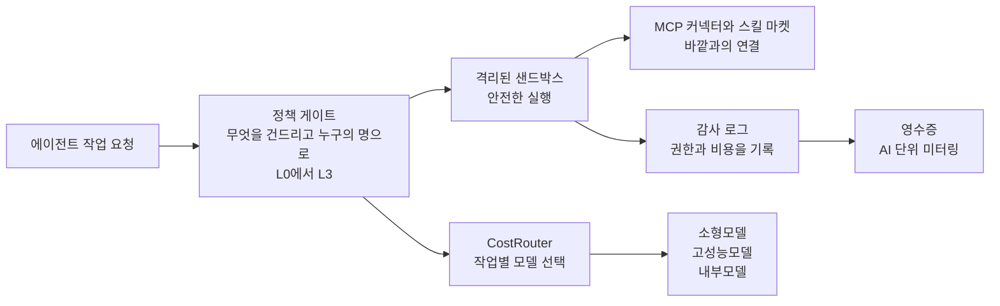

SAP의 새 청구서에는 항목이 하나 생겼습니다. 'AI 단위'입니다. 한 단어인데, 기업이 AI를 대가는 방식이 이 항목과 함께 바뀝니다. 더 이상 월정액 구독이 아니라, 에이전트가 추론하고 일하는 만큼 소진하는 형태입니다. 사용 현황도 함께 가시화된다는 점까지 포함하면, 이 청구서는 과거의 구독 계약서와는 종족이 다른 문서입니다. 그리고 이 청구서는 10월, SAP가 정식 내놓은 '자율적 기업(Autonomous Enterprise)'이라는 새 단어와 함께 고객 앞에 놓인 것입니다.

약간 역설적인 조합입니다. 에이전트가 스스로 판단하고 일을 끝까지 수행하는 기업이라는 '자율'에, 미터가 달린 영수증이 동봉된 것입니다. 같은 주, 서울의 IT 업계도 세 가지 목소리로 같은 말을 했습니다. 삼성SDS 부사장은 인터뷰에서 '에이전트가 늘수록 권한이 복잡해진다'고 했습니다. SK AX는 사업을 '엔터프라이즈 AI 통합 관제탑'으로 이름 지었습니다. KT는 AX 청사진의 구호를 '자주 써야지'로 정했습니다.

한 주의 헤드라인을 한 줄로 모으면 이동이 보입니다. 기업용 AI의 첫 질문이 '얼마나 똑똑한가'에서 '감사할 수 있고 측정할 수 있고 멈출 수 있는가'로 바뀌었다는 것입니다. 그리고 이 역설의 한가운데에는 기업들이 줄곧 미루던 질문이 자리합니다. 에이전트가 정말로 일하게 되면, 영수증은 어디에 두느냐는 것. 물론 한 줄의 변화로 보기엔 이번 주가 좀 특별한 쪽입니다. 30년 넘게 기업의 장부를 관장해 온 회사가 '자율'을 제품으로 내놓았다는 점, 그리고 한국에서는 그 자율에 통제를 어떻게 걸지 논하는 세 회사가 같은 주에 입을 열었다는 점이기 때문입니다.

*미터가 달린 영수증 위에 움직이는 에이전트를 이 글의 핵심 개념으로 형상화했습니다.*

## ERP 거인이 청구서를 바꾼 날

실리콘앵글(SiliconANGLE) 보도가 가리키는 핵심은 한 문장입니다. '앱 안의 AI(AI in the app)'가 아니라 '앱 위의 AI(AI on the app)'라는 뜻입니다. 자율적 기업 아키텍처는 5월 사파이어(Sapphire) 행사에서 처음 제시됐고, 10월 두 축인 Joule Work와 Joule Desktop이 정식 제품(GA)으로 전환됐습니다. 각 애플리케이션에 도우미를 박아두는 대신, Joule이 SAP 앱과 비SAP 앱을 모두 가로질러 의도를 읽고 일을 수행하는 구조입니다.

그 뒤에 든 '비밀무기'는 ERP의 데이터, 프로세스, 정책, 관계로 짠 구조화 지식그래프. 재무, 공급망, 스펜드, 인력, 고객경험. 도메인 특화 자율 에이전트가 이 영역 각각에서 확장되고 있고 범용 모델이 이 지식을 재현하기는 어렵다는 점을 SAP가 경쟁력으로 삼는 것입니다. 동시에 '인간이 루프에 남아 거버넌스, 감사, 투명성을 확보한다'는 원칙을 유지합니다. 국내 금융과 공공이 요구하는 통제와 감사가 정확히 이 지점에서 만나는 셈입니다.

한국 관점에서도 이 GA는 단순한 글로벌 뉴스가 아닙니다. 제조, 금융, 공공에서 여전히 시스템 오브 레코드의 자리에 있는 ERP 위에, 에이전트 업무를 실제로 올릴 수 있다는 신호이기 때문입니다. 과금 변화는 여기서 한 번 더 봐야 할 대상이기도 합니다. 구독 중심에서 'AI 단위'로 소진하는 소비형으로 넘어오면서 에이전트 추론 비용이 매달 가시화됩니다. 업계는 이를 기업 AI 운영의 새로운 FinOps 과제로 부르는 것입니다. SAP가 10월에 파는 '자율적 기업'은 결국 능력 자체보다, 미터가 붙은 능력입니다. Salesforce와 ServiceNow도 헤드리스 애플리케이션과 컨텍스트 레이어로 같은 방향을 밀고 있는 것입니다. 한 회사의 기호가 아니라 산업의 무게중심 이동입니다.

<!-- nlm-visual -->

*NotebookLM이 소스를 종합해 생성한 인포그래픽입니다.*

## 서울의 세 가지 목소리

삼성SDS는 10월 말 '패브릭스(FabriX) 2.0'를 출시하고 11월 중순까지 고객사에 순차 배포한다고 밝혔습니다. 이투데이 인터뷰에서 신계영 부사장이 요약한 '에이전트 거버넌스'의 4요소는 권한, 비용, 보안, 평가입니다. 논리는 단순합니다. 에이전트가 다른 에이전트에게 작업을 넘겨주는 구조에서, 에이전트가 권한 없는 시스템에 닿거나 임의로 권한을 주고받게 되면 '통제 기준점'이 사라지는 것입니다.

그를 위해 꺼낸 장치가 'AI 게이트웨이'입니다. 단순 반복업무는 소형모델로, 복잡한 추론은 고성능모델로, 기밀데이터는 외부 대신 내부모델로. 토큰 비용을 줄이고 데이터 유출로를 막는 자동 라우팅입니다. 챗GPT나 제미나이 같은 외부 에이전트의 스킬과 MCP도 API로 연계해 마켓플레이스에 모아 관리하고, 키워드 필터와 가드레일, 레드티밍 모델까지 제공합니다.

그리고 이 거버넌스의 수요는 이미 공공에서 시작되고 있는 셈입니다. 법제처와 정부24 같은 공공기관이 노코드 환경에서 AI 에이전트를 직접 만들고 있다는 사실이 보도된 것은, 통제의 문제가 도입 후의 사후 과제가 아니라 도입 전의 선결 과제임을 보여 주는 대목입니다.

SK AX는 관제탑 자체를 팝니다. 제미나이, 챗GPT 엔터프라이즈, 클로드 엔터프라이즈, M365 코파일럿을 하나의 환경에서 통합 관리하고 사용자의 권한, 접근, 사용 이력, 보안 정책을 제어합니다. 올해 5월에는 오픈AI와 공식 서비스 파트너 계약도 맺었습니다. 대한경제 보도가 짚는 '쉐도우 AI', 관리 체계 없이 외부 AI를 쓰는 임직원의 행동이 새로운 보안 리스크로 부상한 것도 같은 맥락입니다. KT는 여기서 한 박자를 더 나아가 사용률의 문제를 말합니다. '자주 써야지'라는 구호 자체가, 전제가 성능이 아니라 빈도와 습관이라는 인식입니다. KT가 함께 내놓은 것은 데이터 밖으로 내보내기 어려운 금융, 공공, 제조 고객을 위한 소버린 AI 어플라이언스, NPU LLM 스테이션입니다. 서울의 세 목소리가 실제로는 같은 통제 레이어를 세 각도에서 보고 있었던 것입니다. 권한, 사용, 배치.

## 모델의 홍수, 그리고 낡아 가는 질문

한 주의 모델 소식만 모아도 흐름은 선명합니다. 로이터 보도에 따르면 딥시크는 120억 달러 이상의 신규 투자 라운드를 마무리하는 직전이며, 배터리 기업 CATL과 텐센트가 최대 지분에 참여합니다. 미스트랄은 1조 파라미터 멀티모달 모델 '미스트랄 Large 4'를 공개했고, 가중치 오픈은 안전성 테스트 후 약 3주 안에 예정되어 있습니다. 엔비디아가 8억 달러를 베팅한 리플렉션 AI의 '빔(Beam)'도 총 5,010억 매개변수 중 작업당 230억 개만 활성화해 추론 연산량을 동급 오픈 모델의 4분의 1 수준으로 줄인 설계입니다. 가중치와 파인튜닝 도구의 무료 배포는 이달 말로 예정되어 있습니다.

눈에 띄는 세부도 있습니다. 미스트랄에는 삼성전자가 9월, 30억 유로를 투자해 주주라는 점입니다. 오픈웨이트가 쏟아지는 국면에서, 한국의 반도체 회사가 유럽의 프런티어 랩에 지분을 넣은 셈입니다.

한 주에 세 건의 신규 행보가 나온다는 것은, '어떤 모델을 쓸 것인가'라는 질문이 저해상도가 되어 간다는 뜻입니다. 모델 간 성능 차이가 압축되고 추론 단가는 내리막을 걷습니다. 그런 국면에서 기업이 손에 잡을 차별 변수는 더 이상 모델이 아니라 그 위의 층입니다. 에이전트가 어떤 시스템에 닿을 수 있는지, 얼마를 쓰는지, 무엇을 남기고 마는지를 따지는 것. 그것이 곧 청구서의 본문입니다.

## 예측: 자율은 더 이상 성능 문제가 아니라 감사 문제

1년에서 2년을 내다볼 때, 에이전트 거버넌스는 정보보안 준수가 겪은 과정을 반복할 것입니다. 공공 입찰과 금융 감사가 '감사 로그가 있는가'를 필수 항목으로 요구하는 것처럼, 에이전트 운영에 '어떤 데이터에, 언제, 누구의 권한으로 닿았는가'가 첫 질문이 됩니다. 이 질문에 답하지 못하는 기업은 '에이전트를 쓸 것인가'의 결정 단계조차 밟지 못합니다. 자율도를 높일수록 이 감사의 무게는 성능 문제의 그림자를 완전히 덮습니다.

청구서도 같은 논리를 따릅니다. 추론이 'AI 단위'로 계량되는 순간, '어떤 작업에 어떤 모델을 쓰고 얼마를 쓰는지'는 IT부서의 문제가 아니라 CFO의 문제가 됩니다. 쉐도우 AI까지 겹치면 이야기는 더 커집니다. 관리 밖에서 쓰인 AI도 어딘가에서는 이미 비용을 쓰고 데이터를 다루고 있을 테니, 통제 레이어가 없는 환경에서의 '자주 쓰는 AI'는 생산성이 아니라 사고의 표면이 됩니다. 미터기가 설치된 곳에서 진짜 공급자가 되는 것은, 미터를 읽히고 밸브를 잠글 수 있는 쪽입니다. 이번 주 SAP와 삼성SDS, SK AX의 발표는 모두 그 자리에 앉기 위한 시도입니다.

## 이 주 뉴스에 Paxis 렌즈를 얹으면

Paxis는 ThakiCloud의 Agent-Native Cloud입니다. v1.1 GA로 운영 중인 정식 제품입니다. 이번 주 뉴스를 Paxis의 렌즈로 보면 방향은 새롭지 않습니다. 삼성SDS가 정리한 '에이전트 거버넌스 4요소'도, SAP가 강조한 '인간이 루프에 있다'는 원칙도, Paxis는 처음부터 구조에 넣어 두었습니다. 스킬, 도구, 정책, 감사 로그는 부속 기능이 아니라 워크로드와 같은 등급의 일급 리소스입니다.

Paxis에서 에이전트가 자율적으로 행동할 수 있는 높이는 L0에서 L3까지 단계로 고정됩니다. 실행 전에는 정책 게이트가 무엇을 건드릴 수 있는지, 누구의 명으로 건드릴 수 있는지를 판단합니다. 기밀데이터가 외부 모델로 빠져가는 경로에 대해 삼성SDS가 내부모델 라우팅으로 막으려 한 것, Paxis는 정책 게이트가 그 판단을 구조 단위로 수행합니다. 모든 실행은 격리된 샌드박스 안에서 일어나며 바깥과의 연결은 MCP 커넥터와 스킬 마켓을 통합니다. 소버린을 요구하는 고객에게는 온프레미스 K8s(ai-platform) 위에서도 같은 워크로드가 돌아갑니다. CostRouter는 작업마다 모델을 골라 단순한 일은 소형모델로, 무거운 추론은 고성능모델로 보냅니다. 삼성SDS가 이번 주 꺼낸 'AI 게이트웨이'와 같은 논리인데, Paxis에서는 나중에 붙인 기능이 아니라 설계 자체가 그렇습니다. 이번 주 뉴스가 드러낸 네 가지 통증, 감사, 권한, 안전한 실행, 비용. Paxis는 이 네 가지를 나중에 끼워 맞추는 것이 아니라, 리소스로 미리 조립해 놓은 구조입니다.

이 통제 흐름을 한눈에 정리하면 다음과 같습니다.

SAP는 자율에 영수증을 달았고 삼성SDS는 4요소를 이름 지었으며 SK AX는 관제탑을 세웠습니다. 그리고 모델 레이어는 쏟아지고 있는 셈입니다. 한 주의 뉴스 뒤에 숨은 공통 변수는 하나입니다. 영수증을 끊을 수 있는 능력. 첫 '비인간 직원'을 채용하려는 기업의 질문에 Paxis가 내놓는 답은 명확합니다.

영수증은 이미 장부에 올라 있습니다.

## 참고 자료

이 글은 아래 뉴스를 종합해 작성했습니다.

- 대한경제, [[SI 3사 3색] ③빅테크가 클라우드 장악한 시대, SI는 무엇을 파나](https://www.dnews.co.kr/uhtml/view.jsp?idxno=202610060808264360478)
- Reuters, [France's Mistral launches AI model it says outperforms some Chinese rivals](https://www.reuters.com/world/china/mistral-ceo-says-new-ai-model-beats-chinese-ones-some-areas-2026-10-06/)
- 이투데이, [[인터뷰] 신계영 삼성SDS 부사장 “에이전트 늘수록 권한 복잡해져…통…”](https://www.etoday.co.kr/news/view/2632793)
- SiliconANGLE, [SAP expands Joule into an agentic work layer as Autonomous Enterprise goes live](https://siliconangle.com/2026/10/06/sap-expands-joule-into-an-agentic-work-layer-as-autonomous-enterprise-goes-live/)
- 매일경제, [“AI 성능 좋으면 뭐해? 자주 써야지”…KT의 AX 청사진 봤더니](https://www.mk.co.kr/article/12169683)
- 글로벌이코노믹, ["中 오픈소스 독주 막는다"… 엔비디아 지원 美 '리플렉션 AI', 초효율 모…](https://www.g-enews.com/view.php?ud=2026100623323126060c8c1c064d_1)
- Reuters, [DeepSeek set to net over $12 billion in new fundraising, source says](https://www.reuters.com/world/asia-pacific/deepseek-raise-least-12-billion-tencent-backed-funding-bloomberg-news-reports-2026-10-06/)

<!-- nlm-visual -->

*NotebookLM이 소스를 종합해 생성한 인포그래픽입니다.*
