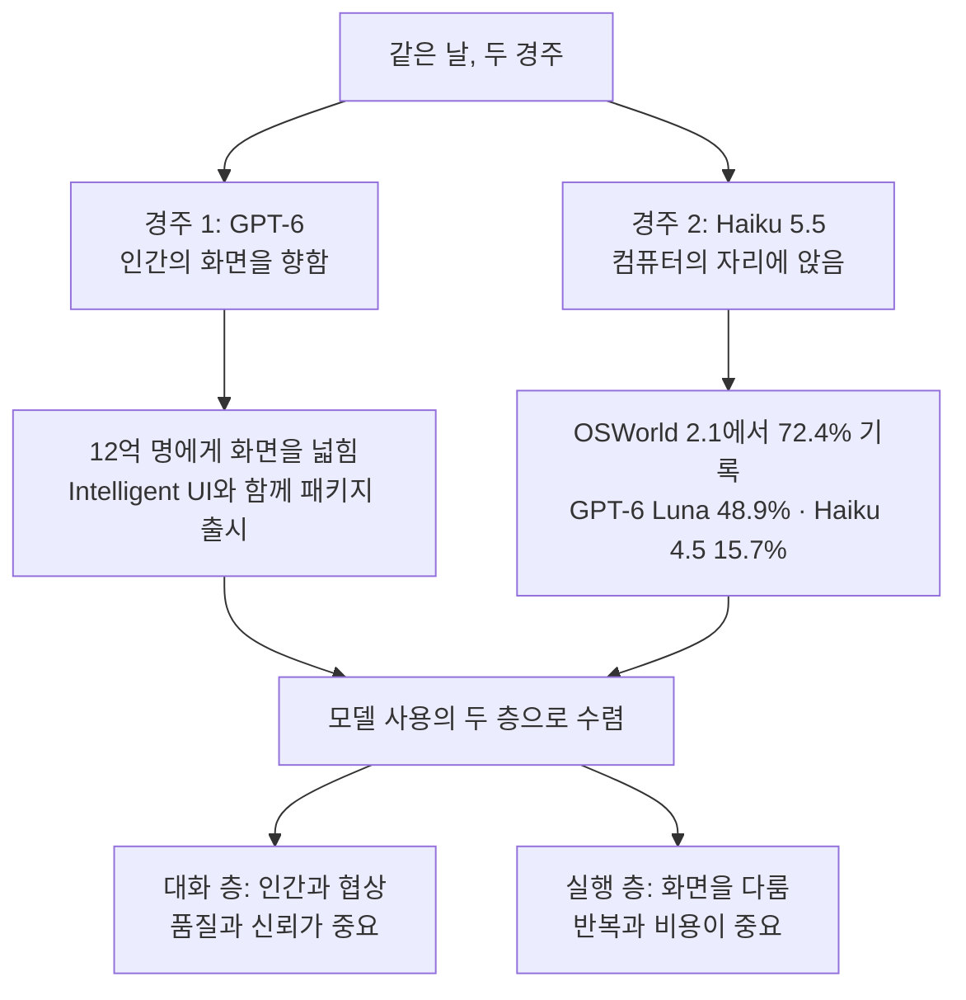

에이전트의 손은 생각보다 쌉니다. 12억 명을 향해 GPT-6가 출시된 그날, 컴퓨터를 다루는 점수의 우위는 소형 모델 Claude Haiku 5.5 쪽으로 조용히 기울었습니다. 오늘 아침 다이제스트가 짚는 신호는 바로 이 교차일까요. 플래그십의 발표가 헤드라인을 채운 사이, 에이전트 운영의 기준선은 조용히 다른 쪽으로 움직였습니다. 뉴스는 많지만 방향은 한 곳으로 모인다는 뜻입니다. 플래그십이 인간의 화면을 채우는 동안 소형 모델이 컴퓨터의 자리에 앉는 구도입니다. 이 교차가 하반기 기업 에이전트 운영의 출발점이 된다는 뜻일까요.

*글의 핵심 개념을 형상화했습니다.*

## 같은 날의 두 출시

OpenAI는 GPT-6와 새로운 Intelligent UI를 같은 날 알렸습니다. ChatGPT의 Plus, Pro, Business, Enterprise 티어 구독자는 전 지역에서 이 모델에 접근할 수 있고 출시의 대상은 12억 명 규모 사용자입니다. 플래그십이 인간의 화면을 향해 간 것입니다. GPT-6와 함께 Intelligent UI라는 인터페이스가 패키지로 나옵니다. OpenAI의 관점에서 대화는 모델 성능만으로 완성되지 않고 화면 위에서 어떤 방식으로 상호작용하느냐가 사용 경험을 가르는 변수입니다. Enterprise 티어까지 포함된 전 지역 접근은 이 UI를 비즈니스 영역까지 밀어넣겠다는 의도가 읽힙니다. 에이전트 자동화의 전장이 모델 성능 경쟁에서 SaaS UI 경쟁으로 넓어지는 시점입니다. 모델 API를 떠난 완제품 경험은 기업의 도입 경로에도 영향을 주기도 합니다. 플랫폼 위에 쌓던 자동화 중 일부가 제공사의 화면 안으로 들어가는 순간, 제어는 UI의 소유자 쪽으로 이동하기 쉽습니다.

같은 시각 다른 쪽에서는 다른 결과가 나왔습니다. Anthropic의 Claude Haiku 5.5가 보고된 모든 벤치마크에서 OpenAI의 GPT-6 Luna를 앞섰습니다. 눈이 가는 숫자는 컴퓨터 사용(computer use) 시험 OSWorld 2.1입니다. 이전 세대 Haiku 4.5는 15.7%에 머물렀습니다. Haiku 5.5는 72.4%를 기록했고 같은 시험의 GPT-6 Luna 점수는 48.9%였습니다. 소형 모델이 플래그십을 앞섰고 자기 전 세대도 뛰어넘었습니다. 한 세대 만에 15.7에서 72.4로 도약한 것이 오늘 신호의 핵심입니다.

두 사건을 나란히 놓으면 그림이 선명해집니다. GPT-6는 12억 명에게 화면을 넓히는 출시이고 Haiku 5.5는 에이전트의 손을 값싼 자원으로 바꾸는 출시입니다. GPT-6 Luna의 48.9%도 여전히 높은 점수입니다. 같은 시험에서 한 세대가 15.7%에서 72.4%로 이동한 것이 주는 무게가 다릅니다. 같은 날 벌어진 일인데 이야기는 서로 다릅니다. 하나는 12억 명의 화면을 향했고 다른 하나는 마우스와 키보드를 향했습니다. 그래서 두 경주라고 부릅니다.

## 72.4%가 재는 것

OSWorld는 모델 앞에 컴퓨터를 놓고 실제 화면에서 작업을 완수하는지를 재는 시험입니다. 에이전트가 말하는 단계에서 손을 쓰는 단계로 넘어가는지를 확인하는 자리입니다. 컴퓨터 사용 능력은 에이전트가 실제 화면 앞에서 키보드를 치고 마우스를 움직여 작업을 완수하는 것을 뜻합니다. 문서 열기, 표 입력, 앱 전환, 오류 화면에서 다시 돌아오는 일까지 포함합니다. 사람의 보조 없이 화면 자체가 실행 환경이 되는 영역입니다. 이 영역은 텍스트 생성으로 점수를 쌓을 수 없고 실제로 화면을 움직여야 통과하는 시험입니다.

15.7과 72.4 사이의 격차는 대부분 작업 완수와 미완을 가르는 구간에 있습니다. 컴퓨터를 70% 수준으로 다루는 모델은 에이전트 워크플로의 기본 실행 모델로 자리를 잡습니다. 그 선에 도달한 이름은 플래그십이 아니라 Haiku입니다. 작고 빠르고 싼 모델이 에이전트 작업의 임계선에 먼저 서 있습니다.

이 이동이 바꾸는 것은 에이전트 운영의 비용 구조입니다. 워크플로에서 비쌌던 부분은 손이었습니다. 화면과 시스템을 한 동작씩 다루는 단계에는 강한 모델과 높은 비용이 필요했으니까. 소형 모델이 에이전트 작업 수준에 오르면 손은 소비품이 됩니다. 플래그십의 자리는 인간과 협상하는 부분으로 무게중심을 이동합니다.

72.4%를 운영의 언어로 번역하면 더 구체적입니다. 에이전트가 화면 작업을 백 번 맡기면 일흔두 번은 끝내고 나머지는 실패합니다. 실패한 케이스가 전부 사람 손으로 넘어가는 시스템은 성립하지 않습니다. 부분 완수, 재시도, 인간 승계의 절차가 함께 준비되어야 합니다. 점수 72.4%는 완성도가 아니라 반복 가능한 실행의 시작점입니다. 손의 실패가 업무의 실패로 직결되는 구간에서는 여전히 강한 모델이 필요합니다. 층을 나누는 이유는 여기에 있습니다.

모델 사용은 이제 두 층으로 나뉩니다. 인간과 대화하는 층과 화면을 다루는 층입니다. 대화에는 품질과 신뢰가 중요하고 화면에는 반복과 비용이 중요합니다. 한 모델로 두 층을 채우던 설계는 비효율적입니다. 실행 층이 소형 모델로 내려가면 플래그십은 대화 층에 집중할 수 있습니다. 같은 예산으로 더 많은 에이전트와 더 긴 워크플로가 도는 구조가 만들어집니다.

*같은 날의 두 경주가 모델 사용의 두 층으로 수렴하는 구조를 정리한 개략도입니다.*

동일한 방향의 증거가 다이제스트의 다른 곳에도 있습니다. 같은 아침 Microsoft는 Surface Laptop Ultra가 최신 MacBook Pro 대비 AI 이미지 생성에서 최대 4.3배 빠르고 초기 토큰 응답 시간을 2.1배 줄였다고 밝혔습니다. 로컬 기기의 추론도 빠르게 빨라지는 흐름입니다. 구글의 첫 오픈 멀티모달 임베딩 모델은 클라우드 연결 없이 로컬에서 지식 그래프를 구성하는 macOS 앱 Foresight를 구동합니다. 클라우드를 거치지 않는 실행은 데이터가 머물 자리를 정할 수 있는 기업에게 실질적인 옵션이 됩니다. 에이전트를 실행할 수 있는 모델의 메뉴는 더 넓어지고 더 저렴해집니다.

참고할 한 가지를 덧붙입니다. '보고된 모든 벤치마크'의 범위는 공개된 시험 결과에 한정됩니다. GPT-6 전체 라인업이 소형 모델에 졌다는 결론으로 읽으면 안 됩니다. 오늘 다이제스트가 확인하는 사실은 OSWorld 2.1을 포함한 보고된 벤치마크에서 Haiku 5.5가 앞선다는 것입니다.

## 모델 메뉴 뒤의 균열

컴퓨터를 다루는 모델이 싸지고 퍼지면 질문은 실행 쪽으로 이동합니다. 오늘 다이제스트의 뉴스 두 개가 이 방향으로 왔습니다.

하나는 의존성의 문제인 셈입니다. Elon Musk의 Grok Bot 어시스턴트는 외부 AI를 활용하는 확장 전략에 걸림돌을 만났습니다. Midjourney 제작진이 이 프로젝트에 참여하지 않는다고 명확히 밝혔기 때문입니다. 대형 어시스턴트조차 파트너가 도중하차할 리스크를 짊어집니다. 외부 모델을 끌어와 기능을 채우는 구조에서 한 축의 이탈은 곧 품질과 경험의 균열인 것입니다. 사용자는 그 균열을 그대로 느낍니다. 어시스턴트 시장이 커질수록 이런 의존은 더 흔해집니다. 기업의 에이전트 워크플로도 마찬가지입니다. 특정 제공사의 UI나 모델에 실행 환경이 묶이면 제공사의 전략 변화가 곧 자신의 운영 리스크가 됩니다.

다른 하나는 허용의 문제이기도 합니다. Zhipu AI의 GLM-5.3에서 거절 메커니즘을 제거한 수정 버전이 Venice 플랫폼에 등장했습니다. GLM-5.3의 첫 익명 무검열 버전으로, 인증 없이 누구나 접근할 수 있습니다. 무검열, 익명, 무인증. 세 가지 조건이 한 모델에 모인 셈입니다. 이런 모델이 자유롭게 유통되면 모델 통제는 제공사 손에서 벗어납니다. 모델의 출처와 수정 이력을 확인하는 절차가 없으면 어떤 버전을 허용했는지를 스스로 답하기도 어렵습니다. 기업이 내부 워크플로에 이런 모델을 넣을 때 누가 어떤 요청을 승인했고 어떤 출력이 나왔는지를 추적할 장치가 없으면 사고는 발생 후에야 발견합니다. 허용 목록과 감사 추적이 함께 준비되어야 하는 이유입니다.

두 뉴스는 겉보기에 멀리 떨어져 있습니다. 하나는 협력의 이탈이고 하나는 유통의 통제입니다. 하지만 공통점은 분명합니다. 모델이 얼마나 똑똑한지가 아니라 그 모델을 누가, 어디에서, 어떻게 실행할지가 경쟁의 축으로 올라왔다는 것입니다. 메뉴가 넓어질수록 균열도 함께 넓어집니다. 컴퓨터를 실행하는 모델, 의존하는 모델, 허용하는 모델. 세 질문을 답할 자리는 실행 환경입니다.

## 핸들을 받을 자리

오늘의 신호는 실행 환경 렌즈로 읽을 수 있습니다. ThakiCloud의 Paxis는 Agent-Native Cloud이며, 정식 제품(v1.1 GA)입니다. 손이 소비품이 되는 날, 자리가 먼저 필요하지 않겠습니까.

컴퓨터 사용 점수 72.4%의 에이전트는 핸들을 받으려면 자리가 있어야 합니다. Paxis에서 에이전트는 일급 리소스로 관리되고 그 리소스는 Skills, Tools, Policies, Audit Logs입니다. 자율도 L0에서 L3까지가 에이전트가 이동할 범위를 거버넌스하고 정책 게이트가 실행 전에 확인하고 감사 로그가 실행 뒤에 기록으로 남습니다. 72.4%의 에이전트가 화면을 다룬다는 것은 기업 시스템이 그 화면 뒤에 있다는 뜻입니다. 파일, 내부 서비스, 고객 데이터까지 손이 닿을 수 있는 범위인 셈입니다. 격리 샌드박스 안에서 소형 모델이 화면을 다룰 때 무엇을 어떤 권한으로 했는지가 기록으로 남게 됩니다. 실행 전 정책 확인은 에이전트를 늦게 만드는 것입니다. 그러나 그 지연은 사고의 규모를 줄이는 대가이기도 합니다. 자율도가 올라갈수록 정책, 샌드박스, 감사는 전제로 바뀝니다.

메뉴가 넓어진 날, 작업별 모델 선택은 운영의 일이 됩니다. Paxis의 CostRouter가 작업마다 모델을 고릅니다. 강한 모델이 인간과 협상하고 소형 모델이 컴퓨터를 작동합니다. 대화에는 강한 모델, 화면에는 싼 모델입니다. 한 워크플로 안에서 작업의 성격에 따라 모델이 갈라집니다. 모델 가격이 세대 단위로 벌어지는 아침, 선택의 기준은 비용 대비 적정성이 됩니다.

MCP 커넥터와 스킬 마켓은 외부 도구의 흐름을 플랫폼 안으로 받아들이는 입구입니다. Midjourney가 Grok Bot을 떠난 것처럼 외부 의존은 언제든 흔들립니다. 커넥터 단위로 의존을 관리하면 한 축의 이탈이 전체 워크플로의 정지로 이어지지 않습니다.

로컬 기기의 추론이 빨라지는 사례는 데이터 주권 수요의 이야기이기도 합니다. Surface Laptop Ultra의 수치와 Foresight의 로컬 지식 그래프가 같은 방향을 가리킵니다. Paxis의 소버린 온프레미스 K8s 배포인 ai-platform은 이 수요를 인프라로 답합니다. 에이전트와 데이터를 기업 안에 머물게 합니다. Venice 기사가 물었던 경계, 그 자리는 ai-platform이 이미 담고 있습니다.

## 두 경주가 한 트랙이 되는 날

두 경주는 결국 한 트랙에서 달립니다. 플래그십이 인간의 화면을 차지하고 소형 모델이 에이전트의 손을 차지합니다. 기업이 둘 사이에서 고를 일은 없습니다. 두 개를 함께 돌리는 실행 환경을 고르는 일입니다. 그리고 그 실행 환경에는 기준이 생깁니다. 안전한가요, 싼가요, 감사되는가요. 세 질문에 답하지 못하는 환경은 다음 모델 가격 인하에서 경쟁력을 잃습니다. 컴퓨터 사용 점수는 계속 오를 것입니다. 점수가 오를수록 자리의 중요성은 함께 오릅니다.

쟁점은 어떤 모델이 똑똑한가에서 어떤 환경을 안전하고 싸게 돌리나로 이동합니다. 72.4%의 소형 모델은 정책과 감사 위에 감싸여 있을 때만 자산입니다. 손이 싼 아침, 자리의 가치가 드러났습니다.

인간은 GPT-6에게, 컴퓨터는 Haiku에게. 두 경주의 방향이 명확해진 아침입니다.

## 참고 자료

이 글은 아래 뉴스를 종합해 작성했습니다.

- HuggingNews, [Microsoft's Surface Laptop Ultra Beats Apple M5 in AI Speed](https://huggingnews.com/ai/microsofts-surface-laptop-ultra-beats-apple-m5-in-ai-speed-cbb46d6f)
- HuggingNews, [Venice Launches First Anonymous Uncensored Version of GLM-5.3 AI](https://huggingnews.com/ai/update-venice-launches-first-anonymous-uncensored-version-of-glm-53-ai-ccf960f5)
- HuggingNews, [Anthropic Haiku 5.5 Beats GPT-6 Luna on Every Reported Benchmark](https://huggingnews.com/ai/anthropic-haiku-55-beats-gpt-6-luna-on-every-reported-benchmark-61342a25)
- HuggingNews, [OpenAI Launches GPT-6 and Interactive UI for 1.2 Billion Users](https://huggingnews.com/ai/openai-launches-gpt-6-and-interactive-ui-for-12-billion-users-7509c9a8)
- HuggingNews, [Google's First Open Multimodal Embedding Model Powers Local Foresight App](https://huggingnews.com/ai/update-googles-first-open-multimodal-embedding-model-powers-local-foresi-ca476f11)
- HuggingNews, [Midjourney Denies Participation in Musk's Grok Bot Expansion](https://huggingnews.com/ai/midjourney-denies-participation-in-musks-grok-bot-expansion-568adf89)
