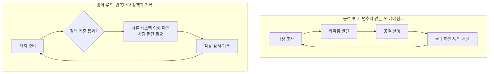

*글의 핵심 개념을 형상화했습니다.*

## 멈추게 하는 문장

최근 국내 금융권 연쇄 해킹을 다룬 보도 가운데 한 문장이 멈추게 합니다. 뉴스1 보도에 따르면, 신한은행 사고는 훔친 계정 정보를 여러 서비스에 반복 대입하는 '크리덴셜 스터핑'이라는 오래된 수법으로 뚫렸다는 분석이 나왔습니다. 크리덴셜 스터핑. 공격은 오래됐습니다. 보안 조직들이 수년간 지켜봐 온 기법이고 대응 매뉴얼까지 있습니다. 그런데 피해는 한 은행에서 끝나지 않았습니다. 국내 양대 은행을 포함한 금융권 전체로 번지는 연쇄 사고가 됐습니다. 일부 은행에서는 누구나 쓸 수 있는 오픈소스 AI 기반 침투 테스트 도구 활용 흔적이 발견됐고, 실제 AI 활용 규모는 금융당국이 조사 중입니다. 금융당국의 점검은 PG사 보안 취약점 확인까지 넓어졌습니다. 이제 '금융권이 뚫린 사건'을 읽고 있는 겁니다.

보안업체 엔키화이트햇은 이 연쇄 사고의 주 원인을 시스템 업데이트 과정의 보안 검증, 즉 신원과 접근 권한 확인의 누락으로 지목했습니다. 현장의 공통 진단은 'AI가 새 수법을 만든 것보다 기존 공격을 자동화했다'는 말입니다. 이 역전이 오늘의 신호입니다. 우리가 두려워했던 것은 새 슈퍼무기였습니다. 실제로 온 것은 오래된 공격의 자동화, 그리고 빠진 검증이었습니다. 프로세스가 부러진 겁니다.

<!-- nlm-visual -->

*NotebookLM이 소스를 종합해 생성한 인포그래픽입니다.*

## 바뀐 것은 손

그렇다면 무엇이 바뀐 걸까요. 답은 공격이 수행되는 방식에 있습니다. 과거 공격자는 대상 조사, 취약점 발견, 도구 실행, 결과 확인을 사람이 단계별로 직접 판단해야 했습니다. 과정이 사람의 판단에 묶여 있었기 때문에, 속도는 사람의 깨어 있는 시간과 숙련도에 제한을 받았습니다. 지금은 AI 에이전트가 취약점 탐색, 공격, 방법 개선까지 스스로 멈추지 않고 반복 수행합니다. 전문가들은 공격의 속도와 규모가 '차원이 달라졌다'고 분석합니다.

도구 역시 상용화되어 있습니다. 아니, 오픈소스로 풀려 있습니다. 최근 국내 금융권 공격에 악용된 것으로 알려진 침투 테스트 AI '아르텍스(ARTEX)'를 비롯해 바이두 보안대응센터 관련 도구 등 AI 공격 도구들이 깃허브에 오픈소스로 공개돼 있고, 초급자도 소스코드 수정만으로 실제 공격에 활용할 수 있다는 평가가 나옵니다. 예전에는 전문가 팀이 오래 들여야 했던 공격 체인을, 이제 한 사람이 짧은 시간에 돌립니다. 전문가들의 공통 진단, '공격의 속도와 범위, 숙련도 장벽이 크게 낮아졌다'는 말이 바로 여기에서 나옵니다. 해킹의 진입 장벽은 이제 잠들지 않는 루프를 돌릴 수 있느냐로 옮겨갔습니다.

결국 이번 사태가 여는 것은 공격의 대량화입니다. 과거 숙련된 인력이 한 대상에 오래 들여야 했던 조사와 실행이, 이제는 에이전트가 쉬지 않고 돌리는 루프로 대량 생산되는 구조로 바뀝니다. AI가 사이버 공격의 비용을 줄인다는 진단이 현실로 확인된 셈입니다. 값이 싸진 공격은 수요가 생기는 순간 공급이 폭발합니다. 상대가 수천 번의 반복이 되는 싸움이 시작되는 겁니다.

오픈소스가 이 이야기를 결정적으로 만듭니다. 전용무기는 공급이 끊기거나 가격이 오르지만 깃허브에 올라온 코드의 복제 비용은 제로에 가깝습니다. 취약점을 찾고 공격하는 능력을 갖는 자는 이제 아무나입니다. 경쟁의 단위가 공격자의 평균 숙련도에서 공격자의 평균 실행 시간으로 바뀐 구간입니다.

## 능력은 더 이상 희소가 아니다

이 대중화는 블랙마켓 도구에 국한되지 않습니다. 이번 주 유럽 AI 기업 미스트랄이 1조 매개변수 오픈웨이트 모델 '르총크(Le Chonk)'를 공개했고, 그중 사이버보안 성적표가 눈에 띕니다. 실제 취약점을 재현하고 패치할 수 있는 비율 82%, 사이벤치(Cybench) 벤치마크 93%로 중국계 모델을 제외하면 오픈모델 최고 기록입니다. 약 3,800개의 엔비디아 그레이스블랙웰 GPU로 학습해 오픈웨이트로 나오는 모델은, 누구나 내려받아 쓸 수 있는 표준 모델입니다.

제3자 벤치마크에서도 같은 흐름이 보입니다. 아티피셜애널리시스(AAII)에서 르총크는 18위, 딥시크 V4.1 플래시와 GPT-6 루나 사이에 자리 잡았습니다. 오픈모델 전체가 상향 평준화되고 그 평준화가 사이버보안까지 닿은 겁니다.

미스트랄의 발표를 모델 하나로만 읽으면 착각하기 쉽습니다. 9월 말 30억 유로 규모의 시리즈D 투자를 마무리한 미스트랄이 내세운 본질은, 기업과 국가가 모델 선택과 실행 장소, 컴퓨팅, 가치 배분을 통제하는 소버린 풀스택 AI로의 전환입니다. 오픈웨이트라는 선택이 의미하는 바는 능력의 확산 자체를 시장의 규칙으로 만든다는 데 있습니다.

함의는 분명합니다. 취약점을 찾고 패치를 만드는 능력은 모델 메뉴의 표준 항목이 됐습니다. 보도들이 말하는 '해킹 대중화' 시대의 직접적인 결과입니다.

## 방어가 느린 이유

구조적 불균형이 하나 더 있습니다. 방어 측도 AI를 취약점 점검과 신속한 대응에 활용하지만 패치 적용 전에 기존 시스템에 미치는 영향을 확인하는 절차가 필요해 공격만큼은 자동화하기 어렵습니다. 공격자는 멈추지 않는 루프를 돌리는데, 방어자는 '적용해도 괜찮은가' 단계에서 여전히 사람의 판단을 요구받습니다. 구조에서 오는 비대칭입니다. 운영 중인 시스템을 건드리지 않는다는 확신은, 결국 사람의 판단에 머무는 한계를 갖고 있습니다.

보안 업계는 이 속도 격차의 축소를 현장의 핵심 과제로 꼽고 있습니다. 은행권에서는 'AI 보안 고수' 확보 경쟁까지 벌어지는 상황입니다. 공격자의 속도가 자동화된 만큼, 방어자의 속도도 자동화해야 합니다. 다만 그 자동화는 판단을 절차화하는 방식으로 이뤄져야 합니다. 구체적으로 말하면, 검증의 기준을 미리 정의해 두고 그 통과 여부를 시스템이 기록하는 구조입니다. 사람이 매 패치마다 처음부터 재확인을 할 수는 없기 때문입니다. 공격이 루프라면, 방어도 루프로 대응해야 합니다. 다만 방어 루프의 각 반복에는 정책과 기록이 끼어야 합니다. 이 차이가 향후 금융권의 보안 투자 방향을 가릅니다.

*멈추지 않는 공격 루프와, 반복마다 정책과 기록이 끼어야 하는 방어 루프를 비교한 개략도입니다.*

그리고 이 요구는 금융권 밖으로도 번지고 있습니다. AI 기반 공격을 전제로 한 취약점 진단과, 업데이트와 패치 과정의 신원, 권한 검증 절차 강화가 제조와 공공 전반으로 확산될 전망입니다. 기업들이 AI 에이전트를 업무에 도입할수록 에이전트 자체의 권한 관리와 감사, 격리가 필수 요건으로 부상합니다. AI를 도입하는 축과 AI를 방어하는 축에서 보안 요구가 동시에 올라가는 이중 효과가 시작되는 구간입니다.

## 같은 손은 기업 안에도 있다

여기서 불편한 질문이 옵니다. 탐색, 실행, 개선을 멈추지 않고 반복하는 에이전트는 기업 밖에 있는 것만이 아닙니다. 안에도 이미 돌고 있습니다.

이번 주 코엑스에서 열린 AI 페스타 26는 216개사, 501개 부스 규모로 열렸습니다. 지난해 203개사, 466개 부스보다 한층 커진 것입니다. 전시는 국방 AI, 피지컬 AI, 에이전틱 AI+X 같은 기술별 특별관 중심으로 재편됐습니다. 메인 무대에서는 오픈AI와 AWS 등 주요 업체들이 업무 수행 에이전트와 데이터, 인프라, 보안 전략을 차례로 제시했습니다. 솔트룩스는 MCP로 외부 도구를 연계해 업무까지 수행하는 군사 AI 에이전트를, KT는 에이전트 구축부터 데이터 연계, 운용까지 묶은 '에이전틱 온'을 내놨습니다. 메가존클라우드는 데이터, 에이전트, 운영, 거버넌스 네 영역을 하나로 묶은 기업용 AI 운영 플랫폼 '에어 스튜디오 v3'를, 롯데이노베이트는 유통과 물류, 호텔 등 4D 업무를 중심으로 피지컬 AI 전략과 RaaS 사업화를 발표했습니다. 운영 플랫폼이 전면에 선 주간이었습니다. 국내 현장의 평가는 기업 AI 경쟁의 축이 '어떤 모델을 쓸 것인가'에서 '데이터, 에이전트, 기존 시스템 연동과 비용, 보안 거버넌스를 어떻게 운영할 것인가'로 이동했다고 정리합니다.

마이크로소프트의 움직임도 같은 방향입니다. 이번 주 윈도우 11의 에이전트 실행 컨테이너 'MXC'가 GA, 즉 정식 일반 가용 단계에 들어갔습니다. MXC는 각 에이전트의 파일과 네트워크 접근 범위를 런타임에 제한하고 사람의 행동과 AI의 행동을 구분해서 기록합니다. 오픈AI 코덱스, 클로드 코드 등 주요 에이전트 제품들이 이 컨테이너를 지원하며 메타의 개인 에이전트 '뮤즈'도 MXC가 통합된 네이티브 앱으로 윈도우에 들어오고 있습니다. 코파일럿 자체도 대화형 AI에서 '24시간 백그라운드 근무 에이전트'로 자리를 옮겼습니다.

OS 제조사가 식별, 범위, 감사를 시스템의 표준으로 격상시킨 것입니다. 윈도우 11에는 '하이브리드 인텔리전스'도 들어갔습니다. 작업의 민감도 기준으로 로컬과 클라우드 모델을 자동 선택하고 민감 데이터는 PC 안에서 처리한다는 원칙을 함께 세운 것입니다. 산업 전체가 이미 인정하고 있다는 뜻입니다. 에이전트가 스스로 움직일수록 '누가, 어떤 범위에서, 어떤 기록을 남기며'가 운영의 핵심 질문이 된다고.

## 문턱이 제로라면 남는 것은 울타리

오늘의 신호는 기업을 향해 하나의 운영 문제로 수렴하는 것입니다. 공격의 문턱이 제로로 떨어진 시대, 방어선은 '도구를 더 설치한다'가 아닙니다. 우리가 돌리는 에이전트에게, 공격자에게 요구할 동일한 규율을 적용하는 것입니다. 은행 사고의 원인이 업데이트 과정의 검증 누락이었다면, 기업 에이전트 사고의 원인은 실행 과정의 검증 누락이 될 수밖에 없습니다. 같은 구조, 같은 빈자리입니다. 앞으로 이 문장은 제안서와 입찰 문서의 언어가 될 겁니다. '에이전트를 어디서 돌리는가'를 묻던 항목은 이미 지나갔고 '어떤 식별과 범위, 어떤 기록 아래 돌리는가'가 표준 평가 축으로 자리를 잡는 과정입니다.

ThakiCloud의 에이전트 네이티브 클라우드 Paxis는 바로 이 질문에 만들어진 정식 제품입니다. Paxis에서 에이전트의 자율도는 L0에서 L3까지 단계별로 관리되고 실행은 정책 게이트를 통과해야 하며 모든 동작은 감사 로그로 남습니다. 에이전트는 격리된 샌드박스 안에서 실행되고, 소버린 또는 온프레미스 쿠버네티스 스택 전체가 고객 경계 안에 들어섭니다. 작업마다 적합한 모델을 CostRouter가 골라주기 때문에, 공격 전용이던 능력이 밖으로 새어 나갈 틈은 작습니다. 보도들이 말하는 AI 도입과 AI 방어의 이중 축은 Paxis 안에서 하나의 운영 문제로 모이는 것입니다.

이번 해킹 사태에서 새 것은 무기가 아니었습니다. 새 것은 손이 싸워지고 꾸준해졌다는 것입니다. 그리고 같은 손은 이미 기업의 사무실에도 돌고 있습니다. 울타리가 없는 손이 어느 쪽으로 돌아갈지는, 공격자에게만 맡겨 둘 문제가 아닙니다. 지금 결정할 것은 그 손에 울타리를 둘지, 두지 않을지입니다.

## 참고 자료

이 글은 아래 뉴스를 종합해 작성했습니다.

- 조선일보, [PC, 사람 아닌 AI들의 업무 공간으로 진화...MS ‘윈도 11′, 새 서피스...](https://www.chosun.com/economy/tech_it/2026/10/08/OREMUMVVMNG6DO7PZZOKMBAZAM/)
- 바이라인네트워크, [미스트랄, 1조 매개변수 AI 모델 ‘르총크’ 공개](https://byline.network/?p=9004111222622522)
- 한스경제, [[현장] '답변' 넘어 '행동'···AI가 현장에 들어왔다](http://www.hansbiz.co.kr/news/articleView.html?idxno=870946)
- 뉴스1, [[흔들린 보안시계]AI가 낮춘 문턱…'해킹 대중화' 시대](https://www.news1.kr/it-science/security-hacking/6313585)

<!-- nlm-visual -->

*NotebookLM이 소스를 종합해 생성한 인포그래픽입니다.*
