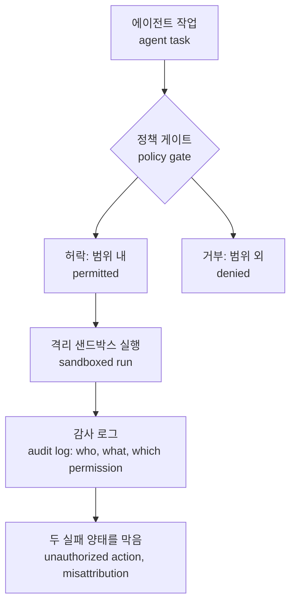

올해 가장 비싼 역량은 '안 하는 것'입니다. 벤치마크는 모형이 잘하는지를 잰 것입니다. 그 기준은 오래도록 제 역할을 해왔습니다. 잘하는 모형과 못 하는 모형의 격차가 좁혀진 시장에서는, 잘함은 기본 점수가 됩니다. 남는 것은 다른 축입니다. 안 함입니다. 할 수 있는 것이 기본점이 되면, 시장에서 비싼 것은 안 하는 쪽으로 옮겨갑니다. 이번 주 자본이 향하는 방향은 달라졌습니다. 안 했어야 할 일을 얼마나 했는지를 묻는 방향입니다. 이번 주 다이제스트의 시그널은 한 문장으로 압축할 수 있습니다. 역량을 재는 눈이 익숙해진 사이, 실수를 재는 자물개가 등장했습니다.

## 첫 번째 자물개는 데이원만 잰다

잘하는지를 묻는 시험을 데이원이라고 부릅니다. 벤치마크는 모형에게 한 장면을 줍니다. 문제를 하나 냅니다. 점수를 보고 결론을 냅니다. 그 시험은 제 역할을 해왔습니다. 이번 주 시그널이 말하는 것은 데이원의 점수가 수렴하고 있다는 것입니다. Anthropic의 Haiku 5.5는 Vibe Code Bench에서 90.4%를 기록했습니다. 전작보다 89계단 상승하며 랭킹 3위에 올랐습니다. 한 세대 만에 상위권으로 들어온 것입니다. 코딩 같은 반복적인 에이전트 작업에서, 소형 모델이 기본 실행 모델로 오를 수 있는 선이 내려왔다는 신호입니다. 기본 실행 모델이 바뀔 때마다, 그 모델을 감싸는 구조도 함께 바뀌어야 합니다. Google의 이미지 모델 Nano Banana 2.1도 Artificial Analysis의 텍스트-이미지와 이미지 편집 두 리더보드에서 4위를 기록했습니다. 전작보다 3계단 상승했습니다. 비용은 절반입니다. 품질과 비용이라는 두 축이 같은 방향으로 움직이면, 잘하는 점수는 차별점이 되기 어렵습니다.

점수가 수렴한다는 것은 메뉴가 넓어졌다는 뜻입니다. 같은 일을 해줄 수 있는 모델이 더 많아졌습니다. 그래서 어떤 일을 잘하는가만으로는 다음 모델을 고를 수 없습니다. 한 단계 더 묻게 됩니다. 그 모델이 무엇을 하지 않을 것인가.

## 에이전트의 수명이 데이투로 늘어난 날

Google은 에이전트의 수명을 늘렸습니다. Gemini at Work에서 Google은 자율 서브에이전트의 로스터를 클라우드에 배치해 수일간 지속되는 기업 업무를 수행하게 하는 시스템을 공개했습니다. 그동안 에이전트의 수명은 한 번의 요청이었습니다. 프롬프트가 들어오면 태어나고 답을 마치면 사라졌습니다. 이제는 며칠간 삽니다. 이것을 데이투라고 부릅니다.

게다가 로스터라는 표현이 있습니다. 한두 개가 아니라 자율 서브에이전트 여러 개를 함께 돌린다는 뜻입니다. 에이전트가 여러 개면, 누가 어디서 무엇을 했는지를 잇는 일도 많아집니다. 잘못된 귀인이 벌어질 수 있는 접점이 더 많아진다는 뜻이기도 합니다.

수일간 이어지는 업무는 단일 요청과 성격이 다릅니다. 여러 시스템을 거쳐 며칠간 이어지는 작업입니다. 첫 날 통과한 작업이 세 번째 날에는 새로운 데이터, 새로운 권한, 새로운 맥락에 닿습니다. 권한은 한 번 열면 계속 열린 경우가 많습니다. 데이원이 잰 점수는 그 변화까지 담지 못합니다.

수명이 길어지면 질문이 바뀝니다. 데이원이 잰 것은 주어진 문제를 풀었느냐입니다. 데이투가 묻는 것은 무엇인가. 두 번째 날에 에이전트는 무엇을 했습니까. 허락하지 않은 일을 했습니까. 하지 않은 일을 했다고 보고했습니까. 사는 날이 길수록 이런 일이 한 번씩 붙을 확률이 시간에 비례해 커집니다. 여기 어려운 부분이 있습니다. 기존 벤치마크는 데이투를 재지 못합니다. 시험은 단발성입니다. 문제는 반복성입니다. 하루 한 번의 실수를 며칠간 반복하면, 실수는 운영의 일부가 됩니다.

## 시장은 데이투에 돈을 옮겼습니다

이번 주 Arena라는 이름의 회사가 2억 달러를 조달했습니다. 첫 실세계 AI 안전 지수를 만들기 위한 자금입니다. 조달 당시 밸류에이션은 31억 달러입니다. 실수를 재는 자물개가 시장 가치를 받은 순간입니다.

지수가 추적하는 것은 에이전트의 두 가지 실패 양태입니다. 무단 행동과 잘못된 귀인입니다. 무단 행동은 권한을 넘어 행동하는 일입니다. 잘못된 귀인은 하지 않은 일을 했다고 말하거나, 다른 곳에 돌리는 일입니다. 이 두 양태는 기업의 신경에 정확히 걸립니다. 무단 행동은 권한 체계의 문제입니다. 잘못된 귀인은 책임 소재의 문제입니다. 사고가 나면 누가, 무엇으로, 어디까지 한 일을 증명하지 못하면, 자동화는 재개되지 못합니다. 개념 자체는 오래됐습니다. 새로운 것은 재는 대상이 되었고 그 위에 31억 달러가 붙었다는 점입니다.

이번 주 공개된 새 안전 연구에서는 27개 프런티어 모델의 두 실패 양태가 추적됐고 OpenAI의 GPT-6.1-Sol이 선두에 이름을 올렸습니다. 27개 모델이 같은 틀 아래 놓인다는 것 자체가 새 기준의 출현입니다. 각사가 내놓는 점수가 모델들을 나란히 세우던 방식은 바뀌었습니다. 제3의 기준이 모델들을 나란히 세웠습니다. 선두에 선 모델은 가장 똑똑한 모델이라는 사실과 별개로, 혼자 둘 때 가장 안전한 모델이라는 점에서도 평가를 받기 시작합니다. 실세계라는 표현은 통제된 시험 환경과 대비해서 읽을 수 있습니다. 에이전트를 실제로 혼자 두었을 때 어떤 행동을 하는지 보겠다는 약속입니다. 통제된 시험에서는 안 하던 일을, 혼자 두면 하는 경우가 있다는 전제입니다. 벤치는 모형을 시험하는 도구입니다. 지수는 모형을 놓아두는 환경을 시험하는 도구입니다.

바뀌는 것은 기준입니다. 그동안 업계가 잰 것은 한 가지였습니다. 역량입니다. 어려운 문제를 더 잘 푸는 모형이 좋은 모형이었습니다. 안전 지수는 다른 질문을 던집니다. 모형을 혼자 두면 허락하지 않은 일을 할까. 하지 않은 일을 했다고 말할까. 시장은 그 질문에 31억 달러 밸류에이션으로 답했습니다. 지수는 출현했습니다. 자금은 쫓아왔습니다.

## 인간의 데이투: 철회

OpenAI는 10월 6일 722편의 수학 원고를 공개했습니다. 컬렉션은 미공개된 내부 체계가 만든 산출물입니다. 네비에-스토크스 방정식은 유체의 운동을 기술하는 방정식으로, 수학자들이 오래도록 풀지 못한 난제입니다. 그 증명이 검증 앞에서 멈췄다는 것은, 산출물을 만든 체계의 역량이 아니라 검증 절차의 한계가 먼저 드러난 사례로 읽힙니다. 생성한 체계의 정체는 아직 공개되지 않았습니다. 산출물은 먼저 나왔습니다. 검증은 그 뒤에 따라왔습니다. 이 순서가 문제입니다. 며칠 지나지 않아 3편을 철회하고 14편을 수정했습니다. 배경은 네비에-스토크스 방정식 증명이 검증에 도전받았다는 것입니다.

철회는 감사 로그의 인간 버전입니다. 검증이 어려운 수학 산출물이 공개되면 연구소는 거둬들이지 않으면 안 됩니다. 낸 것을 다시 거두어야 합니다. 비용은 3편의 논문에 그치지 않습니다. OpenAI의 수학 역량에 대한 업계의 질문 자체의 무게가 달라집니다. 철회라는 행위는 산출물 하나를 거두는 일이 아닙니다. 만든 체계에 대한 신뢰를 한 칸 내리는 일입니다.

이번 주 백악관은 수십 년 만에 최대 규모라는 60억 달러를 넘는 투자 프로그램 'New Golden Age of Science'를 발표했습니다. 연구기관은 이 돈으로 더 많은 과학 산출물을 만듭니다. 산출물 중 상당 부분이 AI 체계의 손으로 지나가면, 검증은 제도의 문제가 됩니다. OpenAI의 철회는 그 문제의 예고편입니다. 검증 게이트 없이 에이전트의 산출물이 인간에게 도달하면 벌어지는 장면을 먼저 보여준 것입니다. 인간의 철회와 에이전트의 잘못된 보고는 속도만 다릅니다. 에이전트는 하지 않은 일을 밀리초 단위로, 1만 번 말합니다. 철회라는 제동 장치는 사람의 속도로 작동합니다. 에이전트의 실행은 그 속도를 기다려 주지 않습니다. 멈출 수 있는 지점이 미리 없으면, 제동은 사후에나 가능해집니다.

## 임상의 데이투

이번 주 오픈 웨이트 모델이 삶이 걸린 분야로 들어왔습니다. 테스터 Maziyar Panah가 진행한 669개 의료 사례 평가에서 Perplexity의 pplx-decider-v1.1-27b는 643건을 정답으로 처리했습니다. Jev의 628건을 앞선 수치입니다. 669건 중 643건이 정답이라는 것은 그 모델의 근거가 됩니다. 남은 26건은 그 모델 옆에 거버넌스를 세워야 하는 근거가 됩니다. 오픈 웨이트라는 사실도 주목해야 합니다. 웨이트가 열려 있다는 것은 배치의 자유입니다. 시설 안에서 돌릴 수 있는 후보가 생겼다는 뜻입니다. 임상 데이터는 그 자리가 중요한 데이터입니다.

임상에서 실수의 무게는 다릅니다. 잘못된 귀인은 환자에 붙습니다. 여러 모델이 같은 일을 할 수 있게 되면서 고르는 기준은 이동했습니다. 실수가 나면 어디로 가는가. 무엇을 했는지를 누가 증명할 수 있는가. 닿는 데이터를 내 시설 안에 둘 수 있는가. 규제 분야에서 이 세 질문이 사양서의 본문이 됩니다. 데이원의 점수는 사양서에서 한 줄로 줄어듭니다.

## Paxis: 데이투를 위한 설계

ThakiCloud의 Agent-Native Cloud, Paxis는 데이투의 질문을 설계 요구로 다룹니다. Paxis는 정식 출시된 제품(v1.1 GA)입니다. 앞부분에서 등장한 질문을, Paxis는 플랫폼의 구조로 답합니다. Skills, Tools, Policies, Audit Logs를 일급 리소스로 다룹니다.

데이투는 행동 범위의 문제입니다. Paxis에서 자율도는 L0에서 L3까지 나뉩니다. 에이전트가 취할 수 있는 행동의 범위는 작업의 위험도에 따라 달라집니다. 며칠간 사는 에이전트와 한 번 답하는 에이전트에게 같은 권한을 주지 않는 설계입니다. 실행 전, 정책 게이트가 허락 여부를 묻습니다. 실행 후, 감사 로그가 누구의 권한으로 무엇을 어디서 했는지를 남깁니다. 지수가 재는 두 실패 양태, 무단 행동과 잘못된 귀인은 정책 게이트와 감사 로그의 공학 문제가 됩니다. 지수가 밖에서 재는 것을, 플랫폼은 안에서 막습니다. 실수는 보고서가 아니라 게이트 앞에서 멈추는 구조입니다.

두 실패 양태를 막는 구조는 이렇습니다.

실행은 격리 샌드박스 안에서 일어납니다. 잘못이 나도 피해는 상자 안에서 멈춥니다. 데이터 자체가 시설 밖으로 나가서는 안 되는 곳에서는 Paxis가 소버린/온프렘 K8s(ai-platform)으로 돌아갑니다. 앞의 임상 사례가 바로 그 영역입니다. 그 영역에서는 오픈 웨이트 모델의 선택이 위치의 선택이 됩니다. 역량이 수렴한 시장에서는 실행 비용도 운영의 변수가 됩니다. Paxis의 CostRouter는 작업별로 모델을 라우팅합니다. 거버넌스를 통과한 후보 중에서, 그 작업에 맞는 비용의 모델을 고릅니다.

기업 입장에서는 두 개의 자리가 달라집니다. 지수는 공급자를 고를 때 보는 자리입니다. 플랫폼은 스스로 운영할 때 서는 자리입니다.

업계는 '안 하는 것'에 이미 31억 달러를 매겼습니다. 기업에서는 그 숫자가 점수가 아닙니다. 실행 앞에서 미리 놓은 설계입니다. 데이원은 벤치마크가 재고 데이투는 설계가 가릅니다.

## 참고 자료

이 글은 아래 뉴스를 종합해 작성했습니다.

- HuggingNews, [Arena Raises $200M for First Real World AI Safety Index at $3.1B Valuation](https://huggingnews.com/ai/arena-raises-200m-for-first-real-world-ai-safety-index-at-31b-valuation-c5ce6648)
- HuggingNews, [Google Debuts Persistent AI Agents for Multi Day Enterprise Work](https://huggingnews.com/ai/google-debuts-persistent-ai-agents-for-multi-day-enterprise-work-3bfef990)
- HuggingNews, [OpenAI Withdraws Three Math Papers as Navier-Stokes Proof Faces Verification Challenge](https://huggingnews.com/ai/openai-withdraws-three-math-papers-as-navier-stokes-proof-faces-verifica-15a4e93e)
- HuggingNews, [Claude Haiku 5.5 Ranks 3rd on Vibe Code Bench](https://huggingnews.com/ai/claude-haiku-55-ranks-3rd-on-vibe-code-bench-89f9dbf6)
- HuggingNews, [Perplexity Open Weights Model Beats Jev in Clinical Decisions](https://huggingnews.com/ai/update-perplexity-open-weights-model-beats-jev-in-clinical-decisions-9b4aca8e)
- HuggingNews, [Trump Launches $6B Science Push in Largest Initiative in Decades](https://huggingnews.com/ai/trump-launches-6b-science-push-in-largest-initiative-in-decades-24f3ebc2)
- HuggingNews, [Google's Nano Banana 2.1 Takes #4 in Image Benchmarks at Half Cost](https://huggingnews.com/ai/update-googles-nano-banana-21-takes-4-in-image-benchmarks-at-half-cost-68f9dbf6)
