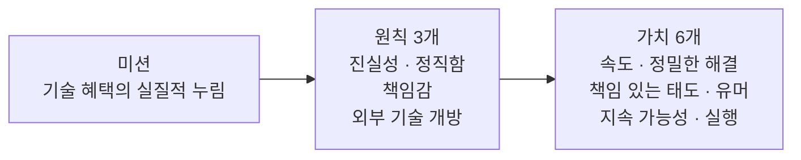

Thaki Cloud는 기술이 가져온 혜택을 더 많은 사람들이 실제로 누릴 수 있도록 만드는 것을 목표로 합니다. Kubernetes 기반의 AI/ML 플랫폼을 만드는 회사로서, 지원자에게는 채용 공고 문구보다 우리가 실제로 어떤 원칙을 지키며 어떤 가치로 일하는지를 확인하는 편이 정확합니다. 그래서 이 글에서 미션, 원칙, 가치를 그대로 나열하고, 그것이 실제 일의 어떤 모습으로 나타나는지 볼 수 있는 흔적들을 함께 짚습니다.

![[Thaki Cloud Life & 커리어] 미션, 원칙, 가치 개념을 형상화한 이미지](/assets/images/mission-principles-values-hero.webp)
*글의 핵심 개념을 형상화했습니다.*

## 미션 (Mission)

### 고객을 사랑합니다

고객의 필요를 이해하고 예측하며, 그 이상을 달성하기 위해 노력합니다. 깊은 관계를 바탕으로 실질적인 문제를 해결하고, 공감에서 시작해 지속적인 변화로 완성합니다.

### 일하는 과정도 즐겁게

일이 고되더라도, 과정을 즐기는 것이 지속 가능한 성과의 조건이라 믿습니다. 팀 안에 여유와 유머가 있을 때 창의성도 살아납니다. 억지로 만든 활기가 아니라, 솔직하게 함께 웃을 수 있는 분위기를 유지하려 합니다.

### 회사의 목표와 개인의 성장을 함께

회사가 성장하면서 구성원도 성장하고, 반대도 성립해야 한다고 생각합니다. 일방적인 헌신이 아니라, 개인의 방향과 조직의 방향이 맞닿을 때 더 오래, 더 잘 달릴 수 있습니다.

---

## 원칙 (Principles)

### 진실성과 정직함

어렵더라도 옳은 쪽을 고릅니다. 단기적으로 불편한 말이 장기적으로 신뢰를 만든다고 믿기 때문입니다. 고객, 파트너, 동료 모두와의 관계에서 투명성을 지킵니다.

### 책임감

본인의 결정과 그 결과를 온전히 짊어집니다. 문제가 생겼을 때 핑계보다 해결책을 먼저 찾는 것이 우리의 태도입니다. 우리가 만드는 결과물은 우리 자신을 반영한다고 생각합니다.

### 외부 기술을 열어두자 (NIH Syndrome 지양)

"우리가 만들지 않았으면 쓰지 않는다"는 태도는 갖지 않습니다. 좋은 기술은 어디에서든 나올 수 있고, 중요한 것은 출처가 아니라 고객에게 실제로 가치가 있느냐입니다. 외부의 아이디어와 솔루션을 적극적으로 받아들입니다.

---

## 가치 (Values)

### 속도

빠르게 움직이고, 빠르게 배우며, 빠르게 고칩니다. 완벽을 기다리느라 제자리에 있기보다 실행하고 조정하는 편을 택합니다.

### 정밀하고 신속한 해결

속도는 대충 하는 것이 아닙니다. 문제의 근본 원인을 파악하고, 그에 맞게 정확히 대응하는 것을 목표로 합니다.

### 책임감 있는 태도

업무, 결정, 결과까지 스스로 책임집니다. 팀 전체의 성공에 기여하는 사람이 진정으로 신뢰받는 동료라고 생각합니다.

### 유머감각

일은 진지하게 하되, 자신에 대해서는 너무 진지하지 않습니다. 유머는 팀을 연결하고, 힘든 순간에 버틸 수 있게 해줍니다.

### 지속 가능성

오래 달리려면 지속 가능한 설계가 필요합니다. 번아웃을 막고 장기적인 선택을 우선합니다. 개인도, 시스템도, 관계도 마찬가지입니다.

### 말보다 실행

멋진 말보다 결과로 보여줍니다. 발표 자리에서 말을 잘하는 것보다, 약속한 것을 실제로 해내는 것을 더 높이 삽니다.

## 가치의 흔적이 일에서 나타나는 곳

가치는 실제 일에서 찾을 수 있을 때만 신뢰할 만합니다. 우리가 발행하는 기술 블로그에서 따라 볼 수 있는 흔적을 몇 개 짚습니다.

**말보다 실행.** 도메인 지식을 인프라로 인코딩하는 글에서는 회사가 실제로 운영한다는 규칙, 스킬, 무인 자동화가 저장소의 실측 숫자로 얼마나 맞는지 점검합니다. ([도메인 지식을 인프라로 인코딩하라](https://thakicloud.com/tech-blog/ko/agentops/domain-knowledge-as-infrastructure/))

**외부 기술을 열어두자.** 도구는 출처가 아니라 고객에게 실제로 가치를 주느냐로 고릅니다. llama.cpp, Qwen 같은 오픈소스 프로젝트는 블로그에서 일급 주제로 다루며, 단일 GPU에서 대규모 MoE 모델을 실행할 때 모델 카드와 원본 풀 리퀘트에 모든 수치를 대조해 확인하는 방식을 기록합니다.

**속도와 정밀.** 둘은 반대편이 아닙니다. 실측 데이터를 읽고 숫자의 표면과 실제 의미를 구분하는 글을 공유합니다. 24GB GPU에서 111GB 모델이 도는 기록이 실제로는 110GB 시스템 RAM을 한 계층의 메모리로 쓰는 구조였다는 읽기가 좋은 예입니다.

**책임과 공유.** KCD Seoul 2025에서 xPU as a Service 기반 Agentic AI 플랫폼에 대한 발표를 했으며, 발표 자료와 스크립트는 커리어 섹션에 그대로 공개해 두었습니다. ([KCD Seoul 2025](https://thakicloud.com/tech-blog/ko/careers/conference-kcd-seoul-2025/))

**우리가 찾는 사람의 성장.** 커리어 섹션에는 우리가 어떤 사람을 찾고 있는지, 어떤 성장을 지원하는지를 기록한 글이 모여 있습니다. 백엔드와 인프라 엔지니어를 위한 10대 필독서, ML 엔지니어 핵심 스킬 가이드, 기술 역량을 넘어선 커리어 성장 전략이 그것입니다.

- [백엔드, 인프라 엔지니어 채용: 10대 필독서](https://thakicloud.com/tech-blog/ko/careers/backend-infrastructure-engineer-hiring-10-must-read-books/)
- [ML 엔지니어 핵심 스킬 가이드](https://thakicloud.com/tech-blog/ko/careers/ml-engineer-essential-skills-guide/)
- [기술적 역량을 넘어선 커리어 성장 전략](https://thakicloud.com/tech-blog/ko/careers/beyond-technical-skills-career-growth-strategy-ko/)

> 함께 일하고 싶다면 **info@thakicloud.co.kr** 로 연락 주세요.

## 관련 슬라이드

본문 내용을 NotebookLM(`neo_swiss` 스타일)으로 요약한 슬라이드입니다.

