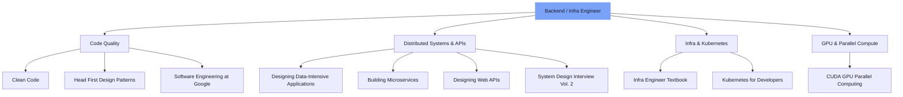

> **TL;DR**
> Clean Code, Head First Design Patterns, Designing Data-Intensive Applications, Building Microservices, Designing Web APIs, System Design Interview Vol. 2, 인프라 엔지니어의 교과서, Software Engineering at Google, 개발자를 위한 쉬운 쿠버네티스, CUDA 기반 GPU 병렬 처리.
> 이 열 권 중 다섯 권 이상을 내용까지 설명할 수 있다면, 이미 대화를 시작할 준비가 된 겁니다.

---

<!-- evolve-diagram -->
*개념 다이어그램*

## 왜 책 리스트로 채용 기준을 이야기하는가

경력 연수보다 문제를 푸는 태도와 학습의 깊이를 더 크게 봅니다.

한 권을 끝까지 읽고, 실무에 적용하고, 동료에게 설명해본 경험. 그 자체가 지속 가능한 역량의 증거입니다. 아래 열 권은 그런 관점에서 백엔드, 인프라 엔지니어라면 한 번씩 손에 쥐어봐야 할 책들입니다.

---

## 1. 《Clean Code》

**저자** Robert C. Martin / **핵심 키워드** 가독성, 리팩터링, 네이밍

스타트업이라도 레거시는 빠르게 생깁니다. 깨끗한 코드는 유지보수 비용을 줄이고, 좋은 네이밍과 함수 분할은 문서 없이도 의도를 전달합니다. 테스트와 함께 작은 단위로 개선하는 습관이 서비스 안정성을 지탱합니다.

---

## 2. 《Head First Design Patterns (2nd)》

**저자** Eric Freeman & Elisabeth Robson / **핵심 키워드** 객체지향, SOLID, 재사용성

"전략 패턴으로 바꿔볼까요?" 한 마디가 통하면 협업 속도가 달라집니다. 요구사항이 늘어날 때 코드를 갈아엎지 않고 연장할 수 있는 설계 감각을 키웁니다. 그림과 대화식 예제 덕분에 학습 진입장벽도 낮습니다.

---

## 3. 《Designing Data-Intensive Applications》

**저자** Martin Kleppmann / **핵심 키워드** 분산 시스템, CAP, 이벤트 소싱

"읽기 지연을 조금 주고 일관성을 높일까?" 이런 결정을 근거 있게 내리려면 이 책이 필요합니다. CDC, 스트림, 배치의 경계 조건을 이해하고, 성능과 안정성과 복잡성 사이의 균형점을 찾는 방법을 배웁니다.

---

## 4. 《Building Microservices (2nd)》

**저자** Sam Newman / **핵심 키워드** 도메인 분할, CI/CD, 관측 가능성

언제 모놀리스를 쪼갤지 판단하는 기준, 로그와 메트릭과 트레이싱을 통합해 장애 복구 시간을 줄이는 방법, 조직 구조와 서비스 구조를 함께 설계하는 시야를 키웁니다.

---

## 5. 《Designing Web APIs》

**저자** Brenda Jin, Saurabh Sahni & Amir Shevat / **핵심 키워드** REST, OpenAPI, DX

OpenAPI 기반 설계는 모든 클라이언트 팀이 동시에 달릴 수 있게 해줍니다. 호환성을 깨지 않으면서 새 기능을 노출하는 버전 전략, 파트너 온보딩을 가속하는 문서 자동화까지 다룹니다.

---

## 6. 《System Design Interview Vol. 2》

**저자** Alex Xu, Sahn Lam / **핵심 키워드** 대규모 시스템 설계, 트레이드오프

흐름도와 다이어그램으로 요구사항을 빠르게 구조화하고, CAP이나 PACELC 선택을 말로 설득하며, 제약 조건 아래서 우선순위를 세우는 훈련을 합니다.

---

## 7. 《인프라 엔지니어의 교과서》

**저자** 사노 유타카 / **핵심 키워드** 서버, 네트워크, 가상화, 운영

물리, 가상, 클라우드 계층을 한눈에 파악하고, 장애 대응과 RCA를 체계적으로 접근하는 방법을 배웁니다. 멀티테넌트와 SLA 설계 감각도 함께 익힐 수 있습니다.

---

## 8. 《Software Engineering at Google》

**저자** Titus Winters, Tom Manshreck, Hyrum Wright / **핵심 키워드** 대규모 코드베이스, 리뷰, 자동화

지속 가능한 코드의 원칙을 실제 사례로 배우고, 합의 기반 품질 관리를 실천하는 방법을 제시합니다. Borg에서 Kubernetes로 이어지는 생산성 도구 철학의 배경도 이해할 수 있습니다.

---

## 9. 《개발자를 위한 쉬운 쿠버네티스》

**저자** William Denniss / **핵심 키워드** Kubernetes, 배포, 확장성

쿠버네티스 객체와 YAML 작성이 손에 익고, 롤링 업데이트와 HPA로 안정적인 서비스를 구성하는 방법을 익힙니다. "불변 인프라"라는 개념이 자연스럽게 체득됩니다.

---

## 10. 《CUDA 기반 GPU 병렬 처리》

**저자** 김덕수 / **핵심 키워드** CUDA, 병렬 프로그래밍, 최적화

메모리 코알레싱과 스레드 워프를 손코딩으로 체험하고, 대규모 모델 학습과 추론 파이프라인의 병목을 직접 해소합니다. SM과 Tensor Core 레벨까지 파고드는 깊이가 경쟁력이 됩니다.

---

## 우리가 찾는 사람

| 필독서 | 실무 적용 사례 예시 |
|:------|:----------|
| Clean Code | 코드 리뷰에서 리팩터링 포인트를 제안한 경험 |
| Head First Design Patterns | 전략, 옵저버, 데코레이터 패턴 적용 PR 기록 |
| Designing Data-Intensive Apps | Kafka + CDC 기반 파이프라인 설계, 운영 |
| Building Microservices | 10개 이상 서비스의 배포 파이프라인 구축 |
| Designing Web APIs | OpenAPI Spec 기반 코드 생성, 버전 관리 |
| System Design Interview Vol. 2 | 제약 조건 아래 대규모 시스템 설계 문제 해결 |
| 인프라 엔지니어의 교과서 | 온프레미스에서 클라우드로의 마이그레이션 주도 |
| Software Engineering at Google | 대규모 리팩터링을 코드 리뷰와 자동화 도구로 추진 |
| 개발자를 위한 쉬운 쿠버네티스 | Helm, GitOps 기반 쿠버네티스 운영 |
| CUDA 기반 GPU 병렬 처리 | 커스텀 CUDA 커널로 모델 추론 속도를 2배 올린 경험 |

여섯 칸 이상을 자신 있게 채울 수 있다면 꼭 지원해주세요. 면접에서는 깊이 읽고, 손코딩하고, 동료에게 설명해본 실제 이야기를 듣고 싶습니다.

---

## 지원 방법

이력서, 포트폴리오, GitHub 링크를 **info@thakicloud.co.kr** 로 보내주세요. 책에서 배운 내용을 실무에 적용한 사례가 있다면 형식 상관없이 자유롭게 첨부해주세요.

배움에 진심인 동료를 기다립니다.

---

<!-- evolve-refs -->
## 참고 자료

- [Designing Data-Intensive Applications](https://dataintensive.net/)
- [Software Engineering at Google (무료 온라인)](https://abseil.io/resources/swe-book)
- [Building Microservices, 2nd Edition](https://samnewman.io/books/building_microservices_2nd_edition/)
- [System Design Interview (ByteByteGo)](https://bytebytego.com/)
