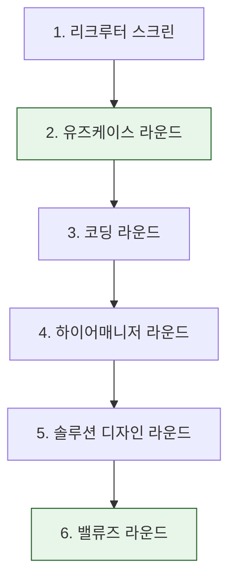

## 왜 읽어야 하나

AI 인프라·배포 엔지니어로 커리어를 설계하는 개발자, 그리고 이런 인재를 뽑아야 하는 팀 리더라면 이 가이드를 읽어야 합니다. 결론부터 말하면, 2026년 Anthropic의 Forward Deployed Engineer(FDE) 인터뷰는 전통적인 SWE 루프가 아닙니다. 라이브로 Claude와 MCP 도구를 다루는 '유즈케이스 라운드'가 한 축을 맡습니다. 기술 단계와 동등한 비중의 '밸류즈 라운드'는 비기술 인터뷰어가 진행합니다. "AI를 배포하는 엔지니어"를 평가하는 인터뷰가 실제로 어떤 모양으로 진화했는지를 보여주는 사례입니다.

## 개요

@avrldotdev가 올린 2026년 Anthropic FDE 인터뷰 가이드(이미지형, 조회수 22.5만·좋아요 2,736)가 최근 AI 엔지니어 커뮤니티에서 화제가 됐습니다. 화제의 이유는 FDE라는 역할 자체가 새로워서이기도 하지만, 인터뷰 구조가 우리가 아는 "알고리즘 문제 푸는 코딩 테스트"와 명확하게 다르기 때문입니다. tryexponent, theforwarddeployed, rungcode의 2026년 FDE 가이드가 독립적으로 같은 구조를 서술하고 있어, 한 출처만의 편견이 아니라 여러 소스로 corroborate되는 그림이라고 볼 수 있습니다.

FDE(Forward Deployed Engineer)는 Applied AI 조직의 창립 멤버급 역할로, 일반 소프트웨어 엔지니어(SWE) 루프보다 새로운 구조를 전제로 합니다. 고객 현장에 "배포되어" 문제를 직접 풀어야 한다는 의미에서, 기술 실력은 물론 배포·소통·제품 감각까지 한 인터뷰에 압축됩니다.

## FDE 인터뷰의 6단계

가이드가 서술하는 인터뷰는 6단계로 구성됩니다.

여섯 단계 중 이 가이드가 "가장 새로운 두 축"으로 짚는 것은 유즈케이스 라운드(2)와 밸류즈 라운드(6)입니다. 아래 도식에서 짙게 표시한 두 단계가 그것입니다.

**유즈케이스 라운드 = 라이브 Claude+MCP 시나리오.** 정적인 문제지를 푸는 게 아니라, 라이브 환경에서 Claude와 MCP(Model Context Protocol) 도구를 다루는 시나리오를 해결하는 라운드입니다. 특히 롱컨텍스트(long-context)에서의 신뢰성을 중시한다는 점이 특징입니다. 실제로 에이전트를 배포하다 보면 긴 컨텍스트에서 도구를 올바르게 부르고, 상태를 유지하고, 실패를 다루는 능력이 핵심인데, 이 라운드는 그 능력 그대로를 인터뷰 테이블에서 확인합니다.

**코딩 라운드는 단계적 제약이 추가되는 증분형 연습.** CodeSignal 기반이며, 한 번에 모든 제약을 던지지 않고 단계별로 제약을 더해가는 증분형 구조입니다. "완벽한 솔루션을 한 방에 내라"가 아니라, 제약을 마주할 때마다 어떻게 판단하고 확장하는지를 보는 방식입니다.

**밸류즈 라운드는 기술 단계와 동등한 비중.** 비기술 인터뷰어가 진행하며, 기술 라운드와 같은 가중치를 둡니다. FDE가 고객 현장에 간다는 특성상, 가치관·소통·제품 감각이 기술 실력과 같은 레벨에서 평가된다는 뜻입니다. 기술만 잘하면 되는 루프가 아님을 명확히 합니다.

나머지 리크루터 스크린, 하이어매니저, 솔루션 디자인 라운드는 다른 회사 인터뷰와 큰 차이가 없지만, 이 세 라운드가 위에 짚은 두 축을 전후에서 받치고 있다는 점이 구조의 포인트입니다.

## 일반 SWE 루프와 무엇이 다른가

핵심 차이는 두 가지입니다. 첫째, 평가 대상이 "코드를 잘 쓰나"에서 "AI를 배포할 수 있나"로 이동했다는 점입니다. 라이브 Claude+MCP 시나리오는 정적 코딩 테스트가 재기 어려운, 배포 현장의 역량을 인터뷰에서 그대로 재는 장치입니다. 둘째, 기술이 전체의 절반이라는 점입니다. 밸류즈 라운드가 동등한 비중을 갖는 순간, 이 인터뷰는 순수 기술 평가가 아니라 "이 사람을 고객 현장에 보내도 되는가"의 종합 평가가 됩니다.

가이드들이 공통으로 덧붙이는 점은, FDE가 Applied AI 조직의 창립급 역할이라 인터뷰 루프가 아직 완전히 표준화되지 않고 팀별 편차가 크다는 것입니다. 즉, 아래 구조는 2026년 시점의 대표적 형태지, 모든 팀에 고정된 정답은 아닙니다.

## ThakiCloud 관점의 시사점

이 가이드는 ThakiCloud에 세 갈래로 닿습니다.

**인재 관점.** AI 배포 엔지니어는 플랫폼 엔지니어와 같은 인재 풀을 놓고 경쟁합니다. FDE 인터뷰가 "라이브 도구 사용 + 증분 코딩 + 동등 비중 밸류즈"로 진화했다는 것은, 우리 플랫폼 엔지니어 면접 문항 은행도 같은 방향으로 갱신해야 함을 시사합니다. 정적 알고리즘 위주의 문항만으로는 AI 배포 역량을 재기 어렵습니다.

**Paxis 관점.** 유즈케이스 라운드가 검증하는 '라이브 Claude+MCP 프로덕션 워크플로'는, 정확히 Paxis가 스킬 하네스와 MCP 커넥터로 제품화하는 영역입니다. Paxis의 MCP 커넥터 시나리오를 유즈케이스 라운드의 롱컨텍스트 신뢰성 체크리스트로 벤치마크한다면, "우리 플랫폼이 FDE가 현장에서 해야 하는 일을 얼마나 잘 떠받치는가"를 객관적으로 재게 됩니다.

**Metis·Telox 관점.** 엔터프라이즈 AI 도입의 병목이 모델이 아니라 'FDE형 배포 인재'라는 점이 다시 확인됩니다. PoC 랜딩존을 설계할 때, 배포 인력을 얼마나 빠르게 현장에 세우느냐가 영업 관점의 변수가 됩니다.

## 한계 및 반론

이것은 이미지형 단일 가이드에 3개 보조 출처를 대조한 정리입니다. 원 가이드가 특정 팀·특정 시점의 인터뷰를 반영할 수 있어, Anthropic 전체를 대표한다고 단정하기는 어렵습니다. 팀별 편차가 크다는 점 자체가 가이드가 인정하는 한계입니다. 또 '유즈케이스 라운드가 라이브 Claude+MCP'라는 서술은 여러 출처가 독립적으로 같은 구조를 말하고 있어 신뢰도가 높지만, 구체적인 문제 예시나 채점 기준까지 이 글에서 보장하는 것은 아닙니다. 준비를 위해서는 원 가이드와 corroborating 출처를 함께 확인하는 것을 권합니다.

## 정리

FDE 인터뷰가 보여주는 방향은 명확합니다. AI를 배포하는 엔지니어를 평가하는 인터뷰는 "코딩 + 밸류즈"의 종합 평가가 되었고, 그 중심에 라이브 도구 사용(유즈케이스)이 놓였습니다. 개발자라면 증분 코딩과 라이브 Claude+MCP 시나리오, 롱컨텍스트 신뢰성을 준비의 축으로 삼아야 합니다. 채용을 맡은 리더라면, 정적 알고리즘 문항에서 "제약을 단계적으로 받는 배포 시나리오"로 문항 은행을 확장할 시점입니다. 참고할 출처는 [tryexponent Anthropic FDE 인터뷰 가이드](https://www.tryexponent.com/guides/anthropic-forward-deployed-engineer-interview)와 [TheForwardDeployed Anthropic 인터뷰](https://www.theforwarddeployed.io/interviews/anthropic)입니다.

---

*출처: @avrldotdev의 2026 Anthropic FDE 인터뷰 가이드(트윗 이미지)를 [tryexponent](https://www.tryexponent.com/guides/anthropic-forward-deployed-engineer-interview)·[TheForwardDeployed](https://www.theforwarddeployed.io/interviews/anthropic)·rungcode의 2026 FDE 가이드와 대조해 정리했습니다. 구조 서술은 여러 출처가 독립적으로 corroborate하는 부분이며, 이번 세션에서는 원문을 재-fetch하지 못해 corroborating 출처로 인용했습니다.*

## 관련 슬라이드

본문 내용을 NotebookLM(`doodle_collage` 스타일)으로 요약한 슬라이드입니다.

