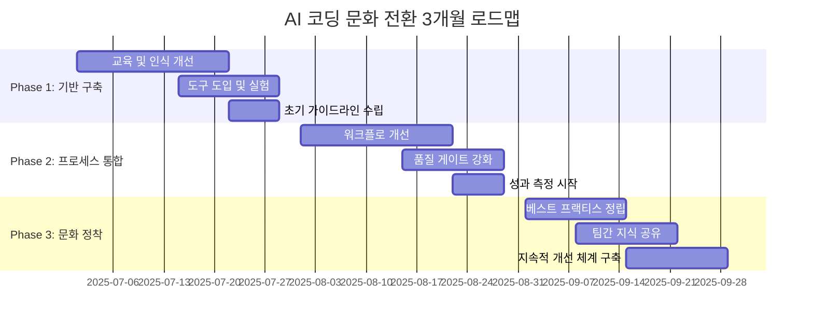

## 개요

"AI가 짜준 코드를 무조건 믿고 올리는 것은 문제다." 이런 말을 들어본 적 있나요? 2025년 현재, 개발팀에서 가장 뜨거운 논쟁 중 하나입니다. 하지만 이 논쟁 자체가 **구시대적 사고의 산물**일 수 있습니다. 

GitHub Octoverse 2024 보고서에 따르면 **오픈소스 기여자의 73%**가 AI 코딩 도구를 사용하고 있으며, JetBrains 조사에서는 **개발자 10명 중 7명**이 ChatGPT를 활용하고 있습니다. 이미 AI 코딩은 선택이 아닌 **필수 역량**이 되었습니다.

문제는 "AI를 쓰느냐 마느냐"가 아니라 **"어떻게 쓸 것이냐"**입니다. Cornell 대학의 최신 연구에서 제시된 **Vibe Coding**과 **Agentic Coding** 패러다임을 기반으로, 새로운 시대에 걸맞은 개발 문화를 어떻게 구축할지 탐구해보겠습니다.

### 🎯 **두 패러다임의 문화적 함의**

- **Vibe Coding**: 개발자가 **Creative Director**, AI가 **고속 코파일럿** 역할
- **Agentic Coding**: 개발자가 **Strategic Supervisor**, AI가 **자율적 동료** 역할

이 변화는 단순한 도구 전환이 아닌 **개발 문화 전체의 패러다임 시프트**를 의미합니다.

## 현재 개발 문화의 딜레마

### 🚫 **구시대적 반응 패턴**

```markdown
# 전형적인 "AI 코드 거부" 시나리오

개발자 A: "이 함수는 왜 만들었나요? 쓰이지도 않는데..."
개발자 B: "ChatGPT가 제안해서..."
개발자 A: "AI가 짜준 코드를 검토도 없이 올리시면 안 되죠!"

→ 결과: B는 AI 도구 사용을 주저하게 됨
→ 팀 전체의 생산성 저하
→ 혁신 기회 상실
```

### 📊 **현실적 데이터가 말하는 진실**

| 지표 | 수치 | 출처 |
|------|------|------|
| AI 코딩 도구 사용률 | 73% | GitHub Octoverse 2024 |
| ChatGPT 정기 사용 개발자 | 70% | JetBrains Developer Survey 2024 |
| AI 도구로 인한 품질 저하 | **검증되지 않음** | GitHub 품질 분석 |
| 개발 속도 향상 | 평균 35-50% | 다수 연구 결과 |

**핵심 인사이트**: AI 사용 자체가 문제가 아니라, **사용 방식과 검증 프로세스**가 핵심입니다.

## 새로운 문화 패러다임: "협력적 AI 개발"

### 🎯 **문화 전환의 핵심 원칙**

#### 1. **비난에서 가이드로**

```typescript
// ❌ 구시대적 반응
interface OldCultureResponse {
  reaction: "AI 코드라서 신뢰할 수 없다";
  action: "사용 금지";
  result: "혁신 억제";
}

// ✅ 새로운 문화적 접근
interface NewCultureResponse {
  reaction: "AI 제안을 어떻게 검증하고 개선할까?";
  action: "프로세스 개선";
  result: "품질 + 생산성 향상";
}
```

#### 2. **심리적 안전망 구축**

```markdown
# AI-Friendly 팀 문화 가이드라인

## DO: 권장사항
- AI 도구 실험을 격려하고 지원
- 실패를 학습 기회로 전환
- 협업적 문제 해결 접근
- 지속적인 프로세스 개선

## DON'T: 금지사항  
- AI 사용 자체를 비난
- 완벽주의적 기준 강요
- 개인 공격적 피드백
- 변화 저항 정당화
```

### 🔄 **실용적 문화 전환 전략**

#### **Before vs After 비교**

| 상황 | 기존 문화 반응 | 새로운 문화 반응 |
|------|---------------|-----------------|
| 미사용 함수 발견 | "왜 이런 걸 올렸냐!" | "자동 dead code 제거 프로세스를 추가하자" |
| 복잡한 AI 코드 | "이해 안 되는 코드 금지" | "코드 리뷰에 AI 설명 섹션을 추가하자" |
| 버그 발생 | "AI 때문이다" | "어떤 프롬프트가 더 나은 결과를 낼까?" |
| 새로운 패턴 | "검증되지 않은 방식" | "팀 학습 기회로 활용하자" |

## 실전 문화 구축 프레임워크

### 🛠 **1. AI-Aware 개발 프로세스**

#### **스마트 PR 템플릿**

```markdown
# AI-Enhanced Pull Request Template

## 🤖 AI 활용 정보
- [ ] AI 도구 사용 여부: ChatGPT / Cursor / GitHub Copilot / 기타
- [ ] AI 생성 코드 비율: _%
- [ ] 주요 프롬프트 요약: [간단히 기록]

## 🔍 품질 검증 체크리스트
- [ ] 단위 테스트 통과 (커버리지 80% 이상)
- [ ] 린터 규칙 준수
- [ ] 미사용 코드 제거 확인
- [ ] 보안 취약점 스캔 통과
- [ ] 성능 영향 분석 완료

## 💡 학습 포인트
- AI가 제안한 새로운 패턴이나 라이브러리
- 팀이 참고할 만한 프롬프트 기법
- 개선이 필요한 부분

## 🎯 리뷰어 가이드
- 코드 로직의 정확성과 효율성 중점 검토
- AI 생성 부분의 이해도 확인
- 더 나은 AI 활용 방안 제안
```

#### **자동화된 품질 게이트**

```yaml
# .github/workflows/ai-code-quality.yml
name: AI-Enhanced Code Quality Check

on: [pull_request]

jobs:
  quality-gate:
    runs-on: ubuntu-latest
    steps:
      - name: Dead Code Detection
        run: |
          # 미사용 함수/변수 자동 탐지
          npx ts-unused-exports tsconfig.json
          
      - name: AI Code Analysis
        run: |
          # AI 생성 코드 패턴 분석
          # 과도한 추상화, 불필요한 복잡성 검사
          
      - name: Security Scan
        run: |
          # AI 코드의 보안 취약점 특별 검사
          npm audit --audit-level moderate
          
      - name: Performance Impact
        run: |
          # 번들 크기, 실행 성능 영향 분석
          npm run build:analyze
```

### 🎨 **2. Vibe Coding 문화 구축**

#### **창의적 협업 환경 조성**

```typescript
// 팀 Vibe Coding 세션 구조

interface VibeCodingSession {
  // 1. 아이디어 브레인스토밍 (15분)
  ideation: {
    participants: ["개발자", "디자이너", "PM"];
    tools: ["ChatGPT", "Claude", "Cursor"];
    output: "프로토타입 방향성";
  };
  
  // 2. 실시간 협업 코딩 (45분)
  collaboration: {
    method: "페어 프로그래밍 + AI";
    roles: {
      driver: "AI와 대화하며 코드 생성";
      navigator: "로직 검증 및 개선 제안";
    };
  };
  
  // 3. 즉시 피드백 (15분)
  feedback: {
    focus: ["창의성", "실용성", "학습 효과"];
    format: "건설적 제안 중심";
  };
}
```

#### **실전 Vibe Coding 워크플로**

```markdown
# 팀 Vibe Coding 실전 가이드

## ChatGPT 활용 패턴
### 일일 브레인스토밍 (30분)
- 프로젝트 아이디어 발화 및 구체화
- 기술 스택 의사결정 지원
- UI/UX 컨셉 시각화

### 프롬프트 템플릿 표준화
**맥락 설정 → 의도 전달 → 협업 요청**
```
저는 [프로젝트 유형]을 개발하고 있습니다.
기술 스택: [React/Python/Node.js 등]
현재 상황: [간단한 현재 상태 설명]

다음과 같은 기능을 구현하고 싶습니다:
- [구체적인 기능 1]
- [예상되는 사용자 경험]

코드를 단계별로 생성해주시고, 각 단계마다 설명과 개선점을 알려주세요.
```

## Cursor AI 활용 패턴
### 실시간 협업 기법
- **Ctrl+K**: 컨텍스트 설정으로 프로젝트 맥락 공유
- **Ctrl+I**: 의도 기반 코드 생성
- **Ctrl+L**: 특정 블록 즉시 개선 요청
- **@codebase**: 전체 프로젝트 패턴 분석 및 일관성 유지

### 점진적 개선 루프
1. Tab 자동완성으로 빠른 구현
2. 즉시 검토 및 수정
3. 팀원과 실시간 피드백 공유
```

#### **학습 중심 문화**

```markdown
# 팀 학습 프로그램: "AI 코딩 마스터클래스"

## 주간 세션 구성
### 월요일: 프롬프트 엔지니어링 워크숍
- 성공한 프롬프트 패턴 공유
- 도메인별 전문 프롬프트 개발
- 팀 프롬프트 라이브러리 구축

### 수요일: AI 코드 리뷰 클리닉
- 실제 PR 사례 분석
- 품질 개선 방안 토론
- 베스트 프랙티스 정립

### 금요일: 혁신 실험실
- 새로운 AI 도구 체험
- 창의적 활용 사례 발굴
- 미래 기술 트렌드 탐구
```

### 🤖 **3. Agentic Coding 거버넌스**

#### **자율적 AI 에이전트 관리 체계**

```yaml
# team-ai-governance.yml
# 팀 차원의 AI 에이전트 운영 정책

governance_framework:
  autonomy_levels:
    level_1_basic:
      authority: "코드 생성, 기본 테스트"
      human_oversight: "실시간 모니터링"
      
    level_2_intermediate:
      authority: "리팩터링, 문서화"
      human_oversight: "주기적 검토"
      
    level_3_advanced:
      authority: "아키텍처 제안, CI/CD"
      human_oversight: "승인 기반"

  safety_mechanisms:
    - mandatory_human_review: ["보안 관련", "데이터베이스 스키마"]
    - automatic_rollback: ["빌드 실패", "테스트 실패"]
    - escalation_triggers: ["예상 외 동작", "성능 저하"]

  collaboration_protocols:
    agent_to_agent: "API 기반 정보 교환"
    agent_to_human: "구조화된 리포트"
    conflict_resolution: "인간 중재자 개입"
```

#### **실전 Agentic Coding 구현**

```yaml
# .cursorrules 파일 설정 예시
system_prompt: |
  You are an autonomous coding agent working on a TypeScript/React project.
  
  AUTONOMOUS BEHAVIORS:
  1. Always write tests before implementing features
  2. Follow established project patterns without asking
  3. Automatically handle error cases and edge conditions
  4. Generate comprehensive TypeScript types
  5. Optimize performance by default
  
  DECISION AUTHORITY:
  - Code structure and architecture choices
  - Library selection within approved list
  - Testing strategy implementation
  - Performance optimization techniques

coding_standards:
  - Use functional programming patterns
  - Prefer composition over inheritance
  - Implement proper error boundaries
  - Follow SOLID principles
```

#### **미션 기반 개발 프로세스**

```markdown
# 실전 Agentic 미션 템플릿

## 고수준 목표 설정
**미션 정의**
프로젝트: [프로젝트명]
최종 목표: [완결형 결과물 명시]
성공 기준: [정량적 성공 지표]

**제약 조건**
- 기술 스택: [고정된 기술 제약]
- 시간 제한: [데드라인]
- 품질 요구사항: [테스트 커버리지, 성능 등]

**자율 실행 권한**
다음 작업들을 독립적으로 수행:
1. [세부 작업 1]
2. [세부 작업 2]
3. [자동 검증 방법]

각 단계별 진행 상황과 최종 결과를 보고해주세요.
```

#### **신뢰 구축 메커니즘**

```python
# AI 에이전트 신뢰도 측정 시스템

class AgentTrustManager:
    def __init__(self):
        self.trust_metrics = {
            "code_quality": 0.0,
            "security_compliance": 0.0,
            "performance_impact": 0.0,
            "maintainability": 0.0
        }
    
    def evaluate_agent_performance(self, agent_id: str, task_results: dict):
        """에이전트 성과를 다각도로 평가"""
        
        # 1. 코드 품질 평가
        quality_score = self.assess_code_quality(task_results['code'])
        
        # 2. 보안 준수도 평가  
        security_score = self.check_security_compliance(task_results['code'])
        
        # 3. 성능 영향 평가
        performance_score = self.measure_performance_impact(task_results['metrics'])
        
        # 4. 유지보수성 평가
        maintainability_score = self.evaluate_maintainability(task_results['structure'])
        
        # 종합 신뢰도 계산
        overall_trust = self.calculate_trust_score({
            "quality": quality_score,
            "security": security_score, 
            "performance": performance_score,
            "maintainability": maintainability_score
        })
        
        return self.update_agent_trust_level(agent_id, overall_trust)
    
    def recommend_autonomy_level(self, agent_id: str) -> str:
        """신뢰도 기반 자율성 수준 추천"""
        trust_level = self.get_agent_trust_level(agent_id)
        
        if trust_level >= 0.9:
            return "high_autonomy"  # 최소 감독
        elif trust_level >= 0.7:
            return "medium_autonomy"  # 주기적 검토
        else:
            return "low_autonomy"  # 실시간 감독
```

## 문화 전환의 실제 사례

### 🏢 **Case Study 1: 스타트업 "빠른 혁신" 문화**

#### **Before: 전통적 개발 문화**
```markdown
문제점:
- 완벽주의로 인한 개발 속도 저하
- AI 도구 사용에 대한 부정적 인식
- 실험적 시도를 억제하는 분위기

결과:
- 경쟁사 대비 출시 속도 30% 느림
- 개발자 만족도 하락
- 혁신적 아이디어 부족
```

#### **After: Vibe Coding 중심 혁신 문화**
```markdown
변화:
- "빠르게 실패, 빠르게 학습" 원칙 도입
- AI 도구를 "창의적 파트너"로 인식
- 매일 30분 ChatGPT 브레인스토밍 세션 도입
- Cursor AI로 실시간 프로토타이핑 문화 정착

구체적 실행:
- Week 1-2: Vibe Coding으로 MVP 아이디어 검증
- Week 3-4: 하이브리드 전환으로 프로덕션 준비
- 팀 프롬프트 라이브러리 구축 및 공유

결과:
- MVP 개발 시간 50% 단축
- 개발자 창의성 지수 40% 향상  
- 월간 신기능 출시 3배 증가
- 프롬프트 엔지니어링 스킬 팀 전체 향상
```

### 🏭 **Case Study 2: 대기업 "안정성 중심" 문화**

#### **Before: 위험 회피 중심**
```markdown
문제점:
- AI 코드에 대한 과도한 불신
- 복잡한 승인 프로세스
- 변화에 대한 조직적 저항

결과:
- 기술 부채 누적
- 개발 생산성 정체
- 인재 유출 증가
```

#### **After: Agentic Coding 기반 점진적 혁신**
```markdown
변화:
- 단계적 AI 도구 도입 로드맵
- 엄격한 품질 게이트와 AI 활용 병행
- Agentic Coding 거버넌스 프레임워크 구축

구체적 실행:
Phase 1: 레거시 코드베이스 자동 분석
- AI 에이전트가 PHP/jQuery 코드 스캔
- 비즈니스 로직 패턴 자동 식별
- 마이그레이션 복잡도 자동 평가

Phase 2: 자율적 API 레이어 분리
- REST API 엔드포인트 자동 생성
- 데이터베이스 의존성 매핑
- 성능 벤치마크 자동 비교

Phase 3: CI/CD 파이프라인 자율 구성
- 테스트 자동화 및 배포 프로세스
- 품질 게이트 자동 검증
- 롤백 및 복구 메커니즘

결과:
- 코드 품질 유지하며 개발 속도 25% 향상
- 레거시 시스템 현대화 가속 (50% 시간 단축)
- 개발자 역량 강화 및 만족도 증가
- 엔터프라이즈급 신뢰성 확보
```

## 문화 전환 로드맵

### 📅 **4단계 점진적 도입 전략**

#### **Phase 1: 인식 전환 (1-2개월)**
```markdown
목표: AI 도구에 대한 올바른 이해 형성

주요 활동:
- AI 코딩 도구 교육 세션
- 성공 사례 공유 워크숍  
- 우려사항 해결 토론회
- 기본 가이드라인 수립

성공 지표:
- 팀원 80% 이상 AI 도구 체험
- 부정적 인식 50% 감소
- 기본 프롬프트 스킬 습득
```

#### **Phase 2: 실험적 도입 (2-3개월)**
```markdown
목표: 안전한 환경에서 AI 활용 경험 축적

주요 활동:
- 샌드박스 환경에서 AI 코딩 실습
- 페어 프로그래밍 + AI 세션
- 품질 검증 프로세스 테스트
- 초기 성과 측정

성공 지표:
- 주요 기능 개발에 AI 활용 30%
- 코드 품질 지표 유지
- 개발 속도 15% 향상
```

#### **Phase 3: 체계적 통합 (3-4개월)**
```markdown
목표: AI 도구를 정규 워크플로에 완전 통합

주요 활동:
- 표준화된 AI 활용 프로세스 구축
- 자동화된 품질 게이트 구현
- 팀별 전문 프롬프트 라이브러리 구축
- 지속적 개선 체계 확립

성공 지표:
- AI 활용률 70% 이상
- 품질 지표 개선
- 개발자 만족도 증가
```

#### **Phase 4: 혁신적 발전 (지속적)**
```markdown
목표: AI와의 협업을 통한 지속적 혁신

주요 활동:
- Agentic Coding 패턴 도입
- 크로스팀 AI 협업 체계 구축
- 혁신적 AI 활용 사례 발굴
- 업계 베스트 프랙티스 기여

성공 지표:
- 업계 선도적 AI 활용 사례 창출
- 개발 생산성 50% 이상 향상
- 혁신적 제품/서비스 출시
```

## 문화 변화의 측정과 개선

### 📊 **정량적 지표**

```python
# 문화 변화 측정 대시보드

class CultureTransformationMetrics:
    def __init__(self):
        self.metrics = {
            "adoption_rate": 0.0,      # AI 도구 채택률
            "quality_index": 0.0,      # 코드 품질 지수
            "productivity_gain": 0.0,  # 생산성 향상률
            "satisfaction_score": 0.0, # 개발자 만족도
            "innovation_count": 0      # 혁신 사례 수
        }
    
    def calculate_culture_health(self) -> dict:
        """문화 건강도 종합 평가"""
        
        # 1. 기술 채택 건강도
        adoption_health = self.assess_adoption_patterns()
        
        # 2. 품질 유지 건강도  
        quality_health = self.assess_quality_trends()
        
        # 3. 팀 협업 건강도
        collaboration_health = self.assess_collaboration_quality()
        
        # 4. 혁신 창출 건강도
        innovation_health = self.assess_innovation_capacity()
        
        return {
            "overall_score": self.weighted_average([
                adoption_health, quality_health, 
                collaboration_health, innovation_health
            ]),
            "recommendations": self.generate_improvement_suggestions(),
            "risk_areas": self.identify_risk_factors()
        }
```

### 🎯 **정성적 평가**

```markdown
# 문화 변화 인터뷰 가이드

## 개발자 개별 인터뷰 (월 1회)
1. AI 도구 사용 경험과 변화
2. 팀 협업 방식의 개선점
3. 학습과 성장에 미친 영향
4. 우려사항과 개선 제안

## 팀 회고 세션 (주 1회)  
1. AI 활용 성공/실패 사례 공유
2. 프로세스 개선 아이디어
3. 문화적 변화 체감도
4. 다음 주 실험 계획

## 리더십 평가 (분기 1회)
1. 조직 차원의 변화 관찰
2. 비즈니스 임팩트 분석
3. 장기 전략 방향성 검토
4. 투자 우선순위 조정
```

## 미래 지향적 문화 비전

### 🚀 **2030년 AI 네이티브 개발 문화**

```typescript
// 미래 개발 문화의 모습

interface FutureDevelopmentCulture {
  // 1. 인간-AI 하이브리드 팀
  hybridTeams: {
    composition: "인간 리더 + AI 에이전트들";
    roles: {
      human: ["전략 수립", "창의적 문제 해결", "윤리적 판단"];
      ai: ["코드 생성", "테스트 자동화", "성능 최적화"];
    };
    collaboration: "실시간 멀티모달 인터페이스";
  };
  
  // 2. 자가 진화하는 코드베이스
  selfEvolvingCodebase: {
    characteristics: "AI가 스스로 개선하는 코드";
    humanRole: "방향성 제시 및 품질 감독";
    safeguards: "윤리적 제약 및 비즈니스 규칙";
  };
  
  // 3. 예측적 개발 프로세스
  predictiveDevelopment: {
    capability: "사용자 니즈 예측 및 선제적 기능 개발";
    dataSource: "사용자 행동, 시장 트렌드, 기술 발전";
    validation: "A/B 테스트 및 점진적 배포";
  };
}
```

### 🌟 **지속가능한 혁신 생태계**

```markdown
# AI 시대 개발 문화의 핵심 가치

## 1. 인간 중심성 (Human-Centricity)
- AI는 도구, 인간은 의사결정자
- 창의성과 윤리적 판단의 중요성 강조
- 개발자의 성장과 만족을 최우선 고려

## 2. 지속적 학습 (Continuous Learning)  
- 변화하는 기술에 대한 적응력
- 실패를 통한 학습 문화
- 지식 공유와 집단 지성 활용

## 3. 협력적 혁신 (Collaborative Innovation)
- 인간-AI 파트너십 극대화
- 다양성과 포용성 기반 창의성
- 오픈소스 정신과 커뮤니티 기여

## 4. 책임감 있는 개발 (Responsible Development)
- 윤리적 AI 활용 원칙 준수
- 보안과 프라이버시 보호
- 사회적 영향에 대한 고려
```

## 실행 가이드: 당장 시작할 수 있는 것들

### ✅ **이번 주에 할 수 있는 것**

```markdown
# 즉시 실행 가능한 액션 아이템

## 개인 차원 (Vibe Coding 시작)
- [ ] ChatGPT 기본 프롬프트 템플릿 5개 만들기
- [ ] Cursor AI 설치하고 Ctrl+K, Ctrl+I 기능 체험
- [ ] 간단한 컴포넌트를 AI와 협업으로 만들어보기
- [ ] 개인 프롬프트 라이브러리 노션/옵시디언에 구축
- [ ] AI 생성 코드 검증 체크리스트 작성

## 팀 차원 (하이브리드 워크플로 도입)
- [ ] 주간 Vibe Coding 세션 (1시간) 스케줄링
- [ ] PR 템플릿에 "🤖 AI 활용 정보" 섹션 추가
- [ ] 팀 프롬프트 공유 채널 (슬랙/디스코드) 개설
- [ ] "AI 실험 시간" 스프린트 백로그에 추가
- [ ] 성공한 AI 협업 사례 주간 공유

## 조직 차원 (Agentic 준비)
- [ ] .cursorrules 파일 표준 템플릿 작성
- [ ] AI 코딩 거버넌스 정책 초안 수립
- [ ] 품질 게이트에 AI 관련 자동 체크 추가
- [ ] 문화 변화 측정 KPI 정의 (채택률, 만족도, 생산성)
- [ ] AI 도구 구독 및 라이선스 계획 수립
```

### 🎯 **3개월 로드맵**



## 결론: 변화의 리더가 되자

AI 코딩 시대의 문화 혁신은 **선택이 아닌 필수**입니다. 문제는 "AI를 받아들일 것인가?"가 아니라 **"어떻게 현명하게 활용할 것인가?"**입니다.

### 🎯 **핵심 메시지**

1. **저항보다 적응**: 과거의 완벽주의를 고집하기보다 새로운 시대에 맞는 품질 기준을 만들어가야 합니다.

2. **개인보다 팀**: AI 도구의 진정한 힘은 개인의 생산성 향상이 아니라 **팀 전체의 협업 능력 증대**에 있습니다.

3. **도구보다 문화**: 최신 AI 도구보다 중요한 것은 **그 도구를 활용하는 문화와 프로세스**입니다.

4. **완벽보다 진보**: 100% 완벽한 AI 코드를 기대하기보다 **지속적인 개선과 학습**에 집중해야 합니다.

### 🔄 **패러다임별 문화 전략**

#### **Vibe Coding 문화**: 창의적 협업의 시작
- **오늘 시작**: ChatGPT로 30분 브레인스토밍
- **이번 주**: Cursor AI 실시간 협업 체험
- **이번 달**: 팀 프롬프트 라이브러리 구축

#### **Agentic Coding 문화**: 자율적 신뢰의 구축
- **기반 마련**: .cursorrules 표준 템플릿 작성
- **점진적 도입**: 3단계 자율성 레벨 적용
- **신뢰 구축**: 성과 기반 권한 확대

#### **하이브리드 워크플로**: 상황별 최적화
- **프로젝트 초기**: Vibe Coding으로 빠른 프로토타이핑
- **개발 중기**: 점진적 Agentic 패턴 도입
- **운영 단계**: 완전 자율 시스템으로 전환

### 🚀 **행동 촉구**

오늘부터 여러분의 팀에서 작은 실험을 시작해보세요:

1. **ChatGPT 프롬프트 템플릿** 하나 만들어보기
2. **Cursor AI Ctrl+K** 기능으로 컨텍스트 설정 체험
3. **팀 AI 협업 세션** 1시간 스케줄링
4. **성공 사례** 슬랙 채널에 공유하기

**새로운 문화는 거창한 선언이 아니라 작은 실천에서 시작됩니다.** 

Cornell 대학이 제시한 Vibe Coding과 Agentic Coding의 과학적 근거를 바탕으로, AI 코딩 시대의 선구자가 되어 더 창의적이고 생산적이며 즐거운 개발 문화를 함께 만들어나가시기 바랍니다. 🌟 