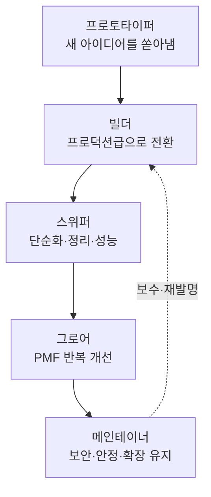
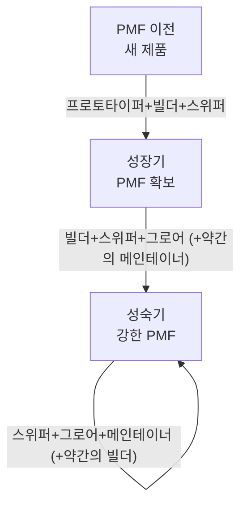

## 개요

직함이 하는 일을 설명하지 못하는 순간이 점점 늘고 있습니다. 디자이너가 프로토타입을 코드로 짜고, 엔지니어가 사용자 인터뷰를 하고, 데이터 과학자가 제품 방향을 정하는 장면이 이제 낯설지 않습니다. AI 도구가 각 직무의 기계적인 부분을 흡수하면서 엔지니어링, 제품, 디자인, 데이터 분석의 경계가 한 덩어리로 녹아내리고 있습니다.

이 흐름을 두고 Claude Code를 만든 보리스 체르니(Boris Cherny)가 흥미로운 관찰을 내놓았습니다. 자신이 속한 Claude Code 팀을 들여다보니 직무와 무관하게 다섯 가지 역할 원형이 보이더라는 것입니다. 이 관찰이 중요한 이유는 단순합니다. 앞으로의 조직이 직무 기능이 아니라 이런 원형의 조합으로 팀을 짜게 될지 모른다는 가설을 던지기 때문입니다.

이 글은 그 다섯 가지 원형이 무엇인지, 왜 직무와 분리되는지, 그리고 제품의 성숙도에 따라 어떤 조합이 필요한지를 정리합니다. 기술 요약이 아니라 팀을 어떻게 구성하고 채용을 어떻게 바라볼지를 묻는 문화 에세이입니다. ThakiCloud처럼 사람과 에이전트가 함께 일하는 조직에는 특히 직접적인 질문입니다.

## 다섯 가지 역할 원형

체르니가 제시한 원형은 다음과 같습니다. 각각을 우리말로 옮기면서 실제 팀에서 어떻게 드러나는지 덧붙였습니다.

**프로토타이퍼(Prototyper)**는 완전히 새로운 아이디어를 떠올리는 사람입니다. 수많은 아이디어를 쏟아내지만 대부분은 출시되지 못합니다. 이 원형의 가치는 성공률이 아니라 발상의 밀도에 있습니다. 열 개 중 아홉 개가 버려지더라도 하나의 방향을 여는 사람이 없으면 조직은 새 영토로 나아가지 못합니다.

**빌더(Builder)**는 프로토타입과 아이디어를 빠르게 프로덕션급 제품이나 인프라로 전환하는 사람입니다. 발상과 출시 사이의 거리를 좁히는 역할입니다. 프로토타이퍼가 스케치라면 빌더는 그 스케치를 실제로 서 있는 건물로 바꿉니다.

**스위퍼(Sweeper)**는 정리하는 사람입니다. 어수선한 UI를 다듬고, 코드와 시스템을 단순하게 만들고, 쓰이지 않는 기능을 걷어내고, 성능을 끌어올립니다. 무언가를 더하는 것이 아니라 덜어내는 것이 이 원형의 일입니다. 기능을 없애는 결정(unship)은 만드는 것만큼이나 용기가 필요합니다.

**그로어(Grower)**는 이미 만들어진 제품을 가져와 제품-시장 적합성(PMF)을 높이기 위해 반복적으로 개선하는 사람입니다. 큰 판을 새로 짜기보다 이미 있는 판에서 전환율을 끌어올리고, 사용자 이탈을 막고, 작은 개선을 쌓아 올립니다.

**메인테이너(Maintainer)**는 성숙한 시스템을 소유하는 사람입니다. 시스템이 커질 때 보안, 안정성, 속도, 효율을 유지합니다. 화려하지 않지만 이 원형이 없으면 성장한 제품은 자기 무게에 눌려 무너집니다.

## 역할은 직무가 아닙니다

이 관찰의 핵심은 목록 자체가 아니라, 이 원형들이 직무 기능과 연결되지 않는다는 점입니다. 체르니는 Anthropic 전체를 보면 어떤 디자이너는 프로토타이퍼(1번)에, 어떤 디자이너는 빌더(2번)에, 또 어떤 디자이너는 스위퍼(3번)에 해당한다고 말합니다. 엔지니어도, 제품 관리자도, 데이터 과학자도 마찬가지입니다.

바꿔 말하면 "디자이너를 뽑는다"는 문장이 점점 정보량을 잃고 있습니다. 같은 디자이너라도 새 영토를 여는 프로토타이퍼형인지, 다듬어 완성하는 스위퍼형인지에 따라 팀에 기여하는 방식이 완전히 다릅니다. 직함은 그가 배운 도구를 알려줄 뿐, 그가 어떤 순간에 빛나는지는 알려주지 않습니다.

많은 사람이 두 개의 원형을 넘나들고, 때로는 세 개까지 걸칩니다. 프로토타이퍼이면서 빌더인 사람이 초기 스타트업에서 특히 귀합니다. 스위퍼이면서 메인테이너인 사람은 성숙한 인프라 팀의 척추가 됩니다. 한 사람을 하나의 상자에 가두는 대신 그가 어떤 원형의 스펙트럼 위에 있는지를 보는 편이 실제에 더 가깝습니다.

## 제품 생애주기별 팀 구성

원형이 흥미로운 진짜 이유는 이것이 팀 구성의 공식이 되기 때문입니다. 체르니는 건강한 팀이라면 제품의 성숙도에 따라 다른 원형 조합이 필요하다고 정리합니다.

새롭고 아직 PMF를 찾지 못한 제품은 프로토타이퍼, 빌더, 스위퍼(1+2+3)에 강한 사람들이 필요합니다. 아직 무엇이 맞는지 모르는 단계이므로 빠르게 만들고, 빠르게 버리고, 방향을 계속 바꾸는 힘이 중요합니다. 이 단계에서 메인테이너 성향이 강한 사람만 모으면 만들어지지도 않은 것을 지키느라 움직이지 못합니다.

성장 중이고 PMF를 찾은 제품은 빌더, 스위퍼, 그로어(2+3+4)에 약간의 메인테이너(5)가 필요합니다. 방향은 잡혔으니 이제 완성도를 높이고 전환을 개선하면서, 늘어나는 사용자를 감당할 최소한의 안정성을 확보해야 합니다.

강한 PMF를 가진 성숙한 제품은 스위퍼, 그로어, 메인테이너(3+4+5)에 약간의 빌더(2)가 필요합니다. 시스템을 단순하게 유지하고, 지속적으로 개선하고, 커지는 규모에서 보안과 속도를 지키되, 필요할 때만 새로운 것을 짓습니다.

이 공식이 알려주는 실무적 함의는 분명합니다. 팀에 사람을 더할 때 "엔지니어가 부족하다"가 아니라 "지금 우리 제품 단계에 어떤 원형이 비어 있는가"를 먼저 물어야 한다는 것입니다. 성숙한 제품 팀에 프로토타이퍼만 계속 채우면 새 아이디어는 넘치지만 아무도 시스템을 지키지 않습니다. 반대로 PMF 이전 제품에 메인테이너만 모으면 지킬 것이 생기기도 전에 방어 태세부터 갖춥니다.

## ThakiCloud 관점: 에이전트 시대의 역할 재편

직무가 녹아내린다는 관찰은 사람과 에이전트가 함께 일하는 조직에서 한층 뾰족해집니다. AI 에이전트가 기계적인 빌드 작업의 상당 부분을 흡수하면, 사람은 자연스럽게 제품 단계마다 진짜로 중요한 원형 쪽으로 이동하게 됩니다. 코드를 타이핑하는 손이 아니라, 어떤 원형이 지금 필요한지를 판단하는 눈이 병목이 됩니다.

ThakiCloud가 운용하는 Agent-Native Cloud인 Paxis는 바로 이 재편을 시스템 층위에서 구현합니다. Paxis는 Skills, Tools, Policies, Audit Logs를 일급 리소스로 다루며, 960개가 넘는 스킬을 BM25로 선택해 격리된 샌드박스에서 실행합니다. 체르니가 사람의 역할을 직함이 아니라 제품 순간에 맞춰 재조합한다고 말했듯, Paxis는 에이전트의 역량을 고정된 파이프라인이 아니라 그때그때의 작업에 맞춰 동적으로 조합합니다. 프로토타이퍼가 발상을 쏟아내면 빌더 역할의 에이전트가 프로덕션 코드로 전환하고, 스위퍼 역할의 검증 게이트가 결과를 정리하는 식의 분업이 스킬 하네스 안에서 그대로 재현됩니다.

인프라 쪽에서는 ThakiCloud의 ai-platform이 메인테이너 원형의 일을 대신 짊어집니다. K8s 기반 멀티테넌트 환경에서 Kueue로 GPU를 스케줄링하고, vLLM으로 모델을 서빙하며, 온프렘과 소버린 요구를 만족시키는 것은 정확히 성숙한 시스템의 보안·안정·효율을 지키는 메인테이너의 일입니다. 고객 조직은 이 부분을 플랫폼에 위임함으로써 자기 팀을 프로토타이퍼와 그로어 쪽에 더 배치할 수 있습니다.

채용 관점에서도 이 렌즈는 유용합니다. ThakiCloud는 이력서의 직함보다 지원자가 어떤 원형의 스펙트럼 위에 있는지를 봅니다. 지금 우리 제품 단계에 비어 있는 원형을 채우는 사람이 팀에 가장 큰 레버리지를 만들기 때문입니다. "무엇을 할 줄 아는가"만큼 "어떤 순간에 빛나는가"를 묻는 것입니다.

## 한계 및 반론

이 프레임워크를 무비판적으로 받아들이기 전에 반대편의 목소리도 들어야 합니다. 벤 비네거(Ben Vinegar)는 같은 논의를 두고 "사람들이 소프트웨어 조직이 어떻게 돌아가는지를 이제야 배우면서, 원래부터 있던 팀 역학을 AI 탓으로 잘못 돌리고 있다"고 지적했습니다. 날카로운 반론입니다. 프로토타이퍼와 메인테이너의 구분은 AI가 없던 시절에도 존재했고, 제품 생애주기에 따라 필요한 인재가 달라진다는 것도 새로운 통찰이 아닙니다.

원형 분류 자체의 한계도 있습니다. 사람을 다섯 개의 상자로 나누는 모든 시도가 그렇듯, 이 틀도 개인을 지나치게 단순화할 위험이 있습니다. 실제로는 한 사람이 프로젝트마다, 심지어 하루 안에서도 여러 원형을 오갑니다. 원형을 고정된 정체성으로 오해하면 "너는 스위퍼니까 새 아이디어는 내지 마"라는 식의 역효과가 납니다. 체르니 본인도 많은 사람이 원형을 넘나든다고 강조한 이유가 여기에 있습니다.

그럼에도 이 프레임워크가 가치 있는 이유는 예측력이 아니라 언어를 준다는 데 있습니다. "엔지니어 한 명 더"라는 모호한 요청 대신 "지금 우리에게 그로어가 부족하다"고 말할 수 있게 되면, 채용과 팀 구성의 대화가 훨씬 구체적으로 바뀝니다. AI가 직무의 기계적 층위를 걷어낼수록, 남는 것은 이런 원형 수준의 판단입니다. 미래의 제품 역할은 오늘의 도메인별 직함보다 이 원형에 더 가깝게 형성될지 모릅니다.

## 마치며

직무가 녹아내리는 것은 위기가 아니라 재편입니다. 프로토타이퍼, 빌더, 스위퍼, 그로어, 메인테이너라는 다섯 원형은 직함이 사라진 자리에 무엇이 남는지를 보여줍니다. 남는 것은 도구가 아니라 어떤 순간에 어떤 방식으로 기여하는가라는 본질입니다.

ThakiCloud는 사람과 에이전트가 이 원형들을 나눠 지는 조직을 만들고 있습니다. 에이전트가 반복 가능한 빌드와 유지의 상당 부분을 맡을수록, 사람은 지금 이 제품 단계에 어떤 원형이 필요한지를 읽어내는 일에 집중하게 됩니다. 그 판단이 다음 시대의 가장 귀한 역량입니다.

## 출처

- Boris Cherny, X(@bcherny), 2026-06-29: [원문 트윗](https://x.com/bcherny/status/2071379474277613732)
- Ben Vinegar, X(@bentlegen): [반론 트윗](https://x.com/bentlegen/status/2071576459538567463)
