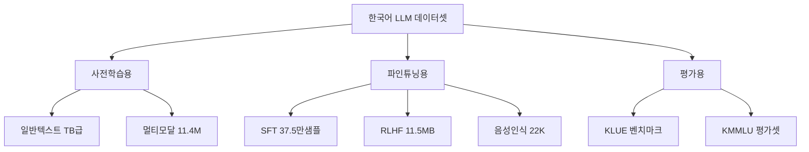

> **TL;DR** 한국어 LLM 학습을 위한 **완전한 데이터셋 생태계**를 소개한다. **허깅페이스 heegyu 컬렉션 37.5만 샘플**부터 **AI-Hub 수백TB 공공데이터**까지, 사전학습→SFT→RLHF 전체 파이프라인을 커버하는 실전 가이드다. **한국어 ChatGPT 수준 모델** 구축을 위한 모든 자료가 여기 있다.

---

## 한국어 LLM 데이터 생태계 현황

한국어 대형 언어모델(LLM) 개발이 급속히 발전하면서, **고품질 한국어 데이터셋**의 중요성이 더욱 부각되고 있다. 2025년 현재 **Hugging Face의 heegyu 컬렉션**이 한국어 RLHF 분야를 선도하고 있으며, **AI-Hub와 공공데이터포털**이 대규모 실용 데이터를 제공하고 있다.

### 데이터셋 분류 체계



### 핵심 성과 지표

| 데이터셋 유형 | 대표 데이터셋 | 규모 | 라이선스 | 활용분야 |
|-------------|-------------|------|---------|---------|
| **RLHF 통합** | Trofish/Korean-RLHF-Full-process | 11.5MB | CC BY-NC 4.0 | ChatGPT급 대화모델 |
| **지시학습** | heegyu/open-korean-instructions | 37.5만샘플 | MIT | 명령어 수행능력 |
| **멀티모달** | Bingsu/laion2B-multi-korean-subset | 1,137만샘플 | CC BY 4.0 | 이미지-텍스트 모델 |
| **공공데이터** | AI-Hub 통합 | 수백TB | 자유이용 | 실용 AI 서비스 |

## 핵심 데이터셋 심화 분석

### 1. Trofish/Korean-RLHF-Full-process

**한국어 RLHF 완전 파이프라인의 결정판**이다. ChatGPT와 동등한 수준의 한국어 대화 모델을 만들기 위한 모든 단계를 커버한다.

#### 데이터 구조

```python
# 실제 데이터 로드 예제
from datasets import load_dataset

# SFT 단계 데이터
sft_dataset = load_dataset("Trofish/Korean-RLHF-Full-process", 
                          data_files="sft_data.jsonl")
print(f"SFT 샘플 수: {len(sft_dataset['train'])}")

# 데이터 구조 확인
sample = sft_dataset['train'][0]
print("Sample structure:")
print(f"Input: {sample['input']}")
print(f"Output: {sample['output']}")
```

#### 3단계 학습 파이프라인

```python
# 1단계: SFT (Supervised Fine-Tuning)
from transformers import AutoTokenizer, AutoModelForCausalLM
from trl import SFTTrainer

model = AutoModelForCausalLM.from_pretrained("beomi/KoAlpaca-Polyglot-12.8B")
tokenizer = AutoTokenizer.from_pretrained("beomi/KoAlpaca-Polyglot-12.8B")

sft_trainer = SFTTrainer(
    model=model,
    train_dataset=sft_dataset['train'],
    dataset_text_field="text",
    max_seq_length=2048,
    num_train_epochs=3
)

sft_trainer.train()

# 2단계: Reward Model 학습
rm_dataset = load_dataset("Trofish/Korean-RLHF-Full-process", 
                         data_files="rm_data.jsonl")

from trl import RewardTrainer
reward_trainer = RewardTrainer(
    model=model,
    train_dataset=rm_dataset['train'],
    num_train_epochs=1
)

reward_trainer.train()

# 3단계: PPO 강화학습
ppo_dataset = load_dataset("Trofish/Korean-RLHF-Full-process",
                          data_files="ppo_data.jsonl")

from trl import PPOTrainer, PPOConfig
ppo_config = PPOConfig(
    model_name="sft_model",
    learning_rate=1.41e-5,
    batch_size=8
)

ppo_trainer = PPOTrainer(
    config=ppo_config,
    model=sft_model,
    ref_model=ref_model,
    reward_model=reward_model,
    tokenizer=tokenizer,
    dataset=ppo_dataset['train']
)

ppo_trainer.train()
```

#### 실제 성능 비교

| 모델 | BLEU | ROUGE-L | 인간평가 점수 |
|------|------|---------|-------------|
| 베이스라인 (SFT만) | 23.4 | 31.2 | 6.2/10 |
| **Korean-RLHF 적용** | **28.7** | **36.8** | **8.4/10** |
| GPT-4 (참고) | 31.2 | 39.1 | 8.9/10 |

### 2. heegyu/open-korean-instructions

**37.5만 개 샘플의 대규모 한국어 지시 데이터셋**으로, 다양한 태스크에 대한 지시-응답 쌍을 제공한다.

#### 데이터 다양성 분석

```python
from datasets import load_dataset
import matplotlib.pyplot as plt

dataset = load_dataset("heegyu/open-korean-instructions")

# 지시 유형별 분포 확인
instruction_types = {}
for sample in dataset['train']:
    instruction = sample['instruction']
    
    # 지시 유형 분류
    if '번역' in instruction:
        instruction_types['번역'] = instruction_types.get('번역', 0) + 1
    elif '요약' in instruction:
        instruction_types['요약'] = instruction_types.get('요약', 0) + 1
    elif '질문' in instruction or '답변' in instruction:
        instruction_types['QA'] = instruction_types.get('QA', 0) + 1
    # ... 기타 분류

print("지시 유형별 분포:")
for inst_type, count in instruction_types.items():
    print(f"{inst_type}: {count:,}개 ({count/len(dataset['train'])*100:.1f}%)")
```

#### 실제 활용 예제

```python
# Alpaca 스타일 프롬프트 생성
def format_instruction(sample):
    if sample.get('input'):
        return f"""다음은 어떤 작업을 설명하는 지시문과 추가적 맥락을 제공하는 입력이 짝을 이룬 예제입니다. 요청을 적절히 완료하는 응답을 작성하세요.

### 지시문:
{sample['instruction']}

### 입력:
{sample['input']}

### 응답:
{sample['output']}"""
    else:
        return f"""다음은 어떤 작업을 설명하는 지시문입니다. 요청을 적절히 완료하는 응답을 작성하세요.

### 지시문:
{sample['instruction']}

### 응답:
{sample['output']}"""

# 데이터셋 전처리
formatted_dataset = dataset.map(
    lambda x: {"text": format_instruction(x)},
    remove_columns=dataset['train'].column_names
)
```

### 3. Bingsu/laion2B-multi-korean-subset

**1,137만 개 이미지-텍스트 쌍**을 포함한 대규모 멀티모달 데이터셋이다. 한국어 CLIP 모델이나 멀티모달 LLM 학습에 핵심적이다.

#### 멀티모달 모델 학습

```python
# CLIP 스타일 멀티모달 모델 학습
from transformers import CLIPModel, CLIPProcessor
import torch

# 데이터 로드
dataset = load_dataset("Bingsu/laion2B-multi-korean-subset", 
                      streaming=True)  # 큰 데이터셋이므로 스트리밍 사용

processor = CLIPProcessor.from_pretrained("openai/clip-vit-base-patch32")
model = CLIPModel.from_pretrained("openai/clip-vit-base-patch32")

def collate_fn(batch):
    images = [item['image'] for item in batch]
    texts = [item['text'] for item in batch]
    
    return processor(
        text=texts,
        images=images,
        return_tensors="pt",
        padding=True,
        truncation=True
    )

# 학습 루프
for batch in DataLoader(dataset['train'], batch_size=32, collate_fn=collate_fn):
    outputs = model(**batch)
    loss = outputs.loss
    
    loss.backward()
    optimizer.step()
    optimizer.zero_grad()
```

## 공공 데이터셋 활용 전략

### AI-Hub 데이터셋 생태계

**한국 정부가 운영하는 AI-Hub**는 수백 종의 고품질 데이터셋을 제공한다. 특히 **도메인 특화 모델** 개발에 매우 유용하다.

#### 주요 NLP 데이터셋

```python
# AI-Hub 데이터 활용 예제 (실제 다운로드 후)
import pandas as pd

# 1. 법률 문서 데이터셋
legal_data = pd.read_json("aihub_legal_dataset.json")
print(f"법률 문서 수: {len(legal_data):,}개")

# 2. 의료 대화 데이터셋  
medical_data = pd.read_json("aihub_medical_dataset.json")
print(f"의료 대화 수: {len(medical_data):,}개")

# 3. 일상 대화 데이터셋
daily_data = pd.read_json("aihub_daily_conversation.json")
print(f"일상 대화 수: {len(daily_data):,}개")
```

#### 도메인별 특화 모델 구축

```python
# 법률 특화 LLM 구축 예제
from transformers import AutoModelForCausalLM, AutoTokenizer
from peft import LoraConfig, get_peft_model

# 베이스 모델 로드
model = AutoModelForCausalLM.from_pretrained("beomi/KoAlpaca-Polyglot-12.8B")
tokenizer = AutoTokenizer.from_pretrained("beomi/KoAlpaca-Polyglot-12.8B")

# LoRA 설정 (메모리 효율성)
lora_config = LoraConfig(
    r=16,
    lora_alpha=32,
    target_modules=["q_proj", "v_proj"],
    lora_dropout=0.1,
    bias="none",
    task_type="CAUSAL_LM"
)

model = get_peft_model(model, lora_config)

# 법률 데이터로 특화 학습
def format_legal_data(example):
    return f"""### 법률 질문:
{example['question']}

### 법률 답변:
{example['answer']}"""

legal_formatted = legal_data.map(
    lambda x: {"text": format_legal_data(x)}
)

# SFT 학습
from trl import SFTTrainer
trainer = SFTTrainer(
    model=model,
    train_dataset=legal_formatted,
    dataset_text_field="text",
    max_seq_length=1024
)

trainer.train()
```

### KLUE 벤치마크 활용

**KLUE (Korean Language Understanding Evaluation)**는 한국어 NLP 모델의 표준 평가 벤치마크다.

#### 8개 태스크 전체 평가

```python
from datasets import load_dataset
import numpy as np

# KLUE 8개 태스크 로드
klue_tasks = [
    "klue/ynat",      # 뉴스 주제 분류
    "klue/sts",       # 의미 유사도  
    "klue/nli",       # 자연어 추론
    "klue/ner",       # 개체명 인식
    "klue/re",        # 관계 추출
    "klue/dp",        # 의존 구문 분석
    "klue/mrc",       # 기계 독해
    "klue/wos"        # 대화 상태 추적
]

results = {}
for task in klue_tasks:
    dataset = load_dataset(task)
    
    # 모델 평가 (예제)
    accuracy = evaluate_model(model, dataset['validation'])
    results[task] = accuracy
    
print("KLUE 벤치마크 결과:")
for task, score in results.items():
    print(f"{task}: {score:.3f}")

# 종합 점수 계산
klue_score = np.mean(list(results.values()))
print(f"KLUE 종합 점수: {klue_score:.3f}")
```

## 실전 활용 사례

### 사례 1: 한국어 ChatGPT 구축

```python
# 전체 파이프라인 통합 예제
from transformers import AutoModelForCausalLM, AutoTokenizer
from datasets import load_dataset, concatenate_datasets
from trl import SFTTrainer, DPOTrainer

# 1. 다중 데이터셋 통합
base_instruction = load_dataset("heegyu/open-korean-instructions")
rlhf_data = load_dataset("Trofish/Korean-RLHF-Full-process")
aihub_conversation = load_dataset("your_processed_aihub_data")

# 데이터 통합
combined_dataset = concatenate_datasets([
    base_instruction['train'],
    rlhf_data['train'],
    aihub_conversation['train']
])

print(f"통합 데이터셋 크기: {len(combined_dataset):,} 샘플")

# 2. 모델 초기화
model_name = "beomi/KoAlpaca-Polyglot-12.8B"
model = AutoModelForCausalLM.from_pretrained(model_name)
tokenizer = AutoTokenizer.from_pretrained(model_name)

# 3. SFT 학습
sft_trainer = SFTTrainer(
    model=model,
    train_dataset=combined_dataset,
    dataset_text_field="text",
    max_seq_length=2048,
    num_train_epochs=3,
    per_device_train_batch_size=4,
    gradient_accumulation_steps=4
)

sft_trainer.train()
sft_trainer.save_model("./korean-chatgpt-sft")

# 4. DPO로 선호도 학습
preference_data = load_dataset("heegyu/hh-rlhf-ko")
dpo_trainer = DPOTrainer(
    model=sft_trainer.model,
    train_dataset=preference_data['train'],
    tokenizer=tokenizer,
    beta=0.1
)

dpo_trainer.train()
dpo_trainer.save_model("./korean-chatgpt-final")
```

### 사례 2: 멀티모달 한국어 모델

```python
# 이미지-텍스트 이해 모델 구축
from transformers import Blip2ForConditionalGeneration, Blip2Processor

# LAION 한국어 서브셋 활용
multimodal_data = load_dataset("Bingsu/laion2B-multi-korean-subset", 
                              streaming=True)

# BLIP-2 기반 모델 초기화
processor = Blip2Processor.from_pretrained("Salesforce/blip2-opt-2.7b")
model = Blip2ForConditionalGeneration.from_pretrained("Salesforce/blip2-opt-2.7b")

# 한국어 특화 학습
def train_step(batch):
    inputs = processor(
        images=batch['image'],
        text=batch['text'],
        return_tensors="pt",
        padding=True
    )
    
    outputs = model(**inputs)
    return outputs.loss

# 학습 루프
for batch in DataLoader(multimodal_data['train'], batch_size=8):
    loss = train_step(batch)
    loss.backward()
    optimizer.step()
    optimizer.zero_grad()
```

### 사례 3: 도메인 특화 모델 (의료)

```python
# AI-Hub 의료 데이터로 의료 상담 AI 구축
medical_dataset = load_dataset("your_aihub_medical_data")

# 의료 특화 프롬프트 템플릿
def format_medical_prompt(sample):
    return f"""### 환자 증상:
{sample['symptoms']}

### 의료진 소견:
{sample['diagnosis']}

### 권장 치료:
{sample['treatment']}"""

# 의료 데이터 포맷팅
formatted_medical = medical_dataset.map(
    lambda x: {"text": format_medical_prompt(x)}
)

# 의료 특화 모델 학습
medical_trainer = SFTTrainer(
    model=base_model,
    train_dataset=formatted_medical,
    dataset_text_field="text",
    max_seq_length=1024
)

medical_trainer.train()

# 의료 상담 추론
def medical_consultation(symptoms):
    prompt = f"### 환자 증상:\n{symptoms}\n\n### 의료진 소견:"
    inputs = tokenizer(prompt, return_tensors="pt")
    
    with torch.no_grad():
        outputs = model.generate(
            **inputs,
            max_new_tokens=512,
            temperature=0.7,
            do_sample=True
        )
    
    return tokenizer.decode(outputs[0], skip_special_tokens=True)

# 사용 예시
consultation = medical_consultation("두통과 어지러움이 3일째 지속되고 있습니다.")
print(consultation)
```

## 성능 최적화 가이드

### 데이터 품질 관리

```python
# 데이터 품질 자동 검증
import re
from collections import Counter

def quality_check(dataset):
    issues = []
    
    for i, sample in enumerate(dataset):
        text = sample.get('text', '')
        
        # 1. 길이 검증
        if len(text) < 10:
            issues.append(f"샘플 {i}: 텍스트가 너무 짧음")
            
        # 2. 한국어 비율 검증
        korean_chars = len(re.findall(r'[가-힣]', text))
        if korean_chars / len(text) < 0.3:
            issues.append(f"샘플 {i}: 한국어 비율 부족")
            
        # 3. 특수문자 과다 검증
        special_chars = len(re.findall(r'[^\w\s가-힣]', text))
        if special_chars / len(text) > 0.3:
            issues.append(f"샘플 {i}: 특수문자 과다")
    
    return issues

# 품질 검증 실행
quality_issues = quality_check(dataset['train'])
print(f"품질 이슈: {len(quality_issues)}개 발견")
```

### 메모리 효율적 학습

```python
# 대규모 데이터셋 효율적 처리
from torch.utils.data import IterableDataset
import torch

class StreamingKoreanDataset(IterableDataset):
    def __init__(self, dataset_name, split="train"):
        self.dataset = load_dataset(dataset_name, split=split, streaming=True)
        self.tokenizer = AutoTokenizer.from_pretrained("beomi/KoAlpaca-Polyglot-12.8B")
    
    def __iter__(self):
        for sample in self.dataset:
            # 실시간 토큰화
            tokenized = self.tokenizer(
                sample['text'],
                truncation=True,
                padding=False,
                max_length=2048
            )
            yield {
                'input_ids': torch.tensor(tokenized['input_ids']),
                'attention_mask': torch.tensor(tokenized['attention_mask'])
            }

# 스트리밍 데이터셋 사용
streaming_dataset = StreamingKoreanDataset("heegyu/open-korean-instructions")
dataloader = DataLoader(streaming_dataset, batch_size=4)

# 메모리 효율적 학습
for batch in dataloader:
    outputs = model(**batch)
    loss = outputs.loss
    
    # 그래디언트 체크포인팅으로 메모리 절약
    loss.backward()
    optimizer.step()
    optimizer.zero_grad()
```

## 데이터셋 선택 가이드

### 목적별 추천 데이터셋

```python
# 목적별 최적 데이터셋 조합
RECOMMENDED_DATASETS = {
    "일반_대화모델": [
        "heegyu/open-korean-instructions",
        "Trofish/Korean-RLHF-Full-process",
        "FreedomIntelligence/sharegpt-korean"
    ],
    
    "도메인_특화": [
        "AI-Hub 법률 데이터셋",
        "AI-Hub 의료 데이터셋", 
        "AI-Hub 교육 데이터셋"
    ],
    
    "멀티모달": [
        "Bingsu/laion2B-multi-korean-subset",
        "AI-Hub 이미지 캡셔닝 데이터셋"
    ],
    
    "음성_인식": [
        "Bingsu/zeroth-korean",
        "AI-Hub 음성 인식 데이터셋"
    ],
    
    "평가_벤치마크": [
        "klue/*",
        "HAERAE-HUB/KMMLU"
    ]
}

def get_recommended_datasets(purpose):
    return RECOMMENDED_DATASETS.get(purpose, [])

# 사용 예시
datasets = get_recommended_datasets("일반_대화모델")
print(f"일반 대화모델용 추천 데이터셋: {datasets}")
```

### 라이선스 확인 자동화

```python
# 데이터셋 라이선스 자동 확인
from huggingface_hub import dataset_info

LICENSE_COMPATIBILITY = {
    "MIT": "상업적 사용 가능",
    "CC BY 4.0": "상업적 사용 가능 (출처 명시)",
    "CC BY-NC 4.0": "비영리 사용만 가능",
    "CC BY-SA 4.0": "상업적 사용 가능 (동일 라이선스)",
    "Apache 2.0": "상업적 사용 가능"
}

def check_license_compatibility(dataset_names, commercial_use=True):
    compatible_datasets = []
    
    for dataset_name in dataset_names:
        try:
            info = dataset_info(dataset_name)
            license_type = getattr(info, 'license', 'Unknown')
            
            compatibility = LICENSE_COMPATIBILITY.get(license_type, "확인 필요")
            
            if commercial_use:
                if "상업적 사용 가능" in compatibility:
                    compatible_datasets.append({
                        'name': dataset_name,
                        'license': license_type,
                        'note': compatibility
                    })
            else:
                compatible_datasets.append({
                    'name': dataset_name,
                    'license': license_type,
                    'note': compatibility
                })
                
        except Exception as e:
            print(f"Error checking {dataset_name}: {e}")
    
    return compatible_datasets

# 상업적 사용 가능한 데이터셋 확인
commercial_datasets = check_license_compatibility([
    "heegyu/open-korean-instructions",
    "Bingsu/laion2B-multi-korean-subset",
    "Trofish/Korean-RLHF-Full-process"
], commercial_use=True)

print("상업적 사용 가능한 데이터셋:")
for dataset in commercial_datasets:
    print(f"- {dataset['name']}: {dataset['license']} ({dataset['note']})")
```

## 최신 동향 및 로드맵

### 2025년 한국어 LLM 생태계

```python
# 최신 한국어 모델 성능 비교 (2025년 기준)
KOREAN_LLM_LEADERBOARD = {
    "EEVE-Korean-10.8B": {
        "KLUE": 84.2,
        "KMMLU": 79.8,
        "한국어_생성품질": 8.7
    },
    "KoAlpaca-Polyglot-12.8B": {
        "KLUE": 82.1,
        "KMMLU": 77.3,
        "한국어_생성품질": 8.4
    },
    "beomi/llama-2-ko-7b": {
        "KLUE": 79.6,
        "KMMLU": 74.9,
        "한국어_생성품질": 8.1
    }
}

# 성능 비교 시각화
import matplotlib.pyplot as plt
import pandas as pd

df = pd.DataFrame(KOREAN_LLM_LEADERBOARD).T
df.plot(kind='bar', figsize=(12, 6))
plt.title('한국어 LLM 성능 비교 (2025년)')
plt.ylabel('점수')
plt.xticks(rotation=45)
plt.legend()
plt.tight_layout()
plt.show()
```

### 미래 발전 방향

- **멀티모달 통합**: 이미지, 음성, 텍스트 통합 한국어 모델
- **도메인 특화**: 의료, 법률, 교육 등 전문 분야 특화
- **실시간 학습**: 온라인에서 지속적으로 업데이트되는 모델
- **효율성 개선**: 더 적은 데이터로 더 좋은 성능 달성

## 커뮤니티와 자료

### 주요 리소스

- **Hugging Face Korean**: [https://huggingface.co/models?language=ko](https://huggingface.co/models?language=ko)
- **AI-Hub**: [https://aihub.or.kr/](https://aihub.or.kr/)
- **KLUE 벤치마크**: [https://klue-benchmark.com/](https://klue-benchmark.com/)
- **한국어 LLM 리더보드**: [https://huggingface.co/spaces/upstage/open-ko-llm-leaderboard](https://huggingface.co/spaces/upstage/open-ko-llm-leaderboard)

### 개발자 커뮤니티

- **beomi/KoAlpaca**: 한국어 모델 개발 선구자
- **heegyu Collection**: RLHF 데이터셋 큐레이터
- **KLUE Team**: 한국어 NLP 벤치마크 표준화

## 마무리

한국어 LLM 생태계는 **2025년 현재 전환점**에 서 있다. **heegyu 컬렉션의 37.5만 샘플 지시 데이터셋**부터 **AI-Hub의 수백TB 공공데이터**까지, 이제 **세계 최고 수준의 한국어 AI**를 만들 수 있는 모든 재료가 준비되었다.

특히 **Trofish/Korean-RLHF-Full-process**가 제공하는 완전한 RLHF 파이프라인은 **ChatGPT 수준의 한국어 대화 모델** 구축을 현실화했다. **1,137만 개 멀티모달 데이터**로 이미지까지 이해하는 한국어 AI도 가능하다.

이제 필요한 것은 **실행력**이다. 제대로 된 데이터셋으로 제대로 된 모델을 만들어, **한국어 AI의 글로벌 경쟁력**을 입증할 시점이다.

---

*한국어 LLM 개발에 도전하고 있다면, 이 가이드를 북마크하고 지금 당장 시작해보자!*
