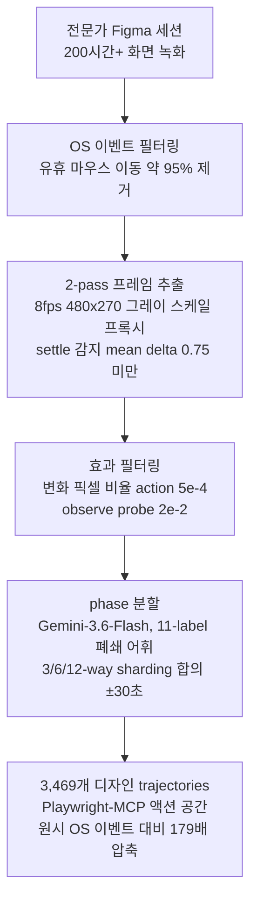

## 왜 읽어야 하나

Figma에서 디자인을 '하는' computer-use 에이전트를 만들거나, 그런 에이전트의 학습 데이터를 찾고 있는 ML 엔지니어라면 이 글이 바로 그 자료입니다. Patronus AI가 8월 20일에 오픈소스한 FigmaTrace는 디자인 작업에 특화된 첫 computer-use 데이터셋으로, 200시간이 넘는 전문가 화면 녹화를 3,469개 trajectories로 변환한 것이며, 라이선스는 CC-BY-4.0이라 상업적 SFT에 그대로 쓸 수 있습니다. 핵심 결론을 먼저 드립니다. 이 데이터셋의 가치는 trajectories 3,469개 자체보다, 화면 녹화를 학습 가능한 액션 시퀀스로 바꾸는 phase-based 분할 방법론입니다. 논문 실험에서 같은 데이터라도 context-length 기준 잘라내기와 phase 기준 잘라내기의 SFT 평균 성능 차이는 7.3%p였고, phase 방식이 이겼습니다.

## 개요

GUI agent 연구에서 데이터의 병목은 잘 알려져 있습니다. 웹 내비게이션 데이터(Mind2Web, VideoGUI 계열)는 양이 충분하지만, 디자인 워크 같은 '창의적 과정'을 담은 데이터는 거의 없습니다. 기존 시도들은 완성된 디자인 파일에서 역추적해 자동 주석을 만들거나, HTML을 Figma JSON으로 변환해 학습시키는 방향이었습니다. 하지만 완성물만 보고 과정을 역추측하면, 디자이너가 왜 그 순서로, 왜 그 요소를 골랐는지에 대한 신호가 빠집니다.

FigmaTrace가 접근한 지점은 바로 그 틈입니다. 전문가가 실제로 Figma를 조작하는 것을 OS 레벨에서 녹화하고, 그 원시 이벤트를 에이전트 학습용 trajectories로 가공합니다. 데이터셋 카드의 표현을 빌리면, 목적은 "완성물이 아니라 디자인 작업 뒤의 창의적 스킬과 결정"을 VLM에 가르기는 것입니다.

이 글은 FigmaTrace의 구성, 데이터 가공 파이프라인, 논문의 벤치마크 결과를 실제 수치와 함께 정리하고, ThakiCloud 관점에서의 활용 각도를 덧붙입니다.

## 이 데이터셋은 무엇인가

FigmaTrace는 Hugging Face의 [PatronusAI/figmatrace](https://huggingface.co/datasets/PatronusAI/figmatrace)에서 공개됐습니다. 규모와 구성은 다음과 같습니다.

- 원시 데이터: 전문가의 Figma 화면 녹화 200시간 이상
- trajectories: 3,469개 (train 2,883 / test 586)
- 태스크: 126개 long-horizon 태스크, 8개 디자이너 워크플로 카테고리
- 액션 공간: Playwright-MCP (`mouse_click`, `keyboard_type` 등)
- 라이선스: CC-BY-4.0, 언어 영어, 포맷 parquet
- 다운로드 크기: 약 22GB
- 첨부: [논문 PDF](https://cdn.patronus.ai/FigmaTrace.pdf), [SFT 모델](https://huggingface.co/PatronusAI/Qwen3.8-27B-Figmatrace-SFT), 원시 자산 Google Drive

8개 워크플로 카테고리는 pixel-perfect replication(참고본 그대로 재현), responsive adaptation(디바이스별 적응), theming with variables(변수 기반 테마화), sketch-to-Figma(스케치 변환), flaw injection/repair(결함 주입과 수정), edge-content resilience(극단 콘텐츠 대응), a11y remediation(접근성 교정), prototype wiring(프로토타입 연결)입니다. 이 중 pixel-perfect replication 같은 태스크는 결과 검증이 명확한 verifiable 태스크이고, theming이나 sketch-to-Figma는 답이 하나인 open-ended 태스크입니다. 두 종류를 섞어두는 것이 의도된 설계입니다.

### 데이터 가공 파이프라인

원시 화면 녹화가 trajectories가 되기까지의 단계가 이 데이터셋의 정체성입니다. 논문 3절을 따라 정리하면 다섯 단계입니다.

각 단계의 실제 숫자를 붙입니다.

**액션 필터링.** OS 레벨에서 녹화한 이벤트의 약 95%는 아무것도 바꾸지 않는 유휴 마우스 이동이었습니다. 나머지 액션을 Playwright-MCP 액션 집합에 인공 매핑하고, 입력이 없는데 화면만 바뀌는 구간(렌더 완료, 플러그인 로딩 등)에는 4초가 넘는 갭 안에서 2초 간격으로 `observe` probe를 삽입해 환경 전환 자체를 first-class 스텝으로 만듭니다.

**프레임 추출.** 한 세션이 4.5시간까지 길기 때문에 2-pass로 갑니다. 1-pass는 전체 영상을 8fps, 480x270 그레이 스케일로 디코딩해 후보 시점 t에 대해 before = t-0.15초, after = [t+0.2, t+2.0] 구간에서 연속 프레임의 평균 차가 0.75 아래가 되는 첫 프레임(화면이 안정된 시점)을 잡습니다. 고정 지연으로 잡으면 안 되는 이유는 메뉴 잠식이 평균 0.25초인 반면 이미지 드롭은 1초를 넘기기 때문입니다. 이 pass에서 5,718개 후보 중 5,717개의 settle 지점을 찾았습니다. 2-pass는 그 시점만 풀 해상도로 추출합니다.

**효과 필터링.** 액션 전후 프레임을 비교해 채널 최대 차가 6을 넘는 픽셀 비율(changed fraction)을 계산합니다. action은 5e-4 미만이면 "보이는 효과가 없다"고 제거되고, observe probe는 2e-2를 넘어야 장면 변화로 인정됩니다. 이 단계가 "전문가가 한 것"과 "작업물이 바뀐 것"을 분리합니다.

**phase 분할.** Gemini-3.6-Flash가 액션 로그 없이 영상만으로 11개 폐쇄 phase 어휘를 반환합니다. 어휘는 reference gathering, setup scaffolding, blocking layout, asset sourcing, content entry, styling typography, componentising, refinement polish, review qa, annotation handoff, navigation idle 입니다. 모델이 반환하는 shard 수는 원리가 없기 때문에 3-way, 6-way, 12-way 세 번을 돌려, 두 개 이상 sharding이 ±30초 안에 경계를 겹쳐놓은 것만 유지합니다.

여기서 논문의 재미있는 발견 하나가 있습니다. 분할 품질은 모델보다 해상도의 영향이 컸습니다. 강한 모델(Gemini-3.6-Flash)을 저해상도로 돌리면 Jaccard 0.244, dominant-skill 합의율 21%였고, 이전 연구가 쓴 더 약한 모델을 풀 해상도로 돌리면 0.601, 43%였습니다. 패널과 레이어 텍스트를 못 읽으니까 범용 label로 수렴하는 것입니다. 최종적으로 원시 OS 이벤트 대비 179배 압축을 이룩했습니다.

### 구조와 스키마

Hugging Face datasets-server API로 확인한 실제 스키마는 다음과 같습니다.

| 필드 | 타입 | 의미 |
|---|---|---|
| `session` | string | 출처 세션 식별자 |
| `example_index` | int32 | 예제 인덱스 |
| `segment_id` | int32 | 세션 내 세그먼트 |
| `dominant_skill` | string | 주 skill label |
| `skills` | list[string] | frequency 기반 skill labels |
| `phase` | string | 11-label 폐쇄 어휘 phase |
| `n_steps` | int32 | 스텝 수 |
| `start_t` / `end_t` | float32 | 세션 내 시간 구간 |
| `n_actions` / `n_images` | int32 | 액션·프레임 수 |
| `messages_json` | string | 대화형 messages 페이로드 |
| `preview` | Image | 대표 프레임을 미리보기 |
| `images` | list[Image] | 프레임 목록 |

split 규모는 train 2,883개(약 18.5GB), test 586개(약 3.9GB)입니다. phase 점유율은 componentising 21.6%, blocking layout 16.1%, refinement polish 14.8% 순으로, 구조 조립과 마무리 다듬기가 워크플로의 절반을 차지합니다. skill 점유율은 structural craft 56.9%, visual perception 12.7%로 auto-layout과 component 위생이 Figma 워크의 본체임을 보여줍니다.

데이터 생산자는 Upwork에서 계약한 Figma 경력 2년 이상 전문가들입니다. 18세 이상이고, starter task로 품질 검증 후 본 촬영에 돌렸습니다.

## 실제 실험 결과

논문을 쓴 팀은 FigmaTrace로 4개 VLM(Qwen3.6-35B-A3B, Qwen3.8-27B, Gemma4-31B, Muse-Glimmer-30B)을 SFT했습니다. ms-swift 프레임워크로, 35개 세션에서 47.6시간의 작업에 해당하는 92,472개 액션을 샘플링해 학습했습니다. trajectories에는 사전 주석된 reasoning chain이 없으므로 reasoning 없이 학습했고, 비교 대상 closed model 평가는 high reasoning effort로 했습니다.

평가 벤치는 GUI-Odyssey, AndroidControl, Mind2Web(vp800/vp1000), VideoGUI(directed/undirected) 네 종류입니다. 디자인 도메인 밖의 OOD 환경이 대부분이라, "디자인을 본 모델이 일반 GUI 내비게이션에도 이득을 보는가"를 재는 구성입니다. 논문 Table 2의 step-wise accuracy(%)를 그대로 옮깁니다.

| 모델 | GUI-Odyssey | AndroidControl | Mind2Web vp800 | vp1000 | VideoGUI dir | undir |
|---|---|---|---|---|---|---|
| Random baseline | 0.6 | 21.8 | 1.1 | 0.9 | 0.6 | 0.6 |
| Claude-Opus-5 | 47.3 | 87.3 | 100.0 | 75.3 | 71.3 | 40.7 |
| GPT-5.6-Sol | 44.0 | 83.2 | 91.3 | 69.7 | 77.7 | 29.6 |
| Qwen3.6-35B-A3B | 29.0 | 36.8 | 38.2 | 30.7 | 47.0 | 10.1 |
| Muse-Glimmer-30B | 29.3 | 59.3 | 64.7 | 65.3 | 64.7 | 28.7 |
| Gemma4-31B | 43.3 | 87.3 | 68.0 | 64.0 | 63.0 | 24.0 |
| Qwen3.8-27B | 44.0 | 82.7 | 69.3 | 65.3 | 65.3 | 26.0 |
| Qwen3.6-35B-A3B + SFT | 51.1 | 83.2 | 65.2 | 63.7 | 70.4 | 15.9 |
| Muse-Glimmer-30B + SFT | 53.2 | 84.5 | 70.2 | 70.1 | 73.0 | 32.8 |
| Gemma4-31B + SFT | 45.2 | 96.1 | 69.1 | 66.0 | 67.0 | 23.3 |
| **Qwen3.8-27B + SFT** | **53.7** | **99.1** | 70.7 | 68.7 | 71.3 | 19.3 |

읽어볼 점 세 개를 짚습니다.

**첫째, 27B 오픈 모델이 closed 모델을 넘는 구간이 실재합니다.** Qwen3.8-27B + SFT는 GUI-Odyssey 53.7로 Claude-Opus-5(47.3)를 6.4%p, AndroidControl 99.1로 87.3를 11.8%p 앞섭니다. Mind2Web vp800과 VideoGUI directed에서도 4개 오픈 모델 SFT 중 최고입니다. 단일 벤치 우연이 아니라 여러 OOD 환경에서 반복되는 패턴입니다.

**둘째, 최대 상승폭은 46%p입니다.** 논문 abstract의 "up to 46%"는 Qwen3.6-35B-A3B의 AndroidControl에서 나옵니다. base 36.8에서 SFT 후 83.2로, 46.4%p입니다. 같은 데이터셋이라도 base 모델의 시작점에 따라 상승폭이 크게 갈립니다.

**셋째, 도메인 내 평가도 함께 실었습니다.** ScreenSpot-Pro Creative split에서 Qwen3.8-27B는 base 29.3%에서 SFT 후 36.7%, +7.4%p였습니다. 디자인 대상 요소 클릭 정밀도 자체도 오른 것입니다.

### phase 분할 ablation

같은 Qwen3.8-27B, 같은 데이터로 phase-based SFT와 maximum-length SFT를 비교한 논문 Table 3입니다.

| 벤치마크 | base | phase SFT | length SFT |
|---|---|---|---|
| GUI-Odyssey | 44.0 | **53.7** | 40.0 |
| AndroidControl | 82.7 | **99.1** | 67.3 |
| Mind2Web vp800 | 69.3 | **70.7** | 69.3 |
| Mind2Web vp1000 | 65.3 | 68.7 | **70.0** |
| VideoGUI undirected | 26.0 | 19.3 | 21.3 |
| VideoGUI directed | 65.3 | **71.3** | 70.0 |
| 평균 | 58.8 | **63.8** | 56.3 |

phase 방식의 평균 63.8은 length 방식(56.3)보다 7.5%p 높고, base(58.8)보다도 5.0%p 높습니다. 논문은 이 격차를 7.3%p(absolute)로 보고합니다. 특히 AndroidControl에서 length SFT는 base(82.7)보다 오히려 낮은 67.3를 기록합니다. 긴 trajectories를 길이만 봐서 자르면 "행동 중간"에서 잘려 의도가 불명확해지고, phase 경계에서 자르면 스킬 단위 학습이 된다는 것이 논문의 해석입니다. AndroidControl에서 타격을 받은 행들은 행동 중간에 열리거나("Continue the work" stub), 페이지 좌표에 대한 방향 없는 지시인 경우였습니다.

### 왜 오르고 왜 떨어지는가

논문 RQ3는 SFT가 base 실패를 성공으로 바꾼 항목을 전수 손검토해 세 패턴을 찾습니다.

1. **요소 선택 정밀도.** GUI-Odyssey 상승분의 2/3은 base가 완전히 다른 UI 요소를 골랐던 경우입니다. base의 중앙값 오차가 약 457px였던 것이 SFT 후 약 15px 이내로 수렴합니다. 카테고리별로는 Media +22%p, Social +17%p가 가장 큽니다. 공유 아이콘, 비디오 카드, 채팅 입력창 같은 "바닥의 작은 요소"가 정정 대상이었습니다.
2. **좌표 규격화.** base는 post-training 때 배운 norm-1000 좌표 대신 raw 픽셀 좌표를 내뱉는 경우가 잦았습니다. 예컨대 (800, 212)는 픽셀 공간에서는 share 아이콘에 정확히 걸리지만 norm-1000으로 읽으면 360px 어긋납니다. 세로가 긴 프레임에서는 y > 1000이 뷰포트 밖으로 넘치는데, 분석한 150개 GUI-Odyssey 항목 중 base는 10개에서, SFT는 0개에서 나타났습니다.
3. **결단력.** AndroidControl의 상승은 전부 "base가 좌표를 안 냈거나 완전히 다른 요소를 골랐던" 항목에서 왔습니다. SFT는 항상 답을 내고, 요소만 고치면 평균 11px 안에 착지합니다.

반대로 SFT가 base 성공을 실패로 바꾼 항목에서도 두 패턴이 보입니다. 하나는 **반복**(repetition)입니다. Android 앱 플로우에서 연속 두 스텝에 사실상 같은 픽셀 ((331, 989) 이후 (331, 988))을 찍고, 정답 trajectory는 목록을 아래로 따라가는 경우입니다. 논문은 이를 전처리에서 유출된 노이즈 액션의 artifect로 해석합니다. 또 하나는 **화면 중앙 편중**으로, 브라우저 chrome의 대상이 content 중간 영역으로 밀려나는 것입니다. 데이터셋 카드에도 이 한계를 명시해두었습니다.

## ThakiCloud 제품 적용 시사점

FigmaTrace는 "computer-use 데이터를 디자인 도메인으로 확장했다"는 점과, "long-horizon 워크플로 데이터의 가공 방법론을 공개했다"는 점에서 ThakiCloud의 두 제품군 모두에 연결됩니다.

**Paxis 관점.** Paxis가 자동화하는 기업 워크플로의 상류에는 디자인 작업이 있습니다. Figma 파일은 제품 UI의 원천이고, 디자인 변경은 그 뒤의 개발·QA·배포 흐름을 통째로 움직입니다. FigmaTrace가 보여주는 컴퓨터 디자인 에이전트는 단순 내비게이션이 아니라 '과정'을 이해하는 워크플로 유형으로, Paxis의 워크플로 자동화 범위에 디자인 ops가 포함되는 시나리오의 학습 데이터가 됩니다. 데이터셋이 "완성물이 아니라 과정"을 학습 신호로 삼는 설계는, Paxis가 에이전트 실행 데이터(trajectory)를 일급 자원으로 다루는 방향과 같은 철학입니다.

**ai-platform(Maxis/Metis) 관점.** 이 SFT 레시피 자체는 우리가 운용하는 GPU 스택 위의 전형적 실험입니다. ms-swift + context parallelization, 27B VLM, 92,000개 액션 규모. base 모델 Qwen3.8-27B는 ThakiCloud의 서빙 엔진이 도는 것과 같은 모델 계보입니다. 데이터셋(약 22GB)과 base 모델(27B)은 단일 노드 실험 범위 안에 들어옵니다. 다만 여기서 주목할 것은 모델이나 데이터 양이 아니라 가공 방법론의 교훈입니다. 같은 92,472개 액션을 length 기준으로 자르면 base보다 낮아지고, phase 기준으로 자르면 +7%p가 나오는 것은, Maxis의 fine-tuning 파이프라인에서 long-horizon 실행 데이터를 받을 때 "어디서 자르는가"가 데이터 품질의 1차 변수가 될 수 있음을 보여줍니다. FigmaTrace의 11-label 폐쇄 어휘와 3-way/6-way/12-way 합의 분할은 그 "자르는 곳"을 정의하는 재현 가능한 방법입니다.

## 한계 및 반론

데이터셋과 논문 모두 스스로 한계를 명시하고 있고, 실제 수치에도 균열이 있습니다.

- **reasoning chain 부재.** trajectories에 사전 주석된 추론이 없어 reasoning-trace 모델 학습에는 추가 주석이 필요합니다. 논문은 reasoning 없이 학습했고, 이 선택이 성능에 어떤 영향을 주었는지는 분리해서 검증하지 않았습니다.
- **SFT가 모든 셀에서 이긴 것이 아닙니다.** VideoGUI undirected(방향 없는 개방 내비게이션)에서 Qwen3.8-27B는 base 26.0에서 SFT 후 19.3로 떨어졌고, Gemma4-31B도 24.0에서 23.3로 내렸습니다. 같은 셀에서 Qwen3.6-35B-A3B는 10.1에서 15.9로 올았지만 시작점이 낮았습니다. 디자인 데이터의 이득이 어디서 오고 어디서 새는지 base 모델과 태스크 유형에 따라 다릅니다.
- **노이즈 유출.** 반복 클릭 artifect와 화면 중앙 편중은 전처리를 통과한 노이즈의 결과입니다. 이 데이터로 학습한 모델은 유사 행동을 반복할 수 있다는 것은 카드에 적힌 그대로입니다.
- **규모.** 126개 태스크, 3,469개 trajectories, 영어-only, Figma 단일 앱. 웹 규모 GUI 데이터셋과 비교하면 작고, 앱 다양성도 없습니다. OOD 이득이 나온 환경들조차 GUI 내비게이션이라는 좁은 축입니다.
- **상업적 출처.** SME는 Upwork 계약으로 고용했고, open-ended 태스크의 결과에는 개별 전문가의 취향이 그대로 반영됩니다. "전문가 기준"이 누구의 기준인지는 명시되지 않았습니다.

## 정리

FigmaTrace의 한 줄 요약은 "디자인의 과정을 computer-use 학습 데이터로 변환하는 최초의 공개 시도가, 변환 방법(phase 분할)에서 값어치를 증명했다"입니다.

실무자 takeaway는 세 가지입니다. 디자인 에이전트 학습을 계획 중이라면, CC-BY-4.0 라이선스와 공개 SFT 레시피(ms-swift, 92k 액션, 4개 base) 덕분에 데이터 소싱부터 재현까지의 비용이 과거 computer-use 도메인 진입과 비교해 크게 낮아졌습니다. long-horizon 실행 데이터를 다루는다면, "길이로 자르지 말고 의미 단위로 자를 것"이라는 ablation 결과(+7.3%p)를 먼저 기억해두십시오. 그리고 27B 오픈 모델 + 도메인 SFT가 closed frontier 모델의 특정 GUI 축을 넘는다는 것은, 온프레미스 에이전트 구축의 비용 계산에 다시 한 줄을 더하는 결과입니다. FigmaTrace는 그 한 줄의 근거로 쓸 수 있는 데이터셋입니다.

## 출처

- [PatronusAI/figmatrace (Hugging Face dataset)](https://huggingface.co/datasets/PatronusAI/figmatrace) (CC-BY-4.0, parquet, train 2,883 / test 586)
- [FigmaTrace: Capturing Creative Nuances in Human Figma Design Workflows (논문 PDF)](https://cdn.patronus.ai/FigmaTrace.pdf) (Deshpande, Fujinuma, Markiewicz, Bansal, Jain, Saban, Maheshwari, Kannappan. Patronus AI, 2026)
- [PatronusAI/Qwen3.8-27B-Figmatrace-SFT (SFT 모델)](https://huggingface.co/PatronusAI/Qwen3.8-27B-Figmatrace-SFT) (base Qwen/Qwen3.8-27B, CC-BY-4.0)
- 소개 트윗: [@anandnk24 (Anand Kannappan, Patronus AI co-founder & CEO)](https://x.com/anandnk24/status/2090499988833107978)
- 원시 자산: [Google Drive](https://drive.google.com/drive/folders/1d7NQxjiAzALu3odUQSxbT6eO9czm96Oy?usp=drive_link)